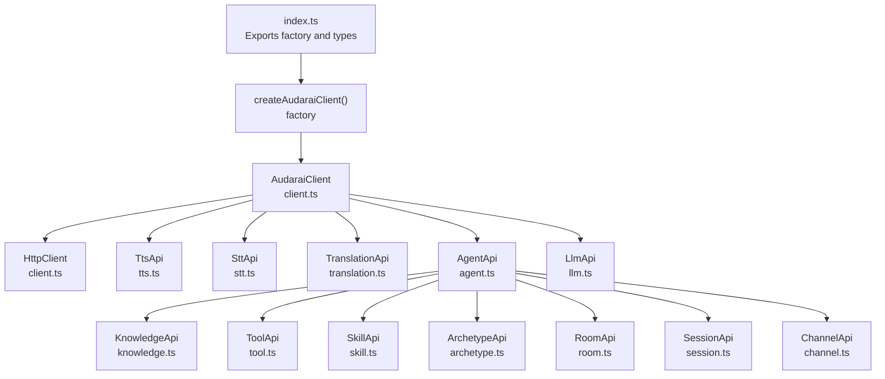
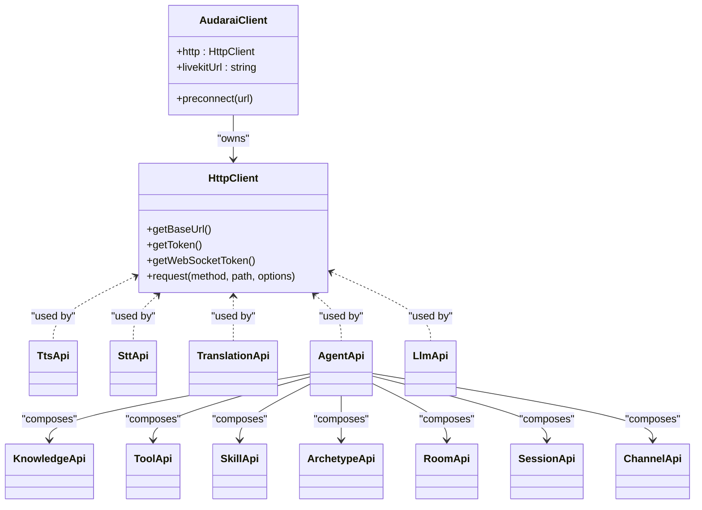
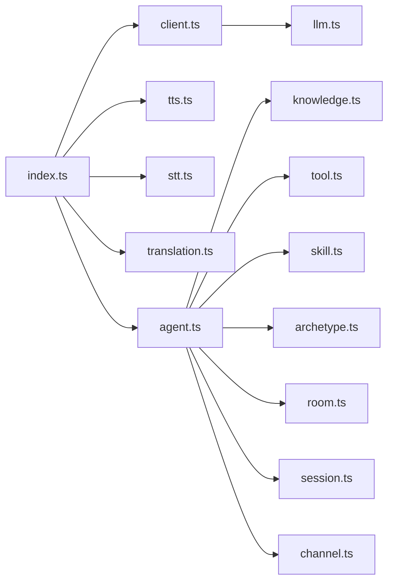

# API Reference

<cite>
**Referenced Files in This Document**
- [index.ts](file://src/index.ts)
- [client.ts](file://src/client.ts)
- [types.ts](file://src/types.ts)
- [tts.ts](file://src/tts.ts)
- [stt.ts](file://src/stt.ts)
- [translation.ts](file://src/translation.ts)
- [agent.ts](file://src/agent.ts)
- [knowledge.ts](file://src/knowledge.ts)
- [tool.ts](file://src/tool.ts)
- [skill.ts](file://src/skill.ts)
- [archetype.ts](file://src/archetype.ts)
- [room.ts](file://src/room.ts)
- [session.ts](file://src/session.ts)
- [channel.ts](file://src/channel.ts)
- [llm.ts](file://src/llm.ts)
</cite>

## Table of Contents
1. [Introduction](#introduction)
2. [Project Structure](#project-structure)
3. [Core Components](#core-components)
4. [Architecture Overview](#architecture-overview)
5. [Detailed Component Analysis](#detailed-component-analysis)
6. [Dependency Analysis](#dependency-analysis)
7. [Performance Considerations](#performance-considerations)
8. [Troubleshooting Guide](#troubleshooting-guide)
9. [Conclusion](#conclusion)
10. [Appendices](#appendices)

## Introduction
This API Reference documents the AudarAI JavaScript SDK, focusing on public interfaces, method signatures, parameters, return types, and usage patterns across the SDK’s functional areas: Text-to-Speech (TTS), Speech-to-Text (STT), Translation, Agent orchestration, Knowledge, Tools, Skills, Archetypes, Rooms, Sessions, Channels, and LLM model discovery. It consolidates exported types and classes, explains asynchronous operations, callback patterns, and WebSocket message handling, and provides cross-references between related methods.

## Project Structure
The SDK exposes a convenience factory to create a client with integrated APIs and exports a comprehensive set of types for configuration, models, and payloads. The client encapsulates HTTP and WebSocket token management and provides typed wrappers around the backend speech and agent APIs.

**Diagram sources**
- [index.ts:160-192](file://src/index.ts#L160-L192)
- [client.ts:215-410](file://src/client.ts#L215-L410)
- [tts.ts:11-231](file://src/tts.ts#L11-L231)
- [stt.ts:83-217](file://src/stt.ts#L83-L217)
- [translation.ts:111-277](file://src/translation.ts#L111-L277)
- [agent.ts:11-158](file://src/agent.ts#L11-L158)
- [knowledge.ts:12-137](file://src/knowledge.ts#L12-L137)
- [tool.ts:4-37](file://src/tool.ts#L4-L37)
- [skill.ts:4-33](file://src/skill.ts#L4-L33)
- [archetype.ts:4-33](file://src/archetype.ts#L4-L33)
- [room.ts:4-108](file://src/room.ts#L4-L108)
- [session.ts:4-235](file://src/session.ts#L4-L235)
- [channel.ts:4-44](file://src/channel.ts#L4-L44)
- [llm.ts:4-12](file://src/llm.ts#L4-L12)

**Section sources**
- [index.ts:1-193](file://src/index.ts#L1-L193)
- [client.ts:215-410](file://src/client.ts#L215-L410)

## Core Components
- AudaraiClient: Central client managing authentication, token lifecycle, and preconnection optimization for LiveKit. Provides access to HTTP and WebSocket token retrieval and URL normalization.
- HttpClient: Encapsulates HTTP requests, response parsing, and error handling, including automatic retries on 401 with token refresh.
- createAudaraiClient: Factory that constructs an AudaraiClient and attaches API modules (TTS, STT, Translation, Agent, Knowledge, Tool, Skill, Archetype, Room, Session, Channel, LLM) to it.

Key exported types include configuration, token data, model info, speaker profiles, STT/Translation/WebSocket message types, and agent/session/knowledge/tool/skill/archetype/room/channel payloads.

**Section sources**
- [client.ts:215-410](file://src/client.ts#L215-L410)
- [index.ts:160-192](file://src/index.ts#L160-L192)
- [types.ts:7-63](file://src/types.ts#L7-L63)
- [types.ts:111-126](file://src/types.ts#L111-L126)
- [types.ts:128-151](file://src/types.ts#L128-L151)
- [types.ts:153-166](file://src/types.ts#L153-L166)
- [types.ts:170-179](file://src/types.ts#L170-L179)
- [types.ts:190-264](file://src/types.ts#L190-L264)
- [types.ts:268-326](file://src/types.ts#L268-L326)
- [types.ts:350-427](file://src/types.ts#L350-L427)
- [types.ts:429-448](file://src/types.ts#L429-L448)
- [types.ts:452-498](file://src/types.ts#L452-L498)
- [types.ts:505-660](file://src/types.ts#L505-L660)
- [types.ts:675-796](file://src/types.ts#L675-L796)
- [types.ts:800-800](file://src/types.ts#L800-L800)

## Architecture Overview
The SDK follows a layered architecture:
- Export surface: index.ts defines the public API and factory.
- Client layer: AudaraiClient manages authentication modes and preconnects to LiveKit.
- HTTP layer: HttpClient handles token acquisition, request building, and response/error handling.
- Feature APIs: TTS, STT, Translation, Agent, Knowledge, Tool, Skill, Archetype, Room, Session, Channel, and LLM wrap HttpClient to expose domain-specific methods.

**Diagram sources**
- [client.ts:215-410](file://src/client.ts#L215-L410)
- [tts.ts:11-231](file://src/tts.ts#L11-L231)
- [stt.ts:83-217](file://src/stt.ts#L83-L217)
- [translation.ts:111-277](file://src/translation.ts#L111-L277)
- [agent.ts:11-158](file://src/agent.ts#L11-L158)
- [knowledge.ts:12-137](file://src/knowledge.ts#L12-L137)
- [tool.ts:4-37](file://src/tool.ts#L4-L37)
- [skill.ts:4-33](file://src/skill.ts#L4-L33)
- [archetype.ts:4-33](file://src/archetype.ts#L4-L33)
- [room.ts:4-108](file://src/room.ts#L4-L108)
- [session.ts:4-235](file://src/session.ts#L4-L235)
- [channel.ts:4-44](file://src/channel.ts#L4-L44)
- [llm.ts:4-12](file://src/llm.ts#L4-L12)

## Detailed Component Analysis

### Authentication and Client Initialization
- Authentication modes:
  - Publishable key: obtains short-lived session tokens for HTTP/WebSocket.
  - Access token (JWT): used directly for HTTP; exchanges for session tokens for WebSocket.
  - API key: used directly for HTTP; exchanges for session tokens for WebSocket.
  - App ID (+ optional App Secret): backend uses Basic auth; frontend flows mirror publishable key.
- Token refresh and thresholds:
  - TokenManager proactively refreshes near expiry based on a configurable threshold.
  - On 401, HttpClient can either re-fetch via provider or use onTokenRefresh callback to update JWT.
- Preconnection:
  - AudaraiClient.preconnect optimizes LiveKit server connectivity via DNS/TLS warmup.

Usage examples are provided in the factory documentation.

**Section sources**
- [client.ts:225-369](file://src/client.ts#L225-L369)
- [client.ts:52-91](file://src/client.ts#L52-L91)
- [client.ts:133-213](file://src/client.ts#L133-L213)
- [client.ts:380-409](file://src/client.ts#L380-L409)
- [index.ts:142-192](file://src/index.ts#L142-L192)

### TTS (Text-to-Speech)
Methods:
- synthesize(text, options?): Returns ArrayBuffer of audio.
- synthesizeStream(text, options?): Returns Response for streaming consumption.
- listModels(): Returns ModelInfo[].
- listSpeakers(): Returns string[] (backward compatibility).
- listSpeakersDetailed(modelName?): Returns Speaker[].
- addSpeaker(name, audioFile, transcript, options?): Uploads voice profile.
- deleteSpeaker(name): Deletes a custom speaker.
- updateSpeaker(name, patch): Updates description/metadata/compatible models.
- renameSpeaker(name, newName): Renames a speaker.
- replaceSpeakerAudio(name, audioFile, transcript): Replaces reference audio.
- getSpeakerAudio(name): Returns Blob of stored reference audio.

Parameters and defaults:
- SynthesizeOptions includes voice, model, response_format, speed, and sampling controls (temperature, top_p, top_k, seed, min_tokens, max_tokens). Defaults are applied when unspecified.

Validation and constraints:
- Compatible models must be provided for newly uploaded voices to ensure proper encoding lifecycles.
- Word-level timestamps require forced_alignment in STT-related flows.

Asynchronous behavior:
- Binary responses are handled via expectBinary; callers should convert to ArrayBuffer/Blob as needed.

**Section sources**
- [tts.ts:14-38](file://src/tts.ts#L14-L38)
- [tts.ts:44-66](file://src/tts.ts#L44-L66)
- [tts.ts:68-71](file://src/tts.ts#L68-L71)
- [tts.ts:73-94](file://src/tts.ts#L73-L94)
- [tts.ts:106-150](file://src/tts.ts#L106-L150)
- [tts.ts:157-178](file://src/tts.ts#L157-L178)
- [tts.ts:185-197](file://src/tts.ts#L185-L197)
- [tts.ts:203-216](file://src/tts.ts#L203-L216)
- [tts.ts:222-229](file://src/tts.ts#L222-L229)
- [types.ts:128-151](file://src/types.ts#L128-L151)
- [types.ts:111-126](file://src/types.ts#L111-L126)

### STT (Speech-to-Text)
Methods:
- listModels(): Returns ModelInfo[].
- transcribe(audioBlobOrFile, options?): Returns TranscribeResult.
- transcribeStream(audioBlobOrFile, options?, handlers?): Streams SSE events and returns final TranscribeResult.
- connectWebSocket(options?, handlers?): Opens WebSocket for real-time STT; wraps messages and forwards to handlers.

WebSocket message types:
- Ready, Partial, Segment, Final, Error.

Streaming behavior:
- SSE decoding parses data: lines and extracts JSON events; handlers.onChunk/onFinal invoked accordingly.

**Section sources**
- [stt.ts:86-89](file://src/stt.ts#L86-L89)
- [stt.ts:91-102](file://src/stt.ts#L91-L102)
- [stt.ts:116-183](file://src/stt.ts#L116-L183)
- [stt.ts:198-215](file://src/stt.ts#L198-L215)
- [types.ts:153-166](file://src/types.ts#L153-L166)
- [types.ts:170-179](file://src/types.ts#L170-L179)
- [types.ts:190-264](file://src/types.ts#L190-L264)

### Translation (STT → Translation → TTS)
Methods:
- translate(audioBlobOrFile, options, handlers?): Streams SSE events across STT, Translation, and TTS stages; returns TranslationResult.
- connectWebSocket(options, handlers?): Opens WebSocket for real-time translation; forwards typed messages.

WebSocket message types:
- Ready, STT partial/segment/final, Translation partial/complete, TTS chunk/complete, Segment complete, Pipeline complete, Error.

Callbacks:
- Handlers support onStatus, onSttPartial, onSttFinal, onTranslationPartial, onTranslationComplete, onTtsChunk, onTtsComplete, onPipelineComplete, onError.

**Section sources**
- [translation.ts:132-228](file://src/translation.ts#L132-L228)
- [translation.ts:258-275](file://src/translation.ts#L258-L275)
- [types.ts:268-326](file://src/types.ts#L268-L326)
- [types.ts:350-427](file://src/types.ts#L350-L427)
- [types.ts:429-448](file://src/types.ts#L429-L448)

### Agent
Primary methods:
- listAgents(), listPlatformAgents(), createAgent(data), getAgent(id), updateAgent(id, data), deleteAgent(id).
- listAgentVoices(agentId): Resolves compatible voices for an agent’s TTS model.
- chat(agentId, message, options?): Quick-start voice session; returns session/room identifiers.
- createVoiceSession(agentId, options?): Single-call creation of voice session with LiveKit token.

Nested APIs exposed:
- agent.knowledge, agent.tools, agent.skills, agent.archetypes, agent.rooms, agent.sessions, agent.channels.

**Section sources**
- [agent.ts:32-62](file://src/agent.ts#L32-L62)
- [agent.ts:77-82](file://src/agent.ts#L77-L82)
- [agent.ts:95-108](file://src/agent.ts#L95-L108)
- [agent.ts:144-156](file://src/agent.ts#L144-L156)
- [agent.ts:11-28](file://src/agent.ts#L11-L28)

### Knowledge
Methods:
- list(), create(data), get(id), update(id, data), delete(id).
- ingest(id, data): Ingest plain text or URL; poll get() until embedding_status is completed.
- ingestFile(id, file, filename?): Upload file for ingestion.
- reingest(id): Re-ingest from source URI (URL sources only).
- listDocuments(id): List stored chunks.
- deleteDocument(id, docId): Delete a chunk.
- search(id, data): Semantic search over the knowledge base.

**Section sources**
- [knowledge.ts:17-51](file://src/knowledge.ts#L17-L51)
- [knowledge.ts:63-97](file://src/knowledge.ts#L63-L97)
- [knowledge.ts:102-114](file://src/knowledge.ts#L102-L114)
- [knowledge.ts:126-135](file://src/knowledge.ts#L126-L135)

### Tools
Methods:
- list(), create(data), listBuiltins(), get(id), update(id, data), delete(id).

**Section sources**
- [tool.ts:7-35](file://src/tool.ts#L7-L35)

### Skills
Methods:
- list(), create(data), get(id), update(id, data), delete(id).

**Section sources**
- [skill.ts:7-31](file://src/skill.ts#L7-L31)

### Archetypes
Methods:
- list(), create(data), get(id), update(id, data), delete(id).

**Section sources**
- [archetype.ts:7-31](file://src/archetype.ts#L7-L31)

### Rooms
Methods:
- list(), create(data), get(id), update(id, data), delete(id) [archive].
- generatePhases(roomId, speakingRules): Generate phases from rules.
- listAgents(roomId), addAgent(roomId, agentId, count?), removeAgent(roomId, agentId).
- startSession(roomId, data?): Start a new session; supports voice_id override.
- listSessions(roomId): List sessions for the room.

**Section sources**
- [room.ts:9-48](file://src/room.ts#L9-L48)
- [room.ts:52-70](file://src/room.ts#L52-L70)
- [room.ts:82-99](file://src/room.ts#L82-L99)
- [room.ts:102-107](file://src/room.ts#L102-L107)

### Sessions
Methods:
- list(params?), listMine(params?), get(id), pause(id), resume(id), end(id).
- getRecording(id): Retrieve recording metadata/status.
- getParticipants(id): List current participants.
- listParticipantContexts(id, params?), upsertParticipantContext(id, refId, data), deleteParticipantContext(id, refId).
- listMessages(id, params?), appendMessage(id, data).
- getLiveKitToken(id, data?), join(id, data?): Obtain LiveKit tokens for voice sessions.
- dispatch(id, data): Moderator-led dispatch to an agent.
- replyToMember(id, data): Shortcut to dispatch to a specific agent.
- createAction(id, data), listActions(id, params?), getActionCounts(id, params): Manage session actions.

**Section sources**
- [session.ts:9-53](file://src/session.ts#L9-L53)
- [session.ts:55-100](file://src/session.ts#L55-L100)
- [session.ts:104-124](file://src/session.ts#L104-L124)
- [session.ts:137-160](file://src/session.ts#L137-L160)
- [session.ts:173-192](file://src/session.ts#L173-L192)
- [session.ts:200-233](file://src/session.ts#L200-L233)

### Channels
Methods:
- list(), create(data), get(id), update(id, data), delete(id) [deactivate].

**Section sources**
- [channel.ts:7-42](file://src/channel.ts#L7-L42)

### LLM Models
Method:
- listModels(): Returns ModelInfo[].

**Section sources**
- [llm.ts:7-10](file://src/llm.ts#L7-L10)

## Dependency Analysis
- Export surface depends on internal modules; index.ts re-exports types and classes for ergonomic consumption.
- AudaraiClient composes HttpClient and attaches feature APIs.
- Feature APIs depend on HttpClient for HTTP operations and on WebSocket URLs for real-time flows.
- AgentApi composes nested APIs (Knowledge, Tool, Skill, Archetype, Room, Session, Channel).

**Diagram sources**
- [index.ts:1-193](file://src/index.ts#L1-L193)
- [client.ts:215-410](file://src/client.ts#L215-L410)
- [tts.ts:11-231](file://src/tts.ts#L11-L231)
- [stt.ts:83-217](file://src/stt.ts#L83-L217)
- [translation.ts:111-277](file://src/translation.ts#L111-L277)
- [agent.ts:11-158](file://src/agent.ts#L11-L158)
- [knowledge.ts:12-137](file://src/knowledge.ts#L12-L137)
- [tool.ts:4-37](file://src/tool.ts#L4-L37)
- [skill.ts:4-33](file://src/skill.ts#L4-L33)
- [archetype.ts:4-33](file://src/archetype.ts#L4-L33)
- [room.ts:4-108](file://src/room.ts#L4-L108)
- [session.ts:4-235](file://src/session.ts#L4-L235)
- [channel.ts:4-44](file://src/channel.ts#L4-L44)
- [llm.ts:4-12](file://src/llm.ts#L4-L12)

**Section sources**
- [index.ts:1-193](file://src/index.ts#L1-L193)

## Performance Considerations
- Token refresh threshold: Configure refreshThresholdSeconds to balance freshness and refresh frequency.
- Preconnection: Use AudaraiClient.preconnect to warm DNS/TLS to LiveKit servers for reduced latency.
- Streaming: Prefer SSE/WS endpoints for low-latency real-time results; ensure handlers process events promptly.
- Binary responses: Convert audio responses to ArrayBuffer/Blob efficiently; avoid unnecessary copies.

[No sources needed since this section provides general guidance]

## Troubleshooting Guide
Common error scenarios and handling:
- AuthenticationError: Thrown when token provider is missing or JWT is invalid/expired; use onTokenRefresh for dynamic JWT renewal.
- InsufficientBalanceError: Indicates insufficient credits; handle by billing top-up or adjusting usage.
- RateLimitedError: Returned on 429 with optional Retry-After header; implement exponential backoff and retry strategies.
- WebSocket errors: Use onReady/onError/onClose handlers to detect readiness and failures; resend audio frames as needed.

**Section sources**
- [client.ts:187-212](file://src/client.ts#L187-L212)
- [stt.ts:27-58](file://src/stt.ts#L27-L58)
- [translation.ts:42-86](file://src/translation.ts#L42-L86)

## Conclusion
The AudarAI SDK provides a cohesive, typed interface for speech and agent orchestration workflows. It supports flexible authentication modes, robust token management, real-time streaming via SSE/WS, and a modular API surface for agents, knowledge, tools, skills, archetypes, rooms, sessions, and channels. Use the factory to initialize the client, leverage typed options for precise control, and follow the callback and WS patterns for responsive real-time experiences.

[No sources needed since this section summarizes without analyzing specific files]

## Appendices

### API Versioning and Deprecation
- The SDK exposes versioned endpoints (e.g., /v1/speech/*, /v1/agent/*). Adhere to documented request/response shapes; changes typically introduce new fields rather than removing existing ones.
- Deprecation notices are not explicitly annotated in the code; consult release notes or contact support for migration guidance.

[No sources needed since this section provides general guidance]

### Cross-References Between Related Methods
- Agent voice selection and sessions:
  - listAgentVoices(agentId) informs voice choices for chat/createVoiceSession.
  - chat/createVoiceSession return session_id; use sessions.getLiveKitToken to obtain credentials for LiveKit.
- Knowledge ingestion and search:
  - ingest/ingestFile/reingest transitions embedding_status; poll get() until completion, then call search().
- Translation pipeline:
  - translate/connectWebSocket coordinate STT, Translation, and TTS stages; use handlers to react to intermediate events.

**Section sources**
- [agent.ts:77-82](file://src/agent.ts#L77-L82)
- [agent.ts:95-108](file://src/agent.ts#L95-L108)
- [agent.ts:144-156](file://src/agent.ts#L144-L156)
- [session.ts:137-160](file://src/session.ts#L137-L160)
- [knowledge.ts:63-97](file://src/knowledge.ts#L63-L97)
- [knowledge.ts:126-135](file://src/knowledge.ts#L126-L135)
- [translation.ts:132-228](file://src/translation.ts#L132-L228)
- [translation.ts:258-275](file://src/translation.ts#L258-L275)