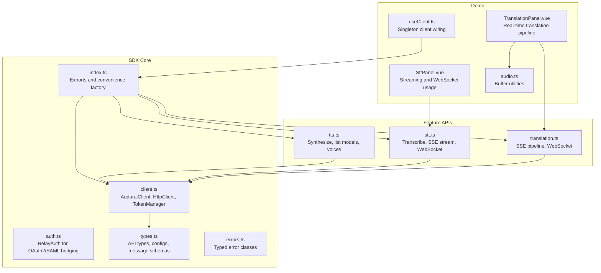
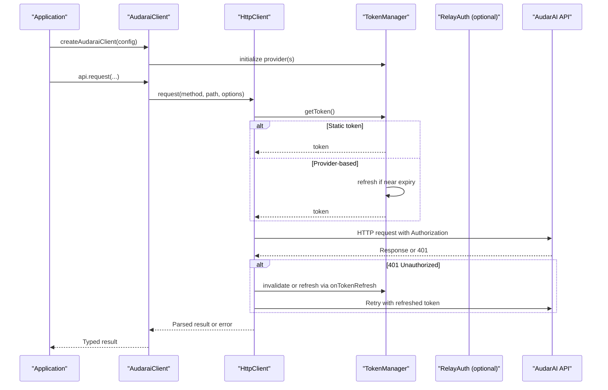
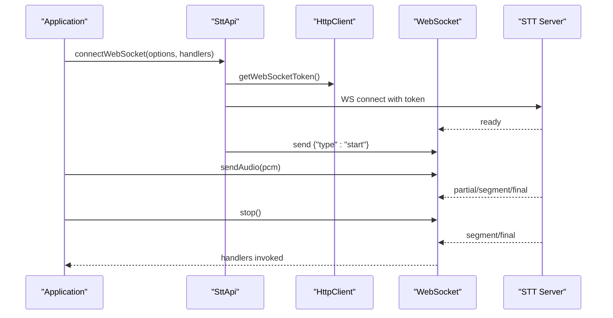
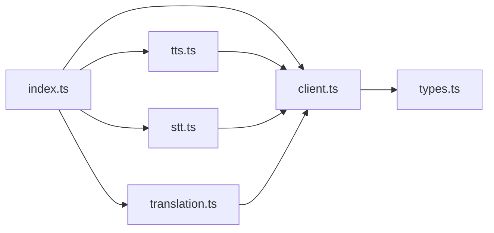

# Advanced Topics

<cite>
**Referenced Files in This Document**
- [index.ts](file://src/index.ts)
- [client.ts](file://src/client.ts)
- [auth.ts](file://src/auth.ts)
- [types.ts](file://src/types.ts)
- [errors.ts](file://src/errors.ts)
- [tts.ts](file://src/tts.ts)
- [stt.ts](file://src/stt.ts)
- [translation.ts](file://src/translation.ts)
- [package.json](file://package.json)
- [useClient.ts](file://demo/src/composables/useClient.ts)
- [SttPanel.vue](file://demo/src/components/SttPanel.vue)
- [TranslationPanel.vue](file://demo/src/components/TranslationPanel.vue)
- [audio.ts](file://demo/src/utils/audio.ts)
</cite>

## Table of Contents
1. [Introduction](#introduction)
2. [Project Structure](#project-structure)
3. [Core Components](#core-components)
4. [Architecture Overview](#architecture-overview)
5. [Detailed Component Analysis](#detailed-component-analysis)
6. [Dependency Analysis](#dependency-analysis)
7. [Performance Considerations](#performance-considerations)
8. [Security Considerations](#security-considerations)
9. [Monitoring and Observability](#monitoring-and-observability)
10. [Expert-Level Usage Patterns](#expert-level-usage-patterns)
11. [Troubleshooting Guide](#troubleshooting-guide)
12. [Enterprise Deployment Considerations](#enterprise-deployment-considerations)
13. [Conclusion](#conclusion)

## Introduction
This document provides advanced guidance for the AudarAI SDK focused on performance optimization, security, monitoring, and expert-level usage patterns. It synthesizes the SDK’s architecture, authentication flows, streaming protocols, and real-time capabilities to help developers tune performance, harden security, instrument observability, and integrate at scale.

## Project Structure
The SDK exposes a cohesive client facade with typed APIs for TTS, STT, Translation, and higher-level orchestration resources. The demo showcases real-world usage patterns for streaming and WebSocket-based workflows.

**Diagram sources**
- [index.ts:1-193](file://src/index.ts#L1-L193)
- [client.ts:215-411](file://src/client.ts#L215-L411)
- [auth.ts:102-272](file://src/auth.ts#L102-L272)
- [types.ts:1-1265](file://src/types.ts#L1-L1265)
- [errors.ts:1-43](file://src/errors.ts#L1-L43)
- [tts.ts:1-231](file://src/tts.ts#L1-L231)
- [stt.ts:1-217](file://src/stt.ts#L1-L217)
- [translation.ts:1-277](file://src/translation.ts#L1-L277)
- [useClient.ts:1-36](file://demo/src/composables/useClient.ts#L1-L36)
- [SttPanel.vue:1-349](file://demo/src/components/SttPanel.vue#L1-L349)
- [TranslationPanel.vue:1-469](file://demo/src/components/TranslationPanel.vue#L1-L469)
- [audio.ts:1-69](file://demo/src/utils/audio.ts#L1-L69)

**Section sources**
- [index.ts:1-193](file://src/index.ts#L1-L193)
- [client.ts:215-411](file://src/client.ts#L215-L411)
- [types.ts:1-1265](file://src/types.ts#L1-L1265)
- [package.json:1-26](file://package.json#L1-L26)

## Core Components
- AudaraiClient: Central client that configures authentication modes, manages token lifecycles, and exposes typed APIs. It supports publishable key, access token (OAuth2/JWT), API key, and appId/appSecret combinations. It preconnects to LiveKit to reduce cold-start latency.
- HttpClient: Encapsulates HTTP requests, token injection, 401 handling, and response parsing. It supports separate token providers for WebSocket tokens.
- TokenManager: Manages token acquisition, expiration thresholds, and concurrency-safe refresh.
- RelayAuth: Bridges browser OAuth2/SAML via a relay service, persisting tokens and refreshing them transparently.
- Feature APIs: TTS, STT, and Translation APIs wrap HttpClient to provide typed operations and streaming/WebSocket helpers.

Key advanced capabilities:
- Proactive token refresh before expiry to minimize latency spikes.
- WebSocket token exchange for STT/Translation sessions.
- SSE streaming for real-time feedback with structured handlers.
- LiveKit preconnect optimization for reduced handshake latency.

**Section sources**
- [client.ts:215-411](file://src/client.ts#L215-L411)
- [client.ts:93-213](file://src/client.ts#L93-L213)
- [client.ts:22-91](file://src/client.ts#L22-L91)
- [auth.ts:102-272](file://src/auth.ts#L102-L272)
- [tts.ts:11-231](file://src/tts.ts#L11-L231)
- [stt.ts:83-217](file://src/stt.ts#L83-L217)
- [translation.ts:111-277](file://src/translation.ts#L111-L277)

## Architecture Overview
The SDK follows a layered design:
- Configuration layer: Authentication modes and token providers.
- Transport layer: HttpClient with token-aware request/response handling.
- Feature layer: Typed APIs for TTS, STT, Translation with streaming and WebSocket integrations.
- Demo layer: Real-world usage patterns for streaming and WebSocket pipelines.

**Diagram sources**
- [client.ts:215-411](file://src/client.ts#L215-L411)
- [client.ts:93-213](file://src/client.ts#L93-L213)
- [client.ts:22-91](file://src/client.ts#L22-L91)
- [auth.ts:102-272](file://src/auth.ts#L102-L272)

## Detailed Component Analysis

### Authentication and Token Management
- Modes:
  - Publishable key: HTTP requests use session tokens minted server-side; WebSocket tokens are exchanged on-demand.
  - Access token (JWT): HTTP uses JWT directly; WebSocket tokens are exchanged via a session endpoint.
  - API key: HTTP uses the key directly; WebSocket tokens are exchanged.
  - App ID/App Secret: Backend mode uses Basic auth; frontend mode behaves like publishable key.
- TokenManager:
  - Proactive refresh before expiry (threshold configurable).
  - Mutex prevents concurrent refreshes.
  - Supports explicit expires_at to mitigate clock drift.
- RelayAuth:
  - Handles OAuth2 callback exchange, token persistence, and refresh.
  - Provides profile decoding and logout with id_token_hint support.

```mermaid
classDiagram
class TokenManager {
-string _token
-number _expiresAt
-Promise~string~ _refreshing
-number _threshold
-(() => Promise~TokenData~)? _provider
+setStatic(token) void
+invalidate() void
+seed(token, expiresAt) void
+getToken() Promise~string~
-_refresh() Promise~string~
}
class HttpClient {
-string _baseUrl
-TokenManager _tokenManager
-TokenManager _wsTokenManager
-fetch _fetch
-(() => Promise~string~)? _onTokenRefresh
-string _authScheme
+getToken() Promise~string~
+getWebSocketToken() Promise~string~
+request(method, path, options) Promise~T~
}
class AudaraiClient {
+http HttpClient
-TokenManager _tokenManager
-string _livekitUrl
+preconnect(url?) void
}
class RelayAuth {
-string _baseUrl
-AuthStorage _storage
-string _key
-number _threshold
+login(returnTo?) void
+handleCallback() Promise~boolean~
+isAuthenticated() boolean
+getAccessToken() Promise~string~
+getIdToken() string?
+getProfile() Record~string, unknown~?
+logout(returnTo?) void
+clearLocal() void
}
AudaraiClient --> HttpClient : "composes"
HttpClient --> TokenManager : "uses"
AudaraiClient --> TokenManager : "initializes"
RelayAuth --> AuthStorage : "persists tokens"
```

**Diagram sources**
- [client.ts:22-91](file://src/client.ts#L22-L91)
- [client.ts:93-213](file://src/client.ts#L93-L213)
- [client.ts:215-411](file://src/client.ts#L215-L411)
- [auth.ts:102-272](file://src/auth.ts#L102-L272)

**Section sources**
- [client.ts:215-411](file://src/client.ts#L215-L411)
- [client.ts:22-91](file://src/client.ts#L22-L91)
- [auth.ts:102-272](file://src/auth.ts#L102-L272)

### Streaming and WebSocket Pipelines
- STT:
  - SSE streaming parses server-sent events and invokes handlers for chunks and final results.
  - WebSocket wrapper handles v2 protocol handshake, sending PCM frames, and structured messages.
- Translation:
  - SSE pipeline emits status, STT partial/final, translation partial/complete, TTS chunks, and completion events.
  - WebSocket wrapper mirrors the SSE message types for real-time sessions.

**Diagram sources**
- [stt.ts:198-216](file://src/stt.ts#L198-L216)
- [stt.ts:21-81](file://src/stt.ts#L21-L81)

**Section sources**
- [stt.ts:83-217](file://src/stt.ts#L83-L217)
- [translation.ts:111-277](file://src/translation.ts#L111-L277)

### Data Models and Type Safety
- Configurations: AudaraiClientConfig defines supported authentication modes and refresh thresholds.
- Streaming types: Extensive message schemas for STT and Translation SSE/WebSocket ensure robust client handling.
- Resource models: Rich types for agents, rooms, sessions, knowledge, tools, and skills.

**Section sources**
- [types.ts:7-63](file://src/types.ts#L7-L63)
- [types.ts:168-264](file://src/types.ts#L168-L264)
- [types.ts:266-427](file://src/types.ts#L266-L427)

## Dependency Analysis
- Export surface: index.ts re-exports the client, auth, and all feature APIs plus types.
- Build outputs: package.json defines CJS/ESM builds and d.ts declarations.
- Runtime dependencies: The SDK relies on global fetch and browser/WebCrypto/WebSocket APIs.

**Diagram sources**
- [index.ts:1-193](file://src/index.ts#L1-L193)
- [client.ts:1-411](file://src/client.ts#L1-L411)
- [tts.ts:1-231](file://src/tts.ts#L1-L231)
- [stt.ts:1-217](file://src/stt.ts#L1-L217)
- [translation.ts:1-277](file://src/translation.ts#L1-L277)

**Section sources**
- [index.ts:1-193](file://src/index.ts#L1-L193)
- [package.json:1-26](file://package.json#L1-L26)

## Performance Considerations
- Token lifecycle:
  - Tune refreshThresholdSeconds to balance freshness and refresh overhead.
  - Use proactive refresh to avoid latency spikes around expiry.
- Network optimization:
  - Enable livekitUrl and call preconnect to warm DNS/TLS for LiveKit servers.
  - Use SSE streaming for low-latency intermediate results; fall back to file upload for long audio.
- Memory management:
  - Avoid retaining large audio buffers; release Object URLs promptly.
  - Merge TTS chunks incrementally and dispose of intermediate buffers.
- Streaming efficiency:
  - STT/Translation WebSocket: send PCM frames at 16 kHz, 16-bit, mono; batch frames to reduce overhead.
  - Use segment boundaries to process and discard completed audio chunks.
- Concurrency:
  - TokenManager prevents concurrent refreshes; ensure single provider per client to avoid contention.
- Throttling:
  - Respect server-side throttling (e.g., partial messages ~120 ms intervals) to avoid flooding.

**Section sources**
- [client.ts:225-411](file://src/client.ts#L225-L411)
- [stt.ts:198-216](file://src/stt.ts#L198-L216)
- [translation.ts:258-276](file://src/translation.ts#L258-L276)
- [audio.ts:16-69](file://demo/src/utils/audio.ts#L16-L69)

## Security Considerations
- Authentication modes:
  - Prefer access token (JWT) with onTokenRefresh for OAuth2/SAML integrations.
  - Avoid exposing appSecret in browsers; reserve for backend-only usage.
  - Use publishable key for frontend-only flows; note all requests use session tokens.
- Token handling:
  - TokenManager supports explicit expires_at to mitigate clock skew.
  - On 401, prefer onTokenRefresh to obtain a fresh JWT; otherwise invalidate and re-fetch via provider.
- Secure communication:
  - All HTTP traffic should use HTTPS; WebSocket uses wss:// for secure channels.
- Storage:
  - RelayAuth supports pluggable AuthStorage; use secure storage in SSR environments.
- Least privilege:
  - Scope tokens appropriately; restrict origins for appId-based flows.

**Section sources**
- [client.ts:225-411](file://src/client.ts#L225-L411)
- [client.ts:133-213](file://src/client.ts#L133-L213)
- [auth.ts:102-272](file://src/auth.ts#L102-L272)

## Monitoring and Observability
- Logging:
  - Use structured logs for SSE/WS events (status, partial, final, error).
  - Track pipeline stages: STT, translation, TTS, completion.
- Metrics:
  - Measure latency from ready to final, segment durations, and chunk sizes.
  - Track error rates by stage and segment.
- Error handling:
  - Distinguish between transient (retry) and terminal (fallback) errors.
  - Use typed errors (AuthenticationError, RateLimitedError, ApiError) for instrumentation.
- Tracing:
  - Correlate session_id across STT/Translation/WS flows for end-to-end tracing.

**Section sources**
- [errors.ts:1-43](file://src/errors.ts#L1-L43)
- [stt.ts:116-183](file://src/stt.ts#L116-L183)
- [translation.ts:132-228](file://src/translation.ts#L132-L228)

## Expert-Level Usage Patterns
- Custom token providers:
  - Implement onTokenRefresh for OAuth2 token rotation; ensure it returns a valid JWT.
  - Use separate token providers for HTTP and WebSocket tokens when needed.
- Advanced streaming:
  - STT: throttle UI updates to partial/segment events; compute timestamps for interactive overlays.
  - Translation: accumulate segments and merge TTS chunks per segment; play segment-complete audio immediately.
- WebSocket lifecycle:
  - Gracefully handle onReady, onSegment, onPipelineComplete, and onClose.
  - Stop streaming with {"type":"stop"} and await finalization.
- Multi-agent orchestration:
  - Use rooms and sessions to coordinate multiple agents; apply media overrides per session.
- Tooling and extensibility:
  - Integrate custom tools via ToolApi; leverage SSE/WS handlers to surface tool execution progress.

**Section sources**
- [client.ts:225-411](file://src/client.ts#L225-L411)
- [stt.ts:198-216](file://src/stt.ts#L198-L216)
- [translation.ts:258-276](file://src/translation.ts#L258-L276)
- [types.ts:673-796](file://src/types.ts#L673-L796)

## Troubleshooting Guide
Common issues and resolutions:
- Authentication failures:
  - Verify exactly one authentication mode is configured.
  - Ensure onTokenRefresh returns a non-empty JWT; otherwise, invalidate token and retry.
- 429 rate limits:
  - Respect Retry-After header; implement exponential backoff.
- WebSocket disconnects:
  - Reconnect and resend PCM frames; rely on server-side buffering.
- Audio artifacts:
  - Confirm PCM format (16 kHz, 16-bit, mono); convert Float32 to Int16 if needed.
- Memory leaks:
  - Release Object URLs; avoid retaining large concatenated buffers.

**Section sources**
- [client.ts:225-411](file://src/client.ts#L225-L411)
- [client.ts:133-213](file://src/client.ts#L133-L213)
- [audio.ts:28-42](file://demo/src/utils/audio.ts#L28-L42)

## Enterprise Deployment Considerations
- Load balancing:
  - Distribute clients across regions; cache tokens per user session.
- High availability:
  - Implement retry with jitter; monitor 429 and 5xx rates.
- Scalability:
  - Use SSE for lightweight clients; WebSocket for real-time experiences.
  - Batch and compress audio payloads where feasible.
- Observability:
  - Instrument token refresh success/failure rates.
  - Track pipeline stage durations and error breakdowns.

[No sources needed since this section provides general guidance]

## Conclusion
The AudarAI SDK offers a robust, typed foundation for building high-performance, secure, and observable speech applications. By leveraging proactive token refresh, optimized network preconnection, efficient streaming patterns, and strong error handling, teams can deliver responsive real-time experiences at scale.