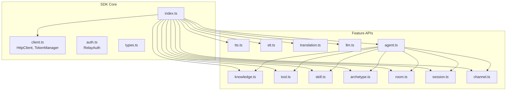
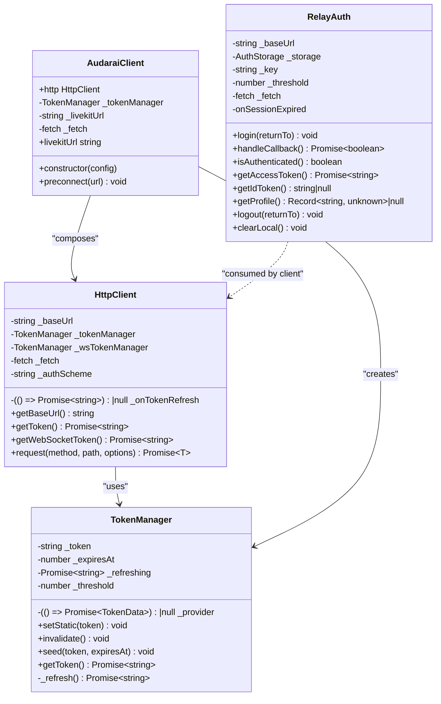
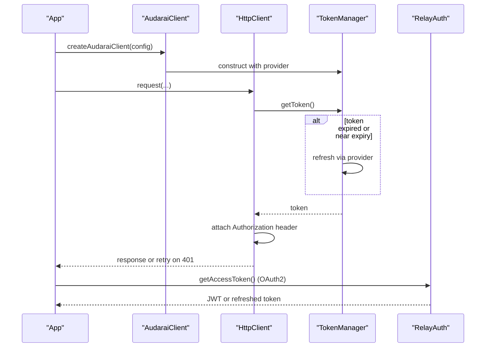
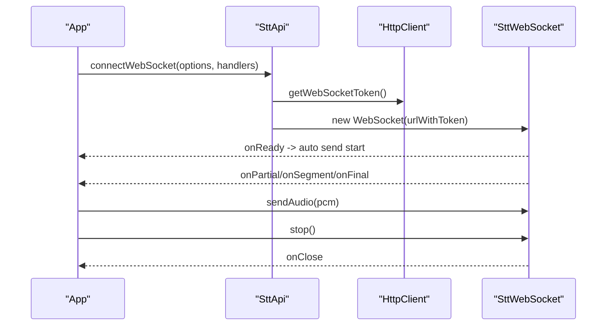
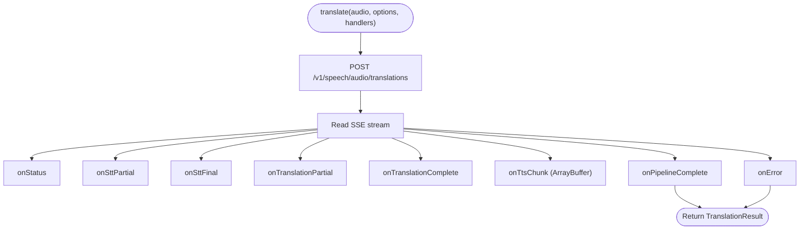
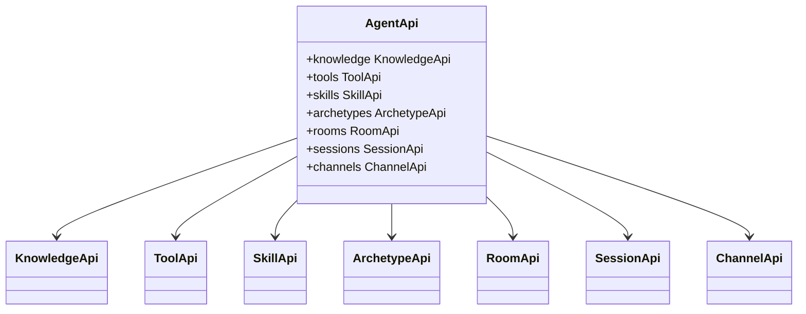
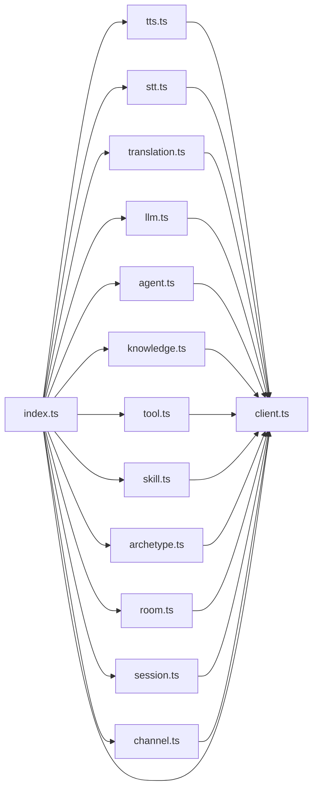

# Expert Integration Patterns

<cite>
**Referenced Files in This Document**
- [index.ts](file://src/index.ts)
- [client.ts](file://src/client.ts)
- [auth.ts](file://src/auth.ts)
- [types.ts](file://src/types.ts)
- [tts.ts](file://src/tts.ts)
- [stt.ts](file://src/stt.ts)
- [translation.ts](file://src/translation.ts)
- [llm.ts](file://src/llm.ts)
- [agent.ts](file://src/agent.ts)
- [knowledge.ts](file://src/knowledge.ts)
- [tool.ts](file://src/tool.ts)
- [skill.ts](file://src/skill.ts)
- [archetype.ts](file://src/archetype.ts)
- [room.ts](file://src/room.ts)
- [session.ts](file://src/session.ts)
- [channel.ts](file://src/channel.ts)
</cite>

## Table of Contents
1. [Introduction](#introduction)
2. [Project Structure](#project-structure)
3. [Core Components](#core-components)
4. [Architecture Overview](#architecture-overview)
5. [Detailed Component Analysis](#detailed-component-analysis)
6. [Dependency Analysis](#dependency-analysis)
7. [Performance Considerations](#performance-considerations)
8. [Troubleshooting Guide](#troubleshooting-guide)
9. [Conclusion](#conclusion)
10. [Appendices](#appendices)

## Introduction
This document presents expert integration patterns for the AudarAI SDK, focusing on advanced architectural approaches, extensibility, and enterprise-grade deployment strategies. It covers:
- Authentication and token management patterns (publishable key, access token, API key, app credentials)
- Plugin-like API surface design and composition
- Middleware-style HTTP transport with automatic retries and token refresh
- WebSocket pipelines for real-time STT/Translation/TTS
- Microservices and distributed system considerations
- Integration touchpoints with frameworks, state management, and backend services
- Advanced topics: multi-tenant, high-scale, and hybrid cloud deployments

## Project Structure
The SDK is organized around a small set of cohesive modules:
- A central client that encapsulates HTTP transport and authentication
- Feature-specific API modules (TTS, STT, Translation, Agent, Knowledge, Tools, Skills, Archetypes, Rooms, Sessions, Channels)
- A convenience factory that composes the client with API modules
- Strongly typed request/response contracts

**Diagram sources**
- [index.ts:128-192](file://src/index.ts#L128-L192)
- [client.ts:22-91](file://src/client.ts#L22-L91)
- [auth.ts:102-272](file://src/auth.ts#L102-L272)
- [tts.ts:11-231](file://src/tts.ts#L11-L231)
- [stt.ts:83-217](file://src/stt.ts#L83-L217)
- [translation.ts:111-277](file://src/translation.ts#L111-L277)
- [llm.ts:4-12](file://src/llm.ts#L4-L12)
- [agent.ts:11-28](file://src/agent.ts#L11-L28)
- [knowledge.ts:12-137](file://src/knowledge.ts#L12-L137)
- [tool.ts:4-37](file://src/tool.ts#L4-L37)
- [skill.ts:4-33](file://src/skill.ts#L4-L33)
- [archetype.ts:4-33](file://src/archetype.ts#L4-L33)
- [room.ts:4-108](file://src/room.ts#L4-L108)
- [session.ts:4-235](file://src/session.ts#L4-L235)
- [channel.ts:4-44](file://src/channel.ts#L4-L44)

**Section sources**
- [index.ts:128-192](file://src/index.ts#L128-L192)
- [client.ts:22-91](file://src/client.ts#L22-L91)
- [types.ts:7-63](file://src/types.ts#L7-L63)

## Core Components
- AudaraiClient: Central orchestrator that configures authentication modes, initializes token managers, and exposes an HttpClient for all API modules.
- HttpClient: Encapsulates HTTP transport, token retrieval, URL building, and response handling with robust error semantics.
- TokenManager: Manages token acquisition, expiration-aware refresh, concurrency-safe refresh mutex, and optional manual invalidation.
- RelayAuth: OAuth2/SSO bridge for browser-based apps, handling login, callback consumption, token persistence, and refresh with graceful fallback.
- Feature APIs: Typed clients for TTS, STT, Translation, Agent, Knowledge, Tools, Skills, Archetypes, Rooms, Sessions, and Channels.

Key integration patterns:
- Composition over inheritance: Each API module depends on HttpClient, enabling easy swapping of transport or adding interceptors.
- Factory pattern: createAudaraiClient composes the client with API modules, exposing a unified facade.
- Pluggable authentication: Supports publishable key, access token, API key, and app credentials with distinct token providers and schemes.

**Section sources**
- [client.ts:215-411](file://src/client.ts#L215-L411)
- [client.ts:93-213](file://src/client.ts#L93-L213)
- [client.ts:22-91](file://src/client.ts#L22-L91)
- [auth.ts:102-272](file://src/auth.ts#L102-L272)
- [index.ts:160-192](file://src/index.ts#L160-L192)

## Architecture Overview
The SDK follows a layered architecture:
- Transport layer: HttpClient handles fetch, URL construction, headers, and response parsing.
- Authentication layer: TokenManager and RelayAuth provide token lifecycle management and OAuth2 integration.
- Domain layer: Feature APIs encapsulate domain-specific operations and WebSocket integrations.
- Composition layer: createAudaraiClient wires the client and API modules.

**Diagram sources**
- [client.ts:22-91](file://src/client.ts#L22-L91)
- [client.ts:93-213](file://src/client.ts#L93-L213)
- [client.ts:215-411](file://src/client.ts#L215-L411)
- [auth.ts:102-272](file://src/auth.ts#L102-L272)

## Detailed Component Analysis

### Authentication and Token Management
- TokenManager supports:
  - Static tokens (no refresh)
  - Provider-driven refresh with threshold-based early refresh
  - Concurrency guard to prevent multiple simultaneous refreshes
  - Manual invalidation on 401
- HttpClient integrates TokenManager for Authorization headers and handles 401 with optional onTokenRefresh callback and retry.
- RelayAuth provides:
  - Login via redirect to relay service
  - Callback handling to exchange transfer_code for tokens
  - Persisted token storage with configurable storage adapter
  - Refresh flow with graceful fallback to login on failure

**Diagram sources**
- [client.ts:22-91](file://src/client.ts#L22-L91)
- [client.ts:93-213](file://src/client.ts#L93-L213)
- [client.ts:215-411](file://src/client.ts#L215-L411)
- [auth.ts:169-183](file://src/auth.ts#L169-L183)

**Section sources**
- [client.ts:22-91](file://src/client.ts#L22-L91)
- [client.ts:93-213](file://src/client.ts#L93-L213)
- [client.ts:215-411](file://src/client.ts#L215-L411)
- [auth.ts:102-272](file://src/auth.ts#L102-L272)

### STT Streaming and WebSocket Pipelines
- STT streaming via SSE:
  - Transcribes audio via multipart/form-data
  - Parses server-sent events and invokes handlers for partial/final chunks
- STT WebSocket:
  - Connects with session token
  - Automatically sends start after ready
  - Emits typed messages (partial, segment, final, error)

**Diagram sources**
- [stt.ts:198-216](file://src/stt.ts#L198-L216)
- [stt.ts:21-81](file://src/stt.ts#L21-L81)

**Section sources**
- [stt.ts:83-217](file://src/stt.ts#L83-L217)

### Translation Pipeline (SSE and WebSocket)
- SSE pipeline:
  - Streams status, STT partial/final, translation partial/complete, TTS chunks, and completion
  - Handlers receive decoded audio buffers for TTS chunks
- WebSocket pipeline:
  - Similar message types with base64 audio decoding in handlers

**Diagram sources**
- [translation.ts:132-228](file://src/translation.ts#L132-L228)

**Section sources**
- [translation.ts:111-277](file://src/translation.ts#L111-L277)

### Agent, Room, Session, and Multi-Party Workflows
- AgentApi composes nested APIs for Knowledge, Tools, Skills, Archetypes, Rooms, Sessions, and Channels.
- RoomApi manages room lifecycle, agent binding, and session creation.
- SessionApi handles session lifecycle, participant context, messages, LiveKit token minting, and moderator dispatch.

**Diagram sources**
- [agent.ts:11-28](file://src/agent.ts#L11-L28)

**Section sources**
- [agent.ts:11-158](file://src/agent.ts#L11-L158)
- [room.ts:4-108](file://src/room.ts#L4-L108)
- [session.ts:4-235](file://src/session.ts#L4-L235)

### TTS, LLM, and Knowledge Management
- TtsApi supports synthesis, streaming synthesis, model listing, and speaker management.
- LlmApi lists available LLM models.
- KnowledgeApi supports CRUD, ingestion (text, file, re-ingest), document listing, and semantic search.

**Section sources**
- [tts.ts:11-231](file://src/tts.ts#L11-L231)
- [llm.ts:4-12](file://src/llm.ts#L4-L12)
- [knowledge.ts:12-137](file://src/knowledge.ts#L12-L137)

### Extension Points and Middleware Patterns
- HttpClient.request acts as a middleware hook for:
  - Token injection
  - URL building and query serialization
  - Binary vs JSON response handling
  - Error classification and propagation
- TokenManager provides a pluggable provider interface suitable for custom auth schemes or token sources.
- RelayAuth offers onSessionExpired customization for UX flows.

Practical extension strategies:
- Wrap HttpClient.request with a higher-order function to add logging, metrics, or retry policies.
- Implement a custom TokenManager provider to integrate with enterprise identity systems.
- Extend RelayAuth to support silent refresh or custom storage adapters for SSR.

**Section sources**
- [client.ts:133-213](file://src/client.ts#L133-L213)
- [client.ts:22-91](file://src/client.ts#L22-L91)
- [auth.ts:102-272](file://src/auth.ts#L102-L272)

### Custom Client Implementations and Composition
- createAudaraiClient demonstrates composition of AudaraiClient with API modules.
- Each API module receives a shared HttpClient, enabling centralized transport configuration.

Patterns:
- Feature gating: conditionally attach only required API modules.
- Environment-specific fetch: inject Node-compatible fetch for SSR or testing.
- Custom auth provider: supply accessToken or app credentials to the client config.

**Section sources**
- [index.ts:160-192](file://src/index.ts#L160-L192)
- [client.ts:215-411](file://src/client.ts#L215-L411)

### Integration with Popular Frameworks and State Management
- React/Vue/Angular: Use createAudaraiClient once per app initialization; store the client in a singleton or DI container.
- State management: Dispatch actions on 401 to trigger token refresh or login; persist RelayAuth tokens in Redux/Pinia/Zustand.
- SSR: Provide a custom fetch implementation and a memory-backed AuthStorage adapter; hydrate tokens on the server.

[No sources needed since this section provides general guidance]

### Microservices Integration, API Gateways, and Distributed Systems
- Use publishableKey mode for frontend-only flows; the SDK obtains session tokens server-side.
- Use accessToken or app credentials for backend services behind an API gateway; configure refreshThresholdSeconds for proactive renewal.
- LiveKit preconnect optimization reduces cold-start latency; call preconnect with livekitUrl or discovered URLs.

**Section sources**
- [client.ts:380-409](file://src/client.ts#L380-L409)
- [types.ts:54-62](file://src/types.ts#L54-L62)

### Advanced WebSocket Handling and Real-Time Pipelines
- STT WebSocket: automatic start after ready; send PCM frames; stop to flush.
- Translation WebSocket: typed messages for STT segments, translation completion, TTS chunks, segment completion, and pipeline completion.
- Decode base64 audio in handlers for immediate playback.

**Section sources**
- [stt.ts:21-81](file://src/stt.ts#L21-L81)
- [translation.ts:39-109](file://src/translation.ts#L39-L109)

### Enterprise Integration Patterns, Legacy Connectivity, and Hybrid Cloud
- Publishable key mode: safe for embedding; leverages server-side session token issuance.
- App credentials (appId + appSecret): backend-only; authenticates via Basic scheme for HTTP and WebSocket exchanges.
- API key mode: direct bearer token usage with session token exchange for WebSocket.
- Hybrid cloud: combine local token caches with remote refresh callbacks; use preconnect for regional LiveKit clusters.

**Section sources**
- [client.ts:249-346](file://src/client.ts#L249-L346)
- [types.ts:7-63](file://src/types.ts#L7-L63)

### Multi-Tenant Architectures and High-Scale Implementations
- Tenant scoping: API responses include tenant_id; ensure requests route to the correct tenant.
- High-scale token refresh: use TokenManager’s threshold-based refresh to minimize churn; implement exponential backoff in custom providers.
- WebSocket scaling: leverage LiveKit’s horizontal scaling; use preconnect to warm TLS and reduce connection latency.

**Section sources**
- [types.ts:572-606](file://src/types.ts#L572-L606)
- [client.ts:380-409](file://src/client.ts#L380-L409)

### Best Practices for Code Organization, Dependency Injection, and Modular Design
- Keep API modules pure: depend on HttpClient only.
- Centralize configuration in AudaraiClient; pass only environment-specific fetch and storage adapters.
- Favor composition over inheritance; swap providers without changing API signatures.
- Use strongly typed contracts from types.ts to enforce API boundaries.

**Section sources**
- [index.ts:128-192](file://src/index.ts#L128-L192)
- [types.ts:1-1265](file://src/types.ts#L1-L1265)

## Dependency Analysis
The SDK exhibits low coupling and high cohesion:
- Feature APIs depend on HttpClient, not on each other, enabling independent development and testing.
- AgentApi composes nested APIs, forming a composite facade.
- TokenManager and RelayAuth are reusable across modules.

**Diagram sources**
- [index.ts:128-192](file://src/index.ts#L128-L192)
- [client.ts:93-213](file://src/client.ts#L93-L213)
- [tts.ts:11-231](file://src/tts.ts#L11-L231)
- [stt.ts:83-217](file://src/stt.ts#L83-L217)
- [translation.ts:111-277](file://src/translation.ts#L111-L277)
- [llm.ts:4-12](file://src/llm.ts#L4-L12)
- [agent.ts:11-28](file://src/agent.ts#L11-L28)
- [knowledge.ts:12-137](file://src/knowledge.ts#L12-L137)
- [tool.ts:4-37](file://src/tool.ts#L4-L37)
- [skill.ts:4-33](file://src/skill.ts#L4-L33)
- [archetype.ts:4-33](file://src/archetype.ts#L4-L33)
- [room.ts:4-108](file://src/room.ts#L4-L108)
- [session.ts:4-235](file://src/session.ts#L4-L235)
- [channel.ts:4-44](file://src/channel.ts#L4-L44)

**Section sources**
- [index.ts:128-192](file://src/index.ts#L128-L192)
- [client.ts:93-213](file://src/client.ts#L93-L213)

## Performance Considerations
- Proactive token refresh: adjust refreshThresholdSeconds to balance freshness and network overhead.
- WebSocket preconnect: call preconnect with known LiveKit URLs to warm DNS/TLS and reduce connection latency.
- Streaming audio: use SttWebSocket and TranslationWebSocket to minimize latency and buffer sizes.
- Binary responses: use expectBinary for audio downloads to avoid unnecessary JSON parsing.

[No sources needed since this section provides general guidance]

## Troubleshooting Guide
Common scenarios and resolutions:
- 401 Unauthorized:
  - If using accessToken, implement onTokenRefresh to supply a fresh token.
  - If using publishableKey/appId, ensure session token exchange succeeds.
- Insufficient balance:
  - Catch InsufficientBalanceError and prompt billing actions.
- Rate limiting:
  - Handle RateLimitedError and back off according to Retry-After.
- WebSocket errors:
  - Use onError handlers to log and recover; reconnect with backoff.
- OAuth2 session expiry:
  - RelayAuth.onSessionExpired triggers login; customize UX as needed.

**Section sources**
- [client.ts:153-173](file://src/client.ts#L153-L173)
- [client.ts:187-212](file://src/client.ts#L187-L212)
- [auth.ts:118-119](file://src/auth.ts#L118-L119)

## Conclusion
The AudarAI SDK is designed for expert integration with strong emphasis on:
- Pluggable authentication and transport
- Real-time WebSocket pipelines
- Composable feature APIs
- Distributed system readiness with preconnect and token refresh
Adopting the patterns outlined here enables robust, scalable, and maintainable integrations across diverse environments.

## Appendices
- Authentication modes summary:
  - Publishable key: frontend-safe session token issuance
  - Access token: JWT-based bearer tokens with optional WebSocket exchange
  - API key: direct bearer token usage with session token exchange for WebSocket
  - App credentials: backend-only Basic authentication for HTTP/WebSocket

**Section sources**
- [types.ts:7-63](file://src/types.ts#L7-L63)
- [client.ts:249-346](file://src/client.ts#L249-L346)