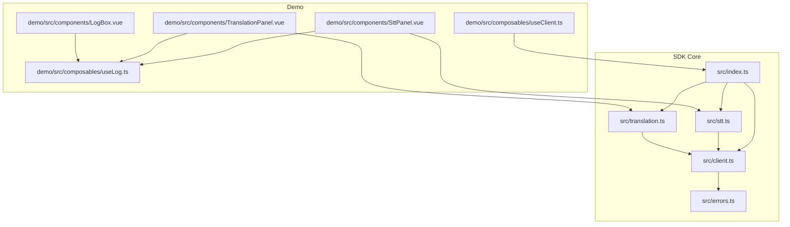
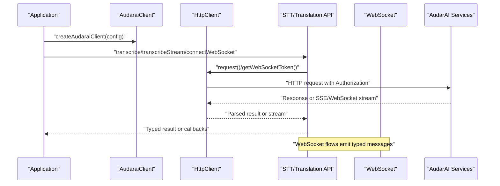
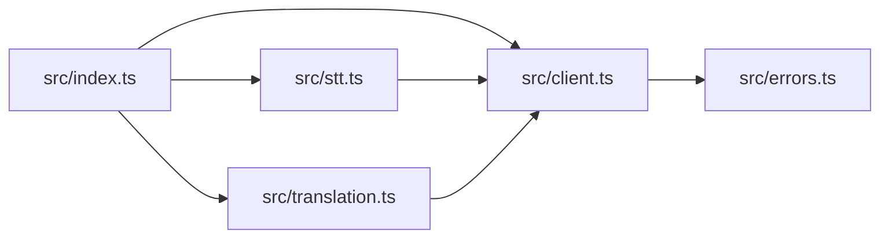

# Monitoring and Observability

<cite>
**Referenced Files in This Document**
- [index.ts](file://src/index.ts)
- [client.ts](file://src/client.ts)
- [stt.ts](file://src/stt.ts)
- [translation.ts](file://src/translation.ts)
- [errors.ts](file://src/errors.ts)
- [useLog.ts](file://demo/src/composables/useLog.ts)
- [LogBox.vue](file://demo/src/components/LogBox.vue)
- [SttPanel.vue](file://demo/src/components/SttPanel.vue)
- [TranslationPanel.vue](file://demo/src/components/TranslationPanel.vue)
- [useClient.ts](file://demo/src/composables/useClient.ts)
- [package.json](file://package.json)
</cite>

## Table of Contents
1. [Introduction](#introduction)
2. [Project Structure](#project-structure)
3. [Core Components](#core-components)
4. [Architecture Overview](#architecture-overview)
5. [Detailed Component Analysis](#detailed-component-analysis)
6. [Dependency Analysis](#dependency-analysis)
7. [Performance Considerations](#performance-considerations)
8. [Troubleshooting Guide](#troubleshooting-guide)
9. [Conclusion](#conclusion)
10. [Appendices](#appendices)

## Introduction
This document provides comprehensive guidance for implementing Monitoring and Observability in applications using the AudarAI SDK. It focuses on logging strategies, structured logging patterns, and log aggregation techniques. It also explains how to collect metrics for API usage, WebSocket connections, and audio processing performance, and outlines error tracking, exception reporting, and alerting mechanisms. Tracing capabilities, request correlation, and performance monitoring are covered, along with health checks, uptime monitoring, and service availability metrics. Real-time monitoring for audio streams, connection quality metrics, and user experience indicators are addressed, with integration examples for popular monitoring platforms and APM tools, plus dashboard creation guidelines and alert configuration best practices.

## Project Structure
The SDK exposes a cohesive client and API surface for TTS, STT, Translation, and related services. The demo showcases practical logging and error handling patterns that can be extended for production-grade observability.

**Diagram sources**
- [index.ts:1-193](file://src/index.ts#L1-L193)
- [client.ts:93-213](file://src/client.ts#L93-L213)
- [errors.ts:1-43](file://src/errors.ts#L1-L43)
- [stt.ts:83-216](file://src/stt.ts#L83-L216)
- [translation.ts:111-276](file://src/translation.ts#L111-L276)
- [useLog.ts:20-48](file://demo/src/composables/useLog.ts#L20-L48)
- [LogBox.vue:1-28](file://demo/src/components/LogBox.vue#L1-L28)
- [SttPanel.vue:1-349](file://demo/src/components/SttPanel.vue#L1-L349)
- [TranslationPanel.vue:1-469](file://demo/src/components/TranslationPanel.vue#L1-L469)
- [useClient.ts:21-35](file://demo/src/composables/useClient.ts#L21-L35)

**Section sources**
- [index.ts:1-193](file://src/index.ts#L1-L193)
- [client.ts:93-213](file://src/client.ts#L93-L213)
- [stt.ts:83-216](file://src/stt.ts#L83-L216)
- [translation.ts:111-276](file://src/translation.ts#L111-L276)
- [useLog.ts:20-48](file://demo/src/composables/useLog.ts#L20-L48)
- [LogBox.vue:1-28](file://demo/src/components/LogBox.vue#L1-L28)
- [SttPanel.vue:1-349](file://demo/src/components/SttPanel.vue#L1-L349)
- [TranslationPanel.vue:1-469](file://demo/src/components/TranslationPanel.vue#L1-L469)
- [useClient.ts:21-35](file://demo/src/composables/useClient.ts#L21-L35)

## Core Components
- Client and HTTP transport: Centralized token management, authentication scheme handling, and HTTP request lifecycle with robust error classification.
- STT and Translation APIs: Provide streaming and WebSocket-based pipelines with typed event handlers for real-time monitoring and diagnostics.
- Demo logging utilities: Structured log entries with levels and timestamps, suitable for ingestion into external observability systems.

Key implementation references:
- Client and HTTP transport: [HttpClient.request:133-212](file://src/client.ts#L133-L212), [HttpClient.getWebSocketToken:126-131](file://src/client.ts#L126-L131)
- STT streaming and WebSocket: [SttApi.transcribeStream:116-183](file://src/stt.ts#L116-L183), [SttApi.connectWebSocket:198-215](file://src/stt.ts#L198-L215), [SttWebSocket:21-81](file://src/stt.ts#L21-L81)
- Translation streaming and WebSocket: [TranslationApi.translate:132-228](file://src/translation.ts#L132-L228), [TranslationApi.connectWebSocket:258-275](file://src/translation.ts#L258-L275), [TranslationWebSocket:39-109](file://src/translation.ts#L39-L109)
- Error types: [errors.ts:1-43](file://src/errors.ts#L1-L43)
- Demo logging: [useLog:20-48](file://demo/src/composables/useLog.ts#L20-L48), [LogBox:1-28](file://demo/src/components/LogBox.vue#L1-L28)

**Section sources**
- [client.ts:93-213](file://src/client.ts#L93-L213)
- [stt.ts:83-216](file://src/stt.ts#L83-L216)
- [translation.ts:111-276](file://src/translation.ts#L111-L276)
- [errors.ts:1-43](file://src/errors.ts#L1-L43)
- [useLog.ts:20-48](file://demo/src/composables/useLog.ts#L20-L48)
- [LogBox.vue:1-28](file://demo/src/components/LogBox.vue#L1-L28)

## Architecture Overview
The SDK orchestrates HTTP and WebSocket interactions with AudarAI services. The client encapsulates authentication and token refresh logic, while APIs expose streaming and real-time capabilities. The demo demonstrates structured logging and error handling that can be extended for production observability.

**Diagram sources**
- [client.ts:215-410](file://src/client.ts#L215-L410)
- [stt.ts:133-215](file://src/stt.ts#L133-L215)
- [translation.ts:146-275](file://src/translation.ts#L146-L275)

## Detailed Component Analysis

### Logging and Structured Logging Patterns
- Demo logging composables provide a simple, structured log entry format with level, text, and timestamp. These logs can be aggregated to centralized systems for dashboards and alerts.
- Recommendations:
  - Enrich logs with correlation IDs (request/session IDs) from SDK responses.
  - Normalize log levels and include severity for automated alerting.
  - Emit structured JSON for ingestion by log collectors.

References:
- [useLog:20-48](file://demo/src/composables/useLog.ts#L20-L48)
- [LogBox:1-28](file://demo/src/components/LogBox.vue#L1-L28)

**Section sources**
- [useLog.ts:20-48](file://demo/src/composables/useLog.ts#L20-L48)
- [LogBox.vue:1-28](file://demo/src/components/LogBox.vue#L1-L28)

### Metrics Collection Strategies
- API usage metrics:
  - Count successful and failed HTTP requests per endpoint.
  - Track latency distributions (p50/p90/p99) for each endpoint.
  - Categorize failures by error type (authentication, insufficient balance, rate-limited).
- WebSocket connection metrics:
  - Track connection attempts, successful connects, and closures.
  - Measure handshake durations and session lifetimes.
  - Monitor message throughput and error rates per WebSocket endpoint.
- Audio processing performance:
  - Record audio frame sizes, send intervals, and dropped frames.
  - Track STT/Translation latency from start to final results.
  - Capture segment durations and pipeline completion times.

References:
- [HttpClient.request:133-212](file://src/client.ts#L133-L212)
- [SttApi.transcribeStream:116-183](file://src/stt.ts#L116-L183)
- [TranslationApi.translate:132-228](file://src/translation.ts#L132-L228)
- [SttApi.connectWebSocket:198-215](file://src/stt.ts#L198-L215)
- [TranslationApi.connectWebSocket:258-275](file://src/translation.ts#L258-L275)

**Section sources**
- [client.ts:133-212](file://src/client.ts#L133-L212)
- [stt.ts:116-215](file://src/stt.ts#L116-L215)
- [translation.ts:132-275](file://src/translation.ts#L132-L275)

### Error Tracking, Exception Reporting, and Alerting
- SDK error types:
  - AuthenticationError, InsufficientBalanceError, RateLimitedError, ApiError.
- Demo error handling:
  - Distinguish and log specific error categories with actionable messages.
- Alerting recommendations:
  - Alert on sustained increases in 401/402/429 responses.
  - Trigger notifications for WebSocket disconnect storms or high error rates.
  - Monitor rate-limit retries and backoff behavior.

References:
- [errors.ts:1-43](file://src/errors.ts#L1-L43)
- [useLog.logError:31-45](file://demo/src/composables/useLog.ts#L31-L45)

**Section sources**
- [errors.ts:1-43](file://src/errors.ts#L1-L43)
- [useLog.ts:31-45](file://demo/src/composables/useLog.ts#L31-L45)

### Tracing and Request Correlation
- Correlation IDs:
  - Extract and propagate session IDs from WebSocket ready messages and API responses.
  - Attach correlation IDs to logs, metrics, and traces.
- Distributed tracing:
  - Use correlation IDs to join HTTP request spans, WebSocket message spans, and local processing steps.
  - Export traces to APM vendors (e.g., OpenTelemetry-compatible backends).

References:
- [SttWebSocket.onReady:36-40](file://src/stt.ts#L36-L40)
- [TranslationWebSocket.onReady:54-56](file://src/translation.ts#L54-L56)
- [SttPanel.vue handlers:158-216](file://demo/src/components/SttPanel.vue#L158-L216)
- [TranslationPanel.vue handlers:176-251](file://demo/src/components/TranslationPanel.vue#L176-L251)

**Section sources**
- [stt.ts:21-81](file://src/stt.ts#L21-L81)
- [translation.ts:39-109](file://src/translation.ts#L39-L109)
- [SttPanel.vue:158-216](file://demo/src/components/SttPanel.vue#L158-L216)
- [TranslationPanel.vue:176-251](file://demo/src/components/TranslationPanel.vue#L176-L251)

### Health Checks, Uptime, and Availability
- Health probes:
  - Periodic calls to lightweight endpoints (e.g., speaker listing) to validate service availability.
  - Track success rate and latency to detect degradation.
- Availability metrics:
  - Compute uptime windows and alert on SLI breaches.
  - Surface availability by region or endpoint.

References:
- [useClient.connect:22-28](file://demo/src/composables/useClient.ts#L22-L28)

**Section sources**
- [useClient.ts:22-28](file://demo/src/composables/useClient.ts#L22-L28)

### Real-Time Monitoring for Audio Streams and User Experience
- Real-time STT/Translation:
  - Track partial vs. final message cadence and latency.
  - Detect silence thresholds, VAD behavior, and segment boundaries.
- Connection quality:
  - Monitor WebSocket readiness timing and close reasons.
  - Track audio chunk sizes and delivery jitter.
- User experience indicators:
  - Render real-time subtitles and progress stages in the UI.
  - Aggregate user-perceived delays (time-to-first-partial, time-to-final).

References:
- [SttPanel.vue real-time UI:168-203](file://demo/src/components/SttPanel.vue#L168-L203)
- [TranslationPanel.vue real-time UI:184-237](file://demo/src/components/TranslationPanel.vue#L184-L237)

**Section sources**
- [SttPanel.vue:168-203](file://demo/src/components/SttPanel.vue#L168-L203)
- [TranslationPanel.vue:184-237](file://demo/src/components/TranslationPanel.vue#L184-L237)

### Integration Examples with Monitoring Platforms and APM Tools
- Logging:
  - Ship demo logs to log collectors (e.g., Fluent Bit, Vector) and ingest into Elasticsearch/OpenSearch or similar.
  - Normalize structured logs with correlation IDs and severity levels.
- Metrics:
  - Expose Prometheus metrics for request counts, latencies, and error rates.
  - Track WebSocket connection counters and audio processing histograms.
- Tracing:
  - Export OpenTelemetry traces correlating HTTP, SSE, and WebSocket spans.
  - Use correlation IDs to stitch end-to-end journeys.
- Dashboards:
  - Build dashboards for API health, WebSocket reliability, and audio pipeline latency.
  - Include alert panels for rate limits, authentication failures, and connection drops.
- Alerting:
  - Configure alerts for sustained error spikes, degraded latency, and frequent reconnects.

[No sources needed since this section provides general guidance]

### Dashboard Creation Guidelines and Alert Configuration Best Practices
- Dashboards:
  - API usage: Requests per second, error budgets, and latency percentiles.
  - WebSocket: Connection success rate, average session duration, and close reason distribution.
  - Audio pipeline: Latency from start to final, segment count, and audio chunk delivery.
- Alerts:
  - Threshold-based: sustained error rate increase, latency p95 breach.
  - Anomaly-based: unexpected spikes in disconnects or audio dropouts.
  - Composite: multi-window checks for cascading failures.

[No sources needed since this section provides general guidance]

## Dependency Analysis
The SDK’s public entry exports the client and API classes, enabling consumers to construct a unified client and access specialized APIs. The client depends on HTTP transport and error types, while STT and Translation APIs depend on HTTP transport and WebSocket wrappers.

**Diagram sources**
- [index.ts:1-193](file://src/index.ts#L1-L193)
- [client.ts:93-213](file://src/client.ts#L93-L213)
- [stt.ts:83-216](file://src/stt.ts#L83-L216)
- [translation.ts:111-276](file://src/translation.ts#L111-L276)
- [errors.ts:1-43](file://src/errors.ts#L1-L43)

**Section sources**
- [index.ts:1-193](file://src/index.ts#L1-L193)
- [client.ts:93-213](file://src/client.ts#L93-L213)
- [stt.ts:83-216](file://src/stt.ts#L83-L216)
- [translation.ts:111-276](file://src/translation.ts#L111-L276)
- [errors.ts:1-43](file://src/errors.ts#L1-L43)

## Performance Considerations
- Token refresh and caching:
  - Minimize redundant token requests by leveraging built-in refresh thresholds.
- Network preconnection:
  - Use preconnect hints to reduce TLS handshake latency for WebSocket origins.
- Streaming efficiency:
  - Tune SSE/WS message parsing and chunk handling to avoid blocking the UI thread.
- Audio processing:
  - Monitor audio frame sizes and send intervals to maintain smooth real-time performance.

References:
- [AudaraiClient.preconnect:380-409](file://src/client.ts#L380-L409)
- [HttpClient.request:133-212](file://src/client.ts#L133-L212)

**Section sources**
- [client.ts:380-409](file://src/client.ts#L380-L409)
- [client.ts:133-212](file://src/client.ts#L133-L212)

## Troubleshooting Guide
- Authentication failures:
  - Inspect 401 responses and trigger token refresh logic.
- Insufficient balance:
  - Detect 402 responses and surface actionable messaging to users.
- Rate limiting:
  - Observe Retry-After headers and implement backoff strategies.
- WebSocket errors:
  - Log error messages and closure reasons; track reconnect attempts.

References:
- [HttpClient.request error handling:187-212](file://src/client.ts#L187-L212)
- [errors.ts:1-43](file://src/errors.ts#L1-L43)
- [SttPanel.vue onError:205-210](file://demo/src/components/SttPanel.vue#L205-L210)
- [TranslationPanel.vue onError:239-244](file://demo/src/components/TranslationPanel.vue#L239-L244)

**Section sources**
- [client.ts:187-212](file://src/client.ts#L187-L212)
- [errors.ts:1-43](file://src/errors.ts#L1-L43)
- [SttPanel.vue:205-210](file://demo/src/components/SttPanel.vue#L205-L210)
- [TranslationPanel.vue:239-244](file://demo/src/components/TranslationPanel.vue#L239-L244)

## Conclusion
By combining the SDK’s built-in error types, structured logging patterns from the demo, and the outlined metrics and tracing strategies, teams can implement robust monitoring and observability. Aggregating logs, exposing metrics, and exporting traces enables comprehensive visibility into API usage, WebSocket reliability, and real-time audio processing performance, supporting strong operational insights and user experience guarantees.

[No sources needed since this section summarizes without analyzing specific files]

## Appendices
- Package metadata for build and export formats:
  - [package.json:1-26](file://package.json#L1-L26)

**Section sources**
- [package.json:1-26](file://package.json#L1-L26)