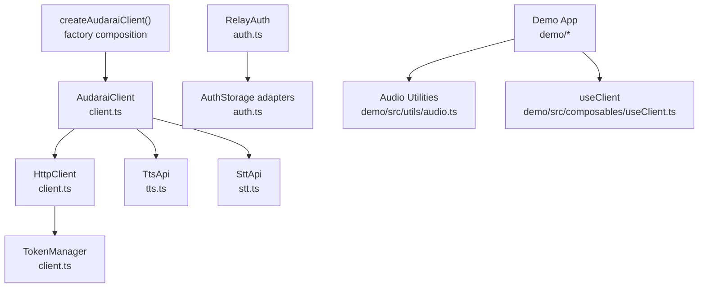
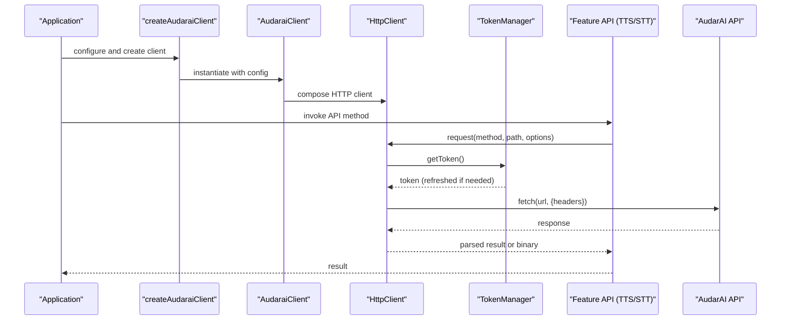
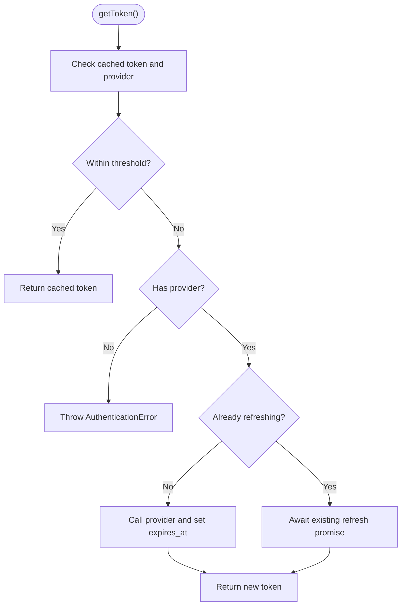
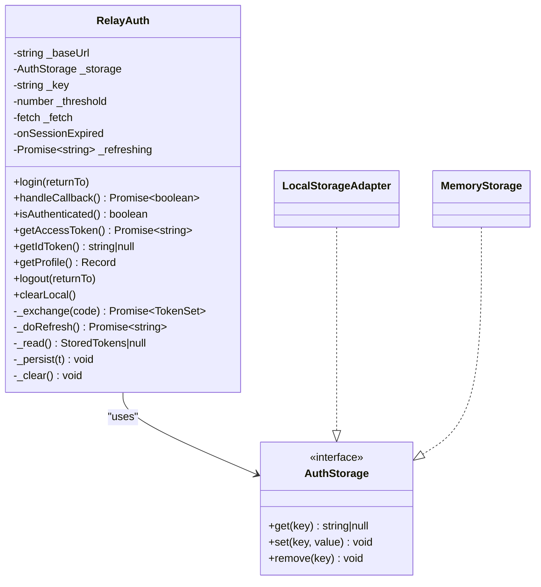
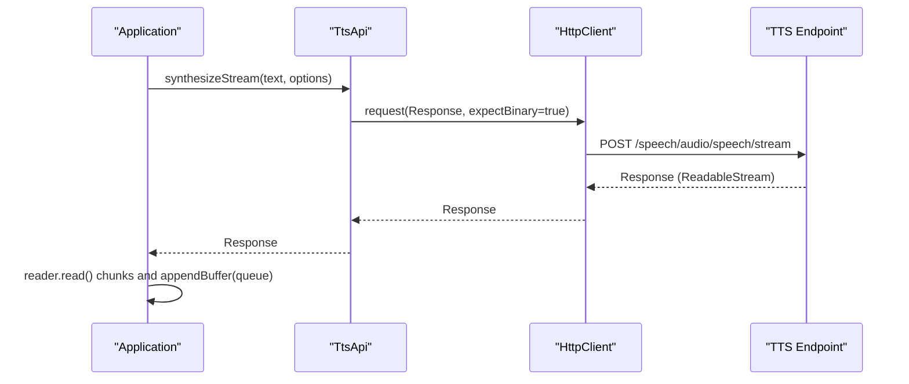
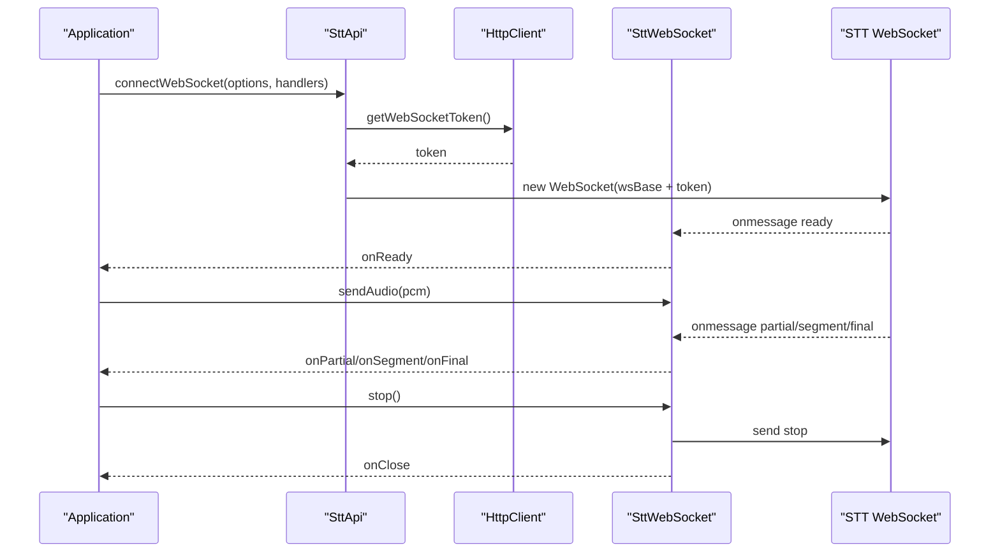
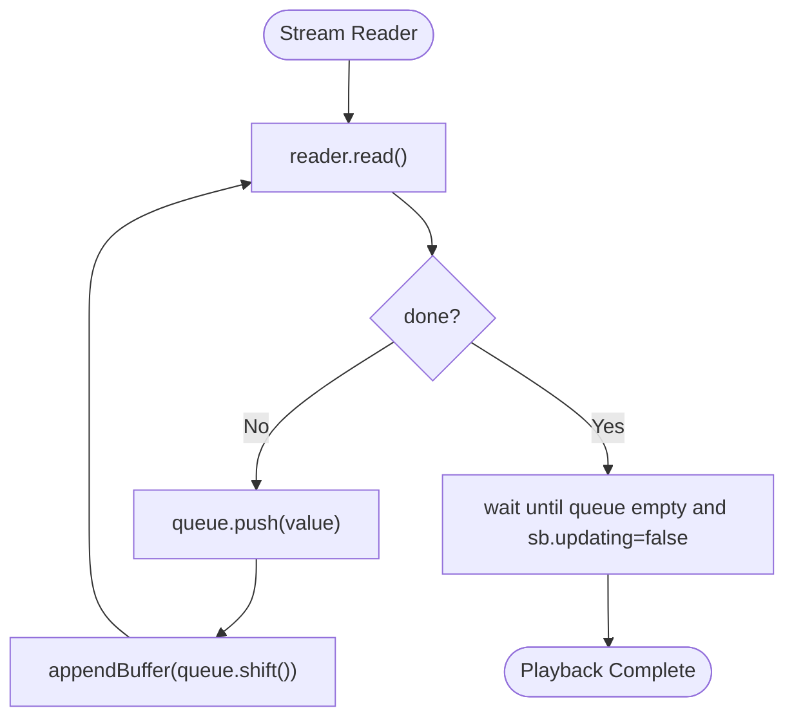
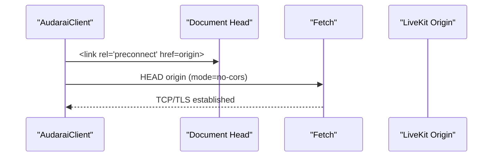
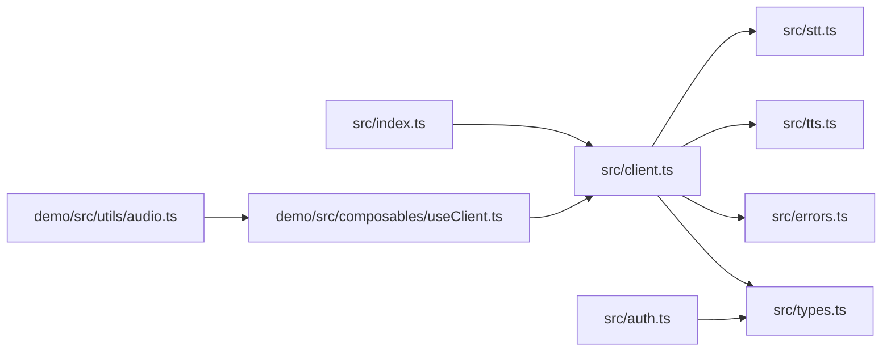

# Performance Optimization

<cite>
**Referenced Files in This Document**
- [src/index.ts](file://src/index.ts)
- [src/client.ts](file://src/client.ts)
- [src/auth.ts](file://src/auth.ts)
- [src/stt.ts](file://src/stt.ts)
- [src/tts.ts](file://src/tts.ts)
- [src/types.ts](file://src/types.ts)
- [src/errors.ts](file://src/errors.ts)
- [demo/src/composables/useClient.ts](file://demo/src/composables/useClient.ts)
- [demo/src/utils/audio.ts](file://demo/src/utils/audio.ts)
- [demo/src/components/TtsPanel.vue](file://demo/src/components/TtsPanel.vue)
- [demo/src/components/AgentPanel.vue](file://demo/src/components/AgentPanel.vue)
- [README.md](file://README.md)
- [package.json](file://package.json)
</cite>

## Table of Contents
1. [Introduction](#introduction)
2. [Project Structure](#project-structure)
3. [Core Components](#core-components)
4. [Architecture Overview](#architecture-overview)
5. [Detailed Component Analysis](#detailed-component-analysis)
6. [Dependency Analysis](#dependency-analysis)
7. [Performance Considerations](#performance-considerations)
8. [Troubleshooting Guide](#troubleshooting-guide)
9. [Conclusion](#conclusion)
10. [Appendices](#appendices)

## Introduction
This document provides comprehensive performance optimization guidance for the AudarAI SDK. It focuses on memory management, garbage collection optimization, resource cleanup, WebSocket connection pooling, audio buffer management, streaming optimization, caching strategies, token refresh optimization, and network efficiency. It also covers performance profiling techniques, bottleneck identification, measurement methodologies, best practices for large audio files and real-time streaming, concurrent operation management, and environment-specific optimizations for browsers, Node.js, and mobile devices. Concrete examples and benchmarking references are included where applicable.

## Project Structure
The SDK is organized around a modular architecture:
- Entry and factory: a convenience factory composes the client with API modules (TTS, STT, Translation, Agent, Knowledge, Tool, Skill, Archetype, Room, Session, Channel).
- Core networking: a centralized HTTP client with token management and automatic token refresh.
- Feature modules: STT and TTS APIs with streaming and WebSocket integrations.
- Authentication: a dedicated module for OAuth2 relay and token persistence with proactive refresh.
- Demo application: showcases performance-sensitive usage patterns (streaming playback, WebRTC timing, and audio utilities).

**Diagram sources**
- [src/index.ts:160-193](file://src/index.ts#L160-L193)
- [src/client.ts:215-411](file://src/client.ts#L215-L411)
- [src/tts.ts:11-231](file://src/tts.ts#L11-L231)
- [src/stt.ts:83-217](file://src/stt.ts#L83-L217)
- [src/auth.ts:102-272](file://src/auth.ts#L102-L272)
- [demo/src/composables/useClient.ts:21-36](file://demo/src/composables/useClient.ts#L21-L36)
- [demo/src/utils/audio.ts:1-69](file://demo/src/utils/audio.ts#L1-L69)

**Section sources**
- [src/index.ts:160-193](file://src/index.ts#L160-L193)
- [src/client.ts:215-411](file://src/client.ts#L215-L411)
- [src/auth.ts:102-272](file://src/auth.ts#L102-L272)
- [demo/src/composables/useClient.ts:21-36](file://demo/src/composables/useClient.ts#L21-L36)
- [demo/src/utils/audio.ts:1-69](file://demo/src/utils/audio.ts#L1-L69)

## Core Components
- TokenManager and HttpClient: centralize token lifecycle, proactive refresh, and 401 handling with retry.
- RelayAuth: OAuth2 relay with proactive refresh, mutex for concurrent refresh, and storage adapters.
- TtsApi and SttApi: streaming and WebSocket integrations with binary responses and SSE parsing.
- Demo utilities: streaming playback queue, WebRTC timing hooks, and audio conversion helpers.

Key performance-relevant responsibilities:
- Proactive token refresh reduces latency spikes and avoids repeated 401 storms.
- Binary streaming minimizes intermediate copies and leverages backpressure-aware readers.
- WebSocket wrappers encapsulate protocol semantics and reduce overhead.
- Demo components demonstrate queue-based appendBuffer patterns and WebRTC stats collection.

**Section sources**
- [src/client.ts:22-91](file://src/client.ts#L22-L91)
- [src/client.ts:93-213](file://src/client.ts#L93-L213)
- [src/auth.ts:102-272](file://src/auth.ts#L102-L272)
- [src/tts.ts:11-231](file://src/tts.ts#L11-L231)
- [src/stt.ts:21-217](file://src/stt.ts#L21-L217)
- [demo/src/components/TtsPanel.vue:337-367](file://demo/src/components/TtsPanel.vue#L337-L367)
- [demo/src/components/AgentPanel.vue:487-572](file://demo/src/components/AgentPanel.vue#L487-L572)

## Architecture Overview
The SDK’s runtime architecture emphasizes efficient request/response cycles, token hygiene, and streaming throughput.

**Diagram sources**
- [src/index.ts:160-193](file://src/index.ts#L160-L193)
- [src/client.ts:215-411](file://src/client.ts#L215-L411)
- [src/client.ts:93-213](file://src/client.ts#L93-L213)
- [src/client.ts:22-91](file://src/client.ts#L22-L91)

## Detailed Component Analysis

### Token Management and Network Efficiency
- Proactive refresh: TokenManager checks expiration against a configurable threshold and refreshes only when needed, preventing unnecessary network calls.
- Mutex for refresh: Prevents redundant concurrent refreshes, reducing contention and wasted work.
- 401 handling: On 401, the HTTP client invalidates cache or uses a dedicated refresh callback, then retries once automatically.
- WebSocket token separation: Distinct token managers for HTTP and WS enable optimized token lifecycles for real-time connections.

**Diagram sources**
- [src/client.ts:52-91](file://src/client.ts#L52-L91)

**Section sources**
- [src/client.ts:22-91](file://src/client.ts#L22-L91)
- [src/client.ts:93-213](file://src/client.ts#L93-L213)

### OAuth2 Relay and Storage Adapters
- Proactive refresh with threshold and mutex mirrors the HTTP token strategy.
- Storage adapters: localStorage-backed and memory-backed for SSR and testing.
- Exchange and refresh endpoints wrap responses with a helper that throws typed errors on non-OK or non-zero code.

**Diagram sources**
- [src/auth.ts:102-272](file://src/auth.ts#L102-L272)

**Section sources**
- [src/auth.ts:102-272](file://src/auth.ts#L102-L272)

### TTS Streaming and Binary Handling
- Streaming synthesis returns a Response with expectBinary=true; callers can stream to file or Web Audio.
- Binary handling ensures proper error propagation and avoids unnecessary JSON parsing.
- Demo streaming playback uses a queue and appendBuffer with “updateend” pacing to avoid overbuffering and stalls.

**Diagram sources**
- [src/tts.ts:44-66](file://src/tts.ts#L44-L66)
- [src/client.ts:133-173](file://src/client.ts#L133-L173)
- [demo/src/components/TtsPanel.vue:337-367](file://demo/src/components/TtsPanel.vue#L337-L367)

**Section sources**
- [src/tts.ts:11-231](file://src/tts.ts#L11-L231)
- [demo/src/components/TtsPanel.vue:337-367](file://demo/src/components/TtsPanel.vue#L337-L367)

### STT Streaming and WebSocket
- SSE streaming parses server-sent events incrementally, minimizing memory churn and enabling early feedback.
- WebSocket wrapper manages protocol readiness, partial/segment/final messages, and graceful stop/close semantics.
- Demo shows pre-warming of LiveKit URLs and parallelized room connect with audio track creation.

**Diagram sources**
- [src/stt.ts:198-217](file://src/stt.ts#L198-L217)
- [src/stt.ts:21-81](file://src/stt.ts#L21-L81)
- [src/client.ts:126-131](file://src/client.ts#L126-L131)

**Section sources**
- [src/stt.ts:83-217](file://src/stt.ts#L83-L217)
- [demo/src/components/AgentPanel.vue:487-572](file://demo/src/components/AgentPanel.vue#L487-L572)

### Audio Buffer Management and Utilities
- Utilities convert between formats, concatenate buffers, and wrap PCM in WAV containers.
- Streaming playback queues chunks and drains on “updateend,” avoiding excessive buffering and GC pressure.
- Demo demonstrates chunk logging and total byte accounting for monitoring throughput.

**Diagram sources**
- [demo/src/components/TtsPanel.vue:337-367](file://demo/src/components/TtsPanel.vue#L337-L367)
- [demo/src/utils/audio.ts:28-69](file://demo/src/utils/audio.ts#L28-L69)

**Section sources**
- [demo/src/utils/audio.ts:1-69](file://demo/src/utils/audio.ts#L1-L69)
- [demo/src/components/TtsPanel.vue:337-367](file://demo/src/components/TtsPanel.vue#L337-L367)

### Preconnection and DNS/TLS Warm-Up
- The client exposes a preconnect method that injects a preconnect link and performs a no-cors HEAD request to warm DNS/TLS for the LiveKit origin.
- This reduces first-byte latency for subsequent WebSocket and RTCS connections.

**Diagram sources**
- [src/client.ts:380-410](file://src/client.ts#L380-L410)

**Section sources**
- [src/client.ts:380-410](file://src/client.ts#L380-L410)

## Dependency Analysis
- Factory composes the client with API modules, ensuring cohesive access patterns.
- HttpClient depends on TokenManager and optionally a dedicated WS token manager.
- STT/TTS APIs depend on HttpClient for network operations.
- Demo integrates utilities and composables to demonstrate performance-sensitive flows.

**Diagram sources**
- [src/index.ts:160-193](file://src/index.ts#L160-L193)
- [src/client.ts:215-411](file://src/client.ts#L215-L411)
- [src/tts.ts:11-231](file://src/tts.ts#L11-L231)
- [src/stt.ts:83-217](file://src/stt.ts#L83-L217)
- [src/auth.ts:102-272](file://src/auth.ts#L102-L272)
- [demo/src/composables/useClient.ts:21-36](file://demo/src/composables/useClient.ts#L21-L36)
- [demo/src/utils/audio.ts:1-69](file://demo/src/utils/audio.ts#L1-L69)

**Section sources**
- [src/index.ts:160-193](file://src/index.ts#L160-L193)
- [src/client.ts:215-411](file://src/client.ts#L215-L411)
- [src/auth.ts:102-272](file://src/auth.ts#L102-L272)

## Performance Considerations

### Memory Management and Garbage Collection
- Streaming: Use reader.read() loops with minimal intermediate allocations; avoid concatenating large buffers unnecessarily.
- Queue-based playback: Maintain bounded queues and drain on “updateend” to prevent accumulation and GC pauses.
- Blob and ObjectURL: Revoke ObjectURLs after playback to release memory promptly.
- PCM conversion: Reuse typed arrays where possible and avoid repeated conversions.

Best practices:
- Prefer streaming Response bodies over loading entire payloads into memory.
- Limit queued chunks to a small fixed-size buffer to cap memory usage.
- Use concatBuffers only when necessary and dispose of intermediate buffers.

**Section sources**
- [src/tts.ts:44-66](file://src/tts.ts#L44-L66)
- [demo/src/components/TtsPanel.vue:337-367](file://demo/src/components/TtsPanel.vue#L337-L367)
- [demo/src/utils/audio.ts:16-26](file://demo/src/utils/audio.ts#L16-L26)

### Resource Cleanup Patterns
- Close WebSockets gracefully using stop() and close() to free resources.
- Release audio tracks and stop media streams when done.
- Revoke ObjectURLs after playback to avoid memory leaks.

**Section sources**
- [src/stt.ts:67-81](file://src/stt.ts#L67-L81)
- [demo/src/utils/audio.ts:16-26](file://demo/src/utils/audio.ts#L16-L26)

### WebSocket Connection Pooling
- The SDK does not implement a generic pool; however, it separates HTTP and WS token lifecycles and supports pre-warming origins.
- For multiple concurrent STT sessions, reuse a single WebSocket per session and avoid overlapping connections unless required.

Recommendations:
- Keep one WebSocket per session; close and recreate when needed.
- Use preconnect to warm the LiveKit origin before connecting.

**Section sources**
- [src/client.ts:380-410](file://src/client.ts#L380-L410)
- [src/stt.ts:198-217](file://src/stt.ts#L198-L217)

### Audio Buffer Management and Streaming Optimization
- Use appendBuffer with a bounded queue and drain on “updateend.”
- Convert PCM to appropriate container formats only when necessary.
- For long-form content, prefer streaming synthesis to avoid buffering entire files.

**Section sources**
- [demo/src/components/TtsPanel.vue:337-367](file://demo/src/components/TtsPanel.vue#L337-L367)
- [demo/src/utils/audio.ts:54-69](file://demo/src/utils/audio.ts#L54-L69)

### Caching Strategies for API Responses
- The SDK does not implement HTTP-level caching; rely on token refresh and binary streaming to minimize overhead.
- For frequent model queries or speaker lists, consider application-level caching with TTL and cache invalidation on updates.

**Section sources**
- [src/tts.ts:68-94](file://src/tts.ts#L68-L94)
- [src/stt.ts:86-89](file://src/stt.ts#L86-L89)

### Token Refresh Optimization
- Proactive refresh thresholds reduce latency spikes; tune refreshThresholdSeconds based on network conditions.
- Mutex prevents redundant refreshes; ensure refresh callbacks are fast and reliable.

**Section sources**
- [src/client.ts:22-91](file://src/client.ts#L22-L91)
- [src/auth.ts:169-183](file://src/auth.ts#L169-L183)

### Network Efficiency Improvements
- Use expectBinary for audio endpoints to avoid JSON parsing overhead.
- Leverage preconnect for LiveKit origins to reduce DNS/TLS latency.
- Batch requests where possible and avoid redundant polling.

**Section sources**
- [src/client.ts:199-212](file://src/client.ts#L199-L212)
- [src/client.ts:380-410](file://src/client.ts#L380-L410)

### Performance Profiling and Bottleneck Identification
- Measure WebRTC connection stages using RTCPeerConnection state change logs and candidate pair stats.
- Profile streaming playback with chunk sizes, queue depth, and appendBuffer timing.
- Use browser devtools to monitor memory growth, GC pauses, and network round-trips.

**Section sources**
- [demo/src/components/AgentPanel.vue:487-572](file://demo/src/components/AgentPanel.vue#L487-L572)
- [demo/src/components/TtsPanel.vue:337-367](file://demo/src/components/TtsPanel.vue#L337-L367)

### Best Practices for Large Audio Files and Real-Time Streaming
- Stream large files in chunks; avoid loading entire files into memory.
- Use backpressure-aware readers and bounded queues to maintain smooth playback.
- For real-time STT, throttle audio frames to match server expectations and network capacity.

**Section sources**
- [src/tts.ts:44-66](file://src/tts.ts#L44-L66)
- [src/stt.ts:116-183](file://src/stt.ts#L116-L183)

### Concurrent Operations Management
- Serialize token refresh with a mutex to prevent race conditions.
- Coordinate multiple streaming operations with separate queues and timers.

**Section sources**
- [src/client.ts:68-77](file://src/client.ts#L68-L77)
- [src/auth.ts:178-183](file://src/auth.ts#L178-L183)

### Browser, Node.js, and Mobile Optimizations
- Browser: leverage preconnect, streaming APIs, and efficient audio decoding; revoke ObjectURLs promptly.
- Node.js: ensure native fetch availability or provide a polyfill; stream audio to files efficiently.
- Mobile: reduce queue sizes, optimize network selection, and handle backgrounding carefully.

**Section sources**
- [README.md:781-796](file://README.md#L781-L796)
- [src/client.ts:380-410](file://src/client.ts#L380-L410)
- [demo/src/utils/audio.ts:16-26](file://demo/src/utils/audio.ts#L16-L26)

## Troubleshooting Guide
Common issues and remedies:
- Authentication failures: Verify token provider configuration and refresh callbacks; ensure onTokenRefresh returns valid JWTs.
- Rate limiting: Respect Retry-After headers and implement exponential backoff.
- Insufficient balance: Handle InsufficientBalanceError and prompt top-up.
- Streaming stalls: Reduce queue sizes and ensure “updateend” handlers drain the queue.

**Section sources**
- [src/client.ts:153-173](file://src/client.ts#L153-L173)
- [src/errors.ts:1-43](file://src/errors.ts#L1-43)

## Conclusion
The AudarAI SDK provides robust primitives for high-performance audio workflows. By leveraging proactive token refresh, binary streaming, queue-based playback, and preconnection strategies, applications can achieve low-latency, memory-efficient audio processing across browsers, Node.js, and mobile environments. Adopt the recommended patterns and measurement techniques to identify and resolve bottlenecks effectively.

## Appendices

### Build and Distribution
- The SDK builds to both CommonJS and ESM formats with TypeScript declarations.

**Section sources**
- [package.json:16-20](file://package.json#L16-L20)