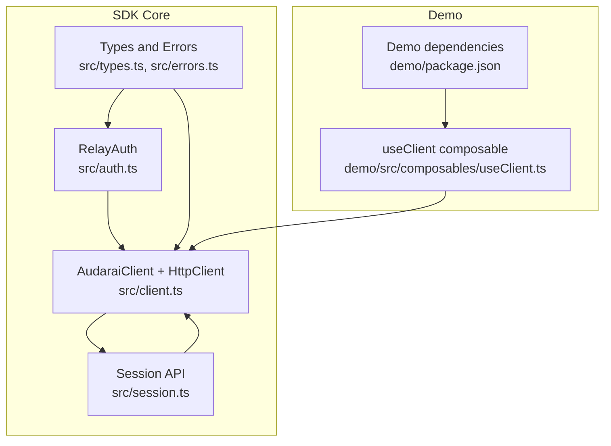
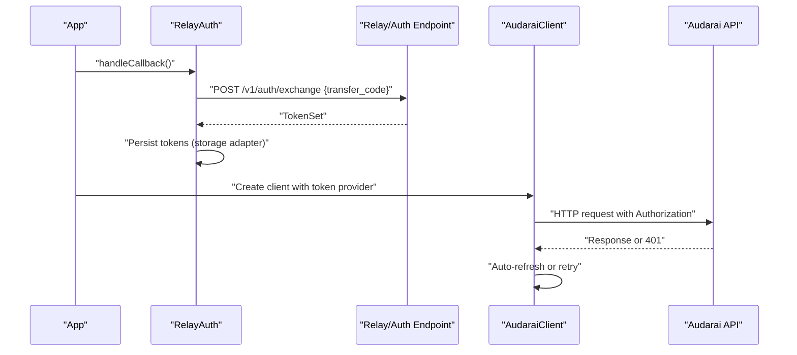
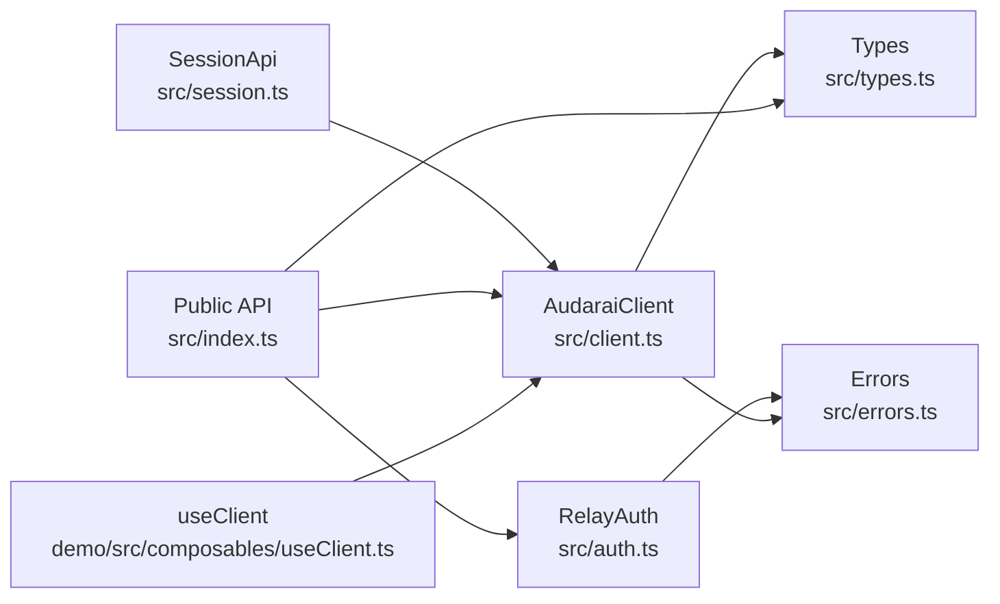

# Security Considerations

<cite>
**Referenced Files in This Document**
- [src/auth.ts](file://src/auth.ts)
- [src/client.ts](file://src/client.ts)
- [src/session.ts](file://src/session.ts)
- [src/types.ts](file://src/types.ts)
- [src/errors.ts](file://src/errors.ts)
- [src/index.ts](file://src/index.ts)
- [demo/src/composables/useClient.ts](file://demo/src/composables/useClient.ts)
- [demo/package.json](file://demo/package.json)
</cite>

## Table of Contents
1. [Introduction](#introduction)
2. [Project Structure](#project-structure)
3. [Core Components](#core-components)
4. [Architecture Overview](#architecture-overview)
5. [Detailed Component Analysis](#detailed-component-analysis)
6. [Dependency Analysis](#dependency-analysis)
7. [Performance Considerations](#performance-considerations)
8. [Troubleshooting Guide](#troubleshooting-guide)
9. [Conclusion](#conclusion)
10. [Appendices](#appendices)

## Introduction
This document provides comprehensive security guidance for the AudarAI SDK. It focuses on authentication security patterns, token storage best practices, secure credential management, encrypted communication channels, data protection during transmission, input validation and sanitization, secure storage and deletion, CORS and CSRF considerations, deployment and secret handling, privacy and data retention, and security audit and vulnerability assessment procedures. The goal is to help developers integrate the SDK securely and operate it safely in production environments.

## Project Structure
The SDK is organized around a small set of cohesive modules:
- Authentication and token orchestration
- HTTP client and token management
- API surface for voice, translation, and session operations
- Type definitions and error models
- Demo application showcasing usage patterns

**Diagram sources**
- [src/auth.ts:102-272](file://src/auth.ts#L102-L272)
- [src/client.ts:215-411](file://src/client.ts#L215-L411)
- [src/session.ts:4-235](file://src/session.ts#L4-L235)
- [src/types.ts:1-1265](file://src/types.ts#L1-L1265)
- [src/errors.ts:1-43](file://src/errors.ts#L1-L43)
- [demo/src/composables/useClient.ts:1-36](file://demo/src/composables/useClient.ts#L1-L36)
- [demo/package.json:1-22](file://demo/package.json#L1-L22)

**Section sources**
- [src/auth.ts:102-272](file://src/auth.ts#L102-L272)
- [src/client.ts:215-411](file://src/client.ts#L215-L411)
- [src/session.ts:4-235](file://src/session.ts#L4-L235)
- [src/types.ts:1-1265](file://src/types.ts#L1-L1265)
- [src/errors.ts:1-43](file://src/errors.ts#L1-L43)
- [demo/src/composables/useClient.ts:1-36](file://demo/src/composables/useClient.ts#L1-L36)
- [demo/package.json:1-22](file://demo/package.json#L1-L22)

## Core Components
- RelayAuth: Implements OAuth2 relay flow, token exchange, refresh, and local storage of tokens. It supports pluggable storage adapters and handles redirect-safe callback consumption.
- AudaraiClient and HttpClient: Provide token management, automatic refresh, and request orchestration. They support multiple authentication modes and differentiate HTTP and WebSocket token providers.
- SessionApi and related APIs: Encapsulate HTTP interactions for sessions, messages, and LiveKit token provisioning.
- Types and Errors: Define token shapes, client configuration, and error models used across the SDK.

Security-relevant highlights:
- Token exchange and refresh occur over HTTPS endpoints.
- Token persistence uses a configurable storage adapter with a default localStorage fallback.
- HTTP requests attach Authorization headers; WebSocket token retrieval is supported.
- Preconnection logic for LiveKit servers improves performance without compromising security.

**Section sources**
- [src/auth.ts:102-272](file://src/auth.ts#L102-L272)
- [src/client.ts:215-411](file://src/client.ts#L215-L411)
- [src/session.ts:4-235](file://src/session.ts#L4-L235)
- [src/types.ts:1-1265](file://src/types.ts#L1-L1265)
- [src/errors.ts:1-43](file://src/errors.ts#L1-L43)

## Architecture Overview
The SDK enforces secure defaults and layered protections:
- Authentication via OAuth2 relay with token exchange and refresh.
- Token storage abstraction to mitigate in-browser risks.
- Automatic token refresh with concurrency guards.
- Separate token providers for HTTP and WebSocket connections.
- Strict authentication mode selection to prevent misconfiguration.

**Diagram sources**
- [src/auth.ts:139-155](file://src/auth.ts#L139-L155)
- [src/auth.ts:223-230](file://src/auth.ts#L223-L230)
- [src/auth.ts:254-270](file://src/auth.ts#L254-L270)
- [src/client.ts:133-173](file://src/client.ts#L133-L173)

## Detailed Component Analysis

### Authentication and Token Exchange (RelayAuth)
- OAuth2 relay flow: Redirects to a relay endpoint, consumes a temporary transfer code, exchanges it for real tokens, and persists them.
- Callback safety: Removes the transfer code from the URL to prevent replay on refresh.
- Token storage: Pluggable storage adapter with localStorage default and memory adapter for SSR.
- Refresh logic: Proactive refresh before expiration threshold; mutual exclusion to avoid concurrent refreshes.
- Profile decoding: Parses id_token payload for UI display without signature verification.

Security considerations:
- Ensure relayBaseUrl uses HTTPS.
- Avoid exposing refresh_token in logs or telemetry.
- Use a secure storage adapter in environments where localStorage is unavailable or unsafe.
- Implement onSessionExpired to guide users back to login when refresh fails.

**Section sources**
- [src/auth.ts:123-155](file://src/auth.ts#L123-L155)
- [src/auth.ts:169-183](file://src/auth.ts#L169-L183)
- [src/auth.ts:223-252](file://src/auth.ts#L223-L252)
- [src/auth.ts:254-270](file://src/auth.ts#L254-L270)

### Token Management and HTTP Client (HttpClient, TokenManager)
- TokenManager: Centralized token caching, expiration checks, and refresh with mutex to prevent concurrent refreshes.
- HttpClient: Builds Authorization headers, retries 401 with refreshed tokens, and handles rate limits and binary responses.
- Authentication modes: Exactly one of publishableKey, accessToken, apiKey, or appId must be configured; appSecret requires appId.
- WebSocket token provider: Optional separate provider for WebSocket connections; otherwise falls back to HTTP token provider.

Security considerations:
- Enforce single authentication mode to avoid ambiguity and misuse.
- Use onTokenRefresh for dynamic token refresh scenarios (e.g., OAuth2).
- Avoid logging tokens; sanitize headers and responses.

**Section sources**
- [src/client.ts:22-91](file://src/client.ts#L22-L91)
- [src/client.ts:93-213](file://src/client.ts#L93-L213)
- [src/client.ts:215-370](file://src/client.ts#L215-L370)
- [src/types.ts:7-63](file://src/types.ts#L7-L63)

### Session and LiveKit Token Provisioning
- SessionApi encapsulates session lifecycle, participant context, messages, and LiveKit token retrieval.
- LiveKit token requests are authenticated via session tokens or API keys depending on the chosen mode.

Security considerations:
- Treat LiveKit tokens as bearer tokens; restrict their scope and TTL.
- Validate and sanitize inputs passed to session endpoints.

**Section sources**
- [src/session.ts:4-235](file://src/session.ts#L4-L235)

### Error Handling and Security Implications
- Distinct error types for authentication failures, insufficient balance, rate limiting, and generic API errors.
- 401 handling triggers token refresh or invalidation, ensuring robust resilience.

Security considerations:
- Do not expose internal error details to clients; return sanitized messages.
- Log errors without sensitive data.

**Section sources**
- [src/errors.ts:1-43](file://src/errors.ts#L1-L43)
- [src/client.ts:133-213](file://src/client.ts#L133-L213)

### Demo Usage Patterns
- The demo composable initializes the client and probes connectivity, illustrating safe initialization patterns.

Security considerations:
- Keep secrets out of the browser bundle; use backend-provided tokens or publishable keys where appropriate.

**Section sources**
- [demo/src/composables/useClient.ts:17-35](file://demo/src/composables/useClient.ts#L17-L35)
- [demo/package.json:10-14](file://demo/package.json#L10-L14)

## Dependency Analysis

**Diagram sources**
- [src/auth.ts:24-25](file://src/auth.ts#L24-L25)
- [src/client.ts:1-2](file://src/client.ts#L1-L2)
- [src/session.ts:1-2](file://src/session.ts#L1-L2)
- [src/types.ts:1-5](file://src/types.ts#L1-L5)
- [src/errors.ts:1-6](file://src/errors.ts#L1-L6)
- [src/index.ts:1-126](file://src/index.ts#L1-L126)
- [demo/src/composables/useClient.ts:1-3](file://demo/src/composables/useClient.ts#L1-L3)

**Section sources**
- [src/auth.ts:24-25](file://src/auth.ts#L24-L25)
- [src/client.ts:1-2](file://src/client.ts#L1-L2)
- [src/session.ts:1-2](file://src/session.ts#L1-L2)
- [src/types.ts:1-5](file://src/types.ts#L1-L5)
- [src/errors.ts:1-6](file://src/errors.ts#L1-L6)
- [src/index.ts:1-126](file://src/index.ts#L1-L126)
- [demo/src/composables/useClient.ts:1-3](file://demo/src/composables/useClient.ts#L1-L3)

## Performance Considerations
- Preconnect to LiveKit origins to reduce DNS/TLS latency without compromising security.
- Use token refresh thresholds to minimize unnecessary refresh calls.
- Avoid excessive logging of token-related data.

[No sources needed since this section provides general guidance]

## Troubleshooting Guide
Common issues and mitigations:
- 401 Unauthorized: Trigger token refresh or re-authentication; ensure onTokenRefresh is implemented for dynamic tokens.
- Rate limits: Respect Retry-After headers and implement exponential backoff.
- Storage exceptions: Fallback to memory storage in environments where localStorage is unavailable.

**Section sources**
- [src/client.ts:133-213](file://src/client.ts#L133-L213)
- [src/errors.ts:22-30](file://src/errors.ts#L22-L30)
- [src/auth.ts:71-88](file://src/auth.ts#L71-L88)

## Conclusion
The SDK provides secure defaults for authentication and token management, with clear separation of concerns for HTTP and WebSocket credentials. By enforcing strict authentication modes, using HTTPS endpoints, and leveraging pluggable storage, developers can integrate the SDK securely. Adhering to the guidance in this document will help maintain confidentiality, integrity, and availability of data and communications.

[No sources needed since this section summarizes without analyzing specific files]

## Appendices

### A. Authentication Security Patterns
- OAuth2 relay flow with transfer code exchange and secure callback handling.
- Token refresh with proactive threshold and mutual exclusion.
- Profile decoding for UI display only; do not use for authorization decisions.

**Section sources**
- [src/auth.ts:139-155](file://src/auth.ts#L139-L155)
- [src/auth.ts:169-183](file://src/auth.ts#L169-L183)
- [src/auth.ts:194-204](file://src/auth.ts#L194-L204)

### B. Token Storage Best Practices
- Use a secure storage adapter in production; avoid storing sensitive tokens in plaintext where feasible.
- Clear tokens on logout and on session expiration callbacks.
- Consider memory storage for SSR environments.

**Section sources**
- [src/auth.ts:39-43](file://src/auth.ts#L39-L43)
- [src/auth.ts:71-88](file://src/auth.ts#L71-L88)
- [src/auth.ts:207-219](file://src/auth.ts#L207-L219)

### C. Secure Credential Management
- Enforce exactly one authentication mode at configuration time.
- For backend usage, use appId + appSecret with Basic auth; never expose appSecret in the browser.
- For frontend usage, prefer publishableKey or accessToken flows.

**Section sources**
- [src/client.ts:229-243](file://src/client.ts#L229-L243)
- [src/types.ts:35-49](file://src/types.ts#L35-L49)

### D. Encrypted Communication Channels
- All token exchange and API calls are performed over HTTPS endpoints.
- WebSocket token retrieval is supported; ensure LiveKit URLs use secure protocols.

**Section sources**
- [src/auth.ts:223-230](file://src/auth.ts#L223-L230)
- [src/client.ts:281-291](file://src/client.ts#L281-L291)

### E. Data Protection During Transmission
- Authorization headers are constructed from tokens; avoid leaking tokens in URLs.
- Remove temporary codes from the URL after callback handling.

**Section sources**
- [src/client.ts:146-149](file://src/client.ts#L146-L149)
- [src/auth.ts:150-153](file://src/auth.ts#L150-L153)

### F. Input Validation, Sanitization, and Injection Prevention
- Validate and sanitize user-provided inputs before sending to APIs.
- Avoid injecting untrusted data into JSON bodies or headers without proper encoding.

[No sources needed since this section provides general guidance]

### G. Secure Storage Options, Encryption at Rest, and Secure Deletion
- Use a storage adapter suitable for the environment; prefer memory storage for SSR.
- Clear tokens on logout and on session expiration.
- Avoid persisting tokens longer than necessary.

**Section sources**
- [src/auth.ts:71-88](file://src/auth.ts#L71-L88)
- [src/auth.ts:207-219](file://src/auth.ts#L207-L219)

### H. CORS Policies, CSRF Protection, and Cross-Origin Security
- Configure allowed origins on the application level to restrict cross-origin access.
- CSRF protection: Use SameSite cookies and anti-CSRF tokens on server-side flows; rely on token-based auth for browser SDK usage.
- Avoid embedding secrets in browser bundles; use backend-provided tokens.

**Section sources**
- [src/types.ts:37-40](file://src/types.ts#L37-L40)
- [demo/package.json:10-14](file://demo/package.json#L10-L14)

### I. Secure Deployment, Environment Variable Management, and Secret Handling
- Store secrets in environment variables or secure secret managers; never hardcode in client-side code.
- Build-time configuration should not include sensitive values.
- Use HTTPS for all endpoints and enforce TLS.

[No sources needed since this section provides general guidance]

### J. Privacy Considerations, Data Retention, and GDPR Compliance Patterns
- Minimize data collection and retention; implement data subject request handlers.
- Provide mechanisms to export or delete personal data upon request.
- Ensure consent and transparency for data processing activities.

[No sources needed since this section provides general guidance]

### K. Security Audit Checklist
- Verify HTTPS endpoints for all token exchange and API calls.
- Confirm exactly one authentication mode is configured.
- Review token storage and refresh logic for race conditions and exceptions.
- Validate CORS and allowed origin settings.
- Audit error handling to avoid information disclosure.
- Test logout and token clearing flows.

**Section sources**
- [src/auth.ts:123-155](file://src/auth.ts#L123-L155)
- [src/auth.ts:223-252](file://src/auth.ts#L223-L252)
- [src/client.ts:229-243](file://src/client.ts#L229-L243)
- [src/errors.ts:1-43](file://src/errors.ts#L1-L43)

### L. Vulnerability Assessment Procedures
- Penetration testing of token exchange and refresh flows.
- Static analysis of token handling and storage.
- Dynamic scanning for insecure headers and missing security controls.
- Incident response playbooks for token leakage or unauthorized access.

[No sources needed since this section provides general guidance]