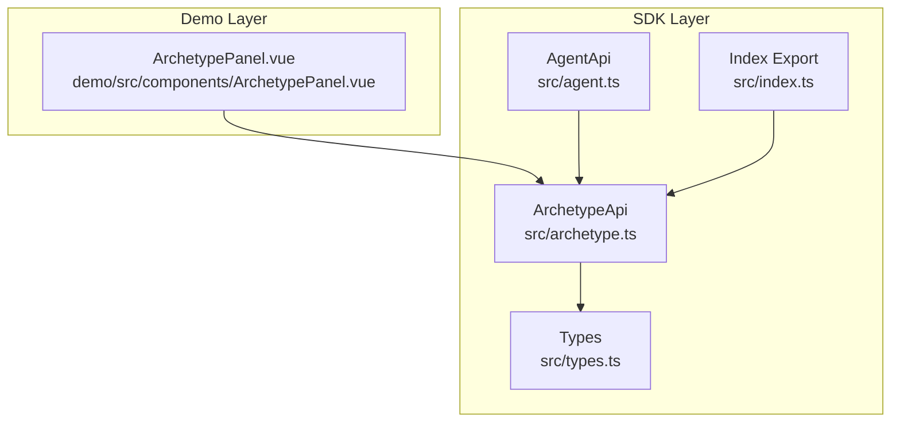
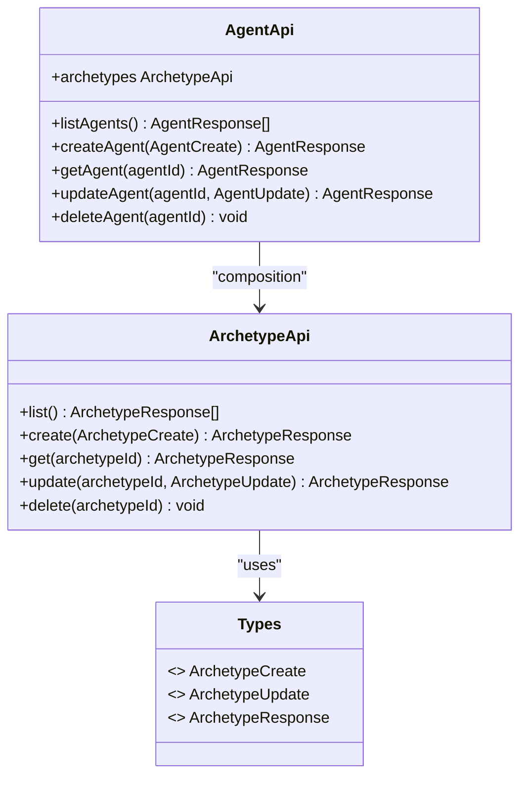
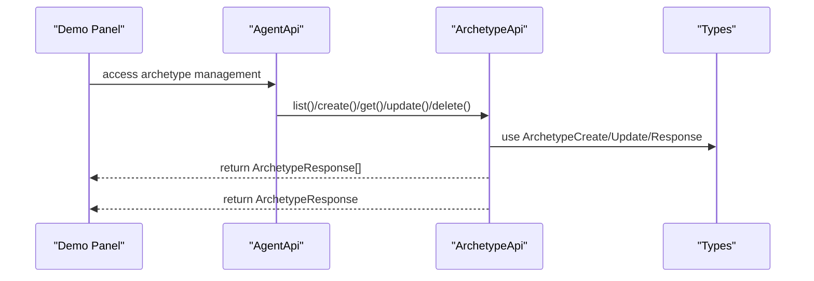
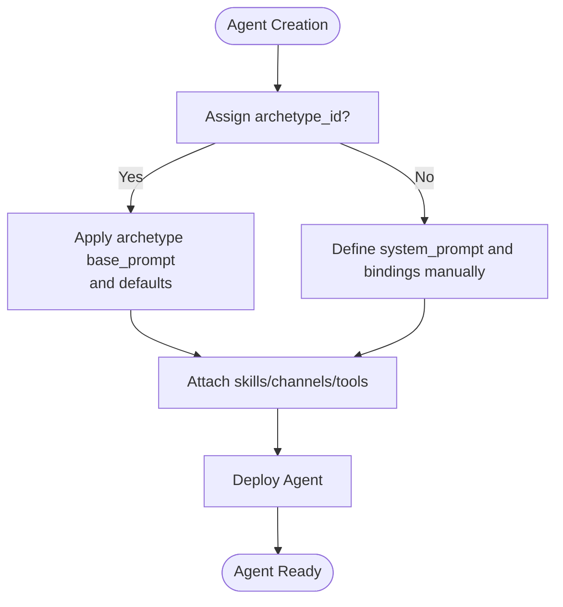
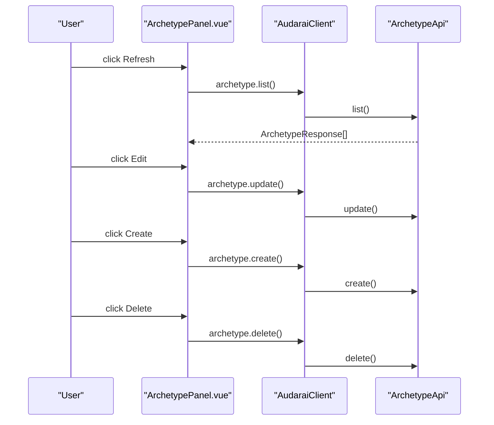
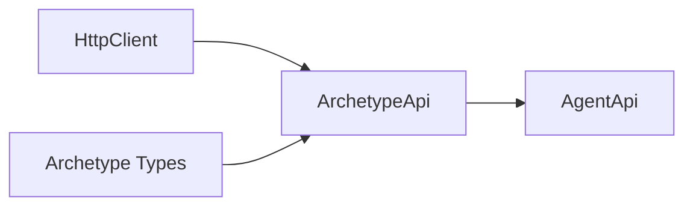

# Agent Archetypes

<cite>
**Referenced Files in This Document**
- [archetype.ts](file://src/archetype.ts)
- [agent.ts](file://src/agent.ts)
- [types.ts](file://src/types.ts)
- [index.ts](file://src/index.ts)
- [ArchetypePanel.vue](file://demo/src/components/ArchetypePanel.vue)
- [README.md](file://README.md)
</cite>

## Table of Contents
1. [Introduction](#introduction)
2. [Project Structure](#project-structure)
3. [Core Components](#core-components)
4. [Architecture Overview](#architecture-overview)
5. [Detailed Component Analysis](#detailed-component-analysis)
6. [Dependency Analysis](#dependency-analysis)
7. [Performance Considerations](#performance-considerations)
8. [Troubleshooting Guide](#troubleshooting-guide)
9. [Conclusion](#conclusion)

## Introduction
This document explains the agent archetype system: reusable configuration templates that standardize agent behavior, enable inheritance-like composition, and streamline agent creation and management. It covers how archetypes work, how to create and modify them, how to apply them to agent instances, and how to manage them effectively in production. Practical examples demonstrate archetype-based agent setup, configuration inheritance, and management workflows. Guidance is also provided on versioning strategies, template best practices, and troubleshooting archetype-related issues.

## Project Structure
The archetype system spans three primary areas:
- API surface: a dedicated ArchetypeApi class exposing CRUD operations for archetypes
- Type definitions: strongly typed interfaces for archetype creation, updates, and responses
- UI integration: a demo panel showcasing archetype listing, editing, and creation

**Diagram sources**
- [archetype.ts:1-33](file://src/archetype.ts#L1-L33)
- [agent.ts:11-28](file://src/agent.ts#L11-L28)
- [types.ts:1111-1140](file://src/types.ts#L1111-L1140)
- [index.ts:12-12](file://src/index.ts#L12-L12)
- [ArchetypePanel.vue:1-243](file://demo/src/components/ArchetypePanel.vue#L1-L243)

**Section sources**
- [archetype.ts:1-33](file://src/archetype.ts#L1-L33)
- [types.ts:1111-1140](file://src/types.ts#L1111-L1140)
- [index.ts:12-12](file://src/index.ts#L12-L12)
- [ArchetypePanel.vue:1-243](file://demo/src/components/ArchetypePanel.vue#L1-L243)

## Core Components
- ArchetypeApi: Provides list, create, get, update, and delete operations for archetypes via HTTP endpoints.
- AgentApi: Exposes archetype management through the agent module’s archetype property.
- Types: Defines ArchetypeCreate, ArchetypeUpdate, and ArchetypeResponse interfaces for type-safe operations.
- Index: Exports ArchetypeApi and related types for consumption by applications.
- Demo Panel: Demonstrates archetype lifecycle in a UI.

Key responsibilities:
- ArchetypeApi encapsulates HTTP interactions for archetypes.
- AgentApi integrates archetype management alongside agent lifecycle operations.
- Types define the contract for archetype data structures and operations.
- Demo Panel illustrates end-to-end archetype workflows.

**Section sources**
- [archetype.ts:4-32](file://src/archetype.ts#L4-L32)
- [agent.ts:15-24](file://src/agent.ts#L15-L24)
- [types.ts:1113-1139](file://src/types.ts#L1113-L1139)
- [index.ts:12-12](file://src/index.ts#L12-L12)
- [ArchetypePanel.vue:14-85](file://demo/src/components/ArchetypePanel.vue#L14-L85)

## Architecture Overview
The archetype system follows a layered architecture:
- Presentation/UI layer: demo panel for archetype management
- API layer: ArchetypeApi for HTTP operations
- Domain layer: AgentApi for agent-centric operations that leverage archetypes
- Data contracts: TypeScript interfaces for type safety

**Diagram sources**
- [archetype.ts:4-32](file://src/archetype.ts#L4-L32)
- [agent.ts:15-24](file://src/agent.ts#L15-L24)
- [types.ts:1113-1139](file://src/types.ts#L1113-L1139)

## Detailed Component Analysis

### ArchetypeApi: Operations and Contracts
ArchetypeApi exposes five primary operations:
- List: retrieves all archetypes
- Create: creates a new archetype
- Get: retrieves a specific archetype by ID
- Update: modifies an existing archetype
- Delete: removes an archetype

Each operation maps to a specific HTTP endpoint and uses strongly typed request/response interfaces.

**Diagram sources**
- [archetype.ts:7-31](file://src/archetype.ts#L7-L31)
- [types.ts:1113-1139](file://src/types.ts#L1113-L1139)
- [ArchetypePanel.vue:14-85](file://demo/src/components/ArchetypePanel.vue#L14-L85)

**Section sources**
- [archetype.ts:7-31](file://src/archetype.ts#L7-L31)
- [types.ts:1113-1139](file://src/types.ts#L1113-L1139)
- [ArchetypePanel.vue:14-85](file://demo/src/components/ArchetypePanel.vue#L14-L85)

### Agent Integration: Using Archetypes with Agents
Agents can reference archetypes via the archetype_id field in AgentCreate and AgentUpdate. This enables:
- Standardized base system prompts
- Consistent default skills and channels across agents
- Simplified agent creation and maintenance

Practical usage patterns:
- Create a reusable archetype with a base system prompt and default skills
- Assign the archetype_id when creating agents to inherit configuration
- Override specific fields per agent when needed (e.g., voice_id, memory_policy)

**Section sources**
- [types.ts:505-539](file://src/types.ts#L505-L539)
- [types.ts:541-570](file://src/types.ts#L541-L570)
- [types.ts:572-606](file://src/types.ts#L572-L606)

### Demo Panel: Archetype Management UI
The demo panel demonstrates:
- Listing archetypes and refreshing the list
- Editing an archetype’s name, description, and base_prompt
- Creating a new archetype with a base_prompt
- Deleting an archetype

**Diagram sources**
- [ArchetypePanel.vue:14-85](file://demo/src/components/ArchetypePanel.vue#L14-L85)
- [archetype.ts:7-31](file://src/archetype.ts#L7-L31)

**Section sources**
- [ArchetypePanel.vue:14-85](file://demo/src/components/ArchetypePanel.vue#L14-L85)

### Type Definitions: Archetype Contracts
The type system defines:
- ArchetypeCreate: fields for creating an archetype (name, description, base_prompt, default_skills, default_channels)
- ArchetypeUpdate: optional fields for updating an archetype
- ArchetypeResponse: complete archetype record including identifiers, metadata, and timestamps

These types ensure consistent serialization and validation across the API boundary.

**Section sources**
- [types.ts:1113-1119](file://src/types.ts#L1113-L1119)
- [types.ts:1121-1127](file://src/types.ts#L1121-L1127)
- [types.ts:1129-1139](file://src/types.ts#L1129-L1139)

## Dependency Analysis
ArchetypeApi depends on:
- HttpClient for HTTP operations
- ArchetypeCreate/Update/Response types for request/response shapes

AgentApi composes ArchetypeApi, enabling agent-centric workflows that leverage archetypes.

**Diagram sources**
- [archetype.ts:1-5](file://src/archetype.ts#L1-L5)
- [types.ts:1113-1139](file://src/types.ts#L1113-L1139)
- [agent.ts:15-24](file://src/agent.ts#L15-L24)

**Section sources**
- [archetype.ts:1-5](file://src/archetype.ts#L1-L5)
- [agent.ts:15-24](file://src/agent.ts#L15-L24)
- [types.ts:1113-1139](file://src/types.ts#L1113-L1139)

## Performance Considerations
- Batch operations: Group archetype updates to minimize network round trips
- Caching: Cache frequently accessed archetypes in memory to reduce repeated fetches
- Selective updates: Use ArchetypeUpdate to change only modified fields
- UI responsiveness: Debounce refresh actions in the demo panel to avoid excessive API calls

## Troubleshooting Guide
Common issues and resolutions:
- Authentication failures: Ensure the client is initialized with a valid publishable key, access token, API key, or app credentials
- Network errors: Verify the base URL and network connectivity; confirm the endpoint paths match the SDK’s expectations
- Validation errors: Confirm ArchetypeCreate/Update payloads conform to the type definitions
- UI sync issues: After edits, refresh the archetype list to reflect changes in the demo panel

Operational checks:
- Confirm ArchetypeApi endpoints are reachable
- Validate that AgentCreate includes archetype_id when inheritance is desired
- Use logging in the demo panel to track operation outcomes

**Section sources**
- [README.md:117-204](file://README.md#L117-L204)
- [ArchetypePanel.vue:14-85](file://demo/src/components/ArchetypePanel.vue#L14-L85)

## Conclusion
The agent archetype system provides a robust, type-safe mechanism for standardizing agent configurations. By leveraging archetypes, teams can achieve consistent behavior across agents, simplify onboarding, and maintain scalable templates. The provided APIs, types, and demo UI offer a complete foundation for creating, managing, and applying archetypes in production environments.