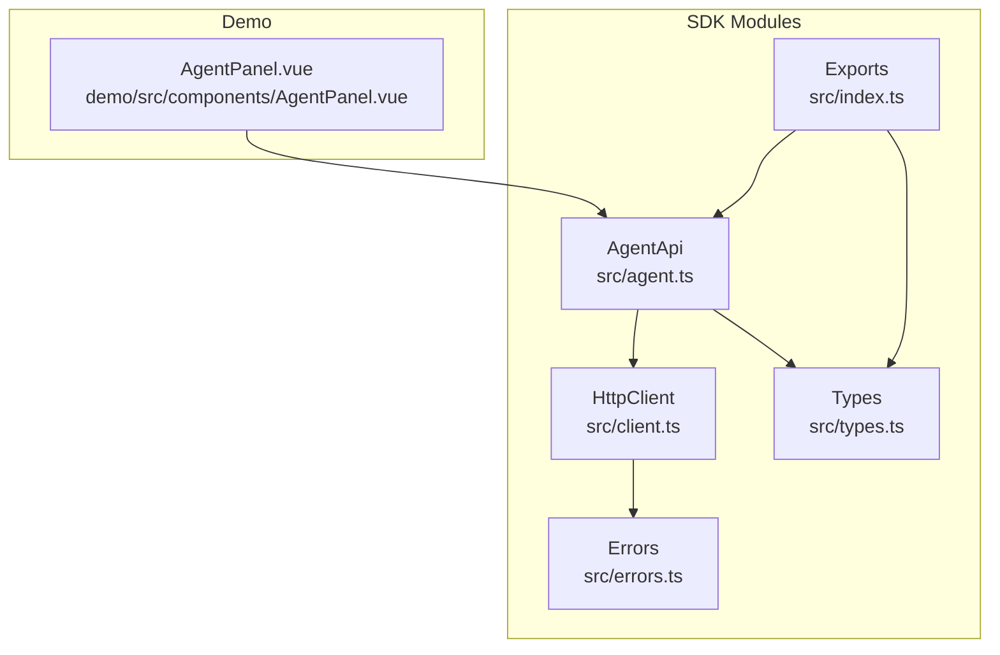
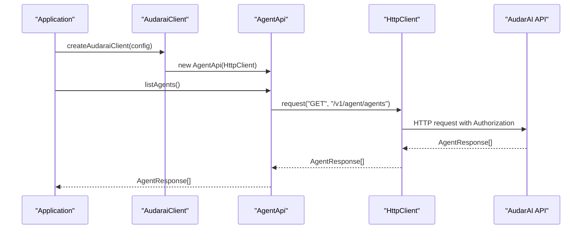
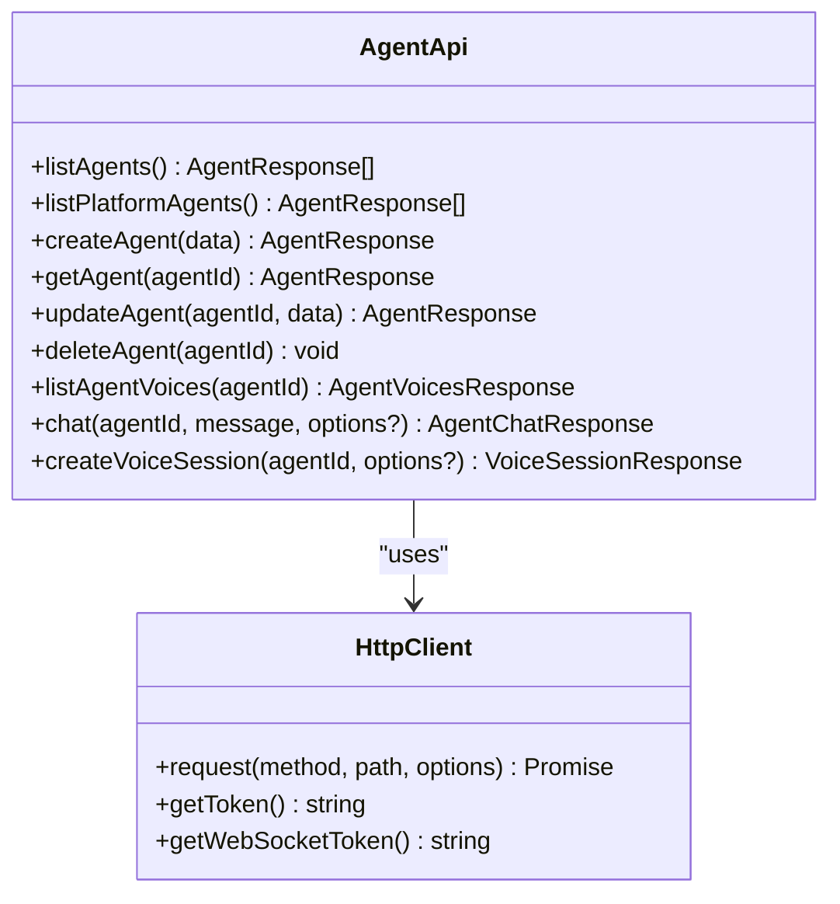
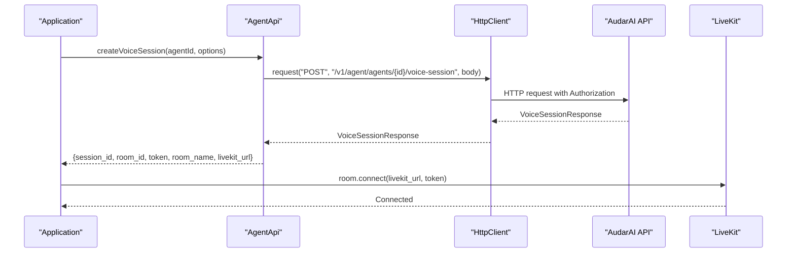
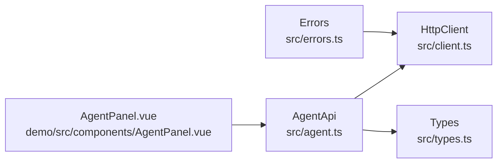

# Agent Management

<cite>
**Referenced Files in This Document**
- [agent.ts](file://src/agent.ts)
- [types.ts](file://src/types.ts)
- [client.ts](file://src/client.ts)
- [index.ts](file://src/index.ts)
- [errors.ts](file://src/errors.ts)
- [AgentPanel.vue](file://demo/src/components/AgentPanel.vue)
- [README.md](file://README.md)
</cite>

## Table of Contents
1. [Introduction](#introduction)
2. [Project Structure](#project-structure)
3. [Core Components](#core-components)
4. [Architecture Overview](#architecture-overview)
5. [Detailed Component Analysis](#detailed-component-analysis)
6. [Dependency Analysis](#dependency-analysis)
7. [Performance Considerations](#performance-considerations)
8. [Troubleshooting Guide](#troubleshooting-guide)
9. [Conclusion](#conclusion)
10. [Appendices](#appendices)

## Introduction
This document provides comprehensive guidance for managing AI agents using the AudarAI JavaScript/TypeScript SDK. It covers agent CRUD operations (create, retrieve, update, delete), configuration parameters, voice selection, platform agent access patterns, listing and filtering, bulk operations, response formats, validation rules, error handling, permissions, ownership models, and tenant isolation. Practical examples demonstrate creation workflows, configuration updates, and lifecycle management.

## Project Structure
The SDK exposes a cohesive API surface for agent management through a dedicated module and integrates with broader platform services (TTS, STT, Translation, Rooms, Sessions). The demo application demonstrates real-world usage patterns for agent creation, editing, listing, and voice sessions.

**Diagram sources**
- [agent.ts:11-28](file://src/agent.ts#L11-L28)
- [client.ts:93-213](file://src/client.ts#L93-L213)
- [types.ts:505-671](file://src/types.ts#L505-L671)
- [index.ts:8-16](file://src/index.ts#L8-L16)
- [AgentPanel.vue:1-120](file://demo/src/components/AgentPanel.vue#L1-L120)

**Section sources**
- [agent.ts:11-28](file://src/agent.ts#L11-L28)
- [index.ts:8-16](file://src/index.ts#L8-L16)

## Core Components
- AgentApi: Provides agent CRUD, listing, voice selection, and voice session creation endpoints.
- Types: Defines agent configuration interfaces, response shapes, and voice/session options.
- HttpClient: Handles authentication, token management, request building, and error mapping.
- Demo AgentPanel: Demonstrates practical workflows for listing, creating, updating, deleting agents, and starting voice sessions.

Key responsibilities:
- AgentApi: Exposes listAgents, listPlatformAgents, createAgent, getAgent, updateAgent, deleteAgent, listAgentVoices, chat, createVoiceSession.
- Types: AgentCreate, AgentUpdate, AgentResponse, AgentVoicesResponse, VoiceSessionRequest, VoiceSessionResponse.
- HttpClient: Token acquisition, request signing, 401 handling, rate limiting, and binary responses.
- Demo: UI-driven flows for agent management and voice sessions.

**Section sources**
- [agent.ts:32-156](file://src/agent.ts#L32-L156)
- [types.ts:505-671](file://src/types.ts#L505-L671)
- [client.ts:133-213](file://src/client.ts#L133-L213)
- [AgentPanel.vue:111-281](file://demo/src/components/AgentPanel.vue#L111-L281)

## Architecture Overview
Agent management follows a layered architecture:
- Client layer: AudaraiClient constructs and exposes APIs including AgentApi.
- HTTP layer: HttpClient manages authentication, token refresh, and request/response handling.
- Domain layer: AgentApi encapsulates agent operations and delegates to HttpClient.
- Type layer: Strongly typed interfaces define request/response contracts.

**Diagram sources**
- [index.ts:160-192](file://src/index.ts#L160-L192)
- [agent.ts:32-34](file://src/agent.ts#L32-L34)
- [client.ts:133-173](file://src/client.ts#L133-L173)

## Detailed Component Analysis

### AgentApi: CRUD and Voice Operations
AgentApi provides:
- Listing
  - listAgents(): Tenant-scoped agents.
  - listPlatformAgents(): Platform-wide agents accessible to authenticated users.
- Creation and Retrieval
  - createAgent(AgentCreate): Creates an agent with configuration and bindings.
  - getAgent(agentId): Retrieves a specific agent.
- Updates and Deletion
  - updateAgent(agentId, AgentUpdate): Partial or full updates.
  - deleteAgent(agentId): Removes an agent.
- Voice Selection and Sessions
  - listAgentVoices(agentId): Resolves compatible voices for an agent’s TTS model.
  - chat(agentId, message, options?): Starts a voice session and returns session/room identifiers.
  - createVoiceSession(agentId, options?): Single-call creation of a voice session with LiveKit token.

**Diagram sources**
- [agent.ts:11-28](file://src/agent.ts#L11-L28)
- [agent.ts:32-156](file://src/agent.ts#L32-L156)
- [client.ts:93-213](file://src/client.ts#L93-L213)

**Section sources**
- [agent.ts:32-156](file://src/agent.ts#L32-L156)

### Agent Configuration Parameters
AgentCreate and AgentUpdate define configuration fields:
- Identity and presentation
  - name, description, role, language, is_public, is_platform.
- Voice and media
  - voice_id, memory_policy, media_policy, allow_interruptions, allow_interruptions_opening, turn_policy.
- Models
  - stt_model, tts_model, llm_model.
- Bindings
  - skills[], knowledge_bindings[], tool_bindings[] (AgentUpdate also includes channel_bindings[]).
- System prompt and closing statement
  - system_prompt, closing_statement (nullable).
- Archetype association
  - archetype_id.

AgentResponse mirrors AgentCreate/Update with additional metadata:
- tenant_id, owner_user_id, status, created_at, updated_at.

Validation and constraints:
- Fields are optional unless explicitly required by the API (e.g., name in AgentCreate).
- ToolBindings require tool_id.
- MemoryPolicy supports enabling memory and setting history turns.
- MediaPolicy controls video and recording defaults.
- TurnPolicy tunes endpointing, VAD, and preemptive generation.

Practical example paths:
- Creating an agent with skills, knowledge, and memory policy: [AgentPanel.vue:136-168](file://demo/src/components/AgentPanel.vue#L136-L168)
- Updating an agent’s voice and models: [AgentPanel.vue:237-270](file://demo/src/components/AgentPanel.vue#L237-L270)

**Section sources**
- [types.ts:505-570](file://src/types.ts#L505-L570)
- [types.ts:572-606](file://src/types.ts#L572-L606)
- [AgentPanel.vue:92-168](file://demo/src/components/AgentPanel.vue#L92-L168)
- [AgentPanel.vue:170-270](file://demo/src/components/AgentPanel.vue#L170-L270)

### Voice Selection and Platform Access Patterns
Voice selection:
- listAgentVoices(agentId) resolves the agent’s TTS model (falls back to platform default) and returns compatible voices. Voices are grouped by owner_user_id (null = system, non-null = caller’s uploads).

Platform agents:
- listPlatformAgents() returns agents visible to all authenticated users, regardless of tenant.

Access patterns:
- Tenant isolation: listAgents() is tenant-scoped; listPlatformAgents() is cross-tenant.
- Ownership: AgentResponse includes tenant_id and owner_user_id for ownership and isolation.

Practical example paths:
- Loading platform agents: [AgentPanel.vue:124-134](file://demo/src/components/AgentPanel.vue#L124-L134)
- Filtering voices by owner: [AgentPanel.vue:310-334](file://demo/src/components/AgentPanel.vue#L310-L334)

**Section sources**
- [agent.ts:36-39](file://src/agent.ts#L36-L39)
- [agent.ts:77-82](file://src/agent.ts#L77-L82)
- [types.ts:621-626](file://src/types.ts#L621-L626)
- [AgentPanel.vue:124-134](file://demo/src/components/AgentPanel.vue#L124-L134)
- [AgentPanel.vue:310-334](file://demo/src/components/AgentPanel.vue#L310-L334)

### Listing Methods, Filtering, and Bulk Operations
Listing:
- listAgents(): Returns tenant-scoped agents.
- listPlatformAgents(): Returns platform-wide agents.

Filtering:
- The SDK does not expose server-side filters in AgentApi methods. Filtering should be performed client-side on the returned arrays.

Bulk operations:
- The SDK does not expose dedicated bulk endpoints for agents. Use repeated calls to update/delete for small batches or implement batching at the application level.

Practical example paths:
- Listing agents and platform agents: [AgentPanel.vue:111-134](file://demo/src/components/AgentPanel.vue#L111-L134)

**Section sources**
- [agent.ts:32-39](file://src/agent.ts#L32-L39)
- [AgentPanel.vue:111-134](file://demo/src/components/AgentPanel.vue#L111-L134)

### Voice Session Workflows
Two primary workflows are supported:
- chat(): Creates a session and returns session_id and room_id. Use sessions.getLiveKitToken() to obtain a token for LiveKit.
- createVoiceSession(): Single-call creation that returns session_id, room_id, token, room_name, and livekit_url.

Session options include:
- voice_id override, user_name/user_id, language override, variables for template substitution, room_name, max_duration_seconds, inactivity_timeout_seconds, media_overrides, webhook_metadata, allow_interruptions, allow_interruptions_opening, turn_policy overrides.

Practical example paths:
- Starting a voice session with overrides: [AgentPanel.vue:561-618](file://demo/src/components/AgentPanel.vue#L561-L618)
- Joining an existing session: [AgentPanel.vue:620-641](file://demo/src/components/AgentPanel.vue#L620-L641)

**Diagram sources**
- [agent.ts:144-156](file://src/agent.ts#L144-L156)
- [types.ts:665-671](file://src/types.ts#L665-L671)
- [AgentPanel.vue:561-618](file://demo/src/components/AgentPanel.vue#L561-L618)

**Section sources**
- [agent.ts:95-156](file://src/agent.ts#L95-L156)
- [types.ts:632-671](file://src/types.ts#L632-L671)
- [AgentPanel.vue:561-641](file://demo/src/components/AgentPanel.vue#L561-L641)

### Response Formats and Validation Rules
Response types:
- AgentResponse: Complete agent definition with metadata and configuration.
- AgentVoicesResponse: tts_model and compatible voices with owner_user_id and tenant_id.
- AgentChatResponse: session_id and room_id for quick-start chat.
- VoiceSessionResponse: session_id, room_id, token, room_name, livekit_url.

Validation rules:
- Required fields: name in AgentCreate.
- Optional fields: voice_id, language, roles, models, bindings, memory_policy, media_policy, turn_policy.
- Tool bindings require tool_id.
- Closing statement accepts null to clear.

Practical example paths:
- Agent response shape: [types.ts:572-606](file://src/types.ts#L572-L606)
- Voice response shape: [types.ts:613-626](file://src/types.ts#L613-L626)
- Voice session response shape: [types.ts:665-671](file://src/types.ts#L665-L671)

**Section sources**
- [types.ts:572-671](file://src/types.ts#L572-L671)

### Permissions, Ownership, and Tenant Isolation
Permissions:
- listAgents(): Requires tenant membership.
- listPlatformAgents(): Accessible to any authenticated user.
- createAgent(): Requires appropriate permissions for the tenant.
- updateAgent/deleteAgent: Requires ownership or elevated permissions.

Ownership and isolation:
- AgentResponse includes tenant_id and owner_user_id.
- listAgentVoices() returns voices grouped by owner_user_id (system vs caller’s uploads).
- Platform agents are visible across tenants but remain read-only for non-owners.

Practical example paths:
- Platform agent listing: [AgentPanel.vue:124-134](file://demo/src/components/AgentPanel.vue#L124-L134)
- Voice owner grouping: [AgentPanel.vue:310-334](file://demo/src/components/AgentPanel.vue#L310-L334)

**Section sources**
- [agent.ts:36-39](file://src/agent.ts#L36-L39)
- [agent.ts:77-82](file://src/agent.ts#L77-L82)
- [types.ts:572-606](file://src/types.ts#L572-L606)
- [types.ts:621-626](file://src/types.ts#L621-L626)
- [AgentPanel.vue:124-134](file://demo/src/components/AgentPanel.vue#L124-L134)
- [AgentPanel.vue:310-334](file://demo/src/components/AgentPanel.vue#L310-L334)

## Dependency Analysis
AgentApi depends on HttpClient for HTTP operations and on Types for request/response contracts. The demo component depends on AgentApi for UI-driven workflows.

**Diagram sources**
- [agent.ts:11-28](file://src/agent.ts#L11-L28)
- [client.ts:93-213](file://src/client.ts#L93-L213)
- [types.ts:505-671](file://src/types.ts#L505-L671)
- [AgentPanel.vue:1-120](file://demo/src/components/AgentPanel.vue#L1-L120)

**Section sources**
- [agent.ts:11-28](file://src/agent.ts#L11-L28)
- [client.ts:93-213](file://src/client.ts#L93-L213)
- [types.ts:505-671](file://src/types.ts#L505-L671)
- [AgentPanel.vue:1-120](file://demo/src/components/AgentPanel.vue#L1-L120)

## Performance Considerations
- Token caching and refresh: HttpClient proactively refreshes tokens before expiry and retries 401 responses once automatically.
- Pre-warming: The demo shows LiveKit pre-warming to reduce connection latency.
- Parallelization: The demo loads dropdown data in parallel to improve UX responsiveness.

[No sources needed since this section provides general guidance]

## Troubleshooting Guide
Common errors and handling:
- AuthenticationError: Occurs when credentials are invalid or missing. Ensure correct authentication mode is configured.
- InsufficientBalanceError: Indicates insufficient credits; top up the account.
- RateLimitedError: Throttled by the server; observe Retry-After header and back off.
- ApiError: Generic HTTP error; inspect statusCode and code for diagnostics.

Token refresh:
- Configure onTokenRefresh for dynamic JWT refresh or rely on internal token manager for static tokens.

Practical example paths:
- Error handling in demos: [AgentPanel.vue:119-121](file://demo/src/components/AgentPanel.vue#L119-L121)
- Error classes: [errors.ts:1-43](file://src/errors.ts#L1-L43)
- HTTP error mapping: [client.ts:187-212](file://src/client.ts#L187-L212)

**Section sources**
- [errors.ts:1-43](file://src/errors.ts#L1-L43)
- [client.ts:187-212](file://src/client.ts#L187-L212)
- [AgentPanel.vue:119-121](file://demo/src/components/AgentPanel.vue#L119-L121)

## Conclusion
The SDK provides a robust, strongly typed interface for agent management, including CRUD operations, voice selection, and integrated voice sessions. It enforces tenant isolation and platform-wide visibility for platform agents, supports flexible configuration, and integrates seamlessly with LiveKit for voice experiences. The demo illustrates practical workflows for creating, updating, listing, and interacting with agents.

[No sources needed since this section summarizes without analyzing specific files]

## Appendices

### Practical Examples

- Create an agent with skills, knowledge, and memory policy
  - Example path: [AgentPanel.vue:136-168](file://demo/src/components/AgentPanel.vue#L136-L168)

- Update an agent’s voice and models
  - Example path: [AgentPanel.vue:237-270](file://demo/src/components/AgentPanel.vue#L237-L270)

- Start a voice session with overrides
  - Example path: [AgentPanel.vue:561-618](file://demo/src/components/AgentPanel.vue#L561-L618)

- Join an existing session
  - Example path: [AgentPanel.vue:620-641](file://demo/src/components/AgentPanel.vue#L620-L641)

- List platform agents
  - Example path: [AgentPanel.vue:124-134](file://demo/src/components/AgentPanel.vue#L124-L134)

- List agent voices and group by owner
  - Example path: [AgentPanel.vue:310-334](file://demo/src/components/AgentPanel.vue#L310-L334)

**Section sources**
- [AgentPanel.vue:136-168](file://demo/src/components/AgentPanel.vue#L136-L168)
- [AgentPanel.vue:237-270](file://demo/src/components/AgentPanel.vue#L237-L270)
- [AgentPanel.vue:561-618](file://demo/src/components/AgentPanel.vue#L561-L618)
- [AgentPanel.vue:620-641](file://demo/src/components/AgentPanel.vue#L620-L641)
- [AgentPanel.vue:124-134](file://demo/src/components/AgentPanel.vue#L124-L134)
- [AgentPanel.vue:310-334](file://demo/src/components/AgentPanel.vue#L310-L334)