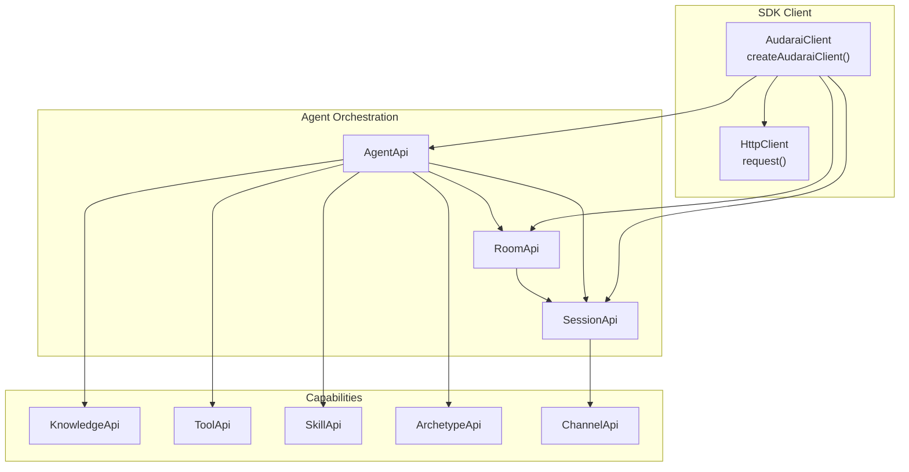
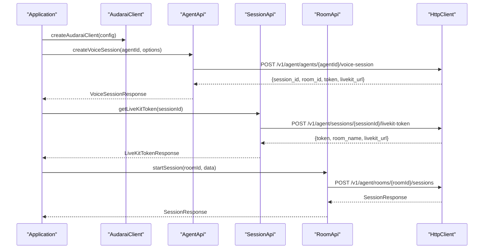
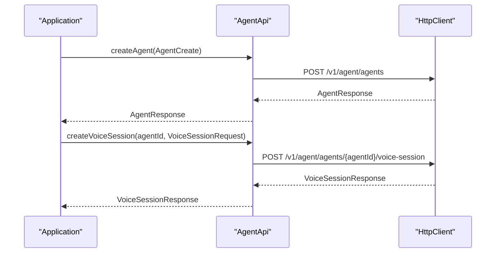
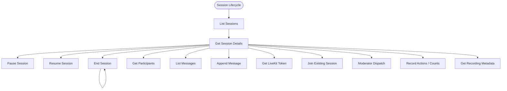
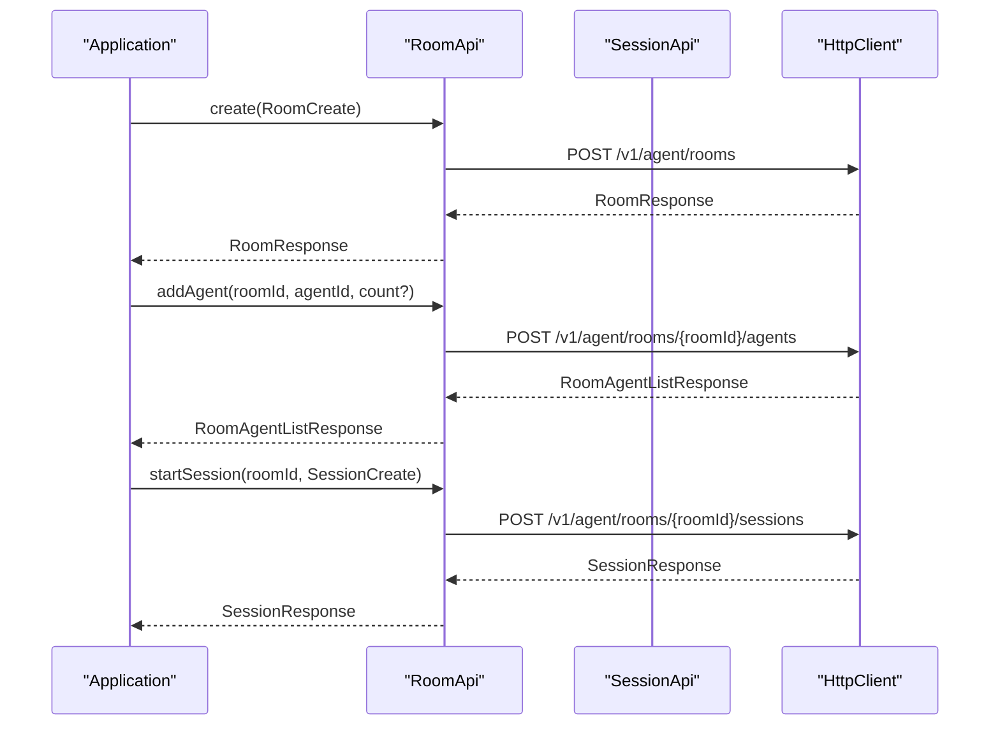
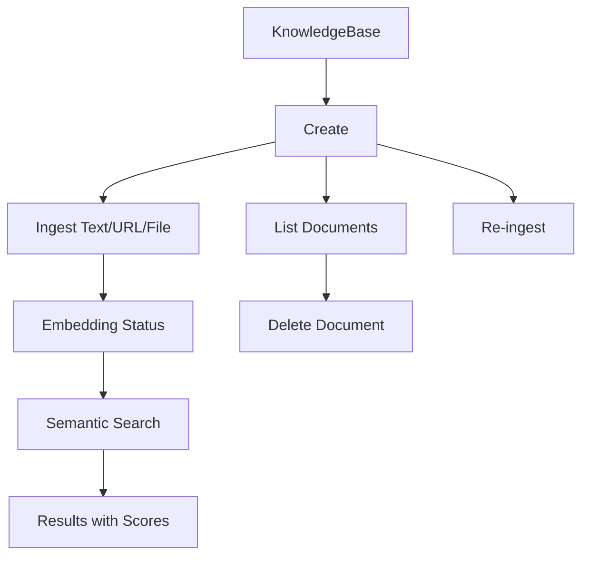
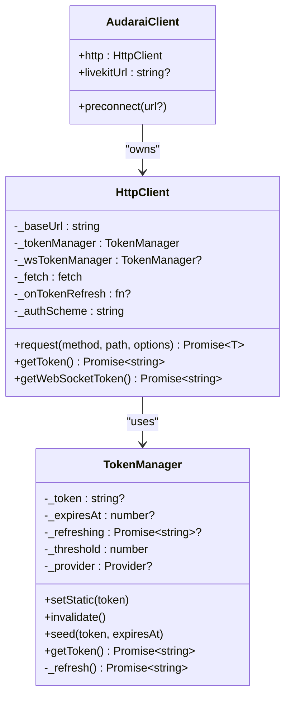
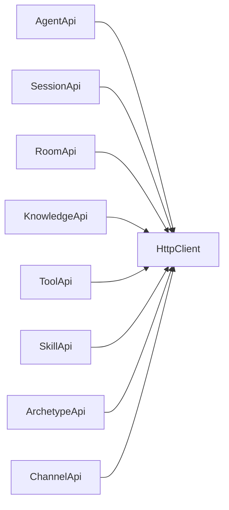

# Agent Orchestration

<cite>
**Referenced Files in This Document**
- [agent.ts](file://src/agent.ts)
- [session.ts](file://src/session.ts)
- [client.ts](file://src/client.ts)
- [types.ts](file://src/types.ts)
- [index.ts](file://src/index.ts)
- [knowledge.ts](file://src/knowledge.ts)
- [tool.ts](file://src/tool.ts)
- [skill.ts](file://src/skill.ts)
- [archetype.ts](file://src/archetype.ts)
- [room.ts](file://src/room.ts)
- [channel.ts](file://src/channel.ts)
- [README.md](file://README.md)
- [AgentPanel.vue](file://demo/src/components/AgentPanel.vue)
- [useClient.ts](file://demo/src/composables/useClient.ts)
</cite>

## Table of Contents
1. [Introduction](#introduction)
2. [Project Structure](#project-structure)
3. [Core Components](#core-components)
4. [Architecture Overview](#architecture-overview)
5. [Detailed Component Analysis](#detailed-component-analysis)
6. [Dependency Analysis](#dependency-analysis)
7. [Performance Considerations](#performance-considerations)
8. [Troubleshooting Guide](#troubleshooting-guide)
9. [Conclusion](#conclusion)
10. [Appendices](#appendices)

## Introduction
This document explains the Agent Orchestration system in the AudarAI JavaScript/TypeScript SDK. It covers how to create, configure, and manage AI agents, how to start and control voice sessions, how to integrate knowledge bases, tools, skills, and archetypes, and how to persist and track conversations. It also provides practical workflows, diagrams, and guidance for performance and troubleshooting.

## Project Structure
The SDK exposes a cohesive client that composes multiple APIs:
- Agent orchestration: agent management, voice session creation, and voice session helpers
- Session lifecycle: listing, pausing/resuming, ending, participant context, messages, and LiveKit token retrieval
- Rooms: persistent containers for multi-agent voice sessions
- Knowledge base: ingestion, search, and document management
- Tools, Skills, Archetypes, Channels: agent capability extensions
- Client and HTTP layer: authentication, token management, and request handling

**Diagram sources**
- [index.ts:160-192](file://src/index.ts#L160-L192)
- [client.ts:215-410](file://src/client.ts#L215-L410)
- [agent.ts:11-28](file://src/agent.ts#L11-L28)
- [session.ts:4-5](file://src/session.ts#L4-L5)
- [room.ts:4-5](file://src/room.ts#L4-L5)

**Section sources**
- [README.md:19-33](file://README.md#L19-L33)
- [index.ts:1-193](file://src/index.ts#L1-L193)
- [client.ts:215-410](file://src/client.ts#L215-L410)

## Core Components
- AgentApi: agent CRUD, voice session creation, voice selection, and quick-start chat
- SessionApi: session lifecycle, participant context, messages, LiveKit token/join, moderator dispatch, actions
- RoomApi: room CRUD, agent binding, and session creation within rooms
- KnowledgeApi: knowledge CRUD, ingestion, search, and document management
- ToolApi, SkillApi, ArchetypeApi, ChannelApi: capability management for agents
- HttpClient and TokenManager: authentication, token refresh, and request/response handling

Key configuration patterns:
- AgentCreate/AgentUpdate include memory_policy, media_policy, tool_bindings, skills, knowledge_bindings, channel_bindings, turn_policy, and interruption preferences
- VoiceSessionRequest allows per-session overrides for language, variables, recording, and webhook metadata
- SessionCreate and LiveKitTokenRequest allow per-session and per-token overrides

**Section sources**
- [agent.ts:11-158](file://src/agent.ts#L11-L158)
- [session.ts:4-235](file://src/session.ts#L4-L235)
- [room.ts:4-108](file://src/room.ts#L4-L108)
- [knowledge.ts:12-137](file://src/knowledge.ts#L12-L137)
- [tool.ts:4-37](file://src/tool.ts#L4-L37)
- [skill.ts:4-33](file://src/skill.ts#L4-L33)
- [archetype.ts:4-33](file://src/archetype.ts#L4-L33)
- [types.ts:505-671](file://src/types.ts#L505-L671)
- [types.ts:837-857](file://src/types.ts#L837-L857)

## Architecture Overview
The SDK composes a single client that encapsulates all APIs. Authentication is handled centrally, and HTTP requests are routed to the appropriate API endpoints. Voice sessions integrate with LiveKit via token retrieval or direct session creation.

**Diagram sources**
- [agent.ts:144-156](file://src/agent.ts#L144-L156)
- [session.ts:137-143](file://src/session.ts#L137-L143)
- [room.ts:82-99](file://src/room.ts#L82-L99)
- [client.ts:133-173](file://src/client.ts#L133-L173)

**Section sources**
- [README.md:412-463](file://README.md#L412-L463)
- [README.md:615-656](file://README.md#L615-L656)
- [README.md:659-731](file://README.md#L659-L731)

## Detailed Component Analysis

### AgentApi: Agent Lifecycle and Voice Sessions
AgentApi provides:
- Listing agents (tenant and platform-wide)
- Creating, retrieving, updating, and deleting agents
- Listing selectable voices for an agent (resolved against agent’s TTS model)
- Starting a voice session with a single call (returns session and LiveKit token)
- Initiating a chat that returns session/room identifiers for later LiveKit connection

Practical workflows:
- Create an agent with skills, knowledge, tools, and archetypes
- Start a voice session with optional voice_id, language, variables, recording overrides, and webhook metadata
- Use chat() for a quick start that returns session/room identifiers

**Diagram sources**
- [agent.ts:41-61](file://src/agent.ts#L41-L61)
- [agent.ts:144-156](file://src/agent.ts#L144-L156)

**Section sources**
- [agent.ts:32-82](file://src/agent.ts#L32-L82)
- [agent.ts:95-108](file://src/agent.ts#L95-L108)
- [agent.ts:144-156](file://src/agent.ts#L144-L156)
- [types.ts:505-570](file://src/types.ts#L505-L570)
- [types.ts:632-671](file://src/types.ts#L632-L671)

### SessionApi: Session Lifecycle and Conversation Tracking
SessionApi manages:
- Listing sessions (tenant and personal), getting session details
- Pausing, resuming, and ending sessions
- Retrieving participants and participant context
- Appending messages and listing message history
- Getting LiveKit tokens and joining existing sessions
- Moderator-led dispatch and reply-to-member
- Recording metadata retrieval
- Session actions and action counts

**Diagram sources**
- [session.ts:9-53](file://src/session.ts#L9-L53)
- [session.ts:27-37](file://src/session.ts#L27-L37)
- [session.ts:55-100](file://src/session.ts#L55-L100)
- [session.ts:104-124](file://src/session.ts#L104-L124)
- [session.ts:137-160](file://src/session.ts#L137-L160)
- [session.ts:173-192](file://src/session.ts#L173-L192)
- [session.ts:200-233](file://src/session.ts#L200-L233)
- [session.ts:48-53](file://src/session.ts#L48-L53)

**Section sources**
- [session.ts:9-53](file://src/session.ts#L9-L53)
- [session.ts:55-100](file://src/session.ts#L55-L100)
- [session.ts:104-124](file://src/session.ts#L104-L124)
- [session.ts:137-160](file://src/session.ts#L137-L160)
- [session.ts:173-192](file://src/session.ts#L173-L192)
- [session.ts:200-233](file://src/session.ts#L200-L233)

### RoomApi: Multi-Agent Voice Rooms
RoomApi enables:
- Creating rooms with talking styles (sequential, moderator-led, freeform)
- Binding agents to rooms
- Starting sessions within rooms
- Generating phases from speaking rules

**Diagram sources**
- [room.ts:13-29](file://src/room.ts#L13-L29)
- [room.ts:56-70](file://src/room.ts#L56-L70)
- [room.ts:82-99](file://src/room.ts#L82-L99)

**Section sources**
- [room.ts:13-48](file://src/room.ts#L13-L48)
- [room.ts:56-70](file://src/room.ts#L56-L70)
- [room.ts:82-99](file://src/room.ts#L82-L99)

### KnowledgeApi: Knowledge Base Integration
KnowledgeApi supports:
- CRUD for knowledge bases
- Ingestion from text, URL, or file
- Re-ingestion and document management
- Semantic search with configurable top_k and language

**Diagram sources**
- [knowledge.ts:17-51](file://src/knowledge.ts#L17-L51)
- [knowledge.ts:63-97](file://src/knowledge.ts#L63-L97)
- [knowledge.ts:101-114](file://src/knowledge.ts#L101-L114)
- [knowledge.ts:118-135](file://src/knowledge.ts#L118-L135)

**Section sources**
- [knowledge.ts:17-51](file://src/knowledge.ts#L17-L51)
- [knowledge.ts:63-97](file://src/knowledge.ts#L63-L97)
- [knowledge.ts:101-114](file://src/knowledge.ts#L101-L114)
- [knowledge.ts:118-135](file://src/knowledge.ts#L118-L135)

### Tools, Skills, Archetypes, Channels
- ToolApi: create, list, list builtins, get, update, delete tools
- SkillApi: create, list, get, update, delete skills
- ArchetypeApi: create, list, get, update, delete archetypes
- ChannelApi: create, list, get, update, delete channels

These are bound to agents via tool_bindings, skills, knowledge_bindings, and channel_bindings in AgentCreate/AgentUpdate.

**Section sources**
- [tool.ts:7-35](file://src/tool.ts#L7-L35)
- [skill.ts:7-31](file://src/skill.ts#L7-L31)
- [archetype.ts:7-31](file://src/archetype.ts#L7-L31)
- [channel.ts:7-42](file://src/channel.ts#L7-L42)
- [types.ts:505-570](file://src/types.ts#L505-L570)

### Client and Token Management
The client supports four authentication modes:
- Publishable key
- Access token (JWT)
- API key
- App (appid ± appSecret)

It includes proactive token refresh, automatic retry on 401, and WebSocket token exchange.

**Diagram sources**
- [client.ts:22-91](file://src/client.ts#L22-L91)
- [client.ts:93-213](file://src/client.ts#L93-L213)
- [client.ts:215-410](file://src/client.ts#L215-L410)

**Section sources**
- [client.ts:22-91](file://src/client.ts#L22-L91)
- [client.ts:93-213](file://src/client.ts#L93-L213)
- [client.ts:215-410](file://src/client.ts#L215-L410)
- [README.md:117-204](file://README.md#L117-L204)

## Dependency Analysis
Agent orchestration depends on:
- AgentApi for agent management and voice session creation
- SessionApi for session lifecycle and conversation tracking
- RoomApi for multi-agent rooms
- KnowledgeApi, ToolApi, SkillApi, ArchetypeApi, ChannelApi for agent capabilities
- HttpClient for authenticated HTTP requests

**Diagram sources**
- [agent.ts:11-28](file://src/agent.ts#L11-L28)
- [session.ts:4-5](file://src/session.ts#L4-L5)
- [room.ts:4-5](file://src/room.ts#L4-L5)
- [knowledge.ts:12-13](file://src/knowledge.ts#L12-L13)
- [tool.ts:4-5](file://src/tool.ts#L4-L5)
- [skill.ts:4-5](file://src/skill.ts#L4-L5)
- [archetype.ts:4-5](file://src/archetype.ts#L4-L5)
- [channel.ts:4-5](file://src/channel.ts#L4-L5)

**Section sources**
- [index.ts:1-193](file://src/index.ts#L1-L193)

## Performance Considerations
- Pre-warming LiveKit: The client can preconnect to the LiveKit server to reduce first connection latency. The demo shows room preparation and pre-warming strategies.
- Token refresh: Proactive refresh avoids latency spikes near expiration; mutex prevents concurrent refreshes.
- Parallelization: The demo connects to LiveKit and creates the local audio track in parallel to minimize total connection time.
- Recording and media overrides: Configure recording format/layout per session to balance quality and storage cost.

**Section sources**
- [client.ts:380-409](file://src/client.ts#L380-L409)
- [AgentPanel.vue:476-559](file://demo/src/components/AgentPanel.vue#L476-L559)
- [types.ts:479-488](file://src/types.ts#L479-L488)

## Troubleshooting Guide
Common issues and resolutions:
- Authentication failures: Ensure exactly one authentication mode is configured; verify credentials and allowed origins for publishable keys.
- 401 Unauthorized: The client automatically retries once after refreshing tokens; check onTokenRefresh if using static tokens.
- Rate limiting: Respect Retry-After header; implement backoff.
- Insufficient balance: Handle InsufficientBalanceError and prompt top-up.
- Session recording availability: Check recording status and presigned URLs; recording may be pending or failed.

Operational tips:
- Use participant context to override prompts and variables per session.
- Use moderator dispatch to force an agent to respond in multi-agent rooms.
- Persist and track conversation messages for diagnostics.

**Section sources**
- [client.ts:230-244](file://src/client.ts#L230-L244)
- [client.ts:153-170](file://src/client.ts#L153-L170)
- [client.ts:194-197](file://src/client.ts#L194-L197)
- [session.ts:48-53](file://src/session.ts#L48-L53)
- [session.ts:173-192](file://src/session.ts#L173-L192)
- [session.ts:55-100](file://src/session.ts#L55-L100)

## Conclusion
The Agent Orchestration system provides a complete framework for building voice-enabled AI experiences. It integrates agent lifecycle management, voice sessions, conversation tracking, and capability extensions (knowledge, tools, skills, archetypes, channels). With robust authentication, token management, and LiveKit integration, developers can build scalable, maintainable voice applications.

## Appendices

### Practical Workflows

- Agent creation and configuration
  - Use AgentCreate to define memory_policy, media_policy, tool_bindings, skills, knowledge_bindings, channel_bindings, turn_policy, and interruption preferences.
  - Bind archetypes to standardize base prompts and default skills.

- Voice session setup
  - Use createVoiceSession to create a session and obtain a LiveKit token in one call.
  - Optionally override language, variables, recording, and webhook metadata.
  - Use chat() for a quick start that returns session/room identifiers.

- Multi-turn conversation
  - Use SessionApi.listMessages and appendMessage to manage conversation history.
  - Use participant context to inject variables and per-session overrides.

- Agent state transitions
  - Use pause/resume/end to control session lifecycle.
  - Use moderator dispatch to trigger agent responses in multi-agent rooms.

- Session persistence and recording
  - Retrieve recording metadata and presigned URLs for stored sessions.
  - Configure media_overrides for per-session recording preferences.

- Capability integration
  - Bind tools (HTTP, builtin, MCP), skills, knowledge, and channels to agents.
  - Use RoomApi to create rooms with specific talking styles and agent bindings.

**Section sources**
- [types.ts:505-570](file://src/types.ts#L505-L570)
- [types.ts:632-671](file://src/types.ts#L632-L671)
- [session.ts:104-124](file://src/session.ts#L104-L124)
- [session.ts:27-37](file://src/session.ts#L27-L37)
- [session.ts:173-192](file://src/session.ts#L173-L192)
- [room.ts:82-99](file://src/room.ts#L82-L99)
- [knowledge.ts:118-135](file://src/knowledge.ts#L118-L135)
- [tool.ts:18-20](file://src/tool.ts#L18-L20)
- [README.md:412-463](file://README.md#L412-L463)
- [README.md:615-731](file://README.md#L615-L731)

### Demo Usage Notes
- The demo app demonstrates agent CRUD, voice session creation, LiveKit integration, and logging.
- It showcases pre-warming strategies and parallelized connection steps to optimize latency.

**Section sources**
- [AgentPanel.vue:1-800](file://demo/src/components/AgentPanel.vue#L1-L800)
- [useClient.ts:1-36](file://demo/src/composables/useClient.ts#L1-L36)