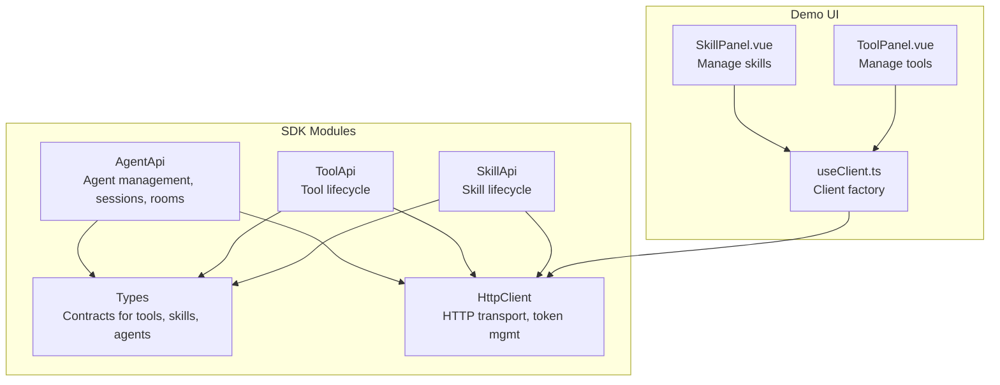
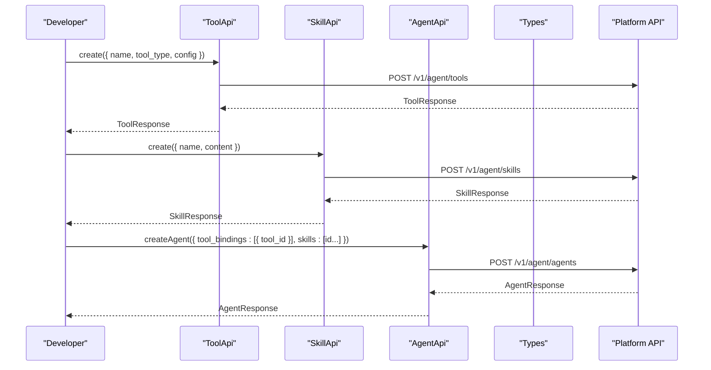
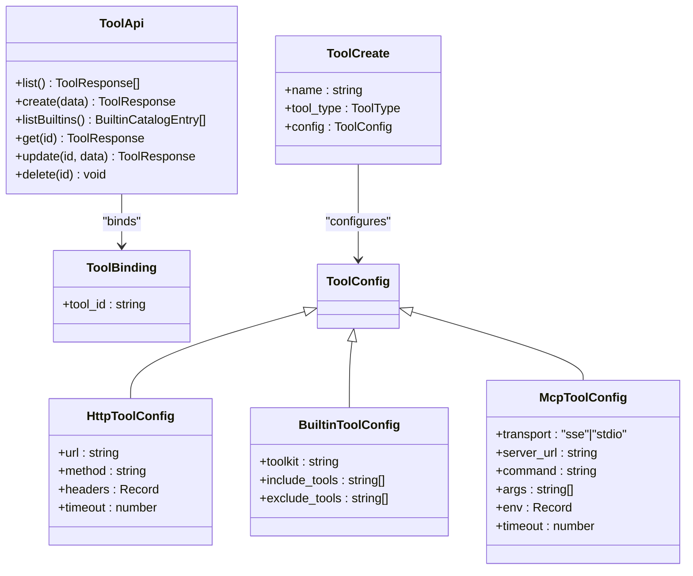
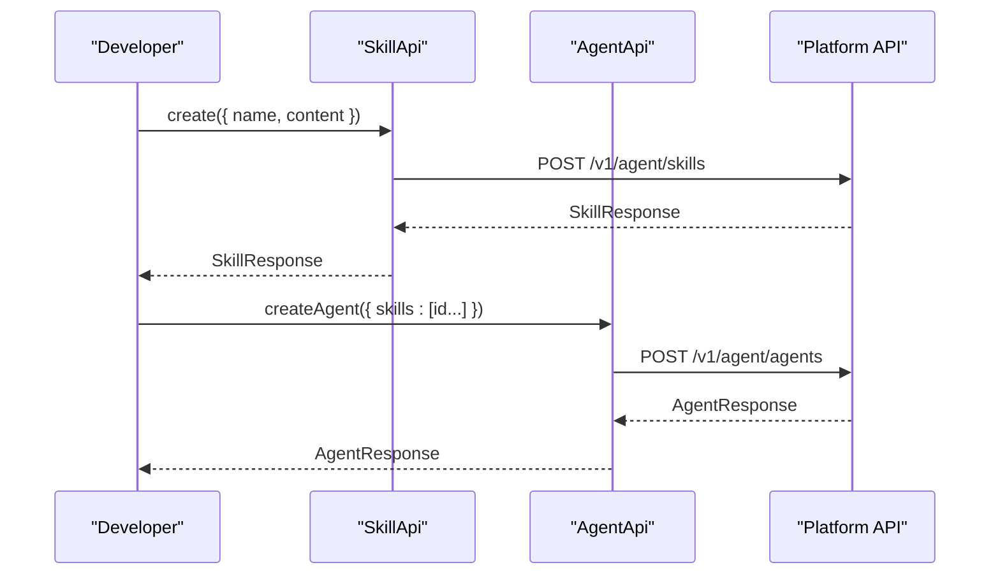
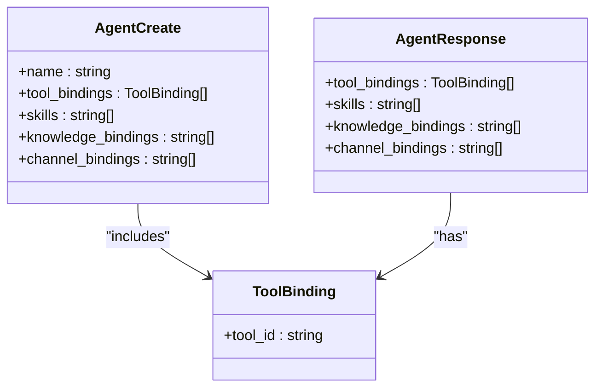
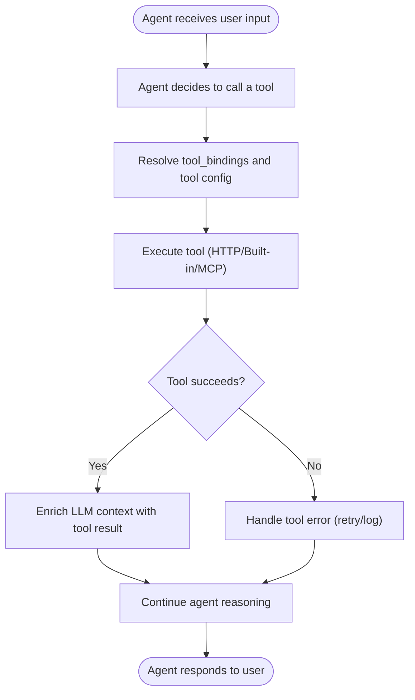
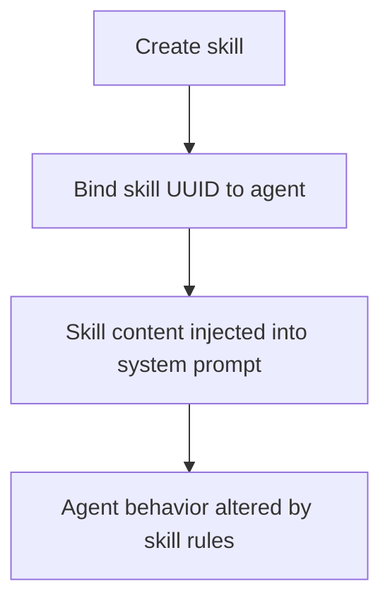
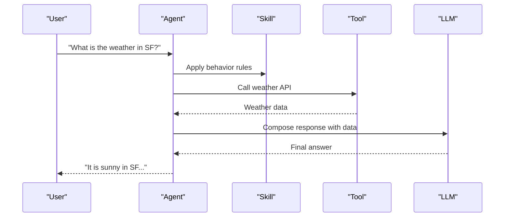
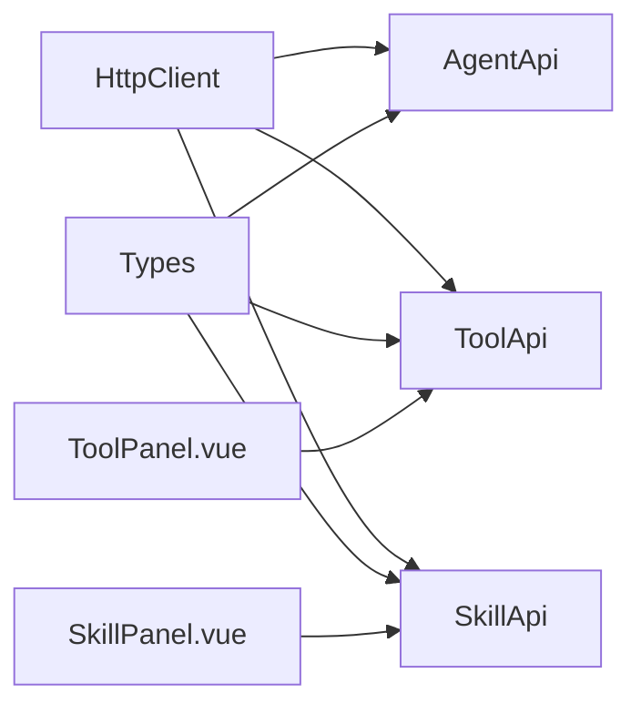

# Agent Tools and Skills

<cite>
**Referenced Files in This Document**
- [agent.ts](file://src/agent.ts)
- [skill.ts](file://src/skill.ts)
- [tool.ts](file://src/tool.ts)
- [types.ts](file://src/types.ts)
- [client.ts](file://src/client.ts)
- [SkillPanel.vue](file://demo/src/components/SkillPanel.vue)
- [ToolPanel.vue](file://demo/src/components/ToolPanel.vue)
- [useClient.ts](file://demo/src/composables/useClient.ts)
- [README.md](file://README.md)
</cite>

## Table of Contents
1. [Introduction](#introduction)
2. [Project Structure](#project-structure)
3. [Core Components](#core-components)
4. [Architecture Overview](#architecture-overview)
5. [Detailed Component Analysis](#detailed-component-analysis)
6. [Dependency Analysis](#dependency-analysis)
7. [Performance Considerations](#performance-considerations)
8. [Troubleshooting Guide](#troubleshooting-guide)
9. [Conclusion](#conclusion)
10. [Appendices](#appendices)

## Introduction
This document explains how the SDK enables agents to extend their capabilities using tools and skills. It covers:
- How tools are registered and invoked by agents
- How skills are configured and injected into agent system prompts
- How agents bind tools and skills at creation/update time
- Practical activation patterns and multi-step agent actions
- Performance optimization, error handling, and debugging strategies

The goal is to help developers configure agents, bind tools and skills, and orchestrate agent capabilities effectively.

## Project Structure
The SDK exposes a cohesive API surface for building voice-enabled AI experiences. The relevant modules for tools and skills are:
- Agent API: manages agents, sessions, rooms, and voice sessions
- Tool API: registers and manages tools (HTTP, built-in, MCP)
- Skill API: creates and manages skills (Markdown snippets injected into system prompts)
- Types: defines data contracts for tools, skills, agents, and orchestration structures
- Client: provides HTTP transport, token management, and error handling

**Diagram sources**
- [agent.ts:11-28](file://src/agent.ts#L11-L28)
- [tool.ts:4-36](file://src/tool.ts#L4-L36)
- [skill.ts:4-32](file://src/skill.ts#L4-L32)
- [types.ts:500-539](file://src/types.ts#L500-L539)
- [client.ts:93-213](file://src/client.ts#L93-L213)
- [SkillPanel.vue:1-271](file://demo/src/components/SkillPanel.vue#L1-L271)
- [ToolPanel.vue:1-404](file://demo/src/components/ToolPanel.vue#L1-L404)
- [useClient.ts:17-35](file://demo/src/composables/useClient.ts#L17-L35)

**Section sources**
- [agent.ts:11-28](file://src/agent.ts#L11-L28)
- [tool.ts:4-36](file://src/tool.ts#L4-L36)
- [skill.ts:4-32](file://src/skill.ts#L4-L32)
- [types.ts:500-539](file://src/types.ts#L500-L539)
- [client.ts:93-213](file://src/client.ts#L93-L213)
- [SkillPanel.vue:1-271](file://demo/src/components/SkillPanel.vue#L1-L271)
- [ToolPanel.vue:1-404](file://demo/src/components/ToolPanel.vue#L1-L404)
- [useClient.ts:17-35](file://demo/src/composables/useClient.ts#L17-L35)

## Core Components
- AgentApi: Provides agent lifecycle operations and voice session creation. Agents can bind skills and tools via their configuration.
- ToolApi: Manages tool lifecycles and built-in tool catalogs. Tools define how agents can call external capabilities.
- SkillApi: Manages skills that inject Markdown content into agent system prompts to alter behavior.
- Types: Define ToolBinding, ToolConfig variants, SkillCreate/SkillUpdate/SkillResponse, and AgentCreate/AgentUpdate/AgentResponse.

Key capabilities:
- Tool registration and discovery (HTTP, built-in, MCP)
- Skill creation and injection into agent system prompts
- Agent configuration with tool_bindings and skills arrays
- Voice session creation that inherits agent-level tool/skill bindings

**Section sources**
- [agent.ts:11-28](file://src/agent.ts#L11-L28)
- [tool.ts:4-36](file://src/tool.ts#L4-L36)
- [skill.ts:4-32](file://src/skill.ts#L4-L32)
- [types.ts:500-539](file://src/types.ts#L500-L539)
- [types.ts:1007-1071](file://src/types.ts#L1007-L1071)
- [types.ts:1081-1109](file://src/types.ts#L1081-L1109)

## Architecture Overview
The agent capability system centers on two mechanisms:
- ToolBinding: associates a tool_id with an agent, enabling tool invocation during conversations
- Skill: Markdown content injected into the agent’s system prompt to modify behavior

**Diagram sources**
- [tool.ts:11-16](file://src/tool.ts#L11-L16)
- [skill.ts:11-16](file://src/skill.ts#L11-L16)
- [agent.ts:41-46](file://src/agent.ts#L41-L46)
- [types.ts:500-539](file://src/types.ts#L500-L539)
- [types.ts:1083-1089](file://src/types.ts#L1083-L1089)

## Detailed Component Analysis

### Tool Registration and Invocation
- Tool types:
  - HTTP: arbitrary REST endpoints with configurable headers and timeouts
  - Built-in: curated toolkits (e.g., web search) with include/exclude filters
  - MCP: Model Context Protocol servers via SSE or stdio
- Tool catalog: Built-in toolkits are discoverable via listBuiltins
- Tool binding: Agents include tool_bindings with tool_id and optional per-tool parameters

**Diagram sources**
- [tool.ts:4-36](file://src/tool.ts#L4-L36)
- [types.ts:500-503](file://src/types.ts#L500-L503)
- [types.ts:1037-1045](file://src/types.ts#L1037-L1045)
- [types.ts:1009-1035](file://src/types.ts#L1009-L1035)

Practical examples (paths):
- Create an HTTP tool: [tool.ts:11-16](file://src/tool.ts#L11-L16)
- Create a built-in tool: [tool.ts:11-16](file://src/tool.ts#L11-L16)
- Create an MCP tool: [tool.ts:11-16](file://src/tool.ts#L11-L16)
- List built-in toolkits: [tool.ts:18-20](file://src/tool.ts#L18-L20)
- Bind a tool to an agent: [types.ts:500-513](file://src/types.ts#L500-L513)

**Section sources**
- [tool.ts:4-36](file://src/tool.ts#L4-L36)
- [types.ts:500-539](file://src/types.ts#L500-L539)
- [types.ts:1007-1071](file://src/types.ts#L1007-L1071)

### Skill Configuration and Injection
- Skills are Markdown snippets that augment agent behavior by injecting into the system prompt
- Skills can be listed, created, updated, and deleted
- Agents reference skills by UUID in their skills array

**Diagram sources**
- [skill.ts:11-16](file://src/skill.ts#L11-L16)
- [agent.ts:41-46](file://src/agent.ts#L41-L46)
- [types.ts:1083-1089](file://src/types.ts#L1083-L1089)

Practical examples (paths):
- Create a skill: [skill.ts:11-16](file://src/skill.ts#L11-L16)
- Update a skill: [skill.ts:22-27](file://src/skill.ts#L22-L27)
- Delete a skill: [skill.ts:29-31](file://src/skill.ts#L29-L31)
- Bind skills to an agent: [types.ts:527-528](file://src/types.ts#L527-L528)

**Section sources**
- [skill.ts:4-32](file://src/skill.ts#L4-L32)
- [types.ts:1081-1109](file://src/types.ts#L1081-L1109)

### Agent Capability Binding
Agents can bind:
- Tools via tool_bindings (tool_id plus optional per-tool parameters)
- Skills via skills array (UUIDs)
- Knowledge and channels via dedicated arrays

**Diagram sources**
- [types.ts:505-539](file://src/types.ts#L505-L539)
- [types.ts:572-606](file://src/types.ts#L572-L606)
- [types.ts:500-503](file://src/types.ts#L500-L503)

Practical examples (paths):
- Create agent with tools and skills: [agent.ts:41-46](file://src/agent.ts#L41-L46)
- Update agent bindings: [agent.ts:52-57](file://src/agent.ts#L52-L57)
- Agent response includes bindings: [types.ts:572-606](file://src/types.ts#L572-L606)

**Section sources**
- [agent.ts:41-61](file://src/agent.ts#L41-L61)
- [types.ts:505-539](file://src/types.ts#L505-L539)
- [types.ts:572-606](file://src/types.ts#L572-L606)

### Tool Invocation Workflow
While the SDK does not implement tool invocation logic itself, the platform orchestrates tool calls based on agent configuration and session context. Typical invocation flow:
- Agent decides to use a tool based on user input and system prompt
- Platform resolves tool_bindings and executes tool with configured parameters
- Tool returns structured results that feed into subsequent steps

[No sources needed since this diagram shows conceptual workflow, not actual code structure]

### Skill Activation Patterns
Skills are activated by inclusion in an agent’s skills array. The platform injects the skill’s Markdown content into the agent’s system prompt, altering behavior for the session or agent lifecycle.

[No sources needed since this diagram shows conceptual workflow, not actual code structure]

### Multi-Step Agent Actions
Agents can orchestrate multi-step actions by combining skills and tools:
- Use skills to enforce behavior rules (e.g., formal tone)
- Use tools to gather external data (e.g., search, database)
- Combine results to inform LLM responses

[No sources needed since this diagram shows conceptual workflow, not actual code structure]

## Dependency Analysis
- AgentApi depends on HttpClient for all HTTP operations
- ToolApi and SkillApi depend on HttpClient for CRUD operations
- Types define contracts used across all APIs
- Demo panels demonstrate UI flows for managing tools and skills

**Diagram sources**
- [client.ts:93-213](file://src/client.ts#L93-L213)
- [agent.ts:11-28](file://src/agent.ts#L11-L28)
- [tool.ts:4-36](file://src/tool.ts#L4-L36)
- [skill.ts:4-32](file://src/skill.ts#L4-L32)
- [types.ts:500-539](file://src/types.ts#L500-L539)
- [ToolPanel.vue:14-136](file://demo/src/components/ToolPanel.vue#L14-L136)
- [SkillPanel.vue:14-89](file://demo/src/components/SkillPanel.vue#L14-L89)

**Section sources**
- [client.ts:93-213](file://src/client.ts#L93-L213)
- [agent.ts:11-28](file://src/agent.ts#L11-L28)
- [tool.ts:4-36](file://src/tool.ts#L4-L36)
- [skill.ts:4-32](file://src/skill.ts#L4-L32)
- [types.ts:500-539](file://src/types.ts#L500-L539)
- [ToolPanel.vue:14-136](file://demo/src/components/ToolPanel.vue#L14-L136)
- [SkillPanel.vue:14-89](file://demo/src/components/SkillPanel.vue#L14-L89)

## Performance Considerations
- Token management: HttpClient proactively refreshes tokens before expiry and retries 401 responses once automatically
- Preconnect optimization: The SDK can pre-warm DNS/TLS for LiveKit to reduce session startup latency
- Tool timeouts: Configure tool timeouts to avoid long blocking calls
- Built-in tool selection: Use include/exclude filters to minimize unnecessary tool exposure

[No sources needed since this section provides general guidance]

## Troubleshooting Guide
Common issues and resolutions:
- Authentication failures: Ensure a single valid auth mode is configured; the SDK enforces mutual exclusivity
- 401 Unauthorized: The SDK retries once after refreshing tokens; check onTokenRefresh or token provider
- Rate limiting: Handle 429 responses and honor Retry-After header
- Tool configuration errors: Validate tool URLs, headers, and timeouts; confirm tool type and transport settings

**Section sources**
- [client.ts:225-244](file://src/client.ts#L225-L244)
- [client.ts:153-170](file://src/client.ts#L153-L170)
- [client.ts:194-197](file://src/client.ts#L194-L197)
- [ToolPanel.vue:76-136](file://demo/src/components/ToolPanel.vue#L76-L136)

## Conclusion
The SDK provides a robust foundation for extending agent capabilities:
- Register tools (HTTP, built-in, MCP) and bind them to agents
- Create and manage skills to inject behavior rules into agent prompts
- Leverage the platform’s orchestration to execute tools and combine results
- Use the provided APIs and demo UI to manage tools and skills efficiently

[No sources needed since this section summarizes without analyzing specific files]

## Appendices

### Practical Examples (Paths)
- Create HTTP tool: [tool.ts:11-16](file://src/tool.ts#L11-L16)
- Create built-in tool: [tool.ts:11-16](file://src/tool.ts#L11-L16)
- Create MCP tool: [tool.ts:11-16](file://src/tool.ts#L11-L16)
- List built-in toolkits: [tool.ts:18-20](file://src/tool.ts#L18-L20)
- Create skill: [skill.ts:11-16](file://src/skill.ts#L11-L16)
- Update skill: [skill.ts:22-27](file://src/skill.ts#L22-L27)
- Delete skill: [skill.ts:29-31](file://src/skill.ts#L29-L31)
- Bind tools and skills to agent: [agent.ts:41-46](file://src/agent.ts#L41-L46)
- Agent response includes bindings: [types.ts:572-606](file://src/types.ts#L572-L606)

**Section sources**
- [tool.ts:11-20](file://src/tool.ts#L11-L20)
- [skill.ts:11-31](file://src/skill.ts#L11-L31)
- [agent.ts:41-46](file://src/agent.ts#L41-L46)
- [types.ts:572-606](file://src/types.ts#L572-L606)