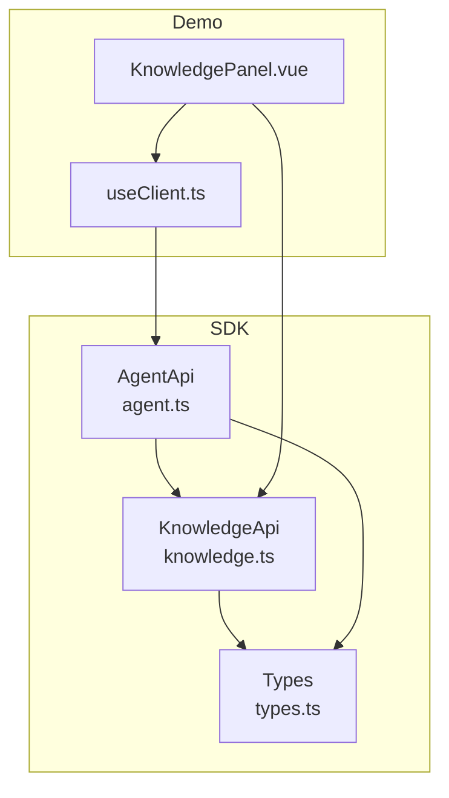
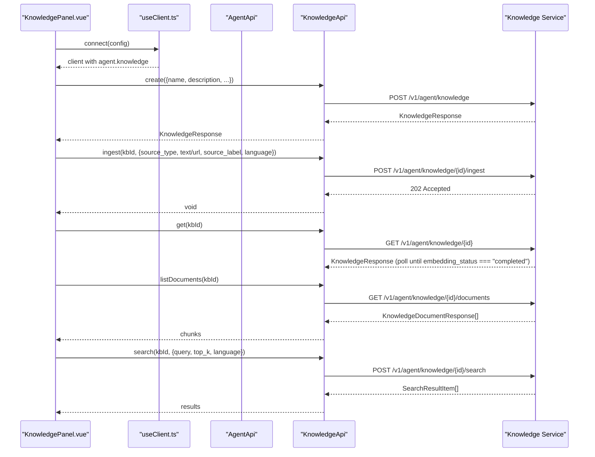
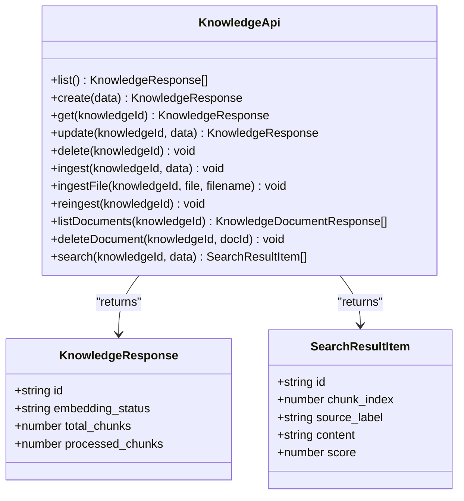
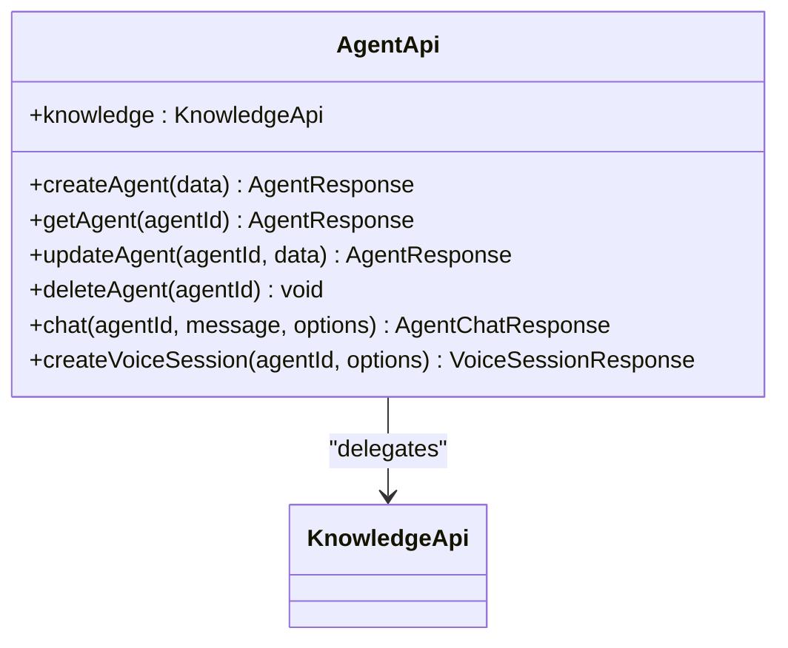
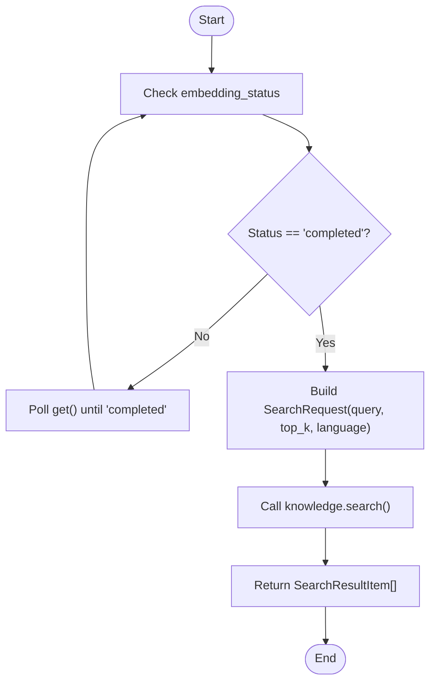
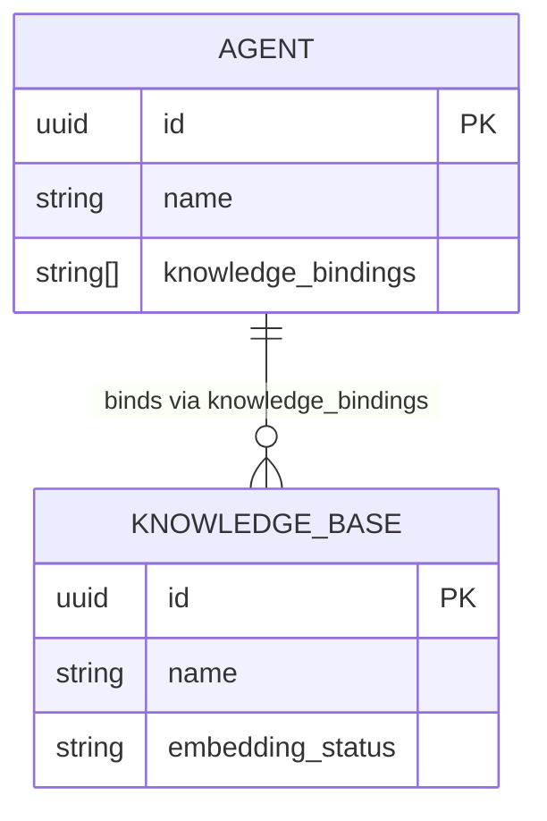
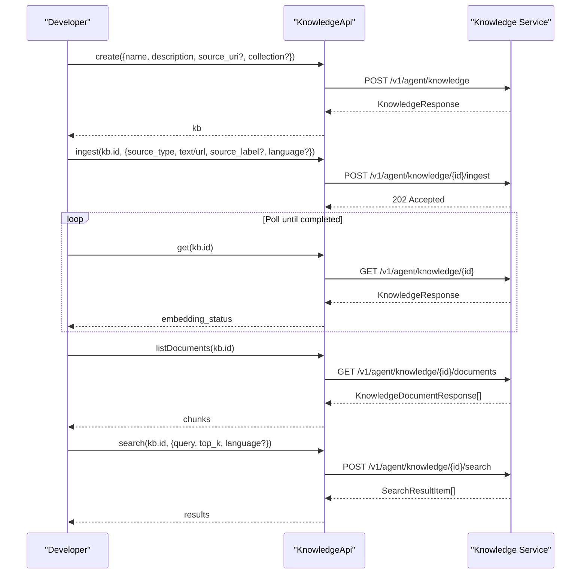
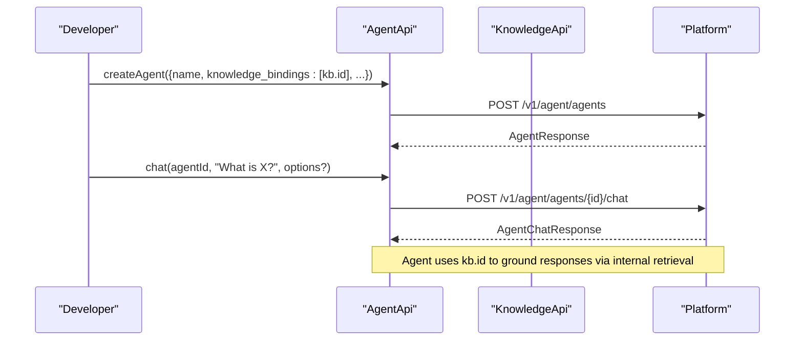
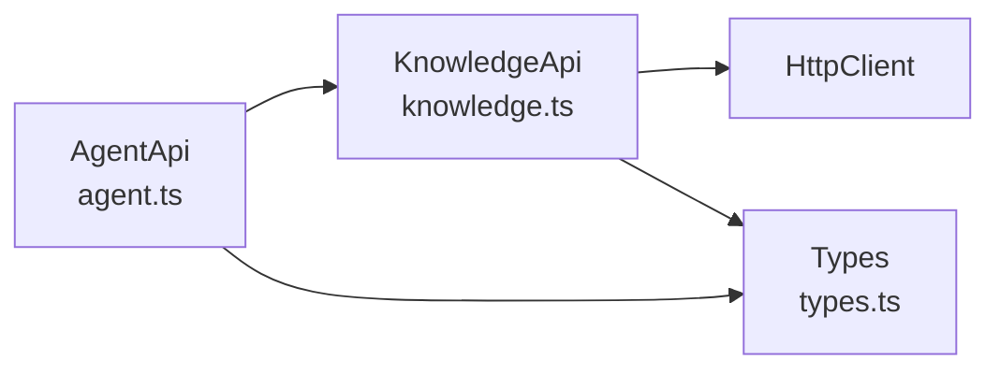

# Agent-Knowledge Integration

<cite>
**Referenced Files in This Document**
- [knowledge.ts](file://src/knowledge.ts)
- [agent.ts](file://src/agent.ts)
- [types.ts](file://src/types.ts)
- [KnowledgePanel.vue](file://demo/src/components/KnowledgePanel.vue)
- [useClient.ts](file://demo/src/composables/useClient.ts)
- [README.md](file://README.md)
- [package.json](file://package.json)
</cite>

## Table of Contents
1. [Introduction](#introduction)
2. [Project Structure](#project-structure)
3. [Core Components](#core-components)
4. [Architecture Overview](#architecture-overview)
5. [Detailed Component Analysis](#detailed-component-analysis)
6. [Dependency Analysis](#dependency-analysis)
7. [Performance Considerations](#performance-considerations)
8. [Troubleshooting Guide](#troubleshooting-guide)
9. [Conclusion](#conclusion)
10. [Appendices](#appendices)

## Introduction
This document explains how agents integrate with knowledge bases to deliver context-aware, grounded responses. It covers semantic search, document grounding, and knowledge retrieval workflows. You will learn how to configure knowledge bases, upload and index documents, attach knowledge to agents, process queries, and enhance responses with retrieved context. Practical examples demonstrate end-to-end flows using the SDK’s Knowledge API and the demo UI.

## Project Structure
The repository provides:
- A TypeScript SDK with a Knowledge API for managing knowledge bases, ingesting content, listing/chunking documents, and performing semantic search.
- An Agent API that exposes a knowledge property for accessing Knowledge API methods.
- A Vue 3 demo app showcasing knowledge base lifecycle, ingestion, and semantic search.

**Diagram sources**
- [agent.ts:11-28](file://src/agent.ts#L11-L28)
- [knowledge.ts:12-136](file://src/knowledge.ts#L12-L136)
- [types.ts:935-1005](file://src/types.ts#L935-L1005)
- [KnowledgePanel.vue:1-529](file://demo/src/components/KnowledgePanel.vue#L1-L529)
- [useClient.ts:17-35](file://demo/src/composables/useClient.ts#L17-L35)

**Section sources**
- [README.md:465-526](file://README.md#L465-L526)
- [package.json:1-26](file://package.json#L1-L26)

## Core Components
- KnowledgeApi: Provides CRUD for knowledge bases, ingestion (text, URL, file), re-ingestion, document listing/deletion, and semantic search.
- AgentApi: Exposes a knowledge property that delegates to KnowledgeApi, enabling agents to leverage knowledge bases.
- Types: Defines request/response shapes for knowledge operations, including embedding status, document chunks, and search results.

Key capabilities:
- Create and manage knowledge bases.
- Ingest content from text, URLs, or files.
- Monitor embedding status and re-ingest when needed.
- List and delete document chunks.
- Perform semantic search with configurable top_k and language.
- Attach knowledge bases to agents via knowledge_bindings.

**Section sources**
- [knowledge.ts:17-136](file://src/knowledge.ts#L17-L136)
- [agent.ts:11-28](file://src/agent.ts#L11-L28)
- [types.ts:935-1005](file://src/types.ts#L935-L1005)

## Architecture Overview
The integration centers on the Knowledge API and its delegation from AgentApi. The demo UI demonstrates end-to-end flows: creating a knowledge base, ingesting content, polling embedding status, listing document chunks, and performing semantic search.

**Diagram sources**
- [KnowledgePanel.vue:31-188](file://demo/src/components/KnowledgePanel.vue#L31-L188)
- [useClient.ts:21-35](file://demo/src/composables/useClient.ts#L21-L35)
- [agent.ts:11-28](file://src/agent.ts#L11-L28)
- [knowledge.ts:17-136](file://src/knowledge.ts#L17-L136)

## Detailed Component Analysis

### KnowledgeApi: Semantic Search and Document Grounding
- CRUD: list, create, get, update, delete.
- Ingestion: ingest text or URL; ingestFile for txt/md/pdf/docx; reingest from source_uri (URL).
- Documents: listDocuments and deleteDocument.
- Search: semantic search with query, top_k, and language.

**Diagram sources**
- [knowledge.ts:12-136](file://src/knowledge.ts#L12-L136)
- [types.ts:951-966](file://src/types.ts#L951-L966)
- [types.ts:997-1005](file://src/types.ts#L997-L1005)

**Section sources**
- [knowledge.ts:17-136](file://src/knowledge.ts#L17-L136)
- [types.ts:935-1005](file://src/types.ts#L935-L1005)

### AgentApi: Knowledge Binding and Delegation
- AgentApi exposes a knowledge property that delegates to KnowledgeApi, enabling agents to manage and query knowledge bases directly.

**Diagram sources**
- [agent.ts:11-28](file://src/agent.ts#L11-L28)

**Section sources**
- [agent.ts:11-28](file://src/agent.ts#L11-L28)

### Semantic Search Workflow
- Precondition: embedding_status must be "completed".
- Inputs: query, top_k, language.
- Outputs: ordered SearchResultItem with score and content.

**Diagram sources**
- [knowledge.ts:118-136](file://src/knowledge.ts#L118-L136)
- [types.ts:990-995](file://src/types.ts#L990-L995)

**Section sources**
- [knowledge.ts:118-136](file://src/knowledge.ts#L118-L136)
- [types.ts:990-995](file://src/types.ts#L990-L995)

### Knowledge Base Attachment to Agents
- Agents can bind multiple knowledge bases via knowledge_bindings.
- This enables context-aware responses during conversations.

**Diagram sources**
- [types.ts:505-539](file://src/types.ts#L505-L539)
- [types.ts:951-966](file://src/types.ts#L951-L966)

**Section sources**
- [types.ts:505-539](file://src/types.ts#L505-L539)
- [types.ts:951-966](file://src/types.ts#L951-L966)

### Practical Examples

#### Example 1: Knowledge Base Configuration and Ingestion
- Create a knowledge base.
- Ingest text, URL, or file.
- Poll embedding_status until "completed".
- List and delete document chunks as needed.
- Perform semantic search.

**Diagram sources**
- [knowledge.ts:17-136](file://src/knowledge.ts#L17-L136)
- [types.ts:951-1005](file://src/types.ts#L951-L1005)

**Section sources**
- [knowledge.ts:17-136](file://src/knowledge.ts#L17-L136)
- [types.ts:951-1005](file://src/types.ts#L951-L1005)

#### Example 2: Agent-Grounded Conversations
- Bind knowledge bases to an agent via knowledge_bindings.
- Start a voice session with the agent.
- During the session, the agent can use retrieved context to inform responses.

**Diagram sources**
- [agent.ts:41-108](file://src/agent.ts#L41-L108)
- [types.ts:505-539](file://src/types.ts#L505-L539)

**Section sources**
- [agent.ts:41-108](file://src/agent.ts#L41-L108)
- [types.ts:505-539](file://src/types.ts#L505-L539)

## Dependency Analysis
- AgentApi depends on KnowledgeApi for knowledge operations.
- KnowledgeApi depends on HttpClient for HTTP requests.
- Types define the contract for all knowledge-related operations.

**Diagram sources**
- [agent.ts:11-28](file://src/agent.ts#L11-L28)
- [knowledge.ts:12-136](file://src/knowledge.ts#L12-L136)
- [types.ts:935-1005](file://src/types.ts#L935-L1005)

**Section sources**
- [agent.ts:11-28](file://src/agent.ts#L11-L28)
- [knowledge.ts:12-136](file://src/knowledge.ts#L12-L136)
- [types.ts:935-1005](file://src/types.ts#L935-L1005)

## Performance Considerations
- Embedding pipeline: Ingestion returns 202 Accepted; poll embedding_status until "completed". This avoids blocking the UI and allows asynchronous processing.
- Search top_k: Tune top_k based on desired recall vs. latency trade-offs.
- Language hints: Provide language in search requests to improve relevance for multilingual content.
- Chunk management: Periodically review and prune unnecessary document chunks to reduce search overhead.

[No sources needed since this section provides general guidance]

## Troubleshooting Guide
Common issues and resolutions:
- Embedding status remains "pending" or "processing":
  - Verify ingestion succeeded and source_uri is valid for URL sources.
  - Poll get() periodically until "completed".
- Embedding status becomes "failed":
  - Re-ingest using reingest for URL sources or fix content and re-ingest text/file.
- Search returns few/no results:
  - Increase top_k or adjust language parameter.
  - Ensure embedding_status is "completed" before searching.
- UI shows stale status:
  - Use the demo’s refresh button to poll get() and update embedding_status.

**Section sources**
- [knowledge.ts:55-97](file://src/knowledge.ts#L55-L97)
- [knowledge.ts:118-136](file://src/knowledge.ts#L118-L136)
- [KnowledgePanel.vue:65-75](file://demo/src/components/KnowledgePanel.vue#L65-L75)

## Conclusion
The SDK provides a cohesive set of primitives for building agent-knowledge integrations:
- Create and manage knowledge bases.
- Ingest diverse content types and monitor embedding progress.
- Ground agent responses with semantic search over document chunks.
- Attach multiple knowledge bases to agents for richer, context-aware conversations.

By following the workflows and best practices outlined here, you can reliably deploy knowledge-grounded agents that deliver accurate, timely, and relevant responses.

## Appendices

### API Reference Highlights
- Knowledge CRUD: list, create, get, update, delete.
- Ingestion: ingest, ingestFile, reingest.
- Documents: listDocuments, deleteDocument.
- Search: search with query, top_k, language.

**Section sources**
- [knowledge.ts:17-136](file://src/knowledge.ts#L17-L136)
- [types.ts:935-1005](file://src/types.ts#L935-L1005)