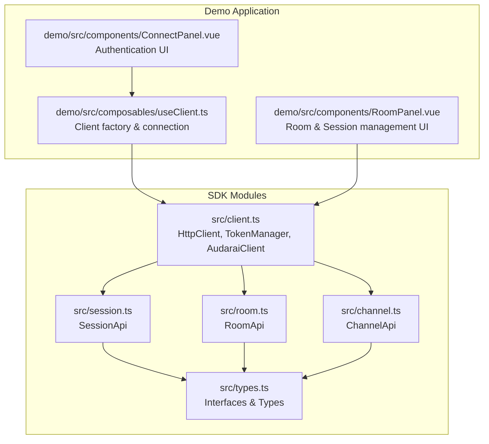
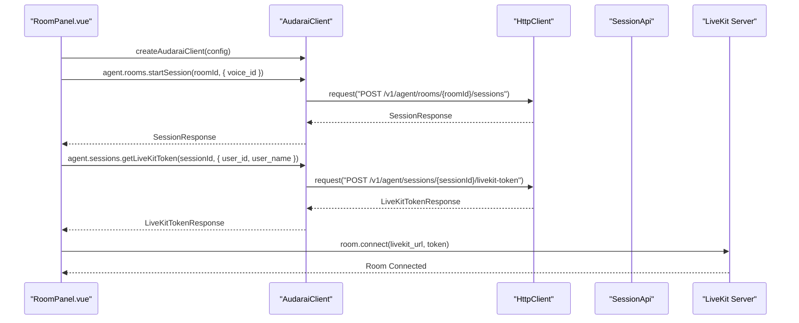
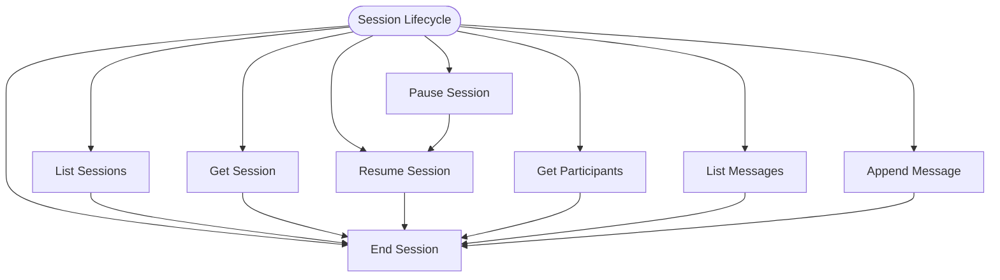
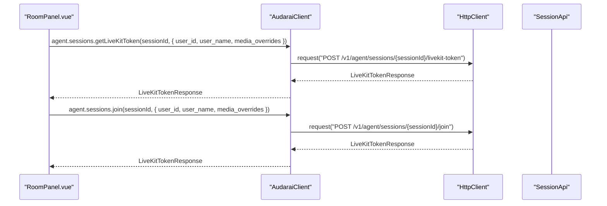
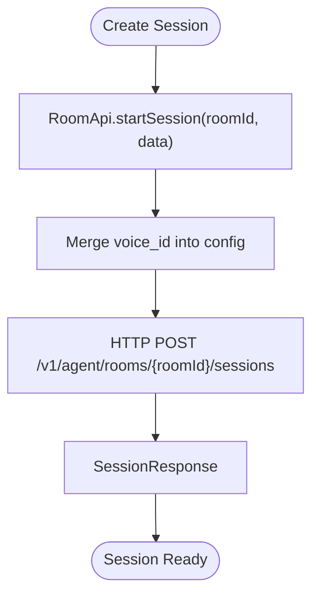
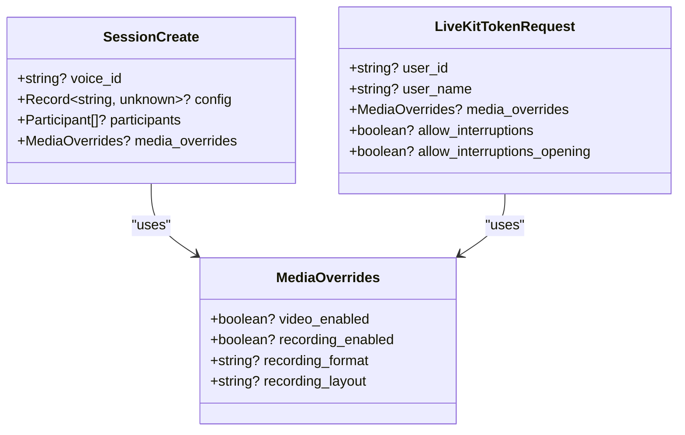
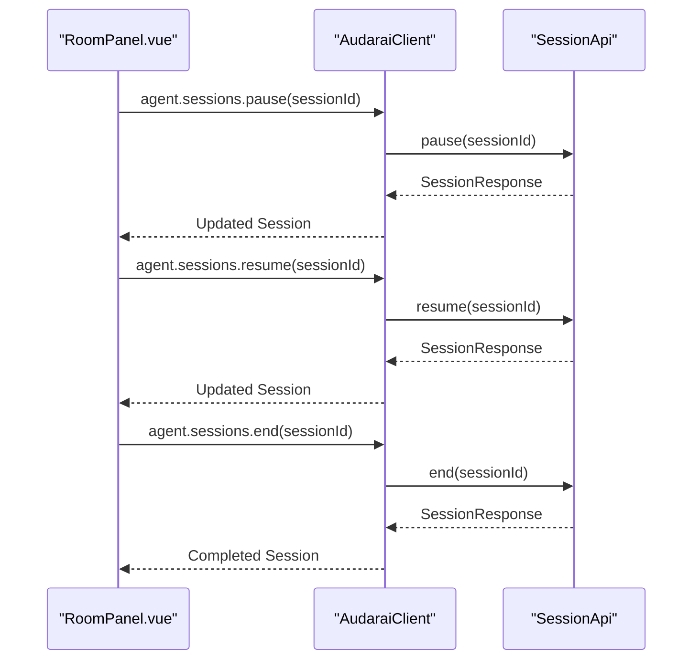
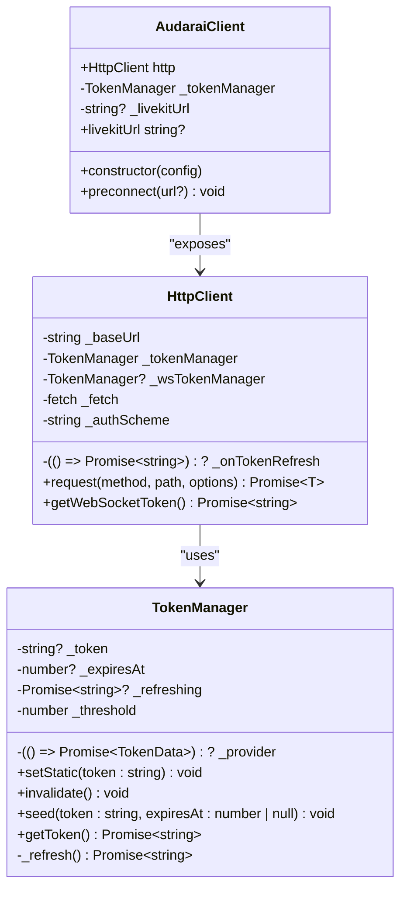
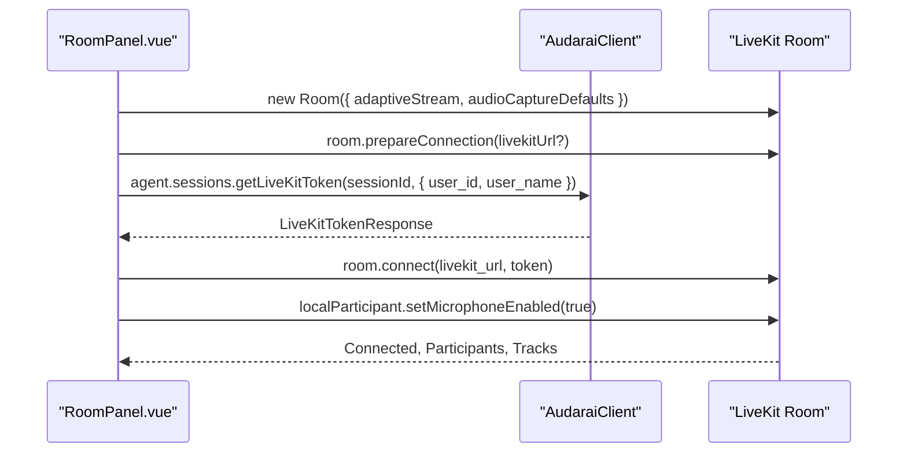
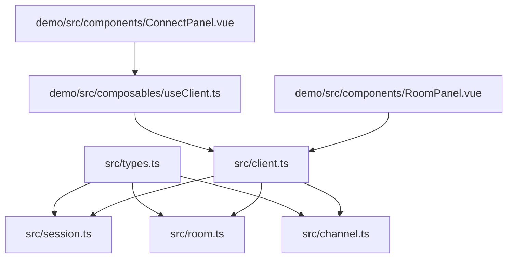

# Voice Session Management

<cite>
**Referenced Files in This Document**
- [session.ts](file://src/session.ts)
- [room.ts](file://src/room.ts)
- [client.ts](file://src/client.ts)
- [types.ts](file://src/types.ts)
- [channel.ts](file://src/channel.ts)
- [useClient.ts](file://demo/src/composables/useClient.ts)
- [ConnectPanel.vue](file://demo/src/components/ConnectPanel.vue)
- [RoomPanel.vue](file://demo/src/components/RoomPanel.vue)
- [README.md](file://README.md)
- [package.json](file://package.json)
</cite>

## Table of Contents
1. [Introduction](#introduction)
2. [Project Structure](#project-structure)
3. [Core Components](#core-components)
4. [Architecture Overview](#architecture-overview)
5. [Detailed Component Analysis](#detailed-component-analysis)
6. [Dependency Analysis](#dependency-analysis)
7. [Performance Considerations](#performance-considerations)
8. [Troubleshooting Guide](#troubleshooting-guide)
9. [Conclusion](#conclusion)
10. [Appendices](#appendices)

## Introduction
This document provides comprehensive documentation for voice session management in the AudarAI JavaScript/TypeScript SDK. It covers session creation, lifecycle management, LiveKit integration, voice selection, media configuration, token generation, connection handling, and real-time communication setup. Practical examples demonstrate session creation workflows, voice parameter configuration, and session monitoring. The guide also includes session state management, timeout handling, and error recovery patterns.

## Project Structure
The SDK is organized into modular TypeScript modules that expose APIs for rooms, sessions, voice token management, and client configuration. The demo application demonstrates end-to-end usage with Vue components for connecting, managing rooms, and initiating voice sessions.

**Diagram sources**
- [client.ts:93-411](file://src/client.ts#L93-L411)
- [session.ts:4-235](file://src/session.ts#L4-L235)
- [room.ts:4-108](file://src/room.ts#L4-L108)
- [types.ts:1-1265](file://src/types.ts#L1-L1265)
- [channel.ts:4-44](file://src/channel.ts#L4-L44)
- [useClient.ts:1-36](file://demo/src/composables/useClient.ts#L1-L36)
- [ConnectPanel.vue:1-336](file://demo/src/components/ConnectPanel.vue#L1-L336)
- [RoomPanel.vue:1-1919](file://demo/src/components/RoomPanel.vue#L1-L1919)

**Section sources**
- [client.ts:93-411](file://src/client.ts#L93-L411)
- [session.ts:4-235](file://src/session.ts#L4-L235)
- [room.ts:4-108](file://src/room.ts#L4-L108)
- [types.ts:1-1265](file://src/types.ts#L1-L1265)
- [useClient.ts:1-36](file://demo/src/composables/useClient.ts#L1-L36)
- [ConnectPanel.vue:1-336](file://demo/src/components/ConnectPanel.vue#L1-L336)
- [RoomPanel.vue:1-1919](file://demo/src/components/RoomPanel.vue#L1-L1919)

## Core Components
- HttpClient: Centralized HTTP client with automatic token management, request building, and response handling including authentication, rate limiting, and error propagation.
- TokenManager: Manages token acquisition, caching, and refresh with configurable thresholds and concurrency control.
- AudaraiClient: High-level client wrapper that configures authentication modes, initializes token providers, and exposes APIs for rooms, sessions, channels, and media services.
- SessionApi: Provides session lifecycle operations (list, get, pause, resume, end), participant management, messaging, LiveKit token retrieval, and moderator dispatch.
- RoomApi: Handles room CRUD operations and session creation within rooms, including voice selection and media overrides.
- Types: Defines interfaces for sessions, LiveKit tokens, participant context, media overrides, and configuration options.

**Section sources**
- [client.ts:22-91](file://src/client.ts#L22-L91)
- [client.ts:93-213](file://src/client.ts#L93-L213)
- [client.ts:215-411](file://src/client.ts#L215-L411)
- [session.ts:4-235](file://src/session.ts#L4-L235)
- [room.ts:4-108](file://src/room.ts#L4-L108)
- [types.ts:837-872](file://src/types.ts#L837-L872)
- [types.ts:1143-1148](file://src/types.ts#L1143-L1148)
- [types.ts:846-857](file://src/types.ts#L846-L857)

## Architecture Overview
The voice session management architecture integrates HTTP APIs with LiveKit for real-time voice communication. The client authenticates via one of several modes and obtains session tokens. Sessions are created within rooms, and participants join voice chat using LiveKit tokens.

**Diagram sources**
- [room.ts:82-99](file://src/room.ts#L82-L99)
- [session.ts:137-143](file://src/session.ts#L137-L143)
- [client.ts:356-363](file://src/client.ts#L356-L363)
- [RoomPanel.vue:300-313](file://demo/src/components/RoomPanel.vue#L300-L313)
- [RoomPanel.vue:635-664](file://demo/src/components/RoomPanel.vue#L635-L664)

**Section sources**
- [room.ts:82-99](file://src/room.ts#L82-L99)
- [session.ts:137-143](file://src/session.ts#L137-L143)
- [client.ts:356-363](file://src/client.ts#L356-L363)
- [RoomPanel.vue:300-313](file://demo/src/components/RoomPanel.vue#L300-L313)
- [RoomPanel.vue:635-664](file://demo/src/components/RoomPanel.vue#L635-L664)

## Detailed Component Analysis

### Session Lifecycle Management
Session lifecycle operations include listing sessions, retrieving session details, pausing/resuming, and ending sessions. Participants can be queried, and messages can be appended to sessions.

**Diagram sources**
- [session.ts:10-21](file://src/session.ts#L10-L21)
- [session.ts:23-37](file://src/session.ts#L23-L37)
- [session.ts:56-58](file://src/session.ts#L56-L58)
- [session.ts:104-124](file://src/session.ts#L104-L124)

**Section sources**
- [session.ts:10-21](file://src/session.ts#L10-L21)
- [session.ts:23-37](file://src/session.ts#L23-L37)
- [session.ts:56-58](file://src/session.ts#L56-L58)
- [session.ts:104-124](file://src/session.ts#L104-L124)

### LiveKit Token Generation and Joining
The SDK provides two methods for obtaining LiveKit tokens:
- getLiveKitToken: Generates a token for a newly created session.
- join: Retrieves a token for an already active session without recreating it.

Both methods support optional user identity overrides and media overrides.

**Diagram sources**
- [session.ts:137-143](file://src/session.ts#L137-L143)
- [session.ts:154-160](file://src/session.ts#L154-L160)
- [types.ts:846-857](file://src/types.ts#L846-L857)
- [RoomPanel.vue:635-664](file://demo/src/components/RoomPanel.vue#L635-L664)
- [RoomPanel.vue:666-692](file://demo/src/components/RoomPanel.vue#L666-L692)

**Section sources**
- [session.ts:137-143](file://src/session.ts#L137-L143)
- [session.ts:154-160](file://src/session.ts#L154-L160)
- [types.ts:846-857](file://src/types.ts#L846-L857)
- [RoomPanel.vue:635-664](file://demo/src/components/RoomPanel.vue#L635-L664)
- [RoomPanel.vue:666-692](file://demo/src/components/RoomPanel.vue#L666-L692)

### Session Creation Methods and Configuration
Sessions can be created within rooms with voice selection and media overrides. The RoomApi.startSession method merges voice_id into the session config and supports participant lists.

**Diagram sources**
- [room.ts:82-99](file://src/room.ts#L82-L99)
- [types.ts:837-844](file://src/types.ts#L837-L844)

**Section sources**
- [room.ts:82-99](file://src/room.ts#L82-L99)
- [types.ts:837-844](file://src/types.ts#L837-L844)

### Voice Selection and Media Configuration
Voice selection is performed at session creation via voice_id. Media overrides can be applied per session and per token to control video, recording, and layout settings.

**Diagram sources**
- [types.ts:837-844](file://src/types.ts#L837-L844)
- [types.ts:846-857](file://src/types.ts#L846-L857)
- [types.ts:479-488](file://src/types.ts#L479-L488)

**Section sources**
- [types.ts:837-844](file://src/types.ts#L837-L844)
- [types.ts:846-857](file://src/types.ts#L846-L857)
- [types.ts:479-488](file://src/types.ts#L479-L488)

### Session Termination and Monitoring
Sessions can be paused, resumed, and ended. Participants and messages can be monitored for session insights.

**Diagram sources**
- [session.ts:27-37](file://src/session.ts#L27-L37)
- [RoomPanel.vue:367-398](file://demo/src/components/RoomPanel.vue#L367-L398)

**Section sources**
- [session.ts:27-37](file://src/session.ts#L27-L37)
- [RoomPanel.vue:367-398](file://demo/src/components/RoomPanel.vue#L367-L398)

### Token Generation and Connection Handling
The SDK supports multiple authentication modes and automatically manages token refresh. WebSocket connections receive short-lived session tokens exchanged from access tokens or API keys.

**Diagram sources**
- [client.ts:22-91](file://src/client.ts#L22-L91)
- [client.ts:93-213](file://src/client.ts#L93-L213)
- [client.ts:215-411](file://src/client.ts#L215-L411)

**Section sources**
- [client.ts:22-91](file://src/client.ts#L22-L91)
- [client.ts:93-213](file://src/client.ts#L93-L213)
- [client.ts:215-411](file://src/client.ts#L215-L411)

### Real-Time Communication Setup
The demo demonstrates preparing LiveKit connections, obtaining tokens, and connecting rooms with microphone enablement and participant tracking.

**Diagram sources**
- [RoomPanel.vue:527-626](file://demo/src/components/RoomPanel.vue#L527-L626)
- [RoomPanel.vue:635-664](file://demo/src/components/RoomPanel.vue#L635-L664)

**Section sources**
- [RoomPanel.vue:527-626](file://demo/src/components/RoomPanel.vue#L527-L626)
- [RoomPanel.vue:635-664](file://demo/src/components/RoomPanel.vue#L635-L664)

### Practical Examples
- Creating a session within a room and selecting a voice:
  - Use RoomApi.startSession with voice_id to override the agent’s default voice.
- Obtaining a LiveKit token and joining voice:
  - Use SessionApi.getLiveKitToken or join with optional user identity and media overrides.
- Managing session lifecycle:
  - Use SessionApi.pause, resume, and end to control session state.
- Monitoring participants and messages:
  - Use SessionApi.getParticipants and listMessages to observe session activity.

**Section sources**
- [room.ts:82-99](file://src/room.ts#L82-L99)
- [session.ts:137-143](file://src/session.ts#L137-L143)
- [session.ts:154-160](file://src/session.ts#L154-L160)
- [session.ts:56-58](file://src/session.ts#L56-L58)
- [session.ts:104-124](file://src/session.ts#L104-L124)

## Dependency Analysis
The SDK modules depend on shared types and a centralized HTTP client. The demo components depend on the client factory and UI panels.

**Diagram sources**
- [types.ts:1-1265](file://src/types.ts#L1-L1265)
- [session.ts:1-235](file://src/session.ts#L1-L235)
- [room.ts:1-108](file://src/room.ts#L1-L108)
- [channel.ts:1-44](file://src/channel.ts#L1-L44)
- [client.ts:1-411](file://src/client.ts#L1-L411)
- [useClient.ts:1-36](file://demo/src/composables/useClient.ts#L1-L36)
- [ConnectPanel.vue:1-336](file://demo/src/components/ConnectPanel.vue#L1-L336)
- [RoomPanel.vue:1-1919](file://demo/src/components/RoomPanel.vue#L1-L1919)

**Section sources**
- [types.ts:1-1265](file://src/types.ts#L1-L1265)
- [session.ts:1-235](file://src/session.ts#L1-L235)
- [room.ts:1-108](file://src/room.ts#L1-L108)
- [channel.ts:1-44](file://src/channel.ts#L1-L44)
- [client.ts:1-411](file://src/client.ts#L1-L411)
- [useClient.ts:1-36](file://demo/src/composables/useClient.ts#L1-L36)
- [ConnectPanel.vue:1-336](file://demo/src/components/ConnectPanel.vue#L1-L336)
- [RoomPanel.vue:1-1919](file://demo/src/components/RoomPanel.vue#L1-L1919)

## Performance Considerations
- Pre-warming LiveKit connections: The client supports preconnecting to reduce DNS/TLS latency by using link rel="preconnect" and no-cors HEAD requests.
- Token refresh strategy: Proactive refresh before expiration reduces latency and avoids 401 errors.
- Concurrency control: TokenManager uses a mutex to prevent redundant concurrent refresh calls.

**Section sources**
- [client.ts:380-409](file://src/client.ts#L380-L409)
- [client.ts:79-91](file://src/client.ts#L79-L91)

## Troubleshooting Guide
Common issues and recovery patterns:
- Authentication failures: The SDK throws AuthenticationError on invalid/expired credentials. For access tokens, configure onTokenRefresh to obtain new tokens.
- Rate limiting: RateLimitedError includes Retry-After header handling.
- Insufficient balance: InsufficientBalanceError indicates account credit issues.
- 401 responses: HttpClient automatically retries once after invalidating cached tokens or refreshing via onTokenRefresh.

**Section sources**
- [client.ts:187-212](file://src/client.ts#L187-L212)
- [client.ts:153-170](file://src/client.ts#L153-L170)

## Conclusion
The AudarAI SDK provides a robust foundation for voice session management, integrating HTTP APIs with LiveKit for seamless real-time communication. The modular design enables flexible session creation, precise voice selection, comprehensive media configuration, and reliable token handling. The demo application illustrates practical workflows for connecting clients, creating sessions, and managing voice interactions.

## Appendices
- Authentication modes and configuration are documented in the README, including publishable key, access token, API key, and app-based authentication.
- The demo application showcases interactive UI for connecting, room management, and voice session workflows.

**Section sources**
- [README.md:117-204](file://README.md#L117-L204)
- [README.md:615-656](file://README.md#L615-L656)
- [README.md:659-731](file://README.md#L659-L731)
- [package.json:1-26](file://package.json#L1-L26)