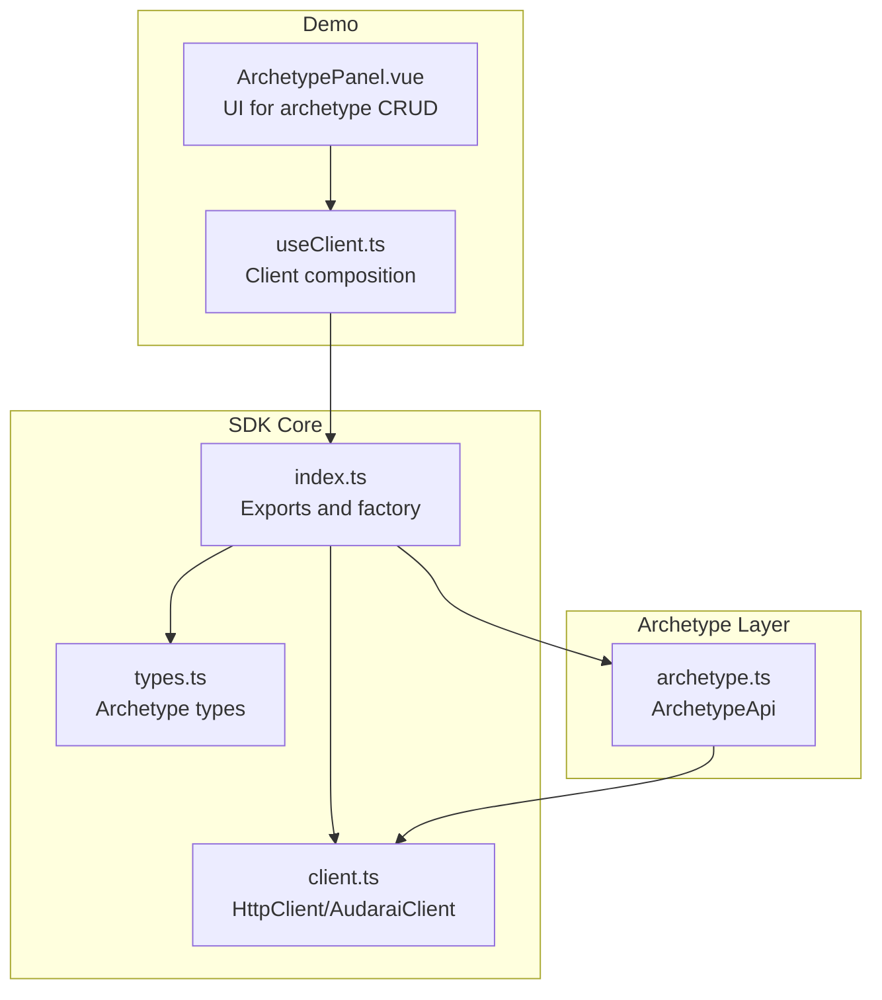
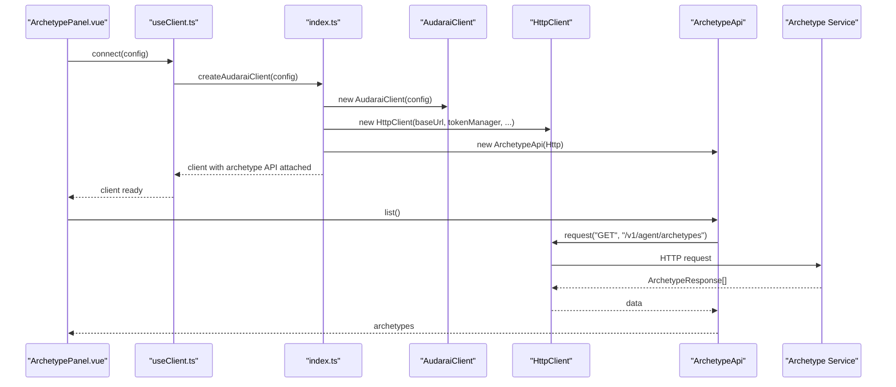
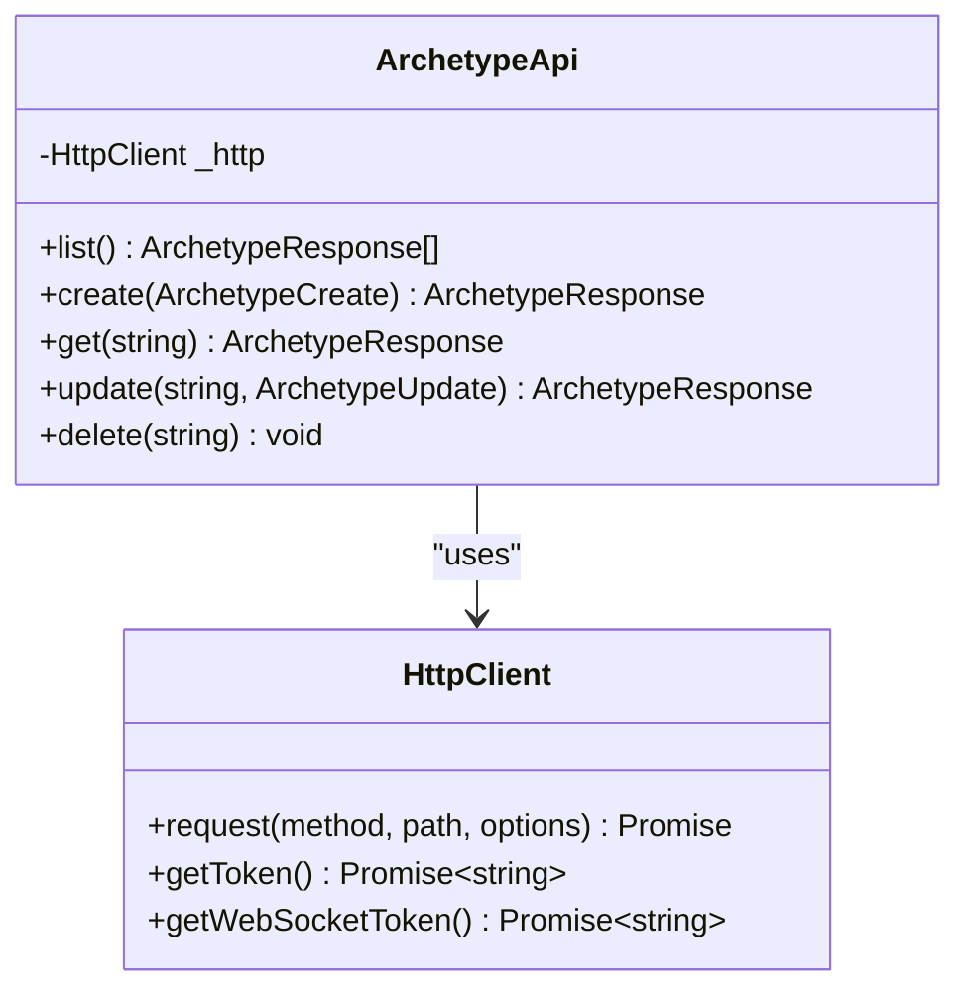
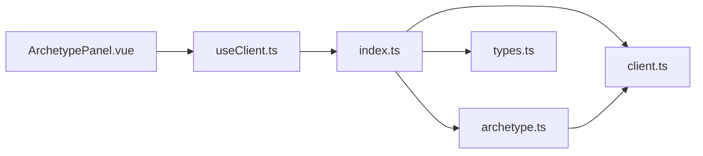

# Archetype System

<cite>
**Referenced Files in This Document**
- [archetype.ts](file://src/archetype.ts)
- [index.ts](file://src/index.ts)
- [types.ts](file://src/types.ts)
- [client.ts](file://src/client.ts)
- [ArchetypePanel.vue](file://demo/src/components/ArchetypePanel.vue)
- [useClient.ts](file://demo/src/composables/useClient.ts)
- [README.md](file://README.md)
- [package.json](file://package.json)
</cite>

## Table of Contents
1. [Introduction](#introduction)
2. [Project Structure](#project-structure)
3. [Core Components](#core-components)
4. [Architecture Overview](#architecture-overview)
5. [Detailed Component Analysis](#detailed-component-analysis)
6. [Dependency Analysis](#dependency-analysis)
7. [Performance Considerations](#performance-considerations)
8. [Troubleshooting Guide](#troubleshooting-guide)
9. [Conclusion](#conclusion)
10. [Appendices](#appendices)

## Introduction
The Archetype System provides reusable base configurations for consistent agent behavior. An archetype encapsulates a base system prompt and default sets of skills/channels that can be inherited by multiple agents. This enables teams to define standardized agent personalities, capabilities, and operational defaults across deployments.

The system exposes CRUD operations for archetypes and integrates with the broader SDK ecosystem, allowing agents to reference an archetype by ID to inherit its base configuration.

## Project Structure
The Archetype System is implemented as part of the AudarAI JavaScript/TypeScript SDK. The relevant components are organized as follows:
- Archetype API client: defines HTTP endpoints for listing, creating, retrieving, updating, and deleting archetypes
- Type definitions: describe the structure of archetype create/update payloads and responses
- Client factory: wires the ArchetypeApi into the main AudaraiClient
- Demo panel: demonstrates UI usage for managing archetypes

**Diagram sources**
- [index.ts:12-192](file://src/index.ts#L12-L192)
- [client.ts:93-213](file://src/client.ts#L93-L213)
- [types.ts:1111-1139](file://src/types.ts#L1111-L1139)
- [archetype.ts:4-31](file://src/archetype.ts#L4-L31)
- [ArchetypePanel.vue:1-243](file://demo/src/components/ArchetypePanel.vue#L1-L243)
- [useClient.ts:1-36](file://demo/src/composables/useClient.ts#L1-L36)

**Section sources**
- [index.ts:12-192](file://src/index.ts#L12-L192)
- [archetype.ts:4-31](file://src/archetype.ts#L4-L31)
- [types.ts:1111-1139](file://src/types.ts#L1111-L1139)
- [client.ts:93-213](file://src/client.ts#L93-L213)
- [ArchetypePanel.vue:1-243](file://demo/src/components/ArchetypePanel.vue#L1-L243)
- [useClient.ts:1-36](file://demo/src/composables/useClient.ts#L1-L36)

## Core Components
- ArchetypeApi: Provides methods to list, create, retrieve, update, and delete archetypes via HTTP endpoints.
- Archetype types: Define the shape of create/update payloads and responses, including base_prompt and default collections.
- Client integration: The ArchetypeApi is attached to the AudaraiClient instance via the factory exported by index.ts.

Key responsibilities:
- Encapsulate HTTP communication for archetype operations
- Expose strongly-typed interfaces for archetype management
- Integrate with the SDK’s authentication and token management

**Section sources**
- [archetype.ts:4-31](file://src/archetype.ts#L4-L31)
- [types.ts:1111-1139](file://src/types.ts#L1111-L1139)
- [index.ts:128-192](file://src/index.ts#L128-L192)

## Architecture Overview
The Archetype System follows a layered architecture:
- Presentation/UI layer: Demo panel for archetype CRUD
- Composition layer: Client composable that initializes the SDK and attaches APIs
- API layer: ArchetypeApi exposing CRUD operations
- Transport layer: HttpClient performing authenticated HTTP requests
- Types layer: Strongly-typed interfaces for payloads and responses

**Diagram sources**
- [ArchetypePanel.vue:14-22](file://demo/src/components/ArchetypePanel.vue#L14-L22)
- [useClient.ts:21-35](file://demo/src/composables/useClient.ts#L21-L35)
- [index.ts:128-192](file://src/index.ts#L128-L192)
- [client.ts:133-213](file://src/client.ts#L133-L213)
- [archetype.ts:7-9](file://src/archetype.ts#L7-L9)

## Detailed Component Analysis

### ArchetypeApi
The ArchetypeApi class encapsulates all archetype-related HTTP operations:
- list(): Fetches all archetypes
- create(): Creates a new archetype with name, description, base_prompt, and default collections
- get(): Retrieves a specific archetype by ID
- update(): Updates an existing archetype
- delete(): Removes an archetype

Implementation highlights:
- Uses HttpClient.request for all operations
- Applies JSON serialization for create/update bodies
- Encodes archetypeId in URLs for get/update/delete

**Diagram sources**
- [archetype.ts:4-31](file://src/archetype.ts#L4-L31)
- [client.ts:93-213](file://src/client.ts#L93-L213)

**Section sources**
- [archetype.ts:4-31](file://src/archetype.ts#L4-L31)

### Archetype Types
The Archetype types define the structure for:
- ArchetypeCreate: name, description, base_prompt, default_skills, default_channels
- ArchetypeUpdate: optional fields for the same attributes
- ArchetypeResponse: includes identifiers, metadata, and timestamps

These types are exported by index.ts and used by ArchetypeApi and UI components.

**Section sources**
- [types.ts:1111-1139](file://src/types.ts#L1111-L1139)
- [index.ts:112-114](file://src/index.ts#L112-L114)

### Client Integration
The ArchetypeApi is attached to the AudaraiClient instance through the factory function exported by index.ts. This ensures that clients created via createAudaraiClient have access to archetype management alongside other services.

Integration points:
- Factory attaches ArchetypeApi to the client instance
- HttpClient manages authentication and token refresh for all requests

**Section sources**
- [index.ts:128-192](file://src/index.ts#L128-L192)
- [client.ts:215-411](file://src/client.ts#L215-L411)

### Demo Panel Usage
The demo ArchetypePanel.vue demonstrates:
- Listing archetypes and displaying them in a table
- Editing an archetype’s name, description, and base_prompt
- Creating a new archetype with user-provided values
- Deleting an archetype

The panel relies on the client composable to obtain a connected AudaraiClient instance with the archetype API attached.

**Section sources**
- [ArchetypePanel.vue:14-22](file://demo/src/components/ArchetypePanel.vue#L14-L22)
- [ArchetypePanel.vue:48-64](file://demo/src/components/ArchetypePanel.vue#L48-L64)
- [ArchetypePanel.vue:69-85](file://demo/src/components/ArchetypePanel.vue#L69-L85)
- [useClient.ts:21-35](file://demo/src/composables/useClient.ts#L21-L35)

## Dependency Analysis
The Archetype System has minimal coupling and clear boundaries:
- ArchetypeApi depends on HttpClient for transport
- HttpClient depends on TokenManager for authentication
- index.ts composes the client and attaches APIs
- Demo components depend on the client and types

**Diagram sources**
- [index.ts:12-192](file://src/index.ts#L12-L192)
- [archetype.ts:4-31](file://src/archetype.ts#L4-L31)
- [client.ts:93-213](file://src/client.ts#L93-L213)
- [types.ts:1111-1139](file://src/types.ts#L1111-L1139)
- [ArchetypePanel.vue:1-243](file://demo/src/components/ArchetypePanel.vue#L1-L243)
- [useClient.ts:1-36](file://demo/src/composables/useClient.ts#L1-L36)

**Section sources**
- [index.ts:12-192](file://src/index.ts#L12-L192)
- [archetype.ts:4-31](file://src/archetype.ts#L4-L31)
- [client.ts:93-213](file://src/client.ts#L93-L213)
- [types.ts:1111-1139](file://src/types.ts#L1111-L1139)
- [ArchetypePanel.vue:1-243](file://demo/src/components/ArchetypePanel.vue#L1-L243)
- [useClient.ts:1-36](file://demo/src/composables/useClient.ts#L1-L36)

## Performance Considerations
- Network efficiency: ArchetypeApi performs straightforward CRUD operations with JSON payloads. Batch operations are not exposed; use multiple requests for bulk updates.
- Token management: HttpClient handles automatic token refresh and retries on 401 responses, reducing overhead for authentication failures.
- UI responsiveness: The demo panel uses reactive refs for lists and forms; keep archetype lists paginated or filtered in production apps to minimize DOM rendering costs.
- Memory management: Avoid retaining large archetype lists in memory; clear or filter arrays after deletion operations.

[No sources needed since this section provides general guidance]

## Troubleshooting Guide
Common issues and resolutions:
- Authentication errors: Ensure the client is initialized with a valid authentication mode and that tokens are refreshed appropriately.
- 401 responses: HttpClient automatically retries once after refreshing tokens; verify onTokenRefresh or token provider configuration.
- Network failures: Check baseUrl and network connectivity; confirm that the server endpoint for archetypes is reachable.
- UI state inconsistencies: After edits/deletes, update reactive state in the demo panel to reflect server changes.

**Section sources**
- [client.ts:133-213](file://src/client.ts#L133-L213)
- [ArchetypePanel.vue:14-33](file://demo/src/components/ArchetypePanel.vue#L14-L33)

## Conclusion
The Archetype System offers a clean, extensible foundation for defining reusable agent configurations. By centralizing base prompts and default capabilities in archetypes, teams can achieve consistent agent behavior across diverse deployments. The SDK’s strong typing, client factory integration, and demo UI provide a practical starting point for adoption and extension.

[No sources needed since this section summarizes without analyzing specific files]

## Appendices

### Practical Examples

- Creating an archetype
  - Use the demo panel’s “Create Archetype” form to submit name, description, and base_prompt.
  - The panel invokes ArchetypeApi.create with the provided values.

- Editing an archetype
  - Select an archetype in the list and click “Edit.”
  - Modify name, description, or base_prompt and save to call ArchetypeApi.update.

- Deleting an archetype
  - Click “Delete” on a row to remove it; the panel calls ArchetypeApi.delete and updates the list.

- Integrating with agents
  - When creating or updating agents, set archetype_id to reference the desired archetype.
  - The agent inherits the archetype’s base_prompt and default collections.

**Section sources**
- [ArchetypePanel.vue:69-85](file://demo/src/components/ArchetypePanel.vue#L69-L85)
- [ArchetypePanel.vue:48-64](file://demo/src/components/ArchetypePanel.vue#L48-L64)
- [ArchetypePanel.vue:24-33](file://demo/src/components/ArchetypePanel.vue#L24-L33)
- [types.ts:505-570](file://src/types.ts#L505-L570)

### Advanced Patterns

- Parameter overrides
  - While archetypes define base_prompt and default collections, agents can override these per-session or per-participant via participant context and agent configuration fields.

- Dynamic archetype loading
  - Load archetypes at startup and cache them in the UI; refresh lists periodically to reflect server-side changes.

- Conditional parameter application
  - Use participant context to conditionally apply archetype-derived instructions per session or participant.

- Versioning and deployment
  - Treat archetypes as immutable templates; create new versions by duplicating and updating existing archetypes rather than modifying in place.
  - Deploy archetypes via the SDK’s create/update endpoints and reference them by ID in agent definitions.

[No sources needed since this section provides general guidance]