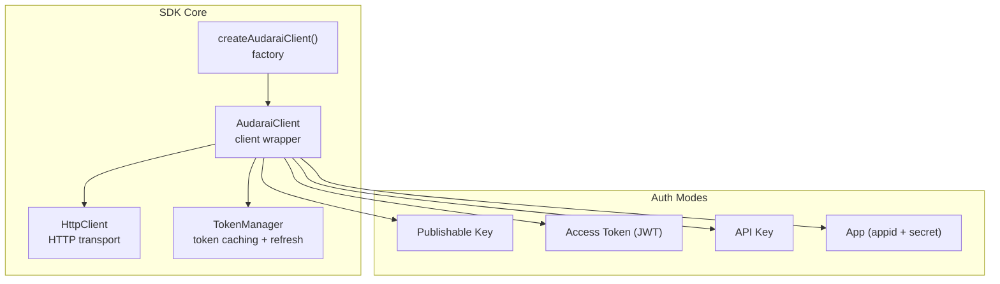
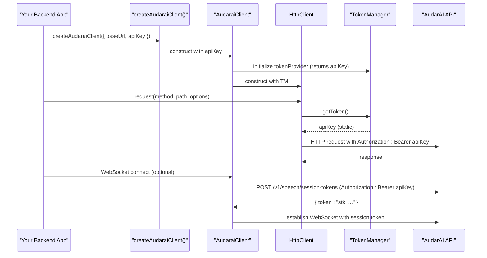
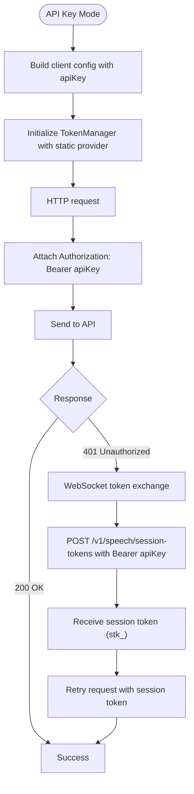
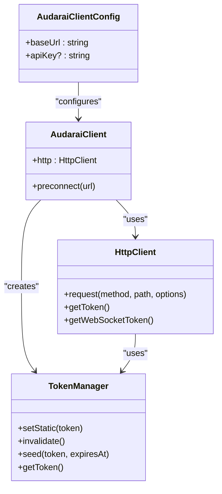

# API Key Mode

<cite>
**Referenced Files in This Document**
- [client.ts](file://src/client.ts)
- [types.ts](file://src/types.ts)
- [errors.ts](file://src/errors.ts)
- [README.md](file://README.md)
- [useClient.ts](file://demo/src/composables/useClient.ts)
- [ConnectPanel.vue](file://demo/src/components/ConnectPanel.vue)
</cite>

## Table of Contents
1. [Introduction](#introduction)
2. [Project Structure](#project-structure)
3. [Core Components](#core-components)
4. [Architecture Overview](#architecture-overview)
5. [Detailed Component Analysis](#detailed-component-analysis)
6. [Dependency Analysis](#dependency-analysis)
7. [Performance Considerations](#performance-considerations)
8. [Security Best Practices](#security-best-practices)
9. [Troubleshooting Guide](#troubleshooting-guide)
10. [Conclusion](#conclusion)

## Introduction
This document explains API Key Mode authentication for server-side applications and backend services. It covers the security model, token format, configuration, and practical usage with createAudaraiClient. It also provides guidance on secure key storage, rotation, and integration with Node.js environments and backend services.

## Project Structure
The SDK exposes a single factory function to create a typed client supporting multiple authentication modes. API Key Mode is one of four mutually exclusive options.

**Diagram sources**
- [client.ts:215-411](file://src/client.ts#L215-L411)
- [types.ts:7-63](file://src/types.ts#L7-L63)

**Section sources**
- [client.ts:215-411](file://src/client.ts#L215-L411)
- [types.ts:7-63](file://src/types.ts#L7-L63)

## Core Components
- createAudaraiClient: Factory that constructs an AudaraiClient with one chosen authentication mode.
- AudaraiClient: Orchestrates HTTP and WebSocket traffic, manages token providers, and performs automatic session token exchange for WebSocket connections.
- HttpClient: Handles HTTP requests, attaches Authorization headers, and retries on 401 with token refresh.
- TokenManager: Caches tokens, proactively refreshes before expiration, and invalidates on 401.

Key behaviors for API Key Mode:
- Exactly one authentication mode must be configured; API Key Mode sets apiKey in the client config.
- HTTP requests use the API key directly as the Authorization header (Bearer scheme).
- WebSocket connections automatically exchange the API key for a short-lived session token (stk_ prefix) before connecting.

**Section sources**
- [client.ts:215-411](file://src/client.ts#L215-L411)
- [types.ts:7-63](file://src/types.ts#L7-L63)

## Architecture Overview
The following sequence illustrates how API Key Mode works end-to-end for HTTP and WebSocket requests.

**Diagram sources**
- [client.ts:292-310](file://src/client.ts#L292-L310)
- [client.ts:133-173](file://src/client.ts#L133-L173)
- [client.ts:215-370](file://src/client.ts#L215-L370)

## Detailed Component Analysis

### API Key Mode Configuration
- Config field: apiKey (string).
- Behavior:
  - HTTP requests: Authorization: Bearer apiKey.
  - WebSocket requests: The SDK exchanges apiKey for a short-lived session token (stk_ prefix) via a dedicated endpoint before connecting.
- Example usage in demos and tests:
  - The demo UI demonstrates selecting “API Key” mode and passing apiKey to createAudaraiClient.

Practical notes:
- Use apiKey in Node.js services or backend workers.
- Never expose apiKey in browser code.

**Section sources**
- [types.ts:29-33](file://src/types.ts#L29-L33)
- [client.ts:292-310](file://src/client.ts#L292-L310)
- [README.md:165-174](file://README.md#L165-L174)
- [ConnectPanel.vue:198](file://demo/src/components/ConnectPanel.vue#L198)

### Token Provider and Exchange Flow
- TokenProvider for API Key Mode returns a static token with a long expires_in (one day).
- WebSocket token provider exchanges the API key for a session token (stk_ prefix) using the session-tokens endpoint.

**Diagram sources**
- [client.ts:292-310](file://src/client.ts#L292-L310)
- [client.ts:133-173](file://src/client.ts#L133-L173)

**Section sources**
- [client.ts:292-310](file://src/client.ts#L292-L310)
- [client.ts:133-173](file://src/client.ts#L133-L173)

### Using createAudaraiClient with API Keys
- Typical usage pattern:
  - Call createAudaraiClient with baseUrl and apiKey.
  - Use the returned client to call TTS, STT, Translation, Agent, Knowledge, Tool, Skill, Archetype, and Room APIs.
- Demo integration:
  - The demo’s ConnectPanel switches to API Key mode and passes apiKey to createAudaraiClient.
  - The useClient composable stores the singleton client and probes connectivity by listing speakers.

**Section sources**
- [client.ts:215-411](file://src/client.ts#L215-L411)
- [useClient.ts:21-35](file://demo/src/composables/useClient.ts#L21-L35)
- [ConnectPanel.vue:198](file://demo/src/components/ConnectPanel.vue#L198)

### Node.js Environment Integration
- Node.js 18+ includes native fetch; no additional configuration is required.
- For older Node.js versions, pass a custom fetch implementation to createAudaraiClient.

**Section sources**
- [README.md:781-795](file://README.md#L781-L795)

### WebSocket and Session Tokens
- WebSocket endpoints require a short-lived session token (stk_ prefix).
- The SDK automatically exchanges apiKey for a session token before establishing the WebSocket connection.

**Section sources**
- [client.ts:298-310](file://src/client.ts#L298-L310)

## Dependency Analysis
The following diagram shows how the SDK components depend on each other for API Key Mode.

**Diagram sources**
- [client.ts:215-411](file://src/client.ts#L215-L411)
- [types.ts:7-63](file://src/types.ts#L7-L63)

**Section sources**
- [client.ts:215-411](file://src/client.ts#L215-L411)
- [types.ts:7-63](file://src/types.ts#L7-L63)

## Performance Considerations
- Proactive refresh: TokenManager proactively refreshes tokens before expiration (default threshold is 30 seconds). Adjust refreshThresholdSeconds to balance latency and safety.
- Concurrency: TokenManager uses a mutex to prevent concurrent refreshes.
- Preconnect: When livekitUrl is provided, the client preconnects to reduce voice session latency.

**Section sources**
- [client.ts:22-91](file://src/client.ts#L22-L91)
- [client.ts:380-410](file://src/client.ts#L380-L410)

## Security Best Practices
- Never expose apiKey in browser code. Use publishableKey or App (appid) for frontend.
- Store apiKey securely in backend environments:
  - Use environment variables or secrets managers (e.g., Vault, AWS Secrets Manager, Azure Key Vault).
  - Restrict access to least-privilege accounts and roles.
- Rotate apiKey regularly:
  - Generate a new key and update deployments gradually.
  - Revoke the old key after migration.
- Protect against key theft:
  - Limit allowed origins for publishableKey; do not rely solely on API keys for frontend.
  - Monitor logs and audit trails for suspicious usage.
  - Enforce rate limits and quotas at the API level.
- Token lifecycle:
  - API Key Mode uses a static token provider; the SDK does not rotate apiKey itself—rotate at the source.
  - For WebSocket connections, the SDK obtains a short-lived session token (stk_) per connection.

**Section sources**
- [README.md:165-174](file://README.md#L165-L174)
- [client.ts:292-310](file://src/client.ts#L292-L310)

## Troubleshooting Guide
Common issues and resolutions:
- Authentication failures:
  - Ensure apiKey is correct and not exposed in browser code.
  - Verify the API responds with 200 for HTTP requests; otherwise, check network and credentials.
- 401 Unauthorized:
  - The SDK retries once automatically by refreshing the token provider. If using static apiKey, the SDK will continue to use the same key.
  - For dynamic token providers, implement onTokenRefresh to supply a fresh token.
- WebSocket connection errors:
  - Confirm the API accepts the API key and returns a valid session token (stk_).
  - Check network connectivity and firewall rules for WebSocket endpoints.

Relevant error types:
- AuthenticationError: Thrown when authentication fails or tokens are invalid/expired.
- ApiError: Wraps HTTP errors with status code and service code.
- InsufficientBalanceError: Indicates account balance issues.
- RateLimitedError: Indicates rate limiting with optional retry-after.

**Section sources**
- [errors.ts:1-43](file://src/errors.ts#L1-L43)
- [client.ts:133-173](file://src/client.ts#L133-L173)

## Conclusion
API Key Mode is designed for server-side and backend environments where full permissions are required. It simplifies authentication by passing the key directly as a Bearer token for HTTP requests and exchanging it for short-lived session tokens for WebSocket connections. Secure key management, rotation, and environment-specific deployment practices are essential to protect your system and comply with operational security standards.