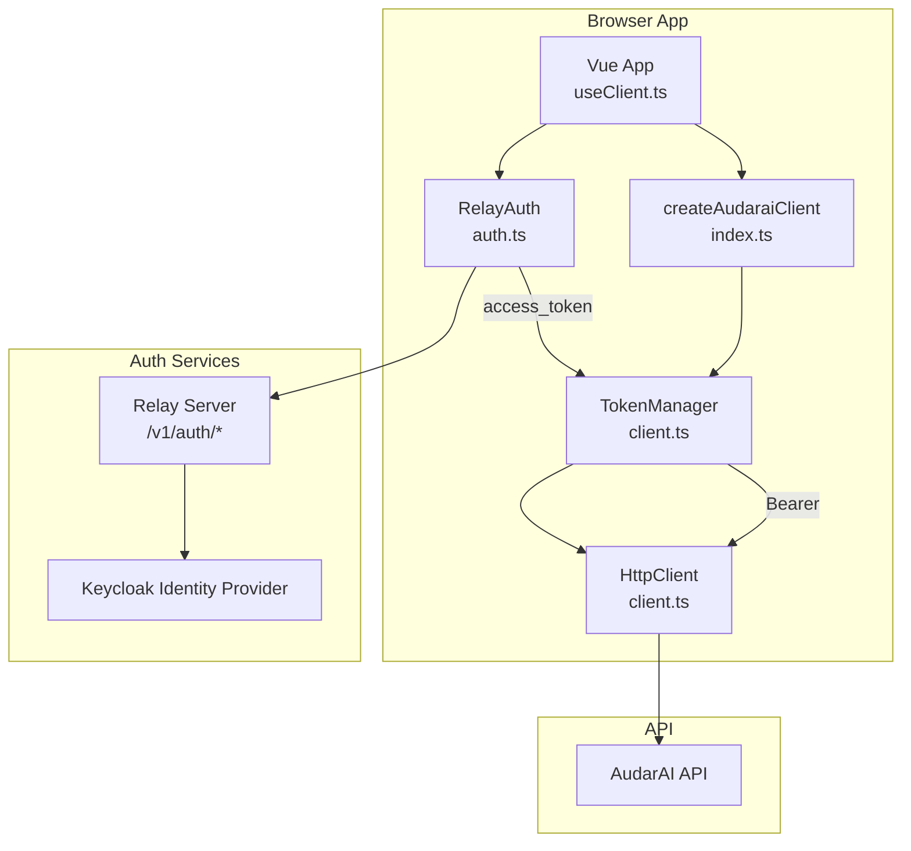
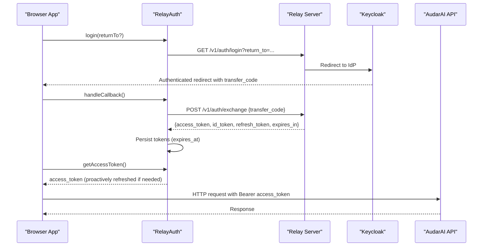
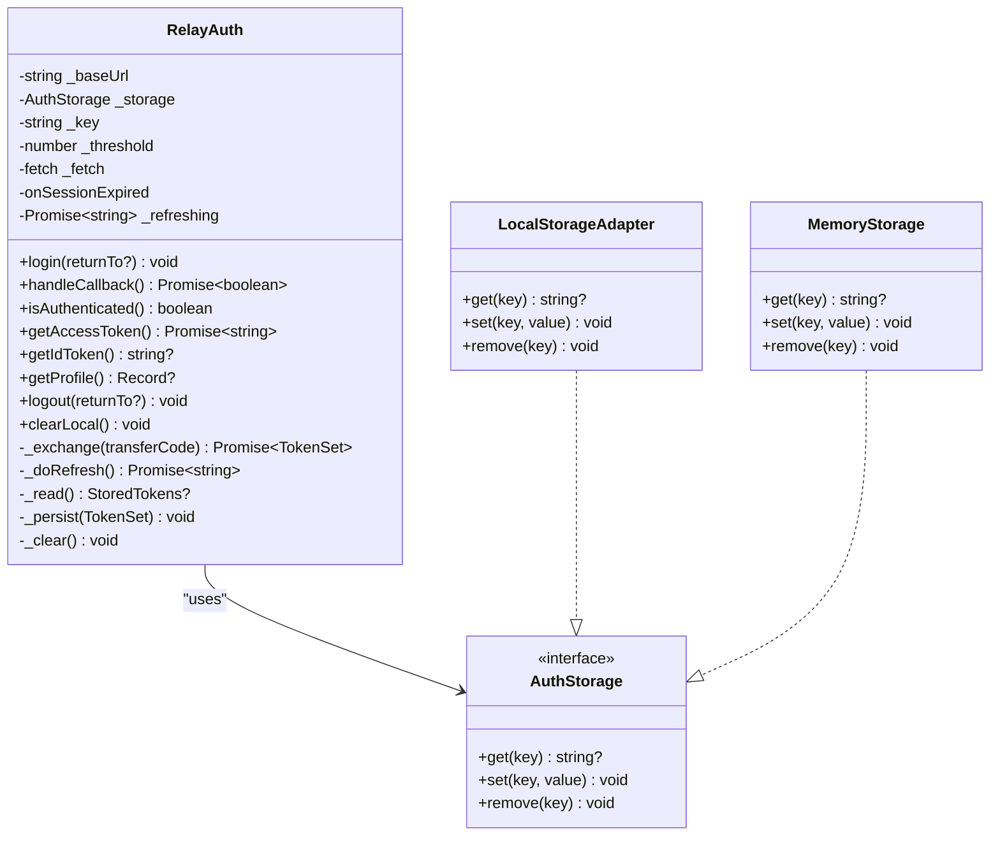
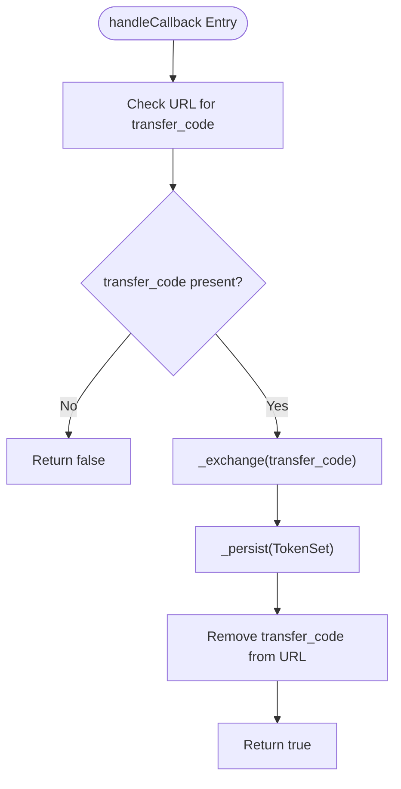
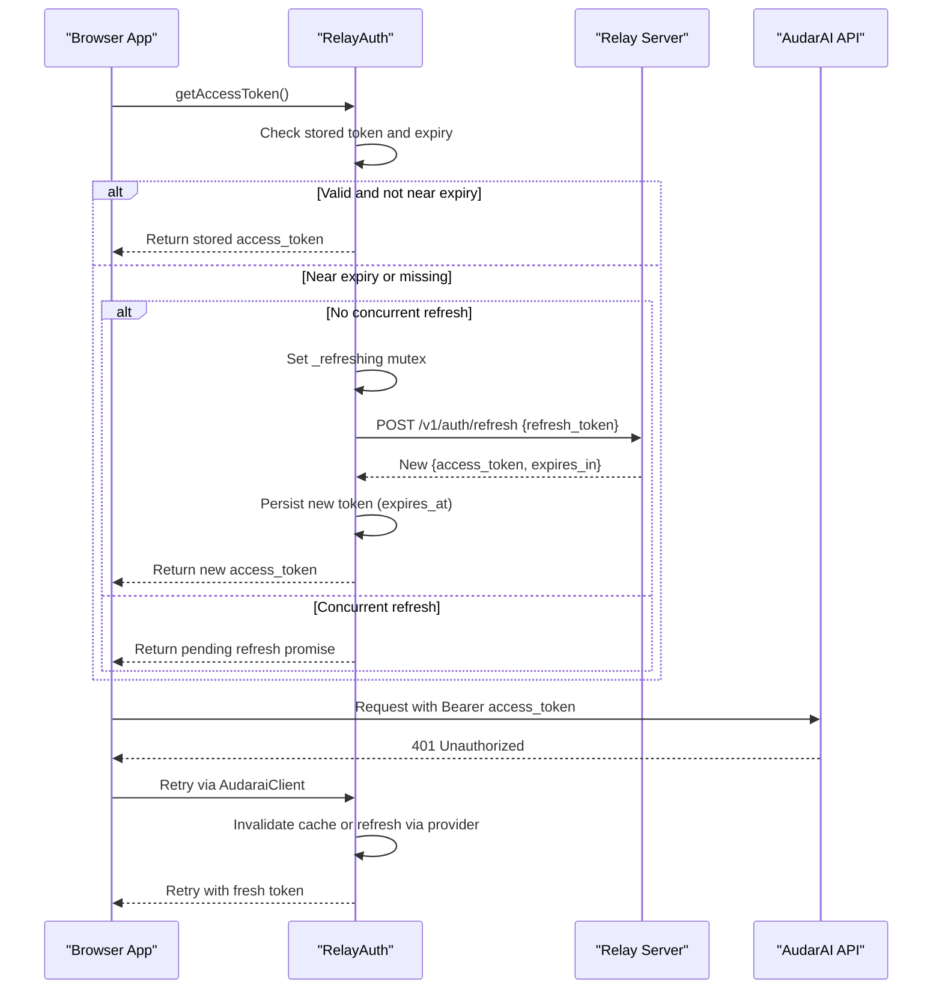
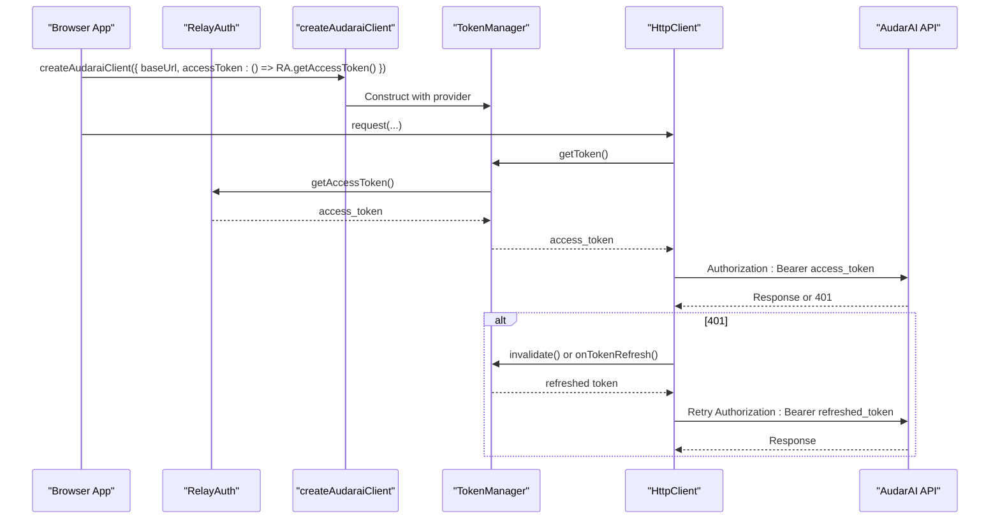
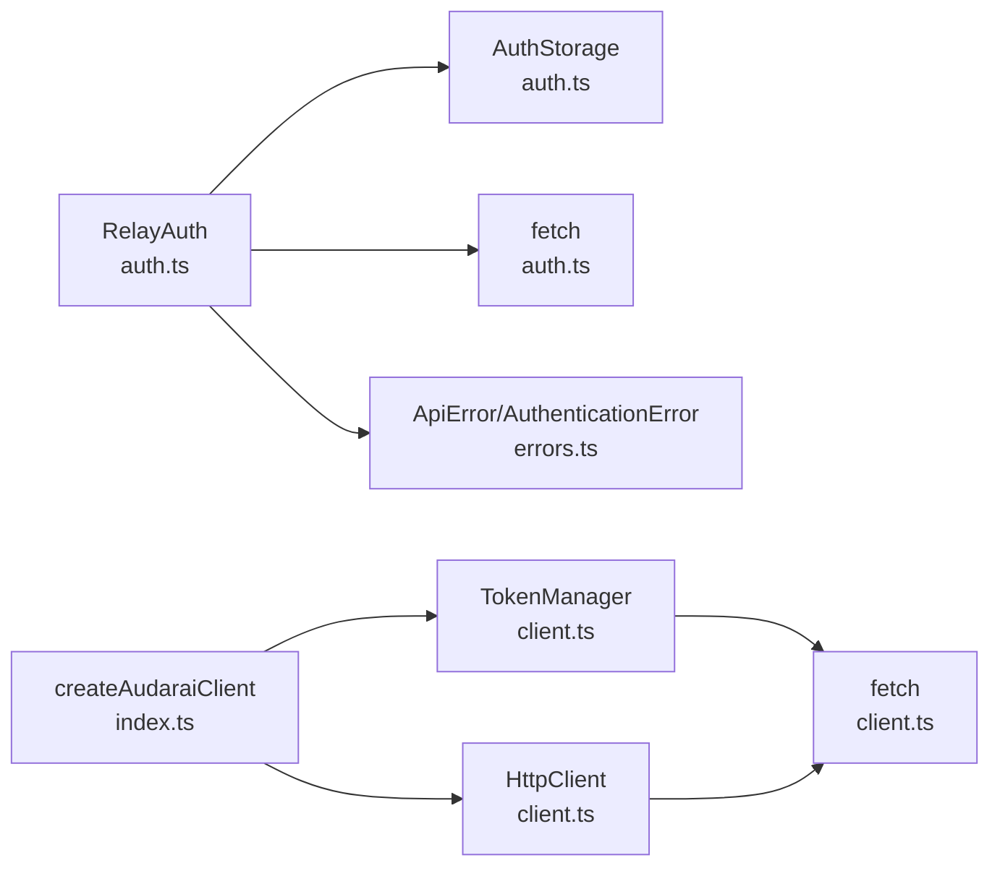

# Access Token Mode (SSO/OAuth2)

<cite>
**Referenced Files in This Document**
- [auth.ts](file://src/auth.ts)
- [client.ts](file://src/client.ts)
- [index.ts](file://src/index.ts)
- [types.ts](file://src/types.ts)
- [errors.ts](file://src/errors.ts)
- [README.md](file://README.md)
- [useClient.ts](file://demo/src/composables/useClient.ts)
</cite>

## Table of Contents
1. [Introduction](#introduction)
2. [Project Structure](#project-structure)
3. [Core Components](#core-components)
4. [Architecture Overview](#architecture-overview)
5. [Detailed Component Analysis](#detailed-component-analysis)
6. [Dependency Analysis](#dependency-analysis)
7. [Performance Considerations](#performance-considerations)
8. [Troubleshooting Guide](#troubleshooting-guide)
9. [Conclusion](#conclusion)
10. [Appendices](#appendices)

## Introduction
This document explains Access Token Mode authentication using OAuth2/SAML SSO integration with the AudarAI SDK. It focuses on the RelayAuth class for browser-based OAuth2 flows, the token exchange process, and seamless integration with createAudaraiClient for automatic token refresh. It covers login redirection, callback handling, token storage, and automatic refresh mechanisms. Practical examples demonstrate setting up OAuth2 with Keycloak, handling authentication callbacks, managing token expiration, and implementing custom session expiration handlers. Security considerations, token storage options (localStorage vs memory adapter), and integration patterns for both browser and Node.js environments are addressed. Common issues such as token refresh failures, session expiration handling, and debugging authentication problems are covered.

## Project Structure
The SDK exposes a cohesive authentication and client creation surface:
- Authentication: RelayAuth manages OAuth2 login, callback handling, token persistence, and refresh.
- Client Creation: createAudaraiClient integrates with RelayAuth via accessToken provider.
- Token Management: TokenManager and HttpClient coordinate token retrieval, caching, and automatic refresh.
- Types and Errors: Strong typing for configuration, token data, and error handling.

**Diagram sources**
- [auth.ts:102-271](file://src/auth.ts#L102-L271)
- [client.ts:22-91](file://src/client.ts#L22-L91)
- [client.ts:93-213](file://src/client.ts#L93-L213)
- [index.ts:160-192](file://src/index.ts#L160-L192)

**Section sources**
- [auth.ts:102-271](file://src/auth.ts#L102-L271)
- [client.ts:22-91](file://src/client.ts#L22-L91)
- [client.ts:93-213](file://src/client.ts#L93-L213)
- [index.ts:160-192](file://src/index.ts#L160-L192)

## Core Components
- RelayAuth: Implements OAuth2 login, callback handling, token exchange, storage, and refresh. Provides access/id tokens and profile decoding.
- TokenManager: Manages token caching, proactive refresh, and concurrency control.
- HttpClient: Attaches tokens to requests, handles 401 retries, and supports WebSocket token exchange.
- createAudaraiClient: Factory that constructs an AudaraiClient configured for Access Token Mode, integrating with RelayAuth.

Key responsibilities:
- Login redirection to relay and Keycloak.
- Callback consumption of transfer_code and exchange for tokens.
- Proactive refresh before expiry and mutual exclusion of concurrent refresh attempts.
- Seamless integration with AudaraiClient via accessToken provider.

**Section sources**
- [auth.ts:102-271](file://src/auth.ts#L102-L271)
- [client.ts:22-91](file://src/client.ts#L22-L91)
- [client.ts:93-213](file://src/client.ts#L93-L213)
- [index.ts:160-192](file://src/index.ts#L160-L192)

## Architecture Overview
The Access Token Mode flow connects the browser app to the relay service, which authenticates with Keycloak and exchanges a transfer_code for OAuth2 tokens. The app stores tokens and supplies them to the AudaraiClient, which attaches them to requests and refreshes them proactively.

**Diagram sources**
- [auth.ts:123-155](file://src/auth.ts#L123-L155)
- [auth.ts:223-230](file://src/auth.ts#L223-L230)
- [auth.ts:169-183](file://src/auth.ts#L169-L183)
- [client.ts:264-276](file://src/client.ts#L264-L276)

## Detailed Component Analysis

### RelayAuth Class
RelayAuth encapsulates OAuth2 login, callback handling, token exchange, storage, and refresh. It supports configurable storage adapters, refresh thresholds, and custom fetch implementations. It exposes methods to log in, handle callbacks, check authentication, retrieve access/id tokens, decode profiles, and log out.

Key behaviors:
- login(returnTo?): Redirects to relay’s login endpoint with a return_to target.
- handleCallback(): Detects transfer_code in URL, exchanges it for tokens, persists them, and cleans the URL.
- isAuthenticated(): Checks token validity or presence of refresh_token.
- getAccessToken(): Returns a valid token, triggering refresh if needed; refresh is guarded by a mutex to prevent concurrent refreshes.
- getIdToken()/getProfile(): Reads id_token and decodes payload for UI display.
- logout(returnTo?, idHint?): Clears local storage and redirects to relay logout with optional id_token_hint.
- clearLocal(): Clears local storage without redirecting.

Storage adapters:
- LocalStorageAdapter: Uses browser localStorage.
- MemoryStorage: In-memory adapter for SSR or Node.js environments.

Refresh mechanism:
- _doRefresh(): Calls relay’s refresh endpoint with refresh_token; on success, persists new tokens and returns access_token; on failure, clears storage and invokes onSessionExpired.

**Section sources**
- [auth.ts:102-271](file://src/auth.ts#L102-L271)

#### Class Diagram

**Diagram sources**
- [auth.ts:102-271](file://src/auth.ts#L102-L271)
- [auth.ts:39-43](file://src/auth.ts#L39-L43)
- [auth.ts:71-88](file://src/auth.ts#L71-L88)

### Token Exchange Flow
The exchange flow converts a temporary transfer_code into OAuth2 tokens. The flow ensures the transfer_code is removed from the URL to prevent replay on refresh.

**Diagram sources**
- [auth.ts:139-155](file://src/auth.ts#L139-L155)
- [auth.ts:223-230](file://src/auth.ts#L223-L230)
- [auth.ts:260-266](file://src/auth.ts#L260-L266)

**Section sources**
- [auth.ts:139-155](file://src/auth.ts#L139-L155)
- [auth.ts:223-230](file://src/auth.ts#L223-L230)
- [auth.ts:260-266](file://src/auth.ts#L260-L266)

### Automatic Token Refresh Mechanism
The SDK proactively refreshes tokens before expiry and guards against concurrent refresh calls. If a 401 occurs, the SDK retries once after invalidating the cache or invoking a custom refresh callback.

**Diagram sources**
- [auth.ts:169-183](file://src/auth.ts#L169-L183)
- [auth.ts:232-252](file://src/auth.ts#L232-L252)
- [client.ts:133-173](file://src/client.ts#L133-L173)

**Section sources**
- [auth.ts:169-183](file://src/auth.ts#L169-L183)
- [auth.ts:232-252](file://src/auth.ts#L232-L252)
- [client.ts:133-173](file://src/client.ts#L133-L173)

### Integration with createAudaraiClient
createAudaraiClient supports Access Token Mode by accepting an accessToken provider. The provider can be a static string or an async function returning a fresh token. The client’s TokenManager caches and refreshes tokens, while HttpClient attaches Bearer tokens to requests and handles 401 retries.

**Diagram sources**
- [index.ts:160-192](file://src/index.ts#L160-L192)
- [client.ts:264-291](file://src/client.ts#L264-L291)
- [client.ts:133-173](file://src/client.ts#L133-L173)
- [auth.ts:169-183](file://src/auth.ts#L169-L183)

**Section sources**
- [index.ts:160-192](file://src/index.ts#L160-L192)
- [client.ts:264-291](file://src/client.ts#L264-L291)
- [client.ts:133-173](file://src/client.ts#L133-L173)
- [auth.ts:169-183](file://src/auth.ts#L169-L183)

### Practical Setup Examples

- OAuth2 with Keycloak:
  - Configure relayBaseUrl to point to your relay service.
  - Implement an accessToken provider that returns the current Keycloak JWT (static string or async function).
  - Initialize createAudaraiClient with accessToken pointing to your provider.
  - Call handleCallback() on app startup to consume the transfer_code and persist tokens.

- Handling Authentication Callbacks:
  - On app initialization, call handleCallback().
  - If true is returned, tokens are persisted; if false, continue normal flow.

- Managing Token Expiration:
  - Adjust refreshThresholdSeconds to control proactive refresh timing.
  - Implement onSessionExpired to customize behavior when refresh_token is unavailable.

- Custom Session Expiration Handler:
  - Provide onSessionExpired in RelayAuthConfig to intercept session expiration and redirect to login or show a custom UX.

- Token Storage Options:
  - Browser: localStorage adapter persists tokens across sessions.
  - SSR/Node.js: Use memory adapter to avoid DOM dependencies.

- Environment Integration:
  - Browser: Use default fetch and localStorage.
  - Node.js: Provide a fetch implementation and memory adapter.

**Section sources**
- [auth.ts:45-62](file://src/auth.ts#L45-L62)
- [auth.ts:111-119](file://src/auth.ts#L111-L119)
- [auth.ts:139-155](file://src/auth.ts#L139-L155)
- [auth.ts:223-230](file://src/auth.ts#L223-L230)
- [auth.ts:260-266](file://src/auth.ts#L260-L266)
- [client.ts:29-32](file://src/client.ts#L29-L32)
- [client.ts:264-276](file://src/client.ts#L264-L276)
- [index.ts:160-192](file://src/index.ts#L160-L192)

## Dependency Analysis
RelayAuth depends on:
- AuthStorage for persistence.
- Global fetch for network requests.
- ApiError/AuthenticationError for error handling.

createAudaraiClient composes:
- TokenManager for token caching and refresh.
- HttpClient for request execution and 401 handling.
- Access token provider (from RelayAuth or elsewhere).

**Diagram sources**
- [auth.ts:24-24](file://src/auth.ts#L24-L24)
- [auth.ts:104-108](file://src/auth.ts#L104-L108)
- [auth.ts:24-24](file://src/auth.ts#L24-L24)
- [index.ts:160-192](file://src/index.ts#L160-L192)
- [client.ts:97-99](file://src/client.ts#L97-L99)

**Section sources**
- [auth.ts:24-24](file://src/auth.ts#L24-L24)
- [auth.ts:104-108](file://src/auth.ts#L104-L108)
- [index.ts:160-192](file://src/index.ts#L160-L192)
- [client.ts:97-99](file://src/client.ts#L97-L99)

## Performance Considerations
- Proactive refresh: Adjust refreshThresholdSeconds to balance freshness and network overhead.
- Concurrency control: Mutual exclusion prevents redundant refresh calls.
- Preconnect optimization: AudaraiClient can pre-warm DNS/TLS for LiveKit URLs to reduce latency.
- Fetch compatibility: Provide a fetch implementation in Node.js to avoid polyfills.

[No sources needed since this section provides general guidance]

## Troubleshooting Guide
Common issues and resolutions:
- Token refresh failures:
  - Symptom: AuthenticationError on refresh.
  - Resolution: Ensure refresh_token exists; implement onSessionExpired to guide users to re-authenticate; verify relay refresh endpoint availability.

- Session expiration handling:
  - Symptom: 401 responses after token expiry.
  - Resolution: Use TokenManager’s invalidate() or onTokenRefresh to obtain a new token; confirm accessToken provider returns a valid token.

- Debugging authentication problems:
  - Verify handleCallback() runs on startup and removes transfer_code from URL.
  - Confirm getAccessToken() returns a non-empty token; inspect getIdToken() and getProfile() for token payload decoding.
  - Check storage adapter behavior in SSR/Node.js environments.

- Token storage:
  - Browser: localStorage adapter persists tokens across tabs/sessions.
  - SSR/Node.js: memory adapter avoids DOM dependencies; ensure token provider remains fresh.

**Section sources**
- [auth.ts:232-252](file://src/auth.ts#L232-L252)
- [auth.ts:169-183](file://src/auth.ts#L169-L183)
- [client.ts:133-173](file://src/client.ts#L133-L173)
- [errors.ts:8-12](file://src/errors.ts#L8-L12)

## Conclusion
Access Token Mode enables secure, seamless OAuth2/SAML SSO integration with the AudarAI SDK. RelayAuth manages the OAuth2 flow, token exchange, storage, and refresh, while createAudaraiClient integrates tokens into HTTP/WebSocket requests with automatic refresh and robust error handling. By configuring the accessToken provider and storage adapter appropriately, developers can deploy SSO in both browser and Node.js environments with predictable performance and reliable session management.

[No sources needed since this section summarizes without analyzing specific files]

## Appendices

### API Definitions and Configuration
- RelayAuthConfig:
  - relayBaseUrl: Relay service base URL.
  - storage: AuthStorage adapter (localStorage default, memory for SSR/Node).
  - storageKey: Prefix for stored token key.
  - refreshThresholdSeconds: Seconds before expiry to refresh.
  - fetch: Custom fetch implementation (Node.js/testing).
  - onSessionExpired: Custom handler invoked when refresh_token is unavailable.

- TokenSet:
  - access_token, id_token, refresh_token, token_type, expires_in, refresh_expires_in, scope.

- AudaraiClientConfig (Access Token Mode):
  - baseUrl: API base URL.
  - accessToken: Static string or async function returning JWT.
  - onTokenRefresh: Optional callback to refresh tokens for static accessToken.
  - refreshThresholdSeconds: Proactive refresh threshold.
  - fetch: Custom fetch for Node.js.

**Section sources**
- [auth.ts:45-62](file://src/auth.ts#L45-L62)
- [auth.ts:28-36](file://src/auth.ts#L28-L36)
- [types.ts:7-63](file://src/types.ts#L7-L63)
- [types.ts:15-27](file://src/types.ts#L15-L27)

### Example Usage References
- OAuth2 with Keycloak:
  - [README.md:147-163](file://README.md#L147-L163)
- Integration with createAudaraiClient:
  - [index.ts:160-192](file://src/index.ts#L160-L192)
  - [useClient.ts:21-28](file://demo/src/composables/useClient.ts#L21-L28)

**Section sources**
- [README.md:147-163](file://README.md#L147-L163)
- [index.ts:160-192](file://src/index.ts#L160-L192)
- [useClient.ts:21-28](file://demo/src/composables/useClient.ts#L21-L28)