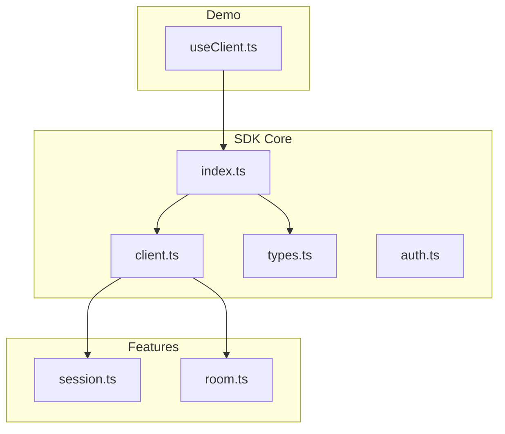
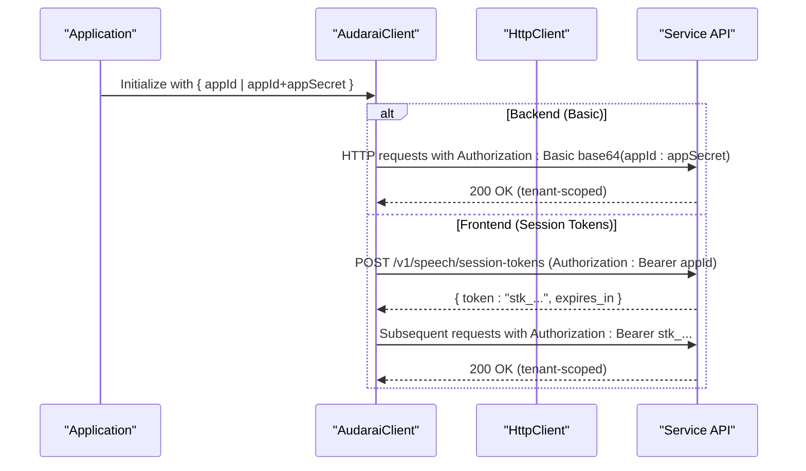
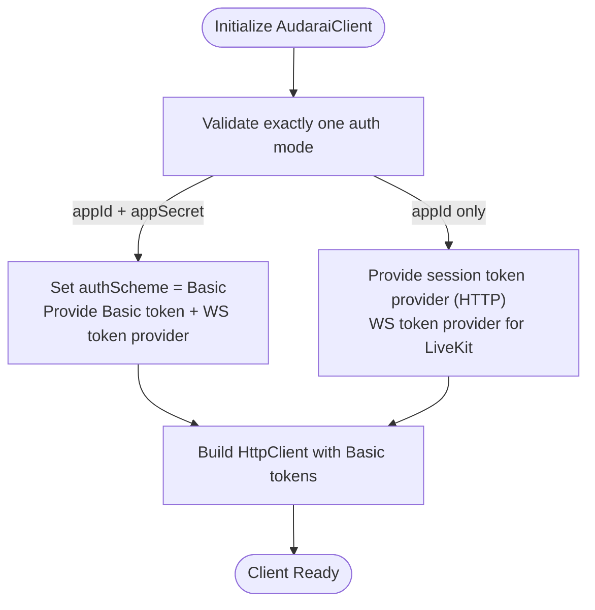
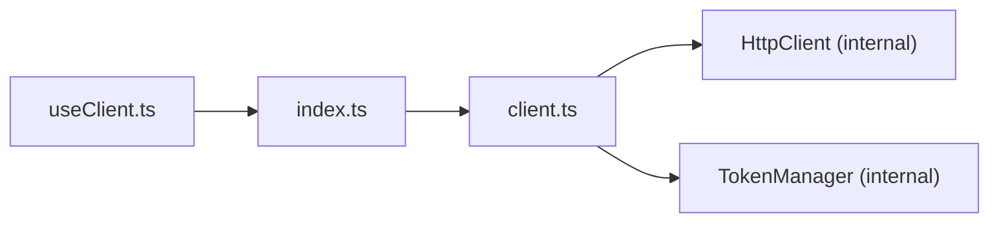

# App Credentials Mode

<cite>
**Referenced Files in This Document**
- [auth.ts](file://src/auth.ts)
- [client.ts](file://src/client.ts)
- [types.ts](file://src/types.ts)
- [index.ts](file://src/index.ts)
- [README.md](file://README.md)
- [session.ts](file://src/session.ts)
- [room.ts](file://src/room.ts)
- [useClient.ts](file://demo/src/composables/useClient.ts)
</cite>

## Table of Contents
1. [Introduction](#introduction)
2. [Project Structure](#project-structure)
3. [Core Components](#core-components)
4. [Architecture Overview](#architecture-overview)
5. [Detailed Component Analysis](#detailed-component-analysis)
6. [Dependency Analysis](#dependency-analysis)
7. [Performance Considerations](#performance-considerations)
8. [Troubleshooting Guide](#troubleshooting-guide)
9. [Conclusion](#conclusion)
10. [Appendices](#appendices)

## Introduction
This document explains the App Credentials Mode authentication for enterprise deployments and multi-tenant applications. It focuses on how the SDK supports App (appid + secret) authentication, how tenant isolation and scoping are enforced by the service, and how to configure and operate enterprise-grade security controls. It also covers credential rotation, audit logging, compliance, and integration with existing identity providers for large organizations.

## Project Structure
The SDK exposes a cohesive client and authentication surface:
- Client initialization and authentication modes are defined in the client module.
- Types define the supported authentication modes and credential shapes.
- The index module re-exports the client and related APIs.
- The demo composable demonstrates practical client instantiation and connectivity probing.

**Diagram sources**
- [index.ts:128-192](file://src/index.ts#L128-L192)
- [client.ts:215-410](file://src/client.ts#L215-L410)
- [types.ts:7-63](file://src/types.ts#L7-L63)
- [auth.ts:102-272](file://src/auth.ts#L102-L272)
- [session.ts:4-234](file://src/session.ts#L4-L234)
- [room.ts:4-108](file://src/room.ts#L4-L108)
- [useClient.ts:21-35](file://demo/src/composables/useClient.ts#L21-L35)

**Section sources**
- [index.ts:1-193](file://src/index.ts#L1-L193)
- [client.ts:215-410](file://src/client.ts#L215-L410)
- [types.ts:7-63](file://src/types.ts#L7-L63)
- [auth.ts:102-272](file://src/auth.ts#L102-L272)
- [session.ts:4-234](file://src/session.ts#L4-L234)
- [room.ts:4-108](file://src/room.ts#L4-L108)
- [useClient.ts:1-36](file://demo/src/composables/useClient.ts#L1-L36)

## Core Components
- App Credentials Mode: The client supports App authentication via appId and optional appSecret. When appSecret is provided, the client authenticates with HTTP Basic base64(appId:appSecret). Without appSecret, the client uses appId to mint short-lived session tokens (similar to publishableKey behavior).
- Token Management: The client manages token lifecycles, automatic refresh, and WebSocket token exchange for LiveKit.
- Tenant Scoping: The service enforces tenant isolation at the API boundary. Requests are scoped to the authenticated tenant based on the credential used and the App’s allowed origins.

Key configuration and behavior:
- Exactly one authentication mode must be configured; appSecret requires appId.
- App mode supports both frontend (appId only) and backend (appId + appSecret) usage.
- WebSocket connections require session tokens; the SDK exchanges tokens automatically.

**Section sources**
- [client.ts:229-243](file://src/client.ts#L229-L243)
- [client.ts:310-346](file://src/client.ts#L310-L346)
- [types.ts:35-49](file://src/types.ts#L35-L49)
- [README.md:176-204](file://README.md#L176-L204)

## Architecture Overview
The App Credentials Mode integrates with the service through two primary flows:
- Backend flow: appId + appSecret authenticate via HTTP Basic. WebSocket connections exchange Basic credentials for a session token.
- Frontend flow: appId alone is used to mint short-lived session tokens for HTTP and WebSocket.

**Diagram sources**
- [client.ts:310-346](file://src/client.ts#L310-L346)
- [client.ts:252-263](file://src/client.ts#L252-L263)
- [client.ts:356-363](file://src/client.ts#L356-L363)

**Section sources**
- [client.ts:252-263](file://src/client.ts#L252-L263)
- [client.ts:310-346](file://src/client.ts#L310-L346)
- [client.ts:356-363](file://src/client.ts#L356-L363)

## Detailed Component Analysis

### App Credentials Mode Implementation
The client enforces mutual exclusivity of authentication modes and constructs appropriate token providers:
- App mode with appSecret sets HTTP Basic auth scheme and provides a token provider that returns the Basic token and a WS token provider for LiveKit.
- App mode without appSecret behaves like publishableKey for HTTP but still uses session tokens for WebSocket.

**Diagram sources**
- [client.ts:229-243](file://src/client.ts#L229-L243)
- [client.ts:310-346](file://src/client.ts#L310-L346)
- [client.ts:356-363](file://src/client.ts#L356-L363)

**Section sources**
- [client.ts:229-243](file://src/client.ts#L229-L243)
- [client.ts:310-346](file://src/client.ts#L310-L346)
- [client.ts:356-363](file://src/client.ts#L356-L363)

### Tenant Isolation and Scoping
Tenant isolation is enforced by the service:
- App registration defines allowed origins and scopes requests by tenant.
- All API endpoints are tenant-scoped; session tokens minted via appId are bound to the registering App’s tenant.
- Multi-tenant environments rely on distinct App registrations and credentials.

Evidence from types and endpoints:
- Many resources include tenant_id fields, indicating tenant-scoped operations.
- Session and room APIs operate within the authenticated tenant context.

**Section sources**
- [types.ts:95-96](file://src/types.ts#L95-L96)
- [types.ts:573-574](file://src/types.ts#L573-L574)
- [session.ts:9-14](file://src/session.ts#L9-L14)
- [room.ts:9-11](file://src/room.ts#L9-L11)

### Enterprise Authentication Setup
- Register an App to obtain appId and secret.
- For backend services, use appId + appSecret with HTTP Basic.
- For frontend, use appId only; the SDK exchanges for session tokens.
- Configure allowed origins for the App to restrict browser usage.

**Section sources**
- [README.md:176-204](file://README.md#L176-L204)
- [types.ts:35-49](file://src/types.ts#L35-L49)

### Multi-Tenant Authentication and Role-Based Access Control
- Tenant isolation is enforced by the service; RBAC is applied per tenant.
- Platform-level resources (e.g., platform agents) may be accessible across tenants depending on service policy.
- Use tenant-aware APIs to manage agents, rooms, and sessions.

**Section sources**
- [session.ts:9-14](file://src/session.ts#L9-L14)
- [room.ts:9-11](file://src/room.ts#L9-L11)
- [agent.ts:36-39](file://src/agent.ts#L36-L39)

### Credential Rotation and Security Controls
- appSecret is backend-only; if lost, reset via the service API to invalidate the old secret and issue a new one.
- The SDK supports proactive token refresh and automatic retry on 401.
- For SSO/OAuth2 integration, use the Access Token mode with dynamic token refresh callbacks.

**Section sources**
- [README.md:197-203](file://README.md#L197-L203)
- [client.ts:79-90](file://src/client.ts#L79-L90)
- [client.ts:153-170](file://src/client.ts#L153-L170)
- [README.md:147-163](file://README.md#L147-L163)

### Audit Logging and Compliance
- The service maintains tenant-scoped logs and recordings; use session and recording APIs to track activity.
- Comply with allowed origins for App credentials and enforce backend-only secret usage.

**Section sources**
- [session.ts:39-53](file://src/session.ts#L39-L53)
- [room.ts:74-99](file://src/room.ts#L74-L99)

### Integration with Existing Identity Providers
- For SSO/OAuth2, use Access Token mode with a dynamic token provider and optional onTokenRefresh callback.
- The SDK passes JWTs directly for HTTP and exchanges them for session tokens for WebSocket.

**Section sources**
- [README.md:147-163](file://README.md#L147-L163)
- [client.ts:264-291](file://src/client.ts#L264-L291)

### Custom Authentication Workflows for Large Organizations
- Combine App credentials with SSO by using Access Token mode for HTTP and App credentials for backend services.
- Use allowed origins and tenant scoping to enforce organizational boundaries.
- Implement token rotation and monitoring via the service’s credential reset and session APIs.

**Section sources**
- [README.md:176-204](file://README.md#L176-L204)
- [session.ts:9-14](file://src/session.ts#L9-L14)

## Dependency Analysis
The client depends on the HTTP layer and token management utilities. The demo composable initializes the client and probes connectivity.

**Diagram sources**
- [useClient.ts:21-35](file://demo/src/composables/useClient.ts#L21-L35)
- [index.ts:128-192](file://src/index.ts#L128-L192)
- [client.ts:93-213](file://src/client.ts#L93-L213)

**Section sources**
- [useClient.ts:21-35](file://demo/src/composables/useClient.ts#L21-L35)
- [index.ts:128-192](file://src/index.ts#L128-L192)
- [client.ts:93-213](file://src/client.ts#L93-L213)

## Performance Considerations
- Proactive token refresh reduces latency near expiration.
- WebSocket token exchange occurs transparently; the SDK manages concurrency and retries.
- Preconnect optimization for LiveKit improves connection performance.

**Section sources**
- [client.ts:79-90](file://src/client.ts#L79-L90)
- [client.ts:153-170](file://src/client.ts#L153-L170)
- [client.ts:380-409](file://src/client.ts#L380-L409)

## Troubleshooting Guide
Common issues and resolutions:
- Authentication failures: Verify the chosen authentication mode and credentials. For App mode, ensure appSecret is present for backend usage.
- 401 responses: The SDK retries once after invalidating cached tokens; confirm token validity and refresh logic.
- Token refresh errors: Implement onTokenRefresh for Access Token mode to keep JWTs fresh.

**Section sources**
- [client.ts:237-243](file://src/client.ts#L237-L243)
- [client.ts:153-170](file://src/client.ts#L153-L170)
- [README.md:147-163](file://README.md#L147-L163)

## Conclusion
App Credentials Mode provides a robust foundation for enterprise deployments and multi-tenant applications. By combining App registration with tenant-scoped APIs, organizations can enforce strict isolation and integrate with existing identity systems. The SDK’s token management, proactive refresh, and WebSocket token exchange simplify secure, scalable implementations.

## Appendices
- Practical client initialization and connectivity probe are demonstrated in the demo composable.

**Section sources**
- [useClient.ts:21-35](file://demo/src/composables/useClient.ts#L21-L35)