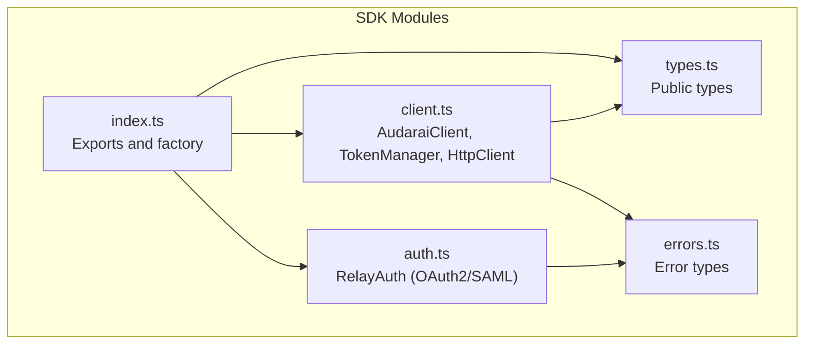
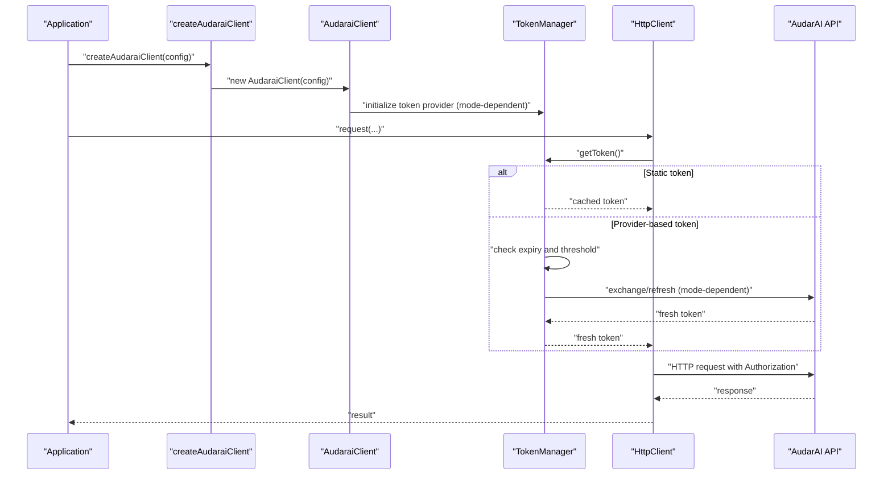
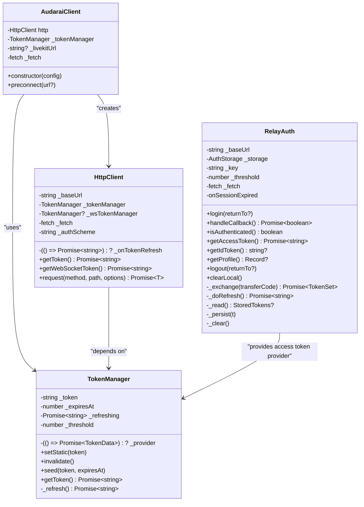

# Authentication System

<cite>
**Referenced Files in This Document**
- [auth.ts](file://src/auth.ts)
- [client.ts](file://src/client.ts)
- [types.ts](file://src/types.ts)
- [index.ts](file://src/index.ts)
- [errors.ts](file://src/errors.ts)
- [README.md](file://README.md)
</cite>

## Table of Contents
1. [Introduction](#introduction)
2. [Project Structure](#project-structure)
3. [Core Components](#core-components)
4. [Architecture Overview](#architecture-overview)
5. [Detailed Component Analysis](#detailed-component-analysis)
6. [Dependency Analysis](#dependency-analysis)
7. [Performance Considerations](#performance-considerations)
8. [Troubleshooting Guide](#troubleshooting-guide)
9. [Conclusion](#conclusion)

## Introduction
This document explains the Authentication System in the AudarAI SDK, detailing all supported authentication modes and how they integrate with the client. It covers:
- Publishable key mode for client-side applications
- Access token mode with OAuth2/SAML SSO integration
- API key mode for server-side applications
- App credentials mode for enterprise deployments
It also documents token management, refresh mechanisms, security considerations, configuration options, parameter requirements, return value structures, common issues, debugging techniques, and best practices for secure token storage and transmission.

## Project Structure
The authentication system spans several modules:
- Client configuration and selection logic
- Token management and automatic refresh
- HTTP client wrapper for request signing
- OAuth2/SAML relay for browser-based SSO
- Exported types and convenience factory

**Diagram sources**
- [index.ts:1-193](file://src/index.ts#L1-L193)
- [types.ts:1-800](file://src/types.ts#L1-L800)
- [client.ts:1-411](file://src/client.ts#L1-L411)
- [auth.ts:1-272](file://src/auth.ts#L1-L272)
- [errors.ts:1-43](file://src/errors.ts#L1-L43)

**Section sources**
- [index.ts:1-193](file://src/index.ts#L1-L193)
- [types.ts:1-800](file://src/types.ts#L1-L800)
- [client.ts:1-411](file://src/client.ts#L1-L411)
- [auth.ts:1-272](file://src/auth.ts#L1-L272)
- [errors.ts:1-43](file://src/errors.ts#L1-L43)

## Core Components
- RelayAuth: Browser-side OAuth2/SAML SSO integration via a relay service. Handles login, callback consumption, token persistence, and refresh.
- TokenManager: Centralized token caching and refresh logic for HTTP and WebSocket tokens.
- HttpClient: Wraps fetch, injects Authorization headers, and handles 401 retries with token refresh.
- AudaraiClient: Selects and configures the authentication mode, sets up token providers, and wires HTTP/WebSocket token usage.

Key configuration types and return structures:
- TokenData: token string and expiration metadata
- AudaraiClientConfig: mutually exclusive authentication fields and options
- TokenSet: OAuth2 token bundle used by RelayAuth

**Section sources**
- [client.ts:22-91](file://src/client.ts#L22-L91)
- [client.ts:93-213](file://src/client.ts#L93-L213)
- [client.ts:215-411](file://src/client.ts#L215-L411)
- [auth.ts:28-62](file://src/auth.ts#L28-L62)
- [auth.ts:102-272](file://src/auth.ts#L102-L272)
- [types.ts:1-63](file://src/types.ts#L1-L63)

## Architecture Overview
The SDK supports four mutually exclusive authentication modes. The client selects a mode at construction time and sets up token providers accordingly. For WebSocket connections, session tokens are exchanged automatically when needed.

**Diagram sources**
- [index.ts:160-193](file://src/index.ts#L160-L193)
- [client.ts:215-411](file://src/client.ts#L215-L411)
- [client.ts:22-91](file://src/client.ts#L22-L91)
- [client.ts:93-213](file://src/client.ts#L93-L213)

## Detailed Component Analysis

### Publishable Key Mode (Client-Side)
- Purpose: Safe to embed in browsers; server validates Origin against allowlist.
- Behavior:
  - HTTP requests: SDK obtains a short-lived session token using the publishable key.
  - WebSocket requests: SDK exchanges the access token for a session token automatically.
- Configuration:
  - Field: publishableKey
  - Additional: baseUrl, refreshThresholdSeconds, fetch, livekitUrl
- Token handling:
  - TokenManager caches a session token until near expiry.
  - On expiry, SDK calls the server to mint a new session token.
- Security:
  - Publishable keys are safe for client-side use; server enforces allowed origins.

Example usage paths:
- [README.md:134-139](file://README.md#L134-L139)
- [client.ts:249-263](file://src/client.ts#L249-L263)

Return value structures:
- TokenData: token, expires_in, optional expires_at
- VoiceSessionResponse: session_id, room_id, token, room_name, livekit_url

**Section sources**
- [README.md:130-146](file://README.md#L130-L146)
- [client.ts:249-263](file://src/client.ts#L249-L263)
- [types.ts:1-63](file://src/types.ts#L1-L63)

### Access Token Mode (SSO/OAuth2/SAML)
- Purpose: Integrate with existing OAuth2 providers (e.g., Keycloak) or SAML.
- Behavior:
  - HTTP requests: JWT passed directly as Bearer token.
  - WebSocket requests: SDK exchanges JWT for a session token automatically.
  - Supports dynamic token provider (async function) for refresh.
- Configuration:
  - Field: accessToken (string or async function)
  - Optional: onTokenRefresh (for static token refresh)
  - Additional: baseUrl, refreshThresholdSeconds, fetch, livekitUrl
- Token handling:
  - TokenManager resolves JWT via provider and caches it.
  - If a 401 occurs, SDK can call onTokenRefresh to obtain a new JWT and retry.
- Security:
  - Treat access tokens as secrets; avoid embedding in client-side code unless using dynamic provider.

Example usage paths:
- [README.md:147-163](file://README.md#L147-L163)
- [client.ts:264-291](file://src/client.ts#L264-L291)

Return value structures:
- TokenData: token, expires_in, optional expires_at
- VoiceSessionResponse: session_id, room_id, token, room_name, livekit_url

**Section sources**
- [README.md:147-163](file://README.md#L147-L163)
- [client.ts:264-291](file://src/client.ts#L264-L291)
- [types.ts:1-63](file://src/types.ts#L1-L63)

### API Key Mode (Server-Side)
- Purpose: Full-privilege keys for backend services and local development.
- Behavior:
  - HTTP requests: API key passed directly as Bearer token.
  - WebSocket requests: SDK exchanges API key for a session token automatically.
- Configuration:
  - Field: apiKey
  - Additional: baseUrl, refreshThresholdSeconds, fetch, livekitUrl
- Token handling:
  - TokenManager treats the API key as a static token (no refresh).
  - WebSocket token manager exchanges the API key for a session token.
- Security:
  - Never expose API keys in browser code.

Example usage paths:
- [README.md:165-174](file://README.md#L165-L174)
- [client.ts:292-310](file://src/client.ts#L292-L310)

Return value structures:
- TokenData: token, expires_in, optional expires_at
- VoiceSessionResponse: session_id, room_id, token, room_name, livekit_url

**Section sources**
- [README.md:165-174](file://README.md#L165-L174)
- [client.ts:292-310](file://src/client.ts#L292-L310)
- [types.ts:1-63](file://src/types.ts#L1-L63)

### App Credentials Mode (Enterprise)
- Purpose: Single registration for both frontend and backend.
- Behavior:
  - Frontend: appId only (safe to embed; behaves like publishable key).
  - Backend: appId + appSecret (HTTP Basic base64(appId:appSecret)).
  - WebSocket requests: SDK exchanges credentials for a session token automatically.
- Configuration:
  - Fields: appId (+ appSecret for backend)
  - Additional: baseUrl, refreshThresholdSeconds, fetch, livekitUrl
- Token handling:
  - Frontend: same flow as publishable key.
  - Backend: HTTP Basic scheme for HTTP requests; WebSocket uses session token.
- Security:
  - appSecret is confidential; never expose in browser code.

Example usage paths:
- [README.md:176-195](file://README.md#L176-L195)
- [client.ts:310-346](file://src/client.ts#L310-L346)

Return value structures:
- TokenData: token, expires_in, optional expires_at
- VoiceSessionResponse: session_id, room_id, token, room_name, livekit_url

**Section sources**
- [README.md:176-195](file://README.md#L176-L195)
- [client.ts:310-346](file://src/client.ts#L310-L346)
- [types.ts:1-63](file://src/types.ts#L1-L63)

### OAuth2/SAML RelayAuth (Browser SSO)
- Purpose: Facilitate browser-based OAuth2/SAML login via a relay service.
- Capabilities:
  - Redirect to relay login, consume callback with transfer_code, persist tokens, refresh when needed, decode id_token for profile.
- Configuration:
  - relayBaseUrl (required)
  - storage, storageKey, refreshThresholdSeconds, fetch, onSessionExpired
- Token lifecycle:
  - handleCallback consumes transfer_code and writes tokens to storage.
  - getAccessToken returns a valid access token, refreshing as needed.
  - logout triggers relay logout with id_token_hint when available.
- Storage adapters:
  - Default localStorage adapter; fallback memory adapter for SSR.

Example usage paths:
- [README.md:147-163](file://README.md#L147-L163)
- [auth.ts:102-272](file://src/auth.ts#L102-L272)

Return value structures:
- TokenSet: access_token, id_token, refresh_token, token_type, expires_in, refresh_expires_in, scope
- Profile decoding: id_token payload decoded for UI display (not for authorization decisions)

**Section sources**
- [auth.ts:102-272](file://src/auth.ts#L102-L272)
- [auth.ts:28-62](file://src/auth.ts#L28-L62)

### Token Management and Refresh Mechanisms
- Proactive refresh:
  - TokenManager checks expiry against a configurable threshold (default 30s).
  - Mutex prevents concurrent refresh calls.
- 401 handling:
  - HttpClient retries once after invalidating cache or invoking onTokenRefresh.
- Session token exchange:
  - For modes requiring session tokens (publishableKey, accessToken, apiKey, appId), SDK calls the server to mint a session token before WebSocket usage.

Example usage paths:
- [client.ts:22-91](file://src/client.ts#L22-L91)
- [client.ts:93-213](file://src/client.ts#L93-L213)
- [client.ts:252-263](file://src/client.ts#L252-L263)
- [client.ts:278-291](file://src/client.ts#L278-L291)
- [client.ts:298-310](file://src/client.ts#L298-L310)
- [client.ts:333-344](file://src/client.ts#L333-L344)

**Section sources**
- [client.ts:22-91](file://src/client.ts#L22-L91)
- [client.ts:93-213](file://src/client.ts#L93-L213)
- [client.ts:252-263](file://src/client.ts#L252-L263)
- [client.ts:278-291](file://src/client.ts#L278-L291)
- [client.ts:298-310](file://src/client.ts#L298-L310)
- [client.ts:333-344](file://src/client.ts#L333-L344)

### Configuration Options and Parameter Requirements
- AudaraiClientConfig:
  - Mutually exclusive authentication fields: publishableKey, accessToken, apiKey, appId (+ appSecret for backend).
  - Optional: onTokenRefresh (static token refresh), refreshThresholdSeconds, fetch, livekitUrl.
- TokenData:
  - token, expires_in, optional expires_at.
- RelayAuthConfig:
  - relayBaseUrl (required), storage, storageKey, refreshThresholdSeconds, fetch, onSessionExpired.

Return value structures:
- TokenData: token, expires_in, optional expires_at
- VoiceSessionResponse: session_id, room_id, token, room_name, livekit_url

**Section sources**
- [types.ts:1-63](file://src/types.ts#L1-L63)
- [client.ts:225-240](file://src/client.ts#L225-L240)
- [client.ts:22-91](file://src/client.ts#L22-L91)

### Error Handling and Security Considerations
- Errors:
  - AuthenticationError: thrown on missing/invalid/expired tokens or failed refresh.
  - ApiError: thrown on HTTP errors with status and code.
  - InsufficientBalanceError: thrown on HTTP 402.
  - RateLimitedError: thrown on HTTP 429 with optional retry-after.
- Security:
  - Publishable keys are safe for client-side; restrict allowed origins.
  - Access tokens should be managed securely; prefer dynamic provider for refresh.
  - API keys and appSecret must never be exposed in client-side code.
  - RelayAuth persists tokens locally; use secure storage adapters in SSR environments.

Example usage paths:
- [errors.ts:1-43](file://src/errors.ts#L1-L43)
- [client.ts:133-212](file://src/client.ts#L133-L212)
- [auth.ts:169-183](file://src/auth.ts#L169-L183)
- [auth.ts:232-252](file://src/auth.ts#L232-L252)

**Section sources**
- [errors.ts:1-43](file://src/errors.ts#L1-L43)
- [client.ts:133-212](file://src/client.ts#L133-L212)
- [auth.ts:169-183](file://src/auth.ts#L169-L183)
- [auth.ts:232-252](file://src/auth.ts#L232-L252)

## Dependency Analysis
- AudaraiClient depends on TokenManager and HttpClient.
- TokenManager depends on a token provider (function) and optional onTokenRefresh callback.
- HttpClient depends on TokenManager and optionally onTokenRefresh for 401 retries.
- RelayAuth provides a token provider for access token mode and integrates with AudaraiClient.

**Diagram sources**
- [client.ts:22-91](file://src/client.ts#L22-L91)
- [client.ts:93-213](file://src/client.ts#L93-L213)
- [client.ts:215-411](file://src/client.ts#L215-L411)
- [auth.ts:102-272](file://src/auth.ts#L102-L272)

**Section sources**
- [client.ts:22-91](file://src/client.ts#L22-L91)
- [client.ts:93-213](file://src/client.ts#L93-L213)
- [client.ts:215-411](file://src/client.ts#L215-L411)
- [auth.ts:102-272](file://src/auth.ts#L102-L272)

## Performance Considerations
- Proactive refresh: Tokens are refreshed before expiry to minimize latency spikes.
- Mutex: Prevents redundant concurrent refresh calls.
- Preconnect: Optional DNS/TLS warm-up for LiveKit URLs to reduce connection latency.

[No sources needed since this section provides general guidance]

## Troubleshooting Guide
Common issues and resolutions:
- Authentication failures:
  - Verify exactly one authentication mode is configured.
  - Ensure appSecret is paired with appId.
  - For access token mode, confirm the provider returns a non-empty token.
- 401 Unauthorized:
  - For static access tokens, set onTokenRefresh to renew tokens.
  - For provider-based tokens, ensure the provider is callable and returns a valid token.
- Excessive refresh calls:
  - Increase refreshThresholdSeconds to reduce proactive refresh frequency.
- Browser-origin restrictions:
  - For publishableKey and appId modes, ensure allowed origins are configured correctly.

Debugging techniques:
- Inspect thrown errors: AuthenticationError, ApiError, InsufficientBalanceError, RateLimitedError.
- Log token provider invocations and token expiry timestamps.
- Use getProfile() to decode id_token payload for UI display (not authorization).

Security best practices:
- Store tokens securely; avoid logging sensitive tokens.
- Use secure storage adapters in SSR environments.
- Never embed API keys or appSecret in client-side code.

**Section sources**
- [client.ts:225-243](file://src/client.ts#L225-L243)
- [client.ts:133-212](file://src/client.ts#L133-L212)
- [errors.ts:1-43](file://src/errors.ts#L1-L43)
- [auth.ts:194-204](file://src/auth.ts#L194-L204)

## Conclusion
The AudarAI SDK provides a robust, flexible authentication system supporting multiple deployment scenarios:
- Publishable key for safe client-side usage
- Access token with OAuth2/SAML integration
- API key for backend services
- App credentials for enterprise-scale deployments

The system centralizes token management, supports proactive refresh, and handles 401 retries seamlessly. By selecting the appropriate mode and following the security and troubleshooting guidance, developers can build secure and performant voice-enabled applications.