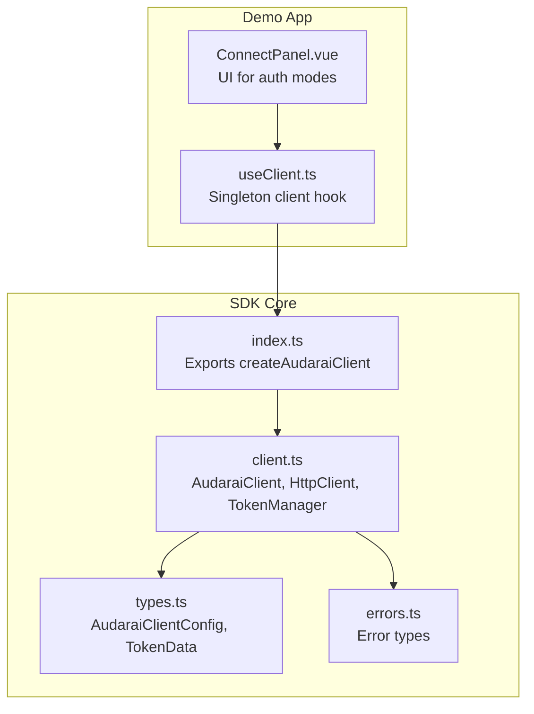
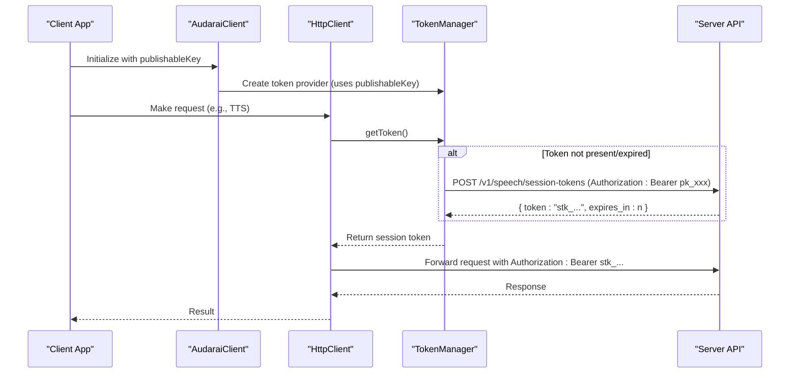
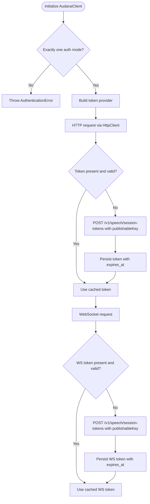
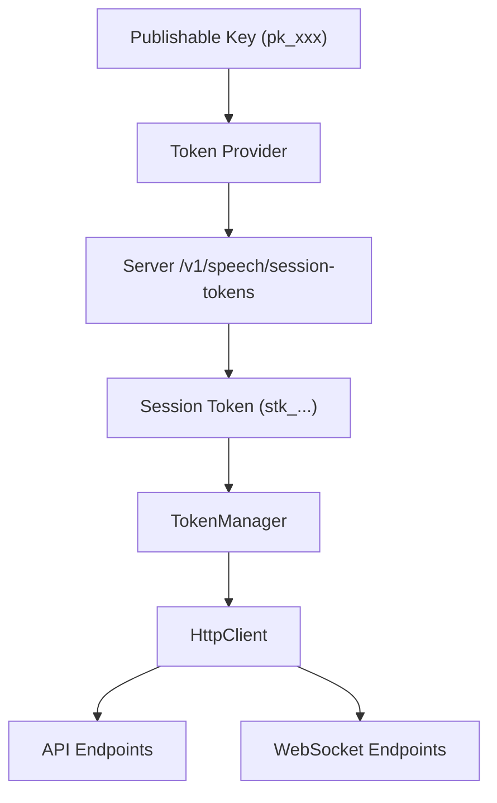
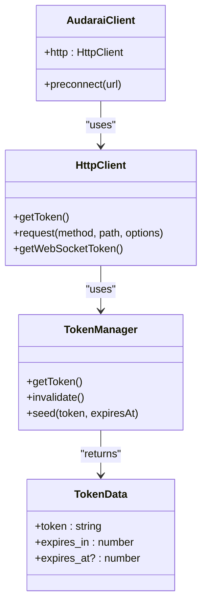

# Publishable Key Mode

<cite>
**Referenced Files in This Document**
- [auth.ts](file://src/auth.ts)
- [client.ts](file://src/client.ts)
- [index.ts](file://src/index.ts)
- [types.ts](file://src/types.ts)
- [errors.ts](file://src/errors.ts)
- [README.md](file://README.md)
- [useClient.ts](file://demo/src/composables/useClient.ts)
- [ConnectPanel.vue](file://demo/src/components/ConnectPanel.vue)
</cite>

## Table of Contents
1. [Introduction](#introduction)
2. [Project Structure](#project-structure)
3. [Core Components](#core-components)
4. [Architecture Overview](#architecture-overview)
5. [Detailed Component Analysis](#detailed-component-analysis)
6. [Dependency Analysis](#dependency-analysis)
7. [Performance Considerations](#performance-considerations)
8. [Troubleshooting Guide](#troubleshooting-guide)
9. [Conclusion](#conclusion)
10. [Appendices](#appendices)

## Introduction
This document explains the Publishable Key Mode for client-side authentication in the AudarAI SDK. It focuses on how the mode works without backend infrastructure, the security model, use cases, limitations, configuration options, and practical examples for initializing the client, handling authentication flows, and managing token lifecycles. It also covers security considerations specific to client-side authentication, token exposure risks, and best practices for protecting publishable keys. Scenarios covered include browser-based applications, mobile apps, and edge computing environments where backend authentication infrastructure is not available.

## Project Structure
The SDK exposes a unified client factory and several authentication modes. For Publishable Key Mode, the client obtains short-lived session tokens from the server using the publishable key, which is safe to embed in client-side code because the server validates the request Origin against your configured allowlist.

**Diagram sources**
- [index.ts:128-193](file://src/index.ts#L128-L193)
- [client.ts:215-411](file://src/client.ts#L215-L411)
- [types.ts:7-63](file://src/types.ts#L7-L63)
- [errors.ts:1-43](file://src/errors.ts#L1-L43)
- [useClient.ts:17-36](file://demo/src/composables/useClient.ts#L17-L36)
- [ConnectPanel.vue:135-208](file://demo/src/components/ConnectPanel.vue#L135-L208)

**Section sources**
- [index.ts:128-193](file://src/index.ts#L128-L193)
- [client.ts:215-411](file://src/client.ts#L215-L411)
- [types.ts:7-63](file://src/types.ts#L7-L63)
- [README.md:117-205](file://README.md#L117-L205)

## Core Components
- AudaraiClient: The main client that encapsulates HTTP and WebSocket interactions, token management, and authentication mode selection.
- HttpClient: Handles HTTP requests, token injection, and automatic retry on 401 with token refresh.
- TokenManager: Manages token caching, expiration, and proactive refresh.
- TokenData: Defines the shape of tokens returned by token providers.
- Authentication Modes: Exactly one of publishableKey, accessToken, apiKey, or appId must be configured.

Key behaviors for Publishable Key Mode:
- The client constructs a token provider that calls the server’s session token endpoint using the publishable key.
- WebSocket connections receive session tokens (stk_ prefix) automatically exchanged by the SDK.
- The SDK enforces a strict mutual exclusivity of authentication modes.

**Section sources**
- [client.ts:215-369](file://src/client.ts#L215-L369)
- [types.ts:1-5](file://src/types.ts#L1-L5)
- [types.ts:7-63](file://src/types.ts#L7-L63)
- [README.md:117-129](file://README.md#L117-L129)

## Architecture Overview
Publishable Key Mode enables client-side applications to obtain short-lived session tokens without exposing sensitive secrets. The client uses the publishable key to request a session token from the server, which is then used for both HTTP and WebSocket requests.

**Diagram sources**
- [client.ts:249-263](file://src/client.ts#L249-L263)
- [client.ts:133-173](file://src/client.ts#L133-L173)
- [client.ts:52-91](file://src/client.ts#L52-L91)

**Section sources**
- [client.ts:249-263](file://src/client.ts#L249-L263)
- [client.ts:133-173](file://src/client.ts#L133-L173)
- [client.ts:52-91](file://src/client.ts#L52-L91)

## Detailed Component Analysis

### Publishable Key Mode Implementation
- Configuration: The client accepts a publishableKey and constructs a token provider that calls the server’s session token endpoint with Authorization: Bearer <publishableKey>.
- Token Exchange: The server validates the Origin against the configured allowlist and returns a short-lived session token (stk_ prefix) with an expires_in value.
- WebSocket Tokens: For WebSocket connections, the SDK uses the same token provider to obtain session tokens automatically before connecting.
- Mutual Exclusivity: The client enforces that exactly one authentication mode is configured.

**Diagram sources**
- [client.ts:225-244](file://src/client.ts#L225-L244)
- [client.ts:249-263](file://src/client.ts#L249-L263)
- [client.ts:133-173](file://src/client.ts#L133-L173)
- [client.ts:278-291](file://src/client.ts#L278-L291)

**Section sources**
- [client.ts:225-244](file://src/client.ts#L225-L244)
- [client.ts:249-263](file://src/client.ts#L249-L263)
- [client.ts:133-173](file://src/client.ts#L133-L173)
- [client.ts:278-291](file://src/client.ts#L278-L291)

### Security Model and Best Practices
- Origin Validation: The server validates the request Origin against your configured allowlist before issuing session tokens. This mitigates token leakage in cross-origin contexts.
- Client-Side Safety: The publishable key is safe to embed in client-side code because it is validated against allowed origins and does not grant administrative privileges.
- Token Exposure Risks: While the publishable key itself is safe, session tokens (stk_ prefix) are short-lived and intended for internal use. Avoid logging or persisting them unnecessarily.
- Best Practices:
  - Configure allowed origins precisely in the dashboard.
  - Avoid exposing publishable keys in insecure environments.
  - Rotate keys periodically and monitor usage.
  - Use HTTPS endpoints to protect tokens in transit.

**Section sources**
- [README.md:130-146](file://README.md#L130-L146)
- [client.ts:249-263](file://src/client.ts#L249-L263)

### Configuration Options
- publishableKey: Required for this mode. Must be a valid pk_ prefixed key.
- baseUrl: Required base URL for API endpoints.
- refreshThresholdSeconds: Optional. Proactive refresh threshold in seconds (default: 30).
- livekitUrl: Optional. Known LiveKit server URL for pre-connection optimization.
- fetch: Optional. Custom fetch implementation for environments without native fetch.

These options are part of the AudaraiClientConfig interface and are validated during client construction.

**Section sources**
- [types.ts:7-63](file://src/types.ts#L7-L63)
- [client.ts:225-244](file://src/client.ts#L225-L244)

### Practical Examples

#### Initialize the Client with a Publishable Key
- Use the convenience factory to create a client configured with a publishable key.
- The client will automatically exchange the publishable key for session tokens on demand.

Example references:
- [README.md:93-113](file://README.md#L93-L113)
- [index.ts:142-159](file://src/index.ts#L142-L159)

**Section sources**
- [README.md:93-113](file://README.md#L93-L113)
- [index.ts:142-159](file://src/index.ts#L142-L159)

#### Handle Authentication Flow
- For client-side apps without backend infrastructure, the publishable key mode eliminates the need for a separate login flow.
- The SDK manages token acquisition and renewal automatically.

Example references:
- [client.ts:249-263](file://src/client.ts#L249-L263)
- [client.ts:133-173](file://src/client.ts#L133-L173)

**Section sources**
- [client.ts:249-263](file://src/client.ts#L249-L263)
- [client.ts:133-173](file://src/client.ts#L133-L173)

#### Manage Token Lifecycle
- TokenManager proactively refreshes tokens before they expire based on refreshThresholdSeconds.
- On 401 responses, the SDK invalidates cached tokens and retries once automatically.

Example references:
- [client.ts:52-91](file://src/client.ts#L52-L91)
- [client.ts:133-173](file://src/client.ts#L133-L173)

**Section sources**
- [client.ts:52-91](file://src/client.ts#L52-L91)
- [client.ts:133-173](file://src/client.ts#L133-L173)

### Conceptual Overview
The following diagram illustrates how the SDK routes requests through the token provider and token manager for Publishable Key Mode.

[No sources needed since this diagram shows conceptual workflow, not actual code structure]

## Dependency Analysis
- AudaraiClient depends on TokenManager and HttpClient to manage tokens and HTTP requests.
- HttpClient depends on TokenManager for token retrieval and optional onTokenRefresh callback for dynamic token updates.
- TokenManager depends on a token provider (configured via publishableKey) to obtain session tokens.

**Diagram sources**
- [client.ts:215-411](file://src/client.ts#L215-L411)
- [client.ts:22-91](file://src/client.ts#L22-L91)
- [types.ts:1-5](file://src/types.ts#L1-L5)

**Section sources**
- [client.ts:215-411](file://src/client.ts#L215-L411)
- [client.ts:22-91](file://src/client.ts#L22-L91)
- [types.ts:1-5](file://src/types.ts#L1-L5)

## Performance Considerations
- Proactive Refresh: The SDK proactively refreshes tokens before they expire (default: 30 seconds before expiry) to minimize latency spikes.
- Mutex: Prevents redundant concurrent refresh calls.
- Preconnect: When livekitUrl is provided, the SDK performs DNS/TLS pre-warming to reduce voice connection latency.

**Section sources**
- [client.ts:79-91](file://src/client.ts#L79-L91)
- [client.ts:380-409](file://src/client.ts#L380-L409)

## Troubleshooting Guide
Common issues and resolutions:
- AuthenticationError: Thrown when no token provider is configured or when token exchange fails. Verify the publishable key and allowed origins.
- InsufficientBalanceError: Indicates account balance depletion. Top up your account.
- RateLimitedError: Occurs when rate limits are exceeded. Respect the Retry-After header.
- ApiError: Generic HTTP error. Inspect statusCode and code for details.

**Section sources**
- [client.ts:133-173](file://src/client.ts#L133-L173)
- [errors.ts:8-42](file://src/errors.ts#L8-L42)

## Conclusion
Publishable Key Mode enables secure client-side authentication without backend infrastructure. By leveraging short-lived session tokens and server-side Origin validation, it balances usability with security. The SDK’s token management ensures seamless operation, proactive refresh, and robust error handling. Follow best practices for key protection and origin configuration to maximize security and reliability.

## Appendices

### Use Cases and Limitations
- Use cases:
  - Browser-based applications where backend authentication is not available.
  - Mobile apps using embedded web views or hybrid frameworks.
  - Edge computing environments with minimal backend presence.
- Limitations:
  - Requires a valid publishable key with configured allowed origins.
  - Session tokens are short-lived and designed for internal use.
  - Not suitable for administrative operations requiring higher privileges.

**Section sources**
- [README.md:130-146](file://README.md#L130-L146)
- [client.ts:249-263](file://src/client.ts#L249-L263)

### Demo Application References
- The demo demonstrates how to connect using the publishable key mode and integrates with the SDK’s client factory.

**Section sources**
- [useClient.ts:17-36](file://demo/src/composables/useClient.ts#L17-L36)
- [ConnectPanel.vue:165-167](file://demo/src/components/ConnectPanel.vue#L165-L167)