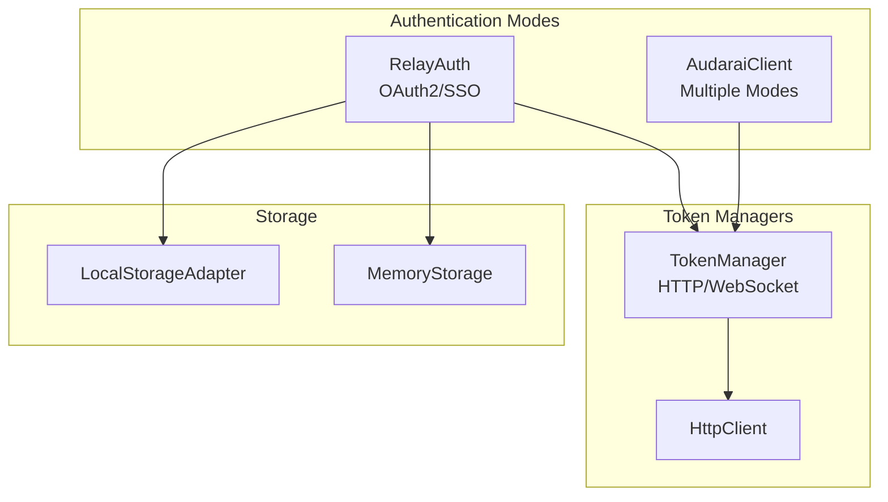
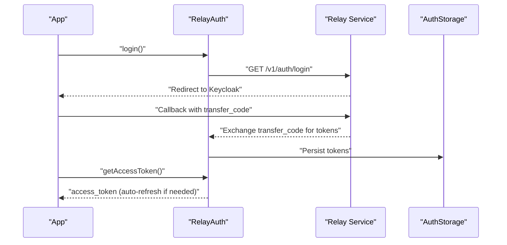
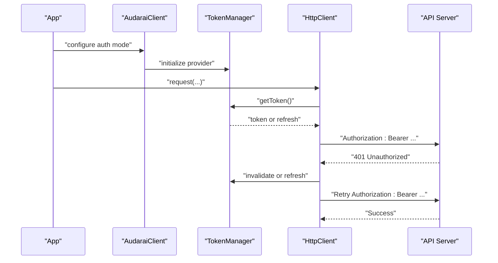
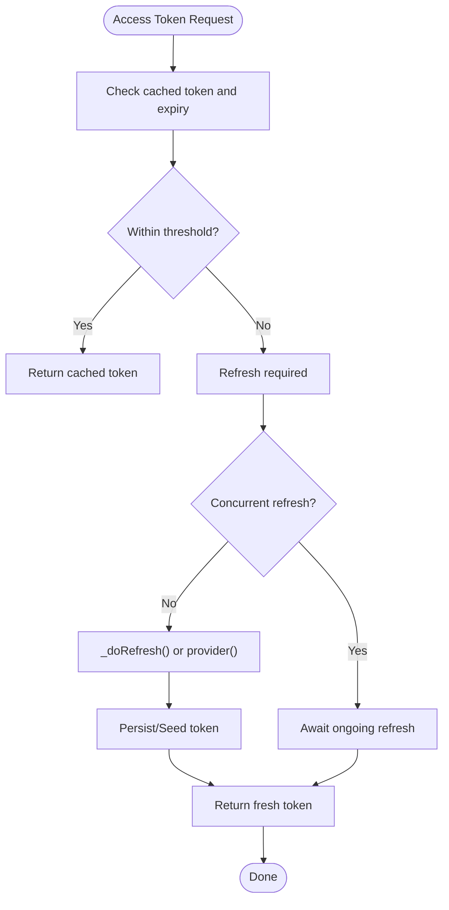
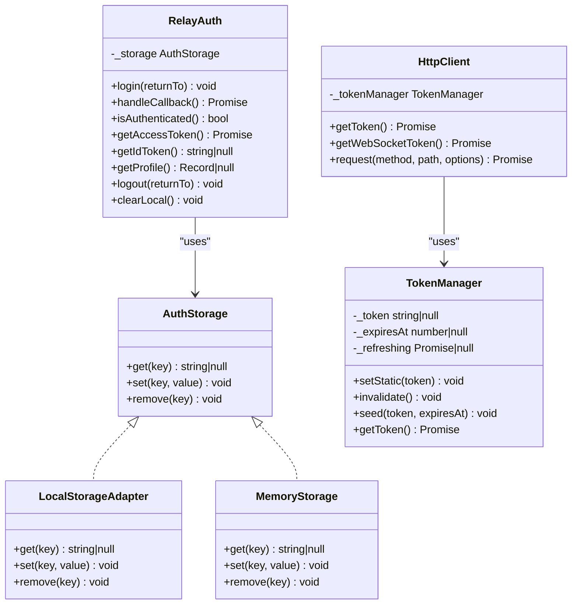

# Token Management & Security

<cite>
**Referenced Files in This Document**
- [auth.ts](file://src/auth.ts)
- [client.ts](file://src/client.ts)
- [errors.ts](file://src/errors.ts)
- [index.ts](file://src/index.ts)
- [types.ts](file://src/types.ts)
- [session.ts](file://src/session.ts)
</cite>

## Table of Contents
1. [Introduction](#introduction)
2. [Project Structure](#project-structure)
3. [Core Components](#core-components)
4. [Architecture Overview](#architecture-overview)
5. [Detailed Component Analysis](#detailed-component-analysis)
6. [Dependency Analysis](#dependency-analysis)
7. [Performance Considerations](#performance-considerations)
8. [Troubleshooting Guide](#troubleshooting-guide)
9. [Conclusion](#conclusion)
10. [Appendices](#appendices)

## Introduction
This document explains token management and security practices across all authentication modes in the SDK. It covers the token lifecycle, storage strategies, refresh mechanisms, and security considerations. It documents the TokenSet interface, token validation, expiration handling, and secure storage options including the localStorage adapter and memory storage for SSR environments. It also provides examples for implementing custom storage adapters, handling token refresh failures, and debugging authentication issues. Finally, it outlines security best practices for token storage, transmission, and rotation, along with error handling patterns and recovery strategies for common failure scenarios.

## Project Structure
The SDK exposes two primary token management paths:
- OAuth2/SSO mode via RelayAuth, which manages access/id/refresh tokens and integrates with a relay service for Keycloak.
- Multiple client-side authentication modes via AudaraiClient, including publishable key, access token, API key, and app ID/app secret combinations.

**Diagram sources**
- [auth.ts:102-271](file://src/auth.ts#L102-L271)
- [client.ts:22-91](file://src/client.ts#L22-L91)
- [client.ts:93-213](file://src/client.ts#L93-L213)

**Section sources**
- [auth.ts:102-271](file://src/auth.ts#L102-L271)
- [client.ts:215-411](file://src/client.ts#L215-L411)

## Core Components
- TokenSet: Defines the shape of tokens exchanged by the relay service and used by clients.
- AuthStorage: Abstraction for token persistence with default adapters for browsers and SSR.
- RelayAuth: Orchestrates OAuth2/SSO login, callback handling, token storage, and refresh.
- TokenManager: Manages token caching, expiration thresholds, and refresh for HTTP/WebSocket.
- HttpClient: Applies tokens to requests, handles 401 retries, and maps API errors.
- AudaraiClient: Factory that configures authentication modes and wires token providers.

**Section sources**
- [auth.ts:28-67](file://src/auth.ts#L28-L67)
- [auth.ts:38-88](file://src/auth.ts#L38-L88)
- [auth.ts:102-271](file://src/auth.ts#L102-L271)
- [client.ts:22-91](file://src/client.ts#L22-L91)
- [client.ts:93-213](file://src/client.ts#L93-L213)
- [client.ts:215-411](file://src/client.ts#L215-L411)
- [types.ts:1-63](file://src/types.ts#L1-L63)

## Architecture Overview
The SDK supports two complementary flows:
- OAuth2/SSO with RelayAuth: Browser-side OAuth2 flow via a relay service, storing tokens in a configurable storage adapter.
- Client-side authentication modes: Publishable key, access token, API key, and app ID/app secret combinations, each producing short-lived session tokens or direct bearer tokens.

**Diagram sources**
- [auth.ts:123-155](file://src/auth.ts#L123-L155)
- [auth.ts:223-230](file://src/auth.ts#L223-L230)
- [auth.ts:254-266](file://src/auth.ts#L254-L266)
- [auth.ts:169-183](file://src/auth.ts#L169-L183)

**Diagram sources**
- [client.ts:215-411](file://src/client.ts#L215-L411)
- [client.ts:93-213](file://src/client.ts#L93-L213)
- [client.ts:22-91](file://src/client.ts#L22-L91)

## Detailed Component Analysis

### TokenSet Interface and Validation
- TokenSet defines the token payload shape including access_token, id_token, refresh_token, token_type, expires_in, refresh_expires_in, and scope.
- Validation helpers:
  - parseJwtExp extracts exp from a JWT for precise expiration handling.
  - unwrap parses API responses and throws ApiError on non-OK or non-zero code responses.

Security considerations:
- Treat id_token payloads as untrusted for authorization decisions; only use for UI display.
- Prefer explicit expires_at when available to avoid clock drift.

**Section sources**
- [auth.ts:28-36](file://src/auth.ts#L28-L36)
- [client.ts:4-12](file://src/client.ts#L4-L12)
- [auth.ts:92-98](file://src/auth.ts#L92-L98)

### Storage Strategies and Adapters
- AuthStorage abstraction enables pluggable persistence.
- Default adapters:
  - LocalStorageAdapter: Uses browser localStorage with safe fallbacks.
  - MemoryStorage: SSR-safe in-memory Map-based adapter.
- RelayAuth selects storage based on environment and configuration.

Security considerations:
- Avoid storing sensitive tokens in insecure locations.
- Use MemoryStorage in SSR environments to prevent cross-request leakage.
- Clear tokens on logout and session expiration.

**Section sources**
- [auth.ts:38-43](file://src/auth.ts#L38-L43)
- [auth.ts:71-88](file://src/auth.ts#L71-L88)
- [auth.ts:111-119](file://src/auth.ts#L111-L119)

### OAuth2/SSO Flow with RelayAuth
- Login redirects to relay service which forwards to Keycloak.
- handleCallback consumes transfer_code, exchanges for tokens, persists them, and cleans the URL.
- isAuthenticated checks remaining validity or presence of refresh_token.
- getAccessToken returns a valid token, auto-refreshing if needed and nearing expiry.
- _doRefresh attempts refresh via relay service; on failure clears storage and invokes onSessionExpired.

Security considerations:
- Remove transfer_code from URL after consumption to prevent replay.
- Use onSessionExpired to redirect to login or show a controlled UX.
- Store tokens securely and avoid exposing them in logs.

**Section sources**
- [auth.ts:123-155](file://src/auth.ts#L123-L155)
- [auth.ts:157-183](file://src/auth.ts#L157-L183)
- [auth.ts:232-252](file://src/auth.ts#L232-L252)

### TokenManager and HttpClient
- TokenManager:
  - Caches token and computed expires_at.
  - Proactively refreshes before threshold to minimize latency.
  - Mutex prevents concurrent refreshes.
  - Supports static tokens and manual invalidation.
- HttpClient:
  - Applies Authorization header with configurable scheme.
  - On 401:
    - If onTokenRefresh is provided, obtains a new JWT, parses exp, seeds TokenManager, and retries.
    - Otherwise, invalidates cache and re-fetches via provider.
  - Maps API responses to typed errors.

Security considerations:
- Use onTokenRefresh for OAuth2/SSO flows to keep tokens fresh.
- Avoid leaking tokens in request bodies or logs.

**Section sources**
- [client.ts:22-91](file://src/client.ts#L22-L91)
- [client.ts:93-213](file://src/client.ts#L93-L213)

### AudaraiClient Authentication Modes
- Exactly one authentication mode must be configured:
  - publishableKey: HTTP and WS use session tokens minted from the publishable key.
  - accessToken: HTTP uses JWT directly; WS exchanges for session token.
  - apiKey: HTTP uses API key directly; WS exchanges for session token.
  - appId (+ optional appSecret): HTTP uses Basic or session token depending on backend usage; WS exchanges for session token.
- TokenManager is wired to the chosen provider(s).
- Optional livekitUrl enables preconnect optimizations.

Security considerations:
- appSecret must remain confidential; only used in backend contexts.
- Prefer publishableKey or access token for frontend to avoid exposing secrets.

**Section sources**
- [client.ts:215-411](file://src/client.ts#L215-L411)
- [types.ts:7-63](file://src/types.ts#L7-L63)

### Token Lifecycle and Expiration Handling
- RelayAuth stores expires_at derived from expires_in and persists tokens.
- TokenManager caches tokens and computes expires_at; uses threshold to decide refresh.
- getAccessToken and TokenManager.getToken enforce proactive refresh before expiry.
- On 401, HttpClient retries with refreshed token or re-fetch via provider.

**Diagram sources**
- [auth.ts:169-183](file://src/auth.ts#L169-L183)
- [client.ts:52-91](file://src/client.ts#L52-L91)

**Section sources**
- [auth.ts:260-266](file://src/auth.ts#L260-L266)
- [client.ts:46-50](file://src/client.ts#L46-L50)
- [client.ts:153-170](file://src/client.ts#L153-L170)

### Secure Storage Options and SSR
- Browser: LocalStorageAdapter persists tokens safely within browser constraints.
- SSR: MemoryStorage avoids cross-request contamination and server-side persistence.
- RelayAuth auto-selects adapter based on environment; can be overridden via config.

Best practices:
- Use MemoryStorage in SSR to prevent token leakage across requests.
- Avoid storing tokens in cookies unless strictly necessary and secured appropriately.
- Clear tokens on logout and session expiration.

**Section sources**
- [auth.ts:71-88](file://src/auth.ts#L71-L88)
- [auth.ts:111-119](file://src/auth.ts#L111-L119)

### Implementing Custom Storage Adapters
- Implement AuthStorage with get, set, remove methods.
- Use in RelayAuthConfig.storage to replace default adapters.
- Example patterns:
  - Encrypted local storage adapter (outside scope of this SDK).
  - IndexedDB adapter for larger token sets.
  - Server-backed adapter for centralized token management.

Guidance:
- Ensure get/set/remove are synchronous or promise-compatible.
- Handle exceptions gracefully to avoid blocking token operations.

**Section sources**
- [auth.ts:38-43](file://src/auth.ts#L38-L43)
- [auth.ts:111-119](file://src/auth.ts#L111-L119)

### Handling Token Refresh Failures
- RelayAuth:
  - _doRefresh calls relay refresh endpoint; on failure clears storage and invokes onSessionExpired.
  - onSessionExpired defaults to redirecting to login; customize for UX.
- HttpClient:
  - On 401, retries with refreshed token or re-fetch; throws AuthenticationError if unresolved.

Recovery strategies:
- Redirect to login on refresh failure.
- Show user-facing error and allow retry.
- Implement exponential backoff for transient failures.

**Section sources**
- [auth.ts:232-252](file://src/auth.ts#L232-L252)
- [auth.ts:118-119](file://src/auth.ts#L118-L119)
- [client.ts:153-170](file://src/client.ts#L153-L170)

### Debugging Authentication Issues
Common symptoms and diagnostics:
- Not logged in: isAuthenticated returns false; ensure handleCallback ran and tokens persisted.
- Frequent 401s: Check token threshold and provider; verify onTokenRefresh returns valid tokens.
- Expired tokens: Confirm expires_in/expiry alignment; ensure proactive refresh is enabled.
- SSR token leakage: Verify MemoryStorage is used; confirm no cross-request persistence.

Tools and helpers:
- getProfile decodes id_token payload for display (not for authorization).
- TokenManager.seed allows injecting a JWT with exp for testing.

**Section sources**
- [auth.ts:157-163](file://src/auth.ts#L157-L163)
- [auth.ts:194-204](file://src/auth.ts#L194-L204)
- [client.ts:46-50](file://src/client.ts#L46-L50)

## Dependency Analysis
- RelayAuth depends on AuthStorage and wraps token exchange/refresh.
- AudaraiClient composes TokenManager and HttpClient for all modes.
- HttpClient depends on TokenManager and maps API errors to typed exceptions.

**Diagram sources**
- [auth.ts:38-88](file://src/auth.ts#L38-L88)
- [auth.ts:102-271](file://src/auth.ts#L102-L271)
- [client.ts:22-91](file://src/client.ts#L22-L91)
- [client.ts:93-213](file://src/client.ts#L93-L213)

**Section sources**
- [auth.ts:102-271](file://src/auth.ts#L102-L271)
- [client.ts:215-411](file://src/client.ts#L215-L411)

## Performance Considerations
- Proactive refresh: Both RelayAuth and TokenManager refresh before threshold to reduce latency.
- Mutex: Prevents redundant concurrent refreshes.
- Preconnect: AudaraiClient can pre-warm DNS/TLS for LiveKit servers to reduce connection latency.

Recommendations:
- Tune refreshThresholdSeconds based on network conditions and acceptable latency.
- Use onTokenRefresh to avoid repeated provider calls.
- Leverage preconnect for WebSocket-heavy flows.

**Section sources**
- [auth.ts:116](file://src/auth.ts#L116)
- [client.ts:29-32](file://src/client.ts#L29-L32)
- [client.ts:380-409](file://src/client.ts#L380-L409)

## Troubleshooting Guide
Common issues and resolutions:
- AuthenticationError thrown when no token provider or token expired:
  - Ensure exactly one authentication mode is configured.
  - For access token mode, provide onTokenRefresh for OAuth2 flows.
- 401 Unauthorized:
  - HttpClient retries with refreshed token; verify onTokenRefresh returns a valid JWT.
  - If not using onTokenRefresh, ensure provider returns a fresh token.
- Network errors:
  - Retry logic is handled internally; consider exponential backoff in higher layers.
- Token storage errors:
  - LocalStorageAdapter swallows exceptions; verify storage availability in the environment.
  - Use MemoryStorage in SSR to avoid storage exceptions.

Error types:
- AuthenticationError: General authentication failures.
- ApiError: API-level errors with status and code.
- RateLimitedError: Rate limiting with optional retry-after.
- InsufficientBalanceError: Billing-related errors.

**Section sources**
- [client.ts:153-170](file://src/client.ts#L153-L170)
- [errors.ts:8-42](file://src/errors.ts#L8-L42)
- [auth.ts:118-119](file://src/auth.ts#L118-L119)

## Conclusion
The SDK provides robust, secure token management across multiple authentication modes. RelayAuth offers a complete OAuth2/SSO flow with resilient storage and refresh, while AudaraiClient supports flexible client-side configurations with proactive token management and automatic 401 retries. By leveraging the provided storage adapters, error types, and configuration hooks, applications can implement secure, reliable authentication with minimal boilerplate.

## Appendices

### API Definitions and Usage Notes
- RelayAuthConfig:
  - relayBaseUrl: Relay service base URL.
  - storage: AuthStorage implementation (optional).
  - storageKey: Storage key prefix (optional).
  - refreshThresholdSeconds: Proactive refresh threshold (optional).
  - fetch: Custom fetch implementation (optional).
  - onSessionExpired: Callback invoked on session expiration (optional).
- TokenData:
  - token: The token string.
  - expires_in: Seconds until expiry.
  - expires_at: Epoch milliseconds (optional).

**Section sources**
- [auth.ts:45-62](file://src/auth.ts#L45-L62)
- [types.ts:1-5](file://src/types.ts#L1-L5)