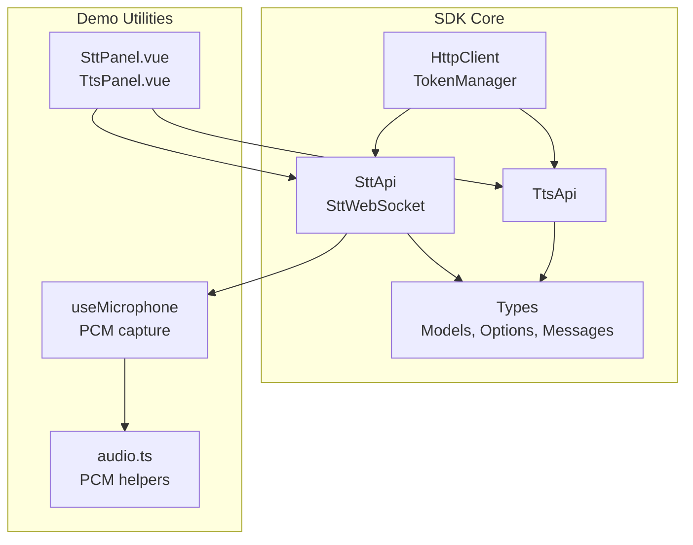
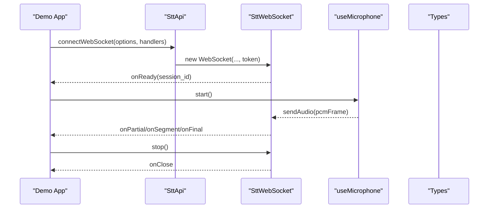
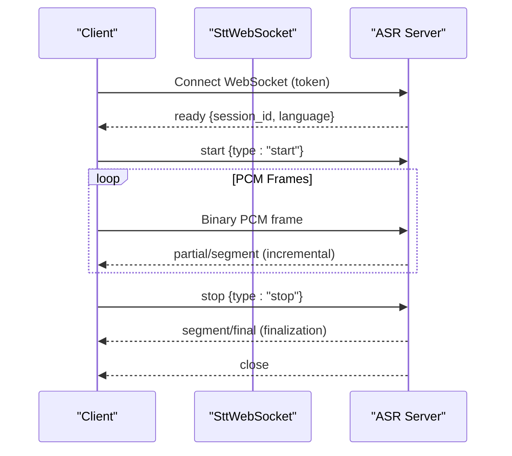
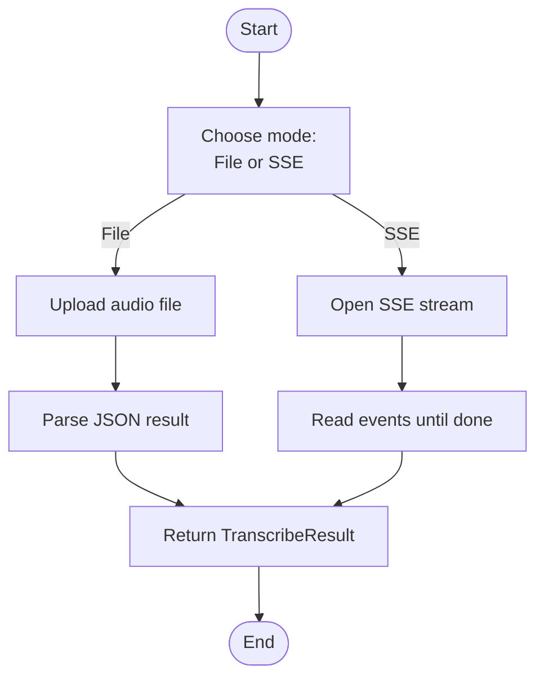
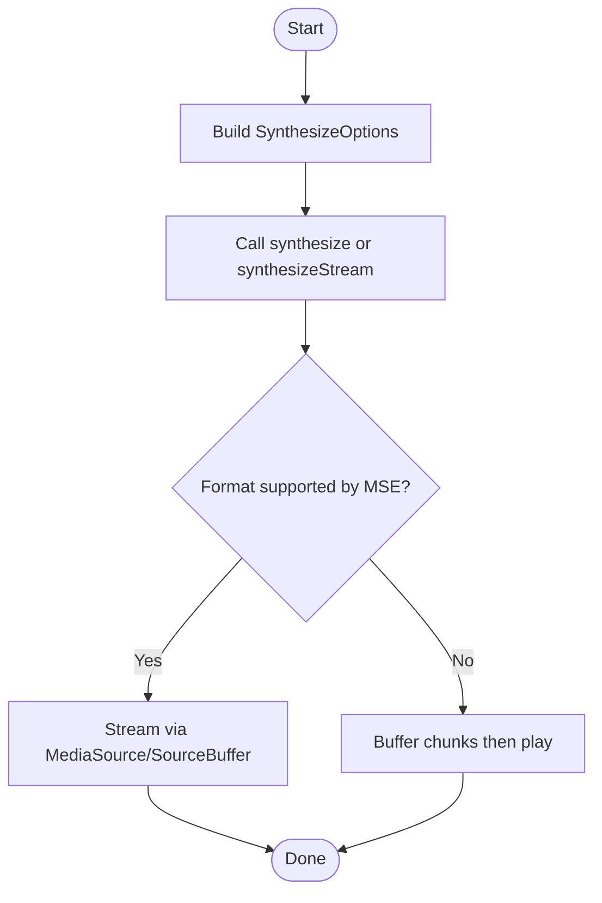
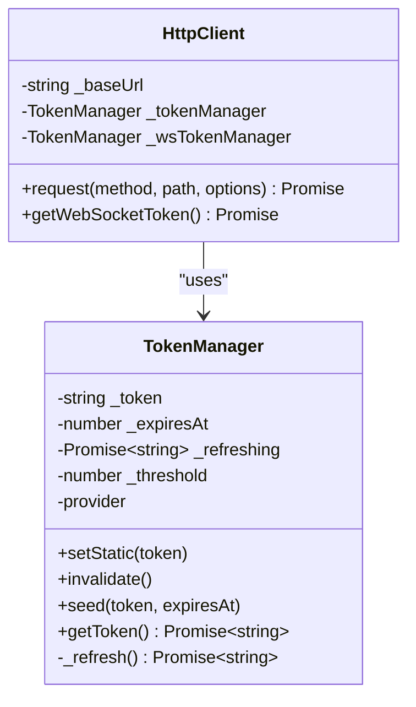
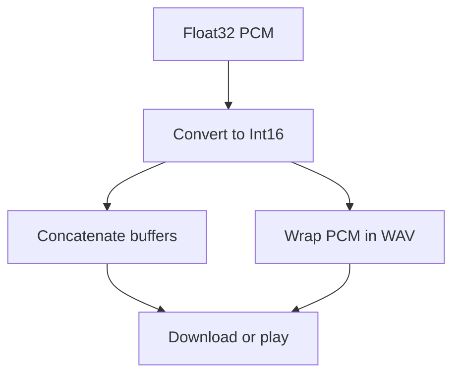
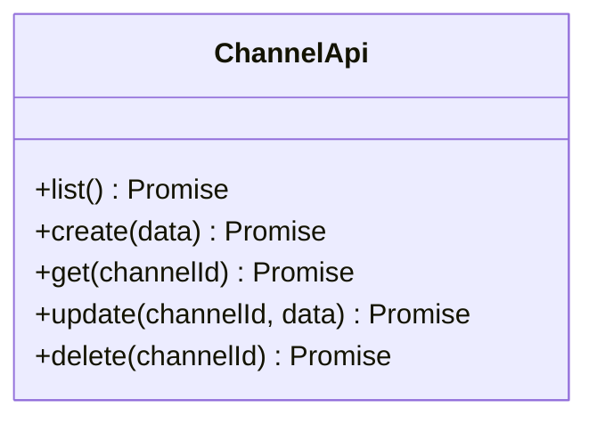
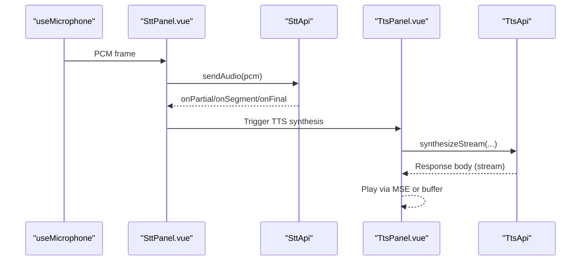
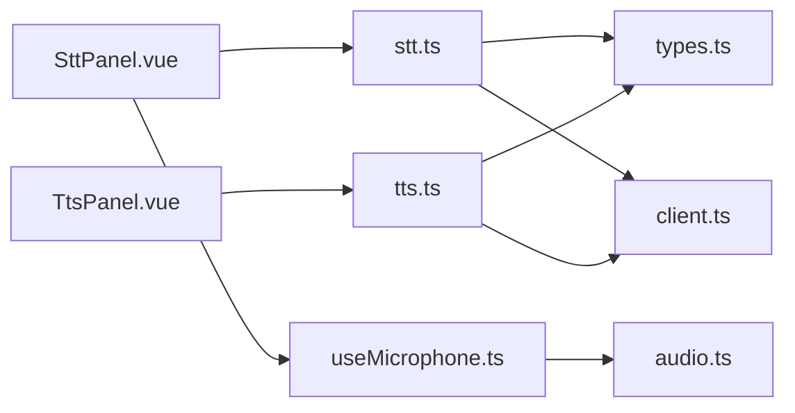

# Audio Streaming Channels

<cite>
**Referenced Files in This Document**
- [channel.ts](file://src/channel.ts)
- [client.ts](file://src/client.ts)
- [stt.ts](file://src/stt.ts)
- [tts.ts](file://src/tts.ts)
- [types.ts](file://src/types.ts)
- [audio.ts](file://demo/src/utils/audio.ts)
- [useClient.ts](file://demo/src/composables/useClient.ts)
- [useMicrophone.ts](file://demo/src/composables/useMicrophone.ts)
- [SttPanel.vue](file://demo/src/components/SttPanel.vue)
- [TtsPanel.vue](file://demo/src/components/TtsPanel.vue)
- [RoomPanel.vue](file://demo/src/components/RoomPanel.vue)
- [agent.ts](file://src/agent.ts)
- [README.md](file://README.md)
- [package.json](file://package.json)
</cite>

## Table of Contents
1. [Introduction](#introduction)
2. [Project Structure](#project-structure)
3. [Core Components](#core-components)
4. [Architecture Overview](#architecture-overview)
5. [Detailed Component Analysis](#detailed-component-analysis)
6. [Dependency Analysis](#dependency-analysis)
7. [Performance Considerations](#performance-considerations)
8. [Troubleshooting Guide](#troubleshooting-guide)
9. [Conclusion](#conclusion)
10. [Appendices](#appendices)

## Introduction
This document explains how to build and operate Audio Streaming Channels using the SDK’s Speech-to-Text (STT), Text-to-Speech (TTS), and real-time translation capabilities. It covers real-time audio data transmission, streaming protocols, synchronization, configuration, bitrate and quality management, chunk processing, latency reduction, codec selection, bandwidth adaptation, performance tuning, buffering strategies, and integration with STT/TTS services and real-time audio processing pipelines.

## Project Structure
The SDK exposes a cohesive API surface for audio streaming:
- HTTP client and token management for authentication and WebSocket token exchange
- STT module for file, SSE streaming, and WebSocket real-time transcription
- TTS module for synthesized audio generation and streaming
- Types defining models, providers, and message schemas
- Demo utilities for PCM conversion, buffering, and audio playback
- Demo components demonstrating microphone capture, real-time STT, and TTS streaming

**Diagram sources**
- [client.ts:93-213](file://src/client.ts#L93-L213)
- [stt.ts:83-216](file://src/stt.ts#L83-L216)
- [tts.ts:11-230](file://src/tts.ts#L11-L230)
- [types.ts:111-264](file://src/types.ts#L111-L264)
- [useMicrophone.ts:8-44](file://demo/src/composables/useMicrophone.ts#L8-L44)
- [audio.ts:28-68](file://demo/src/utils/audio.ts#L28-L68)
- [SttPanel.vue:141-234](file://demo/src/components/SttPanel.vue#L141-L234)
- [TtsPanel.vue:297-408](file://demo/src/components/TtsPanel.vue#L297-L408)

**Section sources**
- [README.md:1-845](file://README.md#L1-L845)
- [package.json:1-26](file://package.json#L1-L26)

## Core Components
- Channel management: Create, update, list, and soft-delete channels bound to agents and skills.
- STT: File transcription, SSE streaming, and WebSocket real-time transcription with protocol v2.
- TTS: Audio synthesis and streaming with format selection and provider/model control.
- Token and HTTP client: Centralized authentication, token refresh, and WebSocket token exchange.
- Demo utilities: PCM conversion, concatenation, WAV packaging, and download helpers.

**Section sources**
- [channel.ts:4-43](file://src/channel.ts#L4-L43)
- [stt.ts:83-216](file://src/stt.ts#L83-L216)
- [tts.ts:11-230](file://src/tts.ts#L11-L230)
- [client.ts:93-213](file://src/client.ts#L93-L213)
- [audio.ts:1-69](file://demo/src/utils/audio.ts#L1-L69)

## Architecture Overview
The audio streaming pipeline integrates HTTP and WebSocket transports:
- HTTP for file-based transcription and synthesis
- SSE for streaming transcription results
- WebSocket for real-time STT with binary PCM frames and typed messages
- TokenManager and HttpClient handle authentication and automatic token refresh
- Demo components orchestrate microphone capture and playback

**Diagram sources**
- [stt.ts:198-216](file://src/stt.ts#L198-L216)
- [SttPanel.vue:144-234](file://demo/src/components/SttPanel.vue#L144-L234)
- [useMicrophone.ts:15-41](file://demo/src/composables/useMicrophone.ts#L15-L41)
- [types.ts:190-264](file://src/types.ts#L190-L264)

## Detailed Component Analysis

### STT WebSocket Real-Time Transcription
- Protocol v2: server emits ready, SDK auto-sends start, then client streams PCM frames; stop signals flush and close.
- Handlers: onReady, onPartial (~120 ms throttled), onSegment, onFinal, onError, onClose.
- Options: provider, language, forced_alignment for word-level timestamps.

**Diagram sources**
- [stt.ts:21-81](file://src/stt.ts#L21-L81)
- [types.ts:190-264](file://src/types.ts#L190-L264)
- [SttPanel.vue:98-234](file://demo/src/components/SttPanel.vue#L98-L234)

**Section sources**
- [stt.ts:21-81](file://src/stt.ts#L21-L81)
- [types.ts:190-264](file://src/types.ts#L190-L264)
- [SttPanel.vue:98-234](file://demo/src/components/SttPanel.vue#L98-L234)

### STT File and SSE Streaming
- File transcription returns text, language, and optional word timestamps.
- SSE streaming emits incremental chunks and final result; supports forced_alignment.

**Diagram sources**
- [stt.ts:91-183](file://src/stt.ts#L91-L183)
- [types.ts:170-188](file://src/types.ts#L170-L188)

**Section sources**
- [stt.ts:91-183](file://src/stt.ts#L91-L183)
- [types.ts:170-188](file://src/types.ts#L170-L188)

### TTS Synthesis and Streaming
- Synthesize returns ArrayBuffer; synthesizeStream returns Response for piping.
- Streaming supports MSE-compatible formats (mp3, aac) and buffered fallback for others.

**Diagram sources**
- [tts.ts:14-66](file://src/tts.ts#L14-L66)
- [tts.ts:387-408](file://src/tts.ts#L387-L408)
- [TtsPanel.vue:314-408](file://demo/src/components/TtsPanel.vue#L314-L408)

**Section sources**
- [tts.ts:14-66](file://src/tts.ts#L14-L66)
- [tts.ts:387-408](file://src/tts.ts#L387-L408)
- [TtsPanel.vue:314-408](file://demo/src/components/TtsPanel.vue#L314-L408)

### Token Management and Authentication
- TokenManager caches tokens and proactively refreshes before expiry.
- HttpClient handles 401 by invalidating cache or using onTokenRefresh, then retries.
- WebSocket token exchange occurs automatically for WebSocket endpoints.

**Diagram sources**
- [client.ts:22-91](file://src/client.ts#L22-L91)
- [client.ts:93-213](file://src/client.ts#L93-L213)

**Section sources**
- [client.ts:22-91](file://src/client.ts#L22-L91)
- [client.ts:93-213](file://src/client.ts#L93-L213)

### Audio Utilities and PCM Processing
- Convert Float32 to 16-bit integers, concatenate buffers, wrap PCM in WAV container, and create object URLs for playback/download.

**Diagram sources**
- [audio.ts:28-68](file://demo/src/utils/audio.ts#L28-L68)

**Section sources**
- [audio.ts:1-69](file://demo/src/utils/audio.ts#L1-L69)

### Channel Configuration and Binding
- Channels encapsulate routing and configuration for agents and skills.
- Create, update, list, and soft-delete channels; bind to agents and skills.

**Diagram sources**
- [channel.ts:4-43](file://src/channel.ts#L4-L43)
- [types.ts:1163-1194](file://src/types.ts#L1163-L1194)

**Section sources**
- [channel.ts:4-43](file://src/channel.ts#L4-L43)
- [types.ts:1163-1194](file://src/types.ts#L1163-L1194)

### Real-Time Audio Processing Pipeline (Demo)
- Microphone capture feeds PCM frames to STT WebSocket.
- Playback and streaming handled by TTS APIs and MSE when supported.

**Diagram sources**
- [useMicrophone.ts:8-44](file://demo/src/composables/useMicrophone.ts#L8-L44)
- [SttPanel.vue:141-234](file://demo/src/components/SttPanel.vue#L141-L234)
- [TtsPanel.vue:387-408](file://demo/src/components/TtsPanel.vue#L387-L408)

**Section sources**
- [useMicrophone.ts:8-44](file://demo/src/composables/useMicrophone.ts#L8-L44)
- [SttPanel.vue:141-234](file://demo/src/components/SttPanel.vue#L141-L234)
- [TtsPanel.vue:387-408](file://demo/src/components/TtsPanel.vue#L387-L408)

## Dependency Analysis
- STT and TTS depend on HttpClient for authenticated requests and WebSocket token exchange.
- Demo components depend on audio utilities and microphone capture.
- Types define cross-cutting interfaces for models, providers, and message schemas.

**Diagram sources**
- [stt.ts:1-12](file://src/stt.ts#L1-L12)
- [tts.ts:1-9](file://src/tts.ts#L1-L9)
- [client.ts:1-3](file://src/client.ts#L1-L3)
- [types.ts:1-12](file://src/types.ts#L1-L12)
- [useMicrophone.ts:1-3](file://demo/src/composables/useMicrophone.ts#L1-L3)
- [audio.ts:1-5](file://demo/src/utils/audio.ts#L1-L5)
- [SttPanel.vue:1-10](file://demo/src/components/SttPanel.vue#L1-L10)
- [TtsPanel.vue:1-8](file://demo/src/components/TtsPanel.vue#L1-L8)

**Section sources**
- [stt.ts:1-12](file://src/stt.ts#L1-L12)
- [tts.ts:1-9](file://src/tts.ts#L1-L9)
- [client.ts:1-3](file://src/client.ts#L1-L3)
- [types.ts:1-12](file://src/types.ts#L1-L12)
- [useMicrophone.ts:1-3](file://demo/src/composables/useMicrophone.ts#L1-L3)
- [audio.ts:1-5](file://demo/src/utils/audio.ts#L1-L5)
- [SttPanel.vue:1-10](file://demo/src/components/SttPanel.vue#L1-L10)
- [TtsPanel.vue:1-8](file://demo/src/components/TtsPanel.vue#L1-L8)

## Performance Considerations
- Latency reduction
  - Use WebSocket real-time STT with minimal frame sizes and appropriate sample rates.
  - Enable forced_alignment selectively to reduce post-processing overhead when timestamps are unnecessary.
  - Pre-warm LiveKit connections using the SDK’s preconnect mechanism to reduce DNS/TLS cold-start latency.
- Bandwidth adaptation
  - Choose provider/model combinations aligned with network conditions; lower-latency providers may increase cost.
  - For streaming synthesis, prefer MSE-compatible formats (mp3, aac) to enable progressive playback.
- Buffering strategies
  - For non-MSE formats, buffer chunks and merge before playback to avoid gaps.
  - Use chunked reads and appendBuffer pacing to smooth playback and reduce stalls.
- Quality optimization
  - Adjust speed and provider parameters to balance quality and throughput.
  - Use echo cancellation, noise suppression, and AGC in microphone capture to improve STT accuracy.

[No sources needed since this section provides general guidance]

## Troubleshooting Guide
- Authentication failures
  - 401 responses trigger automatic token invalidation and retry; ensure onTokenRefresh is configured for dynamic tokens.
- Rate limiting
  - 429 responses include Retry-After; back off and retry according to the header.
- WebSocket errors
  - Listen for error and close handlers; reconnect with a new session token if needed.
- Connectivity issues
  - Verify LiveKit preconnect is enabled and working; check network logs for DNS/TLS establishment delays.
- STT/TTS mismatches
  - Confirm provider/model compatibility and language settings; ensure forced_alignment is requested only when supported.

**Section sources**
- [client.ts:187-212](file://src/client.ts#L187-L212)
- [stt.ts:50-58](file://src/stt.ts#L50-L58)
- [tts.ts:14-38](file://src/tts.ts#L14-L38)

## Conclusion
Audio Streaming Channels in this SDK combine robust HTTP and WebSocket transports with flexible token management and rich audio utilities. By leveraging real-time STT, streaming TTS, and demo-driven PCM processing, developers can implement low-latency, high-quality audio pipelines tailored to diverse use cases.

[No sources needed since this section summarizes without analyzing specific files]

## Appendices

### Practical Examples Index
- Audio channel setup and binding: [channel.ts:11-34](file://src/channel.ts#L11-L34), [types.ts:1163-1194](file://src/types.ts#L1163-L1194)
- Real-time STT coordination: [stt.ts:198-216](file://src/stt.ts#L198-L216), [SttPanel.vue:144-234](file://demo/src/components/SttPanel.vue#L144-L234)
- Audio quality monitoring and options: [types.ts:128-151](file://src/types.ts#L128-L151), [types.ts:28-50](file://src/types.ts#L28-L50)
- PCM processing and playback: [audio.ts:28-68](file://demo/src/utils/audio.ts#L28-L68), [TtsPanel.vue:314-408](file://demo/src/components/TtsPanel.vue#L314-L408)
- Integration with STT/TTS services: [stt.ts:83-183](file://src/stt.ts#L83-L183), [tts.ts:11-66](file://src/tts.ts#L11-L66)
- LiveKit voice sessions: [agent.ts:144-156](file://src/agent.ts#L144-L156), [RoomPanel.vue:527-532](file://demo/src/components/RoomPanel.vue#L527-L532)