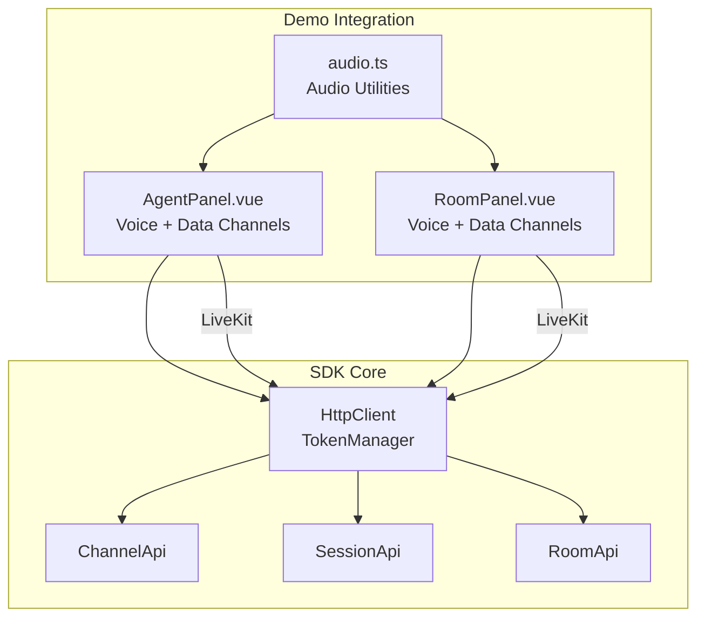
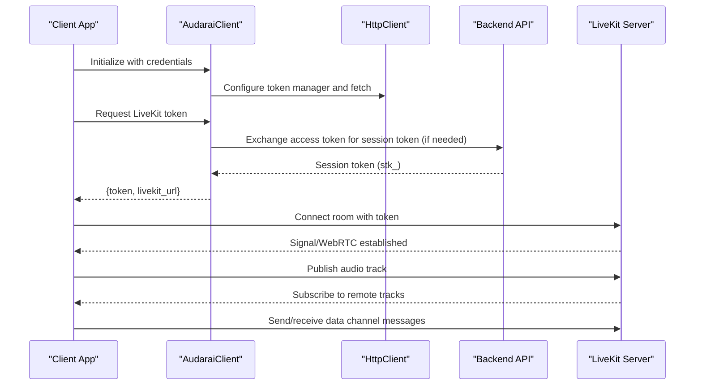
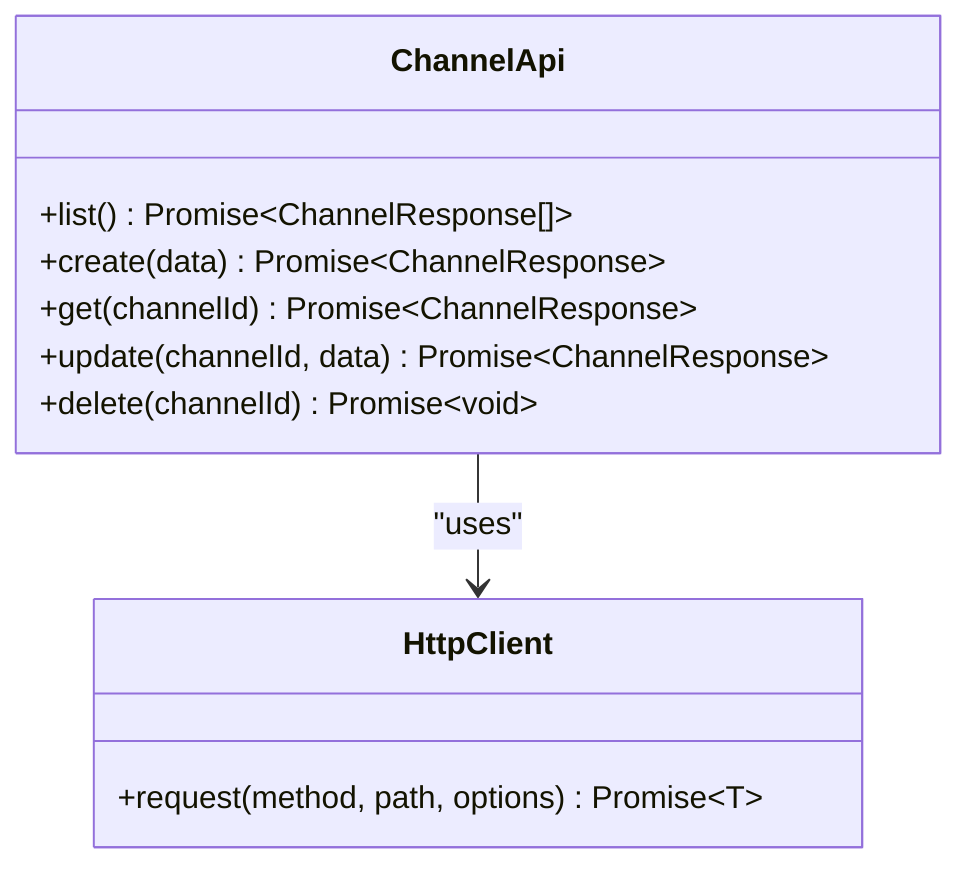
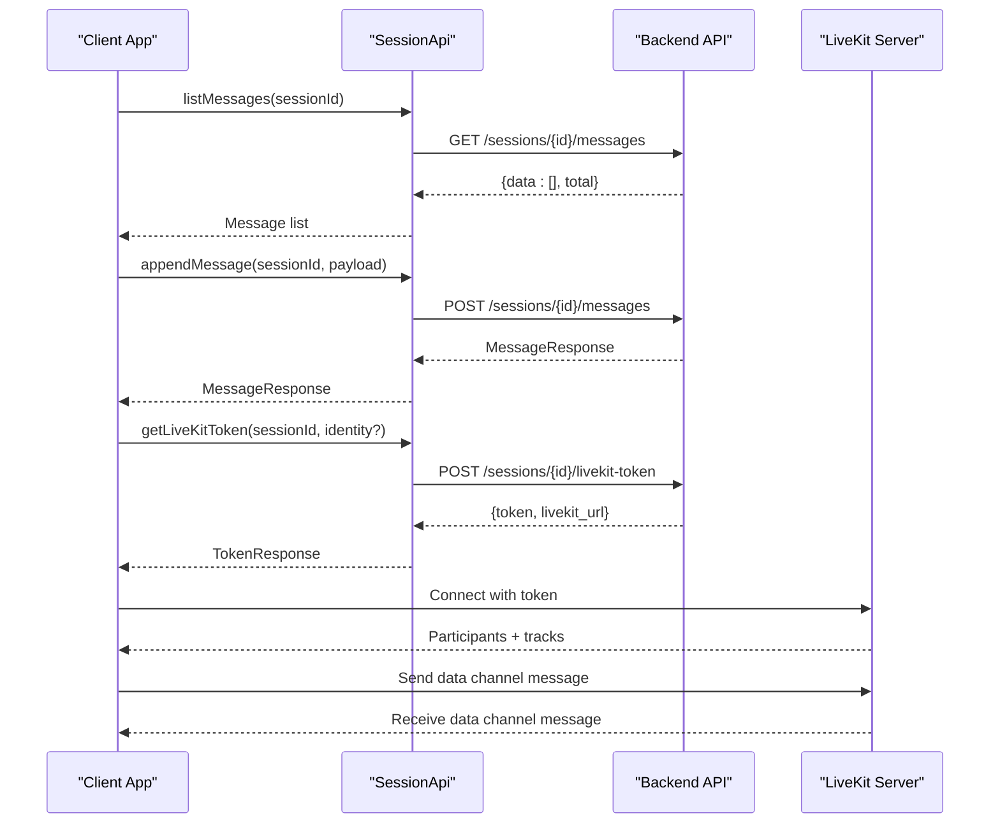
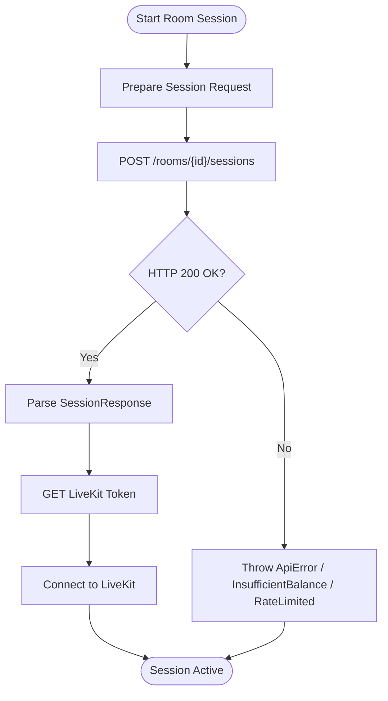
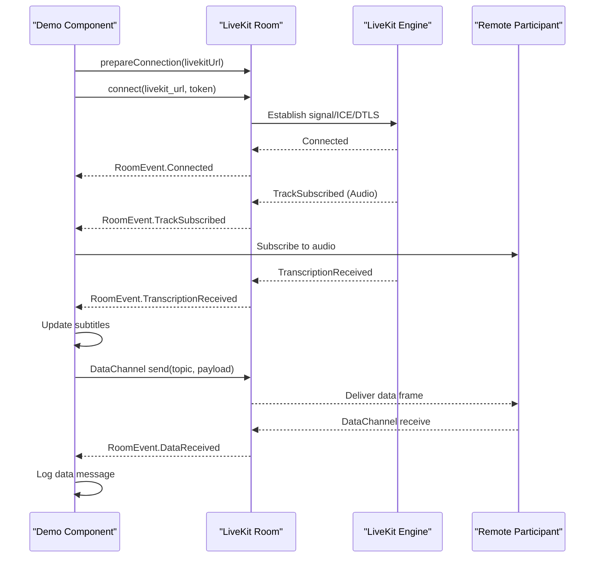
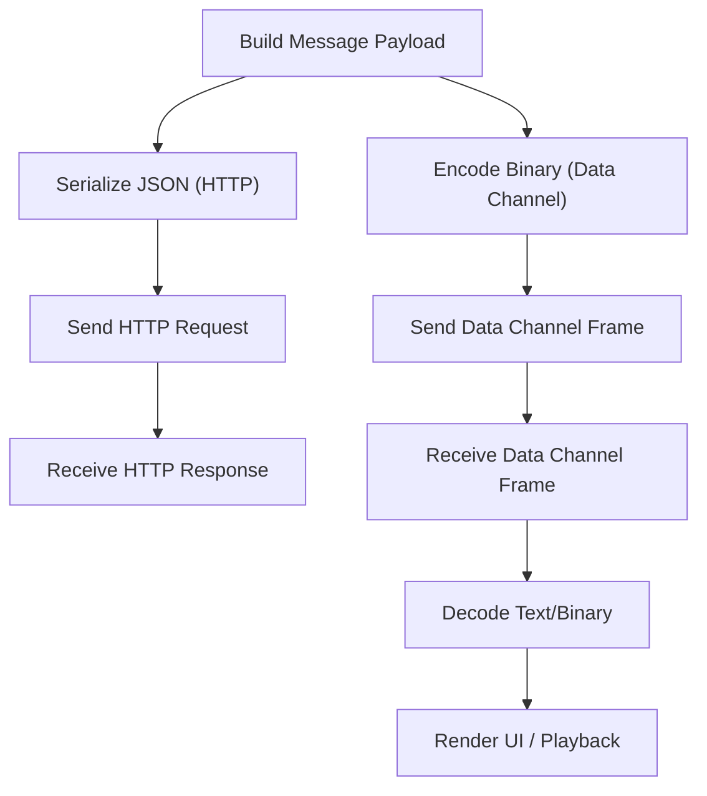
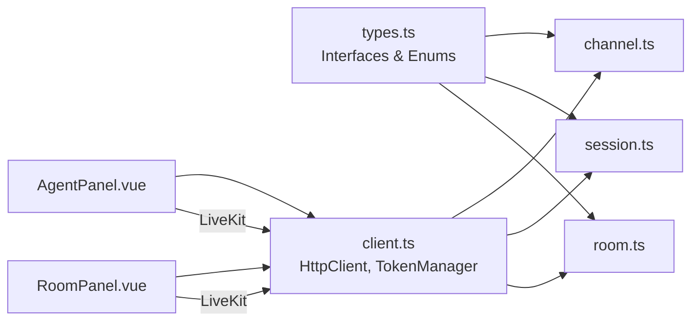

# Channel Communication

<cite>
**Referenced Files in This Document**
- [channel.ts](file://src/channel.ts)
- [client.ts](file://src/client.ts)
- [types.ts](file://src/types.ts)
- [session.ts](file://src/session.ts)
- [room.ts](file://src/room.ts)
- [AgentPanel.vue](file://demo/src/components/AgentPanel.vue)
- [RoomPanel.vue](file://demo/src/components/RoomPanel.vue)
- [audio.ts](file://demo/src/utils/audio.ts)
- [README.md](file://README.md)
</cite>

## Table of Contents
1. [Introduction](#introduction)
2. [Project Structure](#project-structure)
3. [Core Components](#core-components)
4. [Architecture Overview](#architecture-overview)
5. [Detailed Component Analysis](#detailed-component-analysis)
6. [Dependency Analysis](#dependency-analysis)
7. [Performance Considerations](#performance-considerations)
8. [Troubleshooting Guide](#troubleshooting-guide)
9. [Conclusion](#conclusion)
10. [Appendices](#appendices)

## Introduction
This document explains Channel Communication in the SDK with a focus on real-time data channels, audio streaming, and inter-participant messaging. It covers channel establishment, message routing, audio data streaming, and real-time synchronization protocols. It also documents data channel configuration, audio channel management, message serialization, error recovery mechanisms, security and encryption, bandwidth optimization, performance monitoring, latency optimization, troubleshooting connectivity issues, and integration patterns with WebSocket communication and real-time audio processing.

## Project Structure
The SDK exposes a clean separation of concerns:
- HTTP client and authentication management
- Typed APIs for channels, sessions, rooms, and agent voice sessions
- Demo components integrating LiveKit for real-time audio and data channels

**Diagram sources**
- [client.ts:93-213](file://src/client.ts#L93-L213)
- [channel.ts:4-44](file://src/channel.ts#L4-L44)
- [session.ts:4-235](file://src/session.ts#L4-L235)
- [room.ts:4-108](file://src/room.ts#L4-L108)
- [AgentPanel.vue:392-664](file://demo/src/components/AgentPanel.vue#L392-L664)
- [RoomPanel.vue:527-708](file://demo/src/components/RoomPanel.vue#L527-L708)
- [audio.ts:1-69](file://demo/src/utils/audio.ts#L1-L69)

**Section sources**
- [client.ts:93-213](file://src/client.ts#L93-L213)
- [channel.ts:4-44](file://src/channel.ts#L4-L44)
- [session.ts:4-235](file://src/session.ts#L4-L235)
- [room.ts:4-108](file://src/room.ts#L4-L108)
- [AgentPanel.vue:392-664](file://demo/src/components/AgentPanel.vue#L392-L664)
- [RoomPanel.vue:527-708](file://demo/src/components/RoomPanel.vue#L527-L708)
- [audio.ts:1-69](file://demo/src/utils/audio.ts#L1-L69)

## Core Components
- ChannelApi: Manages channel lifecycle (list, create, get, update, delete).
- SessionApi: Manages session lifecycle, participant context, messages, LiveKit token retrieval, and moderator dispatch.
- RoomApi: Manages rooms, room agents, and session creation within rooms.
- HttpClient and TokenManager: Centralized HTTP request handling, token acquisition/exchange, and automatic refresh.
- Demo components: Demonstrate LiveKit integration for voice, transcription, and data channels.

Key capabilities:
- Real-time voice sessions via LiveKit with pre-warming and parallel token acquisition.
- Inter-participant messaging via HTTP and LiveKit data channels.
- Audio streaming via LiveKit tracks and real-time transcription events.
- Robust error handling and retry logic for authentication and rate limits.

**Section sources**
- [channel.ts:4-44](file://src/channel.ts#L4-L44)
- [session.ts:4-235](file://src/session.ts#L4-L235)
- [room.ts:4-108](file://src/room.ts#L4-L108)
- [client.ts:93-213](file://src/client.ts#L93-L213)
- [AgentPanel.vue:392-664](file://demo/src/components/AgentPanel.vue#L392-L664)
- [RoomPanel.vue:527-708](file://demo/src/components/RoomPanel.vue#L527-L708)

## Architecture Overview
The system integrates HTTP APIs with LiveKit for real-time audio and data channels. Authentication is handled centrally, and WebSocket tokens are exchanged automatically for secure connections.

**Diagram sources**
- [client.ts:215-369](file://src/client.ts#L215-L369)
- [session.ts:137-160](file://src/session.ts#L137-L160)
- [AgentPanel.vue:561-618](file://demo/src/components/AgentPanel.vue#L561-L618)
- [RoomPanel.vue:635-692](file://demo/src/components/RoomPanel.vue#L635-L692)

## Detailed Component Analysis

### Channel Management
Channels are HTTP-managed resources bound to agents or rooms. The ChannelApi provides CRUD operations and soft-deletion semantics.

**Diagram sources**
- [channel.ts:4-44](file://src/channel.ts#L4-L44)
- [client.ts:133-173](file://src/client.ts#L133-L173)

Operational notes:
- Creation and updates serialize JSON bodies with explicit Content-Type headers.
- Deactivation uses DELETE to soft-remove channels.
- Responses conform to standardized data wrappers.

**Section sources**
- [channel.ts:4-44](file://src/channel.ts#L4-L44)
- [types.ts:1163-1194](file://src/types.ts#L1163-L1194)

### Session Lifecycle and Messaging
Sessions encapsulate conversations and participant context. The SessionApi manages:
- Session lifecycle (pause/resume/end)
- Participant context (upsert/delete)
- Message history (list/append)
- LiveKit token retrieval and joining
- Moderator dispatch via data channel

**Diagram sources**
- [session.ts:104-124](file://src/session.ts#L104-L124)
- [session.ts:137-160](file://src/session.ts#L137-L160)
- [RoomPanel.vue:609-621](file://demo/src/components/RoomPanel.vue#L609-L621)

**Section sources**
- [session.ts:4-235](file://src/session.ts#L4-L235)
- [RoomPanel.vue:527-708](file://demo/src/components/RoomPanel.vue#L527-L708)

### Room-Based Session Orchestration
Rooms define multi-agent environments. RoomApi supports:
- Room CRUD and agent binding
- Starting sessions within rooms
- Listing room sessions

**Diagram sources**
- [room.ts:82-99](file://src/room.ts#L82-L99)
- [session.ts:137-160](file://src/session.ts#L137-L160)

**Section sources**
- [room.ts:4-108](file://src/room.ts#L4-L108)
- [session.ts:137-160](file://src/session.ts#L137-L160)

### Real-Time Audio Streaming and Data Channels
The demo components demonstrate:
- LiveKit room preparation and connection
- Audio track subscription/publishing
- Transcription events and subtitle rendering
- Data channel message reception and logging

**Diagram sources**
- [AgentPanel.vue:392-463](file://demo/src/components/AgentPanel.vue#L392-L463)
- [RoomPanel.vue:527-621](file://demo/src/components/RoomPanel.vue#L527-L621)

**Section sources**
- [AgentPanel.vue:392-664](file://demo/src/components/AgentPanel.vue#L392-L664)
- [RoomPanel.vue:527-708](file://demo/src/components/RoomPanel.vue#L527-L708)

### Message Serialization and Data Channel Payloads
- HTTP messages are JSON-serialized with explicit Content-Type headers.
- Data channel payloads are binary frames; the demo decodes to text or logs binary sizes.
- Audio utilities provide conversion helpers for PCM/WAV and base64 encoding.

**Diagram sources**
- [session.ts:115-124](file://src/session.ts#L115-L124)
- [RoomPanel.vue:609-621](file://demo/src/components/RoomPanel.vue#L609-L621)
- [audio.ts:37-42](file://demo/src/utils/audio.ts#L37-L42)

**Section sources**
- [session.ts:104-124](file://src/session.ts#L104-L124)
- [RoomPanel.vue:609-621](file://demo/src/components/RoomPanel.vue#L609-L621)
- [audio.ts:1-69](file://demo/src/utils/audio.ts#L1-L69)

## Dependency Analysis
The SDK centralizes authentication and HTTP handling, enabling seamless integration with LiveKit for real-time features.

**Diagram sources**
- [types.ts:1163-1194](file://src/types.ts#L1163-L1194)
- [channel.ts:4-44](file://src/channel.ts#L4-L44)
- [session.ts:4-235](file://src/session.ts#L4-L235)
- [room.ts:4-108](file://src/room.ts#L4-L108)
- [client.ts:93-213](file://src/client.ts#L93-L213)
- [AgentPanel.vue:392-664](file://demo/src/components/AgentPanel.vue#L392-L664)
- [RoomPanel.vue:527-708](file://demo/src/components/RoomPanel.vue#L527-L708)

**Section sources**
- [types.ts:1163-1194](file://src/types.ts#L1163-L1194)
- [client.ts:93-213](file://src/client.ts#L93-L213)
- [channel.ts:4-44](file://src/channel.ts#L4-L44)
- [session.ts:4-235](file://src/session.ts#L4-L235)
- [room.ts:4-108](file://src/room.ts#L4-L108)
- [AgentPanel.vue:392-664](file://demo/src/components/AgentPanel.vue#L392-L664)
- [RoomPanel.vue:527-708](file://demo/src/components/RoomPanel.vue#L527-L708)

## Performance Considerations
- Pre-warming: The SDK preconnects to the LiveKit server to reduce DNS/TLS cold-start latency.
- Parallelization: Token acquisition and microphone permission are requested in parallel with room preparation.
- Adaptive streaming: LiveKit room enables adaptive stream settings to optimize bandwidth.
- Audio processing: Demo utilities convert PCM to WAV and handle base64 decoding efficiently.

Practical tips:
- Use preconnect with the known LiveKit URL to minimize connection delays.
- Warm microphone permissions early to avoid blocking during connection.
- Enable adaptive streaming for variable network conditions.
- Monitor WebRTC stats for RTT, ICE pairs, and DTLS state to diagnose connectivity.

**Section sources**
- [client.ts:380-409](file://src/client.ts#L380-L409)
- [AgentPanel.vue:477-559](file://demo/src/components/AgentPanel.vue#L477-L559)
- [RoomPanel.vue:628-664](file://demo/src/components/RoomPanel.vue#L628-L664)
- [README.md:767-777](file://README.md#L767-L777)

## Troubleshooting Guide
Common issues and resolutions:
- Authentication failures: The SDK invalidates cached tokens and retries once upon 401. Ensure credentials are valid and refresh thresholds are appropriate.
- Rate limiting: On 429, the SDK throws a rate-limited error with retry-after guidance.
- Insufficient balance: 402 triggers a dedicated error class for billing issues.
- WebSocket token exchange: For WebSocket endpoints, the SDK exchanges access tokens for session tokens automatically.

Operational checks:
- Verify LiveKit URL and preconnect configuration.
- Confirm token provider correctness and refresh callbacks.
- Inspect WebRTC stats and connection states in the demo components.

**Section sources**
- [client.ts:187-212](file://src/client.ts#L187-L212)
- [client.ts:250-363](file://src/client.ts#L250-L363)
- [AgentPanel.vue:496-543](file://demo/src/components/AgentPanel.vue#L496-L543)
- [RoomPanel.vue:534-544](file://demo/src/components/RoomPanel.vue#L534-L544)

## Conclusion
The SDK provides a cohesive foundation for building real-time voice experiences with robust HTTP and WebSocket integrations. Channels, sessions, rooms, and LiveKit data channels work together to enable scalable, secure, and performant inter-participant communication. The demo components illustrate best practices for connection pre-warming, parallel initialization, adaptive streaming, and real-time audio/data handling.

## Appendices

### Practical Examples

- Channel Setup
  - Create a channel bound to an agent or room using ChannelApi.create.
  - Update channel configuration via ChannelApi.update.
  - Soft-delete channels with ChannelApi.delete.

  **Section sources**
  - [channel.ts:11-34](file://src/channel.ts#L11-L34)
  - [types.ts:1163-1194](file://src/types.ts#L1163-L1194)

- Message Broadcasting
  - Append messages to a session using SessionApi.appendMessage.
  - List messages with pagination via SessionApi.listMessages.
  - Use LiveKit data channels for broadcast-style messaging in demos.

  **Section sources**
  - [session.ts:104-124](file://src/session.ts#L104-L124)
  - [RoomPanel.vue:609-621](file://demo/src/components/RoomPanel.vue#L609-L621)

- Audio Streaming Coordination
  - Obtain a LiveKit token via SessionApi.getLiveKitToken.
  - Connect a LiveKit room and publish/unpublish audio tracks.
  - Subscribe to remote audio tracks and render them in the UI.

  **Section sources**
  - [session.ts:137-160](file://src/session.ts#L137-L160)
  - [AgentPanel.vue:431-440](file://demo/src/components/AgentPanel.vue#L431-L440)
  - [RoomPanel.vue:564-577](file://demo/src/components/RoomPanel.vue#L564-L577)

- Participant Communication Workflows
  - Start a voice session and connect to LiveKit.
  - Listen for transcription and data channel events.
  - Toggle microphone and disconnect gracefully.

  **Section sources**
  - [AgentPanel.vue:561-618](file://demo/src/components/AgentPanel.vue#L561-L618)
  - [RoomPanel.vue:635-692](file://demo/src/components/RoomPanel.vue#L635-L692)

### Security, Encryption, and Bandwidth Optimization
- Security
  - WebSocket endpoints require short-lived session tokens (stk_).
  - Token exchange occurs automatically for access tokens and API keys.
  - Authentication modes are mutually exclusive and validated at construction.

- Encryption
  - LiveKit uses DTLS for media encryption; stats are available for inspection.
  - Pre-warming reduces exposure to handshake latency and potential interception windows.

- Bandwidth Optimization
  - Adaptive streaming reduces bitrate under constrained networks.
  - Pre-warming and parallel initialization minimize connection overhead.

**Section sources**
- [client.ts:215-369](file://src/client.ts#L215-L369)
- [AgentPanel.vue:496-543](file://demo/src/components/AgentPanel.vue#L496-L543)
- [RoomPanel.vue:527-544](file://demo/src/components/RoomPanel.vue#L527-L544)
- [README.md:117-128](file://README.md#L117-L128)