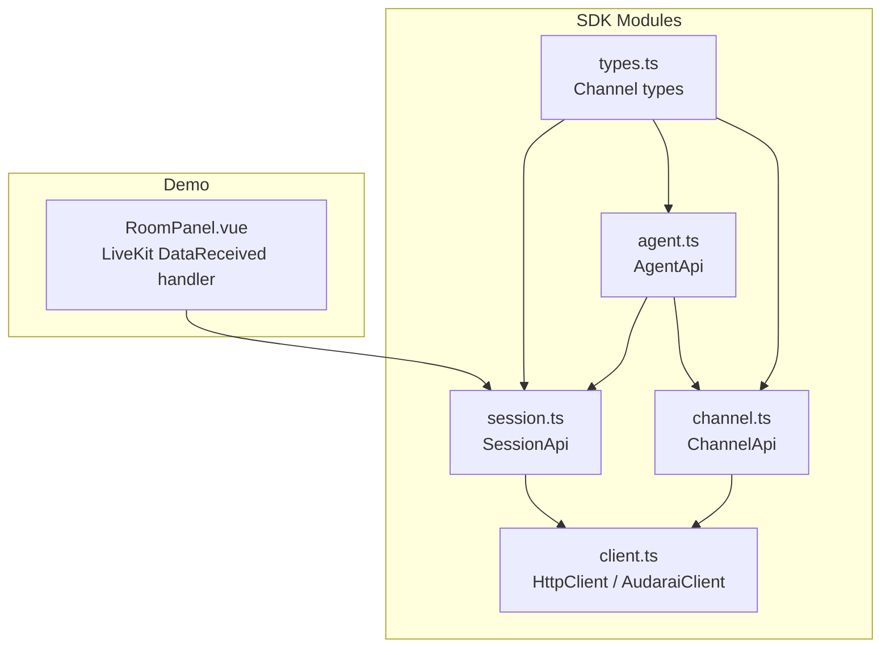
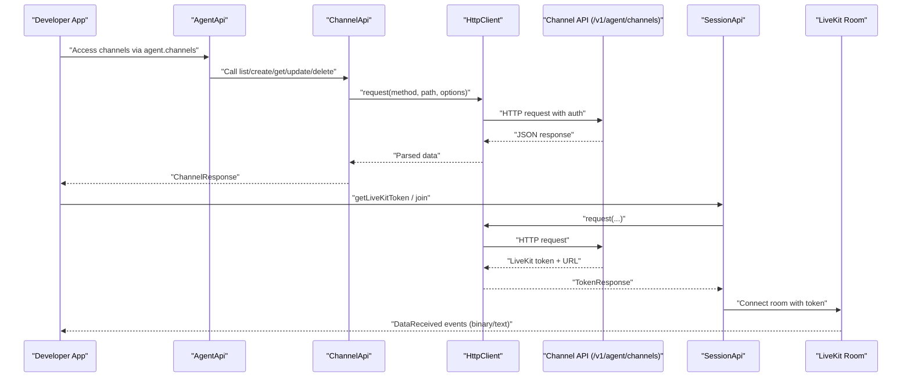
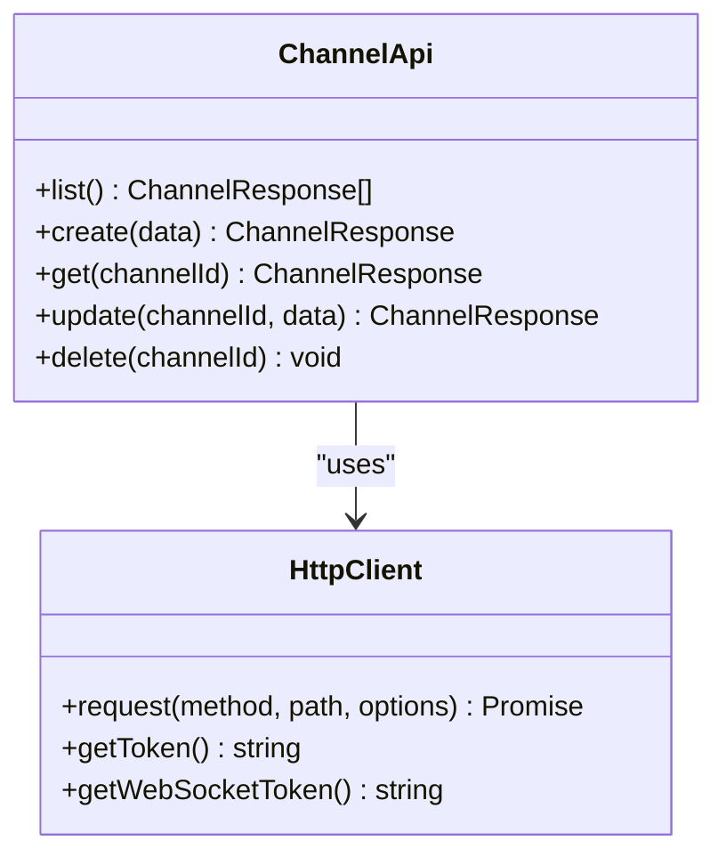
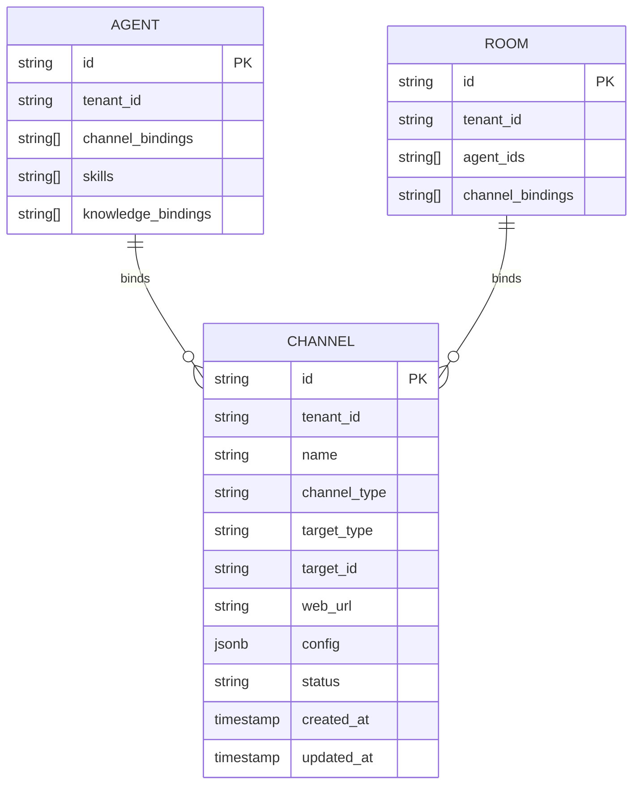
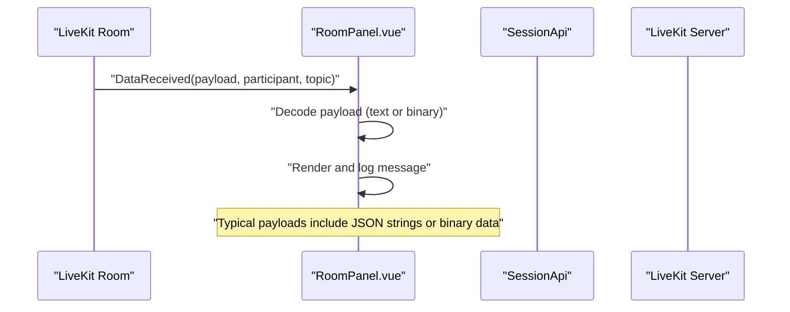
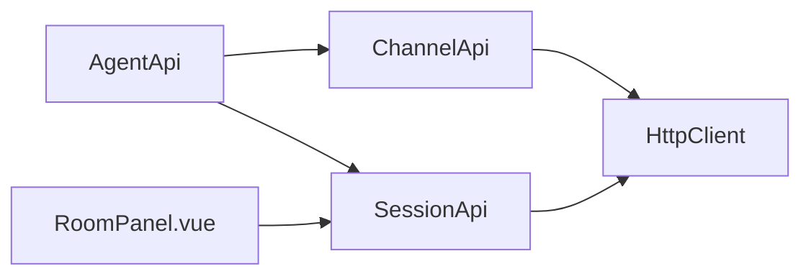

# Data Channels

<cite>
**Referenced Files in This Document**
- [channel.ts](file://src/channel.ts)
- [agent.ts](file://src/agent.ts)
- [client.ts](file://src/client.ts)
- [types.ts](file://src/types.ts)
- [session.ts](file://src/session.ts)
- [RoomPanel.vue](file://demo/src/components/RoomPanel.vue)
- [README.md](file://README.md)
</cite>

## Table of Contents
1. [Introduction](#introduction)
2. [Project Structure](#project-structure)
3. [Core Components](#core-components)
4. [Architecture Overview](#architecture-overview)
5. [Detailed Component Analysis](#detailed-component-analysis)
6. [Dependency Analysis](#dependency-analysis)
7. [Performance Considerations](#performance-considerations)
8. [Troubleshooting Guide](#troubleshooting-guide)
9. [Conclusion](#conclusion)
10. [Appendices](#appendices)

## Introduction
This document explains Data Channels in the SDK, focusing on channel lifecycle management, message routing, and inter-participant data exchange. It covers channel creation, configuration, listing, updating, and deactivation; describes the underlying HTTP API surface; and clarifies how channels integrate with LiveKit voice sessions and data channels for real-time messaging. It also documents security, access control, validation, performance, and error handling strategies.

## Project Structure
The SDK exposes a ChannelApi class for HTTP operations against the channel resource. Channels are bound to agents and can be referenced by agents and rooms. LiveKit data channels are used for real-time inter-participant messaging during voice sessions.

**Diagram sources**
- [channel.ts:1-44](file://src/channel.ts#L1-L44)
- [agent.ts:1-158](file://src/agent.ts#L1-L158)
- [client.ts:93-213](file://src/client.ts#L93-L213)
- [types.ts:1161-1194](file://src/types.ts#L1161-L1194)
- [session.ts:1-235](file://src/session.ts#L1-L235)
- [RoomPanel.vue:609-621](file://demo/src/components/RoomPanel.vue#L609-L621)

**Section sources**
- [channel.ts:1-44](file://src/channel.ts#L1-L44)
- [agent.ts:18-28](file://src/agent.ts#L18-L28)
- [client.ts:93-213](file://src/client.ts#L93-L213)
- [types.ts:1161-1194](file://src/types.ts#L1161-L1194)
- [session.ts:1-235](file://src/session.ts#L1-L235)
- [RoomPanel.vue:609-621](file://demo/src/components/RoomPanel.vue#L609-L621)

## Core Components
- ChannelApi: Provides HTTP endpoints for listing, creating, retrieving, updating, and soft-deleting channels.
- Channel types: Define the shape of channel resources and request bodies.
- AgentApi: Exposes channels via the agent namespace for convenience.
- SessionApi: Integrates with LiveKit sessions and data channels for real-time messaging.
- Demo integration: Demonstrates receiving and displaying LiveKit data channel messages.

Key responsibilities:
- Channel lifecycle: list, create, get, update, delete (soft-deactivate).
- Channel binding: agents and rooms can bind channels to influence behavior.
- Real-time messaging: LiveKit data channels carry binary or text payloads exchanged between participants.

**Section sources**
- [channel.ts:7-42](file://src/channel.ts#L7-L42)
- [types.ts:1163-1194](file://src/types.ts#L1163-L1194)
- [agent.ts:18](file://src/agent.ts#L18)
- [session.ts:137-160](file://src/session.ts#L137-L160)
- [RoomPanel.vue:609-621](file://demo/src/components/RoomPanel.vue#L609-L621)

## Architecture Overview
The channel lifecycle is managed over HTTP. During voice sessions, LiveKit data channels enable real-time inter-participant messaging. The SDK’s SessionApi retrieves LiveKit tokens and coordinates room connections. The demo listens for incoming data channel messages and logs them.

**Diagram sources**
- [agent.ts:18](file://src/agent.ts#L18)
- [channel.ts:7-42](file://src/channel.ts#L7-L42)
- [client.ts:133-173](file://src/client.ts#L133-L173)
- [session.ts:137-160](file://src/session.ts#L137-L160)
- [RoomPanel.vue:609-621](file://demo/src/components/RoomPanel.vue#L609-L621)

## Detailed Component Analysis

### ChannelApi: HTTP Operations
ChannelApi encapsulates CRUD-like operations for channels:
- list: GET /v1/agent/channels
- create: POST /v1/agent/channels with JSON body
- get: GET /v1/agent/channels/{id}
- update: PUT /v1/agent/channels/{id} with JSON body
- delete: DELETE /v1/agent/channels/{id} (soft-deactivate)

Serialization:
- Requests use application/json with JSON.stringify(body).
- Responses are parsed from JSON; non-2xx or non-zero code yields ApiError.

Security and auth:
- HttpClient applies Authorization header based on configured token provider.
- Supported modes include publishableKey, accessToken, apiKey, and appId/appSecret combinations.

Error handling:
- 401 triggers automatic token invalidation and retry if a refresh callback is provided.
- 402 maps to InsufficientBalanceError; 429 maps to RateLimitedError.

**Diagram sources**
- [channel.ts:4-42](file://src/channel.ts#L4-L42)
- [client.ts:93-213](file://src/client.ts#L93-L213)

**Section sources**
- [channel.ts:7-42](file://src/channel.ts#L7-L42)
- [client.ts:133-173](file://src/client.ts#L133-L173)
- [types.ts:1163-1194](file://src/types.ts#L1163-L1194)

### Channel Types and Binding
Channel types define:
- ChannelCreate: name, channel_type, target_type, target_id, web_url, config
- ChannelUpdate: optional fields mirroring create
- ChannelResponse: id, tenant_id, name, channel_type, target_type, target_id, web_url, config, status, timestamps

Agents and rooms can bind channels to influence orchestration and behavior. These bindings appear in agent and room configuration structures.

**Diagram sources**
- [types.ts:1163-1194](file://src/types.ts#L1163-L1194)
- [types.ts:505-532](file://src/types.ts#L505-L532)
- [types.ts:706-736](file://src/types.ts#L706-L736)

**Section sources**
- [types.ts:1163-1194](file://src/types.ts#L1163-L1194)
- [types.ts:505-532](file://src/types.ts#L505-L532)
- [types.ts:706-736](file://src/types.ts#L706-L736)

### Real-Time Messaging via LiveKit Data Channels
During voice sessions, LiveKit data channels enable inter-participant messaging. The demo subscribes to RoomEvent.DataReceived and decodes payloads as text or displays binary sizes. This demonstrates the real-time broadcast pattern used for channel-related data exchange.

**Diagram sources**
- [RoomPanel.vue:609-621](file://demo/src/components/RoomPanel.vue#L609-L621)
- [session.ts:137-160](file://src/session.ts#L137-L160)

**Section sources**
- [RoomPanel.vue:609-621](file://demo/src/components/RoomPanel.vue#L609-L621)
- [session.ts:137-160](file://src/session.ts#L137-L160)

### Practical Examples

- Channel setup
  - Create a channel with a name, type, target binding, and optional config.
  - Retrieve or list channels to verify state and bindings.

- Participant joining
  - Use SessionApi.getLiveKitToken or join to obtain a LiveKit token and connect to a room.
  - Participants exchange data channel messages in the connected room.

- Message sending/receiving
  - Send binary or text payloads over LiveKit data channels.
  - Receive and decode payloads in the RoomEvent.DataReceived handler.

- Channel state management
  - Soft-delete channels via delete to deactivate them without permanent removal.
  - Update channel configuration using update to adjust behavior.

These examples map to the documented APIs and demo handlers.

**Section sources**
- [channel.ts:11-16](file://src/channel.ts#L11-L16)
- [channel.ts:18-23](file://src/channel.ts#L18-L23)
- [channel.ts:25-34](file://src/channel.ts#L25-L34)
- [channel.ts:37-42](file://src/channel.ts#L37-L42)
- [session.ts:137-160](file://src/session.ts#L137-L160)
- [RoomPanel.vue:609-621](file://demo/src/components/RoomPanel.vue#L609-L621)

## Dependency Analysis
- AgentApi aggregates ChannelApi, exposing channels under the agent namespace.
- ChannelApi depends on HttpClient for HTTP operations and authentication.
- SessionApi integrates with LiveKit for voice sessions and data channels.
- Demo components depend on SessionApi and LiveKit room events for data channel messaging.

**Diagram sources**
- [agent.ts:18-28](file://src/agent.ts#L18-L28)
- [channel.ts:4-6](file://src/channel.ts#L4-L6)
- [session.ts:1-6](file://src/session.ts#L1-L6)
- [client.ts:93-213](file://src/client.ts#L93-L213)
- [RoomPanel.vue:609-621](file://demo/src/components/RoomPanel.vue#L609-L621)

**Section sources**
- [agent.ts:18-28](file://src/agent.ts#L18-L28)
- [channel.ts:4-6](file://src/channel.ts#L4-L6)
- [session.ts:1-6](file://src/session.ts#L1-L6)
- [client.ts:93-213](file://src/client.ts#L93-L213)
- [RoomPanel.vue:609-621](file://demo/src/components/RoomPanel.vue#L609-L621)

## Performance Considerations
- Token caching and proactive refresh: HttpClient caches tokens and proactively refreshes before expiry to minimize latency spikes.
- Preconnect optimization: AudaraiClient can pre-warm DNS/TLS for the LiveKit server to reduce connection latency.
- Binary payload handling: Decode payloads efficiently; avoid unnecessary allocations for large binary messages.
- Message queueing: Limit retained data messages to a bounded window to control memory usage.

[No sources needed since this section provides general guidance]

## Troubleshooting Guide
Common issues and resolutions:
- Authentication failures (401): The SDK retries once after invalidating cached tokens; ensure a valid token provider or refresh callback is configured.
- Rate limiting (429): Respect Retry-After header and back off before retrying.
- Insufficient balance (402): Top up account credits before retrying.
- Unexpected API errors: Inspect ApiError details for message and status code.

Operational tips:
- Verify channel bindings on agents and rooms before expecting channel-driven behavior.
- Confirm LiveKit token retrieval and room connection steps before testing data channel messaging.
- Monitor data channel message decoding; handle both text and binary payloads gracefully.

**Section sources**
- [client.ts:153-173](file://src/client.ts#L153-L173)
- [client.ts:194-197](file://src/client.ts#L194-L197)
- [client.ts:191-193](file://src/client.ts#L191-L193)
- [RoomPanel.vue:609-621](file://demo/src/components/RoomPanel.vue#L609-L621)

## Conclusion
Data Channels in this SDK are managed via a straightforward HTTP API exposed by ChannelApi, integrated under AgentApi. Channels can be bound to agents and rooms to influence orchestration. Real-time inter-participant messaging leverages LiveKit data channels during voice sessions, with the demo illustrating reception and decoding of messages. Security is enforced through robust authentication modes and automatic token refresh. Performance and reliability are supported by token caching, preconnection, and careful handling of binary payloads.

[No sources needed since this section summarizes without analyzing specific files]

## Appendices

### API Reference: Channel HTTP Endpoints
- GET /v1/agent/channels
- POST /v1/agent/channels
- GET /v1/agent/channels/{id}
- PUT /v1/agent/channels/{id}
- DELETE /v1/agent/channels/{id}

Headers:
- Authorization: Bearer <token>
- Content-Type: application/json (for create/update)

Responses:
- ChannelResponse for create/read/update
- No content for delete

**Section sources**
- [channel.ts:7-42](file://src/channel.ts#L7-L42)
- [types.ts:1182-1194](file://src/types.ts#L1182-L1194)

### Authentication Modes
Supported modes (mutually exclusive):
- Publishable key
- Access token (JWT)
- API key
- App (appId + optional appSecret)

WebSocket endpoints require session tokens; the SDK exchanges tokens automatically.

**Section sources**
- [client.ts:225-363](file://src/client.ts#L225-L363)
- [README.md:117-129](file://README.md#L117-L129)