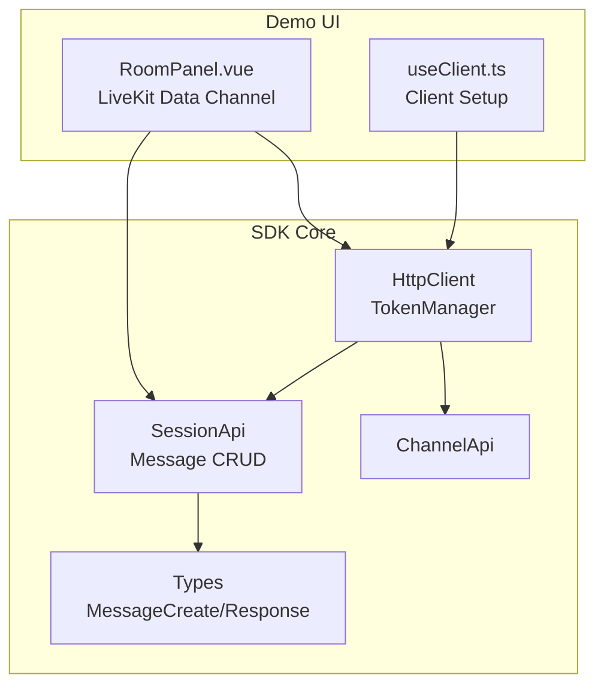
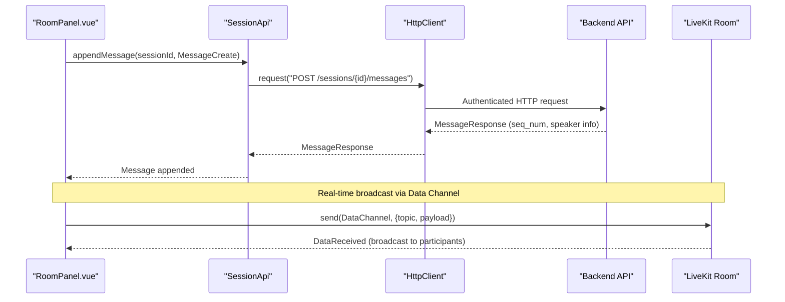
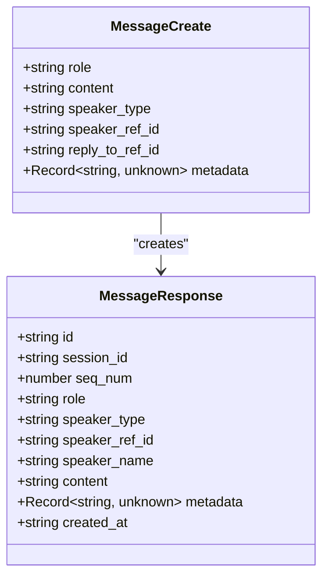
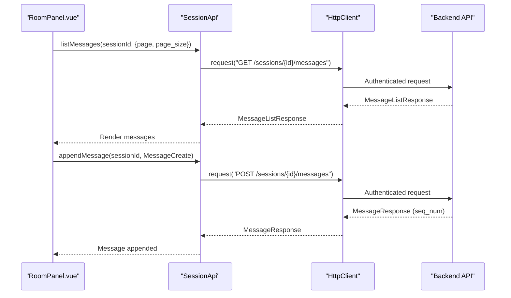
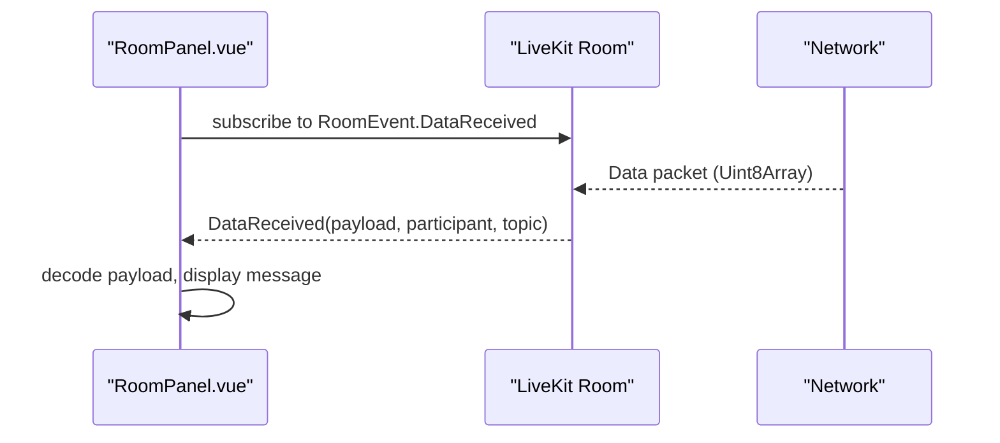
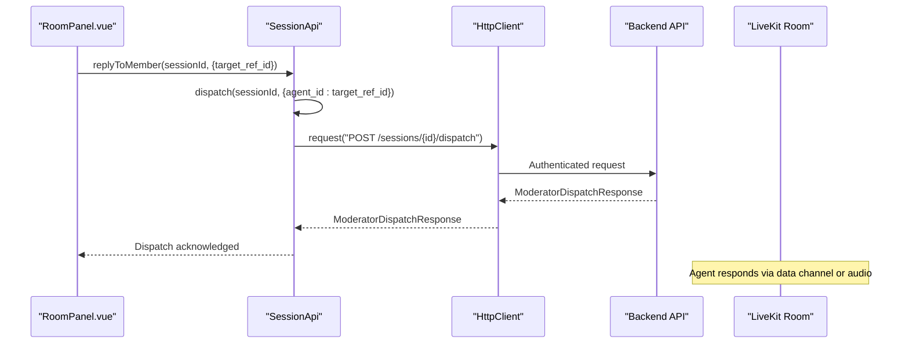
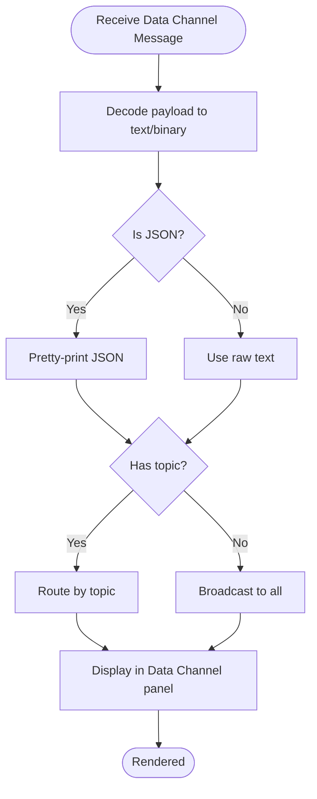
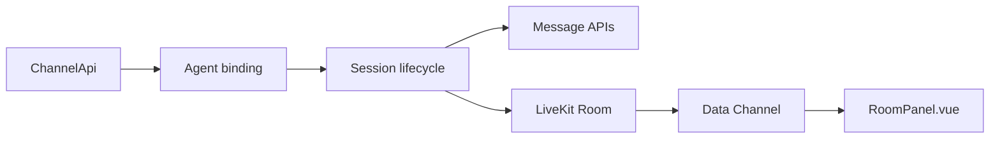
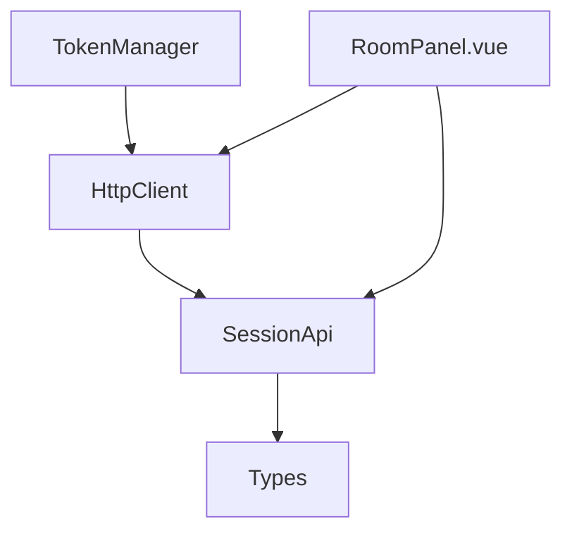

# Real-time Messaging

<cite>
**Referenced Files in This Document**
- [client.ts](file://src/client.ts)
- [session.ts](file://src/session.ts)
- [types.ts](file://src/types.ts)
- [channel.ts](file://src/channel.ts)
- [RoomPanel.vue](file://demo/src/components/RoomPanel.vue)
- [useClient.ts](file://demo/src/composables/useClient.ts)
</cite>

## Table of Contents
1. [Introduction](#introduction)
2. [Project Structure](#project-structure)
3. [Core Components](#core-components)
4. [Architecture Overview](#architecture-overview)
5. [Detailed Component Analysis](#detailed-component-analysis)
6. [Dependency Analysis](#dependency-analysis)
7. [Performance Considerations](#performance-considerations)
8. [Troubleshooting Guide](#troubleshooting-guide)
9. [Conclusion](#conclusion)

## Introduction
This document provides comprehensive documentation for Real-time Messaging within the Audarai JavaScript SDK. It covers instant message delivery, broadcast communication, and participant coordination across HTTP APIs and LiveKit data channels. The focus areas include:
- Message types and ordering (sequence numbers)
- Delivery guarantees and retries
- Message queuing and filtering
- Broadcast scope management
- Participant targeting and moderator-led dispatch
- Integration with channel management and real-time audio streaming for multi-modal coordination

## Project Structure
The real-time messaging capabilities span several modules:
- HTTP client and authentication helpers
- Session management APIs for messages and participant actions
- Types defining message schemas and participant context
- LiveKit integration for real-time audio and data channels
- Demo UI demonstrating message broadcasting and participant coordination

**Diagram sources**
- [client.ts:215-411](file://src/client.ts#L215-L411)
- [session.ts:4-235](file://src/session.ts#L4-L235)
- [types.ts:895-931](file://src/types.ts#L895-L931)
- [channel.ts:4-43](file://src/channel.ts#L4-L43)
- [RoomPanel.vue:609-621](file://demo/src/components/RoomPanel.vue#L609-L621)
- [useClient.ts:21-35](file://demo/src/composables/useClient.ts#L21-L35)

**Section sources**
- [client.ts:215-411](file://src/client.ts#L215-L411)
- [session.ts:4-235](file://src/session.ts#L4-L235)
- [types.ts:895-931](file://src/types.ts#L895-L931)
- [channel.ts:4-43](file://src/channel.ts#L4-L43)
- [RoomPanel.vue:609-621](file://demo/src/components/RoomPanel.vue#L609-L621)
- [useClient.ts:21-35](file://demo/src/composables/useClient.ts#L21-L35)

## Core Components
- HttpClient and TokenManager: Provide authenticated HTTP requests and WebSocket token acquisition, with automatic token refresh and 401 handling.
- SessionApi: Implements message CRUD, participant context, LiveKit token retrieval, and moderator-led dispatch.
- Types: Define MessageCreate, MessageResponse, and related schemas including sequence numbers and speaker metadata.
- LiveKit Data Channel: Real-time broadcast and targeted messaging via RoomEvent.DataReceived.

Key capabilities:
- Append messages to a session with role and speaker metadata
- List messages with pagination
- Moderator-led dispatch to trigger a specific agent reply
- LiveKit participant identity and display name for message attribution
- Data channel topic-based routing for broadcast and targeted messages

**Section sources**
- [client.ts:93-213](file://src/client.ts#L93-L213)
- [session.ts:102-192](file://src/session.ts#L102-L192)
- [types.ts:895-931](file://src/types.ts#L895-L931)
- [RoomPanel.vue:609-621](file://demo/src/components/RoomPanel.vue#L609-L621)

## Architecture Overview
The real-time messaging architecture combines HTTP-based message storage with LiveKit’s data channel for instant broadcast communication.

**Diagram sources**
- [session.ts:115-124](file://src/session.ts#L115-L124)
- [client.ts:133-173](file://src/client.ts#L133-L173)
- [RoomPanel.vue:609-621](file://demo/src/components/RoomPanel.vue#L609-L621)

## Detailed Component Analysis

### Message Types and Ordering
- MessageCreate: role, content, speaker_type, speaker_ref_id, reply_to_ref_id, metadata
- MessageResponse: id, session_id, seq_num, role, speaker_type, speaker_ref_id, speaker_name, content, metadata, created_at
- Ordering: seq_num indicates insertion order within a session, enabling clients to render messages chronologically.

**Diagram sources**
- [types.ts:897-905](file://src/types.ts#L897-L905)
- [types.ts:913-924](file://src/types.ts#L913-L924)

**Section sources**
- [types.ts:895-931](file://src/types.ts#L895-L931)

### HTTP Message Delivery and Guarantees
- Append message: POST /v1/agent/sessions/{sessionId}/messages
- List messages: GET /v1/agent/sessions/{sessionId}/messages with pagination
- Delivery guarantees:
  - HTTP responses indicate success or error; no explicit server-side ack is modeled in the SDK types.
  - Retry behavior is handled by the underlying HTTP client on 401 with token refresh.
  - Ordering is preserved server-side via seq_num.

**Diagram sources**
- [session.ts:104-124](file://src/session.ts#L104-L124)
- [client.ts:133-173](file://src/client.ts#L133-L173)

**Section sources**
- [session.ts:102-124](file://src/session.ts#L102-L124)
- [client.ts:133-173](file://src/client.ts#L133-L173)

### Real-time Broadcasting via LiveKit Data Channels
- LiveKit Room emits RoomEvent.DataReceived for incoming data channel messages.
- Demo UI decodes payloads and displays them with sender identity and optional topic.
- Broadcast scope is managed by topics; participants can filter by topic to receive only relevant broadcasts.

**Diagram sources**
- [RoomPanel.vue:609-621](file://demo/src/components/RoomPanel.vue#L609-L621)

**Section sources**
- [RoomPanel.vue:609-621](file://demo/src/components/RoomPanel.vue#L609-L621)

### Participant Coordination and Moderator-led Dispatch
- Participants: type, ref_id, slot, context_ref_id, context (including role, display_name, turn_order, is_active).
- Moderator dispatch: POST /v1/agent/sessions/{sessionId}/dispatch to trigger a specific agent reply.
- Reply to member: convenience wrapper around dispatch using target_ref_id.

**Diagram sources**
- [session.ts:189-192](file://src/session.ts#L189-L192)
- [session.ts:173-179](file://src/session.ts#L173-L179)
- [client.ts:133-173](file://src/client.ts#L133-L173)

**Section sources**
- [session.ts:173-192](file://src/session.ts#L173-L192)
- [types.ts:823-835](file://src/types.ts#L823-L835)

### Message Filtering and Targeting
- Message filtering: listMessages supports pagination; UI can filter by role or speaker_type locally.
- Targeted messaging: LiveKit data channel supports topic-based routing; UI displays topic alongside payload.
- Participant targeting: replyToMember targets a specific agent by ref_id.

**Diagram sources**
- [RoomPanel.vue:609-621](file://demo/src/components/RoomPanel.vue#L609-L621)

**Section sources**
- [RoomPanel.vue:609-621](file://demo/src/components/RoomPanel.vue#L609-L621)

### Message Durability, Retry Mechanisms, and Offline Handling
- Durability: Messages are persisted server-side and retrievable via listMessages; seq_num ensures ordering.
- Retry: HttpClient handles 401 by refreshing tokens (either via onTokenRefresh or internal provider) and retrying the request.
- Offline handling: Not explicitly modeled in message APIs; LiveKit data channel messages are real-time and not persisted by the SDK.

**Section sources**
- [client.ts:153-170](file://src/client.ts#L153-L170)
- [session.ts:104-124](file://src/session.ts#L104-L124)

### Integration Patterns with Channel Management and Audio Streaming
- Channel management: ChannelApi provides CRUD for channels bound to agents; channels can be used to configure external integrations that may emit or consume messages.
- Audio streaming: RoomPanel integrates LiveKit for voice chat; audio tracks and transcription events complement message-based coordination.

**Diagram sources**
- [channel.ts:4-43](file://src/channel.ts#L4-L43)
- [session.ts:137-160](file://src/session.ts#L137-L160)
- [RoomPanel.vue:609-621](file://demo/src/components/RoomPanel.vue#L609-L621)

**Section sources**
- [channel.ts:4-43](file://src/channel.ts#L4-L43)
- [session.ts:137-160](file://src/session.ts#L137-L160)
- [RoomPanel.vue:609-621](file://demo/src/components/RoomPanel.vue#L609-L621)

## Dependency Analysis
- SessionApi depends on HttpClient for authenticated HTTP calls.
- RoomPanel.vue consumes SessionApi and LiveKit Room events for real-time updates.
- TokenManager and HttpClient manage authentication and token refresh for both HTTP and WebSocket tokens.

**Diagram sources**
- [client.ts:22-91](file://src/client.ts#L22-L91)
- [client.ts:93-213](file://src/client.ts#L93-L213)
- [session.ts:4-235](file://src/session.ts#L4-L235)
- [RoomPanel.vue:609-621](file://demo/src/components/RoomPanel.vue#L609-L621)

**Section sources**
- [client.ts:22-91](file://src/client.ts#L22-L91)
- [client.ts:93-213](file://src/client.ts#L93-L213)
- [session.ts:4-235](file://src/session.ts#L4-L235)
- [RoomPanel.vue:609-621](file://demo/src/components/RoomPanel.vue#L609-L621)

## Performance Considerations
- Preconnect optimization: AudaraiClient.preconnect reduces DNS/TLS latency for LiveKit servers.
- Token refresh: Proactive refresh avoids near-expiry 401 errors; adjust refreshThresholdSeconds as needed.
- Data channel throughput: Large payloads should be chunked; topics help reduce unnecessary processing.
- Pagination: Use page/page_size for listMessages to limit payload sizes.

[No sources needed since this section provides general guidance]

## Troubleshooting Guide
Common issues and resolutions:
- Authentication failures (401): HttpClient automatically refreshes tokens; ensure onTokenRefresh is configured for static access tokens.
- Token exhaustion: Verify token provider correctness and refresh thresholds.
- Data channel decoding: Ensure payloads are properly decoded; UI attempts JSON parsing and falls back to raw text.
- Dispatch not triggering: Confirm session is running and talking_style is "moderator-led".

**Section sources**
- [client.ts:153-170](file://src/client.ts#L153-L170)
- [RoomPanel.vue:609-621](file://demo/src/components/RoomPanel.vue#L609-L621)
- [session.ts:173-192](file://src/session.ts#L173-L192)

## Conclusion
The Audarai SDK provides a robust foundation for real-time messaging:
- HTTP-backed message persistence with ordering guarantees
- LiveKit data channels for instant broadcast and targeted communication
- Participant context and moderator-led dispatch for coordinated multi-modal experiences
- Clear separation of concerns between message storage and real-time transport

By combining these capabilities, applications can implement sophisticated coordination scenarios involving text, audio, and structured data across diverse participant roles.