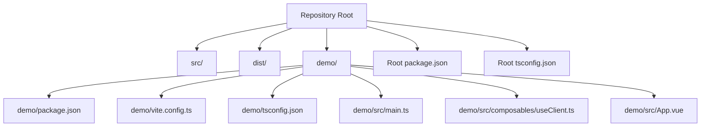
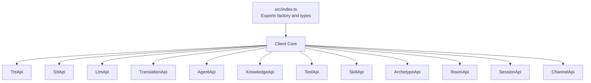
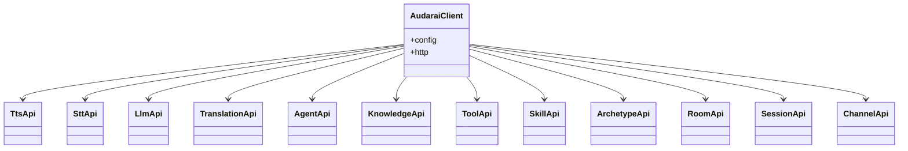
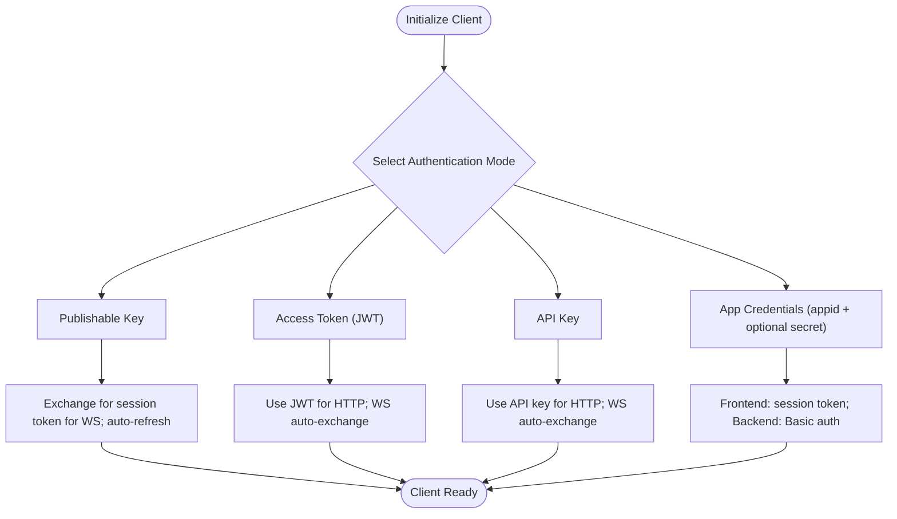
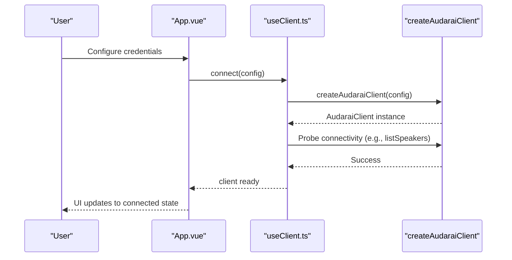
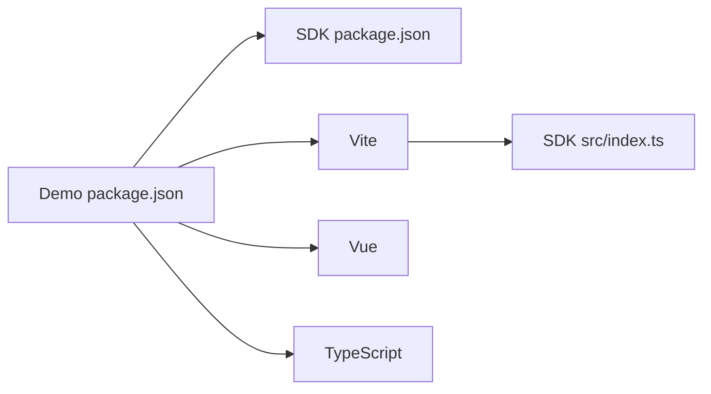

# Contributing

<cite>
**Referenced Files in This Document**
- [package.json](file://package.json)
- [tsconfig.json](file://tsconfig.json)
- [src/index.ts](file://src/index.ts)
- [src/types.ts](file://src/types.ts)
- [demo/package.json](file://demo/package.json)
- [demo/vite.config.ts](file://demo/vite.config.ts)
- [demo/tsconfig.json](file://demo/tsconfig.json)
- [demo/src/main.ts](file://demo/src/main.ts)
- [demo/src/composables/useClient.ts](file://demo/src/composables/useClient.ts)
- [demo/src/App.vue](file://demo/src/App.vue)
- [README.md](file://README.md)
</cite>

## Table of Contents
1. [Introduction](#introduction)
2. [Project Structure](#project-structure)
3. [Core Components](#core-components)
4. [Architecture Overview](#architecture-overview)
5. [Detailed Component Analysis](#detailed-component-analysis)
6. [Dependency Analysis](#dependency-analysis)
7. [Performance Considerations](#performance-considerations)
8. [Troubleshooting Guide](#troubleshooting-guide)
9. [Contribution Workflow](#contribution-workflow)
10. [Release and Maintenance](#release-and-maintenance)
11. [Conclusion](#conclusion)

## Introduction
This guide explains how to set up a development environment, build the AudarAI SDK, run the demo application, and contribute effectively. It covers the build system, coding standards, testing approaches, and the contribution workflow. It also outlines the release process, versioning strategy, and maintenance procedures.

## Project Structure
The repository is organized into:
- Root SDK package: TypeScript sources under src/, build outputs to dist/, and a single entry point exporting APIs and types.
- Demo application: A Vue-based interactive playground under demo/ that exercises the SDK locally.

**Diagram sources**
- [package.json](file://package.json)
- [tsconfig.json](file://tsconfig.json)
- [demo/package.json](file://demo/package.json)
- [demo/vite.config.ts](file://demo/vite.config.ts)
- [demo/tsconfig.json](file://demo/tsconfig.json)
- [demo/src/main.ts](file://demo/src/main.ts)
- [demo/src/composables/useClient.ts](file://demo/src/composables/useClient.ts)
- [demo/src/App.vue](file://demo/src/App.vue)

**Section sources**
- [package.json](file://package.json)
- [tsconfig.json](file://tsconfig.json)
- [demo/package.json](file://demo/package.json)
- [demo/vite.config.ts](file://demo/vite.config.ts)
- [demo/tsconfig.json](file://demo/tsconfig.json)
- [demo/src/main.ts](file://demo/src/main.ts)
- [demo/src/composables/useClient.ts](file://demo/src/composables/useClient.ts)
- [demo/src/App.vue](file://demo/src/App.vue)

## Core Components
- SDK entry and exports: The SDK exposes a factory function and API modules via a single export file. Consumers import the factory to obtain a typed client with all feature modules attached.
- Types and configuration: The SDK defines a central configuration interface and numerous request/response types for all feature areas (TTS, STT, Translation, Agent, Knowledge, Tools, Skills, Archetypes, Rooms, Sessions, Channels).

Key responsibilities:
- Factory and module wiring: Creates the client and attaches feature modules (TTS, STT, Translation, Agent, Knowledge, Tools, Skills, Archetypes, Rooms, Sessions, Channels).
- Type safety: Centralized type definitions ensure strong typing across the SDK surface.

**Section sources**
- [src/index.ts](file://src/index.ts)
- [src/types.ts](file://src/types.ts)

## Architecture Overview
The SDK follows a modular architecture:
- Single entry point exports the factory and types.
- Feature modules encapsulate API-specific logic and are attached to the client instance.
- The demo app consumes the SDK to demonstrate end-to-end usage.

**Diagram sources**
- [src/index.ts](file://src/index.ts)

## Detailed Component Analysis

### Build System and Scripts
- Build command: Compiles TypeScript sources to CommonJS and ES modules, generates declaration files, and cleans previous outputs.
- Dev watch mode: Same as build but watches for changes.
- Prepare hook: Runs the build script during package preparation.

Build configuration:
- Compiler options target modern environments and emit declarations.
- Root tsconfig includes only the src folder.

**Section sources**
- [package.json](file://package.json)
- [tsconfig.json](file://tsconfig.json)

### Demo Application Setup and Development
The demo app enables rapid iteration against the SDK:
- Local development: Resolves @audarai/sdk to the SDK’s TypeScript source during development, enabling hot module replacement without rebuilding the SDK.
- Build and preview: Uses Vite with Vue and TypeScript compilation.

Development flow:
- Run the demo dev server to test changes in real-time.
- The demo depends on the SDK via a local file dependency and Vue ecosystem.

**Section sources**
- [demo/package.json](file://demo/package.json)
- [demo/vite.config.ts](file://demo/vite.config.ts)
- [demo/tsconfig.json](file://demo/tsconfig.json)
- [demo/src/main.ts](file://demo/src/main.ts)

### Client and Feature Modules Composition
The SDK composes a typed client by attaching feature modules to the core client instance. This pattern centralizes configuration and exposes a cohesive API surface.

**Diagram sources**
- [src/index.ts](file://src/index.ts)

**Section sources**
- [src/index.ts](file://src/index.ts)

### Authentication Modes and Configuration
The SDK supports multiple authentication modes. The configuration interface defines fields for publishable keys, access tokens, API keys, and app credentials, along with optional token refresh hooks and custom fetch implementations.

**Diagram sources**
- [src/types.ts](file://src/types.ts)

**Section sources**
- [src/types.ts](file://src/types.ts)

### Demo Client Composables and Usage
The demo composable manages a singleton client instance, connects to the SDK, and exposes connection state. It demonstrates how to probe connectivity and share the client across components.

**Diagram sources**
- [demo/src/App.vue](file://demo/src/App.vue)
- [demo/src/composables/useClient.ts](file://demo/src/composables/useClient.ts)
- [src/index.ts](file://src/index.ts)

**Section sources**
- [demo/src/App.vue](file://demo/src/App.vue)
- [demo/src/composables/useClient.ts](file://demo/src/composables/useClient.ts)
- [src/index.ts](file://src/index.ts)

## Dependency Analysis
- SDK package dependencies: TypeScript compiler and bundler for builds.
- Demo dependencies: Vue, Vite, TypeScript tooling, and the SDK installed from the local path.
- Resolution strategy: The demo aliases @audarai/sdk to the SDK source during development to enable fast iteration.

**Diagram sources**
- [package.json](file://package.json)
- [demo/package.json](file://demo/package.json)
- [demo/vite.config.ts](file://demo/vite.config.ts)
- [src/index.ts](file://src/index.ts)

**Section sources**
- [package.json](file://package.json)
- [demo/package.json](file://demo/package.json)
- [demo/vite.config.ts](file://demo/vite.config.ts)
- [src/index.ts](file://src/index.ts)

## Performance Considerations
- Build targets modern environments to minimize polyfills and bundle sizes.
- Streaming APIs (SSE and WebSocket) enable low-latency processing for real-time audio tasks.
- Token auto-refresh reduces connection interruptions by refreshing session tokens before expiration.

[No sources needed since this section provides general guidance]

## Troubleshooting Guide
Common issues and resolutions:
- Build failures: Verify TypeScript and bundler versions match the project configuration.
- Missing types or declaration files: Ensure the build runs with declaration generation enabled.
- Demo not reflecting SDK changes: Confirm the Vite alias resolves to the SDK source and that the dev server is running.
- Authentication errors: Validate the chosen authentication mode and ensure credentials are correct and permitted for the environment.

**Section sources**
- [package.json](file://package.json)
- [tsconfig.json](file://tsconfig.json)
- [demo/vite.config.ts](file://demo/vite.config.ts)
- [src/types.ts](file://src/types.ts)

## Contribution Workflow
Local development steps:
1. Install dependencies in the root and demo:
   - Use your preferred package manager to install root dependencies.
   - Install demo dependencies separately.
2. Start the demo in development mode:
   - Run the demo dev server to launch the interactive UI.
   - The demo resolves @audarai/sdk to the SDK source for instant feedback.
3. Iterate on the SDK:
   - Edit files under src/.
   - The demo reflects changes instantly due to the Vite alias and watch mode.
4. Build the SDK:
   - Run the build script to compile to dist/ and generate type declarations.
5. Validate changes:
   - Use the demo to exercise new or modified functionality.
   - Confirm TypeScript compatibility and runtime behavior.

Testing procedures:
- Manual testing: Exercise all major features in the demo app.
- Type checking: Ensure TypeScript compilation succeeds with strict settings.
- No automated test suite exists in this repository; contributions should include thorough manual verification in the demo.

Pull request guidelines:
- Keep changes focused and minimal.
- Update documentation and examples as needed.
- Ensure the build passes and the demo remains functional.
- Reference related issues and provide clear descriptions of changes.

**Section sources**
- [package.json](file://package.json)
- [demo/package.json](file://demo/package.json)
- [demo/vite.config.ts](file://demo/vite.config.ts)
- [demo/src/main.ts](file://demo/src/main.ts)
- [demo/src/App.vue](file://demo/src/App.vue)

## Release and Maintenance
Versioning strategy:
- Version is maintained in the root package manifest. Increment according to semantic versioning principles when introducing breaking changes, new features, or bug fixes.

Release process:
- Update the version field in the root package manifest.
- Build the SDK to produce dist/ artifacts.
- Publish the package to the desired registry following your team’s publishing policy.

Maintenance procedures:
- Monitor authentication and endpoint changes in the upstream service.
- Update SDK types and examples accordingly.
- Keep build dependencies current while preserving compatibility.

**Section sources**
- [package.json](file://package.json)

## Conclusion
You now have the essentials to develop, build, and contribute to the AudarAI SDK. Use the demo for rapid iteration, rely on the build scripts for consistent distribution, and follow the contribution workflow to propose changes. For releases, update the version and rebuild before publishing.