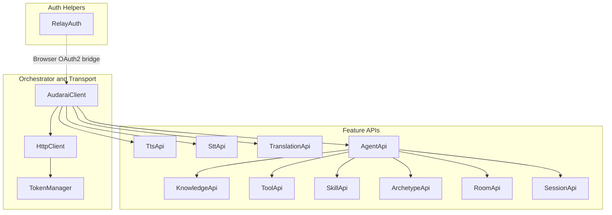
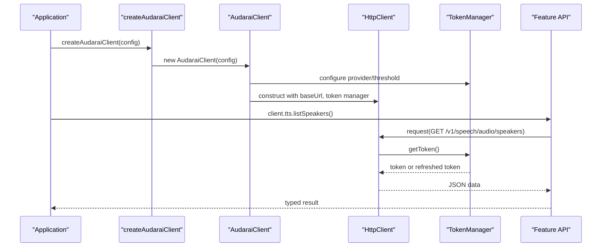
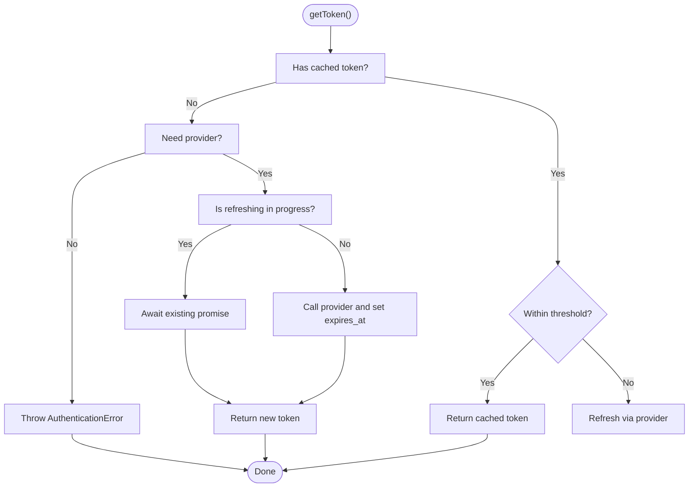
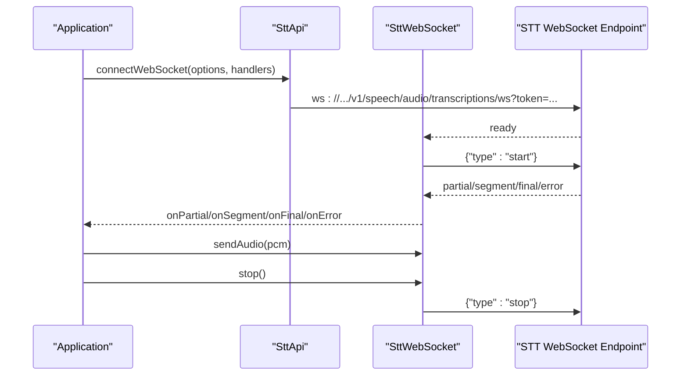
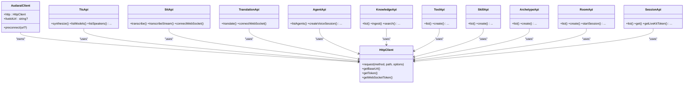
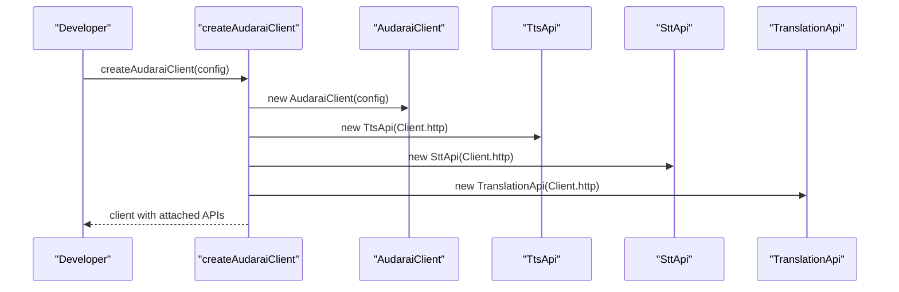
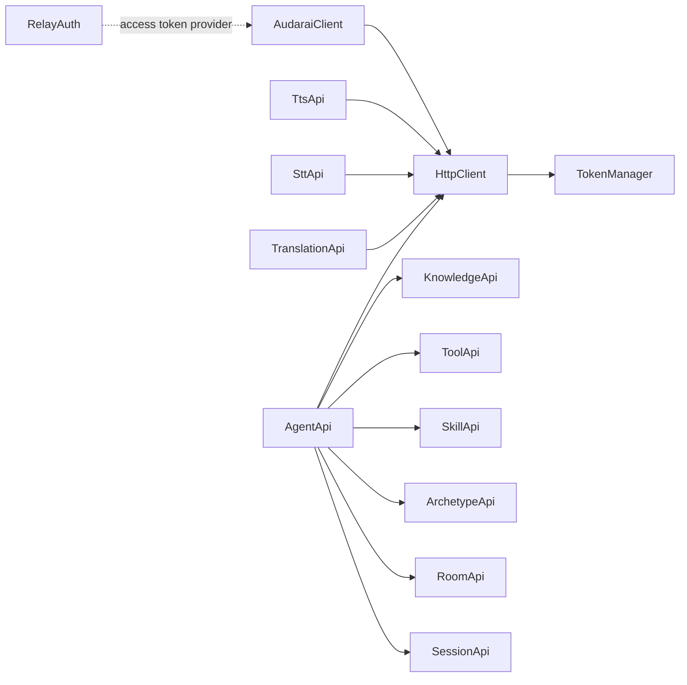

# Core Concepts

<cite>
**Referenced Files in This Document**
- [index.ts](file://src/index.ts)
- [client.ts](file://src/client.ts)
- [auth.ts](file://src/auth.ts)
- [types.ts](file://src/types.ts)
- [errors.ts](file://src/errors.ts)
- [tts.ts](file://src/tts.ts)
- [stt.ts](file://src/stt.ts)
- [translation.ts](file://src/translation.ts)
- [agent.ts](file://src/agent.ts)
- [knowledge.ts](file://src/knowledge.ts)
- [tool.ts](file://src/tool.ts)
- [skill.ts](file://src/skill.ts)
- [archetype.ts](file://src/archetype.ts)
- [room.ts](file://src/room.ts)
- [session.ts](file://src/session.ts)
- [useClient.ts](file://demo/src/composables/useClient.ts)
</cite>

## Table of Contents
1. [Introduction](#introduction)
2. [Project Structure](#project-structure)
3. [Core Components](#core-components)
4. [Architecture Overview](#architecture-overview)
5. [Detailed Component Analysis](#detailed-component-analysis)
6. [Dependency Analysis](#dependency-analysis)
7. [Performance Considerations](#performance-considerations)
8. [Troubleshooting Guide](#troubleshooting-guide)
9. [Conclusion](#conclusion)

## Introduction
This document explains the AudarAI SDK’s core architecture and design principles. It focuses on the central AudaraiClient orchestrator pattern, authentication modes, real-time WebSocket communication, and a modular API surface. It also documents the relationship between HTTP REST APIs and WebSocket APIs, the type system design, error handling patterns, the factory pattern implementation, token management strategies, authentication refresh mechanisms, and environment-specific configurations for browsers and Node.js.

## Project Structure
The SDK is organized around a small set of cohesive modules:
- Orchestrator and transport: AudaraiClient, HttpClient, TokenManager
- Authentication helpers: RelayAuth for browser OAuth2 flows
- Feature APIs: TTS, STT, Translation, Agent, Knowledge, Tool, Skill, Archetype, Room, Session
- Type definitions and error types
- Export facade and convenience factory

**Diagram sources**
- [client.ts:215-410](file://src/client.ts#L215-L410)
- [index.ts:1-193](file://src/index.ts#L1-L193)
- [auth.ts:102-272](file://src/auth.ts#L102-L272)

**Section sources**
- [index.ts:1-193](file://src/index.ts#L1-L193)
- [client.ts:215-410](file://src/client.ts#L215-L410)

## Core Components
- AudaraiClient: Central orchestrator that configures authentication, builds HTTP and WebSocket transports, and exposes typed feature APIs. It enforces exactly one authentication mode and supports publishable key, access token, API key, and app credentials.
- HttpClient: Encapsulates HTTP transport, URL building, request/response handling, and automatic 401 handling with token refresh.
- TokenManager: Manages token acquisition, caching, expiration thresholds, and refresh concurrency. Supports both static tokens and dynamic providers.
- RelayAuth: Browser-side OAuth2 relay client for Keycloak JWT flows, with storage abstraction, refresh logic, and profile decoding.
- Feature APIs: Modular classes per domain (TTS, STT, Translation, Agent, Knowledge, Tool, Skill, Archetype, Room, Session), each delegating to HttpClient.

Key design goals:
- Single responsibility per module
- Clear separation between HTTP and WebSocket protocols
- Strong typing for request/response payloads and WebSocket message types
- Environment-aware token encoding and fetch polyfills

**Section sources**
- [client.ts:22-91](file://src/client.ts#L22-L91)
- [client.ts:93-213](file://src/client.ts#L93-L213)
- [client.ts:215-410](file://src/client.ts#L215-L410)
- [auth.ts:102-272](file://src/auth.ts#L102-L272)
- [types.ts:1-1265](file://src/types.ts#L1-L1265)

## Architecture Overview
The SDK follows an orchestrator pattern centered on AudaraiClient. It configures authentication modes, provisions token managers, and constructs HttpClient instances. Feature APIs receive an HttpClient and issue REST calls. WebSocket APIs derive URLs from the HTTP base URL and use session tokens for transport-layer authentication.

**Diagram sources**
- [index.ts:142-193](file://src/index.ts#L142-L193)
- [client.ts:215-410](file://src/client.ts#L215-L410)
- [tts.ts:68-94](file://src/tts.ts#L68-L94)

## Detailed Component Analysis

### Authentication Modes and Token Management
Supported modes:
- Publishable key: All HTTP and WebSocket requests use short-lived session tokens minted from the publishable key.
- Access token (SSO/OAuth2): HTTP uses JWT directly; WebSocket exchanges for a session token.
- API key: HTTP uses the key directly; WebSocket exchanges for a session token.
- App credentials: appId with optional appSecret. Backend uses Basic auth; frontend uses appid to mint session tokens.

Token refresh and concurrency:
- TokenManager caches tokens and proactively refreshes near expiry (threshold configurable).
- Mutual exclusion prevents concurrent refreshes.
- On 401, HttpClient retries once with refreshed token or invalidates cache and re-fetches.

**Diagram sources**
- [client.ts:22-91](file://src/client.ts#L22-L91)

**Section sources**
- [client.ts:225-363](file://src/client.ts#L225-L363)
- [client.ts:121-173](file://src/client.ts#L121-L173)
- [types.ts:7-63](file://src/types.ts#L7-L63)

### Real-Time WebSocket Communication
Two WebSocket pipelines are supported:
- STT WebSocket: Real-time speech-to-text with typed messages (ready, partial, segment, final, error).
- Translation WebSocket: End-to-end pipeline (STT → Translation → TTS) with typed messages and audio chunk decoding.

Both APIs:
- Derive ws:// from http:// base URL and attach a session token query parameter.
- Provide typed wrappers that parse incoming JSON and route to user handlers.
- Support sending PCM buffers and signaling stop.

**Diagram sources**
- [stt.ts:198-216](file://src/stt.ts#L198-L216)
- [stt.ts:21-81](file://src/stt.ts#L21-L81)

**Section sources**
- [stt.ts:1-217](file://src/stt.ts#L1-L217)
- [translation.ts:258-276](file://src/translation.ts#L258-L276)

### Modular API Architecture
Each feature area is a separate class exposing domain-specific methods. They share a common HttpClient and delegate all network operations to it. This keeps concerns separated and simplifies testing and extension.

**Diagram sources**
- [client.ts:93-213](file://src/client.ts#L93-L213)
- [tts.ts:11-231](file://src/tts.ts#L11-L231)
- [stt.ts:83-217](file://src/stt.ts#L83-L217)
- [translation.ts:111-277](file://src/translation.ts#L111-L277)
- [agent.ts:11-158](file://src/agent.ts#L11-L158)
- [knowledge.ts:12-137](file://src/knowledge.ts#L12-L137)
- [tool.ts:4-37](file://src/tool.ts#L4-L37)
- [skill.ts:4-33](file://src/skill.ts#L4-L33)
- [archetype.ts:4-33](file://src/archetype.ts#L4-L33)
- [room.ts:4-108](file://src/room.ts#L4-L108)
- [session.ts:4-235](file://src/session.ts#L4-L235)

**Section sources**
- [index.ts:1-193](file://src/index.ts#L1-L193)
- [agent.ts:11-28](file://src/agent.ts#L11-L28)

### Factory Pattern and Client Construction
The convenience factory creates an AudaraiClient and attaches feature APIs to it. This provides a single entry point for consumers while preserving modularity.

**Diagram sources**
- [index.ts:142-193](file://src/index.ts#L142-L193)

**Section sources**
- [index.ts:142-193](file://src/index.ts#L142-L193)

### Browser vs Node.js Compatibility
- Base64 encoding: The SDK detects btoa in browsers and uses Buffer in Node.js environments.
- Fetch polyfills: Consumers can inject a fetch implementation via config.fetch for Node.js or SSR.
- Preconnect optimization: Automatic DNS/TLS warm-up for LiveKit servers in browsers using link rel="preconnect" and no-cors HEAD.

**Section sources**
- [client.ts:14-20](file://src/client.ts#L14-L20)
- [client.ts:380-409](file://src/client.ts#L380-L409)
- [types.ts:52-62](file://src/types.ts#L52-L62)

### Relationship Between HTTP REST and WebSocket APIs
- HTTP REST: Used for provisioning session tokens, managing resources, and streaming SSE for translation pipelines.
- WebSocket: Used for real-time audio streaming and low-latency message exchange.
- Token strategy: HTTP requests use either direct tokens or session tokens minted from publishable/app credentials. WebSocket requests use session tokens derived from the same sources.

**Section sources**
- [client.ts:249-346](file://src/client.ts#L249-L346)
- [stt.ts:198-216](file://src/stt.ts#L198-L216)
- [translation.ts:258-276](file://src/translation.ts#L258-L276)

### Type System Design
- Strongly typed request/response interfaces for all endpoints.
- Distinct message types for WebSocket protocols (STT and Translation).
- Options interfaces for streaming and synthesis parameters.
- Error types with discriminators for robust handling.

**Section sources**
- [types.ts:1-1265](file://src/types.ts#L1-L1265)

### Error Handling Patterns
- Dedicated error classes: AuthenticationError, InsufficientBalanceError, RateLimitedError, ApiError.
- HttpClient parses HTTP responses and raises appropriate errors, including rate-limit and balance checks.
- 401 handling attempts refresh via onTokenRefresh or re-fetch via provider.

**Section sources**
- [errors.ts:1-43](file://src/errors.ts#L1-L43)
- [client.ts:187-212](file://src/client.ts#L187-L212)
- [client.ts:153-170](file://src/client.ts#L153-L170)

### Authentication Refresh Mechanisms
- Access token mode: If accessToken is a static string, onTokenRefresh can be provided to supply a fresh JWT on 401 or near-expiry. If accessToken is a function, TokenManager uses it directly.
- App credentials: Basic auth for backend; WebSocket exchanges for session tokens.
- RelayAuth: Provides seamless browser OAuth2 with refresh and profile decoding.

**Section sources**
- [client.ts:264-346](file://src/client.ts#L264-L346)
- [auth.ts:169-183](file://src/auth.ts#L169-L183)
- [auth.ts:232-252](file://src/auth.ts#L232-L252)

### Environment-Specific Configurations
- Base URL normalization and token scheme selection (Bearer vs Basic).
- Preconnect optimization for LiveKit URLs.
- Storage adapters for browser/localStorage and SSR/memory.

**Section sources**
- [client.ts:313-330](file://src/client.ts#L313-L330)
- [client.ts:380-409](file://src/client.ts#L380-L409)
- [auth.ts:71-88](file://src/auth.ts#L71-L88)

## Dependency Analysis
The SDK exhibits low coupling and high cohesion:
- AudaraiClient depends on TokenManager and HttpClient.
- Feature APIs depend only on HttpClient.
- WebSocket wrappers depend on WebSocket and typed message interfaces.
- RelayAuth is decoupled and integrates via access token provider.

**Diagram sources**
- [client.ts:215-410](file://src/client.ts#L215-L410)
- [agent.ts:11-28](file://src/agent.ts#L11-L28)
- [auth.ts:102-272](file://src/auth.ts#L102-L272)

**Section sources**
- [index.ts:1-193](file://src/index.ts#L1-L193)
- [client.ts:215-410](file://src/client.ts#L215-L410)

## Performance Considerations
- Proactive token refresh: Configure refreshThresholdSeconds to minimize latency near expiry.
- Preconnect for LiveKit: Reduces DNS/TLS cold-start latency by pre-warming origins.
- Streaming responses: Use SSE and WebSocket streams to avoid buffering large payloads.
- Binary responses: HttpClient supports expectBinary for audio downloads.

[No sources needed since this section provides general guidance]

## Troubleshooting Guide
Common issues and resolutions:
- Authentication failures: Verify exactly one auth mode is configured; ensure tokens are valid and not expired.
- 401 Unauthorized: Confirm onTokenRefresh is provided for static access tokens; otherwise, ensure provider returns a fresh token.
- Rate limits: Respect Retry-After header from RateLimitedError.
- Insufficient balance: Handle InsufficientBalanceError and top up credits.
- WebSocket errors: Use onError handlers on WebSocket wrappers; check token validity and server readiness.

**Section sources**
- [client.ts:236-240](file://src/client.ts#L236-L240)
- [client.ts:153-170](file://src/client.ts#L153-L170)
- [errors.ts:22-30](file://src/errors.ts#L22-L30)

## Conclusion
The AudarAI SDK is built around a clean, modular architecture with a central AudaraiClient orchestrator. It supports multiple authentication modes, robust token management, and distinct HTTP and WebSocket pathways. Strong typing, environment-aware implementations, and clear separation of concerns make the SDK extensible and maintainable for both browser and Node.js environments.