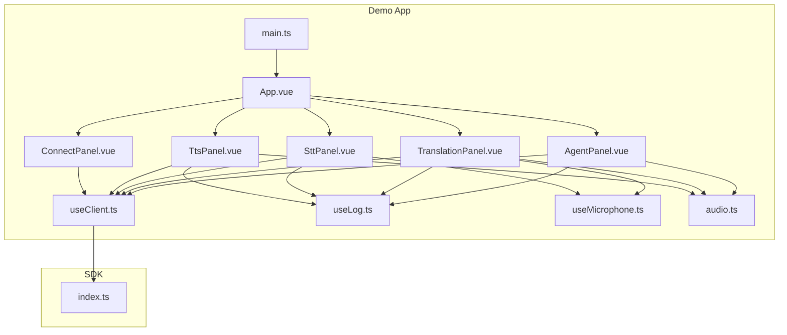
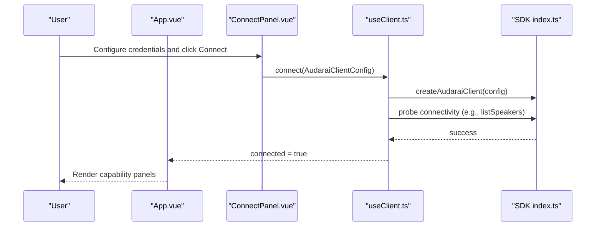
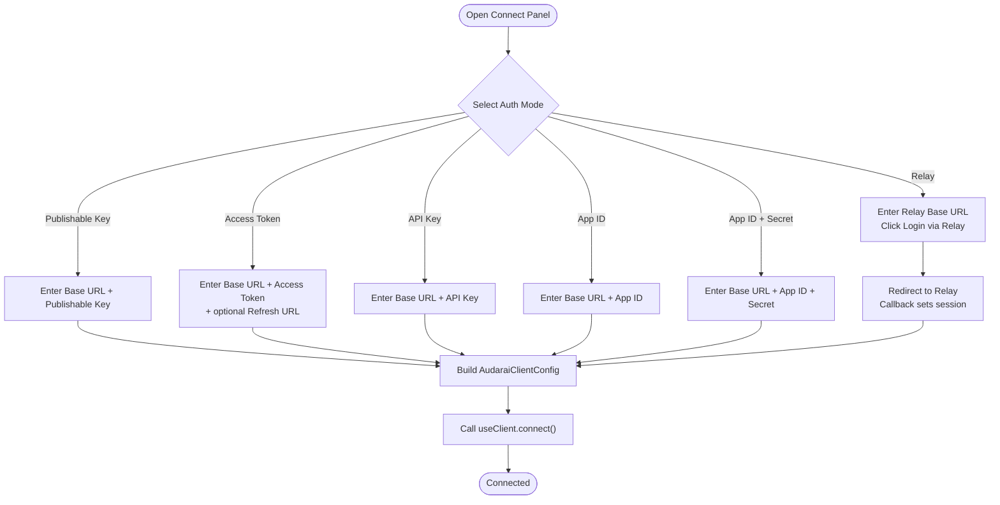
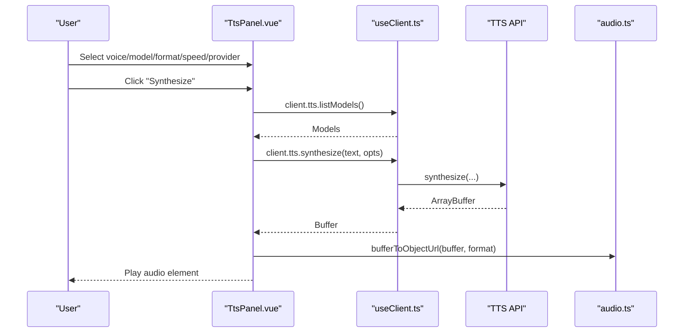
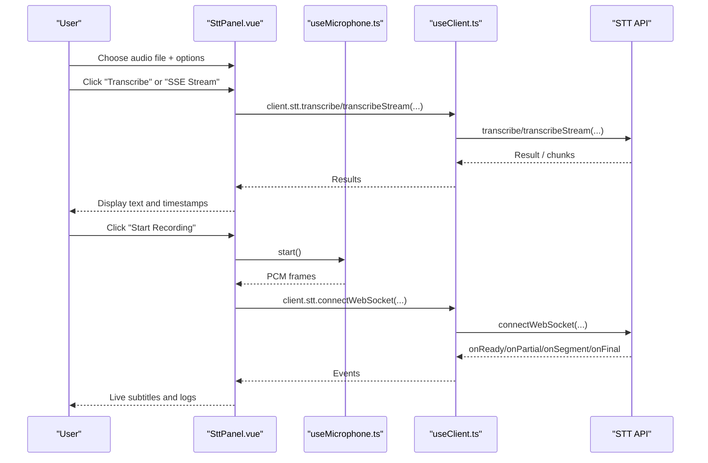
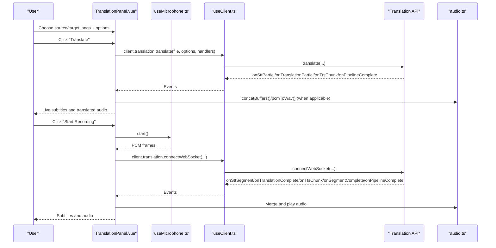
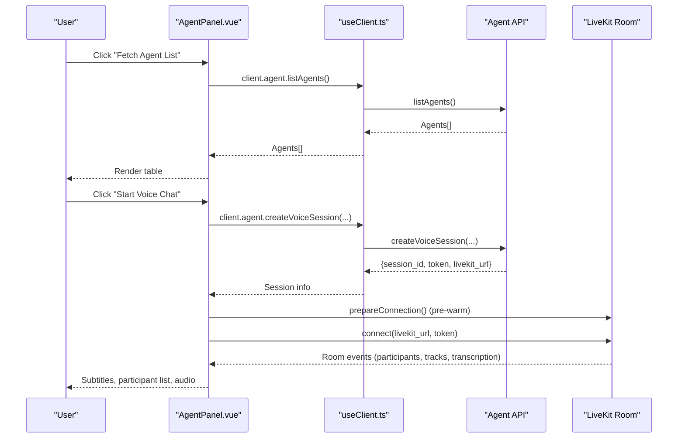
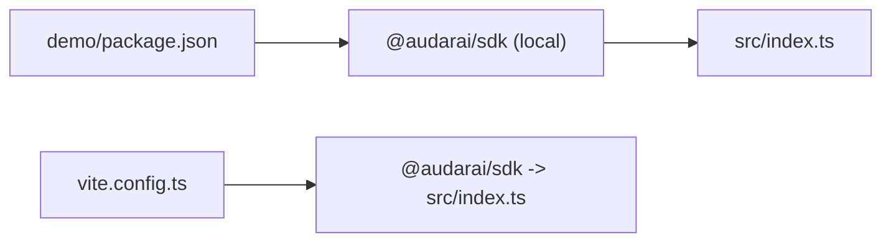

# Demo Application

<cite>
**Referenced Files in This Document**
- [demo/src/main.ts](file://demo/src/main.ts)
- [demo/src/App.vue](file://demo/src/App.vue)
- [demo/src/components/ConnectPanel.vue](file://demo/src/components/ConnectPanel.vue)
- [demo/src/components/TtsPanel.vue](file://demo/src/components/TtsPanel.vue)
- [demo/src/components/SttPanel.vue](file://demo/src/components/SttPanel.vue)
- [demo/src/components/TranslationPanel.vue](file://demo/src/components/TranslationPanel.vue)
- [demo/src/components/AgentPanel.vue](file://demo/src/components/AgentPanel.vue)
- [demo/src/composables/useClient.ts](file://demo/src/composables/useClient.ts)
- [demo/src/composables/useLog.ts](file://demo/src/composables/useLog.ts)
- [demo/src/composables/useMicrophone.ts](file://demo/src/composables/useMicrophone.ts)
- [demo/src/utils/audio.ts](file://demo/src/utils/audio.ts)
- [demo/vite.config.ts](file://demo/vite.config.ts)
- [demo/package.json](file://demo/package.json)
- [src/index.ts](file://src/index.ts)
- [README.md](file://README.md)
</cite>

## Table of Contents
1. [Introduction](#introduction)
2. [Project Structure](#project-structure)
3. [Core Components](#core-components)
4. [Architecture Overview](#architecture-overview)
5. [Detailed Component Analysis](#detailed-component-analysis)
6. [Dependency Analysis](#dependency-analysis)
7. [Performance Considerations](#performance-considerations)
8. [Troubleshooting Guide](#troubleshooting-guide)
9. [Conclusion](#conclusion)
10. [Appendices](#appendices)

## Introduction
This document describes the Demo Application that showcases the AudarAI JavaScript/TypeScript SDK capabilities in an interactive Vue.js interface. It covers the demo architecture, component structure, and implementation patterns for Text-to-Speech (TTS), Speech-to-Text (STT), translation, and agent features. It also provides setup instructions, development workflow, customization options, deployment guidance, and integration notes with the SDK.

## Project Structure
The demo is a standalone Vue 3 application under the demo/ directory that depends on the SDK package located at ../src. The application bootstraps a Vue app, wires up a navigation sidebar with panels for each capability, and integrates composables for client lifecycle, logging, and microphone capture.

**Diagram sources**
- [demo/src/main.ts:1-6](file://demo/src/main.ts#L1-L6)
- [demo/src/App.vue:1-97](file://demo/src/App.vue#L1-L97)
- [demo/src/components/ConnectPanel.vue:1-336](file://demo/src/components/ConnectPanel.vue#L1-L336)
- [demo/src/components/TtsPanel.vue:1-590](file://demo/src/components/TtsPanel.vue#L1-L590)
- [demo/src/components/SttPanel.vue:1-349](file://demo/src/components/SttPanel.vue#L1-L349)
- [demo/src/components/TranslationPanel.vue:1-469](file://demo/src/components/TranslationPanel.vue#L1-L469)
- [demo/src/components/AgentPanel.vue:1-800](file://demo/src/components/AgentPanel.vue#L1-L800)
- [demo/src/composables/useClient.ts:1-36](file://demo/src/composables/useClient.ts#L1-L36)
- [demo/src/composables/useLog.ts:1-49](file://demo/src/composables/useLog.ts#L1-L49)
- [demo/src/composables/useMicrophone.ts:1-45](file://demo/src/composables/useMicrophone.ts#L1-L45)
- [demo/src/utils/audio.ts:1-69](file://demo/src/utils/audio.ts#L1-L69)
- [src/index.ts:1-193](file://src/index.ts#L1-L193)

**Section sources**
- [demo/src/main.ts:1-6](file://demo/src/main.ts#L1-L6)
- [demo/src/App.vue:1-97](file://demo/src/App.vue#L1-L97)
- [demo/vite.config.ts:1-21](file://demo/vite.config.ts#L1-L21)
- [demo/package.json:1-22](file://demo/package.json#L1-L22)

## Core Components
- App shell and navigation: The root component orchestrates the sidebar, connection panel, and active capability panel rendering. It tracks connection state and exposes a navigation menu to switch among TTS, STT, translation, agent, knowledge, tools, skills, archetypes, and rooms.
- Client lifecycle: A composable encapsulates SDK client creation, connectivity probing, and shared state across components.
- Logging: A composable provides structured logs with severity levels and automatic error classification from SDK errors.
- Microphone capture: A composable wraps browser media capture and converts PCM frames for real-time STT/translation pipelines.
- Audio utilities: Helpers for buffer conversions, downloads, concatenation, and WAV packaging for playback.

**Section sources**
- [demo/src/App.vue:1-97](file://demo/src/App.vue#L1-L97)
- [demo/src/composables/useClient.ts:1-36](file://demo/src/composables/useClient.ts#L1-L36)
- [demo/src/composables/useLog.ts:1-49](file://demo/src/composables/useLog.ts#L1-L49)
- [demo/src/composables/useMicrophone.ts:1-45](file://demo/src/composables/useMicrophone.ts#L1-L45)
- [demo/src/utils/audio.ts:1-69](file://demo/src/utils/audio.ts#L1-L69)

## Architecture Overview
The demo follows a modular Vue 3 composition pattern:
- Centralized client state via a singleton composable
- Capability panels as isolated components with their own state and SDK integrations
- Shared utilities for audio and logging
- Dev server aliasing to the SDK source for rapid iteration

**Diagram sources**
- [demo/src/components/ConnectPanel.vue:135-208](file://demo/src/components/ConnectPanel.vue#L135-L208)
- [demo/src/composables/useClient.ts:21-35](file://demo/src/composables/useClient.ts#L21-L35)
- [src/index.ts:160-193](file://src/index.ts#L160-L193)

## Detailed Component Analysis

### App Shell and Navigation
- Maintains active panel state and renders the appropriate capability panel.
- Displays connection badge and disables capability panels until connected.
- Uses v-show to preserve DOM state across tab switches.

**Section sources**
- [demo/src/App.vue:17-96](file://demo/src/App.vue#L17-L96)

### Connect Panel
- Supports multiple authentication modes: publishable key, access token, API key, app id, app id + secret, and Relay (OAuth2).
- For Relay mode, handles login redirect, persists base URL, and retrieves access tokens.
- Builds SDK client configuration dynamically and triggers connection.

**Diagram sources**
- [demo/src/components/ConnectPanel.vue:117-208](file://demo/src/components/ConnectPanel.vue#L117-L208)

**Section sources**
- [demo/src/components/ConnectPanel.vue:1-336](file://demo/src/components/ConnectPanel.vue#L1-L336)

### TTS Panel
- Lists speakers and providers, filters voices by provider compatibility, and supports editing speaker metadata and audio.
- Synthesizes speech to buffers and streams, with MSE playback for supported formats and buffered playback for others.
- Provides reference audio playback and downloads.

**Diagram sources**
- [demo/src/components/TtsPanel.vue:248-408](file://demo/src/components/TtsPanel.vue#L248-L408)
- [demo/src/composables/useClient.ts:21-35](file://demo/src/composables/useClient.ts#L21-L35)
- [demo/src/utils/audio.ts:16-26](file://demo/src/utils/audio.ts#L16-L26)

**Section sources**
- [demo/src/components/TtsPanel.vue:1-590](file://demo/src/components/TtsPanel.vue#L1-L590)

### STT Panel
- File transcription with language and provider selection, plus forced alignment timestamps.
- SSE streaming transcription with incremental updates.
- Real-time transcription via WebSocket with microphone capture and VAD segmentation.

**Diagram sources**
- [demo/src/components/SttPanel.vue:22-96](file://demo/src/components/SttPanel.vue#L22-L96)
- [demo/src/components/SttPanel.vue:144-234](file://demo/src/components/SttPanel.vue#L144-L234)
- [demo/src/composables/useMicrophone.ts:8-44](file://demo/src/composables/useMicrophone.ts#L8-L44)
- [demo/src/composables/useClient.ts:21-35](file://demo/src/composables/useClient.ts#L21-L35)

**Section sources**
- [demo/src/components/SttPanel.vue:1-349](file://demo/src/components/SttPanel.vue#L1-L349)

### Translation Panel
- File translation pipeline with STT → translation → TTS, reporting progress via SSE events.
- Real-time translation via WebSocket with microphone capture, segmented subtitles, and per-segment audio playback.

**Diagram sources**
- [demo/src/components/TranslationPanel.vue:30-120](file://demo/src/components/TranslationPanel.vue#L30-L120)
- [demo/src/components/TranslationPanel.vue:156-270](file://demo/src/components/TranslationPanel.vue#L156-L270)
- [demo/src/composables/useMicrophone.ts:8-44](file://demo/src/composables/useMicrophone.ts#L8-L44)
- [demo/src/composables/useClient.ts:21-35](file://demo/src/composables/useClient.ts#L21-L35)
- [demo/src/utils/audio.ts:44-68](file://demo/src/utils/audio.ts#L44-L68)

**Section sources**
- [demo/src/components/TranslationPanel.vue:1-469](file://demo/src/components/TranslationPanel.vue#L1-L469)

### Agent Panel
- Manages agents: listing, creating, updating, deleting, and binding skills/knowledge/tools.
- Loads dropdown data (skills, knowledge, tools, models) and ensures resilient loading.
- Voice chat integration with LiveKit: pre-warming, session creation, room connection, participant tracking, transcription overlays, and audio playback.

**Diagram sources**
- [demo/src/components/AgentPanel.vue:111-134](file://demo/src/components/AgentPanel.vue#L111-L134)
- [demo/src/components/AgentPanel.vue:561-618](file://demo/src/components/AgentPanel.vue#L561-L618)
- [demo/src/composables/useClient.ts:21-35](file://demo/src/composables/useClient.ts#L21-L35)

**Section sources**
- [demo/src/components/AgentPanel.vue:1-800](file://demo/src/components/AgentPanel.vue#L1-L800)

### Utility Modules
- Audio helpers: size formatting, blob/object URL creation, download, float32→Int16 conversion, buffer concatenation, and WAV packaging.
- Microphone capture: unified PCM frame delivery to callers.
- Logging: structured entries with severity, time, and SDK error classification.

**Section sources**
- [demo/src/utils/audio.ts:1-69](file://demo/src/utils/audio.ts#L1-L69)
- [demo/src/composables/useMicrophone.ts:1-45](file://demo/src/composables/useMicrophone.ts#L1-L45)
- [demo/src/composables/useLog.ts:1-49](file://demo/src/composables/useLog.ts#L1-L49)

## Dependency Analysis
- The demo depends on the SDK package via a local file dependency and aliases the module resolution to the SDK source during development for fast iteration.
- The SDK entry exports the client factory and API namespaces, enabling convenient composition in the demo.

**Diagram sources**
- [demo/package.json:10-14](file://demo/package.json#L10-L14)
- [demo/vite.config.ts:9-16](file://demo/vite.config.ts#L9-L16)
- [src/index.ts:1-193](file://src/index.ts#L1-193)

**Section sources**
- [demo/package.json:1-22](file://demo/package.json#L1-L22)
- [demo/vite.config.ts:1-21](file://demo/vite.config.ts#L1-L21)
- [src/index.ts:1-193](file://src/index.ts#L1-L193)

## Performance Considerations
- Real-time audio pipelines (STT WebSocket, translation WebSocket) rely on efficient PCM frame delivery and minimal buffering. The demo’s microphone composable delivers frames at a fixed rate suitable for the SDK’s expectations.
- Translation and TTS audio playback uses either MediaSource for MSE streaming (when supported) or buffered concatenation for unsupported formats. Prefer MSE for continuous playback to reduce latency.
- LiveKit voice sessions benefit from pre-warming: the demo prepares the room and signal connection ahead of time to minimize initial connection delays.
- Large audio downloads are handled via object URLs; ensure to revoke URLs after playback to free memory.

[No sources needed since this section provides general guidance]

## Troubleshooting Guide
Common issues and remedies:
- Authentication failures: Verify the selected auth mode and credentials. For Relay mode, ensure the redirect flow completed and a session exists.
- Token refresh errors: If using access token mode with a refresh URL, confirm the endpoint returns a valid token field.
- WebSocket connection problems: Check network connectivity and service availability. The demos log protocol events and errors.
- Microphone permission denied: Ensure HTTPS origin and proper user gesture to initiate media access.
- Audio playback issues: Confirm the selected format is supported for MSE streaming; otherwise, playback falls back to buffered mode.

**Section sources**
- [demo/src/components/ConnectPanel.vue:135-208](file://demo/src/components/ConnectPanel.vue#L135-L208)
- [demo/src/composables/useLog.ts:31-45](file://demo/src/composables/useLog.ts#L31-L45)
- [demo/src/components/SttPanel.vue:144-234](file://demo/src/components/SttPanel.vue#L144-L234)
- [demo/src/components/TranslationPanel.vue:156-270](file://demo/src/components/TranslationPanel.vue#L156-L270)

## Conclusion
The Demo Application provides a comprehensive, interactive showcase of the SDK’s TTS, STT, translation, and agent capabilities. Its modular Vue architecture, robust client lifecycle management, and real-time audio integrations offer a strong reference implementation for building voice-enabled applications. Developers can use it to learn SDK patterns, customize UIs, and adapt workflows for production deployments.

[No sources needed since this section summarizes without analyzing specific files]

## Appendices

### Setup and Development Workflow
- Install dependencies in the demo directory.
- Run the dev server with hot module replacement and SDK source aliasing.
- Open the browser to the dev URL and connect using one of the supported authentication modes.

**Section sources**
- [demo/package.json:5-8](file://demo/package.json#L5-L8)
- [demo/vite.config.ts:11-20](file://demo/vite.config.ts#L11-L20)

### Running Locally
- Use the provided scripts to start the dev server, build for production, or preview the build.

**Section sources**
- [demo/package.json:5-8](file://demo/package.json#L5-L8)

### Customization Options
- Authentication: Switch between publishable key, access token, API key, app id, app id + secret, or Relay.
- Provider selection: Choose STT/TTS/LLM models per capability.
- Voice sessions: Override language, user identity, recording preferences, and webhook metadata.
- UI: Extend panels, add new capability tabs, or integrate additional SDK features by composing the client and utilities.

**Section sources**
- [demo/src/components/ConnectPanel.vue:117-208](file://demo/src/components/ConnectPanel.vue#L117-L208)
- [demo/src/components/AgentPanel.vue:576-604](file://demo/src/components/AgentPanel.vue#L576-L604)

### Deployment Notes
- The demo relies on the SDK package installed from the local path. Ensure the SDK dist artifacts are present or adjust the dependency accordingly.
- For production builds, the Vite alias targets the compiled SDK dist; local development aliases the source for faster iteration.

**Section sources**
- [demo/package.json:10-14](file://demo/package.json#L10-L14)
- [demo/vite.config.ts:9-16](file://demo/vite.config.ts#L9-L16)

### Integration with the SDK
- The demo uses the SDK factory to create a client with bound APIs for TTS, STT, translation, agent, knowledge, tools, skills, archetypes, and rooms.
- It leverages SDK-provided error types for robust error handling and displays actionable logs.

**Section sources**
- [src/index.ts:160-193](file://src/index.ts#L160-L193)
- [demo/src/composables/useLog.ts:31-45](file://demo/src/composables/useLog.ts#L31-L45)