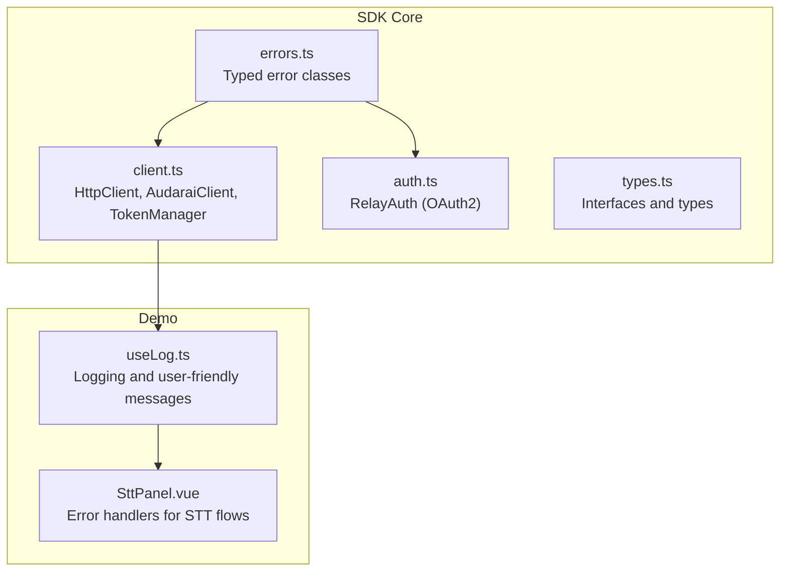
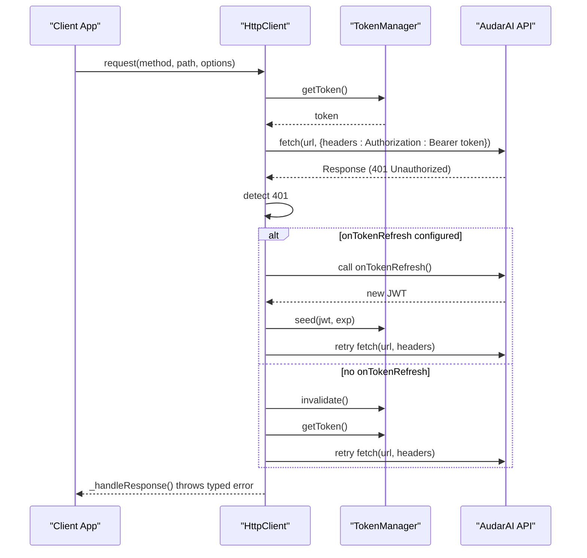
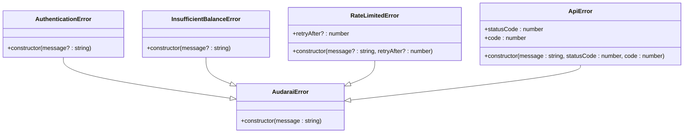
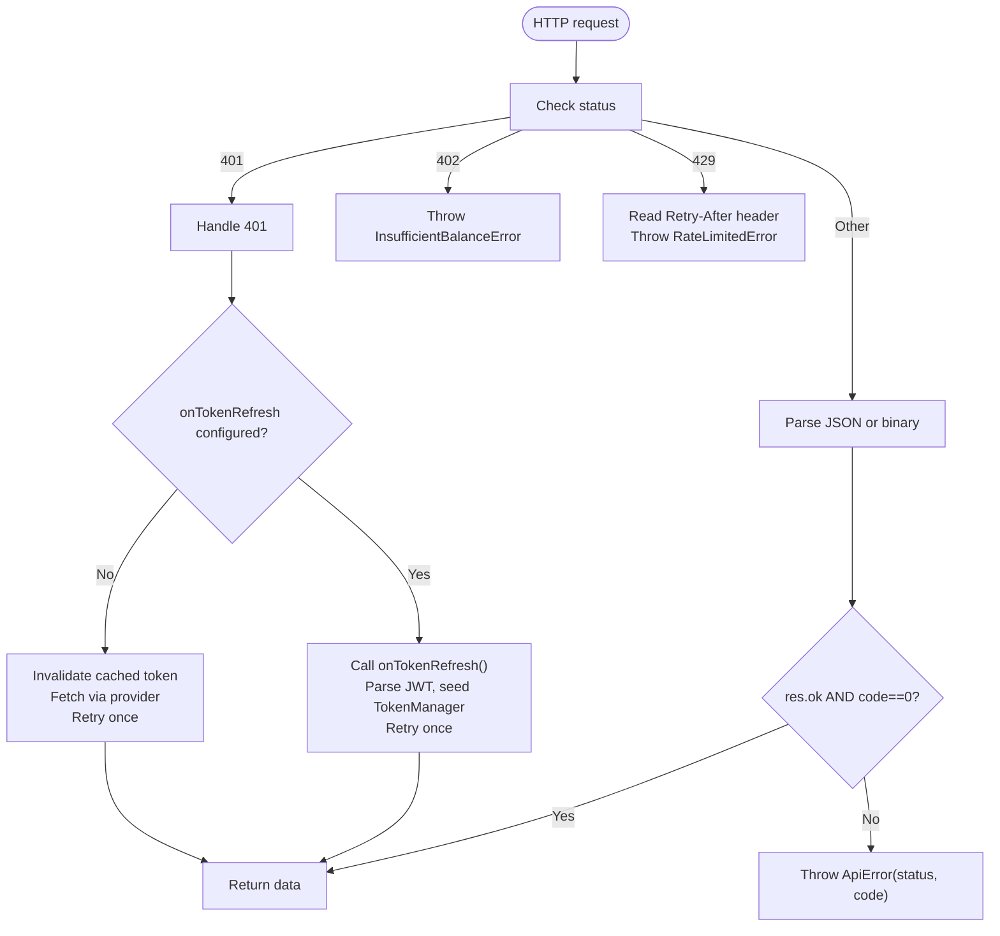
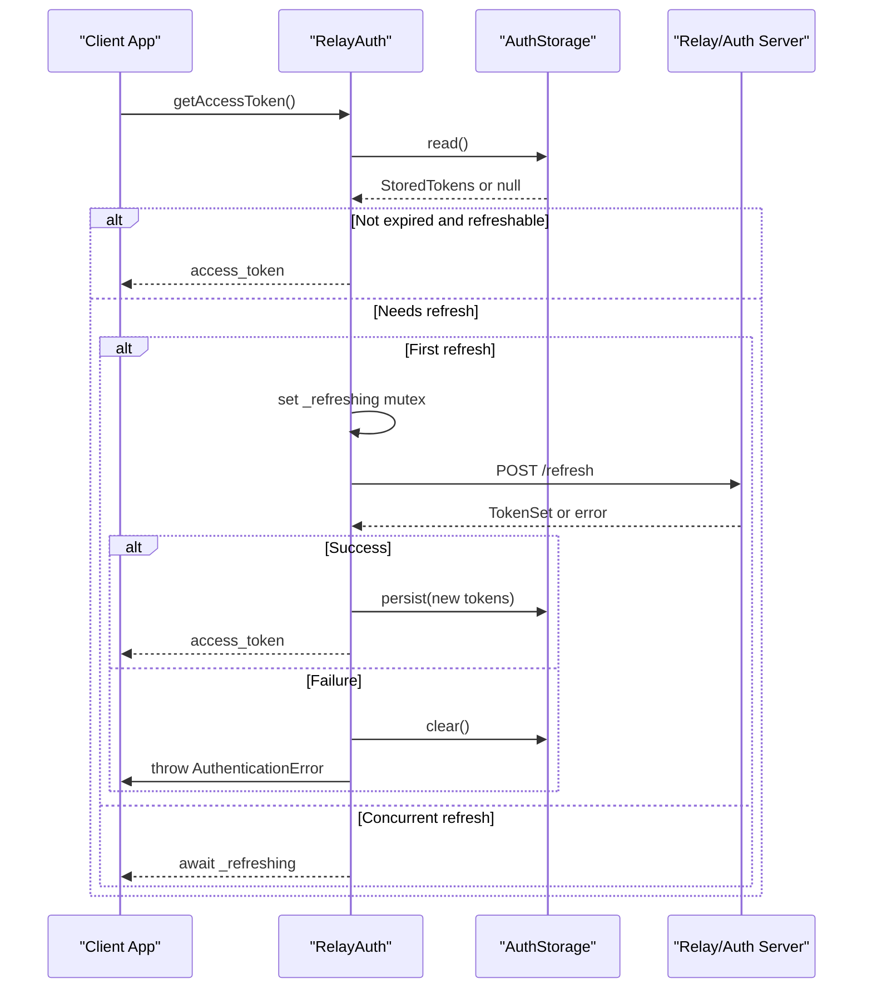
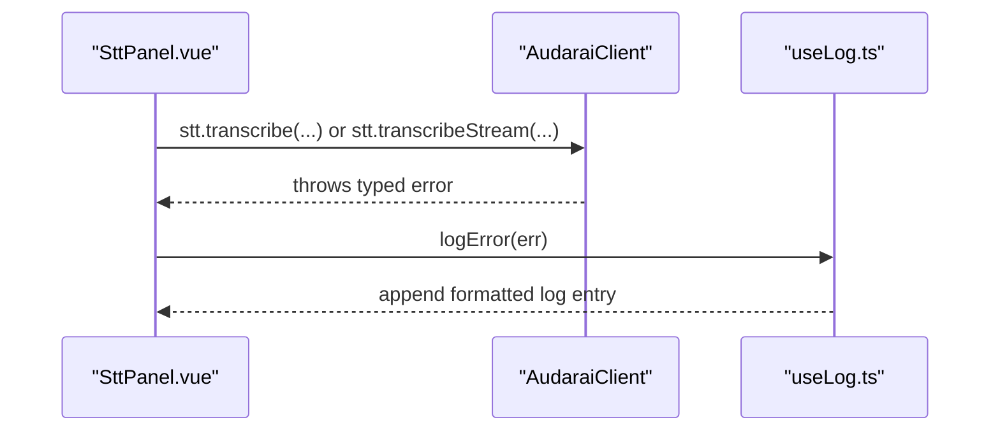
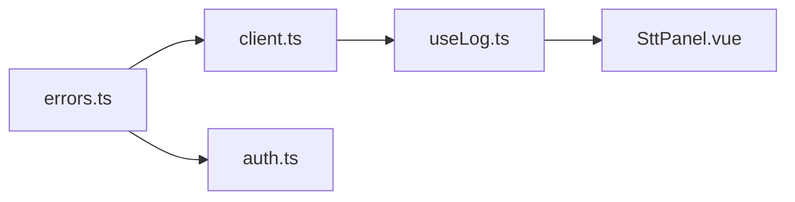

# Error Handling

<cite>
**Referenced Files in This Document**
- [errors.ts](file://src/errors.ts)
- [client.ts](file://src/client.ts)
- [auth.ts](file://src/auth.ts)
- [types.ts](file://src/types.ts)
- [useLog.ts](file://demo/src/composables/useLog.ts)
- [SttPanel.vue](file://demo/src/components/SttPanel.vue)
- [README.md](file://README.md)
</cite>

## Table of Contents
1. [Introduction](#introduction)
2. [Project Structure](#project-structure)
3. [Core Components](#core-components)
4. [Architecture Overview](#architecture-overview)
5. [Detailed Component Analysis](#detailed-component-analysis)
6. [Dependency Analysis](#dependency-analysis)
7. [Performance Considerations](#performance-considerations)
8. [Troubleshooting Guide](#troubleshooting-guide)
9. [Conclusion](#conclusion)

## Introduction
This document provides comprehensive guidance on error handling in the AudarAI SDK. It covers error classification, error codes, exception types, and recovery patterns across HTTP and WebSocket integrations. It explains automatic token refresh behavior, retry logic, timeout handling, and graceful degradation strategies. Practical examples demonstrate logging strategies, debugging workflows, and client-side error handling patterns. Guidance is included for implementing robust error handling in client applications, including error boundaries, user-friendly messaging, and reporting mechanisms.

## Project Structure
The SDK exposes typed error classes and integrates them into HTTP and WebSocket clients. The demo application demonstrates logging and user-facing error handling patterns.

**Diagram sources**
- [errors.ts:1-43](file://src/errors.ts#L1-L43)
- [client.ts:1-411](file://src/client.ts#L1-L411)
- [auth.ts:1-272](file://src/auth.ts#L1-L272)
- [types.ts:1-1265](file://src/types.ts#L1-L1265)
- [useLog.ts:1-49](file://demo/src/composables/useLog.ts#L1-L49)
- [SttPanel.vue:1-349](file://demo/src/components/SttPanel.vue#L1-L349)

**Section sources**
- [errors.ts:1-43](file://src/errors.ts#L1-L43)
- [client.ts:1-411](file://src/client.ts#L1-L411)
- [auth.ts:1-272](file://src/auth.ts#L1-L272)
- [types.ts:1-1265](file://src/types.ts#L1-L1265)
- [useLog.ts:1-49](file://demo/src/composables/useLog.ts#L1-L49)
- [SttPanel.vue:1-349](file://demo/src/components/SttPanel.vue#L1-L349)

## Core Components
- Typed error classes:
  - AudaraiError: Base error type.
  - AuthenticationError: Invalid/expired credentials.
  - InsufficientBalanceError: Account balance depleted.
  - RateLimitedError: Exceeded rate limits; includes optional retry-after hint.
  - ApiError: Generic HTTP API error with status code and internal code.
- HTTP client:
  - Automatic 401 handling with token refresh fallback.
  - Response parsing with explicit error mapping for 401, 402, 429, and general API errors.
- OAuth2 relay client:
  - Automatic token refresh with mutex to prevent concurrent refreshes.
  - Graceful handling of expired sessions and refresh failures.

**Section sources**
- [errors.ts:1-43](file://src/errors.ts#L1-L43)
- [client.ts:93-213](file://src/client.ts#L93-L213)
- [auth.ts:102-183](file://src/auth.ts#L102-L183)

## Architecture Overview
The SDK centralizes error handling in two layers:
- HTTP layer: HttpClient throws typed exceptions based on HTTP status and response payload.
- OAuth2 layer: RelayAuth manages token lifecycle and throws AuthenticationError on failures.

**Diagram sources**
- [client.ts:133-173](file://src/client.ts#L133-L173)
- [client.ts:187-212](file://src/client.ts#L187-L212)

## Detailed Component Analysis

### Error Classification and Exception Types
- AuthenticationError: Thrown on 401 or invalid/expired tokens; also thrown by OAuth2 client when not logged in or refresh fails.
- InsufficientBalanceError: Thrown on 402.
- RateLimitedError: Thrown on 429; includes optional retryAfter header-derived delay.
- ApiError: Generic HTTP error with statusCode and internal code; thrown for non-2xx responses or non-zero JSON code.
- AudaraiError: Base class for all SDK errors.

**Diagram sources**
- [errors.ts:1-43](file://src/errors.ts#L1-L43)

**Section sources**
- [errors.ts:1-43](file://src/errors.ts#L1-L43)

### HTTP Layer Error Handling (HttpClient)
- 401 Unauthorized:
  - If a dedicated onTokenRefresh callback is provided, the client calls it, parses the returned JWT, seeds the TokenManager, and retries the request once.
  - Otherwise, it invalidates the cached token and re-fetches via the token provider, then retries once.
- 402 Payment Required: Throws InsufficientBalanceError.
- 429 Too Many Requests: Reads Retry-After header and throws RateLimitedError with optional retryAfter.
- Non-binary responses: Parses JSON and throws ApiError if response code indicates failure.
- Binary responses: Throws ApiError with textual body if not ok.

**Diagram sources**
- [client.ts:151-172](file://src/client.ts#L151-L172)
- [client.ts:187-212](file://src/client.ts#L187-L212)

**Section sources**
- [client.ts:133-173](file://src/client.ts#L133-L173)
- [client.ts:187-212](file://src/client.ts#L187-L212)

### OAuth2 Relay Client (RelayAuth)
- Proactive refresh before expiration (default threshold 30s).
- Mutex prevents concurrent refresh calls.
- Throws AuthenticationError on missing tokens, refresh failures, or session expiration; invokes onSessionExpired hook.

**Diagram sources**
- [auth.ts:169-183](file://src/auth.ts#L169-L183)
- [auth.ts:232-252](file://src/auth.ts#L232-L252)

**Section sources**
- [auth.ts:102-183](file://src/auth.ts#L102-L183)
- [auth.ts:232-252](file://src/auth.ts#L232-L252)

### Demo Logging and User-Friendly Messages
- useLog.ts categorizes and logs SDK errors with user-friendly messages and severity levels.
- SttPanel.vue demonstrates catching errors from STT operations and passing them to useLog for display.

**Diagram sources**
- [SttPanel.vue:28-49](file://demo/src/components/SttPanel.vue#L28-L49)
- [SttPanel.vue:57-96](file://demo/src/components/SttPanel.vue#L57-L96)
- [useLog.ts:31-45](file://demo/src/composables/useLog.ts#L31-L45)

**Section sources**
- [useLog.ts:1-49](file://demo/src/composables/useLog.ts#L1-L49)
- [SttPanel.vue:1-349](file://demo/src/components/SttPanel.vue#L1-L349)

## Dependency Analysis
- HttpClient depends on TokenManager and throws typed errors based on HTTP responses.
- RelayAuth depends on storage and throws AuthenticationError on failures; integrates with AudaraiClient via accessToken provider.
- Demo components depend on SDK error classes for logging and UI feedback.

**Diagram sources**
- [errors.ts:1-43](file://src/errors.ts#L1-L43)
- [client.ts:1-411](file://src/client.ts#L1-L411)
- [auth.ts:1-272](file://src/auth.ts#L1-L272)
- [useLog.ts:1-49](file://demo/src/composables/useLog.ts#L1-L49)
- [SttPanel.vue:1-349](file://demo/src/components/SttPanel.vue#L1-L349)

**Section sources**
- [errors.ts:1-43](file://src/errors.ts#L1-L43)
- [client.ts:1-411](file://src/client.ts#L1-L411)
- [auth.ts:1-272](file://src/auth.ts#L1-L272)
- [useLog.ts:1-49](file://demo/src/composables/useLog.ts#L1-L49)
- [SttPanel.vue:1-349](file://demo/src/components/SttPanel.vue#L1-L349)

## Performance Considerations
- Proactive token refresh reduces latency from 401-triggered retries.
- Mutex prevents thundering herd on concurrent refresh attempts.
- Binary response handling avoids unnecessary JSON parsing overhead.

[No sources needed since this section provides general guidance]

## Troubleshooting Guide
- Authentication failures:
  - Verify credentials and mode selection (exactly one authentication mode must be configured).
  - For OAuth2, ensure onTokenRefresh is provided when using static access tokens.
- Rate limiting:
  - Respect retryAfter hints; implement exponential backoff if needed.
- Insufficient balance:
  - Top up account; the SDK will surface InsufficientBalanceError.
- Network and timeouts:
  - The SDK does not implement explicit request timeouts; integrate a fetch polyfill with timeout behavior if required.
- WebSocket errors:
  - Listen to onError callbacks in WebSocket handlers; log and recover gracefully.

**Section sources**
- [client.ts:225-244](file://src/client.ts#L225-L244)
- [client.ts:153-170](file://src/client.ts#L153-L170)
- [client.ts:194-197](file://src/client.ts#L194-L197)
- [README.md:733-763](file://README.md#L733-L763)

## Conclusion
The AudarAI SDK provides a cohesive error handling framework with typed exceptions, automatic token refresh, and clear recovery paths. Clients should adopt structured try/catch blocks, leverage user-friendly logging, and implement graceful degradation for transient failures. For production deployments, consider integrating monitoring and alerting around error categories, and ensure robust error reporting to improve observability and user experience.