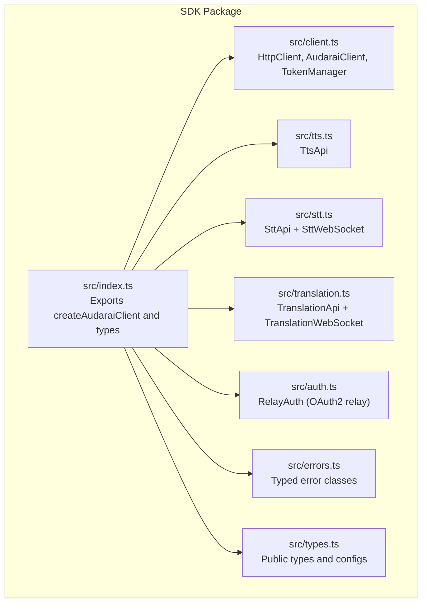
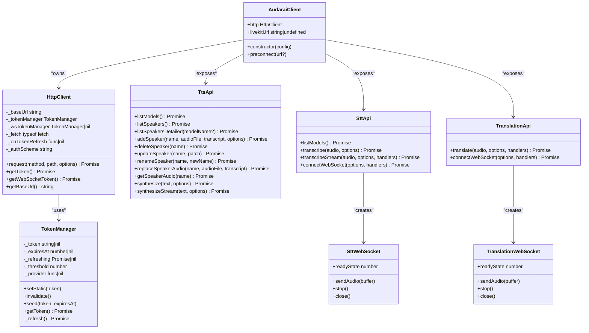
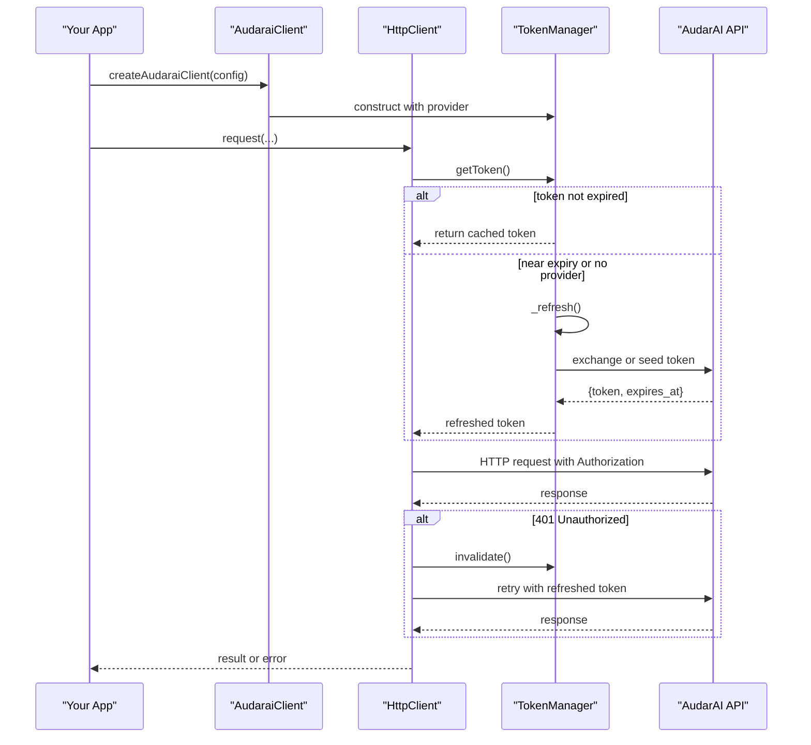
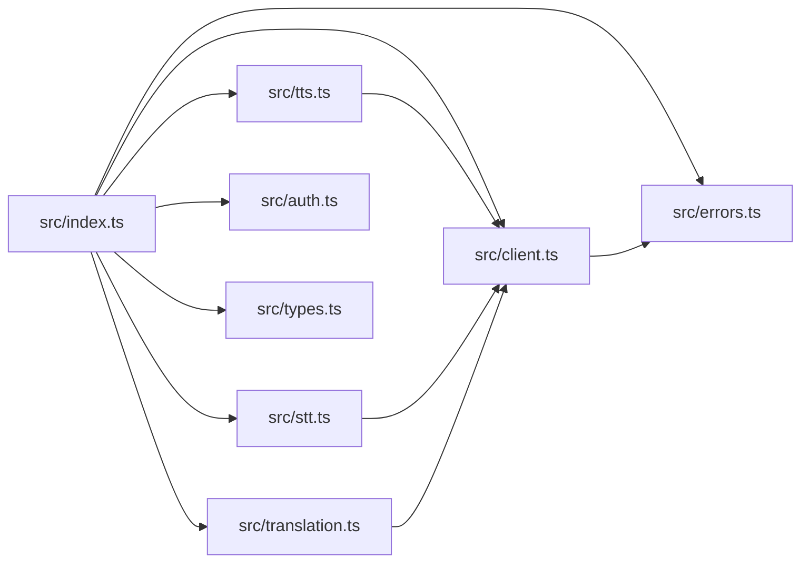

# Getting Started

<cite>
**Referenced Files in This Document**
- [README.md](file://README.md)
- [package.json](file://package.json)
- [src/index.ts](file://src/index.ts)
- [src/client.ts](file://src/client.ts)
- [src/auth.ts](file://src/auth.ts)
- [src/tts.ts](file://src/tts.ts)
- [src/stt.ts](file://src/stt.ts)
- [src/translation.ts](file://src/translation.ts)
- [src/types.ts](file://src/types.ts)
- [src/errors.ts](file://src/errors.ts)
- [demo/src/composables/useClient.ts](file://demo/src/composables/useClient.ts)
- [demo/src/components/TtsPanel.vue](file://demo/src/components/TtsPanel.vue)
- [demo/src/components/SttPanel.vue](file://demo/src/components/SttPanel.vue)
</cite>

## Table of Contents
1. [Introduction](#introduction)
2. [Project Structure](#project-structure)
3. [Core Components](#core-components)
4. [Architecture Overview](#architecture-overview)
5. [Detailed Component Analysis](#detailed-component-analysis)
6. [Dependency Analysis](#dependency-analysis)
7. [Performance Considerations](#performance-considerations)
8. [Troubleshooting Guide](#troubleshooting-guide)
9. [Conclusion](#conclusion)
10. [Appendices](#appendices)

## Introduction
This guide helps you quickly set up and use the AudarAI JavaScript/TypeScript SDK to build voice-enabled applications. The SDK provides a unified interface for:
- Text-to-Speech (TTS): high-quality voice synthesis with custom speaker cloning
- Speech-to-Text (STT): accurate transcription via file upload, SSE streaming, or real-time WebSocket
- Audio Translation: end-to-end STT → Translation → TTS pipeline with live streaming
- Agent orchestration, Knowledge Bases, Tools, Skills, Archetypes, Rooms, and Sessions

It runs in both browsers and Node.js (18+) environments with first-class TypeScript support.

## Project Structure
At a high level, the SDK exposes a single factory to create a client that composes multiple API modules (TTS, STT, Translation, Agent, Knowledge, Tool, Skill, Archetype, Room, Session). It also exports authentication helpers and typed error classes.

**Diagram sources**
- [src/index.ts:1-193](file://src/index.ts#L1-L193)
- [src/client.ts:1-411](file://src/client.ts#L1-L411)
- [src/auth.ts:1-272](file://src/auth.ts#L1-L272)
- [src/tts.ts:1-231](file://src/tts.ts#L1-L231)
- [src/stt.ts:1-217](file://src/stt.ts#L1-L217)
- [src/translation.ts:1-277](file://src/translation.ts#L1-L277)
- [src/errors.ts:1-43](file://src/errors.ts#L1-L43)
- [src/types.ts:1-200](file://src/types.ts#L1-L200)

**Section sources**
- [README.md:19-55](file://README.md#L19-L55)
- [package.json:1-26](file://package.json#L1-L26)
- [src/index.ts:128-193](file://src/index.ts#L128-L193)

## Core Components
- Client creation and configuration
  - Use the factory to create a client with one of the supported authentication modes.
  - Configure base URLs, fetch implementation, LiveKit preconnect, and token refresh thresholds.
- Authentication modes
  - Publishable key (frontend-safe), Access Token (SSO/OAuth2), API Key (backend), or App credentials (appid + optional secret).
- Public APIs
  - TTS: list models, list/update speakers, synthesize and stream synthesis, manage custom voices.
  - STT: list models, transcribe files, SSE streaming, and real-time WebSocket transcription.
  - Translation: SSE pipeline and WebSocket translation with callbacks for each stage.
  - Additional modules: Agent, Knowledge, Tool, Skill, Archetype, Room, Session.

**Section sources**
- [README.md:91-114](file://README.md#L91-L114)
- [README.md:117-204](file://README.md#L117-L204)
- [src/index.ts:128-193](file://src/index.ts#L128-L193)
- [src/client.ts:215-411](file://src/client.ts#L215-L411)
- [src/types.ts:7-63](file://src/types.ts#L7-L63)

## Architecture Overview
The SDK’s runtime architecture centers around a single client that encapsulates HTTP and WebSocket communication, token management, and environment-specific behaviors (browser vs Node.js). The client delegates to specialized API classes for each service area.

**Diagram sources**
- [src/client.ts:215-411](file://src/client.ts#L215-L411)
- [src/client.ts:93-213](file://src/client.ts#L93-L213)
- [src/client.ts:22-91](file://src/client.ts#L22-L91)
- [src/tts.ts:11-231](file://src/tts.ts#L11-L231)
- [src/stt.ts:83-217](file://src/stt.ts#L83-L217)
- [src/stt.ts:21-81](file://src/stt.ts#L21-L81)
- [src/translation.ts:111-277](file://src/translation.ts#L111-L277)
- [src/translation.ts:39-109](file://src/translation.ts#L39-L109)

## Detailed Component Analysis

### Installation and Setup
- Install the SDK from the official package source using your preferred package manager.
- Import the client factory and create a client with your chosen authentication mode.
- For Node.js < 18, provide a fetch implementation.

Practical quick starts:
- Browser with publishable key
- Node.js with API key
- OAuth2 with access token and dynamic refresh
- App credentials (appid + optional secret)

**Section sources**
- [README.md:58-81](file://README.md#L58-L81)
- [README.md:91-114](file://README.md#L91-L114)
- [README.md:130-195](file://README.md#L130-L195)
- [README.md:781-795](file://README.md#L781-L795)

### Client Initialization and Authentication
- Exactly one authentication mode must be configured. The client validates this and throws an error otherwise.
- Supported modes:
  - Publishable key: requests are exchanged for short-lived session tokens automatically.
  - Access token: JWT passed directly for HTTP; WebSocket tokens auto-exchanged.
  - API key: full-permission bearer key; WebSocket tokens auto-exchanged.
  - App: appid alone for frontend (browser-safe); appid + appSecret for backend (Basic auth).
- Token auto-refresh behavior:
  - Proactive refresh before expiration (default threshold: 30 seconds).
  - Mutex prevents concurrent refresh calls.
  - On 401, invalidates cache and retries once.

**Diagram sources**
- [src/client.ts:225-369](file://src/client.ts#L225-L369)
- [src/client.ts:52-91](file://src/client.ts#L52-L91)
- [src/client.ts:133-173](file://src/client.ts#L133-L173)

**Section sources**
- [src/client.ts:225-369](file://src/client.ts#L225-L369)
- [src/client.ts:52-91](file://src/client.ts#L52-L91)
- [src/client.ts:133-173](file://src/client.ts#L133-L173)
- [README.md:117-128](file://README.md#L117-L128)
- [README.md:767-777](file://README.md#L767-L777)

### TTS: Text-to-Speech
- List models and voices, manage custom speakers, and synthesize audio.
- Options include voice, model, response format, speed, and provider selection.
- Streaming synthesis returns a Response for piping to files or Web Audio.

Common usage patterns:
- Basic synthesis and playback in the browser
- Streaming synthesis for long-form content
- Managing custom voices (clone, update, rename, replace audio)

**Section sources**
- [README.md:207-268](file://README.md#L207-L268)
- [src/tts.ts:14-66](file://src/tts.ts#L14-L66)
- [src/tts.ts:68-94](file://src/tts.ts#L68-L94)
- [src/tts.ts:106-150](file://src/tts.ts#L106-L150)
- [src/tts.ts:185-230](file://src/tts.ts#L185-L230)
- [demo/src/components/TtsPanel.vue:297-408](file://demo/src/components/TtsPanel.vue#L297-L408)

### STT: Speech-to-Text
- Transcribe audio files, receive incremental results via SSE, and connect to a real-time WebSocket for live microphone input.
- WebSocket v2 protocol: server sends ready, SDK auto-starts, then emits partial/segment/final messages.

Common usage patterns:
- File transcription with optional word-level timestamps
- SSE streaming transcription with onChunk/onFinal callbacks
- Real-time transcription with microphone capture and VAD segmentation

**Section sources**
- [README.md:271-339](file://README.md#L271-L339)
- [src/stt.ts:91-102](file://src/stt.ts#L91-L102)
- [src/stt.ts:116-183](file://src/stt.ts#L116-L183)
- [src/stt.ts:198-216](file://src/stt.ts#L198-L216)
- [src/stt.ts:21-81](file://src/stt.ts#L21-L81)
- [demo/src/components/SttPanel.vue:22-96](file://demo/src/components/SttPanel.vue#L22-L96)
- [demo/src/components/SttPanel.vue:144-234](file://demo/src/components/SttPanel.vue#L144-L234)

### Translation: STT → Translation → TTS Pipeline
- File-based translation via SSE with callbacks for each pipeline stage.
- Real-time translation over WebSocket with typed messages for STT partials, translations, TTS chunks, and completion.

Common usage patterns:
- File translation with optional TTS output and voice selection
- Live translation with microphone input and real-time subtitles

**Section sources**
- [README.md:341-408](file://README.md#L341-L408)
- [src/translation.ts:132-228](file://src/translation.ts#L132-L228)
- [src/translation.ts:258-276](file://src/translation.ts#L258-L276)
- [src/translation.ts:39-109](file://src/translation.ts#L39-L109)

### OAuth2 Relay and Token Auto-Refresh
- The SDK integrates with a Keycloak relay to simplify browser-based OAuth2 flows.
- It persists tokens, auto-refreshes them before expiry, and triggers a fallback login when refresh fails.

**Section sources**
- [src/auth.ts:102-272](file://src/auth.ts#L102-L272)
- [README.md:767-777](file://README.md#L767-L777)

### Environment Compatibility
- Native fetch in Node.js 18+; for older versions, pass a fetch implementation.
- Browser and Node.js share the same client and API surface.

**Section sources**
- [README.md:781-795](file://README.md#L781-L795)

## Dependency Analysis
The SDK’s public entry exports a single factory and a set of API classes. Internally, the client composes an HTTP client and token manager, and each API module depends on the HTTP client.

**Diagram sources**
- [src/index.ts:1-126](file://src/index.ts#L1-L126)
- [src/client.ts:1-411](file://src/client.ts#L1-L411)
- [src/tts.ts:1-231](file://src/tts.ts#L1-L231)
- [src/stt.ts:1-217](file://src/stt.ts#L1-L217)
- [src/translation.ts:1-277](file://src/translation.ts#L1-L277)
- [src/auth.ts:1-272](file://src/auth.ts#L1-L272)
- [src/errors.ts:1-43](file://src/errors.ts#L1-L43)
- [src/types.ts:1-200](file://src/types.ts#L1-L200)

**Section sources**
- [src/index.ts:1-126](file://src/index.ts#L1-L126)

## Performance Considerations
- Token auto-refresh threshold: adjust refreshThresholdSeconds to balance freshness and network overhead.
- WebSocket preconnect: when livekitUrl is configured, the client preconnects to reduce latency for voice sessions.
- Streaming synthesis: use Response bodies to stream audio directly to files or Web Audio without buffering entire outputs.

[No sources needed since this section provides general guidance]

## Troubleshooting Guide
- Authentication failures
  - Ensure exactly one authentication mode is configured.
  - For publishable/app credentials, confirm allowed origins and secrets.
- 401 Unauthorized
  - The SDK retries once after refreshing tokens; if still failing, review credentials and token lifetimes.
- Rate limiting
  - Inspect retryAfter for backoff guidance.
- Insufficient balance
  - Top up your account if encountering this error.

**Section sources**
- [src/client.ts:225-244](file://src/client.ts#L225-L244)
- [src/client.ts:153-170](file://src/client.ts#L153-L170)
- [src/errors.ts:8-42](file://src/errors.ts#L8-L42)
- [README.md:733-763](file://README.md#L733-L763)

## Conclusion
You now have the essentials to integrate AudarAI’s unified TTS, STT, and Translation APIs into your application. Start with the client factory and your chosen authentication mode, then explore TTS synthesis, STT transcription, and Translation pipelines. Use the demo components as references for building real-world experiences.

[No sources needed since this section summarizes without analyzing specific files]

## Appendices

### Quick Start Examples

- Browser with publishable key
  - Initialize the client with baseUrl and publishableKey.
  - Synthesize text and play the resulting audio buffer in the browser.

- Node.js with API key
  - Initialize the client with baseUrl and apiKey.
  - Use streaming synthesis to write audio to disk.

- OAuth2 with access token and dynamic refresh
  - Initialize the client with baseUrl and accessToken as a function.
  - Implement onTokenRefresh to obtain a fresh JWT when needed.

- App credentials (appid + optional secret)
  - Frontend: initialize with appId only (browser-safe).
  - Backend: initialize with appId and appSecret (Basic auth).

**Section sources**
- [README.md:91-114](file://README.md#L91-L114)
- [README.md:130-195](file://README.md#L130-L195)
- [README.md:781-795](file://README.md#L781-L795)

### Practical Demos
- TTS panel demonstrates listing providers and speakers, synthesizing text, streaming synthesis, and managing custom voices.
- STT panel demonstrates file transcription, SSE streaming, and real-time WebSocket transcription with microphone capture.

**Section sources**
- [demo/src/components/TtsPanel.vue:297-408](file://demo/src/components/TtsPanel.vue#L297-L408)
- [demo/src/components/SttPanel.vue:22-96](file://demo/src/components/SttPanel.vue#L22-L96)
- [demo/src/components/SttPanel.vue:144-234](file://demo/src/components/SttPanel.vue#L144-L234)