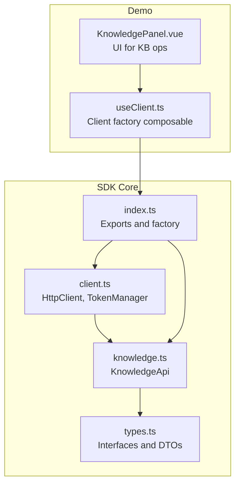
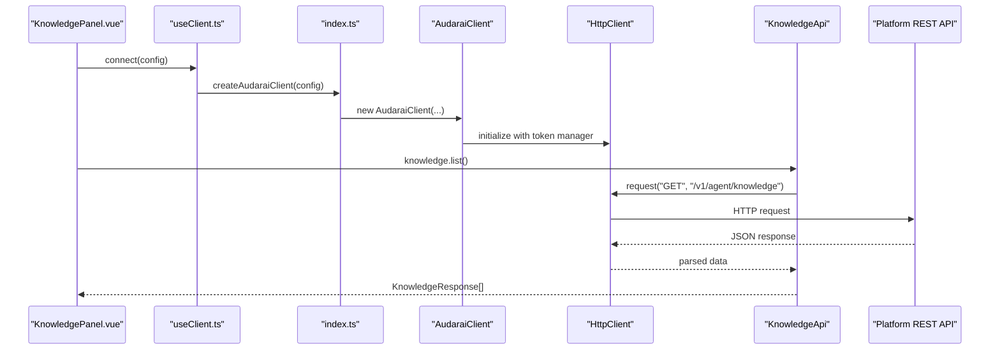
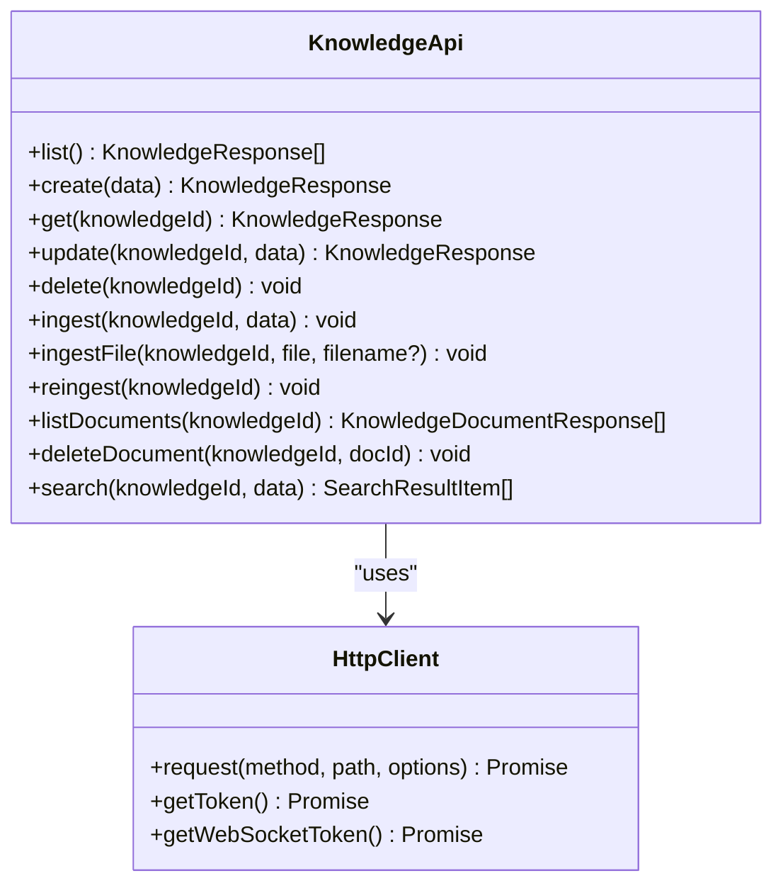
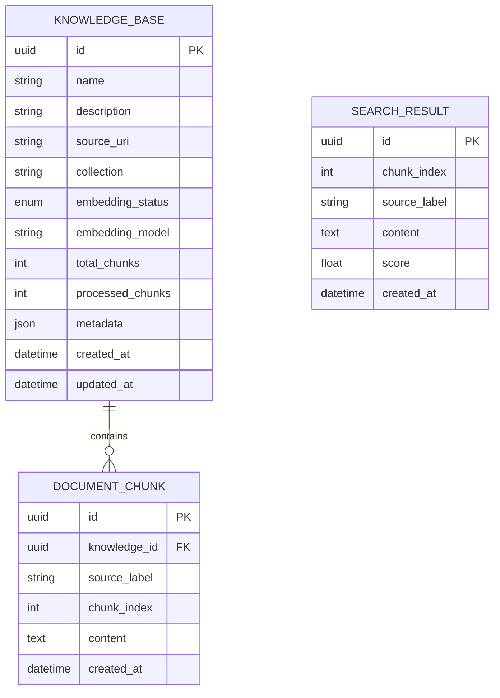
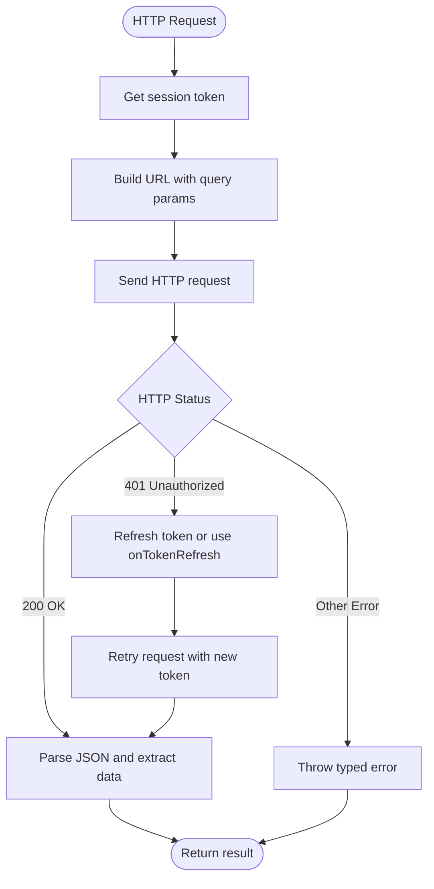
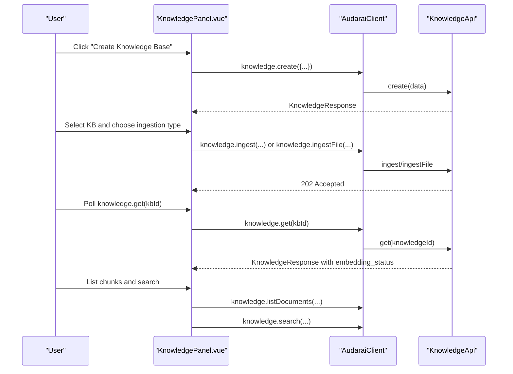
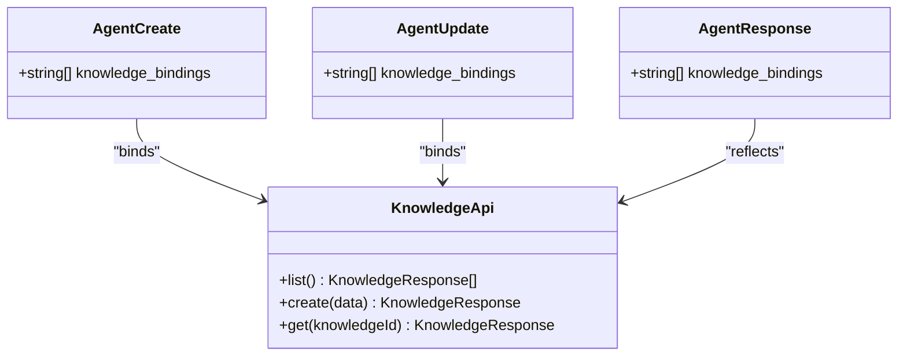
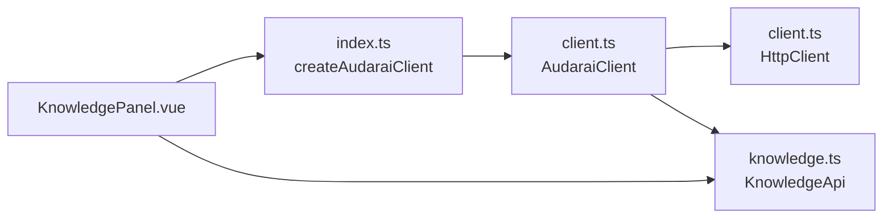

# Knowledge Base System

<cite>
**Referenced Files in This Document**
- [knowledge.ts](file://src/knowledge.ts)
- [types.ts](file://src/types.ts)
- [client.ts](file://src/client.ts)
- [index.ts](file://src/index.ts)
- [KnowledgePanel.vue](file://demo/src/components/KnowledgePanel.vue)
- [useClient.ts](file://demo/src/composables/useClient.ts)
- [agent.ts](file://src/agent.ts)
- [README.md](file://README.md)
- [package.json](file://package.json)
</cite>

## Table of Contents
1. [Introduction](#introduction)
2. [Project Structure](#project-structure)
3. [Core Components](#core-components)
4. [Architecture Overview](#architecture-overview)
5. [Detailed Component Analysis](#detailed-component-analysis)
6. [Dependency Analysis](#dependency-analysis)
7. [Performance Considerations](#performance-considerations)
8. [Troubleshooting Guide](#troubleshooting-guide)
9. [Conclusion](#conclusion)
10. [Appendices](#appendices)

## Introduction
This document describes the Knowledge Base System within the AudarAI JavaScript/TypeScript SDK. It covers how to create knowledge bases, ingest documents (plain text, URLs, and files), manage document chunks, perform semantic search, and integrate knowledge bases with agents for grounding. It also explains the underlying data models, HTTP APIs, and practical patterns for building robust search experiences.

The system exposes a KnowledgeApi that wraps REST endpoints for:
- Creating, listing, updating, and deleting knowledge bases
- Ingesting content from text, URLs, or files
- Listing and deleting document chunks
- Performing semantic search over embeddings
- Re-ingesting content from a URL source

## Project Structure
The SDK is organized into modular modules:
- Client and HTTP transport
- Knowledge base API
- Types and interfaces
- Demo application showcasing knowledge base operations

**Diagram sources**
- [client.ts:93-213](file://src/client.ts#L93-L213)
- [knowledge.ts:12-136](file://src/knowledge.ts#L12-L136)
- [types.ts:933-1005](file://src/types.ts#L933-L1005)
- [index.ts:128-192](file://src/index.ts#L128-L192)
- [KnowledgePanel.vue:1-529](file://demo/src/components/KnowledgePanel.vue#L1-L529)
- [useClient.ts:1-36](file://demo/src/composables/useClient.ts#L1-L36)

**Section sources**
- [client.ts:1-411](file://src/client.ts#L1-L411)
- [knowledge.ts:1-137](file://src/knowledge.ts#L1-L137)
- [types.ts:933-1005](file://src/types.ts#L933-L1005)
- [index.ts:1-193](file://src/index.ts#L1-L193)
- [KnowledgePanel.vue:1-529](file://demo/src/components/KnowledgePanel.vue#L1-L529)
- [useClient.ts:1-36](file://demo/src/composables/useClient.ts#L1-L36)

## Core Components
- KnowledgeApi: Provides CRUD, ingestion, document management, and semantic search operations.
- HttpClient: Handles authentication, token refresh, request/response processing, and error mapping.
- Types: Defines request/response shapes for knowledge base operations and search results.
- Demo UI: Demonstrates end-to-end workflows for knowledge base creation, ingestion, chunk listing, and semantic search.

Key capabilities:
- Knowledge base lifecycle management
- Ingestion from text, URL, or file upload
- Chunk listing and deletion
- Semantic search with configurable top_k and language hints
- Re-ingestion from URL source

**Section sources**
- [knowledge.ts:12-136](file://src/knowledge.ts#L12-L136)
- [client.ts:93-213](file://src/client.ts#L93-L213)
- [types.ts:935-1005](file://src/types.ts#L935-L1005)
- [KnowledgePanel.vue:15-188](file://demo/src/components/KnowledgePanel.vue#L15-L188)

## Architecture Overview
The Knowledge Base System follows a layered architecture:
- Presentation/UI layer (Vue components)
- Client factory and composables
- SDK API surface (KnowledgeApi)
- HTTP transport (HttpClient)
- Platform endpoints (REST)

**Diagram sources**
- [KnowledgePanel.vue:21-29](file://demo/src/components/KnowledgePanel.vue#L21-L29)
- [useClient.ts:21-28](file://demo/src/composables/useClient.ts#L21-L28)
- [index.ts:170-192](file://src/index.ts#L170-L192)
- [client.ts:215-369](file://src/client.ts#L215-L369)
- [knowledge.ts:17-19](file://src/knowledge.ts#L17-L19)

## Detailed Component Analysis

### KnowledgeApi: Operations and Contracts
- CRUD: list, create, get, update, delete
- Ingestion: ingest (text or URL), ingestFile (multipart/form-data), reingest
- Documents: listDocuments, deleteDocument
- Search: search (semantic similarity)

**Diagram sources**
- [knowledge.ts:12-136](file://src/knowledge.ts#L12-L136)
- [client.ts:93-213](file://src/client.ts#L93-L213)

**Section sources**
- [knowledge.ts:17-135](file://src/knowledge.ts#L17-L135)
- [types.ts:935-1005](file://src/types.ts#L935-L1005)

### Data Models and Interfaces
- KnowledgeCreate, KnowledgeUpdate, KnowledgeResponse: knowledge base metadata and status
- IngestTextRequest: ingestion payload for text or URL
- SearchRequest, SearchResultItem: search query and results
- KnowledgeDocumentResponse: chunk metadata

**Diagram sources**
- [types.ts:951-976](file://src/types.ts#L951-L976)
- [types.ts:997-1005](file://src/types.ts#L997-L1005)

**Section sources**
- [types.ts:935-1005](file://src/types.ts#L935-L1005)

### HTTP Transport and Authentication
- HttpClient manages token acquisition and refresh, builds URLs, and handles HTTP errors.
- TokenManager supports publishable key, access token, API key, and app-based authentication modes.
- On 401 responses, the SDK can refresh tokens via onTokenRefresh or re-fetch via provider.

**Diagram sources**
- [client.ts:133-212](file://src/client.ts#L133-L212)

**Section sources**
- [client.ts:22-91](file://src/client.ts#L22-L91)
- [client.ts:215-369](file://src/client.ts#L215-L369)

### Demo UI: Knowledge Base Workflows
The demo provides a guided workflow:
- List and create knowledge bases
- Ingest content from text, URL, or file
- Poll embedding_status until completion
- List and delete document chunks
- Perform semantic search with top_k and language hints

**Diagram sources**
- [KnowledgePanel.vue:21-188](file://demo/src/components/KnowledgePanel.vue#L21-L188)
- [knowledge.ts:17-135](file://src/knowledge.ts#L17-L135)

**Section sources**
- [KnowledgePanel.vue:15-188](file://demo/src/components/KnowledgePanel.vue#L15-L188)

### Agent Grounding Integration
Agents can bind knowledge bases to leverage them for grounding:
- AgentCreate.knowledge_bindings: attach one or more knowledge base IDs
- AgentUpdate.knowledge_bindings: update bindings
- AgentResponse.knowledge_bindings: current bindings

**Diagram sources**
- [types.ts:505-570](file://src/types.ts#L505-L570)
- [types.ts:572-606](file://src/types.ts#L572-L606)
- [knowledge.ts:17-33](file://src/knowledge.ts#L17-L33)

**Section sources**
- [types.ts:505-606](file://src/types.ts#L505-L606)
- [agent.ts:11-28](file://src/agent.ts#L11-L28)

## Dependency Analysis
- KnowledgeApi depends on HttpClient for network operations.
- Client factory composes multiple APIs (TTS, STT, Translation, Agent, Knowledge, Tool, Skill, Archetype, Room, Session, Channel).
- Demo UI composes the client and delegates to KnowledgeApi for operations.

**Diagram sources**
- [index.ts:128-192](file://src/index.ts#L128-L192)
- [client.ts:215-369](file://src/client.ts#L215-L369)
- [knowledge.ts:12-136](file://src/knowledge.ts#L12-L136)
- [KnowledgePanel.vue:1-529](file://demo/src/components/KnowledgePanel.vue#L1-L529)

**Section sources**
- [index.ts:128-192](file://src/index.ts#L128-L192)
- [client.ts:215-369](file://src/client.ts#L215-L369)
- [knowledge.ts:12-136](file://src/knowledge.ts#L12-L136)
- [KnowledgePanel.vue:1-529](file://demo/src/components/KnowledgePanel.vue#L1-L529)

## Performance Considerations
- Asynchronous ingestion: ingestion returns 202 Accepted; poll embedding_status until completion.
- Chunk size and segmentation: ingestion splits content into chunks; chunk_index helps locate source segments.
- top_k tuning: adjust SearchRequest.top_k to balance recall and latency.
- Language hints: SearchRequest.language can improve segmentation and matching for multilingual content.
- Storage and vectors: embedding_status indicates when vectors are ready; avoid search until completed.

[No sources needed since this section provides general guidance]

## Troubleshooting Guide
Common issues and resolutions:
- Authentication failures: ensure correct auth mode is configured and tokens are refreshed.
- Rate limiting: handle 429 responses and respect Retry-After header.
- Insufficient balance: handle 402 responses and top up account.
- 401 after token refresh: SDK retries once automatically; verify onTokenRefresh implementation.

Operational checks:
- Verify embedding_status transitions from pending to processing to completed.
- Confirm ingestion payload fields (source_type, text/url, source_label, language).
- Validate search query length and language settings.

**Section sources**
- [client.ts:187-212](file://src/client.ts#L187-L212)
- [knowledge.ts:55-72](file://src/knowledge.ts#L55-L72)
- [types.ts:959-965](file://src/types.ts#L959-L965)

## Conclusion
The Knowledge Base System provides a complete, production-ready solution for managing domain knowledge and grounding agents with semantic search. By leveraging KnowledgeApi’s ingestion, chunk management, and search capabilities, developers can build intelligent, context-aware applications. The demo UI demonstrates end-to-end workflows, while the SDK’s typed interfaces and robust HTTP transport ensure reliability across environments.

[No sources needed since this section summarizes without analyzing specific files]

## Appendices

### Practical Examples

- Knowledge base setup
  - Create a knowledge base and capture its ID for subsequent operations.
  - Reference: [KnowledgePanel.vue:31-51](file://demo/src/components/KnowledgePanel.vue#L31-L51), [knowledge.ts:21-26](file://src/knowledge.ts#L21-L26)

- Document ingestion workflows
  - Ingest text or URL; upload files via ingestFile; poll embedding_status.
  - Reference: [KnowledgePanel.vue:91-138](file://demo/src/components/KnowledgePanel.vue#L91-L138), [knowledge.ts:63-86](file://src/knowledge.ts#L63-L86)

- Semantic search queries
  - Call search with query, top_k, and optional language.
  - Reference: [KnowledgePanel.vue:174-188](file://demo/src/components/KnowledgePanel.vue#L174-L188), [knowledge.ts:126-135](file://src/knowledge.ts#L126-L135)

- Agent grounding patterns
  - Bind knowledge base IDs to agents via knowledge_bindings.
  - Reference: [types.ts:505-570](file://src/types.ts#L505-L570), [types.ts:572-606](file://src/types.ts#L572-L606)

- Search result ranking and relevance
  - Results include cosine similarity scores; higher is more relevant.
  - Reference: [types.ts:1002-1003](file://src/types.ts#L1002-L1003)

- Query optimization techniques
  - Adjust top_k and language hints; ensure embedding_status is completed.
  - Reference: [types.ts:990-995](file://src/types.ts#L990-L995), [types.ts:959-965](file://src/types.ts#L959-L965)

- Integration patterns with agent orchestration
  - Use AgentApi to create agents with knowledge_bindings; orchestrate sessions.
  - Reference: [agent.ts:41-61](file://src/agent.ts#L41-L61), [README.md:412-462](file://README.md#L412-L462)

- Translation services integration
  - Combine translation pipeline with knowledge base search for multilingual grounding.
  - Reference: [README.md:341-408](file://README.md#L341-L408)

- Building the SDK locally
  - Use the provided package scripts to build and develop.
  - Reference: [package.json:16-20](file://package.json#L16-L20)