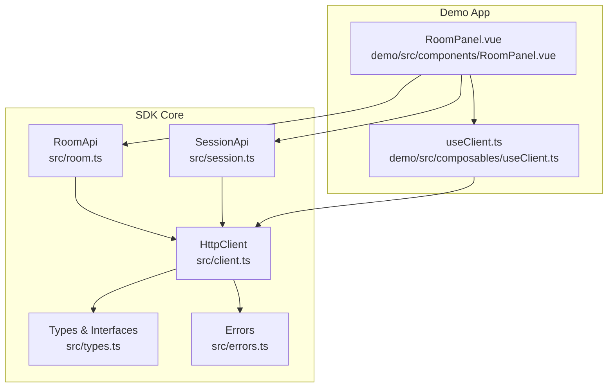
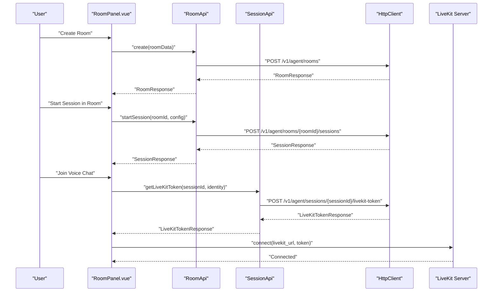
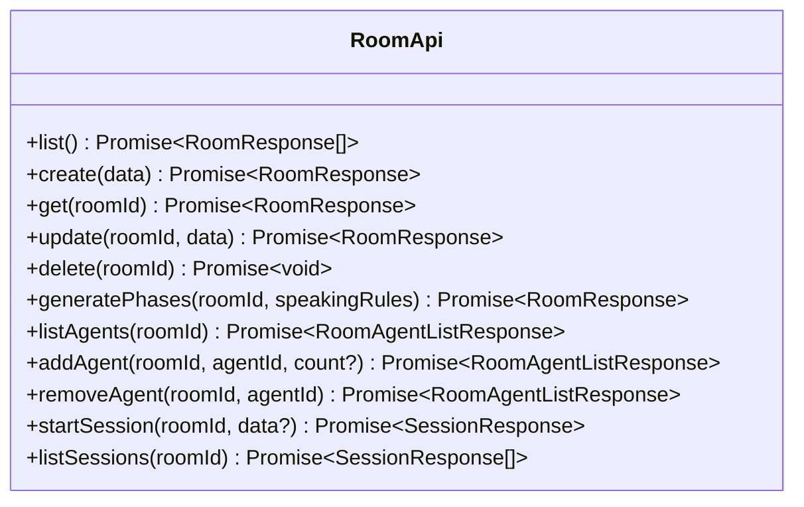
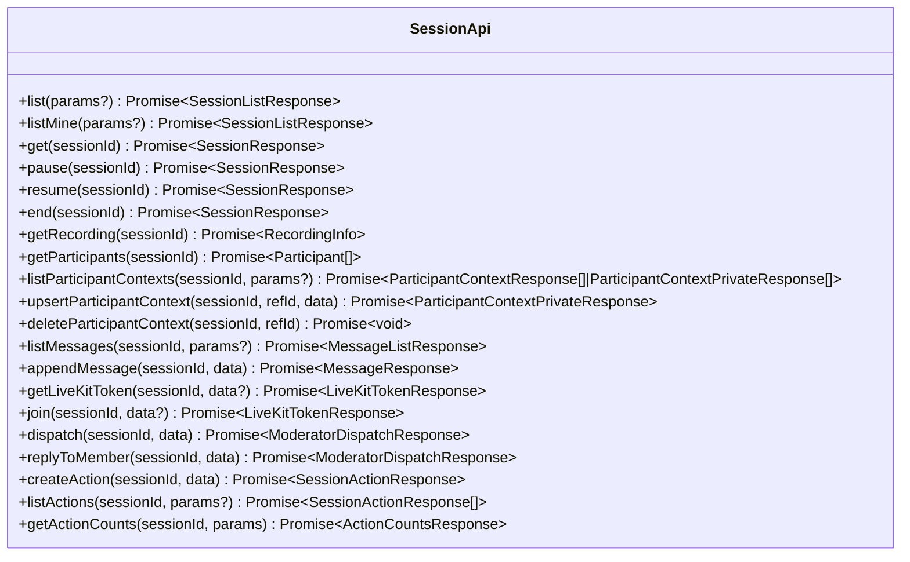
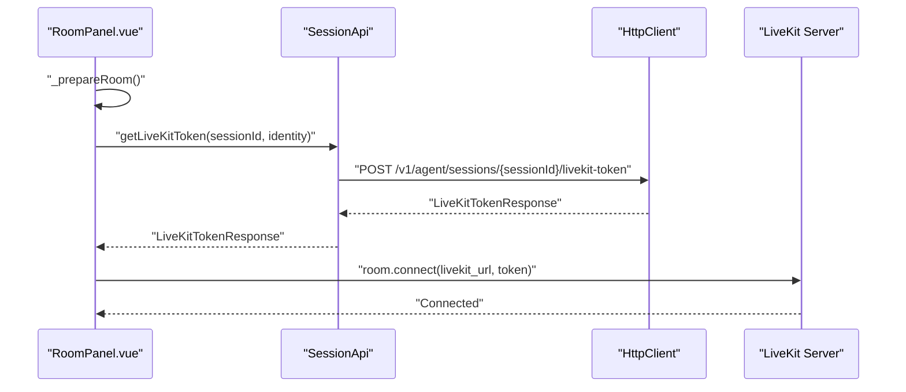
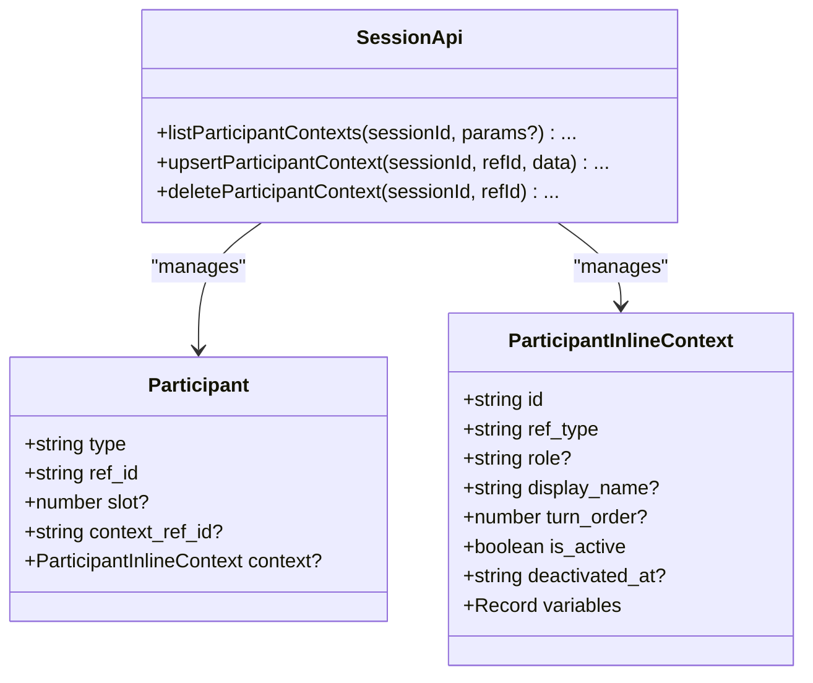
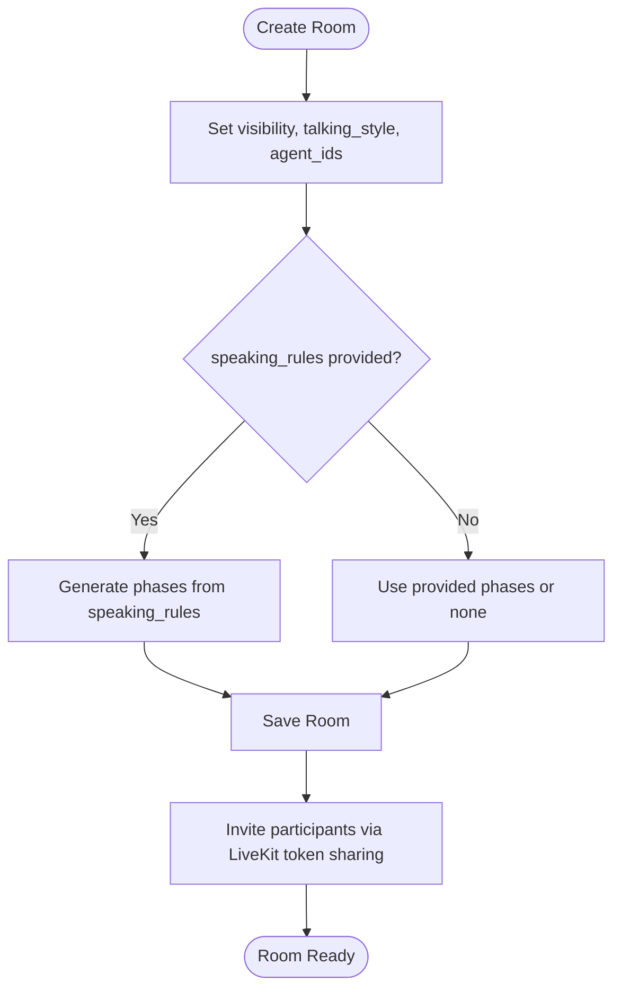
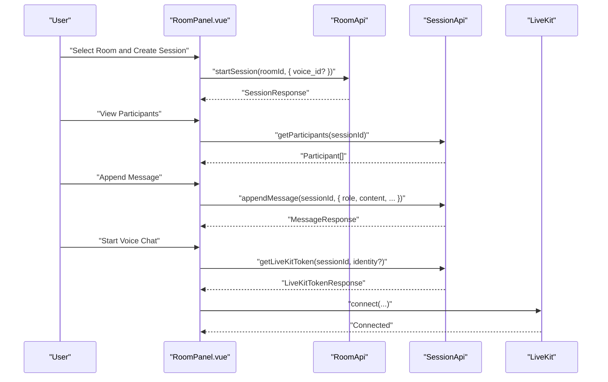
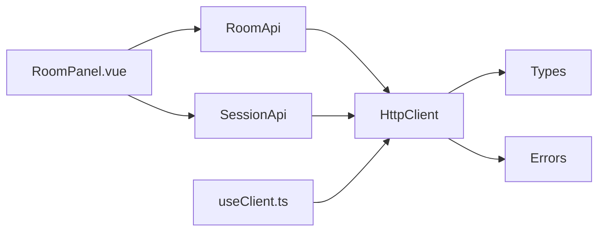
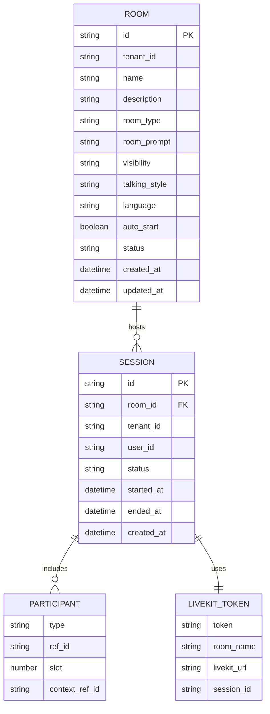

# Room & Session Management

<cite>
**Referenced Files in This Document**
- [room.ts](file://src/room.ts)
- [session.ts](file://src/session.ts)
- [client.ts](file://src/client.ts)
- [channel.ts](file://src/channel.ts)
- [types.ts](file://src/types.ts)
- [errors.ts](file://src/errors.ts)
- [RoomPanel.vue](file://demo/src/components/RoomPanel.vue)
- [useClient.ts](file://demo/src/composables/useClient.ts)
- [README.md](file://README.md)
</cite>

## Table of Contents
1. [Introduction](#introduction)
2. [Project Structure](#project-structure)
3. [Core Components](#core-components)
4. [Architecture Overview](#architecture-overview)
5. [Detailed Component Analysis](#detailed-component-analysis)
6. [Dependency Analysis](#dependency-analysis)
7. [Performance Considerations](#performance-considerations)
8. [Troubleshooting Guide](#troubleshooting-guide)
9. [Conclusion](#conclusion)
10. [Appendices](#appendices)

## Introduction
This document explains Room & Session Management in the AudarAI JavaScript/TypeScript SDK, focusing on multi-agent voice room creation, participant management, and session tracking. It covers room lifecycle, participant invitation and management, session state tracking, and LiveKit integration patterns. It also documents room configuration, participant roles, session persistence, real-time collaboration features, security/access control, and practical workflows demonstrated in the demo application.

## Project Structure
The SDK exposes a cohesive set of APIs for rooms, sessions, and LiveKit integration, backed by a strongly typed client and robust error handling. The demo app demonstrates end-to-end workflows for creating rooms, managing agents, starting sessions, and joining voice conversations.

**Diagram sources**
- [room.ts:4-108](file://src/room.ts#L4-L108)
- [session.ts:4-235](file://src/session.ts#L4-L235)
- [client.ts:93-213](file://src/client.ts#L93-L213)
- [types.ts:673-893](file://src/types.ts#L673-L893)
- [errors.ts:1-43](file://src/errors.ts#L1-L43)
- [RoomPanel.vue:1-100](file://demo/src/components/RoomPanel.vue#L1-L100)
- [useClient.ts:1-36](file://demo/src/composables/useClient.ts#L1-L36)

**Section sources**
- [room.ts:1-108](file://src/room.ts#L1-L108)
- [session.ts:1-235](file://src/session.ts#L1-L235)
- [client.ts:1-411](file://src/client.ts#L1-L411)
- [types.ts:1-1265](file://src/types.ts#L1-L1265)
- [errors.ts:1-43](file://src/errors.ts#L1-L43)
- [RoomPanel.vue:1-1919](file://demo/src/components/RoomPanel.vue#L1-L1919)
- [useClient.ts:1-36](file://demo/src/composables/useClient.ts#L1-L36)
- [README.md:615-731](file://README.md#L615-L731)

## Core Components
- RoomApi: Manages rooms (CRUD), agent binding/unbinding, and session creation within a room.
- SessionApi: Manages session lifecycle, participant lists, messages, LiveKit tokens, and moderator dispatch.
- HttpClient: Centralized HTTP client with token management, automatic refresh, and error handling.
- Types: Strongly typed interfaces for rooms, sessions, participants, LiveKit tokens, and related payloads.
- Errors: Typed error classes for authentication, rate limiting, insufficient balance, and API errors.
- Demo RoomPanel: End-to-end UI demonstrating room creation, agent management, session lifecycle, and voice chat with LiveKit.

Practical outcomes:
- Create rooms with configurable visibility, talking styles, and agent bindings.
- Start sessions within rooms and list sessions per room.
- Manage participants and their context.
- Obtain and use LiveKit tokens to join voice rooms.
- Monitor session state and messages.

**Section sources**
- [room.ts:4-108](file://src/room.ts#L4-L108)
- [session.ts:4-235](file://src/session.ts#L4-L235)
- [client.ts:93-213](file://src/client.ts#L93-L213)
- [types.ts:673-893](file://src/types.ts#L673-L893)
- [errors.ts:1-43](file://src/errors.ts#L1-L43)
- [RoomPanel.vue:296-707](file://demo/src/components/RoomPanel.vue#L296-L707)

## Architecture Overview
The Room & Session subsystem integrates HTTP APIs with LiveKit for real-time voice collaboration. The SDK encapsulates authentication, token exchange, and request/response handling, while the demo app provides a user interface to orchestrate rooms and sessions.

**Diagram sources**
- [room.ts:13-18](file://src/room.ts#L13-L18)
- [room.ts:82-99](file://src/room.ts#L82-L99)
- [session.ts:137-143](file://src/session.ts#L137-L143)
- [client.ts:133-173](file://src/client.ts#L133-L173)
- [RoomPanel.vue:635-664](file://demo/src/components/RoomPanel.vue#L635-L664)

## Detailed Component Analysis

### RoomApi: Room Lifecycle and Agent Management
RoomApi provides:
- List, create, get, update, and delete rooms.
- Generate structured phases from natural language speaking rules.
- Manage room agents: list, add, remove.
- Start sessions within a room and list room sessions.

Key behaviors:
- Room creation supports visibility, talking style, agent bindings, and optional speaking rules that generate phases.
- Agent management supports multi-instance agents via counts.
- Session creation supports optional voice override and per-session participant lists.

**Diagram sources**
- [room.ts:4-108](file://src/room.ts#L4-L108)

**Section sources**
- [room.ts:9-34](file://src/room.ts#L9-L34)
- [room.ts:39-48](file://src/room.ts#L39-L48)
- [room.ts:52-70](file://src/room.ts#L52-L70)
- [room.ts:82-107](file://src/room.ts#L82-L107)
- [types.ts:673-796](file://src/types.ts#L673-L796)
- [types.ts:798-806](file://src/types.ts#L798-L806)

### SessionApi: Session Lifecycle, Participants, Messages, LiveKit, and Moderation
SessionApi provides:
- List sessions (tenant-wide and user’s), get session details, pause/resume/end.
- Get participants, list and append messages.
- LiveKit token minting and joining existing sessions.
- Moderator-led dispatch to trigger specific agents.
- Participant context upsert/delete and action tracking.

**Diagram sources**
- [session.ts:4-235](file://src/session.ts#L4-L235)

**Section sources**
- [session.ts:9-37](file://src/session.ts#L9-L37)
- [session.ts:48-53](file://src/session.ts#L48-L53)
- [session.ts:55-58](file://src/session.ts#L55-L58)
- [session.ts:67-100](file://src/session.ts#L67-L100)
- [session.ts:104-124](file://src/session.ts#L104-L124)
- [session.ts:137-160](file://src/session.ts#L137-L160)
- [session.ts:173-192](file://src/session.ts#L173-L192)
- [session.ts:200-233](file://src/session.ts#L200-L233)
- [types.ts:811-835](file://src/types.ts#L811-L835)
- [types.ts:837-844](file://src/types.ts#L837-L844)
- [types.ts:859-872](file://src/types.ts#L859-L872)
- [types.ts:1143-1148](file://src/types.ts#L1143-L1148)
- [types.ts:1150-1159](file://src/types.ts#L1150-L1159)

### LiveKit Integration Patterns
- getLiveKitToken: Returns a token and LiveKit URL for the first participant.
- join: Returns a token for additional participants in an already-running session.
- Demo integration: RoomPanel prepares a LiveKit Room, pre-warms DNS/TLS, obtains a token, and connects.

**Diagram sources**
- [session.ts:137-143](file://src/session.ts#L137-L143)
- [RoomPanel.vue:527-664](file://demo/src/components/RoomPanel.vue#L527-L664)

**Section sources**
- [session.ts:137-160](file://src/session.ts#L137-L160)
- [RoomPanel.vue:635-692](file://demo/src/components/RoomPanel.vue#L635-L692)

### Participant Management and Roles
- Participants are identified by type ("user", "agent", or custom) and ref_id.
- Participants can have inline context with role, display name, turn order, and activation state.
- Participant context can be upserted/deleted to override per-participant configuration.

**Diagram sources**
- [types.ts:811-835](file://src/types.ts#L811-L835)
- [types.ts:1198-1232](file://src/types.ts#L1198-L1232)
- [session.ts:67-100](file://src/session.ts#L67-L100)

**Section sources**
- [types.ts:811-835](file://src/types.ts#L811-L835)
- [types.ts:1198-1232](file://src/types.ts#L1198-L1232)
- [session.ts:67-100](file://src/session.ts#L67-L100)

### Room Configuration and Security
- Room visibility: private/shared/public.
- Talking style: sequential, moderator-led, freeform.
- Agent bindings: supports multi-instance agents via counts.
- Access control: rooms enforce visibility and participation policies; LiveKit tokens tie identities to participants.

**Diagram sources**
- [room.ts:13-18](file://src/room.ts#L13-L18)
- [room.ts:39-48](file://src/room.ts#L39-L48)
- [types.ts:706-764](file://src/types.ts#L706-L764)

**Section sources**
- [room.ts:13-48](file://src/room.ts#L13-L48)
- [types.ts:706-796](file://src/types.ts#L706-L796)

### Practical Workflows Demonstrated in the Demo
- Room creation with agents and optional speaking rules.
- Room agent management (add/remove).
- Starting a session in a room and listing room sessions.
- Managing session lifecycle (pause/resume/end) and retrieving participants.
- Appending messages and listing message history.
- LiveKit voice chat: obtaining tokens, connecting, muting, and disconnecting.
- Moderator-led dispatch to trigger specific agents.

**Diagram sources**
- [room.ts:82-107](file://src/room.ts#L82-L107)
- [session.ts:55-58](file://src/session.ts#L55-L58)
- [session.ts:115-124](file://src/session.ts#L115-L124)
- [session.ts:137-143](file://src/session.ts#L137-L143)
- [RoomPanel.vue:300-313](file://demo/src/components/RoomPanel.vue#L300-L313)
- [RoomPanel.vue:433-461](file://demo/src/components/RoomPanel.vue#L433-L461)
- [RoomPanel.vue:635-664](file://demo/src/components/RoomPanel.vue#L635-L664)

**Section sources**
- [RoomPanel.vue:296-707](file://demo/src/components/RoomPanel.vue#L296-L707)

## Dependency Analysis
RoomApi and SessionApi depend on HttpClient for HTTP operations and on shared types for request/response shapes. The demo composable initializes the client and provides it to RoomPanel.

**Diagram sources**
- [room.ts:1-2](file://src/room.ts#L1-L2)
- [session.ts:1-2](file://src/session.ts#L1-L2)
- [client.ts:93-213](file://src/client.ts#L93-L213)
- [types.ts:1-5](file://src/types.ts#L1-L5)
- [errors.ts:1-43](file://src/errors.ts#L1-L43)
- [useClient.ts:1-36](file://demo/src/composables/useClient.ts#L1-L36)

**Section sources**
- [room.ts:1-2](file://src/room.ts#L1-L2)
- [session.ts:1-2](file://src/session.ts#L1-L2)
- [client.ts:93-213](file://src/client.ts#L93-L213)
- [types.ts:1-5](file://src/types.ts#L1-L5)
- [errors.ts:1-43](file://src/errors.ts#L1-L43)
- [useClient.ts:1-36](file://demo/src/composables/useClient.ts#L1-L36)

## Performance Considerations
- Token pre-warming: The SDK supports pre-warming DNS/TLS for LiveKit to reduce connection latency. The demo uses this to prepare connections before creating voice sessions.
- Concurrency: RoomPanel performs token acquisition and microphone permission acquisition concurrently to minimize perceived latency.
- Adaptive streaming: LiveKit Room is configured with adaptive streaming for better bandwidth utilization.

Recommendations:
- Use preconnect when you know the LiveKit URL ahead of time.
- Batch participant context updates and message appends when possible.
- Limit message pagination sizes for large histories.

**Section sources**
- [client.ts:380-409](file://src/client.ts#L380-L409)
- [RoomPanel.vue:640-657](file://demo/src/components/RoomPanel.vue#L640-L657)
- [RoomPanel.vue:527-532](file://demo/src/components/RoomPanel.vue#L527-L532)

## Troubleshooting Guide
Common issues and resolutions:
- Authentication failures: Ensure correct authentication mode is configured and credentials are valid. The SDK throws typed AuthenticationError on invalid/expired tokens.
- Rate limiting: The SDK throws RateLimitedError with retry-after information; back off and retry.
- Insufficient balance: The SDK throws InsufficientBalanceError; top up your account.
- Session not found or unauthorized: Verify session ownership and permissions; ensure the session exists and is accessible.
- LiveKit connection issues: Confirm the token and LiveKit URL are correct; verify network connectivity and pre-warming steps.

Operational tips:
- Use the demo logs to trace API calls and LiveKit events.
- For moderator-led sessions, ensure the session is running and the talking style is set appropriately before dispatching.

**Section sources**
- [errors.ts:1-43](file://src/errors.ts#L1-L43)
- [client.ts:187-212](file://src/client.ts#L187-L212)
- [RoomPanel.vue:527-664](file://demo/src/components/RoomPanel.vue#L527-L664)

## Conclusion
The Room & Session Management subsystem provides a robust foundation for building multi-agent voice collaboration experiences. It offers flexible room configuration, secure participant management, and seamless LiveKit integration. The demo illustrates end-to-end workflows for room creation, agent management, session lifecycle, and voice chat, enabling developers to build scalable, real-time collaborative applications.

## Appendices

### Room and Session Data Models

**Diagram sources**
- [types.ts:766-796](file://src/types.ts#L766-L796)
- [types.ts:859-872](file://src/types.ts#L859-L872)
- [types.ts:823-835](file://src/types.ts#L823-L835)
- [types.ts:1143-1148](file://src/types.ts#L1143-L1148)

### Authentication Modes and LiveKit Token Exchange
- Publishable key: HTTP requests use session tokens; WebSocket requests exchange JWT for session tokens.
- Access token: HTTP requests carry JWT; WebSocket requests exchange JWT for session tokens.
- API key: HTTP requests carry API key; WebSocket requests exchange API key for session tokens.
- App (appid ± secret): HTTP requests use session tokens; WebSocket requests exchange credentials for session tokens.

**Section sources**
- [client.ts:225-363](file://src/client.ts#L225-L363)
- [README.md:117-204](file://README.md#L117-L204)