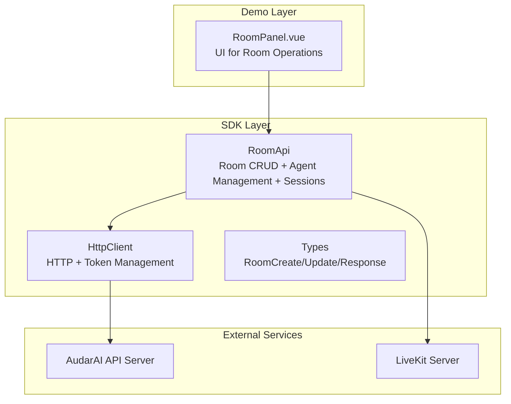
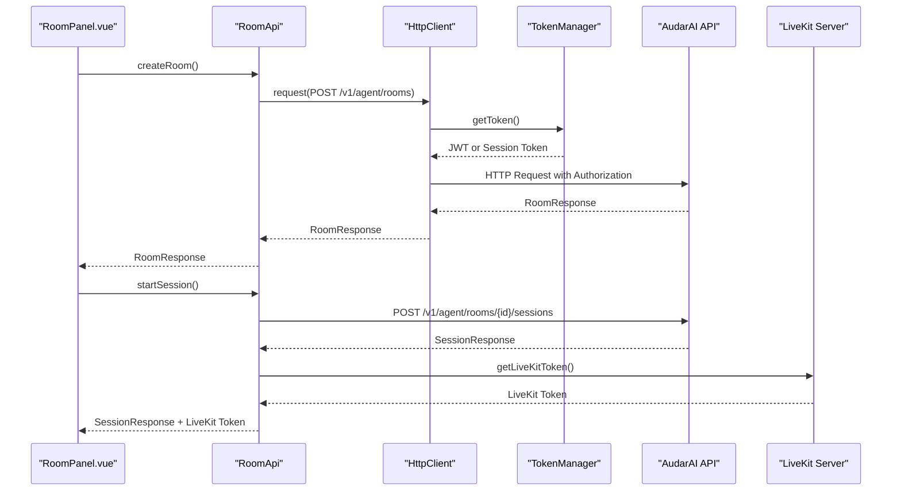
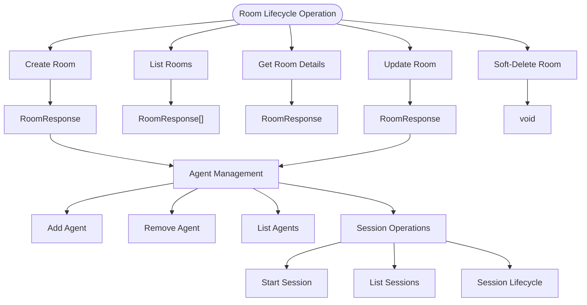
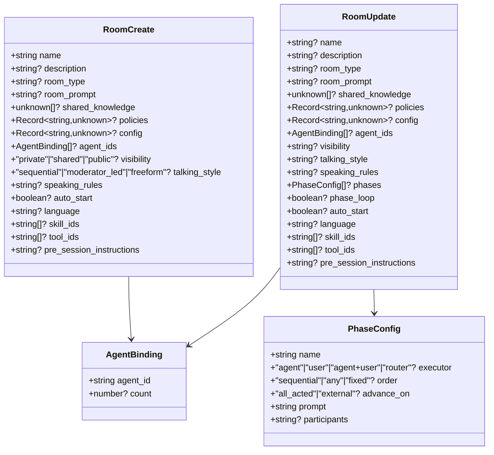
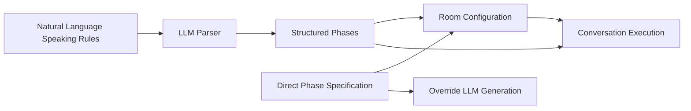
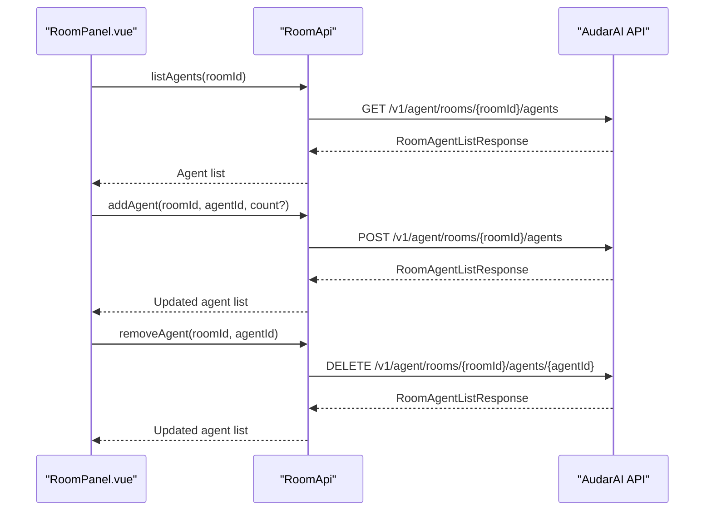
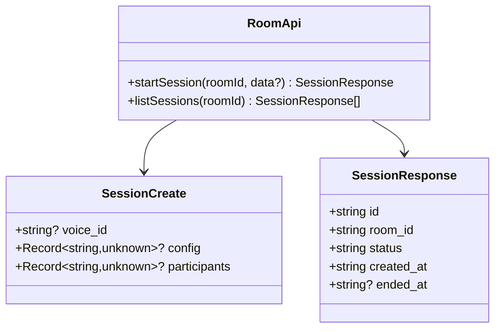
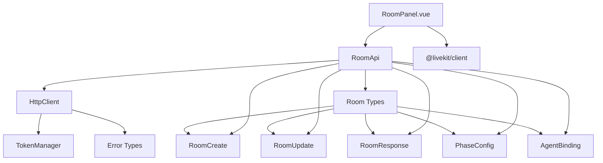

# Room Management

<cite>
**Referenced Files in This Document**
- [room.ts](file://src/room.ts)
- [client.ts](file://src/client.ts)
- [types.ts](file://src/types.ts)
- [RoomPanel.vue](file://demo/src/components/RoomPanel.vue)
- [README.md](file://README.md)
</cite>

## Table of Contents
1. [Introduction](#introduction)
2. [Project Structure](#project-structure)
3. [Core Components](#core-components)
4. [Architecture Overview](#architecture-overview)
5. [Detailed Component Analysis](#detailed-component-analysis)
6. [Dependency Analysis](#dependency-analysis)
7. [Performance Considerations](#performance-considerations)
8. [Troubleshooting Guide](#troubleshooting-guide)
9. [Conclusion](#conclusion)

## Introduction
This document provides comprehensive documentation for Room Management within the AudarAI platform. It covers room lifecycle operations (creation, listing, retrieval, updates, and deletion), room configuration options, speaking rules and phase generation, agent management within rooms, session lifecycle, and practical examples. It also addresses security considerations, access control patterns, performance optimization, scalability, and troubleshooting room connectivity issues.

## Project Structure
The Room Management functionality is implemented in the SDK with a clear separation of concerns:
- Room API client encapsulated in a dedicated class
- HTTP client with robust authentication and token management
- Strongly typed request/response interfaces
- Demo application showcasing room operations and voice sessions



**Diagram sources**
- [room.ts:1-108](file://src/room.ts#L1-L108)
- [client.ts:93-213](file://src/client.ts#L93-L213)
- [types.ts:706-796](file://src/types.ts#L706-L796)

**Section sources**
- [room.ts:1-108](file://src/room.ts#L1-L108)
- [client.ts:93-213](file://src/client.ts#L93-L213)
- [types.ts:706-796](file://src/types.ts#L706-L796)

## Core Components
The Room Management system consists of several key components:

### RoomApi Class
The primary interface for room operations, providing:
- Room CRUD operations (list, create, get, update, delete)
- Agent management within rooms (list, add, remove)
- Phase generation from speaking rules
- Session management within rooms

### HttpClient and Token Management
Robust HTTP client with automatic token refresh, error handling, and WebSocket token support.

### Type Definitions
Comprehensive TypeScript interfaces defining room configuration, agent bindings, phase structures, and session management.

**Section sources**
- [room.ts:4-108](file://src/room.ts#L4-L108)
- [client.ts:93-213](file://src/client.ts#L93-L213)
- [types.ts:706-796](file://src/types.ts#L706-L796)

## Architecture Overview
The room management architecture follows a layered approach with clear separation between presentation, business logic, and data access layers.



**Diagram sources**
- [room.ts:13-99](file://src/room.ts#L13-L99)
- [client.ts:133-213](file://src/client.ts#L133-L213)

## Detailed Component Analysis

### Room Lifecycle Operations
Room lifecycle encompasses creation, listing, retrieval, updates, and soft-deletion:



**Diagram sources**
- [room.ts:9-34](file://src/room.ts#L9-L34)
- [room.ts:52-69](file://src/room.ts#L52-L69)
- [room.ts:82-107](file://src/room.ts#L82-L107)

#### Room Creation
Rooms support extensive configuration including:
- Basic metadata (name, description, room_type)
- Access control (visibility: private/shared/public)
- Conversation flow (talking_style: sequential/moderator_led/freeform)
- Agent bindings with instance counts
- Language settings
- Knowledge and tool bindings
- Pre-session instructions
- Automatic session start

#### Room Updates
Rooms can be updated with granular control over:
- Configuration changes without regenerating phases
- Direct phase specification bypassing LLM generation
- Phase loop configuration
- Speaking rules regeneration via LLM

#### Soft-Deletion Pattern
Rooms are archived rather than permanently deleted, preserving historical data and relationships.

**Section sources**
- [room.ts:9-34](file://src/room.ts#L9-L34)
- [types.ts:706-764](file://src/types.ts#L706-L764)

### Room Configuration Options
Room configuration encompasses multiple dimensions:



**Diagram sources**
- [types.ts:706-764](file://src/types.ts#L706-L764)
- [types.ts:675-679](file://src/types.ts#L675-L679)
- [types.ts:680-704](file://src/types.ts#L680-L704)

### Speaking Rules and Phase Generation
The system supports natural language speaking rules that are parsed into structured phases:



**Diagram sources**
- [room.ts:39-48](file://src/room.ts#L39-L48)
- [types.ts:680-704](file://src/types.ts#L680-L704)

### Agent Management Within Rooms
Room agent management provides fine-grained control over agent assignments:



**Diagram sources**
- [room.ts:52-69](file://src/room.ts#L52-L69)

### Session Management
Rooms orchestrate multiple concurrent sessions with flexible configuration:



**Diagram sources**
- [room.ts:82-99](file://src/room.ts#L82-L99)
- [types.ts:766-796](file://src/types.ts#L766-L796)

**Section sources**
- [room.ts:52-69](file://src/room.ts#L52-L69)
- [room.ts:82-107](file://src/room.ts#L82-L107)

### Practical Examples

#### Room Creation with Configuration
```typescript
// Example: Creating a room with comprehensive configuration
const room = await client.agent.rooms.create({
  name: 'Customer Support Room',
  description: 'Real-time voice support for customers',
  room_type: 'direct',
  room_prompt: 'You are a helpful customer support agent',
  visibility: 'private',
  talking_style: 'sequential',
  language: 'en',
  auto_start: true,
  agent_ids: [
    { agent_id: 'agent-uuid-1', count: 2 },
    { agent_id: 'agent-uuid-2' }
  ],
  skill_ids: ['skill-uuid-1'],
  tool_ids: ['tool-uuid-1']
});
```

#### Agent Assignment and Management
```typescript
// Add agents to room
const agents = await client.agent.rooms.addAgent(roomId, 'agent-uuid', 3);

// List room agents
const agentList = await client.agent.rooms.listAgents(roomId);

// Remove agent from room
const updatedList = await client.agent.rooms.removeAgent(roomId, 'agent-uuid');
```

#### Room Updates and Phase Generation
```typescript
// Update room configuration
await client.agent.rooms.update(roomId, {
  name: 'Updated Support Room',
  visibility: 'shared',
  talking_style: 'moderator_led'
});

// Generate phases from speaking rules
await client.agent.rooms.generatePhases(roomId, `
  Customer service conversation should follow this flow:
  1. Greet customer and confirm identity
  2. Listen to customer issue
  3. Provide solution or escalate
  4. Confirm resolution
`);
```

#### Session Operations
```typescript
// Start a new session
const session = await client.agent.rooms.startSession(roomId, {
  voice_id: 'en-US-female'
});

// List room sessions
const sessions = await client.agent.rooms.listSessions(roomId);
```

**Section sources**
- [RoomPanel.vue:90-116](file://demo/src/components/RoomPanel.vue#L90-L116)
- [RoomPanel.vue:270-293](file://demo/src/components/RoomPanel.vue#L270-L293)
- [RoomPanel.vue:183-210](file://demo/src/components/RoomPanel.vue#L183-L210)
- [RoomPanel.vue:300-313](file://demo/src/components/RoomPanel.vue#L300-L313)

## Dependency Analysis
The room management system exhibits clean dependency relationships:



**Diagram sources**
- [room.ts:1-2](file://src/room.ts#L1-L2)
- [client.ts:22-91](file://src/client.ts#L22-L91)
- [types.ts:706-796](file://src/types.ts#L706-L796)

**Section sources**
- [room.ts:1-2](file://src/room.ts#L1-L2)
- [client.ts:22-91](file://src/client.ts#L22-L91)
- [types.ts:706-796](file://src/types.ts#L706-L796)

## Performance Considerations
Several performance optimization strategies are implemented:

### Token Management
- Proactive token refresh (default 30 seconds before expiry)
- Mutex prevention of concurrent refresh calls
- Automatic retry on 401 responses

### Connection Optimization
- Pre-warming DNS/TLS for LiveKit servers
- Parallel API calls and microphone permission requests
- Efficient WebSocket token management

### Scalability Patterns
- Pagination support for room and session listings
- Configurable page sizes for optimal memory usage
- Asynchronous operations for large-scale deployments

**Section sources**
- [client.ts:22-91](file://src/client.ts#L22-L91)
- [client.ts:380-409](file://src/client.ts#L380-L409)
- [RoomPanel.vue:1208-1217](file://demo/src/components/RoomPanel.vue#L1208-L1217)

## Troubleshooting Guide

### Authentication Issues
Common authentication problems and solutions:
- **401 Unauthorized**: Token expired or invalid - SDK automatically refreshes tokens
- **403 Forbidden**: Insufficient permissions or invalid API key
- **Invalid Credentials**: Check authentication mode configuration

### Room Connectivity Issues
- **LiveKit Connection Failures**: Verify network connectivity and firewall settings
- **Token Exchange Problems**: Ensure proper authentication mode selection
- **Session Join Failures**: Check session status and participant limits

### Performance Troubleshooting
- **Slow Room Loading**: Monitor API response times and consider pagination
- **High Latency**: Check network conditions and consider pre-warming connections
- **Memory Leaks**: Ensure proper cleanup of audio elements and event listeners

### Common Error Scenarios
The SDK provides specific error types for different failure modes:
- AuthenticationError: Invalid or expired credentials
- InsufficientBalanceError: Account balance depleted
- RateLimitedError: Too many requests within time window
- ApiError: General API errors with detailed messages

**Section sources**
- [client.ts:187-213](file://src/client.ts#L187-L213)
- [RoomPanel.vue:504-518](file://demo/src/components/RoomPanel.vue#L504-L518)

## Conclusion
The Room Management system provides a comprehensive, production-ready solution for managing multi-agent voice rooms with robust lifecycle operations, flexible configuration options, and strong security controls. The architecture emphasizes separation of concerns, type safety, and performance optimization while maintaining ease of use through the demo application. The system supports scalable deployment patterns and includes comprehensive error handling and troubleshooting capabilities.

Key strengths include:
- Complete room lifecycle management
- Flexible agent binding and management
- Structured phase-based conversation flows
- Robust authentication and security patterns
- Performance-optimized client architecture
- Comprehensive TypeScript type definitions
- Interactive demo application for exploration

The system is designed to scale from small deployments to enterprise-level applications while maintaining reliability and developer experience.