# Session Management

<cite>
**Referenced Files in This Document**
- [session.ts](file://src/session.ts)
- [room.ts](file://src/room.ts)
- [types.ts](file://src/types.ts)
- [client.ts](file://src/client.ts)
- [channel.ts](file://src/channel.ts)
- [README.md](file://README.md)
- [RoomPanel.vue](file://demo/src/components/RoomPanel.vue)
- [ConnectPanel.vue](file://demo/src/components/ConnectPanel.vue)
- [useClient.ts](file://demo/src/composables/useClient.ts)
</cite>

## Table of Contents
1. [Introduction](#introduction)
2. [Project Structure](#project-structure)
3. [Core Components](#core-components)
4. [Architecture Overview](#architecture-overview)
5. [Detailed Component Analysis](#detailed-component-analysis)
6. [Dependency Analysis](#dependency-analysis)
7. [Performance Considerations](#performance-considerations)
8. [Troubleshooting Guide](#troubleshooting-guide)
9. [Conclusion](#conclusion)
10. [Appendices](#appendices)

## Introduction
This document provides comprehensive documentation for Session Management within the AudarAI JavaScript/TypeScript SDK. It covers the session lifecycle, state tracking, voice room coordination, participant management, voice configuration overrides, and session listing. It also explains session state transitions, participant role management, real-time session monitoring, persistence patterns, cleanup procedures, troubleshooting, scalability, concurrent session handling, and integration with room management and channel communication systems.

## Project Structure
The SDK exposes session management through a dedicated API surface that integrates with room management and LiveKit voice rooms. The primary building blocks are:
- Session API: lifecycle, participants, messages, voice token acquisition, and actions
- Room API: room-centric session creation and listing
- Types: strongly-typed request/response shapes for sessions, participants, and voice configuration
- Client: HTTP client and token management for authentication and WebSocket token exchange
- Demo: RoomPanel demonstrates end-to-end session lifecycle and voice room coordination

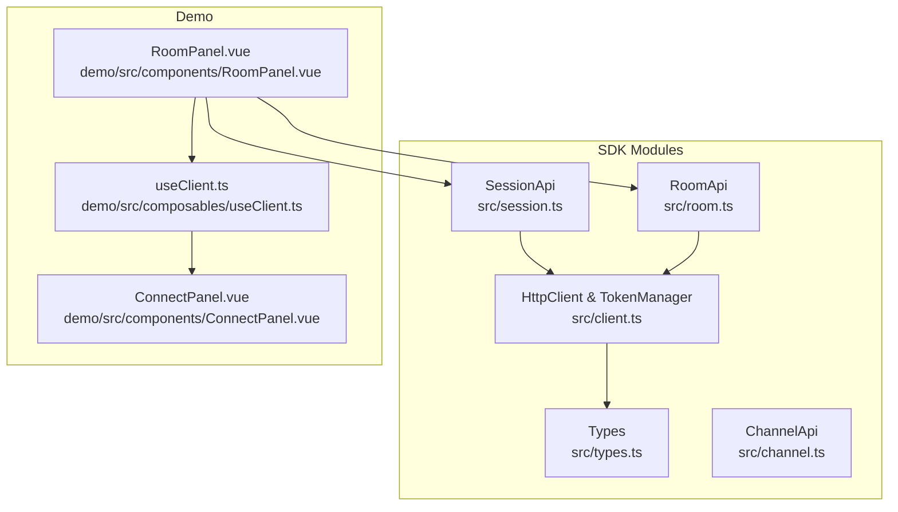

**Diagram sources**
- [session.ts:1-235](file://src/session.ts#L1-L235)
- [room.ts:1-108](file://src/room.ts#L1-L108)
- [client.ts:93-213](file://src/client.ts#L93-L213)
- [types.ts:809-893](file://src/types.ts#L809-L893)
- [channel.ts:1-44](file://src/channel.ts#L1-L44)
- [RoomPanel.vue:1-800](file://demo/src/components/RoomPanel.vue#L1-L800)
- [ConnectPanel.vue:1-336](file://demo/src/components/ConnectPanel.vue#L1-L336)
- [useClient.ts:1-36](file://demo/src/composables/useClient.ts#L1-L36)

**Section sources**
- [session.ts:1-235](file://src/session.ts#L1-L235)
- [room.ts:1-108](file://src/room.ts#L1-L108)
- [client.ts:93-213](file://src/client.ts#L93-L213)
- [types.ts:809-893](file://src/types.ts#L809-L893)
- [channel.ts:1-44](file://src/channel.ts#L1-L44)
- [RoomPanel.vue:1-800](file://demo/src/components/RoomPanel.vue#L1-L800)
- [ConnectPanel.vue:1-336](file://demo/src/components/ConnectPanel.vue#L1-L336)
- [useClient.ts:1-36](file://demo/src/composables/useClient.ts#L1-L36)

## Core Components
- SessionApi: Provides session lifecycle operations (list, get, pause, resume, end), participant management, message history, voice token acquisition, and session actions.
- RoomApi: Manages room-centric session creation and listing, enabling voice configuration overrides at session start.
- HttpClient: Handles HTTP requests, authentication, token refresh, and response parsing.
- Types: Defines session, participant, voice configuration, and action data structures.
- Demo RoomPanel: Demonstrates practical session lifecycle, participant listing, voice room joining, and real-time monitoring.

Key responsibilities:
- Session lifecycle: creation, pausing/resuming, termination, and listing
- Participant management: listing participants, managing roles, and context overrides
- Voice coordination: LiveKit token minting, joining existing sessions, and moderator-led dispatch
- Persistence and actions: message history, action recording, and aggregated counts

**Section sources**
- [session.ts:10-233](file://src/session.ts#L10-L233)
- [room.ts:72-107](file://src/room.ts#L72-L107)
- [client.ts:93-213](file://src/client.ts#L93-L213)
- [types.ts:809-893](file://src/types.ts#L809-L893)
- [RoomPanel.vue:295-398](file://demo/src/components/RoomPanel.vue#L295-L398)

## Architecture Overview
The session management architecture centers around the SessionApi and RoomApi, backed by an HTTP client that manages authentication and token exchange. Voice room coordination is integrated via LiveKit tokens obtained through the session API.

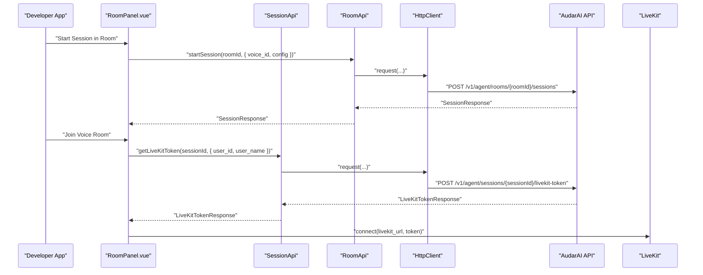

**Diagram sources**
- [room.ts:82-98](file://src/room.ts#L82-L98)
- [session.ts:137-143](file://src/session.ts#L137-L143)
- [client.ts:133-173](file://src/client.ts#L133-L173)
- [RoomPanel.vue:635-664](file://demo/src/components/RoomPanel.vue#L635-L664)

## Detailed Component Analysis

### Session Lifecycle Management
Session lifecycle operations include listing sessions, retrieving session details, pausing, resuming, and ending sessions. These operations are exposed through SessionApi and integrate with room management for room-scoped listings.

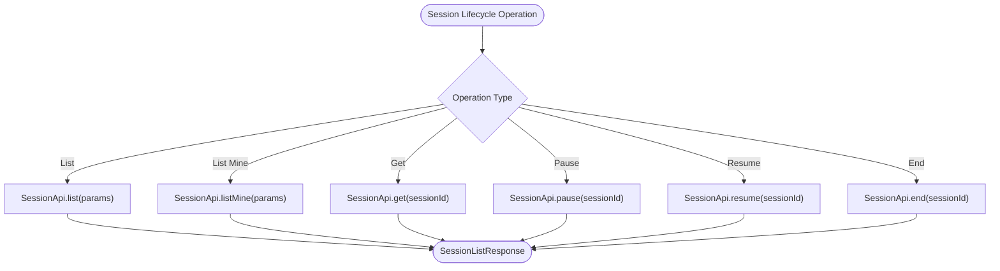

Practical examples (paths):
- Listing sessions with filters: [SessionApi.list:10-14](file://src/session.ts#L10-L14)
- Listing current user’s sessions: [SessionApi.listMine:17-21](file://src/session.ts#L17-L21)
- Retrieving a session: [SessionApi.get:23-25](file://src/session.ts#L23-L25)
- Pausing a session: [SessionApi.pause:27-29](file://src/session.ts#L27-L29)
- Resuming a session: [SessionApi.resume:31-33](file://src/session.ts#L31-L33)
- Ending a session: [SessionApi.end:35-37](file://src/session.ts#L35-L37)

Room-scoped operations:
- Starting a session in a room with voice override: [RoomApi.startSession:82-98](file://src/room.ts#L82-L98)
- Listing sessions for a room: [RoomApi.listSessions:101-107](file://src/room.ts#L101-L107)

**Diagram sources**
- [session.ts:10-37](file://src/session.ts#L10-L37)
- [room.ts:82-107](file://src/room.ts#L82-L107)

**Section sources**
- [session.ts:10-37](file://src/session.ts#L10-L37)
- [room.ts:82-107](file://src/room.ts#L82-L107)

### Session State Tracking and Transitions
Session state transitions are managed server-side and reflected in the session response. The demo illustrates state transitions through pause/resume/end operations.

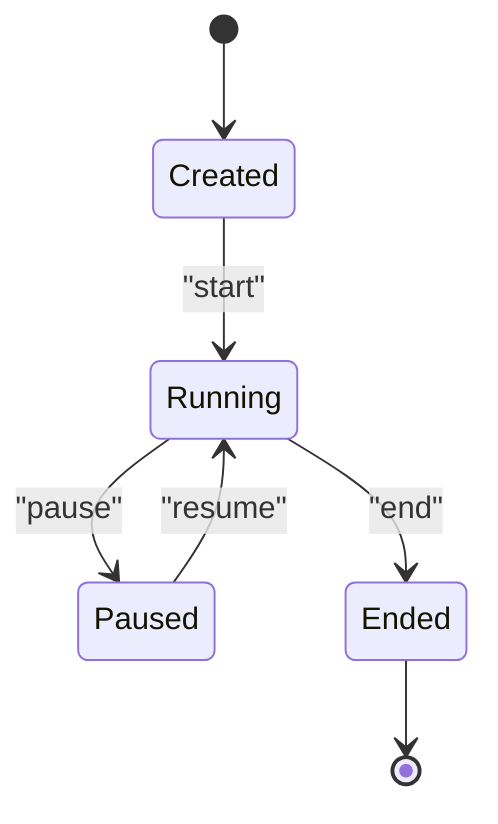

Operational notes:
- Status is part of the session response and can be used to filter lists.
- Room-scoped sessions may be auto-started depending on room configuration.

**Section sources**
- [types.ts:859-872](file://src/types.ts#L859-L872)
- [room.ts:726-727](file://src/room.ts#L726-L727)

### Participant Management and Role Management
Managing participants involves listing participants, configuring roles, and applying context overrides. Roles and context can be customized per participant.

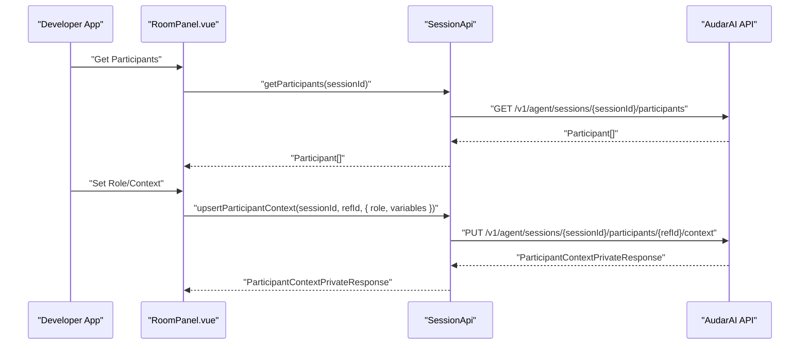

Practical examples (paths):
- Listing participants: [SessionApi.getParticipants:56-58](file://src/session.ts#L56-L58)
- Upserting participant context: [SessionApi.upsertParticipantContext:79-92](file://src/session.ts#L79-L92)
- Deleting participant context: [SessionApi.deleteParticipantContext:95-100](file://src/session.ts#L95-L100)

**Diagram sources**
- [session.ts:56-100](file://src/session.ts#L56-L100)

**Section sources**
- [session.ts:56-100](file://src/session.ts#L56-L100)
- [types.ts:811-835](file://src/types.ts#L811-L835)
- [types.ts:1198-1232](file://src/types.ts#L1198-L1232)

### Voice Room Coordination and LiveKit Integration
Voice room coordination is achieved through LiveKit token acquisition and joining existing sessions. The demo shows both creating a token for a new participant and joining an already-active session.

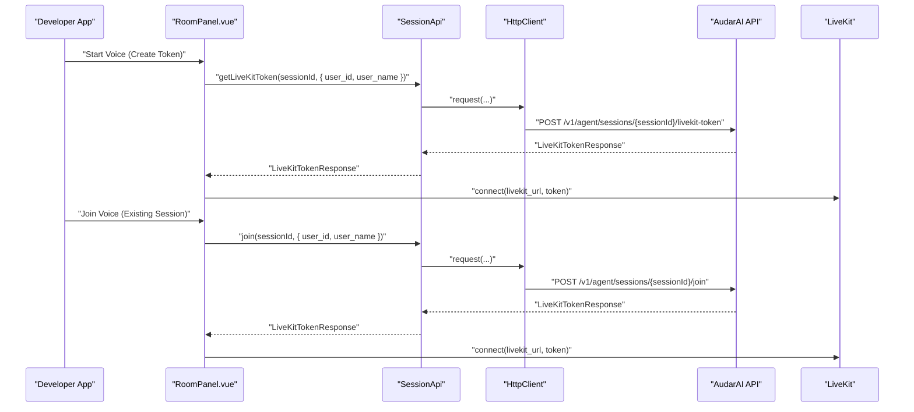

Practical examples (paths):
- Getting a LiveKit token: [SessionApi.getLiveKitToken:137-143](file://src/session.ts#L137-L143)
- Joining an existing session: [SessionApi.join:154-160](file://src/session.ts#L154-L160)

Room-level voice configuration overrides:
- Overriding voice at session creation: [RoomApi.startSession:82-98](file://src/room.ts#L82-L98)

**Diagram sources**
- [session.ts:137-160](file://src/session.ts#L137-L160)
- [room.ts:82-98](file://src/room.ts#L82-L98)
- [RoomPanel.vue:635-692](file://demo/src/components/RoomPanel.vue#L635-L692)

**Section sources**
- [session.ts:137-160](file://src/session.ts#L137-L160)
- [room.ts:82-98](file://src/room.ts#L82-L98)
- [RoomPanel.vue:635-692](file://demo/src/components/RoomPanel.vue#L635-L692)

### Session Listing and Filtering
Session listing supports pagination and status filtering. RoomApi also provides room-scoped session listing.

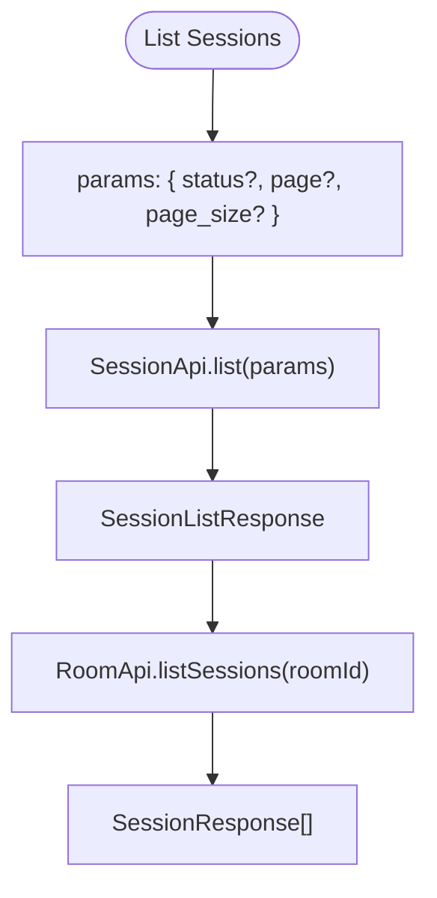

Practical examples (paths):
- Listing sessions: [SessionApi.list:10-14](file://src/session.ts#L10-L14)
- Listing current user’s sessions: [SessionApi.listMine:17-21](file://src/session.ts#L17-L21)
- Listing room sessions: [RoomApi.listSessions:101-107](file://src/room.ts#L101-L107)

**Diagram sources**
- [session.ts:10-21](file://src/session.ts#L10-L21)
- [room.ts:101-107](file://src/room.ts#L101-L107)

**Section sources**
- [session.ts:10-21](file://src/session.ts#L10-L21)
- [room.ts:101-107](file://src/room.ts#L101-L107)

### Message History and Moderator Dispatch
Session messages and moderator-led dispatch enable controlled agent participation and real-time interaction.

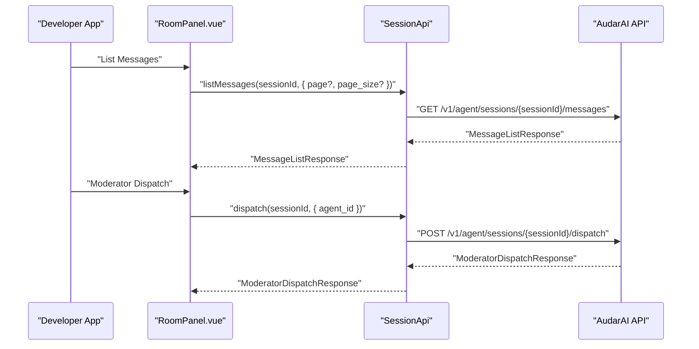

Practical examples (paths):
- Listing messages: [SessionApi.listMessages:104-113](file://src/session.ts#L104-L113)
- Appending a message: [SessionApi.appendMessage:115-124](file://src/session.ts#L115-L124)
- Dispatching an agent: [SessionApi.dispatch:173-179](file://src/session.ts#L173-L179)
- Direct reply to member: [SessionApi.replyToMember:190-192](file://src/session.ts#L190-L192)

**Diagram sources**
- [session.ts:104-124](file://src/session.ts#L104-L124)
- [session.ts:173-192](file://src/session.ts#L173-L192)

**Section sources**
- [session.ts:104-124](file://src/session.ts#L104-L124)
- [session.ts:173-192](file://src/session.ts#L173-L192)

### Session Actions and Aggregation
Session actions capture participant-driven activities (e.g., votes, answers, scores) with uniqueness constraints and aggregated counts.

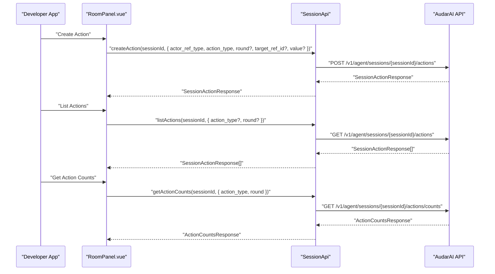

Practical examples (paths):
- Creating an action: [SessionApi.createAction:200-209](file://src/session.ts#L200-L209)
- Listing actions: [SessionApi.listActions:212-221](file://src/session.ts#L212-L221)
- Getting action counts: [SessionApi.getActionCounts:224-233](file://src/session.ts#L224-L233)

**Diagram sources**
- [session.ts:200-233](file://src/session.ts#L200-L233)

**Section sources**
- [session.ts:200-233](file://src/session.ts#L200-L233)

### Session Persistence Patterns and Cleanup
Persistence patterns:
- Sessions persist server-side with status, participants, and metrics snapshots.
- Messages and actions are stored per session for auditability and analytics.
- Recording metadata is maintained separately and can be queried post-session.

Cleanup procedures:
- Ending a session terminates voice room participation and marks the session as ended.
- Deleting room archives sessions (soft-delete) and removes them from active rotation.

Practical examples (paths):
- Ending a session: [SessionApi.end:35-37](file://src/session.ts#L35-L37)
- Deleting a room: [RoomApi.delete:32-34](file://src/room.ts#L32-L34)

**Section sources**
- [session.ts:35-37](file://src/session.ts#L35-L37)
- [room.ts:32-34](file://src/room.ts#L32-L34)

### Real-Time Session Monitoring
Real-time monitoring is demonstrated in the demo through LiveKit room events and subtitle updates.

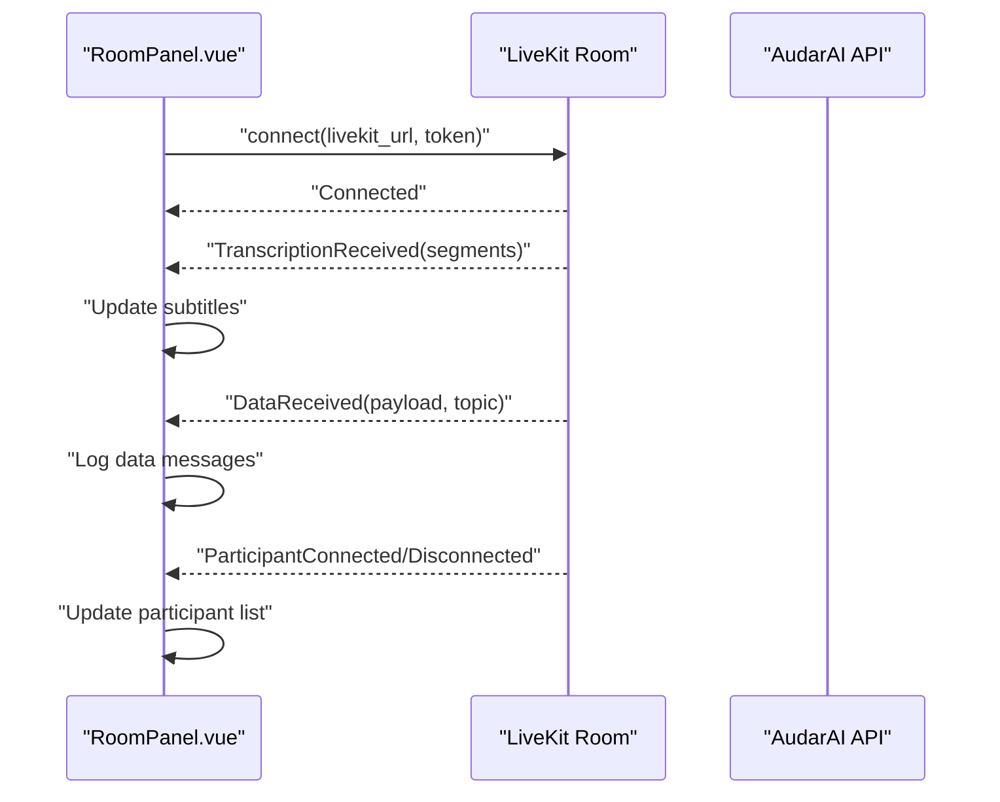

Practical examples (paths):
- LiveKit connection and event handling: [RoomPanel voice handlers:527-626](file://demo/src/components/RoomPanel.vue#L527-L626)
- Transcription and data message logging: [RoomPanel events:591-621](file://demo/src/components/RoomPanel.vue#L591-L621)

**Diagram sources**
- [RoomPanel.vue:527-626](file://demo/src/components/RoomPanel.vue#L527-L626)

**Section sources**
- [RoomPanel.vue:527-626](file://demo/src/components/RoomPanel.vue#L527-L626)

### Practical Examples

#### Session Startup with Voice Overrides
- Start a session in a room with a specific voice override:
  - [RoomApi.startSession:82-98](file://src/room.ts#L82-L98)
- Retrieve LiveKit token for voice room:
  - [SessionApi.getLiveKitToken:137-143](file://src/session.ts#L137-L143)
- Join an existing session:
  - [SessionApi.join:154-160](file://src/session.ts#L154-L160)

#### Participant Configuration
- List participants:
  - [SessionApi.getParticipants:56-58](file://src/session.ts#L56-L58)
- Upsert participant context (roles, variables, overrides):
  - [SessionApi.upsertParticipantContext:79-92](file://src/session.ts#L79-L92)
- Delete participant context:
  - [SessionApi.deleteParticipantContext:95-100](file://src/session.ts#L95-L100)

#### Session Listing
- List all sessions with filters:
  - [SessionApi.list:10-14](file://src/session.ts#L10-L14)
- List current user’s sessions:
  - [SessionApi.listMine:17-21](file://src/session.ts#L17-L21)
- List room sessions:
  - [RoomApi.listSessions:101-107](file://src/room.ts#L101-L107)

#### Session Lifecycle Management
- Get session details:
  - [SessionApi.get:23-25](file://src/session.ts#L23-L25)
- Pause/resume/end:
  - [SessionApi.pause:27-29](file://src/session.ts#L27-L29)
  - [SessionApi.resume:31-33](file://src/session.ts#L31-L33)
  - [SessionApi.end:35-37](file://src/session.ts#L35-L37)

#### Moderator Dispatch and Real-Time Interaction
- Dispatch an agent to respond:
  - [SessionApi.dispatch:173-179](file://src/session.ts#L173-L179)
- Reply to a specific member:
  - [SessionApi.replyToMember:190-192](file://src/session.ts#L190-L192)
- Manage messages:
  - [SessionApi.listMessages:104-113](file://src/session.ts#L104-L113)
  - [SessionApi.appendMessage:115-124](file://src/session.ts#L115-L124)

**Section sources**
- [room.ts:82-98](file://src/room.ts#L82-L98)
- [session.ts:137-192](file://src/session.ts#L137-L192)
- [session.ts:10-21](file://src/session.ts#L10-L21)
- [session.ts:23-37](file://src/session.ts#L23-L37)
- [session.ts:104-124](file://src/session.ts#L104-L124)

## Dependency Analysis
Session management depends on:
- RoomApi for room-centric session creation and listing
- SessionApi for session lifecycle, participants, messages, voice tokens, and actions
- HttpClient for authentication, token refresh, and request/response handling
- Types for request/response shapes and configuration overrides

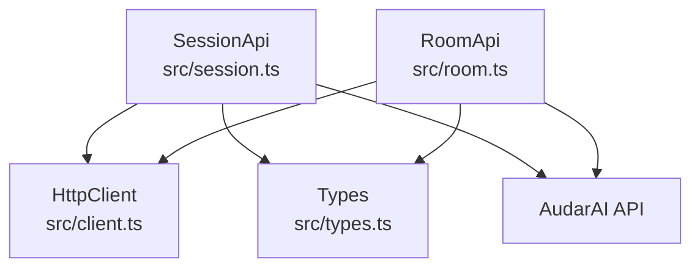

**Diagram sources**
- [session.ts:1-235](file://src/session.ts#L1-L235)
- [room.ts:1-108](file://src/room.ts#L1-L108)
- [client.ts:93-213](file://src/client.ts#L93-L213)
- [types.ts:809-893](file://src/types.ts#L809-L893)

**Section sources**
- [session.ts:1-235](file://src/session.ts#L1-L235)
- [room.ts:1-108](file://src/room.ts#L1-L108)
- [client.ts:93-213](file://src/client.ts#L93-L213)
- [types.ts:809-893](file://src/types.ts#L809-L893)

## Performance Considerations
- Token refresh: HttpClient proactively refreshes tokens before expiry to minimize latency spikes.
- Concurrency: TokenManager uses a mutex to prevent concurrent refreshes.
- Pre-warming: Client supports pre-warming DNS/TLS for LiveKit to reduce voice room connection latency.
- Pagination: Session listing supports pagination to handle large datasets efficiently.

[No sources needed since this section provides general guidance]

## Troubleshooting Guide
Common issues and resolutions:
- Authentication failures: Ensure correct authentication mode and credentials; use onTokenRefresh for dynamic tokens.
- 401 Unauthorized: HttpClient automatically retries with refreshed tokens; verify token provider configuration.
- Rate limiting: Respect Retry-After header and implement exponential backoff.
- Session not found: Verify session ID and room membership; ensure session is in expected state.
- Voice room connection issues: Confirm LiveKit URL and token validity; pre-warm connections when possible.

**Section sources**
- [client.ts:133-173](file://src/client.ts#L133-L173)
- [client.ts:187-212](file://src/client.ts#L187-L212)
- [RoomPanel.vue:635-692](file://demo/src/components/RoomPanel.vue#L635-L692)

## Conclusion
Session Management in the AudarAI SDK provides a robust, type-safe foundation for building voice-enabled applications. It supports full session lifecycle management, participant coordination, voice room integration, and real-time monitoring. The combination of RoomApi and SessionApi, backed by HttpClient and strong typing, enables scalable, maintainable implementations across diverse use cases.

[No sources needed since this section summarizes without analyzing specific files]

## Appendices

### API Reference Highlights
- Session lifecycle: [SessionApi.list, listMine, get, pause, resume, end:10-37](file://src/session.ts#L10-L37)
- Participants: [getParticipants, upsertParticipantContext, deleteParticipantContext:56-100](file://src/session.ts#L56-L100)
- Messages: [listMessages, appendMessage:104-124](file://src/session.ts#L104-L124)
- Voice: [getLiveKitToken, join:137-160](file://src/session.ts#L137-L160)
- Actions: [createAction, listActions, getActionCounts:200-233](file://src/session.ts#L200-L233)
- Room sessions: [RoomApi.startSession, listSessions:82-107](file://src/room.ts#L82-L107)

**Section sources**
- [session.ts:10-233](file://src/session.ts#L10-L233)
- [room.ts:82-107](file://src/room.ts#L82-L107)