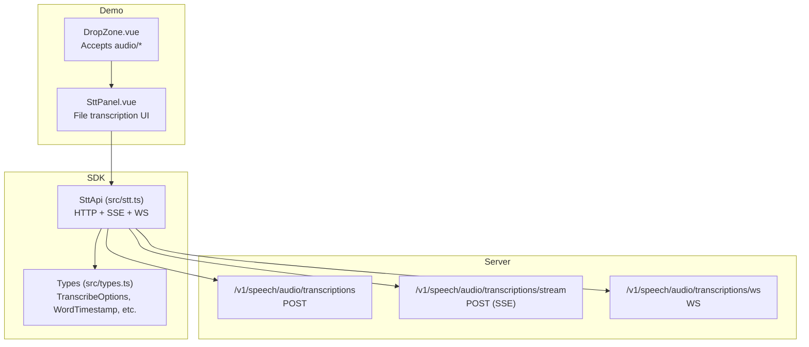
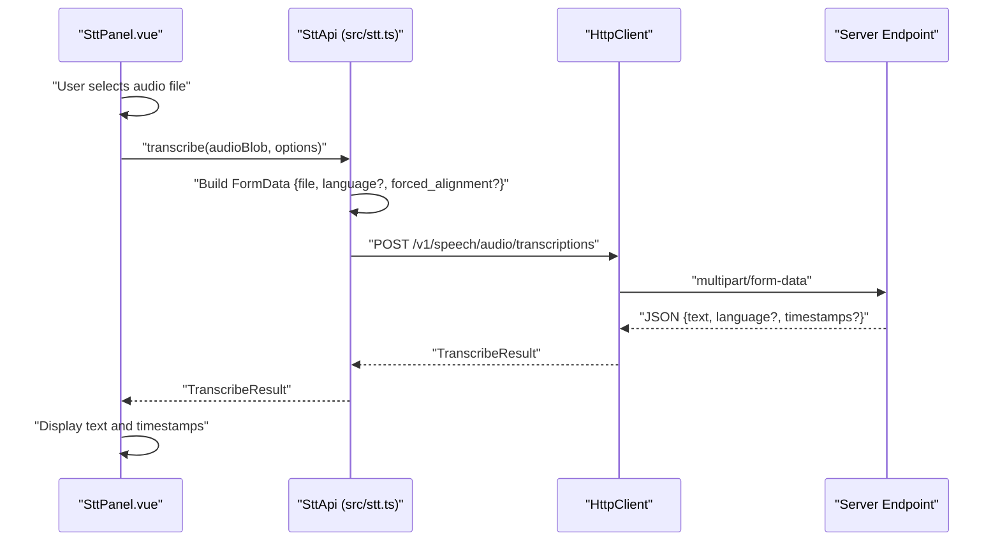
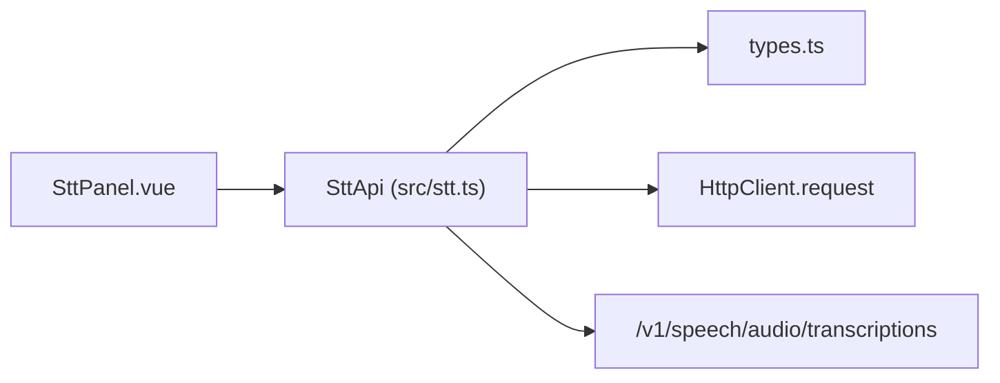
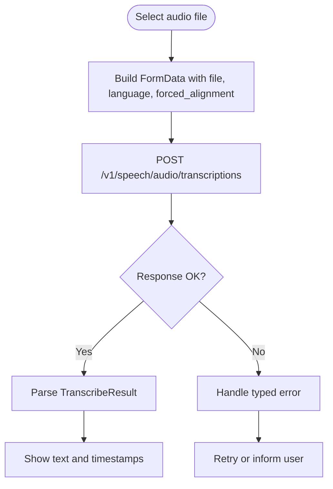

# File-Based Transcription

<cite>
**Referenced Files in This Document**
- [README.md](file://README.md)
- [src/stt.ts](file://src/stt.ts)
- [src/types.ts](file://src/types.ts)
- [demo/src/components/SttPanel.vue](file://demo/src/components/SttPanel.vue)
- [demo/src/components/DropZone.vue](file://demo/src/components/DropZone.vue)
- [demo/src/utils/audio.ts](file://demo/src/utils/audio.ts)
- [src/errors.ts](file://src/errors.ts)
</cite>

## Table of Contents
1. [Introduction](#introduction)
2. [Project Structure](#project-structure)
3. [Core Components](#core-components)
4. [Architecture Overview](#architecture-overview)
5. [Detailed Component Analysis](#detailed-component-analysis)
6. [Dependency Analysis](#dependency-analysis)
7. [Performance Considerations](#performance-considerations)
8. [Troubleshooting Guide](#troubleshooting-guide)
9. [Conclusion](#conclusion)
10. [Appendices](#appendices)

## Introduction
This document explains how to perform file-based speech-to-text transcription using the SDK. It covers:
- The HTTP POST endpoint for audio file processing
- Supported audio formats and upload requirements
- The TranscribeOptions interface and provider configuration
- Practical examples for uploading audio files, handling results with timestamps, and managing large files
- Error handling for unsupported formats, file size limits, and network failures
- Performance considerations for batch processing and troubleshooting guidance for transcription quality

## Project Structure
The SDK exposes a high-level STT API that wraps HTTP endpoints and WebSocket streams. The demo application demonstrates file-based transcription and streaming.

**Diagram sources**
- [src/stt.ts:83-216](file://src/stt.ts#L83-L216)
- [src/types.ts:153-196](file://src/types.ts#L153-L196)
- [demo/src/components/SttPanel.vue:13-96](file://demo/src/components/SttPanel.vue#L13-L96)
- [demo/src/components/DropZone.vue:28-41](file://demo/src/components/DropZone.vue#L28-L41)

**Section sources**
- [README.md:271-338](file://README.md#L271-L338)
- [src/stt.ts:83-216](file://src/stt.ts#L83-L216)
- [src/types.ts:153-196](file://src/types.ts#L153-L196)
- [demo/src/components/SttPanel.vue:13-96](file://demo/src/components/SttPanel.vue#L13-L96)
- [demo/src/components/DropZone.vue:28-41](file://demo/src/components/DropZone.vue#L28-L41)

## Core Components
- SttApi: Provides methods for file-based transcription, SSE streaming, and WebSocket real-time transcription.
- TranscribeOptions: Controls language selection, provider, and forced alignment for word-level timestamps.
- TranscribeResult: Standardized result with text, detected language, and optional timestamps.
- WordTimestamp: Defines per-word start/end times.

Key behaviors:
- File upload uses multipart/form-data with a “file” field.
- Provider selection is supported via query parameter.
- Forced alignment toggles word-level timestamps in results.

**Section sources**
- [src/stt.ts:83-102](file://src/stt.ts#L83-L102)
- [src/stt.ts:116-183](file://src/stt.ts#L116-L183)
- [src/types.ts:153-158](file://src/types.ts#L153-L158)
- [src/types.ts:122-126](file://src/types.ts#L122-L126)

## Architecture Overview
The file-based transcription flow uses an HTTP POST endpoint that accepts an audio file and optional parameters. The demo UI integrates a drag-and-drop zone and exposes language, provider, and forced alignment controls.

**Diagram sources**
- [src/stt.ts:92-102](file://src/stt.ts#L92-L102)
- [demo/src/components/SttPanel.vue:22-49](file://demo/src/components/SttPanel.vue#L22-L49)

## Detailed Component Analysis

### HTTP POST Endpoint for Audio File Processing
- Endpoint: POST /v1/speech/audio/transcriptions
- Body: multipart/form-data
  - file: required (Blob/File)
  - language: optional (string)
  - forced_alignment: optional (boolean)
- Query: provider: optional (string)
- Response: TranscribeResult (text, language, timestamps?)

Notes:
- The SDK builds FormData and appends fields conditionally.
- Provider selection is passed as a query parameter.

**Section sources**
- [src/stt.ts:92-102](file://src/stt.ts#L92-L102)
- [demo/src/components/SttPanel.vue:29-33](file://demo/src/components/SttPanel.vue#L29-L33)

### Supported Audio Formats and Upload Requirements
- The demo’s file input accepts audio/*, enabling common formats.
- The demo utilities map common extensions to MIME types for playback and downloads.
- The server-side accepted formats are determined by the backend; the SDK does not impose restrictions.

Practical guidance:
- Prefer compressed formats (e.g., MP3) for smaller uploads.
- Ensure the file is a single-track, playable audio file recognized by the server.

**Section sources**
- [demo/src/components/DropZone.vue:37](file://demo/src/components/DropZone.vue#L37)
- [demo/src/utils/audio.ts:7-14](file://demo/src/utils/audio.ts#L7-L14)

### TranscribeOptions Interface
Fields:
- language: string (optional)
- forced_alignment: boolean (optional)
- provider: string (optional)

Behavior:
- language influences model behavior and may affect detected language in results.
- forced_alignment enables word-level timestamps when supported by the model/provider.
- provider selects the underlying ASR model/provider.

**Section sources**
- [src/types.ts:153-158](file://src/types.ts#L153-L158)
- [src/stt.ts:92-102](file://src/stt.ts#L92-L102)

### Handling Results with Timestamps
- TranscribeResult may include timestamps when forced_alignment is enabled.
- WordTimestamp includes text, start_time, end_time.

Demo usage:
- The UI displays timestamps and logs them when present.

**Section sources**
- [src/types.ts:122-126](file://src/types.ts#L122-L126)
- [demo/src/components/SttPanel.vue:36-43](file://demo/src/components/SttPanel.vue#L36-L43)

### Practical Examples

#### Example 1: Upload an Audio File and Get Transcription
- Select a file via the demo UI or programmatically.
- Call transcribe with optional language and provider.
- Read result.text and optionally result.timestamps.

References:
- [demo/src/components/SttPanel.vue:22-49](file://demo/src/components/SttPanel.vue#L22-L49)
- [src/stt.ts:92-102](file://src/stt.ts#L92-L102)

#### Example 2: Enable Forced Alignment for Word-Level Timestamps
- Set forced_alignment: true in TranscribeOptions.
- Review result.timestamps for per-word timing.

References:
- [demo/src/components/SttPanel.vue:18](file://demo/src/components/SttPanel.vue#L18)
- [src/types.ts:153-158](file://src/types.ts#L153-L158)

#### Example 3: Manage Large File Uploads
- Use the demo’s file input to select large files.
- Monitor progress via UI logs and loading states.
- For very large files, consider streaming approaches (see SSE/WS below).

References:
- [demo/src/components/SttPanel.vue:26](file://demo/src/components/SttPanel.vue#L26)
- [demo/src/components/DropZone.vue:37](file://demo/src/components/DropZone.vue#L37)

### SSE Streaming Alternative
While the focus here is file-based transcription, the SDK also supports SSE streaming for incremental results. This can be useful for long files or when you want to process results progressively.

References:
- [src/stt.ts:116-183](file://src/stt.ts#L116-L183)
- [demo/src/components/SttPanel.vue:51-96](file://demo/src/components/SttPanel.vue#L51-L96)

## Dependency Analysis
The file-based transcription depends on:
- SttApi.transcribe for HTTP POST
- HttpClient.request for network transport
- FormData for multipart encoding
- Types for TranscribeOptions and TranscribeResult

**Diagram sources**
- [src/stt.ts:83-102](file://src/stt.ts#L83-L102)
- [src/types.ts:153-158](file://src/types.ts#L153-L158)
- [demo/src/components/SttPanel.vue:22-49](file://demo/src/components/SttPanel.vue#L22-L49)

**Section sources**
- [src/stt.ts:83-102](file://src/stt.ts#L83-L102)
- [src/types.ts:153-158](file://src/types.ts#L153-L158)
- [demo/src/components/SttPanel.vue:22-49](file://demo/src/components/SttPanel.vue#L22-L49)

## Performance Considerations
- File size: Larger files increase upload time and server processing time. Consider compressing audio (e.g., MP3) and splitting very long recordings.
- Batch processing: For multiple files, queue requests and stagger concurrency to avoid rate limiting.
- Network reliability: Use retry logic around network failures; the SDK throws typed errors on failures.
- Streaming alternatives: For long files, consider SSE streaming to receive partial results earlier.

[No sources needed since this section provides general guidance]

## Troubleshooting Guide
Common issues and resolutions:
- Unsupported format
  - Symptom: Server rejects the file or returns an error.
  - Resolution: Verify the file is a playable audio file. The demo accepts audio/*; ensure the file extension corresponds to a supported MIME type.
  - References:
    - [demo/src/components/DropZone.vue:37](file://demo/src/components/DropZone.vue#L37)
    - [demo/src/utils/audio.ts:7-14](file://demo/src/utils/audio.ts#L7-L14)

- No timestamps despite forced_alignment
  - Symptom: forced_alignment is requested but timestamps are missing.
  - Resolution: Some models/providers may not emit timestamps even when requested. The demo logs a warning when alignment is unavailable.
  - References:
    - [demo/src/components/SttPanel.vue:80](file://demo/src/components/SttPanel.vue#L80)

- Network failures
  - Symptom: Request fails due to connectivity or timeouts.
  - Resolution: Retry with exponential backoff and handle typed errors.
  - References:
    - [src/errors.ts:1-43](file://src/errors.ts#L1-L43)

- Provider mismatch
  - Symptom: Unexpected results or errors when switching providers.
  - Resolution: Confirm provider availability and defaults via listModels, then pass provider explicitly.
  - References:
    - [src/stt.ts:87-89](file://src/stt.ts#L87-L89)

**Section sources**
- [demo/src/components/SttPanel.vue:80](file://demo/src/components/SttPanel.vue#L80)
- [demo/src/utils/audio.ts:7-14](file://demo/src/utils/audio.ts#L7-L14)
- [src/errors.ts:1-43](file://src/errors.ts#L1-L43)
- [src/stt.ts:87-89](file://src/stt.ts#L87-L89)

## Conclusion
The SDK provides a straightforward HTTP POST endpoint for file-based transcription with flexible options for language, provider, and forced alignment. The demo illustrates how to upload files, handle results, and manage timestamps. For large files or long sessions, consider streaming alternatives and implement robust error handling and retry logic.

[No sources needed since this section summarizes without analyzing specific files]

## Appendices

### API Definition Summary
- Endpoint: POST /v1/speech/audio/transcriptions
- Body fields:
  - file: Blob/File (required)
  - language: string (optional)
  - forced_alignment: boolean (optional)
- Query parameter:
  - provider: string (optional)
- Response:
  - text: string
  - language?: string
  - timestamps?: WordTimestamp[]

**Section sources**
- [src/stt.ts:92-102](file://src/stt.ts#L92-L102)
- [src/types.ts:122-126](file://src/types.ts#L122-L126)

### Example Workflows

#### Workflow: File Upload and Transcription

**Diagram sources**
- [src/stt.ts:92-102](file://src/stt.ts#L92-L102)
- [src/errors.ts:1-43](file://src/errors.ts#L1-L43)