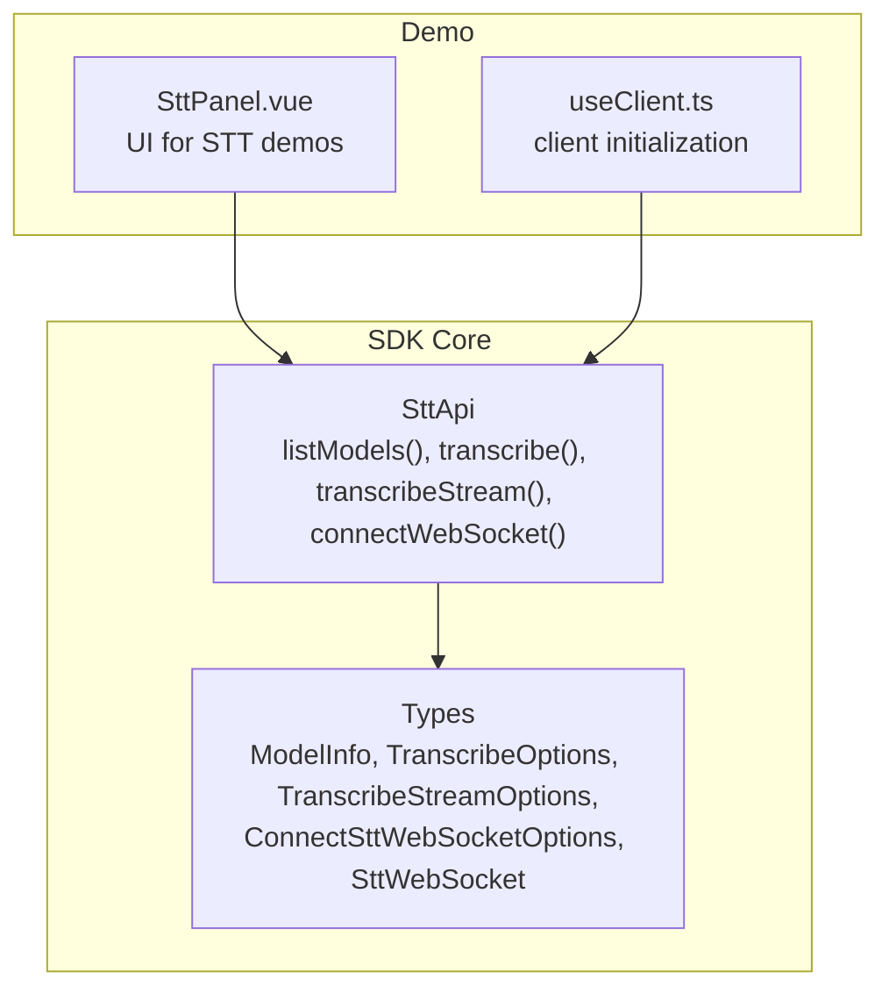
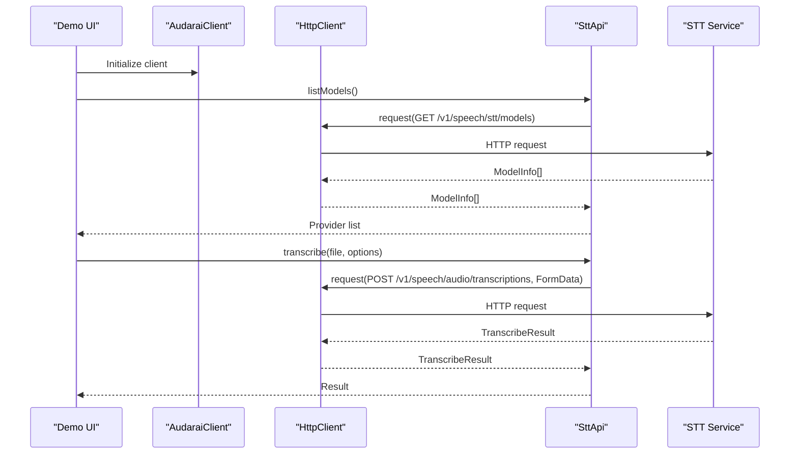
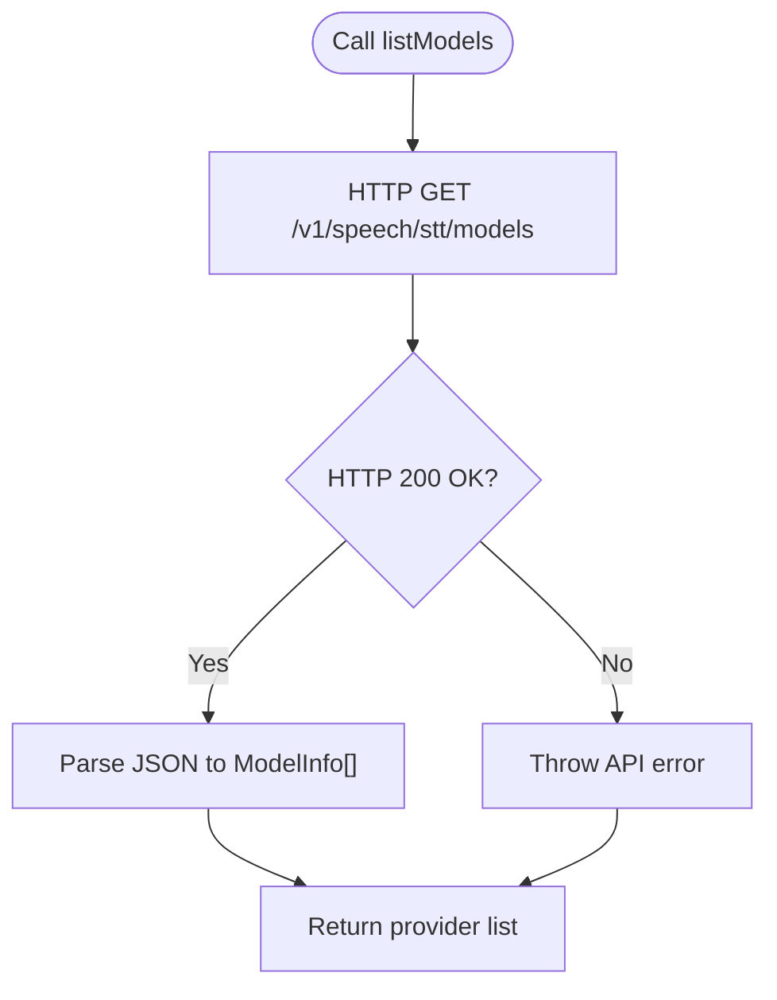
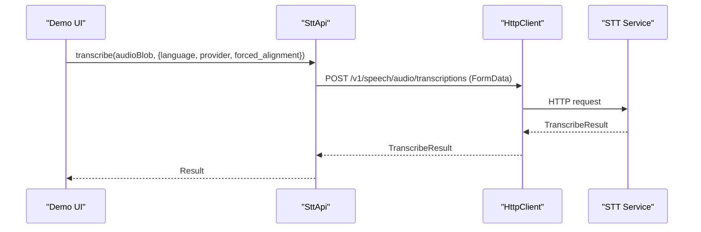
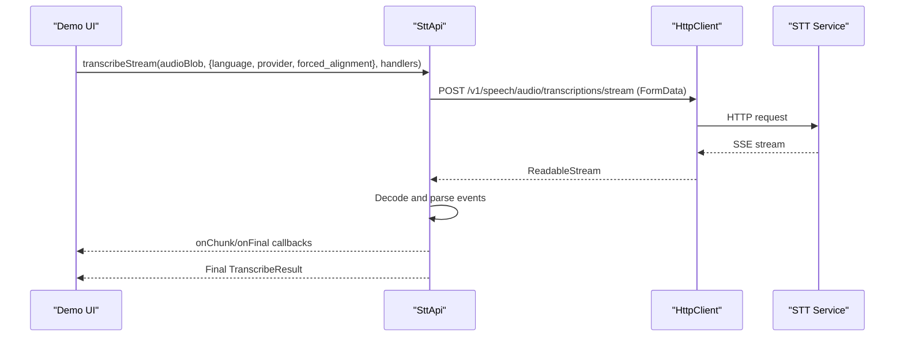
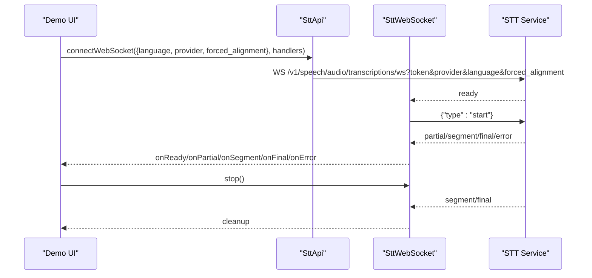
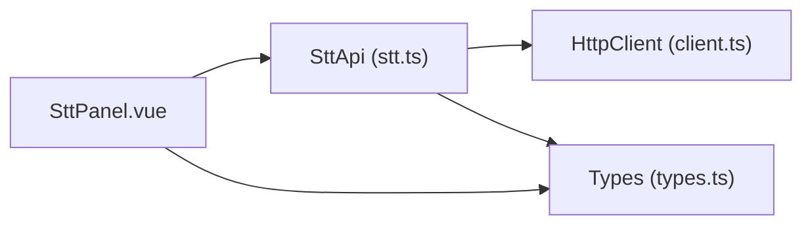

# Model Management & Configuration

<cite>
**Referenced Files in This Document**
- [stt.ts](file://src/stt.ts)
- [types.ts](file://src/types.ts)
- [SttPanel.vue](file://demo/src/components/SttPanel.vue)
- [useClient.ts](file://demo/src/composables/useClient.ts)
- [README.md](file://README.md)
- [package.json](file://package.json)
</cite>

## Table of Contents
1. [Introduction](#introduction)
2. [Project Structure](#project-structure)
3. [Core Components](#core-components)
4. [Architecture Overview](#architecture-overview)
5. [Detailed Component Analysis](#detailed-component-analysis)
6. [Dependency Analysis](#dependency-analysis)
7. [Performance Considerations](#performance-considerations)
8. [Troubleshooting Guide](#troubleshooting-guide)
9. [Conclusion](#conclusion)
10. [Appendices](#appendices)

## Introduction
This document explains how to manage and configure Speech-to-Text (STT) models in the SDK, focusing on:
- Discovering available models via the listModels method
- Understanding the ModelInfo structure and provider capabilities
- Configuring language preferences, provider selection, and forced alignment
- Selecting models for different use cases (accuracy vs speed)
- Handling model availability and regional language support
- Managing model versioning and migration strategies

The goal is to help developers integrate robust STT workflows across file-based transcription, streaming, and real-time WebSocket transcription.

## Project Structure
The STT model management and configuration logic lives primarily in the STT module and its types. The demo showcases practical usage of model discovery and configuration.

**Diagram sources**
- [stt.ts:83-216](file://src/stt.ts#L83-L216)
- [types.ts:111-196](file://src/types.ts#L111-L196)
- [SttPanel.vue:124-139](file://demo/src/components/SttPanel.vue#L124-L139)
- [useClient.ts:21-35](file://demo/src/composables/useClient.ts#L21-L35)

**Section sources**
- [stt.ts:1-217](file://src/stt.ts#L1-L217)
- [types.ts:111-196](file://src/types.ts#L111-L196)
- [SttPanel.vue:1-349](file://demo/src/components/SttPanel.vue#L1-L349)
- [useClient.ts:1-36](file://demo/src/composables/useClient.ts#L1-L36)
- [README.md:271-339](file://README.md#L271-L339)

## Core Components
- SttApi: Provides model discovery and transcription APIs.
- ModelInfo: Describes available STT providers and their capabilities.
- Transcription Options: Configure language, provider, and alignment.
- WebSocket STT: Real-time transcription with typed messages.

Key responsibilities:
- listModels: Fetches provider list from the server.
- transcribe: File-based transcription with optional alignment.
- transcribeStream: SSE streaming transcription with incremental results.
- connectWebSocket: Real-time transcription via WebSocket with typed messages.

**Section sources**
- [stt.ts:83-216](file://src/stt.ts#L83-L216)
- [types.ts:111-196](file://src/types.ts#L111-L196)

## Architecture Overview
The STT subsystem integrates with the HTTP client and exposes typed interfaces for model management and transcription.

**Diagram sources**
- [stt.ts:83-102](file://src/stt.ts#L83-L102)
- [types.ts:153-158](file://src/types.ts#L153-L158)

## Detailed Component Analysis

### Model Discovery: listModels
- Purpose: Retrieve the list of available STT models/providers from the server.
- Behavior: Calls the HTTP client to GET /v1/speech/stt/models and returns an array of ModelInfo.
- Typical usage: Populate a dropdown or default selection in the UI.

**Diagram sources**
- [stt.ts:86-89](file://src/stt.ts#L86-L89)

**Section sources**
- [stt.ts:86-89](file://src/stt.ts#L86-L89)
- [SttPanel.vue:127-139](file://demo/src/components/SttPanel.vue#L127-L139)

### ModelInfo Structure
ModelInfo describes a provider/model entry:
- name: Unique handle used as the provider query parameter.
- display_name: Human-friendly label for UI.
- kind: Capability tag indicating the service kind (e.g., "stt").
- is_default: Indicates the default provider for this kind.

Provider selection semantics:
- If provider is omitted, the server uses the default STT provider.
- If provider is specified, the server attempts to use that provider.

**Section sources**
- [types.ts:111-120](file://src/types.ts#L111-L120)
- [README.md:271-281](file://README.md#L271-L281)

### Transcription Options and Alignment
- TranscribeOptions: language, forced_alignment, provider.
- TranscribeStreamOptions: language, provider, forced_alignment.
- ConnectSttWebSocketOptions: provider, language, forced_alignment.

Alignment behavior:
- forced_alignment enables word-level timestamps in streaming and WebSocket modes.
- When forced_alignment is requested but the model does not emit timestamps, alignment may be marked as unavailable in the final chunk or message.

**Section sources**
- [types.ts:153-196](file://src/types.ts#L153-L196)
- [stt.ts:92-102](file://src/stt.ts#L92-L102)
- [stt.ts:116-131](file://src/stt.ts#L116-L131)
- [stt.ts:198-215](file://src/stt.ts#L198-L215)

### Transcription Methods

#### File-based Transcription
- Method: transcribe(audio, options)
- Behavior: Sends audio as multipart/form-data with optional language and forced_alignment.
- Returns: TranscribeResult with text, language, and optional timestamps.

**Diagram sources**
- [stt.ts:92-102](file://src/stt.ts#L92-L102)

**Section sources**
- [stt.ts:92-102](file://src/stt.ts#L92-L102)
- [SttPanel.vue:22-49](file://demo/src/components/SttPanel.vue#L22-L49)

#### Streaming Transcription (SSE)
- Method: transcribeStream(audio, options, handlers)
- Behavior: Streams server-sent events, parses data lines, and invokes handlers for chunks and final results.
- Alignment: Word-level timestamps included in the final chunk when forced_alignment is enabled.

**Diagram sources**
- [stt.ts:116-183](file://src/stt.ts#L116-L183)

**Section sources**
- [stt.ts:116-183](file://src/stt.ts#L116-L183)
- [SttPanel.vue:51-96](file://demo/src/components/SttPanel.vue#L51-L96)

#### Real-time Transcription (WebSocket)
- Method: connectWebSocket(options, handlers)
- Behavior: Establishes a WebSocket connection with query parameters for provider, language, and forced_alignment.
- Protocol: SDK listens for ready/partial/segment/final/error messages and forwards them to handlers.
- Alignment: Word-level timestamps may be present in partial/segment/final messages when forced_alignment is enabled.

**Diagram sources**
- [stt.ts:198-215](file://src/stt.ts#L198-L215)
- [stt.ts:21-81](file://src/stt.ts#L21-L81)

**Section sources**
- [stt.ts:198-215](file://src/stt.ts#L198-L215)
- [SttPanel.vue:144-234](file://demo/src/components/SttPanel.vue#L144-L234)

### Provider Selection and Capabilities
- Provider selection: Use provider option to pick a specific STT model by its name.
- Capability tag: kind indicates the service category (e.g., "stt").
- Default provider: is_default marks the server’s default STT provider; omit provider to use it.

Practical guidance:
- Use listModels to populate a selector and pre-select the default provider.
- If a requested provider is unavailable, the server may fall back to the default or return an error.

**Section sources**
- [types.ts:111-120](file://src/types.ts#L111-L120)
- [stt.ts:86-89](file://src/stt.ts#L86-L89)
- [SttPanel.vue:127-139](file://demo/src/components/SttPanel.vue#L127-L139)

### Language Support and Regional Coverage
- Language preference: Set language in transcribe, transcribeStream, and connectWebSocket options.
- Auto-detection: If language is omitted, the server may auto-detect it.
- Regional coverage: The server advertises supported languages per provider; consult the server for precise coverage.

Best practices:
- Always set language when you know the input language to improve accuracy.
- For multilingual scenarios, consider streaming or WebSocket modes to adapt mid-session.

**Section sources**
- [types.ts:153-196](file://src/types.ts#L153-L196)
- [stt.ts:92-102](file://src/stt.ts#L92-L102)
- [stt.ts:116-131](file://src/stt.ts#L116-L131)
- [stt.ts:198-215](file://src/stt.ts#L198-L215)

### Forced Alignment and Timestamps
- forced_alignment enables word-level timestamps in streaming and WebSocket modes.
- Availability: If the model does not emit timestamps despite the request, alignment may be marked as unavailable in the final chunk/message.
- Use cases: Subtitling, editing, and precise timing analysis.

**Section sources**
- [types.ts:153-196](file://src/types.ts#L153-L196)
- [stt.ts:116-183](file://src/stt.ts#L116-L183)
- [stt.ts:198-215](file://src/stt.ts#L198-L215)

### Model Selection Criteria and Trade-offs
- Accuracy vs speed: Provider selection influences performance characteristics. The demo shows two providers ("flash" and "turbo"), commonly used to balance speed and quality.
- Recommendations:
  - Use "flash" for lower latency and acceptable accuracy.
  - Use "turbo" for higher accuracy at the cost of increased latency.
- Default fallback: If provider is omitted, the server uses its default STT provider.

**Section sources**
- [types.ts:153-196](file://src/types.ts#L153-L196)
- [README.md:271-339](file://README.md#L271-L339)

### Examples: Discovering Models and Selecting Configurations
- Discover providers and set defaults:
  - Call listModels and select the default provider when none is chosen.
- File transcription:
  - Provide language and optional provider and forced_alignment.
- Streaming transcription:
  - Subscribe to onChunk and onFinal; handle alignment availability.
- Real-time transcription:
  - Start a WebSocket session, send PCM frames, and stop to receive final results.

**Section sources**
- [stt.ts:86-102](file://src/stt.ts#L86-L102)
- [stt.ts:116-183](file://src/stt.ts#L116-L183)
- [stt.ts:198-215](file://src/stt.ts#L198-L215)
- [SttPanel.vue:22-96](file://demo/src/components/SttPanel.vue#L22-L96)
- [SttPanel.vue:127-234](file://demo/src/components/SttPanel.vue#L127-L234)

### Handling Model Availability
- If a requested provider is unavailable, the server may:
  - Fall back to the default provider.
  - Return an error; handle gracefully in your application.
- Monitor alignment availability:
  - In streaming and WebSocket modes, check for unavailable alignment and adjust expectations.

**Section sources**
- [stt.ts:116-183](file://src/stt.ts#L116-L183)
- [stt.ts:198-215](file://src/stt.ts#L198-L215)

### Regional Language Support, Accent Recognition, and Multilingual Scenarios
- Regional language support: Configure language to match the input region.
- Accent recognition: Accuracy depends on the provider and training data; choose the provider that best fits your accent profile.
- Multilingual transcription:
  - Use streaming or WebSocket to adapt language mid-session.
  - Consider enabling forced_alignment for precise timing across languages.

**Section sources**
- [types.ts:153-196](file://src/types.ts#L153-L196)
- [stt.ts:116-183](file://src/stt.ts#L116-L183)
- [stt.ts:198-215](file://src/stt.ts#L198-L215)

### Model Versioning, Compatibility, and Migration Strategies
- Versioning: Providers may evolve over time; keep track of provider names and capabilities.
- Compatibility:
  - Maintain backward-compatible provider names.
  - Gracefully handle provider deprecation by falling back to defaults.
- Migration:
  - Gradually shift traffic to newer providers.
  - Monitor alignment availability and adjust UI messaging when unavailable.

**Section sources**
- [types.ts:111-120](file://src/types.ts#L111-L120)
- [stt.ts:86-89](file://src/stt.ts#L86-L89)

## Dependency Analysis
The STT module depends on the HTTP client and defines its own message types and options.

**Diagram sources**
- [stt.ts:1-12](file://src/stt.ts#L1-L12)
- [types.ts:111-196](file://src/types.ts#L111-L196)
- [SttPanel.vue:1-10](file://demo/src/components/SttPanel.vue#L1-L10)

**Section sources**
- [stt.ts:1-12](file://src/stt.ts#L1-L12)
- [types.ts:111-196](file://src/types.ts#L111-L196)
- [SttPanel.vue:1-10](file://demo/src/components/SttPanel.vue#L1-L10)

## Performance Considerations
- Provider choice: "flash" prioritizes speed; "turbo" emphasizes accuracy.
- Forced alignment: Adds computational overhead; enable only when timestamps are required.
- Streaming vs file-based: Streaming reduces latency for long audio; file-based is simpler for batch processing.
- WebSocket: Best for live microphone input; ensure proper cleanup on stop/close.

[No sources needed since this section provides general guidance]

## Troubleshooting Guide
Common issues and resolutions:
- Authentication failures: Ensure the client is initialized with a valid authentication mode and token.
- Provider unavailability: Fall back to the default provider or notify the user.
- Alignment unavailable: Inform users that timestamps are not available for the selected provider.
- Network errors: Retry transient failures; the HTTP client handles 401 and rate limits.

**Section sources**
- [stt.ts:133-183](file://src/stt.ts#L133-L183)
- [stt.ts:198-215](file://src/stt.ts#L198-L215)
- [README.md:733-763](file://README.md#L733-L763)

## Conclusion
The STT module provides a flexible, typed interface for discovering providers, configuring transcription options, and handling real-time and streaming workflows. By leveraging listModels, selecting appropriate providers, and managing alignment and language preferences, you can deliver accurate and responsive speech recognition experiences tailored to your application’s needs.

[No sources needed since this section summarizes without analyzing specific files]

## Appendices

### Appendix A: Provider Names and Capabilities
- Provider names: Use the name field from ModelInfo as the provider query parameter.
- Capability tag: kind indicates "stt".
- Default provider: is_default indicates the server’s default STT provider.

**Section sources**
- [types.ts:111-120](file://src/types.ts#L111-L120)
- [stt.ts:86-89](file://src/stt.ts#L86-L89)

### Appendix B: Example Workflows
- Discover providers and set defaults:
  - Call listModels and pre-select the default provider.
- File transcription with alignment:
  - Provide language and forced_alignment; process timestamps if available.
- Streaming transcription:
  - Subscribe to onChunk and onFinal; handle alignment availability.
- Real-time transcription:
  - Start WebSocket, send PCM frames, and stop to receive final results.

**Section sources**
- [stt.ts:86-102](file://src/stt.ts#L86-L102)
- [stt.ts:116-183](file://src/stt.ts#L116-L183)
- [stt.ts:198-215](file://src/stt.ts#L198-L215)
- [SttPanel.vue:22-96](file://demo/src/components/SttPanel.vue#L22-L96)
- [SttPanel.vue:127-234](file://demo/src/components/SttPanel.vue#L127-L234)