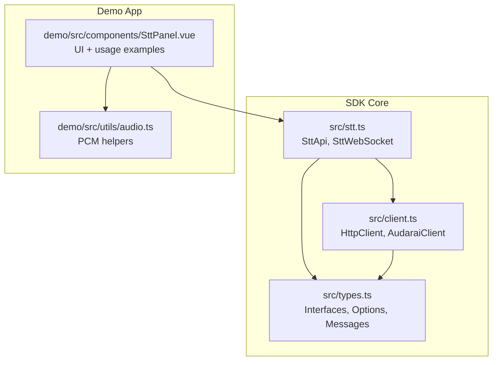
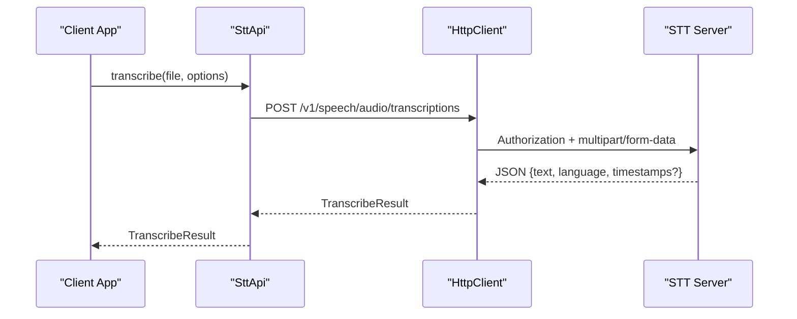
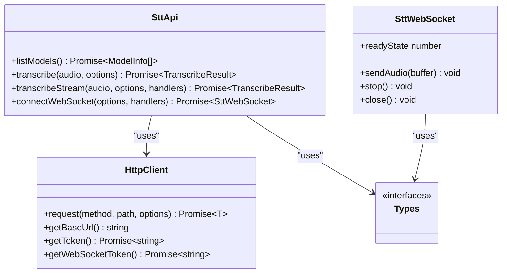

# Speech-to-Text (STT) API

<cite>
**Referenced Files in This Document**
- [README.md](file://README.md)
- [package.json](file://package.json)
- [src/stt.ts](file://src/stt.ts)
- [src/client.ts](file://src/client.ts)
- [src/types.ts](file://src/types.ts)
- [demo/src/components/SttPanel.vue](file://demo/src/components/SttPanel.vue)
- [demo/src/utils/audio.ts](file://demo/src/utils/audio.ts)
</cite>

## Table of Contents
1. [Introduction](#introduction)
2. [Project Structure](#project-structure)
3. [Core Components](#core-components)
4. [Architecture Overview](#architecture-overview)
5. [Detailed Component Analysis](#detailed-component-analysis)
6. [Dependency Analysis](#dependency-analysis)
7. [Performance Considerations](#performance-considerations)
8. [Troubleshooting Guide](#troubleshooting-guide)
9. [Conclusion](#conclusion)
10. [Appendices](#appendices)

## Introduction
This document provides comprehensive API documentation for the Speech-to-Text (STT) service exposed by the SDK. It covers:
- REST endpoints for file-based transcription
- Server-Sent Events (SSE) streaming for incremental transcription
- WebSocket streaming for real-time audio transcription
- Practical examples for file-based transcription, SSE streaming, and WebSocket connection management
- Configuration options, audio format requirements, and transcription accuracy settings
- Performance considerations, latency optimization, and troubleshooting guidance

The STT module integrates with the broader AudarAI platform and supports multiple authentication modes, automatic token management, and robust error handling.

## Project Structure
The STT functionality is implemented in the SDK’s core modules and demonstrated in the included Vue-based demo application.

**Diagram sources**
- [src/stt.ts:1-217](file://src/stt.ts#L1-L217)
- [src/client.ts:93-411](file://src/client.ts#L93-L411)
- [src/types.ts:153-264](file://src/types.ts#L153-L264)
- [demo/src/components/SttPanel.vue:1-349](file://demo/src/components/SttPanel.vue#L1-L349)
- [demo/src/utils/audio.ts:1-69](file://demo/src/utils/audio.ts#L1-L69)

**Section sources**
- [README.md:1-845](file://README.md#L1-L845)
- [package.json:1-26](file://package.json#L1-L26)

## Core Components
- SttApi: Provides REST and streaming STT operations.
- SttWebSocket: Wraps a WebSocket connection with typed message handling for real-time transcription.
- HttpClient: Handles HTTP requests, authentication, token refresh, and response parsing.
- Types: Defines options, message types, and result structures for STT operations.

Key capabilities:
- File-based transcription with optional forced alignment (word-level timestamps).
- SSE streaming with incremental partial and final results.
- Real-time WebSocket streaming with session lifecycle and typed messages.

**Section sources**
- [src/stt.ts:83-217](file://src/stt.ts#L83-L217)
- [src/client.ts:93-213](file://src/client.ts#L93-L213)
- [src/types.ts:153-264](file://src/types.ts#L153-L264)

## Architecture Overview
The STT API exposes three primary workflows:
- REST file upload: POST /v1/speech/audio/transcriptions
- SSE streaming: POST /v1/speech/audio/transcriptions/stream
- WebSocket streaming: WS /v1/speech/audio/transcriptions/ws

**Diagram sources**
- [src/stt.ts:92-102](file://src/stt.ts#L92-L102)
- [src/client.ts:133-173](file://src/client.ts#L133-L173)

## Detailed Component Analysis

### REST File Transcription
- Endpoint: POST /v1/speech/audio/transcriptions
- Request body: multipart/form-data with file and optional fields
- Query parameters: provider (optional)
- Response: TranscribeResult with text, language, and optional timestamps

Parameters:
- language: BCP-47 language code (e.g., "en", "zh")
- provider: STT model handle (e.g., "flash", "turbo")
- forced_alignment: boolean to request word-level timestamps

Example usage:
- See the demo panel’s transcribe() method for UI-driven invocation.

**Section sources**
- [src/stt.ts:92-102](file://src/stt.ts#L92-L102)
- [src/types.ts:153-158](file://src/types.ts#L153-L158)
- [demo/src/components/SttPanel.vue:22-49](file://demo/src/components/SttPanel.vue#L22-L49)

### SSE Streaming Transcription
- Endpoint: POST /v1/speech/audio/transcriptions/stream
- Response: ReadableStream of Server-Sent Events
- Handlers:
  - onChunk: invoked for each incremental chunk (including final)
  - onFinal: invoked once when is_final is true
  - onError: invoked on error events

Chunk structure:
- text: incremental transcription text
- language: detected language
- is_final: indicates finalization
- chunk_index: monotonically increasing index
- timestamps: present on final chunk when forced_alignment is enabled
- alignment: "unavailable" when forced_alignment was requested but timestamps are not available

Example usage:
- See the demo panel’s transcribeStream() method for UI-driven streaming.

**Section sources**
- [src/stt.ts:116-183](file://src/stt.ts#L116-L183)
- [src/types.ts:170-188](file://src/types.ts#L170-L188)
- [demo/src/components/SttPanel.vue:51-96](file://demo/src/components/SttPanel.vue#L51-L96)

### WebSocket Streaming Transcription (v2 Protocol)
- Endpoint: WS /v1/speech/audio/transcriptions/ws?token=...&provider=&language=&forced_alignment=
- Message types:
  - ready: {type, session_id, language}
  - partial: {type, text, language, segment, timestamps?, alignment?}
  - segment: {type, segment_index, text, language, audio_duration, reason, timestamps?, alignment?}
  - final: {type, text, language, duration, timestamps?, alignment?}
  - error: {type, message}

Lifecycle:
- On connection, server sends ready; SDK automatically sends start.
- Client sends PCM audio frames (ArrayBuffer or Int16Array) at 16 kHz, 16-bit, mono, little-endian.
- On stop, server flushes and emits segment/final messages before closing.
- Handlers: onReady, onPartial, onSegment, onFinal, onError, onClose.

Audio chunk specifications:
- Sample rate: 16 kHz
- Bit depth: 16-bit
- Channels: mono
- Byte order: little-endian
- Frame format: PCM (Int16Array or ArrayBuffer)

**Section sources**
- [src/stt.ts:21-81](file://src/stt.ts#L21-L81)
- [src/stt.ts:198-215](file://src/stt.ts#L198-L215)
- [src/types.ts:200-242](file://src/types.ts#L200-L242)
- [demo/src/components/SttPanel.vue:98-234](file://demo/src/components/SttPanel.vue#L98-L234)

### Authentication and Token Management
The SDK supports multiple authentication modes. WebSocket endpoints require a short-lived session token (stk_). The SDK automatically exchanges tokens when needed.

Supported modes:
- Publishable key (frontend-safe)
- Access token (JWT)
- API key (backend)
- App (appid + optional secret)

Token handling:
- HttpClient manages token acquisition and refresh.
- WebSocket tokens are obtained separately and exchanged automatically.

**Section sources**
- [src/client.ts:225-363](file://src/client.ts#L225-L363)
- [src/client.ts:121-131](file://src/client.ts#L121-L131)
- [README.md:117-204](file://README.md#L117-L204)

### Error Handling
Common HTTP errors:
- 401 Unauthorized: Authentication failure or token invalid/expired
- 402 Payment Required: Insufficient balance
- 429 Too Many Requests: Rate limiting with Retry-After header

WebSocket errors:
- error message type indicates pipeline issues
- onError handler receives either DOM Event or SttErrorMessage

**Section sources**
- [src/client.ts:187-212](file://src/client.ts#L187-L212)
- [src/types.ts:239-242](file://src/types.ts#L239-L242)
- [demo/src/components/SttPanel.vue:205-214](file://demo/src/components/SttPanel.vue#L205-L214)

## Dependency Analysis
The STT module depends on the HTTP client and shared types. The demo panel demonstrates usage patterns and provides practical examples.

**Diagram sources**
- [src/stt.ts:83-217](file://src/stt.ts#L83-L217)
- [src/client.ts:93-213](file://src/client.ts#L93-L213)
- [src/types.ts:153-264](file://src/types.ts#L153-L264)

**Section sources**
- [src/stt.ts:1-217](file://src/stt.ts#L1-L217)
- [src/client.ts:93-213](file://src/client.ts#L93-L213)
- [src/types.ts:153-264](file://src/types.ts#L153-L264)

## Performance Considerations
- Latency optimization:
  - Use WebSocket streaming for live microphone input with sub-second latency.
  - For SSE, expect incremental results with lower overhead than polling.
  - For file-based transcription, minimize file size and ensure optimal audio quality.
- Audio format:
  - WebSocket expects PCM frames at 16 kHz, 16-bit, mono, little-endian.
  - Ensure audio capture and encoding match these specifications to avoid re-encoding overhead.
- Network:
  - Use a stable network connection; WebSocket connections are sensitive to interruptions.
  - For browser environments, prefer HTTPS/WSS endpoints to avoid mixed-content restrictions.
- Token management:
  - Configure refresh thresholds appropriately to avoid mid-request token expiration.
  - Use publishable keys or backend-appropriate modes to reduce token exchange overhead.

[No sources needed since this section provides general guidance]

## Troubleshooting Guide
Common issues and resolutions:
- Authentication failures (401):
  - Verify the chosen authentication mode and credentials.
  - For access tokens, ensure onTokenRefresh is configured if tokens are near expiry.
- Rate limiting (429):
  - Respect Retry-After header and back off before retrying.
- Missing word-level timestamps:
  - forced_alignment may be unavailable for certain models or languages; check alignment field in messages.
- WebSocket errors:
  - Listen to onError handler for SttErrorMessage and log the message.
  - Ensure the audio frames conform to PCM specifications (16 kHz, 16-bit, mono, little-endian).
- SSE streaming stalls:
  - Confirm the server responds with data: lines and that the client consumes the stream promptly.

**Section sources**
- [src/client.ts:187-212](file://src/client.ts#L187-L212)
- [src/types.ts:177-178](file://src/types.ts#L177-L178)
- [src/types.ts:214-215](file://src/types.ts#L214-L215)
- [demo/src/components/SttPanel.vue:205-214](file://demo/src/components/SttPanel.vue#L205-L214)

## Conclusion
The STT API offers flexible transcription workflows suitable for offline files, streaming, and real-time scenarios. By leveraging the SDK’s typed interfaces, robust authentication, and comprehensive error handling, developers can integrate accurate and performant speech recognition into their applications. For best results, adhere to the audio format requirements, monitor token lifecycles, and select the appropriate streaming mode based on latency and accuracy needs.

[No sources needed since this section summarizes without analyzing specific files]

## Appendices

### API Reference Summary

- REST File Transcription
  - Method: POST
  - Path: /v1/speech/audio/transcriptions
  - Query: provider (optional)
  - Form fields: file (Blob/File), language (optional), forced_alignment (optional)
  - Response: TranscribeResult

- SSE Streaming Transcription
  - Method: POST
  - Path: /v1/speech/audio/transcriptions/stream
  - Query: provider (optional)
  - Form fields: file (Blob/File), language (optional), forced_alignment (optional)
  - Response: ReadableStream of Server-Sent Events
  - Event fields: text, language, is_final, chunk_index, timestamps (optional), alignment (optional)

- WebSocket Streaming Transcription (v2)
  - Method: WS
  - Path: /v1/speech/audio/transcriptions/ws
  - Query: token, provider (optional), language (optional), forced_alignment (optional)
  - Message types: ready, partial, segment, final, error
  - Audio frames: PCM (ArrayBuffer or Int16Array), 16 kHz, 16-bit, mono, little-endian

- Configuration Options
  - language: BCP-47 code
  - provider: model handle (e.g., "flash", "turbo")
  - forced_alignment: boolean to request word-level timestamps

- Practical Examples
  - File-based transcription: see demo SttPanel transcribe()
  - SSE streaming: see demo SttPanel transcribeStream()
  - WebSocket streaming: see demo SttPanel startWs(), stopWs()

**Section sources**
- [src/stt.ts:87-102](file://src/stt.ts#L87-L102)
- [src/stt.ts:116-183](file://src/stt.ts#L116-L183)
- [src/stt.ts:198-215](file://src/stt.ts#L198-L215)
- [demo/src/components/SttPanel.vue:22-96](file://demo/src/components/SttPanel.vue#L22-L96)
- [demo/src/components/SttPanel.vue:144-234](file://demo/src/components/SttPanel.vue#L144-L234)