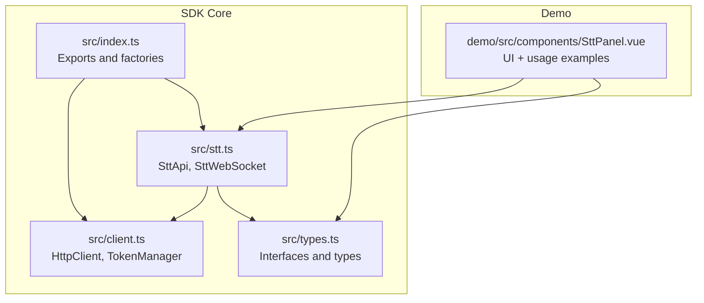
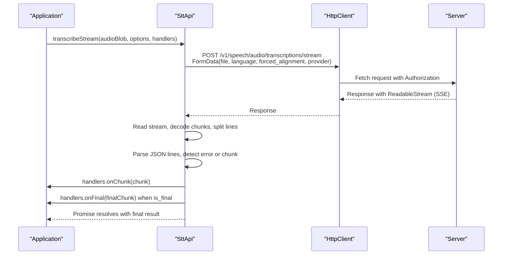
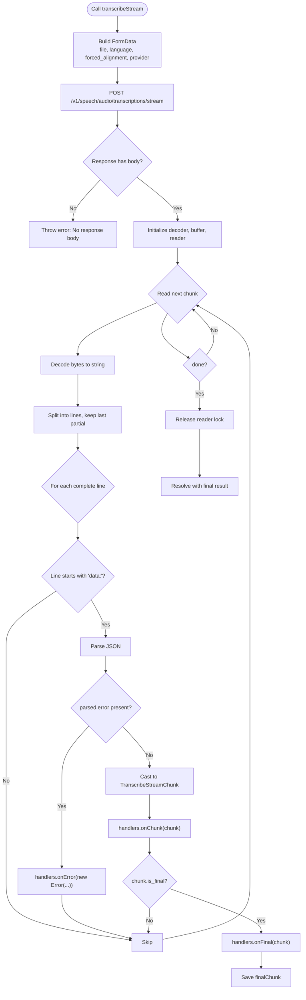
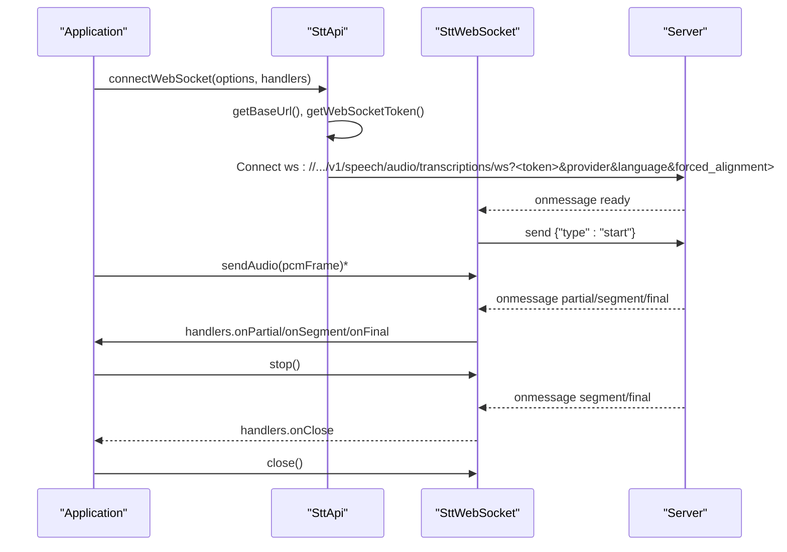
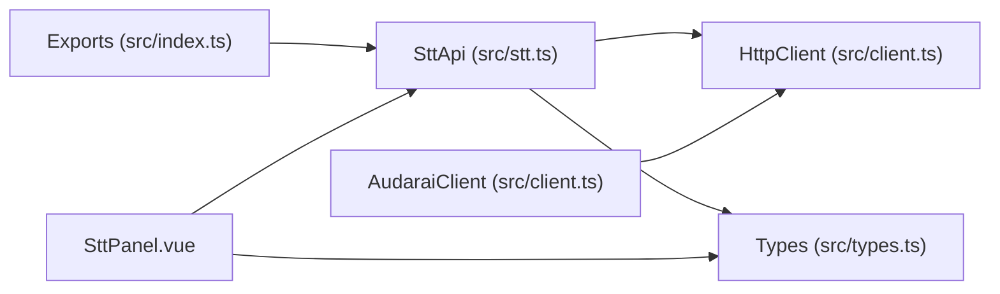

# Streaming Transcription API

<cite>
**Referenced Files in This Document**
- [stt.ts](file://src/stt.ts)
- [types.ts](file://src/types.ts)
- [client.ts](file://src/client.ts)
- [index.ts](file://src/index.ts)
- [SttPanel.vue](file://demo/src/components/SttPanel.vue)
- [README.md](file://README.md)
</cite>

## Table of Contents
1. [Introduction](#introduction)
2. [Project Structure](#project-structure)
3. [Core Components](#core-components)
4. [Architecture Overview](#architecture-overview)
5. [Detailed Component Analysis](#detailed-component-analysis)
6. [Dependency Analysis](#dependency-analysis)
7. [Performance Considerations](#performance-considerations)
8. [Troubleshooting Guide](#troubleshooting-guide)
9. [Conclusion](#conclusion)
10. [Appendices](#appendices)

## Introduction
This document explains the streaming Speech-to-Text (STT) transcription API with a focus on Server-Sent Events (SSE) and real-time WebSocket transcription. It covers the transcribeStream method, event-driven architecture, configuration options, callback handlers, and practical usage patterns. It also documents the TranscribeStreamChunk data structure, timestamp handling, and progressive transcription patterns, along with connection lifecycle management, error recovery, and performance optimization tips.

## Project Structure
The STT streaming features are implemented in the SDK’s core modules and demonstrated in the included Vue demo panel.

**Diagram sources**
- [index.ts:128-193](file://src/index.ts#L128-L193)
- [client.ts:93-213](file://src/client.ts#L93-L213)
- [stt.ts:83-217](file://src/stt.ts#L83-L217)
- [types.ts:153-188](file://src/types.ts#L153-L188)
- [SttPanel.vue:1-349](file://demo/src/components/SttPanel.vue#L1-L349)

**Section sources**
- [index.ts:128-193](file://src/index.ts#L128-L193)
- [stt.ts:83-217](file://src/stt.ts#L83-L217)
- [types.ts:153-188](file://src/types.ts#L153-L188)
- [SttPanel.vue:1-349](file://demo/src/components/SttPanel.vue#L1-L349)

## Core Components
- SttApi: Provides file transcription, SSE streaming transcription, and WebSocket connection helpers.
- SttWebSocket: Wraps a WebSocket for real-time STT with typed message handling.
- Types: Defines TranscribeStreamOptions, TranscribeStreamChunk, TranscribeStreamHandlers, ConnectSttWebSocketOptions, and WebSocket message types.

Key responsibilities:
- SttApi.transcribeStream: Streams SSE events, parses them, and invokes onChunk/onFinal/onError handlers.
- SttApi.connectWebSocket: Establishes a WebSocket with token exchange and returns a typed wrapper.
- SttWebSocket: Handles ready/partial/segment/final/error messages and audio sending/stop/close.

**Section sources**
- [stt.ts:83-217](file://src/stt.ts#L83-L217)
- [types.ts:153-188](file://src/types.ts#L153-L188)
- [types.ts:198-264](file://src/types.ts#L198-L264)

## Architecture Overview
The streaming STT architecture supports two primary workflows:
- SSE Streaming: POST to a streaming endpoint, parse server-sent events, emit onChunk/onFinal/onError.
- Real-time WebSocket: Connect with a session token, receive ready/start cycle, send PCM frames, receive partial/segment/final messages.

**Diagram sources**
- [stt.ts:116-183](file://src/stt.ts#L116-L183)
- [client.ts:133-213](file://src/client.ts#L133-L213)

## Detailed Component Analysis

### SSE Streaming: transcribeStream
The transcribeStream method streams Server-Sent Events from the server, parsing each event line and invoking callbacks.

Processing logic:
- Build FormData with audio file and optional language/provider/forced_alignment.
- POST to the streaming endpoint with expectBinary enabled to receive a Response with a ReadableStream.
- Read the stream incrementally, decode bytes, and split into lines.
- For each line starting with "data:", parse JSON and route to handlers:
  - If parsed.error is present, call onError with a new Error.
  - Otherwise, treat as TranscribeStreamChunk and call onChunk.
  - If is_final is true, call onFinal and keep finalChunk for the final result.
- Resolve the Promise with a TranscribeResult containing text/language/timestamps.

**Diagram sources**
- [stt.ts:116-183](file://src/stt.ts#L116-L183)

**Section sources**
- [stt.ts:116-183](file://src/stt.ts#L116-L183)
- [types.ts:160-188](file://src/types.ts#L160-L188)

### Real-time WebSocket: connectWebSocket and SttWebSocket
The WebSocket flow uses a typed wrapper that:
- Builds a WebSocket URL with token exchange and query parameters (provider, language, forced_alignment).
- Automatically sends a start message after receiving ready.
- Routes incoming messages to onReady/onPartial/onSegment/onFinal/onError/onClose handlers.
- Exposes sendAudio, stop, and close methods for PCM frames and graceful termination.

**Diagram sources**
- [stt.ts:198-215](file://src/stt.ts#L198-L215)
- [stt.ts:21-81](file://src/stt.ts#L21-L81)
- [types.ts:198-264](file://src/types.ts#L198-L264)

**Section sources**
- [stt.ts:198-215](file://src/stt.ts#L198-L215)
- [stt.ts:21-81](file://src/stt.ts#L21-L81)
- [types.ts:198-264](file://src/types.ts#L198-L264)

### TranscribeStreamOptions and Provider Selection
TranscribeStreamOptions controls the streaming transcription behavior:
- language: Target language code for transcription.
- provider: STT provider selector (e.g., flash, turbo).
- forced_alignment: Request word-level timestamps; when unavailable, alignment may be marked as "unavailable".

These options are forwarded to the server via query parameters for SSE and via WebSocket query parameters for real-time.

**Section sources**
- [types.ts:160-166](file://src/types.ts#L160-L166)
- [stt.ts:121-125](file://src/stt.ts#L121-L125)
- [stt.ts:206-211](file://src/stt.ts#L206-L211)

### TranscribeStreamHandlers Interface
Callbacks invoked during SSE streaming:
- onChunk: Invoked for every incremental chunk (including final).
- onFinal: Invoked once when is_final is true.
- onError: Invoked when the server emits an error event.

These handlers enable progressive UI updates and final result consolidation.

**Section sources**
- [types.ts:181-188](file://src/types.ts#L181-L188)
- [stt.ts:166-172](file://src/stt.ts#L166-L172)

### TranscribeStreamChunk Data Structure and Timestamp Handling
TranscribeStreamChunk carries:
- text: Incremental or final transcription text.
- language: Detected or requested language code.
- is_final: Indicates whether this is the final chunk.
- chunk_index: Monotonically increasing index for chunks.
- timestamps: Optional word-level timestamps (present on final when forced_alignment is true).
- alignment: Optional marker indicating forced_alignment was requested but timestamps are unavailable.

Progressive transcription pattern:
- onChunk receives partial results; update UI immediately.
- onFinal consolidates the final result and merges timestamps if present.

**Section sources**
- [types.ts:170-179](file://src/types.ts#L170-L179)
- [stt.ts:166-172](file://src/stt.ts#L166-L172)

### Practical Usage Examples
The demo panel demonstrates:
- SSE streaming transcription with onChunk/onFinal/onError callbacks.
- Real-time WebSocket transcription with onReady/onPartial/onSegment/onFinal/onError/onClose.
- Provider listing and selection via listModels.

Example references:
- SSE streaming: [SttPanel.vue:51-96](file://demo/src/components/SttPanel.vue#L51-L96)
- WebSocket flow: [SttPanel.vue:144-234](file://demo/src/components/SttPanel.vue#L144-L234)
- Provider listing: [SttPanel.vue:127-139](file://demo/src/components/SttPanel.vue#L127-L139)

**Section sources**
- [SttPanel.vue:51-96](file://demo/src/components/SttPanel.vue#L51-L96)
- [SttPanel.vue:144-234](file://demo/src/components/SttPanel.vue#L144-L234)
- [SttPanel.vue:127-139](file://demo/src/components/SttPanel.vue#L127-L139)

## Dependency Analysis
The STT module depends on the HTTP client for authentication and request handling. The client manages token acquisition and refresh, and the SDK exposes convenience factories and types.

**Diagram sources**
- [stt.ts:83-217](file://src/stt.ts#L83-L217)
- [client.ts:93-213](file://src/client.ts#L93-L213)
- [index.ts:128-193](file://src/index.ts#L128-L193)
- [SttPanel.vue:1-349](file://demo/src/components/SttPanel.vue#L1-L349)

**Section sources**
- [stt.ts:83-217](file://src/stt.ts#L83-L217)
- [client.ts:93-213](file://src/client.ts#L93-L213)
- [index.ts:128-193](file://src/index.ts#L128-L193)

## Performance Considerations
- SSE streaming:
  - Use expectBinary to receive a streaming Response and process incrementally.
  - Avoid buffering entire payloads; process line-by-line to minimize latency.
  - Keep handlers lightweight to prevent UI jank.
- WebSocket:
  - Send PCM frames at a steady rate; avoid bursts to reduce latency.
  - Use stop() to signal end-of-stream so the server can flush and finalize.
  - Close gracefully to free resources.
- Token management:
  - The SDK proactively refreshes tokens; ensure refreshThresholdSeconds is tuned for your environment.
- Forced alignment:
  - Requesting word-level timestamps increases payload size; disable if not needed for performance.

[No sources needed since this section provides general guidance]

## Troubleshooting Guide
Common issues and remedies:
- Authentication failures:
  - 401 responses trigger automatic token refresh or invalidation; ensure onTokenRefresh or token provider is configured.
- Rate limiting:
  - 429 responses include Retry-After; back off and retry.
- SSE errors:
  - Server may emit an error event; onError handler receives an Error constructed from the message.
- WebSocket errors:
  - onError may receive either a WebSocket Event or a structured error message; onClose signals closure.
- Forced alignment unavailable:
  - alignment may be "unavailable" when timestamps are not produced despite request; adjust expectations accordingly.

**Section sources**
- [client.ts:133-213](file://src/client.ts#L133-L213)
- [stt.ts:161-164](file://src/stt.ts#L161-L164)
- [types.ts:239-242](file://src/types.ts#L239-L242)

## Conclusion
The SDK provides robust streaming STT capabilities via SSE and WebSocket. SSE enables progressive transcription with minimal setup, while WebSocket offers real-time, low-latency transcription suitable for live microphone input. The strongly typed interfaces and event-driven handlers simplify building responsive UIs and integrating with audio pipelines.

[No sources needed since this section summarizes without analyzing specific files]

## Appendices

### API Reference Summary
- SttApi.transcribeStream(audio, options, handlers) -> Promise<TranscribeResult>
- SttApi.connectWebSocket(options, handlers) -> Promise<SttWebSocket>
- SttWebSocket.sendAudio(pcm), stop(), close()

**Section sources**
- [stt.ts:116-183](file://src/stt.ts#L116-L183)
- [stt.ts:198-215](file://src/stt.ts#L198-L215)
- [stt.ts:60-81](file://src/stt.ts#L60-L81)

### Example References
- SSE streaming usage: [SttPanel.vue:51-96](file://demo/src/components/SttPanel.vue#L51-L96)
- WebSocket usage: [SttPanel.vue:144-234](file://demo/src/components/SttPanel.vue#L144-L234)
- Provider listing: [SttPanel.vue:127-139](file://demo/src/components/SttPanel.vue#L127-L139)

**Section sources**
- [SttPanel.vue:51-96](file://demo/src/components/SttPanel.vue#L51-L96)
- [SttPanel.vue:144-234](file://demo/src/components/SttPanel.vue#L144-L234)
- [SttPanel.vue:127-139](file://demo/src/components/SttPanel.vue#L127-L139)