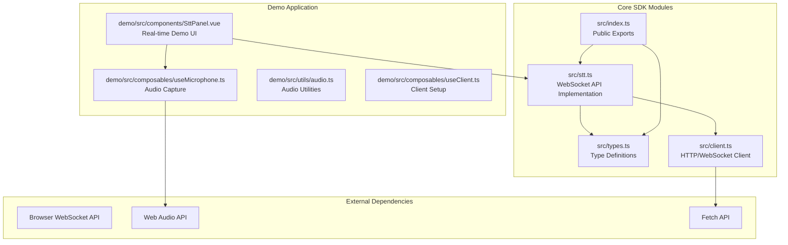
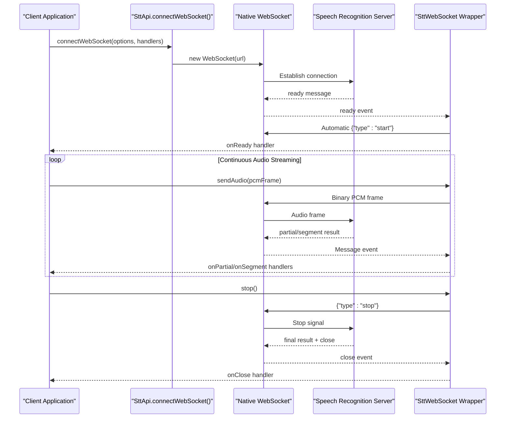
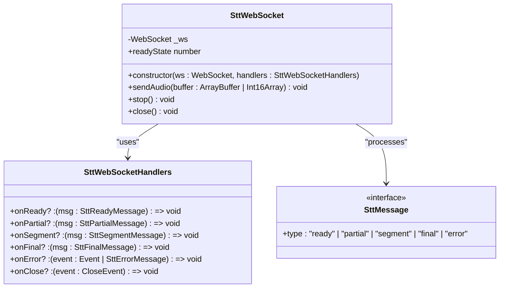
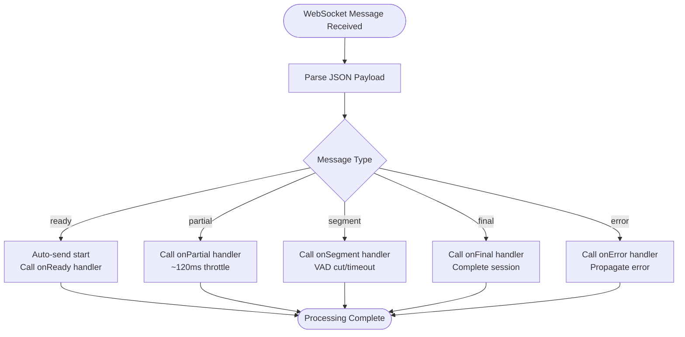
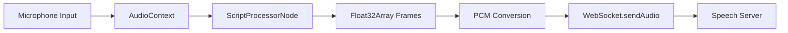
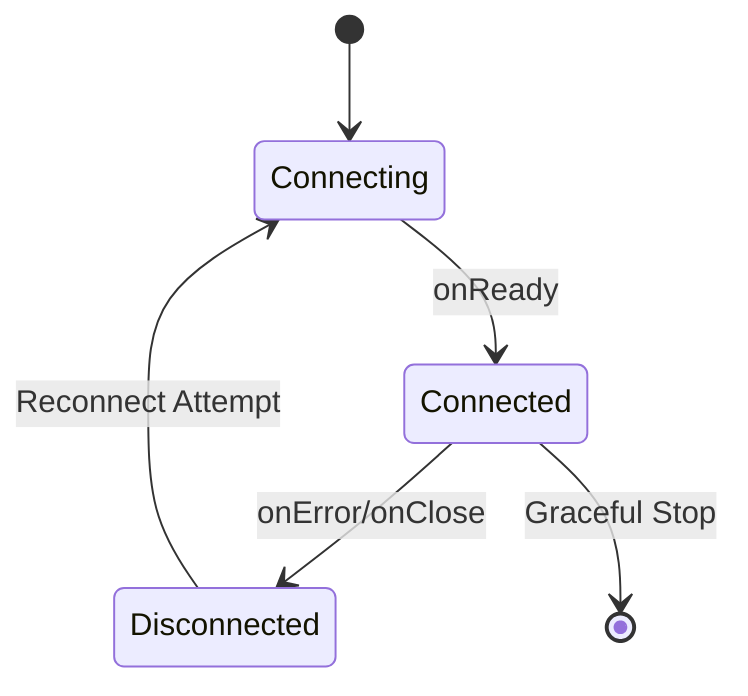
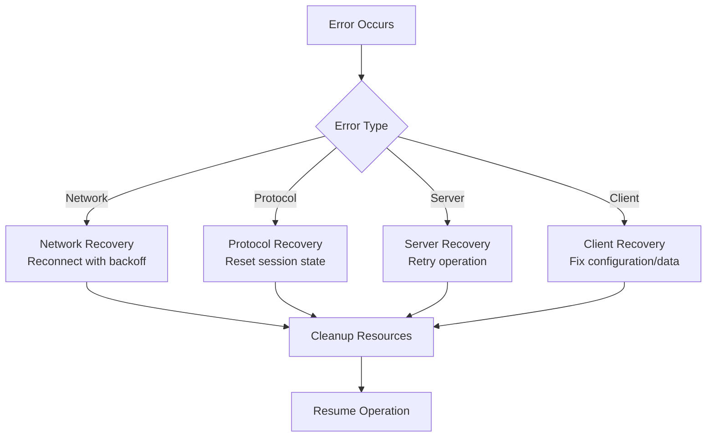

# WebSocket Transcription

<cite>
**Referenced Files in This Document**
- [stt.ts](file://src/stt.ts)
- [types.ts](file://src/types.ts)
- [index.ts](file://src/index.ts)
- [SttPanel.vue](file://demo/src/components/SttPanel.vue)
- [useClient.ts](file://demo/src/composables/useClient.ts)
- [useMicrophone.ts](file://demo/src/composables/useMicrophone.ts)
- [audio.ts](file://demo/src/utils/audio.ts)
- [client.ts](file://src/client.ts)
</cite>

## Table of Contents
1. [Introduction](#introduction)
2. [Project Structure](#project-structure)
3. [Core Components](#core-components)
4. [Architecture Overview](#architecture-overview)
5. [Detailed Component Analysis](#detailed-component-analysis)
6. [WebSocket Protocol Implementation](#websocket-protocol-implementation)
7. [Message Type Management](#message-type-management)
8. [Configuration Options](#configuration-options)
9. [Real-time Audio Streaming](#real-time-audio-streaming)
10. [Connection Management](#connection-management)
11. [Error Handling and Reliability](#error-handling-and-reliability)
12. [Performance Optimization](#performance-optimization)
13. [Practical Examples](#practical-examples)
14. [Troubleshooting Guide](#troubleshooting-guide)
15. [Conclusion](#conclusion)

## Introduction

This document provides comprehensive technical documentation for WebSocket-based real-time speech-to-text transcription capabilities. The implementation follows a sophisticated v2 protocol that enables bidirectional communication between client applications and speech recognition servers, supporting continuous audio streaming with real-time transcription feedback.

The system is designed for production use cases requiring low-latency speech recognition, including live captioning, voice-controlled applications, and real-time transcription services. It handles complex scenarios such as automatic protocol handling, message type management, connection reliability, and performance optimization for continuous audio streams.

## Project Structure

The WebSocket transcription functionality is organized across several key modules within the SDK:



**Diagram sources**
- [stt.ts:1-217](file://src/stt.ts#L1-L217)
- [types.ts:190-264](file://src/types.ts#L190-L264)
- [client.ts:93-213](file://src/client.ts#L93-L213)

**Section sources**
- [stt.ts:1-217](file://src/stt.ts#L1-L217)
- [types.ts:190-264](file://src/types.ts#L190-L264)
- [client.ts:93-213](file://src/client.ts#L93-L213)

## Core Components

The WebSocket transcription system consists of several interconnected components that work together to provide robust real-time speech recognition:

### SttApi Class
The primary interface for speech-to-text operations, providing both file-based and WebSocket-based transcription capabilities.

### SttWebSocket Class
A wrapper around the native WebSocket API that handles automatic protocol management, message routing, and connection lifecycle.

### Message Type System
Comprehensive type definitions for all WebSocket message types including ready, partial, segment, final, and error messages.

### Configuration Interfaces
Typed configuration options for controlling transcription behavior, provider selection, and quality settings.

**Section sources**
- [stt.ts:83-217](file://src/stt.ts#L83-L217)
- [types.ts:190-264](file://src/types.ts#L190-L264)

## Architecture Overview

The WebSocket transcription architecture implements a sophisticated client-server communication pattern optimized for real-time speech processing:



**Diagram sources**
- [stt.ts:198-215](file://src/stt.ts#L198-L215)
- [stt.ts:21-81](file://src/stt.ts#L21-L81)

The architecture ensures reliable communication through automatic protocol handling, proper message sequencing, and comprehensive error management. The system handles various edge cases including network interruptions, server-side processing delays, and client-side audio stream variations.

## Detailed Component Analysis

### SttWebSocket Class Implementation

The `SttWebSocket` class serves as a sophisticated wrapper around the native WebSocket API, providing automatic protocol handling and typed message management:



**Diagram sources**
- [stt.ts:21-81](file://src/stt.ts#L21-L81)
- [types.ts:251-264](file://src/types.ts#L251-L264)

The class implements automatic protocol handling by intercepting incoming messages and automatically sending the required `"start"` message after receiving `"ready"`. This eliminates manual protocol management from client code while ensuring compliance with the v2 protocol specification.

**Section sources**
- [stt.ts:21-81](file://src/stt.ts#L21-L81)
- [types.ts:251-264](file://src/types.ts#L251-L264)

### Message Processing Engine

The message processing system handles four distinct message types with specific behaviors and timing characteristics:



**Diagram sources**
- [stt.ts:27-54](file://src/stt.ts#L27-L54)

Each message type serves a specific purpose in the transcription workflow, from initial connection establishment to final result delivery.

**Section sources**
- [stt.ts:27-54](file://src/stt.ts#L27-L54)

## WebSocket Protocol Implementation

The v2 WebSocket protocol implementation follows a strict message sequence that ensures reliable real-time transcription:

### Handshake Sequence

The connection establishment follows a precise handshake pattern:

1. **Connection Establishment**: Client connects to `/v1/speech/audio/transcriptions/ws`
2. **Server Ready**: Server responds with `{"type":"ready", "session_id", "language"}`
3. **Automatic Start**: SDK automatically sends `{"type":"start"}` message
4. **Session Activation**: Server begins processing audio frames

### Audio Frame Transmission

PCM audio frames are transmitted as binary data with specific format requirements:

- **Format**: 16-bit signed integers (Int16Array)
- **Sample Rate**: 16 kHz
- **Channels**: Mono (single channel)
- **Endianness**: Little-endian
- **Frame Size**: Variable (typically 20-30ms frames)

### Termination Protocol

Graceful session termination follows a specific sequence:

1. **Client Initiated**: Client sends `{"type":"stop"}`
2. **Server Processing**: Server flushes remaining audio buffers
3. **Final Results**: Server sends any pending `segment` and `final` messages
4. **Connection Close**: Server closes the WebSocket connection

**Section sources**
- [stt.ts:198-215](file://src/stt.ts#L198-L215)
- [stt.ts:60-76](file://src/stt.ts#L60-L76)

## Message Type Management

The system defines comprehensive message types for different stages of the transcription process:

### Ready Message
- **Purpose**: Indicates server readiness and session establishment
- **Fields**: `session_id`, `language`
- **Timing**: First message after successful connection

### Partial Message
- **Purpose**: Real-time intermediate results
- **Frequency**: ~120ms throttled updates
- **Content**: `text`, `language`, `segment`, optional `timestamps`
- **Use Case**: Live captioning and real-time feedback

### Segment Message
- **Purpose**: Complete speech segment results
- **Triggers**: VAD silence detection (≥0.8s) or timeout (≥15s)
- **Content**: `segment_index`, `text`, `language`, `audio_duration`, `reason`
- **Timing**: After speech segment completion

### Final Message
- **Purpose**: Complete session transcription
- **Content**: `text`, `language`, `duration`, optional `timestamps`
- **Timing**: Sent after `{"type":"stop"}` and server processing completion

### Error Message
- **Purpose**: Error reporting and diagnostics
- **Content**: `message` with error details
- **Scope**: Non-fatal pipeline errors

**Section sources**
- [types.ts:200-242](file://src/types.ts#L200-L242)

## Configuration Options

The `ConnectSttWebSocketOptions` interface provides comprehensive control over transcription behavior:

### Provider Selection
- **Field**: `provider?: string`
- **Purpose**: Select specific ASR model/provider
- **Default**: System/default provider
- **Examples**: "flash", "turbo"

### Language Configuration
- **Field**: `language?: string`
- **Purpose**: Specify target language for transcription
- **Format**: BCP-47 language codes (e.g., "zh", "en-US")
- **Impact**: Affects model selection and language-specific processing

### Forced Alignment
- **Field**: `forced_alignment?: boolean`
- **Purpose**: Enable word-level timestamp generation
- **Behavior**: When enabled, all messages include `timestamps` array
- **Performance**: May increase processing overhead
- **Compatibility**: Not all models support forced alignment

**Section sources**
- [types.ts:190-196](file://src/types.ts#L190-L196)

## Real-time Audio Streaming

The audio streaming implementation integrates seamlessly with the Web Audio API for optimal performance:

### Audio Capture Pipeline



**Diagram sources**
- [useMicrophone.ts:8-33](file://demo/src/composables/useMicrophone.ts#L8-L33)
- [audio.ts:28-35](file://demo/src/utils/audio.ts#L28-L35)

### Frame Processing

The audio capture system handles several critical aspects:

1. **Sample Rate Configuration**: Fixed at 16 kHz for optimal speech recognition
2. **Format Conversion**: Automatic conversion from Float32Array to Int16Array
3. **Buffer Management**: Efficient handling of audio frame buffers
4. **Resource Cleanup**: Proper disposal of audio resources on stop

### Streaming Characteristics

- **Frame Size**: 4096 samples (256 ms at 16 kHz)
- **Processing Latency**: Minimal end-to-end latency
- **Memory Efficiency**: Streaming audio without buffering entire sessions
- **Quality Control**: Built-in audio enhancement (echo cancellation, noise suppression)

**Section sources**
- [useMicrophone.ts:8-33](file://demo/src/composables/useMicrophone.ts#L8-L33)
- [audio.ts:28-35](file://demo/src/utils/audio.ts#L28-L35)

## Connection Management

The connection management system provides robust handling of WebSocket lifecycle events:

### Connection States



### Automatic Reconnection

The system implements intelligent reconnection logic that considers:

- **Connection Failure Detection**: Immediate fallback on network errors
- **Backoff Strategy**: Exponential backoff for failed reconnection attempts
- **State Preservation**: Maintains session context across reconnections
- **Resource Cleanup**: Proper disposal of failed connection attempts

### Token Management

WebSocket connections utilize session tokens for authentication:

- **Token Exchange**: Access tokens are exchanged for session tokens
- **Automatic Refresh**: Tokens are refreshed before expiration
- **Fallback Behavior**: Graceful handling of token refresh failures
- **Security**: Secure token transmission without exposing credentials

**Section sources**
- [client.ts:127-131](file://src/client.ts#L127-L131)
- [client.ts:225-363](file://src/client.ts#L225-L363)

## Error Handling and Reliability

The system implements comprehensive error handling strategies:

### Error Categories

1. **Network Errors**: Connection failures, timeouts, and network interruptions
2. **Protocol Errors**: Malformed messages, unexpected message sequences
3. **Server Errors**: Internal server failures, resource exhaustion
4. **Client Errors**: Invalid audio data, unsupported configurations

### Error Recovery Strategies



### Monitoring and Diagnostics

The system provides comprehensive logging and monitoring capabilities:

- **Event Logging**: Detailed logs for all connection and message events
- **Performance Metrics**: Latency measurements and throughput tracking
- **Error Reporting**: Structured error information for debugging
- **Health Checks**: Periodic connection health verification

**Section sources**
- [stt.ts:56-58](file://src/stt.ts#L56-L58)
- [types.ts:239-242](file://src/types.ts#L239-L242)

## Performance Optimization

Several optimization strategies ensure efficient real-time speech processing:

### Audio Processing Optimizations

- **Efficient Buffering**: Minimal memory allocation during audio streaming
- **Compression**: Binary PCM format reduces bandwidth requirements
- **Throttling**: Intelligent partial result throttling prevents overload
- **Caching**: Provider and model information caching reduces lookup overhead

### Network Optimization

- **Connection Pooling**: Reuse of WebSocket connections when possible
- **Binary Protocol**: Efficient binary transmission for audio data
- **Message Batching**: Coalescing of small messages where beneficial
- **Timeout Management**: Optimal timeout values for different network conditions

### Resource Management

- **Memory Cleanup**: Automatic cleanup of audio buffers and WebSocket resources
- **CPU Optimization**: Efficient audio processing without blocking UI thread
- **Battery Life**: Optimized audio processing for mobile devices
- **Bandwidth Control**: Adaptive bitrate for different network conditions

**Section sources**
- [audio.ts:28-35](file://demo/src/utils/audio.ts#L28-L35)
- [useMicrophone.ts:8-33](file://demo/src/composables/useMicrophone.ts#L8-L33)

## Practical Examples

### Basic WebSocket Connection Setup

```typescript
// Initialize client and connect to STT service
const client = createAudaraiClient({
  baseUrl: 'https://api.example.com',
  publishableKey: 'pk_xxx'
});

// Connect to WebSocket with language configuration
const stt = await client.stt.connectWebSocket({
  language: 'zh',
  provider: 'flash'
}, {
  onReady: ({ session_id, language }) => {
    console.log(`Session ready: ${session_id}, Language: ${language}`);
  },
  onPartial: (msg) => {
    console.log(`Partial result: ${msg.text}`);
  },
  onFinal: (msg) => {
    console.log(`Final result: ${msg.text}`);
  }
});
```

### PCM Audio Frame Transmission

```typescript
// Capture audio from microphone
const microphone = useMicrophone((pcm) => {
  // Send PCM frame to WebSocket
  stt.sendAudio(pcm);
});

// Start microphone capture
await microphone.start();

// Stop when finished
setTimeout(async () => {
  await stt.stop();
  await stt.close();
}, 30000);
```

### Real-time Transcription Handling

```typescript
// Comprehensive transcription handling
const transcriptionHandlers = {
  onReady: ({ session_id, language }) => {
    console.log(`Transcription session ${session_id} started for ${language}`);
  },
  
  onPartial: ({ text, language, segment, timestamps }) => {
    updateLiveCaption(text);
    if (timestamps) {
      updateWordTimings(timestamps);
    }
  },
  
  onSegment: ({ segment_index, text, language, audio_duration, reason }) => {
    console.log(`Segment ${segment_index} completed: ${text}`);
    persistSegment(segment_index, text, audio_duration, reason);
  },
  
  onFinal: ({ text, language, duration, timestamps }) => {
    console.log(`Full transcription: ${text}`);
    finalizeTranscription(text, duration, timestamps);
  },
  
  onError: (error) => {
    console.error(`Transcription error: ${error.message}`);
    handleTranscriptionError(error);
  },
  
  onClose: (event) => {
    console.log(`Transcription session closed: ${event.code}`);
  }
};
```

### Graceful Connection Termination

```typescript
// Proper session termination
async function endTranscription() {
  try {
    // Signal server to stop processing
    await stt.stop();
    
    // Wait for final results
    await waitForFinalResults();
    
    // Close connection gracefully
    await stt.close();
    
    console.log('Transcription session ended successfully');
  } catch (error) {
    console.error('Error during session termination:', error);
    // Force close if needed
    stt.close();
  }
}

// Alternative immediate termination
function forceStop() {
  stt.stop();
  stt.close();
}
```

**Section sources**
- [SttPanel.vue:144-234](file://demo/src/components/SttPanel.vue#L144-L234)
- [useClient.ts:21-35](file://demo/src/composables/useClient.ts#L21-L35)

## Troubleshooting Guide

### Common Issues and Solutions

#### Connection Failures
- **Symptoms**: Immediate connection errors or frequent disconnections
- **Causes**: Network connectivity issues, invalid authentication tokens
- **Solutions**: Verify network connectivity, check token validity, implement retry logic

#### Audio Quality Problems
- **Symptoms**: Poor transcription accuracy, dropped audio frames
- **Causes**: Incorrect audio format, insufficient microphone permissions
- **Solutions**: Verify audio format (16-bit, 16kHz, mono), check microphone permissions

#### Protocol Errors
- **Symptoms**: Unexpected message sequences, missing expected messages
- **Causes**: Client-side protocol violations, server-side processing issues
- **Solutions**: Ensure proper message ordering, implement protocol compliance checks

#### Performance Issues
- **Symptoms**: High latency, dropped frames, CPU utilization spikes
- **Causes**: Inefficient audio processing, memory leaks, excessive logging
- **Solutions**: Optimize audio processing, implement memory cleanup, reduce logging verbosity

### Debugging Techniques

1. **Enable Detailed Logging**: Monitor all WebSocket events and message exchanges
2. **Network Analysis**: Use browser developer tools to inspect WebSocket traffic
3. **Audio Analysis**: Verify audio format and quality using Web Audio API
4. **Performance Profiling**: Monitor CPU and memory usage during transcription

**Section sources**
- [stt.ts:56-58](file://src/stt.ts#L56-L58)
- [SttPanel.vue:205-214](file://demo/src/components/SttPanel.vue#L205-L214)

## Conclusion

The WebSocket-based real-time speech-to-text transcription system provides a robust, scalable solution for continuous audio processing with comprehensive protocol handling, error management, and performance optimization. The implementation follows industry best practices while maintaining flexibility for various use cases and deployment scenarios.

Key strengths of the implementation include:

- **Protocol Compliance**: Strict adherence to the v2 WebSocket protocol
- **Reliability**: Comprehensive error handling and automatic recovery mechanisms
- **Performance**: Optimized audio processing and efficient resource management
- **Flexibility**: Configurable providers, languages, and quality settings
- **Developer Experience**: Typed interfaces and comprehensive documentation

The system is suitable for production deployment in various environments including web browsers, Node.js applications, and hybrid mobile applications, providing consistent real-time transcription capabilities across different platforms and use cases.