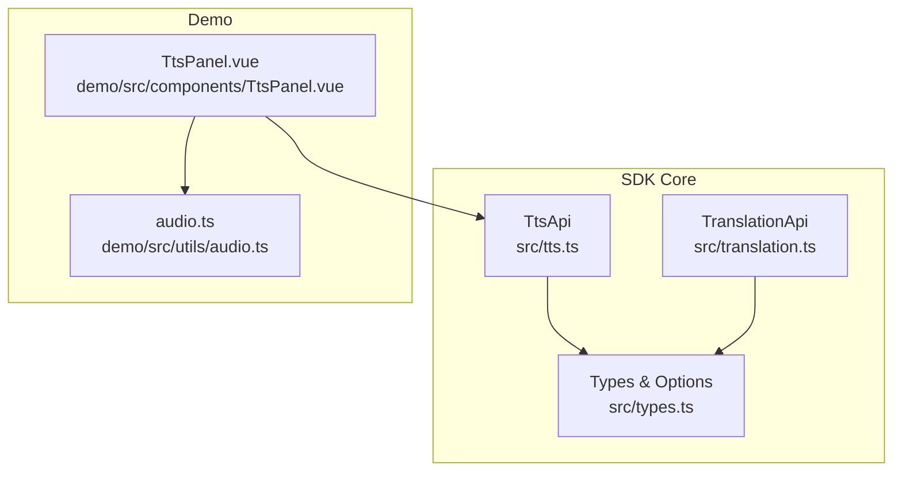
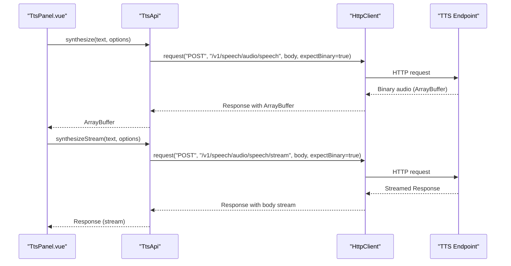
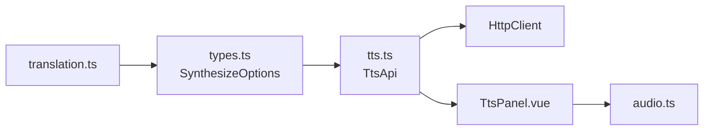

# Audio Format and Quality Configuration

<cite>
**Referenced Files in This Document**
- [tts.ts](file://src/tts.ts)
- [types.ts](file://src/types.ts)
- [audio.ts](file://demo/src/utils/audio.ts)
- [TtsPanel.vue](file://demo/src/components/TtsPanel.vue)
- [translation.ts](file://src/translation.ts)
- [README.md](file://README.md)
</cite>

## Table of Contents
1. [Introduction](#introduction)
2. [Project Structure](#project-structure)
3. [Core Components](#core-components)
4. [Architecture Overview](#architecture-overview)
5. [Detailed Component Analysis](#detailed-component-analysis)
6. [Dependency Analysis](#dependency-analysis)
7. [Performance Considerations](#performance-considerations)
8. [Troubleshooting Guide](#troubleshooting-guide)
9. [Conclusion](#conclusion)
10. [Appendices](#appendices)

## Introduction
This document explains audio format support and quality configuration in the SDK, focusing on Text-to-Speech (TTS) output formats, quality parameters, and streaming behavior. It covers supported response formats, quality settings, browser compatibility, speed adjustment, and format-specific optimizations. Practical examples compare formats and provide guidance for different deployment scenarios.

## Project Structure
The SDK exposes TTS synthesis and streaming endpoints, and the demo showcases format selection, streaming playback, and browser compatibility checks.

**Diagram sources**
- [tts.ts:11-38](file://src/tts.ts#L11-L38)
- [types.ts:128-151](file://src/types.ts#L128-L151)
- [translation.ts:111-131](file://src/translation.ts#L111-L131)
- [TtsPanel.vue:46-58](file://demo/src/components/TtsPanel.vue#L46-L58)
- [audio.ts:1-69](file://demo/src/utils/audio.ts#L1-L69)

**Section sources**
- [tts.ts:11-38](file://src/tts.ts#L11-L38)
- [types.ts:128-151](file://src/types.ts#L128-L151)
- [TtsPanel.vue:46-58](file://demo/src/components/TtsPanel.vue#L46-L58)
- [audio.ts:1-69](file://demo/src/utils/audio.ts#L1-L69)

## Core Components
- TTS synthesis and streaming:
  - Non-streaming synthesis returns an ArrayBuffer of the requested format.
  - Streaming synthesis returns a Response with a readable stream for progressive consumption.
- Options:
  - response_format: selects the output format among supported values.
  - speed: adjusts speech rate within a defined range.
  - Additional sampling parameters (temperature, top_p, top_k, seed, min_tokens, max_tokens) are available in the options type.

Key behaviors:
- Default response_format is mp3 when not specified.
- Streaming supports MediaSource Extensions (MSE) for formats supported by MSE; otherwise, chunks are buffered and played after completion.

**Section sources**
- [tts.ts:14-38](file://src/tts.ts#L14-L38)
- [tts.ts:44-66](file://src/tts.ts#L44-L66)
- [types.ts:128-151](file://src/types.ts#L128-L151)

## Architecture Overview
The TTS pipeline accepts a text and options, constructs a request body, and returns either a binary ArrayBuffer (non-streaming) or a streaming Response. The demo UI demonstrates format selection, streaming playback, and browser compatibility checks.

**Diagram sources**
- [tts.ts:14-38](file://src/tts.ts#L14-L38)
- [tts.ts:44-66](file://src/tts.ts#L44-L66)

## Detailed Component Analysis

### Supported Response Formats and Characteristics
The SDK supports multiple audio formats for TTS output. The options type enumerates supported formats, and the demo UI exposes these choices.

- Enumerated formats:
  - mp3, opus, aac, flac, wav, pcm
- Default format:
  - response_format defaults to mp3 when unspecified.

Format-specific notes:
- mp3: widely supported in browsers; good balance of quality and size.
- opus: efficient compression with strong quality; supported by modern browsers.
- aac: widely supported; efficient for streaming.
- flac: lossless compression; larger file sizes.
- wav: uncompressed; larger sizes; often used for intermediate processing.
- pcm: raw 16-bit signed integer samples; requires wrapping (e.g., WAV container) for playback.

Browser compatibility:
- The demo checks MediaSource.isTypeSupported for mp3 and aac to enable MSE streaming. Formats not supported by MSE fall back to buffering and playback after the stream completes.

**Section sources**
- [types.ts:132-134](file://src/types.ts#L132-L134)
- [TtsPanel.vue:50-51](file://demo/src/components/TtsPanel.vue#L50-L51)
- [TtsPanel.vue:314-324](file://demo/src/components/TtsPanel.vue#L314-L324)

### Quality Settings and Parameters
Quality parameters exposed in the options type:
- speed: numeric range 0.25–4.0; affects speech rate.
- temperature: numeric range 0.0–2.0; influences randomness of generation.
- top_p: numeric range 0.0–1.0; nucleus sampling probability.
- top_k: integer range 1–500; top-k sampling.
- seed: integer; enables reproducible generation.
- min_tokens: integer range 1–1000; minimum tokens to generate.
- max_tokens: integer range 100–8192; maximum tokens to generate.

These parameters control synthesis variability and length, independent of the output format itself.

**Section sources**
- [types.ts:138-150](file://src/types.ts#L138-L150)

### Speed Adjustment and Playback Behavior
- Speed adjustment:
  - The speed option scales speech rate; lower values slow down, higher values speed up.
- Streaming behavior:
  - For formats supported by MSE (mp3, aac), the demo streams directly to MediaSource for low-latency playback.
  - For unsupported formats, chunks are accumulated and played after the stream finishes.

**Section sources**
- [types.ts:135-136](file://src/types.ts#L135-L136)
- [TtsPanel.vue:319-324](file://demo/src/components/TtsPanel.vue#L319-L324)
- [TtsPanel.vue:369-385](file://demo/src/components/TtsPanel.vue#L369-L385)

### Format-Specific Optimizations and Utilities
- MIME mapping:
  - The demo maps format identifiers to MIME types for Blob creation and playback.
- PCM handling:
  - Utility functions convert Float32 PCM to 16-bit integers and wrap raw PCM into WAV for playback.
- Download and URL creation:
  - Helpers create downloadable URLs and trigger downloads for the selected format.

**Section sources**
- [audio.ts:7-14](file://demo/src/utils/audio.ts#L7-L14)
- [audio.ts:28-35](file://demo/src/utils/audio.ts#L28-L35)
- [audio.ts:53-68](file://demo/src/utils/audio.ts#L53-L68)

### Streaming and Browser Compatibility
- MSE streaming:
  - The demo checks MediaSource.isTypeSupported for mp3 and aac to enable MSE streaming.
  - When supported, streamed chunks are appended to a SourceBuffer for continuous playback.
- Fallback playback:
  - For formats not supported by MSE, chunks are concatenated and played after the stream completes.
- Browser support:
  - MSE availability varies by browser and codec; the demo gracefully falls back to buffered playback.

**Section sources**
- [TtsPanel.vue:319-324](file://demo/src/components/TtsPanel.vue#L319-L324)
- [TtsPanel.vue:369-385](file://demo/src/components/TtsPanel.vue#L369-L385)

### Practical Examples and Scenarios
- Example 1: Synthesize with mp3 at default speed
  - Use response_format: "mp3" and omit speed for balanced quality and size.
- Example 2: High-quality FLAC for offline storage
  - Use response_format: "flac" for lossless audio suitable for later conversion or archival.
- Example 3: Low-latency streaming with opus
  - Use response_format: "opus" and rely on MSE streaming when supported by the browser.
- Example 4: Speed-adjusted narration
  - Increase speed for quick summaries (e.g., speed: 1.5) or decrease for careful listening (e.g., speed: 0.8).
- Example 5: Custom speaker with specific format
  - Combine voice selection with desired response_format for consistent branding.

Note: The demo UI demonstrates these options and streaming behavior.

**Section sources**
- [TtsPanel.vue:50-51](file://demo/src/components/TtsPanel.vue#L50-L51)
- [TtsPanel.vue:568-570](file://demo/src/components/TtsPanel.vue#L568-L570)
- [README.md:219-233](file://README.md#L219-L233)

## Dependency Analysis
The TTS API depends on the HTTP client and types, while the demo UI integrates TTS with audio utilities and streaming logic.

**Diagram sources**
- [types.ts:128-151](file://src/types.ts#L128-L151)
- [tts.ts:11-12](file://src/tts.ts#L11-L12)
- [TtsPanel.vue:1-10](file://demo/src/components/TtsPanel.vue#L1-L10)
- [audio.ts:1-5](file://demo/src/utils/audio.ts#L1-L5)
- [translation.ts:1-18](file://src/translation.ts#L1-L18)

**Section sources**
- [types.ts:128-151](file://src/types.ts#L128-L151)
- [tts.ts:11-12](file://src/tts.ts#L11-L12)
- [TtsPanel.vue:1-10](file://demo/src/components/TtsPanel.vue#L1-L10)
- [audio.ts:1-5](file://demo/src/utils/audio.ts#L1-L5)
- [translation.ts:1-18](file://src/translation.ts#L1-L18)

## Performance Considerations
- File size implications:
  - Lossless formats (flac, wav) yield larger files compared to compressed formats (mp3, opus, aac).
  - Compressed formats trade minor quality for smaller size and improved streaming efficiency.
- Streaming efficiency:
  - MSE streaming reduces perceived latency for supported formats (mp3, aac).
  - Unsupported formats require buffering, increasing initial delay before playback begins.
- CPU and memory:
  - Converting PCM to 16-bit integers and wrapping into WAV increases memory usage temporarily.
  - Buffer concatenation for unsupported formats accumulates memory until playback starts.

[No sources needed since this section provides general guidance]

## Troubleshooting Guide
- No audio plays:
  - Verify response_format and MIME mapping; ensure the Blob type matches the format.
- Streaming stalls:
  - Check MediaSource.isTypeSupported for the selected format; fallback to buffered playback if unsupported.
- Large file sizes:
  - Switch to compressed formats (mp3, opus, aac) for bandwidth-sensitive deployments.
- Reproducible synthesis:
  - Set seed to achieve deterministic results across runs.

**Section sources**
- [audio.ts:7-14](file://demo/src/utils/audio.ts#L7-L14)
- [TtsPanel.vue:319-324](file://demo/src/components/TtsPanel.vue#L319-L324)
- [types.ts:144-146](file://src/types.ts#L144-L146)

## Conclusion
The SDK provides flexible audio format support for TTS with clear quality parameters and streaming options. Developers can select formats based on deployment needs—compressed formats for streaming and small size, lossless formats for archival—while adjusting speed and sampling parameters for desired behavior. The demo illustrates format selection, streaming playback, and browser compatibility checks to optimize user experience.

[No sources needed since this section summarizes without analyzing specific files]

## Appendices

### Supported Formats Reference
- mp3: widely supported; default; good balance of quality and size.
- opus: efficient compression; strong quality; modern browser support.
- aac: widely supported; efficient for streaming.
- flac: lossless; larger files; best fidelity.
- wav: uncompressed; larger files; useful for processing.
- pcm: raw 16-bit samples; requires containerization for playback.

**Section sources**
- [types.ts:132-134](file://src/types.ts#L132-L134)
- [audio.ts:7-14](file://demo/src/utils/audio.ts#L7-L14)

### Quality Parameter Ranges
- speed: 0.25–4.0
- temperature: 0.0–2.0
- top_p: 0.0–1.0
- top_k: 1–500
- min_tokens: 1–1000
- max_tokens: 100–8192

**Section sources**
- [types.ts:135-150](file://src/types.ts#L135-L150)

### Streaming Behavior Summary
- MSE supported formats: mp3, aac
- Fallback behavior: Buffered playback after stream completion
- Browser compatibility: Check MediaSource.isTypeSupported

**Section sources**
- [TtsPanel.vue:314-324](file://demo/src/components/TtsPanel.vue#L314-L324)
- [TtsPanel.vue:369-385](file://demo/src/components/TtsPanel.vue#L369-L385)