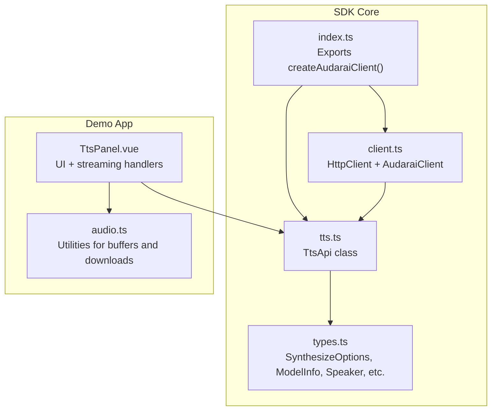
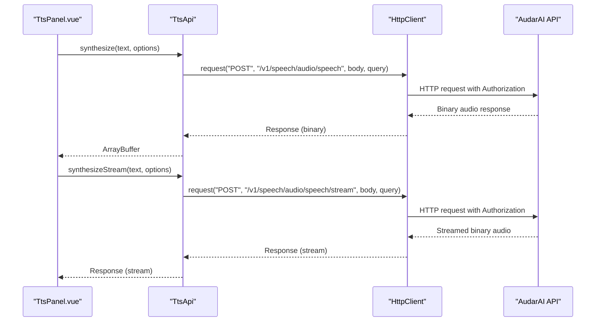
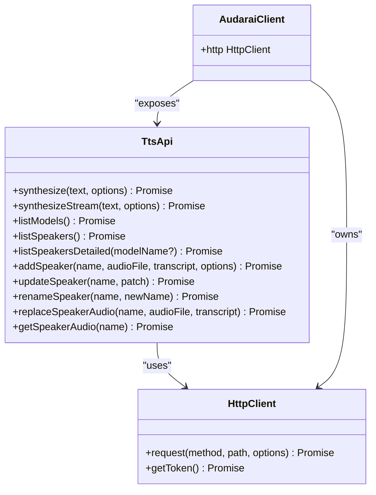
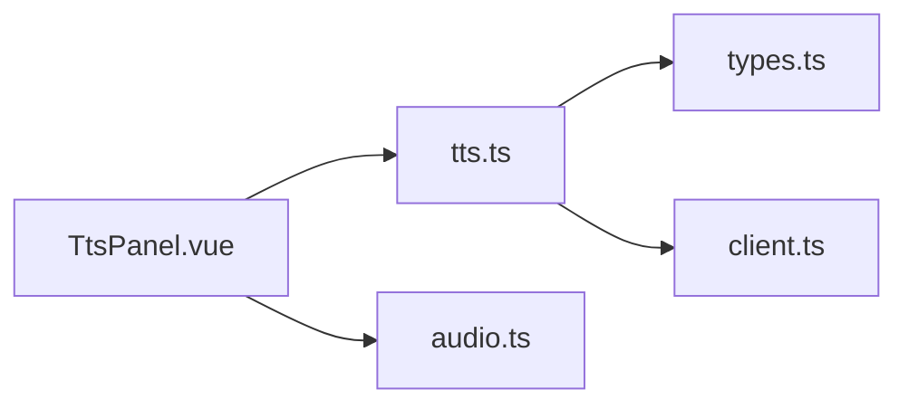

# Core TTS Synthesis API

<cite>
**Referenced Files in This Document**
- [tts.ts](file://src/tts.ts)
- [types.ts](file://src/types.ts)
- [client.ts](file://src/client.ts)
- [index.ts](file://src/index.ts)
- [TtsPanel.vue](file://demo/src/components/TtsPanel.vue)
- [audio.ts](file://demo/src/utils/audio.ts)
- [README.md](file://README.md)
</cite>

## Table of Contents
1. [Introduction](#introduction)
2. [Project Structure](#project-structure)
3. [Core Components](#core-components)
4. [Architecture Overview](#architecture-overview)
5. [Detailed Component Analysis](#detailed-component-analysis)
6. [Dependency Analysis](#dependency-analysis)
7. [Performance Considerations](#performance-considerations)
8. [Troubleshooting Guide](#troubleshooting-guide)
9. [Conclusion](#conclusion)

## Introduction
This document provides comprehensive technical documentation for the core Text-to-Speech (TTS) synthesis functionality in the AudarAI JavaScript/TypeScript SDK. It focuses on:
- The primary synthesize() method for generating speech from text synchronously
- The synthesizeStream() method for real-time audio streaming
- The SynthesizeOptions interface and its parameters
- Practical examples for basic synthesis, streaming, and parameter optimization
- Return value structures, error handling, and performance considerations

## Project Structure
The TTS module is implemented as a dedicated API class that encapsulates HTTP interactions with the AudarAI platform. It integrates with the shared HTTP client and exposes convenience methods for synthesis, streaming, and voice management.

**Diagram sources**
- [index.ts:128-193](file://src/index.ts#L128-L193)
- [client.ts:93-213](file://src/client.ts#L93-L213)
- [tts.ts:11-231](file://src/tts.ts#L11-L231)
- [types.ts:128-151](file://src/types.ts#L128-L151)
- [TtsPanel.vue:1-590](file://demo/src/components/TtsPanel.vue#L1-L590)
- [audio.ts:1-69](file://demo/src/utils/audio.ts#L1-L69)

**Section sources**
- [index.ts:128-193](file://src/index.ts#L128-L193)
- [client.ts:93-213](file://src/client.ts#L93-L213)
- [tts.ts:11-231](file://src/tts.ts#L11-L231)
- [types.ts:128-151](file://src/types.ts#L128-L151)

## Core Components
- TtsApi: Provides synchronous and streaming synthesis, model and voice discovery, and speaker management.
- HttpClient: Handles authentication, token refresh, and HTTP request/response processing.
- SynthesizeOptions: Defines synthesis parameters including voice, model, response format, speed, provider, and advanced generation controls.

Key responsibilities:
- synthesize(text, options): Returns an ArrayBuffer containing the synthesized audio.
- synthesizeStream(text, options): Returns a Response object with a readable stream for real-time consumption.
- listModels(), listSpeakers(), listSpeakersDetailed(modelName?): Retrieves available models and voices.
- addSpeaker(), updateSpeaker(), renameSpeaker(), replaceSpeakerAudio(), getSpeakerAudio(): Manages custom voices.

**Section sources**
- [tts.ts:11-231](file://src/tts.ts#L11-L231)
- [client.ts:93-213](file://src/client.ts#L93-L213)
- [types.ts:128-151](file://src/types.ts#L128-L151)

## Architecture Overview
The TTS API follows a layered architecture:
- Presentation/UI: Demo panel demonstrates synthesis and streaming.
- API Layer: TtsApi encapsulates synthesis and voice management.
- Transport Layer: HttpClient manages authentication and HTTP requests.
- Platform Services: Back-end endpoints handle synthesis, model discovery, and speaker profiles.

**Diagram sources**
- [tts.ts:14-66](file://src/tts.ts#L14-L66)
- [client.ts:133-212](file://src/client.ts#L133-L212)
- [TtsPanel.vue:297-408](file://demo/src/components/TtsPanel.vue#L297-L408)

## Detailed Component Analysis

### SynthesizeOptions Interface
Defines all parameters for synthesis requests.

Parameters:
- voice: Speaker/voice profile name (optional; defaults to "default")
- model: TTS model ("tts-1" | "tts-1-hd"; default: "tts-1")
- response_format: Output audio format ("mp3" | "opus" | "aac" | "flac" | "wav" | "pcm"; default: "mp3")
- speed: Speech speed (range 0.25–4.0; default: 1.0)
- provider: Provider selection ("flash" | "turbo" | "pro"; optional)
- temperature: Sampling temperature (0.0–2.0)
- top_p: Nucleus sampling probability (0.0–1.0)
- top_k: Top-K sampling (1–500)
- seed: Random seed for reproducibility
- min_tokens: Minimum tokens to generate (1–1000)
- max_tokens: Maximum tokens to generate (100–8192)

Notes:
- Advanced parameters (temperature, top_p, top_k, seed, min_tokens, max_tokens) are conditionally included in the request body when provided.

**Section sources**
- [types.ts:128-151](file://src/types.ts#L128-L151)

### synthesize(text, options)
Purpose:
- Generates speech from text and returns an ArrayBuffer containing the audio.

Behavior:
- Constructs a request body with defaults for voice, model, response_format, and speed.
- Conditionally includes advanced generation parameters when provided.
- Sends a POST request to "/v1/speech/audio/speech".
- Sets expectBinary to true to receive binary data.
- Returns the Response’s arrayBuffer().

Return value:
- Promise<ArrayBuffer> representing the synthesized audio bytes.

Error handling:
- Inherits HTTP error handling from HttpClient, including authentication, rate limits, and general API errors.

Performance considerations:
- Suitable for short to medium-length texts.
- For long-form content, consider streaming to reduce latency and memory usage.

**Section sources**
- [tts.ts:14-38](file://src/tts.ts#L14-L38)
- [client.ts:187-212](file://src/client.ts#L187-L212)

### synthesizeStream(text, options)
Purpose:
- Streams synthesized audio as a Response with a readable stream for real-time consumption.

Behavior:
- Same parameter processing as synthesize().
- Sends a POST request to "/v1/speech/audio/speech/stream".
- Returns the Response object directly, allowing the caller to read the body stream.

Return value:
- Promise<Response> with a body stream of audio data.

Streaming usage patterns (from demo):
- MediaSource Extensions (MSE) for low-latency playback when supported by the format.
- Buffered playback for formats not supported by MSE.

**Section sources**
- [tts.ts:44-66](file://src/tts.ts#L44-L66)
- [TtsPanel.vue:387-408](file://demo/src/components/TtsPanel.vue#L387-L408)

### Model and Voice Discovery
- listModels(): Retrieves available TTS models with metadata.
- listSpeakers(): Lists speaker names (backward compatibility).
- listSpeakersDetailed(modelName?): Lists detailed speaker information filtered by compatible model.

These methods support dynamic UI selection and ensure that only compatible voices are presented to users.

**Section sources**
- [tts.ts:68-94](file://src/tts.ts#L68-L94)

### Speaker Management
- addSpeaker(name, audioFile, transcript, options): Uploads a custom voice profile with optional metadata and compatible models.
- updateSpeaker(name, patch): Updates description, metadata, and compatible models.
- renameSpeaker(name, newName): Renames a speaker.
- replaceSpeakerAudio(name, audioFile, transcript): Replaces reference audio and transcript.
- getSpeakerAudio(name): Downloads the stored reference audio as a Blob.

These operations enable custom voice cloning and management workflows.

**Section sources**
- [tts.ts:106-229](file://src/tts.ts#L106-L229)

### Class Relationship Diagram

**Diagram sources**
- [tts.ts:11-231](file://src/tts.ts#L11-L231)
- [client.ts:93-213](file://src/client.ts#L93-L213)
- [index.ts:170-192](file://src/index.ts#L170-L192)

## Dependency Analysis
- TtsApi depends on HttpClient for HTTP operations and on SynthesizeOptions for request construction.
- The demo UI (TtsPanel.vue) consumes TtsApi methods and provides streaming handlers for MSE and buffered playback.
- Types define the contract for synthesis parameters and response structures.

**Diagram sources**
- [tts.ts:11-231](file://src/tts.ts#L11-L231)
- [types.ts:128-151](file://src/types.ts#L128-L151)
- [client.ts:93-213](file://src/client.ts#L93-L213)
- [TtsPanel.vue:1-590](file://demo/src/components/TtsPanel.vue#L1-L590)
- [audio.ts:1-69](file://demo/src/utils/audio.ts#L1-L69)

**Section sources**
- [tts.ts:11-231](file://src/tts.ts#L11-L231)
- [types.ts:128-151](file://src/types.ts#L128-L151)
- [client.ts:93-213](file://src/client.ts#L93-L213)
- [TtsPanel.vue:1-590](file://demo/src/components/TtsPanel.vue#L1-L590)
- [audio.ts:1-69](file://demo/src/utils/audio.ts#L1-L69)

## Performance Considerations
- Synchronous synthesis (ArrayBuffer):
  - Best for short texts or when immediate playback is desired.
  - Memory usage scales with output size; consider streaming for long-form content.
- Streaming synthesis:
  - Reduces latency and memory footprint for long audio.
  - MSE enables low-latency playback for supported formats (e.g., mp3, aac).
  - Buffered playback ensures compatibility for unsupported formats.
- Parameter tuning:
  - speed: Adjust for pacing; higher values increase perceived volume slightly.
  - temperature/top_p/top_k: Control creativity and stability; lower values yield more consistent results.
  - min_tokens/max_tokens: Bound generation length for predictable resource usage.
- Provider selection:
  - Provider affects latency, quality, and cost; choose based on use case requirements.

**Section sources**
- [tts.ts:14-66](file://src/tts.ts#L14-L66)
- [TtsPanel.vue:314-385](file://demo/src/components/TtsPanel.vue#L314-L385)
- [types.ts:128-151](file://src/types.ts#L128-L151)

## Troubleshooting Guide
Common issues and resolutions:
- Authentication failures:
  - Ensure a valid authentication mode is configured and tokens are refreshed.
  - The SDK automatically retries on 401 with refreshed tokens.
- Rate limiting:
  - Expect RateLimitedError; implement backoff and retry logic.
- Insufficient balance:
  - InsufficientBalanceError indicates account credit exhaustion.
- Unsupported formats:
  - For streaming, use formats supported by MSE when available; otherwise fall back to buffered playback.
- Provider/model mismatch:
  - Use listModels() and listSpeakersDetailed(modelName?) to select compatible combinations.

Error handling patterns:
- Catch typed errors (AuthenticationError, InsufficientBalanceError, RateLimitedError, ApiError) and handle appropriately.
- Log detailed messages and retry strategies for transient failures.

**Section sources**
- [client.ts:187-212](file://src/client.ts#L187-L212)
- [README.md:733-763](file://README.md#L733-L763)

## Conclusion
The AudarAI TTS API provides a robust, flexible interface for text-to-speech synthesis with both synchronous and streaming capabilities. By leveraging SynthesizeOptions, developers can fine-tune audio quality, speed, and generation behavior. The demo showcases practical streaming patterns and voice management workflows, enabling efficient and scalable voice experiences across browsers and Node.js environments.