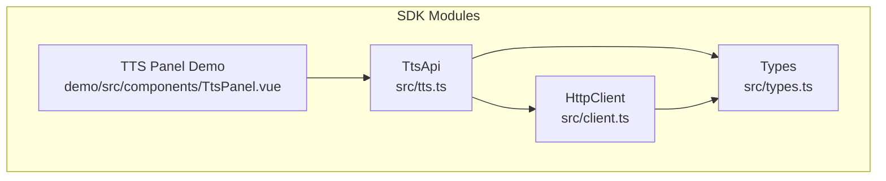
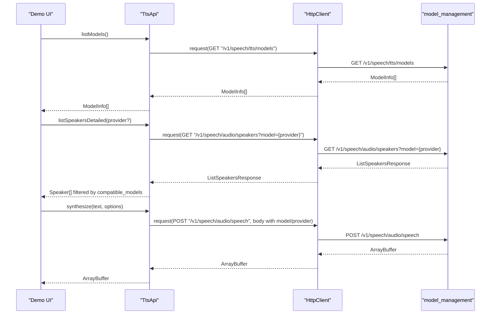
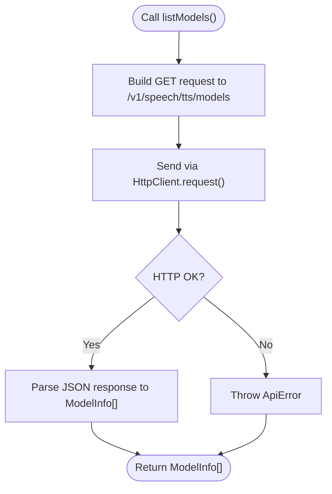
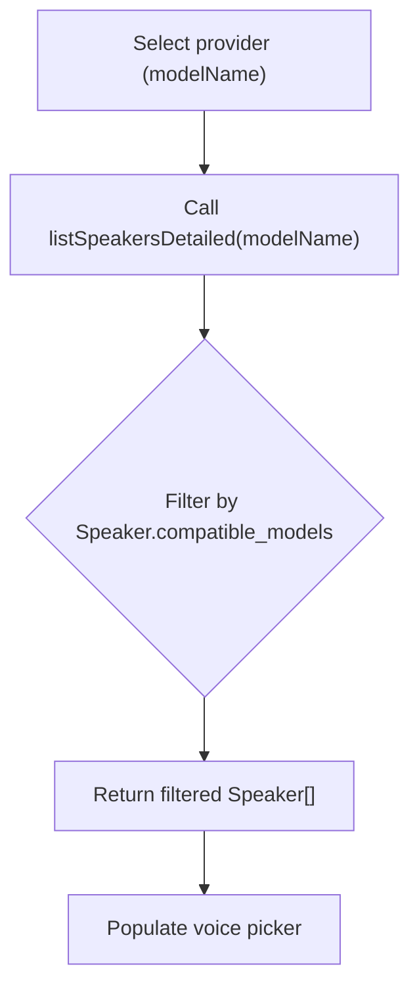
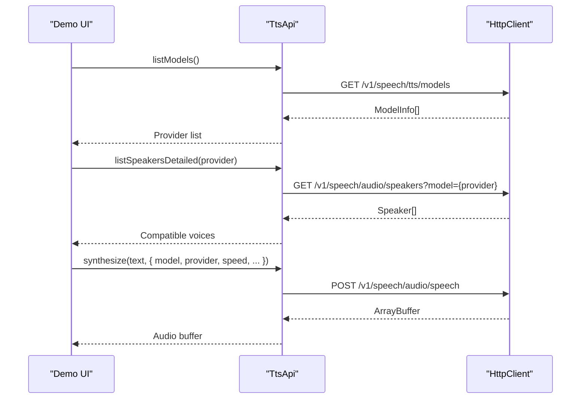
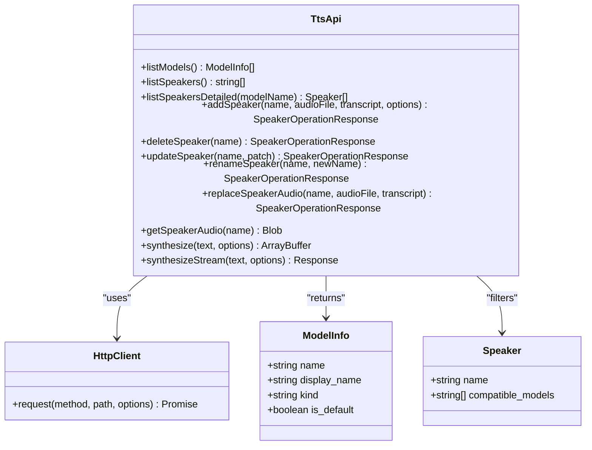

# TTS Model Management

<cite>
**Referenced Files in This Document**
- [tts.ts](file://src/tts.ts)
- [types.ts](file://src/types.ts)
- [TtsPanel.vue](file://demo/src/components/TtsPanel.vue)
- [README.md](file://README.md)
- [client.ts](file://src/client.ts)
</cite>

## Table of Contents
1. [Introduction](#introduction)
2. [Project Structure](#project-structure)
3. [Core Components](#core-components)
4. [Architecture Overview](#architecture-overview)
5. [Detailed Component Analysis](#detailed-component-analysis)
6. [Dependency Analysis](#dependency-analysis)
7. [Performance Considerations](#performance-considerations)
8. [Troubleshooting Guide](#troubleshooting-guide)
9. [Conclusion](#conclusion)

## Introduction
This document explains the TTS model management functionality in the SDK, focusing on how to enumerate available TTS models, understand model compatibility with speakers, and leverage model-specific parameters. It covers the listModels() method, ModelInfo interface properties, speaker compatibility, model selection criteria, quality vs speed trade-offs, and practical examples drawn from the demo UI. It also outlines how models integrate with the broader TTS ecosystem and addresses model availability, updates, and deprecation handling.

## Project Structure
The TTS model management spans several modules:
- TTS API client exposing listModels(), synthesize(), and speaker management
- Type definitions for ModelInfo, SynthesizeOptions, Speaker, and related payloads
- Demo UI demonstrating model enumeration, speaker compatibility filtering, and model selection
- HTTP client handling authentication, token refresh, and request/response processing

**Diagram sources**
- [tts.ts:11-71](file://src/tts.ts#L11-L71)
- [types.ts:111-151](file://src/types.ts#L111-L151)
- [client.ts:93-213](file://src/client.ts#L93-L213)
- [TtsPanel.vue:248-274](file://demo/src/components/TtsPanel.vue#L248-L274)

**Section sources**
- [tts.ts:11-71](file://src/tts.ts#L11-L71)
- [types.ts:111-151](file://src/types.ts#L111-L151)
- [client.ts:93-213](file://src/client.ts#L93-L213)
- [TtsPanel.vue:248-274](file://demo/src/components/TtsPanel.vue#L248-L274)

## Core Components
- TtsApi.listModels(): Retrieves available TTS models from model_management. Returns an array of ModelInfo objects.
- ModelInfo: Describes a model’s handle, display name, capability kind, and default flag.
- Speaker and compatible_models: Defines which TTS models a speaker can be used with.
- SynthesizeOptions: Provides model selection and model-specific parameters (e.g., provider, speed, temperature, top_p, top_k, seed, min_tokens, max_tokens).
- Demo UI: Demonstrates listing providers, filtering speakers by provider, and synthesizing audio with selected model and options.

**Section sources**
- [tts.ts:68-71](file://src/tts.ts#L68-L71)
- [types.ts:111-120](file://src/types.ts#L111-L120)
- [types.ts:77-97](file://src/types.ts#L77-L97)
- [types.ts:128-151](file://src/types.ts#L128-L151)
- [TtsPanel.vue:248-274](file://demo/src/components/TtsPanel.vue#L248-L274)

## Architecture Overview
The TTS model management flow integrates with the broader TTS ecosystem as follows:
- Clients call listModels() to discover available TTS providers and select a default or preferred provider.
- Clients call listSpeakersDetailed(modelName?) to filter voices compatible with the chosen provider.
- Clients synthesize audio using the selected voice, model, and model-specific parameters.
- The SDK’s HttpClient manages authentication and request routing.

**Diagram sources**
- [tts.ts:68-71](file://src/tts.ts#L68-L71)
- [tts.ts:87-94](file://src/tts.ts#L87-L94)
- [tts.ts:15-38](file://src/tts.ts#L15-L38)
- [client.ts:133-213](file://src/client.ts#L133-L213)

## Detailed Component Analysis

### listModels() Method
- Purpose: Enumerate available TTS models from model_management.
- Behavior: Sends a GET request to /v1/speech/tts/models and returns ModelInfo[].
- Integration: Used by the demo to populate the provider dropdown and select a default provider.

**Diagram sources**
- [tts.ts:68-71](file://src/tts.ts#L68-L71)
- [client.ts:133-213](file://src/client.ts#L133-L213)

**Section sources**
- [tts.ts:68-71](file://src/tts.ts#L68-L71)
- [README.md:209-217](file://README.md#L209-L217)
- [TtsPanel.vue:251-261](file://demo/src/components/TtsPanel.vue#L251-L261)

### ModelInfo Interface Properties
- name: Unique handle (e.g., "tts-flash") suitable for provider selection.
- display_name: Human-friendly label for UI.
- kind: Capability tag ("tts").
- is_default: Indicates the default model for the "tts" kind.

These properties enable clients to:
- Populate provider lists in UIs.
- Select a default model when none is specified.
- Pass provider as a query parameter to downstream endpoints.

**Section sources**
- [types.ts:111-120](file://src/types.ts#L111-L120)
- [README.md:209-217](file://README.md#L209-L217)

### Speaker Compatibility and Filtering
- Speaker.compatible_models: Lists TTS model names this voice can be used with.
- listSpeakersDetailed(modelName?): Filters voices to those compatible with the given model name.
- Demo behavior: Watches provider selection and refreshes speakers to ensure the voice picker only shows compatible voices.

**Diagram sources**
- [tts.ts:87-94](file://src/tts.ts#L87-L94)
- [types.ts:77-97](file://src/types.ts#L77-L97)
- [TtsPanel.vue:19-38](file://demo/src/components/TtsPanel.vue#L19-L38)

**Section sources**
- [tts.ts:87-94](file://src/tts.ts#L87-L94)
- [types.ts:77-97](file://src/types.ts#L77-L97)
- [TtsPanel.vue:19-38](file://demo/src/components/TtsPanel.vue#L19-L38)

### Model Selection Criteria and Trade-offs
- Quality vs Speed:
  - speed parameter adjusts speech rate (range 0.25–4.0). Higher speeds reduce latency but may reduce perceived quality.
  - provider parameter selects among "flash", "turbo", "pro" tiers; higher tiers generally offer better quality at the cost of latency and throughput.
- Model-specific parameters:
  - temperature (0.0–2.0): Controls randomness; lower values yield more deterministic results.
  - top_p (0.0–1.0): Nucleus sampling probability; affects diversity.
  - top_k (1–500): Top-K sampling; influences token selection breadth.
  - seed: Reproducible generation when set.
  - min_tokens/max_tokens: Limits generation length.
- Practical guidance:
  - Use "flash" for fast prototyping and demos.
  - Use "turbo" for balanced quality and speed.
  - Use "pro" for highest fidelity when latency and cost permit.
  - Tune speed and sampling parameters to match use case (e.g., narration vs dialogue).

**Section sources**
- [types.ts:128-151](file://src/types.ts#L128-L151)
- [README.md:219-233](file://README.md#L219-L233)
- [TtsPanel.vue:287-295](file://demo/src/components/TtsPanel.vue#L287-L295)

### Model Enumeration, Compatibility Checking, and Parameter Usage
- Enumerate models:
  - Call listModels() and select a default provider when none is specified.
- Compatibility checking:
  - Call listSpeakersDetailed(provider) to filter voices compatible with the selected provider.
- Model-specific parameters:
  - Pass model and provider in SynthesizeOptions.
  - Adjust speed and sampling parameters for desired trade-offs.

**Diagram sources**
- [tts.ts:68-71](file://src/tts.ts#L68-L71)
- [tts.ts:87-94](file://src/tts.ts#L87-L94)
- [tts.ts:15-38](file://src/tts.ts#L15-L38)
- [client.ts:133-213](file://src/client.ts#L133-L213)

**Section sources**
- [tts.ts:68-71](file://src/tts.ts#L68-L71)
- [tts.ts:87-94](file://src/tts.ts#L87-L94)
- [tts.ts:15-38](file://src/tts.ts#L15-L38)
- [TtsPanel.vue:251-274](file://demo/src/components/TtsPanel.vue#L251-L274)

### Integration with the Broader TTS Ecosystem
- Model discovery:
  - listModels() returns ModelInfo[], enabling clients to present provider options and defaults.
- Speaker integration:
  - Speakers carry compatible_models to constrain voice selection to valid models.
- Cross-service consistency:
  - Other services (e.g., LLM) expose listModels() for their respective kinds, maintaining a uniform pattern across the SDK.

**Section sources**
- [tts.ts:68-71](file://src/tts.ts#L68-L71)
- [types.ts:111-120](file://src/types.ts#L111-L120)
- [types.ts:77-97](file://src/types.ts#L77-L97)

### Model Availability, Updates, and Deprecation Handling
- Availability:
  - listModels() reflects the current set of registered TTS models in model_management.
- Updates:
  - New models appear in subsequent listModels() calls; clients should refresh provider lists periodically.
- Deprecation:
  - Deprecated models may remain in the list until removed; clients should monitor is_default and kind to guide selection.
  - When a model is deprecated, prefer switching to a newer provider (e.g., from "flash" to "turbo"/"pro") and adjust parameters accordingly.

**Section sources**
- [types.ts:111-120](file://src/types.ts#L111-L120)
- [README.md:209-217](file://README.md#L209-L217)

## Dependency Analysis
- TtsApi depends on HttpClient for HTTP operations and on types for request/response shapes.
- Demo UI depends on TtsApi and types to render provider and voice pickers and to synthesize audio.

**Diagram sources**
- [tts.ts:11-230](file://src/tts.ts#L11-L230)
- [client.ts:93-213](file://src/client.ts#L93-L213)
- [types.ts:111-120](file://src/types.ts#L111-L120)
- [types.ts:77-97](file://src/types.ts#L77-L97)

**Section sources**
- [tts.ts:11-230](file://src/tts.ts#L11-L230)
- [client.ts:93-213](file://src/client.ts#L93-L213)
- [types.ts:111-120](file://src/types.ts#L111-L120)
- [types.ts:77-97](file://src/types.ts#L77-L97)

## Performance Considerations
- Provider selection:
  - "flash" offers fastest response times for quick iteration.
  - "turbo" balances quality and latency for general use.
  - "pro" prioritizes quality; expect higher latency and cost.
- Parameter tuning:
  - Increase speed moderately to reduce latency; tune temperature/top_p/top_k for desired creativity vs stability.
  - Use seed for reproducible outputs in testing or controlled scenarios.
- Streaming synthesis:
  - Use synthesizeStream() for long-form content to minimize buffering and improve perceived latency.

[No sources needed since this section provides general guidance]

## Troubleshooting Guide
- Authentication failures:
  - HttpClient throws AuthenticationError on 401; ensure credentials are valid and refreshed.
- Rate limiting:
  - HttpClient throws RateLimitedError on 429; observe Retry-After header and back off.
- API errors:
  - HttpClient throws ApiError for non-2xx responses; inspect message and status code.
- Provider mismatch:
  - If a voice is incompatible with the selected provider, listSpeakersDetailed() will filter it out; switch provider or choose a compatible voice.

**Section sources**
- [client.ts:133-213](file://src/client.ts#L133-L213)

## Conclusion
The TTS model management system centers on listModels() for discovering providers, ModelInfo for representing models, and speaker-compatible_models for constraining voice selection. By combining provider selection with model-specific parameters (speed, temperature, top_p, top_k, seed, min_tokens, max_tokens), developers can optimize for quality vs speed trade-offs. The demo UI demonstrates practical usage patterns, including dynamic provider selection and speaker filtering. For robust deployments, monitor model availability, prepare for deprecations, and adjust parameters to meet latency and quality goals.