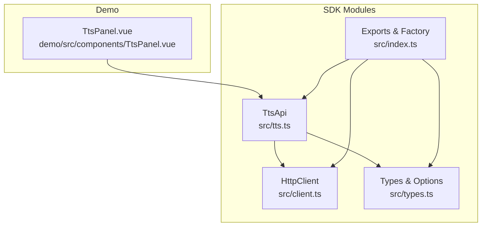
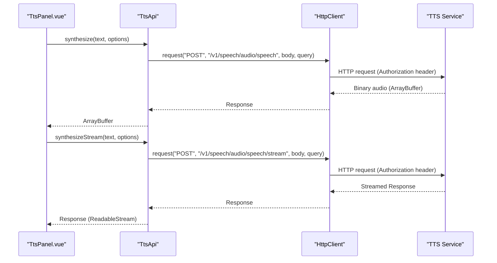
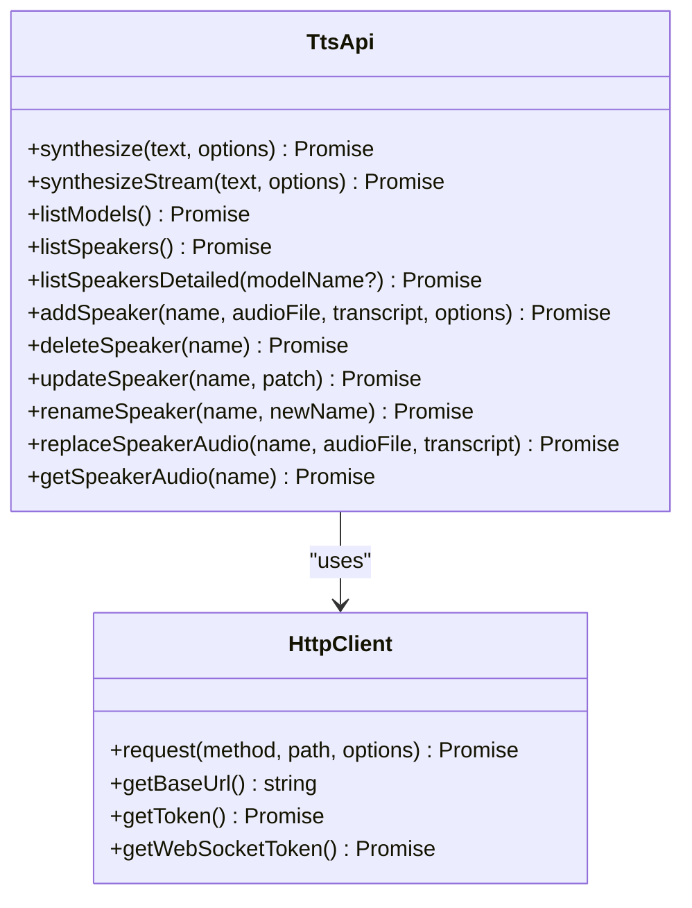

# Text-to-Speech (TTS) API

<cite>
**Referenced Files in This Document**
- [tts.ts](file://src/tts.ts)
- [client.ts](file://src/client.ts)
- [types.ts](file://src/types.ts)
- [index.ts](file://src/index.ts)
- [TtsPanel.vue](file://demo/src/components/TtsPanel.vue)
- [README.md](file://README.md)
</cite>

## Table of Contents
1. [Introduction](#introduction)
2. [Project Structure](#project-structure)
3. [Core Components](#core-components)
4. [Architecture Overview](#architecture-overview)
5. [Detailed Component Analysis](#detailed-component-analysis)
6. [Dependency Analysis](#dependency-analysis)
7. [Performance Considerations](#performance-considerations)
8. [Troubleshooting Guide](#troubleshooting-guide)
9. [Conclusion](#conclusion)
10. [Appendices](#appendices)

## Introduction
This document provides comprehensive API documentation for the Text-to-Speech (TTS) service exposed by the SDK. It covers:
- REST endpoints for batch synthesis and streaming synthesis
- Audio format specifications and quality options
- Voice selection and speaker management
- Practical examples for synthesis and streaming
- Configuration, validation, and return value structures
- Performance optimization and troubleshooting tips

The TTS module exposes a high-level API for synthesizing speech from text, listing available models and voices, and managing custom speaker profiles.

## Project Structure
The TTS functionality is implemented in a small set of focused modules:
- TTS API wrapper: orchestrates HTTP requests and returns audio buffers or streams
- HTTP client: manages authentication, token refresh, and request/response handling
- Type definitions: define request/response schemas, options, and speaker metadata
- Demo panel: demonstrates synthesis, streaming, and speaker management UI flows

**Diagram sources**
- [tts.ts:11-231](file://src/tts.ts#L11-L231)
- [client.ts:93-213](file://src/client.ts#L93-L213)
- [types.ts:128-151](file://src/types.ts#L128-L151)
- [index.ts:1-193](file://src/index.ts#L1-L193)
- [TtsPanel.vue:1-590](file://demo/src/components/TtsPanel.vue#L1-L590)

**Section sources**
- [tts.ts:1-231](file://src/tts.ts#L1-L231)
- [client.ts:1-411](file://src/client.ts#L1-L411)
- [types.ts:1-1265](file://src/types.ts#L1-L1265)
- [index.ts:1-193](file://src/index.ts#L1-L193)
- [TtsPanel.vue:1-590](file://demo/src/components/TtsPanel.vue#L1-L590)

## Core Components
- TtsApi: Provides methods for synthesis, streaming, listing models and voices, and managing custom speakers.
- HttpClient: Handles authentication, token lifecycle, URL building, and response parsing.
- Types: Defines SynthesizeOptions, ModelInfo, Speaker, VoiceMetadata, and related response structures.

Key capabilities:
- Batch synthesis returning an ArrayBuffer
- Streaming synthesis returning a Response stream
- Listing models and voices
- Managing custom speaker profiles (upload, update, rename, replace audio, delete)
- Retrieving speaker reference audio

**Section sources**
- [tts.ts:11-231](file://src/tts.ts#L11-L231)
- [client.ts:93-213](file://src/client.ts#L93-L213)
- [types.ts:128-151](file://src/types.ts#L128-L151)

## Architecture Overview
The TTS API follows a layered architecture:
- Presentation layer: TtsPanel.vue (demo UI) invokes TtsApi methods
- Domain layer: TtsApi encapsulates endpoint logic and request construction
- Infrastructure layer: HttpClient performs HTTP requests, manages tokens, and parses responses
- Contracts: Types define request/response schemas and option sets

**Diagram sources**
- [TtsPanel.vue:297-312](file://demo/src/components/TtsPanel.vue#L297-L312)
- [tts.ts:14-38](file://src/tts.ts#L14-L38)
- [tts.ts:44-66](file://src/tts.ts#L44-L66)
- [client.ts:133-173](file://src/client.ts#L133-L173)

## Detailed Component Analysis

### REST Endpoints

#### Batch Synthesis
- Endpoint: POST /v1/speech/audio/speech
- Purpose: Synthesize speech and return an audio ArrayBuffer
- Request body: JSON with text, voice, model, response_format, speed, and optional sampling parameters
- Query parameters: provider (optional)
- Response: Binary audio (ArrayBuffer)

Example usage:
- See [TtsPanel.vue:297-312](file://demo/src/components/TtsPanel.vue#L297-L312) for UI-driven invocation
- See [tts.ts:14-38](file://src/tts.ts#L14-L38) for the implementation

Validation and defaults:
- voice defaults to "default"
- model defaults to "tts-1"
- response_format defaults to "mp3"
- speed defaults to 1.0
- Optional parameters temperature, top_p, top_k, seed, min_tokens, max_tokens are included when provided

Streaming counterpart:
- Endpoint: POST /v1/speech/audio/speech/stream
- Behavior: Same request body as batch synthesis, but returns a streamed Response suitable for piping

**Section sources**
- [tts.ts:14-38](file://src/tts.ts#L14-L38)
- [tts.ts:44-66](file://src/tts.ts#L44-L66)
- [types.ts:128-151](file://src/types.ts#L128-L151)
- [TtsPanel.vue:297-312](file://demo/src/components/TtsPanel.vue#L297-L312)

#### List Models
- Endpoint: GET /v1/speech/tts/models
- Purpose: Retrieve available TTS models
- Response: Array of ModelInfo

Implementation:
- [tts.ts:68-71](file://src/tts.ts#L68-L71)
- ModelInfo fields: name, display_name, kind, is_default

**Section sources**
- [tts.ts:68-71](file://src/tts.ts#L68-L71)
- [types.ts:111-120](file://src/types.ts#L111-L120)

#### List Speakers (Legacy Names)
- Endpoint: GET /v1/speech/audio/speakers
- Purpose: List available voices/speakers (names only)
- Response: Array of strings (names)

Implementation:
- [tts.ts:73-77](file://src/tts.ts#L73-L77)

**Section sources**
- [tts.ts:73-77](file://src/tts.ts#L73-L77)

#### List Speakers (Detailed)
- Endpoint: GET /v1/speech/audio/speakers
- Query parameter: model (optional) to filter voices compatible with a specific model
- Response: ListSpeakersResponse with an array of Speaker objects

Speaker fields:
- name, description, reference_text, available_codecs, num_codes, metadata, compatible_models, owner_user_id, tenant_id

Implementation:
- [tts.ts:87-94](file://src/tts.ts#L87-L94)
- [types.ts:77-97](file://src/types.ts#L77-L97)

**Section sources**
- [tts.ts:87-94](file://src/tts.ts#L87-L94)
- [types.ts:77-97](file://src/types.ts#L77-L97)

#### Add Speaker (Custom Voice Cloning)
- Endpoint: POST /v1/speech/audio/speakers
- Purpose: Upload a custom speaker voice profile
- Form fields:
  - name (required)
  - audio_file (Blob/File, required)
  - transcript (required)
  - description (optional)
  - compatible_models (comma-separated list, optional)
  - metadata fields (gender, language, accent, tone, duration_s, expression_tags, original_profile_id, sample_file)

Response: SpeakerOperationResponse

Implementation:
- [tts.ts:106-142](file://src/tts.ts#L106-L142)

**Section sources**
- [tts.ts:106-142](file://src/tts.ts#L106-L142)
- [types.ts:65-75](file://src/types.ts#L65-L75)
- [types.ts:105-109](file://src/types.ts#L105-L109)

#### Update Speaker
- Endpoint: PATCH /v1/speech/audio/speakers/{name}
- Purpose: Update description, metadata, and/or compatible_models without replacing audio
- Body: JSON with optional fields description, compatible_models, metadata
- Response: SpeakerOperationResponse

Implementation:
- [tts.ts:157-178](file://src/tts.ts#L157-L178)

**Section sources**
- [tts.ts:157-178](file://src/tts.ts#L157-L178)

#### Rename Speaker
- Endpoint: POST /v1/speech/audio/speakers/{name}/rename
- Body: JSON with new_name
- Response: SpeakerOperationResponse

Implementation:
- [tts.ts:185-197](file://src/tts.ts#L185-L197)

**Section sources**
- [tts.ts:185-197](file://src/tts.ts#L185-L197)

#### Replace Speaker Audio
- Endpoint: PUT /v1/speech/audio/speakers/{name}/audio
- Form fields: audio_file (Blob/File), transcript (required)
- Response: SpeakerOperationResponse

Implementation:
- [tts.ts:203-216](file://src/tts.ts#L203-L216)

**Section sources**
- [tts.ts:203-216](file://src/tts.ts#L203-L216)

#### Delete Speaker
- Endpoint: DELETE /v1/speech/audio/speakers/{name}
- Response: SpeakerOperationResponse

Implementation:
- [tts.ts:144-150](file://src/tts.ts#L144-L150)

**Section sources**
- [tts.ts:144-150](file://src/tts.ts#L144-L150)

#### Get Speaker Audio
- Endpoint: GET /v1/speech/audio/speakers/{name}/audio
- Response: Binary audio (Blob)

Implementation:
- [tts.ts:222-229](file://src/tts.ts#L222-L229)

**Section sources**
- [tts.ts:222-229](file://src/tts.ts#L222-L229)

### WebSocket Endpoints
- The TTS module does not expose WebSocket endpoints for real-time audio streaming. The SDK’s WebSocket support is primarily for Speech-to-Text and Translation pipelines. See:
  - STT WebSocket: /v1/speech/audio/transcriptions/ws
  - Translation WebSocket: /v1/speech/audio/translations/ws

These endpoints are handled by separate modules (stt.ts and translation.ts). There is no documented WebSocket endpoint for TTS audio streaming in this codebase.

**Section sources**
- [stt.ts:198-215](file://src/stt.ts#L198-L215)
- [translation.ts:258-275](file://src/translation.ts#L258-L275)

### Audio Formats and Quality Options
Supported response formats:
- mp3, opus, aac, flac, wav, pcm

Quality and speed:
- speed: numeric, default 1.0, typical range 0.25–4.0
- provider: selects a TTS provider (e.g., flash, turbo, pro)
- model: tts-1 or tts-1-hd
- Sampling parameters (optional): temperature (0.0–2.0), top_p (0.0–1.0), top_k (1–500), seed, min_tokens (1–1000), max_tokens (100–8192)

Format-specific playback considerations:
- The demo shows MediaSource/MSE support for mp3/aac when supported by the environment.

**Section sources**
- [types.ts:128-151](file://src/types.ts#L128-L151)
- [TtsPanel.vue:314-324](file://demo/src/components/TtsPanel.vue#L314-L324)

### Request/Response Schemas

#### SynthesizeOptions
- voice: string
- model: string ("tts-1" | "tts-1-hd")
- response_format: "mp3" | "opus" | "aac" | "flac" | "wav" | "pcm"
- speed: number
- provider: string
- temperature: number
- top_p: number
- top_k: number
- seed: number
- min_tokens: number
- max_tokens: number

#### ModelInfo
- name: string
- display_name: string
- kind: string
- is_default: boolean

#### Speaker
- name: string
- description: string
- reference_text: string
- available_codecs: string[]
- num_codes: Record<string, number>
- metadata: VoiceMetadata
- compatible_models: string[]
- owner_user_id: string | null
- tenant_id: string | null

#### VoiceMetadata
- gender: string
- language: string
- accent: string
- tone: string
- duration_s: number
- expression_tags: string[]
- original_profile_id: string
- sample_file: string

#### SpeakerOperationResponse
- success: boolean
- message: string
- data: unknown

**Section sources**
- [types.ts:128-151](file://src/types.ts#L128-L151)
- [types.ts:111-120](file://src/types.ts#L111-L120)
- [types.ts:77-97](file://src/types.ts#L77-L97)
- [types.ts:65-75](file://src/types.ts#L65-L75)
- [types.ts:105-109](file://src/types.ts#L105-L109)

### Practical Examples

#### Voice Synthesis Request
- Use TtsApi.synthesize with text and options (voice, model, response_format, speed, provider).
- Example invocation is demonstrated in the demo panel.

References:
- [TtsPanel.vue:297-312](file://demo/src/components/TtsPanel.vue#L297-L312)
- [tts.ts:14-38](file://src/tts.ts#L14-L38)

#### Streaming Synthesis Setup
- Use TtsApi.synthesizeStream to receive a Response stream.
- The demo shows two streaming strategies:
  - MSE streaming for supported formats (mp3/aac)
  - Buffered playback for unsupported formats

References:
- [TtsPanel.vue:387-408](file://demo/src/components/TtsPanel.vue#L387-L408)
- [tts.ts:44-66](file://src/tts.ts#L44-L66)

#### Custom Speaker Cloning Workflow
- Upload a reference audio and transcript with addSpeaker
- Optionally update description/metadata/compatible_models with updateSpeaker
- Rename or replace audio as needed
- Delete a speaker when no longer needed

References:
- [tts.ts:106-142](file://src/tts.ts#L106-L142)
- [tts.ts:157-178](file://src/tts.ts#L157-L178)
- [tts.ts:185-197](file://src/tts.ts#L185-L197)
- [tts.ts:203-216](file://src/tts.ts#L203-L216)
- [tts.ts:144-150](file://src/tts.ts#L144-L150)

### Configuration Options
- Authentication modes (mutually exclusive):
  - publishableKey
  - accessToken (static or dynamic)
  - apiKey
  - appId (+ appSecret for backend)
- Token refresh threshold (default: 30 seconds before expiry)
- Custom fetch implementation for Node.js environments
- WebSocket token exchange for STT/Translation (not for TTS)

References:
- [client.ts:215-410](file://src/client.ts#L215-L410)
- [README.md:117-204](file://README.md#L117-L204)

### Parameter Validation
- Defaults are applied for missing options in synthesis
- Optional parameters are included only when provided
- Provider query parameter is supported for synthesis endpoints
- Token lifecycle and automatic refresh are handled transparently

References:
- [tts.ts:14-38](file://src/tts.ts#L14-L38)
- [tts.ts:44-66](file://src/tts.ts#L44-L66)
- [client.ts:133-173](file://src/client.ts#L133-L173)

### Return Value Structures
- Batch synthesis: ArrayBuffer
- Streaming synthesis: Response (ReadableStream)
- Speaker operations: SpeakerOperationResponse
- Lists: ModelInfo[], Speaker[], string[] (legacy speakers)

References:
- [tts.ts:14-38](file://src/tts.ts#L14-L38)
- [tts.ts:44-66](file://src/tts.ts#L44-L66)
- [types.ts:105-109](file://src/types.ts#L105-L109)

## Dependency Analysis
- TtsApi depends on HttpClient for HTTP operations
- HttpClient depends on token providers and fetch implementation
- Types define the contracts used across the API surface
- Export index aggregates TtsApi and related types

**Diagram sources**
- [tts.ts:11-231](file://src/tts.ts#L11-L231)
- [client.ts:93-213](file://src/client.ts#L93-L213)

**Section sources**
- [tts.ts:11-231](file://src/tts.ts#L11-L231)
- [client.ts:93-213](file://src/client.ts#L93-L213)
- [index.ts:1-193](file://src/index.ts#L1-L193)

## Performance Considerations
- Use streaming synthesis for long-form content to reduce latency and memory usage
- Prefer supported formats (mp3/aac) for MSE streaming when available
- Tune speed within 0.25–4.0 to balance quality and latency
- Select appropriate provider (flash, turbo, pro) based on quality and cost requirements
- Leverage token refresh threshold to minimize interruptions during long sessions

[No sources needed since this section provides general guidance]

## Troubleshooting Guide
Common issues and resolutions:
- Authentication failures: Ensure a valid authentication mode is configured and tokens are refreshed
- Rate limiting: Respect Retry-After headers and implement backoff
- Insufficient balance: Handle 402 responses and prompt account top-up
- Unsupported audio formats: Fall back to buffered playback or adjust response_format

References:
- [client.ts:187-212](file://src/client.ts#L187-L212)
- [README.md:733-763](file://README.md#L733-L763)

**Section sources**
- [client.ts:187-212](file://src/client.ts#L187-L212)
- [README.md:733-763](file://README.md#L733-L763)

## Conclusion
The TTS module provides a clean, well-typed interface for synthesizing speech, managing custom voices, and streaming audio. It integrates seamlessly with the SDK’s authentication and HTTP infrastructure, enabling robust deployments across browsers and Node.js environments. While WebSocket streaming is not exposed for TTS in this codebase, the existing REST endpoints and streaming capabilities offer strong performance and flexibility for most use cases.

[No sources needed since this section summarizes without analyzing specific files]

## Appendices

### API Summary
- Batch synthesis: POST /v1/speech/audio/speech
- Streaming synthesis: POST /v1/speech/audio/speech/stream
- List models: GET /v1/speech/tts/models
- List speakers: GET /v1/speech/audio/speakers
- Add speaker: POST /v1/speech/audio/speakers
- Update speaker: PATCH /v1/speech/audio/speakers/{name}
- Rename speaker: POST /v1/speech/audio/speakers/{name}/rename
- Replace speaker audio: PUT /v1/speech/audio/speakers/{name}/audio
- Delete speaker: DELETE /v1/speech/audio/speakers/{name}
- Get speaker audio: GET /v1/speech/audio/speakers/{name}/audio

**Section sources**
- [tts.ts:14-38](file://src/tts.ts#L14-L38)
- [tts.ts:44-66](file://src/tts.ts#L44-L66)
- [tts.ts:68-71](file://src/tts.ts#L68-L71)
- [tts.ts:73-77](file://src/tts.ts#L73-L77)
- [tts.ts:87-94](file://src/tts.ts#L87-L94)
- [tts.ts:106-142](file://src/tts.ts#L106-L142)
- [tts.ts:157-178](file://src/tts.ts#L157-L178)
- [tts.ts:185-197](file://src/tts.ts#L185-L197)
- [tts.ts:203-216](file://src/tts.ts#L203-L216)
- [tts.ts:144-150](file://src/tts.ts#L144-L150)
- [tts.ts:222-229](file://src/tts.ts#L222-L229)