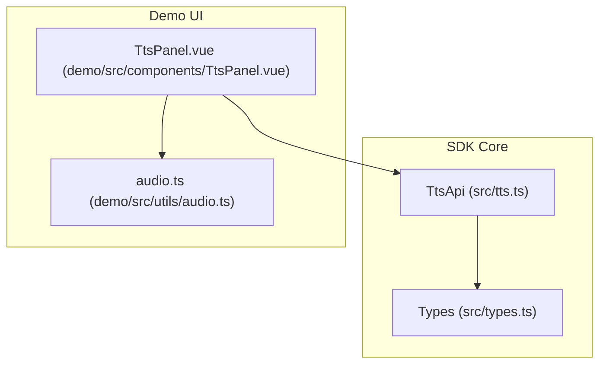
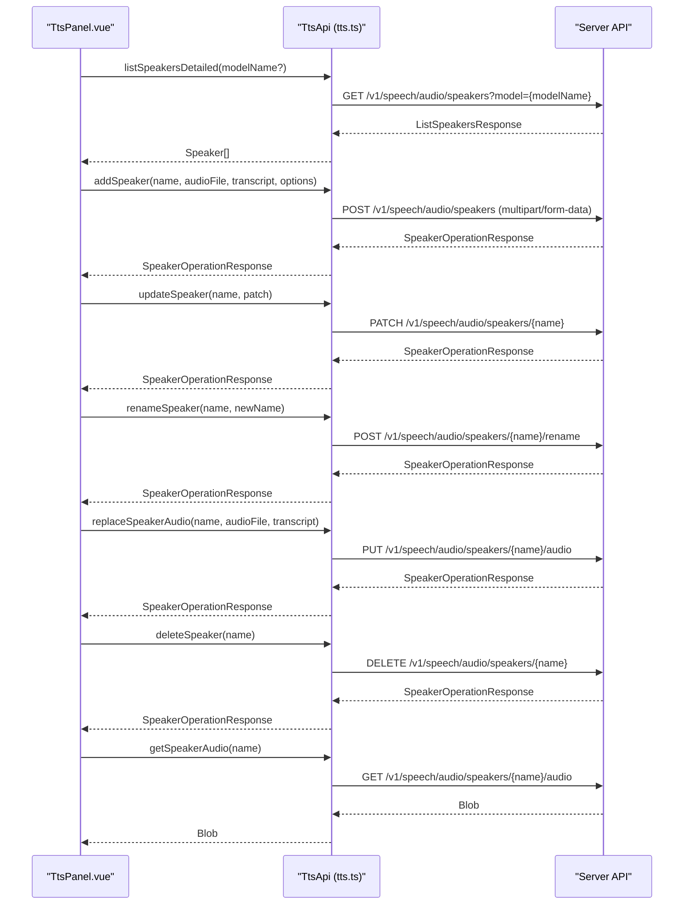
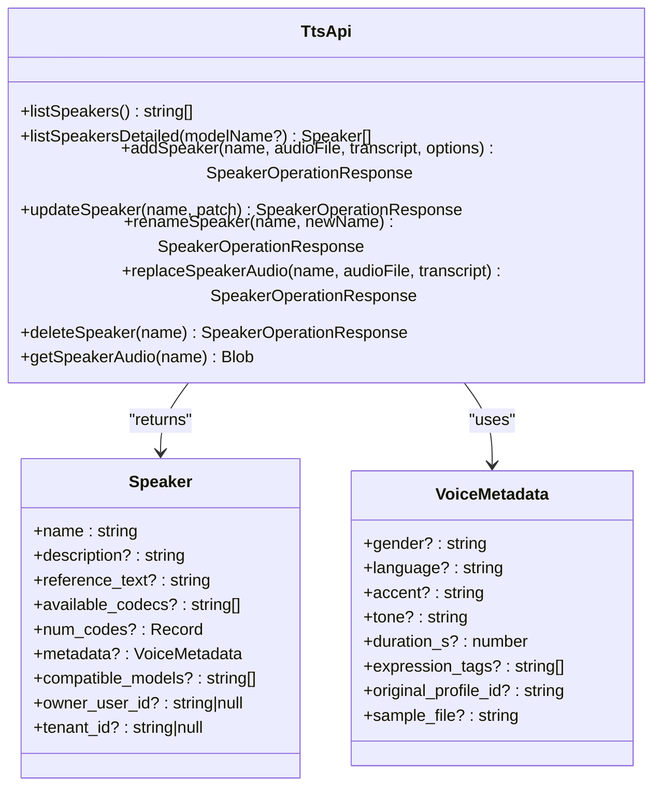

# Voice and Speaker Management

<cite>
**Referenced Files in This Document**
- [tts.ts](file://src/tts.ts)
- [types.ts](file://src/types.ts)
- [TtsPanel.vue](file://demo/src/components/TtsPanel.vue)
- [audio.ts](file://demo/src/utils/audio.ts)
- [README.md](file://README.md)
</cite>

## Table of Contents
1. [Introduction](#introduction)
2. [Project Structure](#project-structure)
3. [Core Components](#core-components)
4. [Architecture Overview](#architecture-overview)
5. [Detailed Component Analysis](#detailed-component-analysis)
6. [Dependency Analysis](#dependency-analysis)
7. [Performance Considerations](#performance-considerations)
8. [Troubleshooting Guide](#troubleshooting-guide)
9. [Conclusion](#conclusion)
10. [Appendices](#appendices)

## Introduction
This document explains the voice and speaker management capabilities exposed by the SDK’s Text-to-Speech module. It covers listing available voices, filtering by model, and retrieving detailed speaker information. It also documents the complete custom speaker workflow: adding a voice profile with transcript validation, updating metadata and descriptions, renaming voices, replacing reference audio, and deleting profiles. Finally, it defines the VoiceMetadata interface and provides practical examples and troubleshooting guidance.

## Project Structure
The voice and speaker management features are implemented in the TTS module and its associated types. The demo showcases these capabilities in a real-world UI.

**Diagram sources**
- [tts.ts:11-231](file://src/tts.ts#L11-L231)
- [types.ts:65-103](file://src/types.ts#L65-L103)
- [TtsPanel.vue:1-590](file://demo/src/components/TtsPanel.vue#L1-L590)
- [audio.ts:1-69](file://demo/src/utils/audio.ts#L1-L69)

**Section sources**
- [tts.ts:11-231](file://src/tts.ts#L11-L231)
- [types.ts:65-103](file://src/types.ts#L65-L103)
- [TtsPanel.vue:1-590](file://demo/src/components/TtsPanel.vue#L1-L590)
- [audio.ts:1-69](file://demo/src/utils/audio.ts#L1-L69)

## Core Components
- TtsApi: Provides methods for voice synthesis, listing models, listing speakers (simple and detailed), and managing custom speaker profiles.
- VoiceMetadata and Speaker types: Define the structure of voice metadata and speaker records returned by the API.
- Demo UI: Demonstrates speaker listing, filtering by provider/model, editing metadata, renaming, replacing audio, and playing reference audio.

Key methods:
- listSpeakers(): Returns a list of speaker names.
- listSpeakersDetailed(modelName?): Returns detailed speaker information, optionally filtered by a specific model.
- addSpeaker(name, audioFile, transcript, options): Uploads a custom voice profile with optional description, compatible models, and metadata.
- updateSpeaker(name, patch): Updates description, compatible models, and metadata without altering reference audio.
- renameSpeaker(name, newName): Renames a speaker.
- replaceSpeakerAudio(name, audioFile, transcript): Replaces the reference audio and transcript.
- deleteSpeaker(name): Removes a custom speaker profile.
- getSpeakerAudio(name): Retrieves the stored reference audio for playback.

**Section sources**
- [tts.ts:73-231](file://src/tts.ts#L73-L231)
- [types.ts:65-103](file://src/types.ts#L65-L103)
- [TtsPanel.vue:19-92](file://demo/src/components/TtsPanel.vue#L19-L92)
- [TtsPanel.vue:170-246](file://demo/src/components/TtsPanel.vue#L170-L246)

## Architecture Overview
The TTS module exposes a clean API surface for voice management. The demo UI integrates with these methods to provide a user-friendly experience for selecting, editing, and testing speakers.

**Diagram sources**
- [tts.ts:73-231](file://src/tts.ts#L73-L231)
- [TtsPanel.vue:19-92](file://demo/src/components/TtsPanel.vue#L19-L92)
- [TtsPanel.vue:170-246](file://demo/src/components/TtsPanel.vue#L170-L246)

## Detailed Component Analysis

### VoiceMetadata Interface
VoiceMetadata describes free-form metadata associated with a speaker. It includes fields for gender, language, accent, tone, duration, expression tags, and optional identifiers. Additional arbitrary fields are supported.

Fields:
- gender: string
- language: string
- accent: string
- tone: string
- duration_s: number
- expression_tags: string[]
- original_profile_id: string
- sample_file: string
- [key: string]: unknown

Usage contexts:
- addSpeaker(options.metadata)
- updateSpeaker(patch.metadata)
- Returned in Speaker.metadata

**Section sources**
- [types.ts:65-75](file://src/types.ts#L65-L75)

### Speaker Type
Speaker represents a voice profile with:
- name: string
- description?: string
- reference_text?: string
- available_codecs?: string[]
- num_codes?: Record<string, number>
- metadata?: VoiceMetadata
- compatible_models?: string[]
- owner_user_id?: string | null
- tenant_id?: string | null

Returned by listSpeakersDetailed and used in UI rendering.

**Section sources**
- [types.ts:77-97](file://src/types.ts#L77-L97)

### List Speakers
- listSpeakers(): Returns an array of speaker names. Useful for backward compatibility or quick selection.
- listSpeakersDetailed(modelName?: string): Returns full speaker records, optionally filtered by a specific model name. This enables UIs to show only voices compatible with the selected provider.

Filtering behavior:
- When modelName is provided, the server filters voices whose compatible_models include the given model name.

**Section sources**
- [tts.ts:73-94](file://src/tts.ts#L73-L94)
- [TtsPanel.vue:19-38](file://demo/src/components/TtsPanel.vue#L19-L38)

### Add Custom Speaker
Purpose:
- Upload a custom voice profile by providing a reference audio file and a transcript. The server validates the transcript against the audio and encodes reference frames for supported codecs.

Method signature:
- addSpeaker(name, audioFile, transcript, options)

Options:
- description?: string
- compatibleModels?: string[]
- metadata?: VoiceMetadata

Behavior:
- The transcript is mandatory and must match the audio content.
- compatible_models should be set for new voices to ensure they remain usable after server bootstrapping.
- Metadata fields are sent as flat form fields.

Validation and encoding:
- The server performs transcript validation and encodes reference audio for all registered codecs.

**Section sources**
- [tts.ts:106-142](file://src/tts.ts#L106-L142)
- [README.md:259-263](file://README.md#L259-L263)

### Update Speaker
Purpose:
- Modify a speaker’s description, metadata, and compatible_models without altering the stored reference audio.

Method signature:
- updateSpeaker(name, patch)

Patch fields:
- description?: string | null
- compatibleModels?: string[]
- metadata?: VoiceMetadata

Behavior:
- Leaving a field undefined preserves the existing value.
- Passing description: "" clears it.

**Section sources**
- [tts.ts:157-178](file://src/tts.ts#L157-L178)
- [TtsPanel.vue:170-188](file://demo/src/components/TtsPanel.vue#L170-L188)

### Rename Speaker
Purpose:
- Change a speaker’s name. The server enforces uniqueness.

Method signature:
- renameSpeaker(name, newName)

Behavior:
- Fails if newName is already taken.
- External references to the old name (e.g., saved sessions) must be updated manually.

**Section sources**
- [tts.ts:185-197](file://src/tts.ts#L185-L197)
- [TtsPanel.vue:190-213](file://demo/src/components/TtsPanel.vue#L190-L213)

### Replace Speaker Audio
Purpose:
- Replace the reference audio and transcript for an existing speaker. The server re-encodes reference frames for all codecs.

Method signature:
- replaceSpeakerAudio(name, audioFile, transcript)

Behavior:
- Requires a matching transcript.
- Triggers re-encoding across all supported codecs.

**Section sources**
- [tts.ts:203-216](file://src/tts.ts#L203-L216)
- [TtsPanel.vue:220-246](file://demo/src/components/TtsPanel.vue#L220-L246)

### Delete Speaker
Purpose:
- Remove a custom speaker profile.

Method signature:
- deleteSpeaker(name)

Behavior:
- Only custom (non-system) voices can be deleted.

**Section sources**
- [tts.ts:144-150](file://src/tts.ts#L144-L150)
- [README.md:265-267](file://README.md#L265-L267)

### Get Speaker Audio
Purpose:
- Retrieve the stored reference audio for inline playback in the UI.

Method signature:
- getSpeakerAudio(name): Promise<Blob>

Behavior:
- Useful for “listen” previews in voice management UIs.

**Section sources**
- [tts.ts:222-229](file://src/tts.ts#L222-L229)
- [TtsPanel.vue:61-92](file://demo/src/components/TtsPanel.vue#L61-L92)

### Demo Integration
The demo demonstrates:
- Provider/model selection and speaker filtering via listModels and listSpeakersDetailed.
- Editing description, metadata, compatible models, renaming, and replacing audio.
- Playing reference audio via getSpeakerAudio.

UI highlights:
- Provider watch triggers speaker refresh to keep the voice list aligned with the selected model.
- Form-driven metadata editing and validation helpers.
- Playback of reference audio with progress logging.

**Section sources**
- [TtsPanel.vue:248-274](file://demo/src/components/TtsPanel.vue#L248-L274)
- [TtsPanel.vue:170-246](file://demo/src/components/TtsPanel.vue#L170-L246)
- [TtsPanel.vue:61-92](file://demo/src/components/TtsPanel.vue#L61-L92)
- [audio.ts:16-26](file://demo/src/utils/audio.ts#L16-L26)

## Dependency Analysis
The TTS module depends on shared types for speaker and metadata definitions. The demo UI depends on TtsApi and utility functions for audio handling.

**Diagram sources**
- [tts.ts:11-231](file://src/tts.ts#L11-L231)
- [types.ts:65-97](file://src/types.ts#L65-L97)

**Section sources**
- [tts.ts:11-231](file://src/tts.ts#L11-L231)
- [types.ts:65-97](file://src/types.ts#L65-L97)

## Performance Considerations
- Prefer listSpeakersDetailed(modelName) to limit the speaker list to voices compatible with the selected provider, reducing downstream filtering overhead in the UI.
- Use streaming synthesis for long-form content to minimize buffering and latency.
- Avoid unnecessary re-encoding by batching updates (e.g., update metadata and compatible_models together in a single call).
- When replacing audio, ensure the new file meets server requirements to prevent repeated validation failures.

[No sources needed since this section provides general guidance]

## Troubleshooting Guide
Common issues and resolutions:
- Transcript mismatch during addSpeaker or replaceSpeakerAudio:
  - Ensure the transcript exactly matches the audio content.
  - Verify the audio quality and length meet server requirements.
- Unavailable provider/model:
  - Use listModels to select a valid provider and then refresh speakers with listSpeakersDetailed(provider).
- Duplicate speaker name on rename:
  - Choose a unique new name; the server will reject duplicates.
- Empty or incompatible compatible_models:
  - Provide at least one valid model name for new voices to ensure they remain usable after server restarts.
- Audio playback issues:
  - Use getSpeakerAudio to fetch the reference audio and play it via the browser’s audio element.
  - Confirm MIME type compatibility for streaming playback.

**Section sources**
- [tts.ts:106-142](file://src/tts.ts#L106-L142)
- [tts.ts:185-197](file://src/tts.ts#L185-L197)
- [TtsPanel.vue:248-274](file://demo/src/components/TtsPanel.vue#L248-L274)
- [TtsPanel.vue:61-92](file://demo/src/components/TtsPanel.vue#L61-L92)

## Conclusion
The SDK provides a robust, end-to-end voice and speaker management experience. Developers can list voices, filter by model, upload custom profiles with transcript validation, and manage speaker lifecycles efficiently. The demo illustrates practical workflows for editing metadata, renaming, replacing audio, and previewing reference recordings.

[No sources needed since this section summarizes without analyzing specific files]

## Appendices

### Practical Examples

- Listing voices filtered by model:
  - Use listModels to discover providers, then listSpeakersDetailed(provider) to get compatible voices.
  - See [TtsPanel.vue:248-274](file://demo/src/components/TtsPanel.vue#L248-L274) and [tts.ts:87-94](file://src/tts.ts#L87-L94).

- Creating a custom speaker:
  - Call addSpeaker with a unique name, a valid audio file, and an exact transcript.
  - Optionally set description, compatible_models, and metadata.
  - See [tts.ts:106-142](file://src/tts.ts#L106-L142) and [README.md:259-263](file://README.md#L259-L263).

- Managing speaker metadata:
  - Use updateSpeaker to change description, compatible_models, and metadata.
  - See [tts.ts:157-178](file://src/tts.ts#L157-L178) and [TtsPanel.vue:170-188](file://demo/src/components/TtsPanel.vue#L170-L188).

- Renaming a speaker:
  - Use renameSpeaker with a unique new name.
  - See [tts.ts:185-197](file://src/tts.ts#L185-L197) and [TtsPanel.vue:190-213](file://demo/src/components/TtsPanel.vue#L190-L213).

- Replacing reference audio:
  - Use replaceSpeakerAudio with a new audio file and transcript.
  - See [tts.ts:203-216](file://src/tts.ts#L203-L216) and [TtsPanel.vue:220-246](file://demo/src/components/TtsPanel.vue#L220-L246).

- Deleting a speaker:
  - Use deleteSpeaker to remove a custom voice.
  - See [tts.ts:144-150](file://src/tts.ts#L144-L150) and [README.md:265-267](file://README.md#L265-L267).

- Previewing reference audio:
  - Use getSpeakerAudio to fetch and play the stored reference audio.
  - See [tts.ts:222-229](file://src/tts.ts#L222-L229) and [TtsPanel.vue:61-92](file://demo/src/components/TtsPanel.vue#L61-L92).

### VoiceMetadata Field Reference
- gender: string
- language: string
- accent: string
- tone: string
- duration_s: number
- expression_tags: string[]
- original_profile_id: string
- sample_file: string
- [key: string]: unknown

**Section sources**
- [types.ts:65-75](file://src/types.ts#L65-L75)