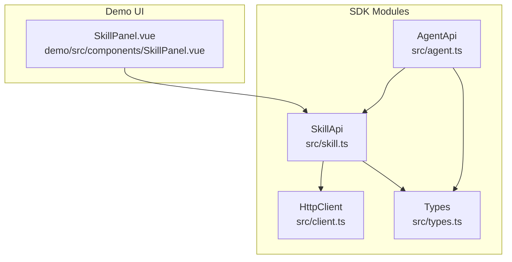
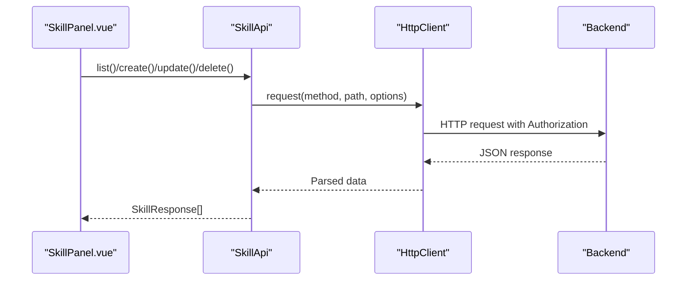
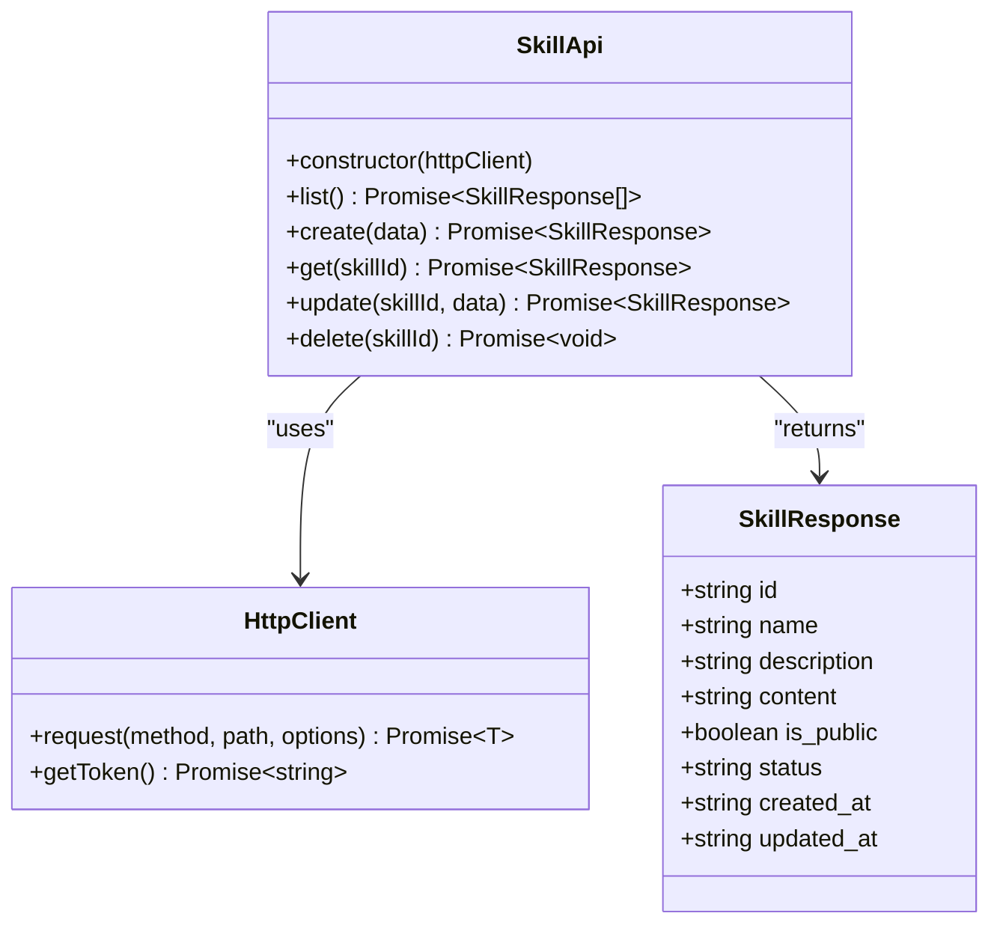
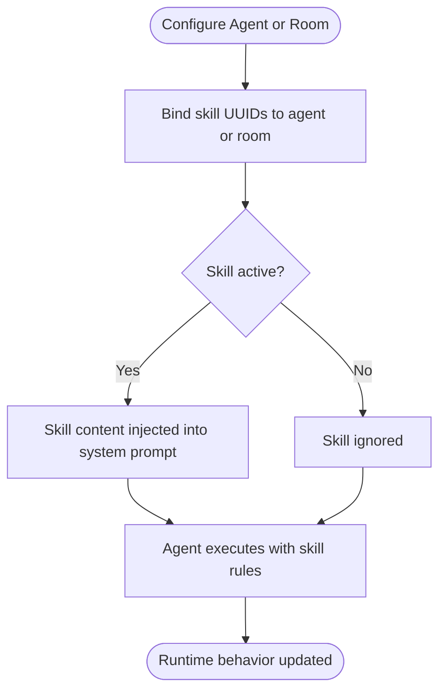
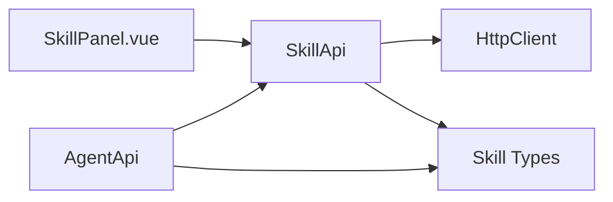

# Skills Management

<cite>
**Referenced Files in This Document**
- [src/skill.ts](file://src/skill.ts)
- [src/agent.ts](file://src/agent.ts)
- [src/types.ts](file://src/types.ts)
- [src/client.ts](file://src/client.ts)
- [demo/src/components/SkillPanel.vue](file://demo/src/components/SkillPanel.vue)
- [README.md](file://README.md)
</cite>

## Table of Contents
1. [Introduction](#introduction)
2. [Project Structure](#project-structure)
3. [Core Components](#core-components)
4. [Architecture Overview](#architecture-overview)
5. [Detailed Component Analysis](#detailed-component-analysis)
6. [Dependency Analysis](#dependency-analysis)
7. [Performance Considerations](#performance-considerations)
8. [Troubleshooting Guide](#troubleshooting-guide)
9. [Conclusion](#conclusion)
10. [Appendices](#appendices)

## Introduction
This document describes the Skills Management system within the AudarAI SDK. It focuses on how skills are defined, created, updated, retrieved, and deleted; how skills are bound to agents and rooms; and how skill content is integrated into agent system prompts. It also covers practical patterns for assigning skills to agents, dynamic skill switching, parameter binding, execution contexts, result processing, chaining patterns, performance optimization, conflict resolution, and troubleshooting integration issues. Advanced topics such as skill inheritance and templates are discussed conceptually, along with guidance for custom skill development.

## Project Structure
The Skills Management feature spans several modules:
- API client for skills: a dedicated SkillApi class encapsulating CRUD operations.
- Agent and room binding: agents and rooms can be configured with skill identifiers to activate/deactivate skills at runtime.
- Type definitions: strongly typed interfaces for skill creation, updates, and responses.
- Demo UI: a SkillPanel component demonstrating CRUD operations in a Vue-based demo app.
- Client and HTTP transport: authentication, token management, and HTTP request handling.

**Diagram sources**
- [src/skill.ts:1-32](file://src/skill.ts#L1-L32)
- [src/agent.ts:11-28](file://src/agent.ts#L11-L28)
- [src/client.ts:93-213](file://src/client.ts#L93-L213)
- [src/types.ts:1082-1109](file://src/types.ts#L1082-L1109)
- [demo/src/components/SkillPanel.vue:1-271](file://demo/src/components/SkillPanel.vue#L1-L271)

**Section sources**
- [src/skill.ts:1-32](file://src/skill.ts#L1-L32)
- [src/agent.ts:11-28](file://src/agent.ts#L11-L28)
- [src/types.ts:1082-1109](file://src/types.ts#L1082-L1109)
- [demo/src/components/SkillPanel.vue:1-271](file://demo/src/components/SkillPanel.vue#L1-L271)

## Core Components
- SkillApi: Provides list, create, get, update, and delete operations for skills.
- AgentApi: Exposes skills as part of the agent management surface; agents can be bound to skills via skill identifiers.
- Types: Defines SkillCreate, SkillUpdate, and SkillResponse interfaces; includes skill-related fields in AgentCreate/Update and RoomCreate/Update.
- HttpClient: Handles authentication, token refresh, and HTTP request/response processing.
- Demo SkillPanel: Demonstrates CRUD operations for skills in a UI.

Key capabilities:
- Define skills as Markdown snippets injected into agent system prompts.
- Bind skills to agents and rooms to control activation.
- Update skill content dynamically to change agent behavior without redeploying agents.
- Delete skills to remove behavior rules.

**Section sources**
- [src/skill.ts:7-31](file://src/skill.ts#L7-L31)
- [src/types.ts:1082-1109](file://src/types.ts#L1082-L1109)
- [src/types.ts:505-539](file://src/types.ts#L505-L539)
- [src/types.ts:729-731](file://src/types.ts#L729-L731)
- [README.md:577-594](file://README.md#L577-L594)

## Architecture Overview
Skills are managed as resources and activated by referencing skill identifiers on agents and rooms. The SkillApi interacts with the backend via HttpClient, which manages authentication and token refresh. The demo SkillPanel demonstrates UI-driven CRUD operations.

**Diagram sources**
- [demo/src/components/SkillPanel.vue:14-89](file://demo/src/components/SkillPanel.vue#L14-L89)
- [src/skill.ts:7-31](file://src/skill.ts#L7-L31)
- [src/client.ts:133-212](file://src/client.ts#L133-L212)

## Detailed Component Analysis

### SkillApi: CRUD Operations
SkillApi exposes:
- list(): Fetch all skills.
- create(data): Create a new skill with name, description, content, and is_public flag.
- get(skillId): Retrieve a specific skill.
- update(skillId, data): Modify skill attributes.
- delete(skillId): Remove a skill.

Implementation highlights:
- Uses HttpClient.request with appropriate HTTP methods and JSON payloads.
- Encodes skillId in URLs for get/update/delete.
- Returns strongly typed SkillResponse objects.

**Diagram sources**
- [src/skill.ts:4-31](file://src/skill.ts#L4-L31)
- [src/client.ts:93-213](file://src/client.ts#L93-L213)
- [src/types.ts:1099-1109](file://src/types.ts#L1099-L1109)

**Section sources**
- [src/skill.ts:7-31](file://src/skill.ts#L7-L31)
- [src/types.ts:1082-1109](file://src/types.ts#L1082-L1109)

### Agent and Room Binding
Agents and rooms can be configured with skill identifiers:
- AgentCreate/AgentUpdate include a skills field for binding skill UUIDs to agents.
- RoomCreate/RoomUpdate include a skill_ids field for binding skills to rooms.

These bindings control which skills are active for an agent or room. Updating these arrays enables dynamic skill switching at runtime.

**Diagram sources**
- [src/types.ts:527-528](file://src/types.ts#L527-L528)
- [src/types.ts:730-731](file://src/types.ts#L730-L731)

**Section sources**
- [src/types.ts:527-528](file://src/types.ts#L527-L528)
- [src/types.ts:730-731](file://src/types.ts#L730-L731)

### Skill Categories, Proficiency Levels, and Conditional Triggering
- Categories: Skills are categorized by name and description; categorization is application-defined via naming and grouping in the UI.
- Proficiency: There is no built-in proficiency level field for skills in the current types; behavior customization is achieved through content and binding.
- Conditional triggering: There is no explicit conditional skill triggering mechanism in the current codebase; skills are activated by inclusion in agent or room bindings.

Practical guidance:
- Use descriptive names and descriptions to organize skills by category.
- Keep skill content focused and modular to facilitate reuse and composition.
- Combine multiple skills by binding several UUIDs to an agent or room to achieve complex behaviors.

**Section sources**
- [src/types.ts:1082-1109](file://src/types.ts#L1082-L1109)
- [src/types.ts:527-528](file://src/types.ts#L527-L528)
- [src/types.ts:730-731](file://src/types.ts#L730-L731)

### Practical Examples

#### Example 1: Create a skill and inject Markdown into agent system prompt
- Use SkillApi.create with name, description, and content (Markdown).
- The content is intended to be injected into the agent’s system prompt.

References:
- [README.md:584-588](file://README.md#L584-L588)
- [src/types.ts:1086-1087](file://src/types.ts#L1086-L1087)

#### Example 2: Assign skills to an agent
- Include skill UUIDs in the AgentCreate/AgentUpdate.skills array.

References:
- [src/types.ts:527-528](file://src/types.ts#L527-L528)

#### Example 3: Dynamic skill switching
- Update AgentUpdate.skills to add/remove skill UUIDs at runtime.

References:
- [src/types.ts:561](file://src/types.ts#L561-L561)

#### Example 4: Skill parameter configuration
- Skills are content-focused; parameters are typically provided via agent-level variables or tool bindings. See AgentCreate/Update variables and ToolBinding.

References:
- [src/types.ts:505-539](file://src/types.ts#L505-L539)
- [src/types.ts:500-503](file://src/types.ts#L500-L503)

#### Example 5: Skill execution context and result processing
- Execution occurs when the agent runs with the skill-bound system prompt. Results are processed by the agent’s downstream components (TTS, STT, LLM). The SDK does not define a separate execution API for skills.

References:
- [README.md:577-594](file://README.md#L577-L594)

#### Example 6: Skill chaining patterns
- Chain multiple skills by binding multiple skill UUIDs to an agent or room. The order of injection follows the binding order; ensure content coherence.

References:
- [src/types.ts:527-528](file://src/types.ts#L527-L528)
- [src/types.ts:730-731](file://src/types.ts#L730-L731)

### Advanced Patterns

#### Skill Inheritance and Templates
- The codebase defines ArchetypeCreate/Update/Response with default_skills and default_channels. While not a direct “inheritance” pattern for skills, archetypes can serve as templates that pre-bind a curated set of skills to agents.

References:
- [src/types.ts:1113-1127](file://src/types.ts#L1113-L1127)
- [src/types.ts:1129-1139](file://src/types.ts#L1129-L1139)

#### Custom Skill Development
- Develop reusable skills by structuring content clearly and consistently. Use the demo SkillPanel to create, test, and iterate on skills before binding them to agents.

References:
- [demo/src/components/SkillPanel.vue:14-89](file://demo/src/components/SkillPanel.vue#L14-L89)

## Dependency Analysis
SkillApi depends on HttpClient for HTTP communication and on SkillCreate/SkillUpdate/SkillResponse types. AgentApi composes SkillApi and exposes it alongside other resource APIs. The demo SkillPanel depends on SkillApi to perform CRUD operations.

**Diagram sources**
- [demo/src/components/SkillPanel.vue:8-9](file://demo/src/components/SkillPanel.vue#L8-L9)
- [src/agent.ts:23](file://src/agent.ts#L23)
- [src/skill.ts:1-2](file://src/skill.ts#L1-L2)
- [src/client.ts:93-213](file://src/client.ts#L93-L213)
- [src/types.ts:1082-1109](file://src/types.ts#L1082-L1109)

**Section sources**
- [src/agent.ts:23](file://src/agent.ts#L23)
- [src/skill.ts:1-2](file://src/skill.ts#L1-L2)
- [src/types.ts:1082-1109](file://src/types.ts#L1082-L1109)

## Performance Considerations
- Minimize redundant skill updates: batch updates to reduce network overhead.
- Use selective binding: only bind necessary skills to agents and rooms to keep system prompts concise.
- Leverage caching: cache frequently accessed skills in the UI to reduce repeated fetches.
- Monitor token refresh: ensure proper token refresh thresholds to avoid repeated authentication failures.

## Troubleshooting Guide
Common issues and resolutions:
- Authentication failures: Ensure the client is initialized with a valid authentication mode and that tokens are refreshed appropriately.
- HTTP errors: Inspect error types (AuthenticationError, InsufficientBalanceError, RateLimitedError, ApiError) and handle accordingly.
- Skill not taking effect: Verify that the skill UUID is present in the agent’s skills array or room’s skill_ids array.

References:
- [src/client.ts:133-212](file://src/client.ts#L133-L212)
- [README.md:733-763](file://README.md#L733-L763)

**Section sources**
- [src/client.ts:133-212](file://src/client.ts#L133-L212)
- [README.md:733-763](file://README.md#L733-L763)

## Conclusion
Skills Management in the AudarAI SDK centers on defining behavior via Markdown snippets and activating them by binding skill UUIDs to agents and rooms. The SkillApi provides straightforward CRUD operations, while the demo SkillPanel illustrates practical usage. By organizing skills with clear categories, leveraging archetypes as templates, and carefully managing bindings, teams can build flexible, maintainable agent behaviors. For advanced scenarios, combine multiple skills, use variables and tool bindings for parameterization, and apply performance and troubleshooting practices outlined above.

## Appendices

### API Reference Summary
- SkillApi.list(): Returns an array of SkillResponse.
- SkillApi.create(data): Creates a new skill with SkillCreate fields.
- SkillApi.get(skillId): Retrieves a specific skill.
- SkillApi.update(skillId, data): Updates skill fields via SkillUpdate.
- SkillApi.delete(skillId): Deletes a skill.

References:
- [src/skill.ts:7-31](file://src/skill.ts#L7-L31)
- [src/types.ts:1082-1109](file://src/types.ts#L1082-L1109)