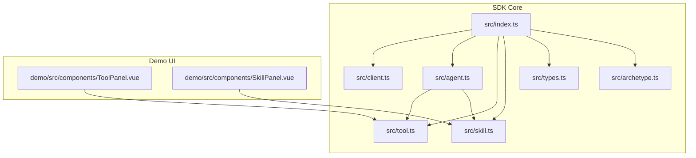
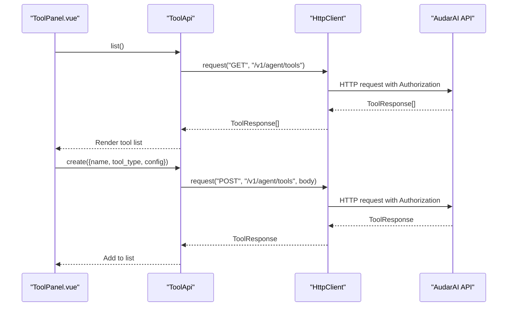
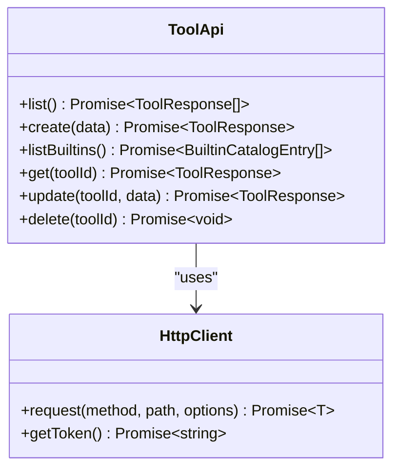
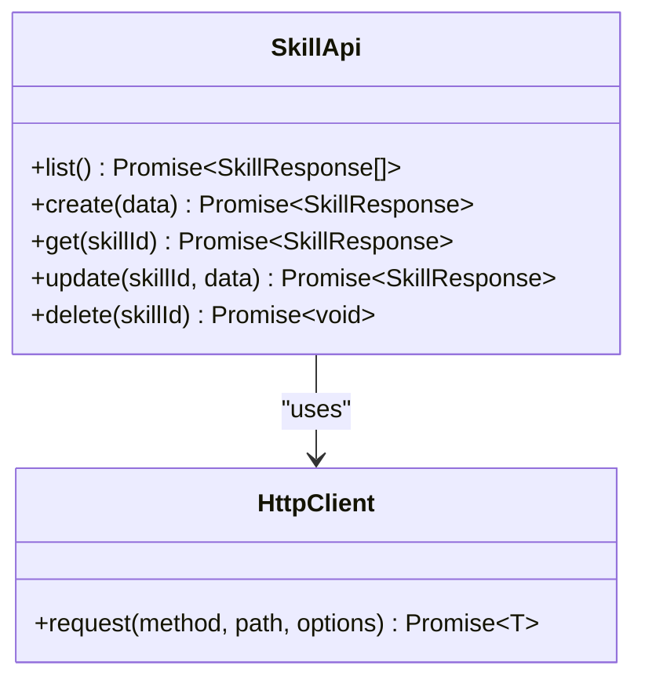
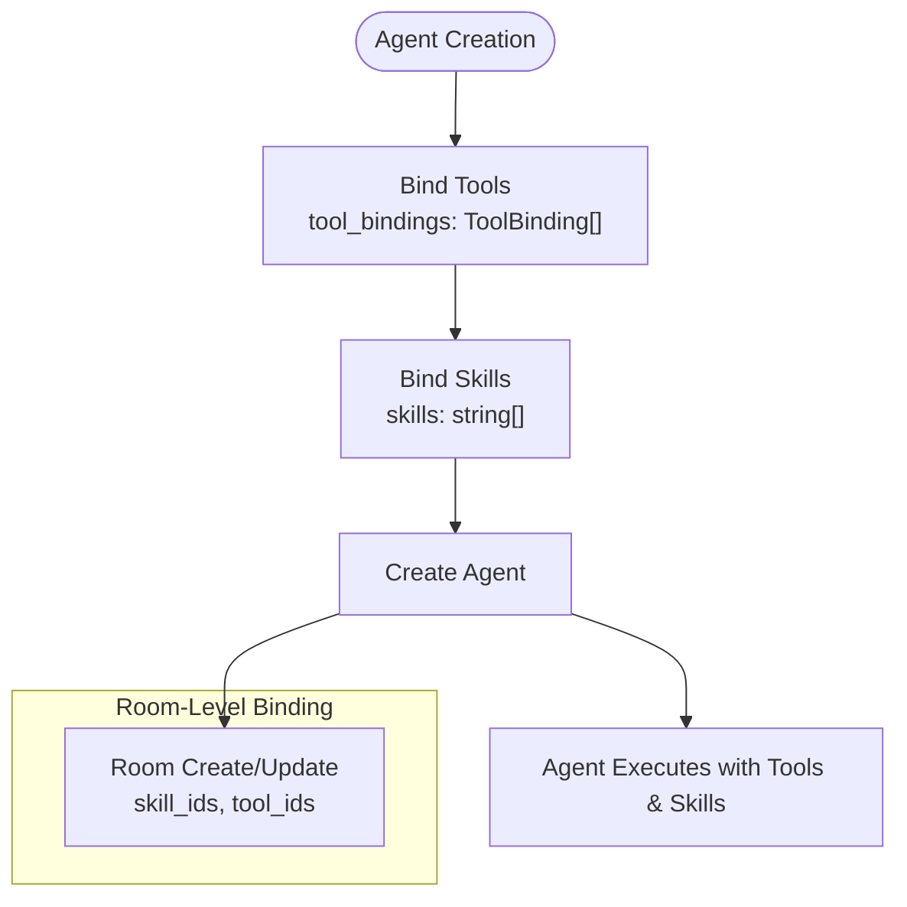
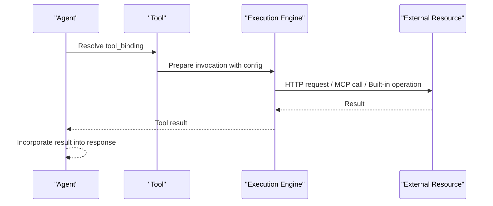
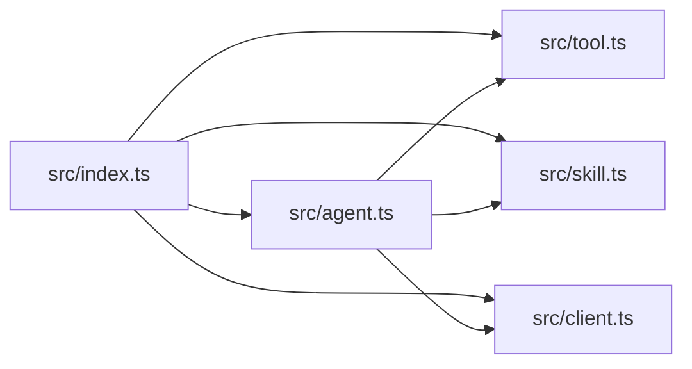

# Tools & Skills System

<cite>
**Referenced Files in This Document**
- [README.md](file://README.md)
- [package.json](file://package.json)
- [src/index.ts](file://src/index.ts)
- [src/client.ts](file://src/client.ts)
- [src/tool.ts](file://src/tool.ts)
- [src/skill.ts](file://src/skill.ts)
- [src/types.ts](file://src/types.ts)
- [src/agent.ts](file://src/agent.ts)
- [src/archetype.ts](file://src/archetype.ts)
- [demo/src/components/ToolPanel.vue](file://demo/src/components/ToolPanel.vue)
- [demo/src/components/SkillPanel.vue](file://demo/src/components/SkillPanel.vue)
</cite>

## Table of Contents
1. [Introduction](#introduction)
2. [Project Structure](#project-structure)
3. [Core Components](#core-components)
4. [Architecture Overview](#architecture-overview)
5. [Detailed Component Analysis](#detailed-component-analysis)
6. [Dependency Analysis](#dependency-analysis)
7. [Performance Considerations](#performance-considerations)
8. [Troubleshooting Guide](#troubleshooting-guide)
9. [Conclusion](#conclusion)
10. [Appendices](#appendices)

## Introduction
This document explains the Tools & Skills System for AI agents, focusing on extensible capability management. It covers:
- Tool definition and registration (HTTP, built-in, MCP)
- Skill configuration and activation
- Capability binding to agents and rooms
- Agent customization patterns
- Execution workflows, parameter passing, and result handling
- Practical examples from the demo UI
- Security, performance, and troubleshooting guidance

The system enables agents to call external APIs, leverage built-in toolkits, connect to MCP servers, and inject behavior via skills into their system prompts.

## Project Structure
The SDK exposes a cohesive API surface for tools and skills, backed by a typed HTTP client and shared type definitions. The demo application demonstrates CRUD operations for tools and skills and integrates them into agent workflows.

**Diagram sources**
- [src/index.ts](file://src/index.ts)
- [src/client.ts](file://src/client.ts)
- [src/agent.ts](file://src/agent.ts)
- [src/tool.ts](file://src/tool.ts)
- [src/skill.ts](file://src/skill.ts)
- [src/types.ts](file://src/types.ts)
- [src/archetype.ts](file://src/archetype.ts)
- [demo/src/components/ToolPanel.vue](file://demo/src/components/ToolPanel.vue)
- [demo/src/components/SkillPanel.vue](file://demo/src/components/SkillPanel.vue)

**Section sources**
- [README.md:53-58](file://README.md#L53-L58)
- [package.json:1-26](file://package.json#L1-L26)

## Core Components
- Tool management: Create, list, update, delete tools; list built-in toolkits.
- Skill management: Create, list, update, delete skills.
- Agent integration: Bind tools and skills to agents; bind skills to rooms.
- Type safety: Strongly typed tool configs, skill content, and agent binding structures.

Key capabilities:
- Tool types: HTTP, built-in, MCP
- Tool binding: Attach tools to agents via tool bindings
- Skill binding: Attach skills to agents and rooms
- Parameter validation: UI-level validation in the demo; server-side validation applies to create/update operations

**Section sources**
- [src/tool.ts:4-36](file://src/tool.ts#L4-L36)
- [src/skill.ts:4-32](file://src/skill.ts#L4-L32)
- [src/types.ts:1007-1110](file://src/types.ts#L1007-L1110)
- [src/types.ts:500-539](file://src/types.ts#L500-L539)
- [src/agent.ts:11-28](file://src/agent.ts#L11-L28)

## Architecture Overview
The Tools & Skills System is layered:
- HTTP client layer: Handles authentication, token refresh, and request/response handling
- API facade layer: Provides typed methods for tools, skills, agents, and related resources
- Type definitions: Define tool configs, skill content, and binding structures
- Demo UI: Demonstrates tool and skill lifecycle and agent binding

**Diagram sources**
- [demo/src/components/ToolPanel.vue:14-22](file://demo/src/components/ToolPanel.vue#L14-L22)
- [src/tool.ts:7-16](file://src/tool.ts#L7-L16)
- [src/client.ts:133-173](file://src/client.ts#L133-L173)

## Detailed Component Analysis

### Tool Definition and Registration
- Tool types:
  - HTTP: Call REST endpoints with configurable method, headers, and timeout
  - Built-in: Select a toolkit and optionally include/exclude specific tools
  - MCP: Connect to MCP servers via SSE or stdio with transport-specific options
- Tool creation and update require a name, type, and a config object matching the chosen type
- Built-in catalog lists available toolkits with metadata for authentication requirements and options schema

**Diagram sources**
- [src/tool.ts:4-36](file://src/tool.ts#L4-L36)
- [src/client.ts:93-213](file://src/client.ts#L93-L213)

Practical example (from demo):
- Create an HTTP tool with URL, method, optional headers, and timeout
- Create a built-in tool selecting a toolkit and optional include/exclude filters
- Create an MCP tool with SSE or stdio transport and associated parameters

Validation and UX:
- The demo validates required fields and parses JSON headers before sending requests
- It displays tool type badges and status for easy identification

**Section sources**
- [src/types.ts:1009-1071](file://src/types.ts#L1009-L1071)
- [src/tool.ts:7-35](file://src/tool.ts#L7-L35)
- [demo/src/components/ToolPanel.vue:54-136](file://demo/src/components/ToolPanel.vue#L54-L136)

### Skill Configuration and Activation
- Skills are Markdown snippets injected into an agent’s system prompt
- Create, update, list, and delete skills
- Skills can be marked public and controlled via status

**Diagram sources**
- [src/skill.ts:4-32](file://src/skill.ts#L4-L32)
- [src/client.ts:93-213](file://src/client.ts#L93-L213)

Practical example (from demo):
- Create a skill with name, description, and Markdown content
- Edit and update an existing skill
- Delete a skill

**Section sources**
- [src/types.ts:1081-1109](file://src/types.ts#L1081-L1109)
- [src/skill.ts:7-31](file://src/skill.ts#L7-L31)
- [demo/src/components/SkillPanel.vue:11-89](file://demo/src/components/SkillPanel.vue#L11-L89)

### Capability Binding to Agents and Rooms
- Agents can be created with tool bindings and skills
- Tool bindings include a tool_id and arbitrary parameters
- Skills can be bound to agents and rooms
- Rooms support binding skills and tools at the room level

**Diagram sources**
- [src/types.ts:500-539](file://src/types.ts#L500-L539)
- [src/types.ts:706-796](file://src/types.ts#L706-L796)

**Section sources**
- [src/types.ts:500-539](file://src/types.ts#L500-L539)
- [src/types.ts:706-796](file://src/types.ts#L706-L796)

### Execution Workflows and Parameter Passing
- Tool execution occurs when an agent decides to use a bound tool; the tool’s config determines how the tool is invoked (HTTP endpoint, built-in function selection, or MCP protocol)
- Parameter passing is handled via tool bindings and tool configs; the demo UI constructs tool configs from user inputs
- Result handling depends on the tool type; HTTP tools return API responses; built-in tools return structured results; MCP tools stream or return messages according to the MCP protocol

[No sources needed since this diagram shows conceptual workflow, not actual code structure]

### Advanced Patterns
- Conditional skill activation: Use skills to guide agent behavior; combine with agent configuration overrides for session-specific behavior
- Skill chaining: Compose multiple skills by structuring Markdown content to guide the agent progressively
- Custom tool development: Build HTTP tools for internal APIs or integrate MCP servers for specialized capabilities

[No sources needed since this section doesn't analyze specific source files]

## Dependency Analysis
The SDK composes a small set of cohesive modules:
- Index module exports the client and API facades
- AgentApi aggregates tool, skill, knowledge, archetype, room, session, and channel APIs
- HttpClient encapsulates authentication and request/response handling

**Diagram sources**
- [src/index.ts](file://src/index.ts)
- [src/agent.ts:11-28](file://src/agent.ts#L11-L28)
- [src/tool.ts:4-36](file://src/tool.ts#L4-L36)
- [src/skill.ts:4-32](file://src/skill.ts#L4-L32)
- [src/client.ts:93-213](file://src/client.ts#L93-L213)

**Section sources**
- [src/index.ts](file://src/index.ts)
- [src/agent.ts:11-28](file://src/agent.ts#L11-L28)

## Performance Considerations
- Token management: Proactive refresh avoids latency spikes near expiration; mutex prevents concurrent refreshes
- Preconnect optimization: DNS/TLS warm-up for LiveKit reduces connection latency
- Request batching: Group tool and skill operations where feasible to reduce network overhead
- Timeout configuration: Set appropriate timeouts for HTTP tools to avoid hanging requests

[No sources needed since this section provides general guidance]

## Troubleshooting Guide
Common issues and resolutions:
- Authentication failures: Ensure correct authentication mode is configured; the SDK will attempt a single retry on 401 using either a refresh callback or re-fetching via the token provider
- Rate limiting: Respect Retry-After header and implement exponential backoff
- Tool configuration errors: Validate required fields in the demo UI; confirm tool_type matches the provided config
- Skill injection: Verify Markdown content is well-formed; ensure skills are bound to agents or rooms as intended

**Section sources**
- [src/client.ts:133-212](file://src/client.ts#L133-L212)
- [demo/src/components/ToolPanel.vue:76-136](file://demo/src/components/ToolPanel.vue#L76-L136)
- [demo/src/components/SkillPanel.vue:71-89](file://demo/src/components/SkillPanel.vue#L71-L89)

## Conclusion
The Tools & Skills System provides a flexible, secure, and extensible way to enhance AI agents with external capabilities and behavior customization. By leveraging typed tool configs, skill Markdown, and robust binding mechanisms, developers can rapidly prototype and deploy sophisticated agent behaviors. The demo UI illustrates practical workflows for tool and skill management, while the underlying SDK ensures reliable execution and error handling.

[No sources needed since this section summarizes without analyzing specific files]

## Appendices

### API Definitions and Types
- Tool types and configs: HTTP, built-in, MCP
- Tool binding structure for agents and rooms
- Skill content and lifecycle
- Agent creation/update with tools and skills

**Section sources**
- [src/types.ts:1009-1110](file://src/types.ts#L1009-L1110)
- [src/types.ts:500-539](file://src/types.ts#L500-L539)
- [src/types.ts:706-796](file://src/types.ts#L706-L796)