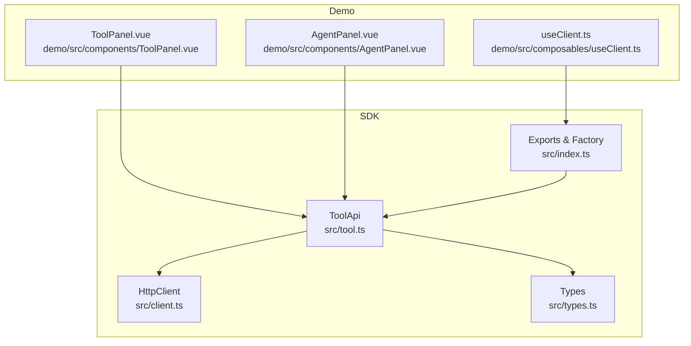
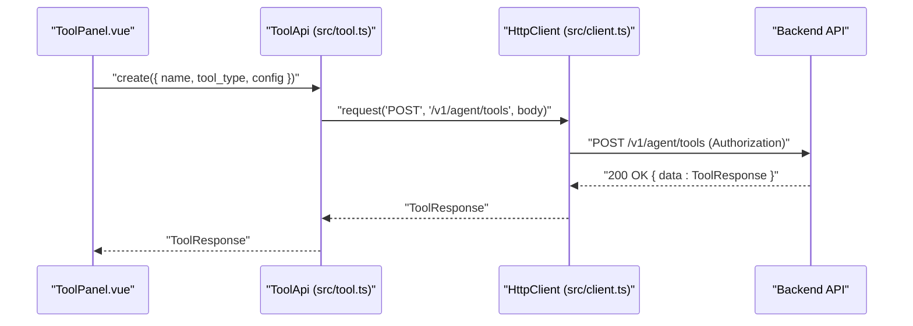
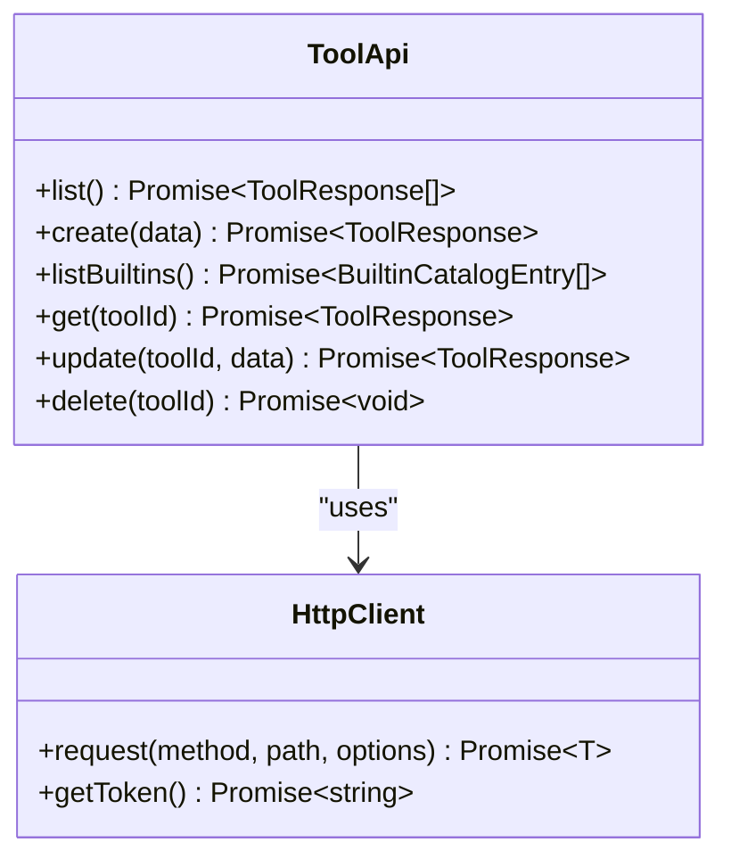
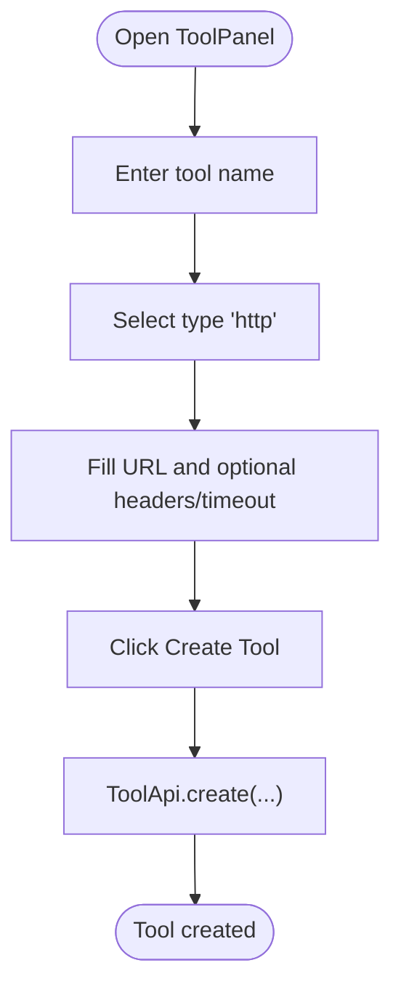
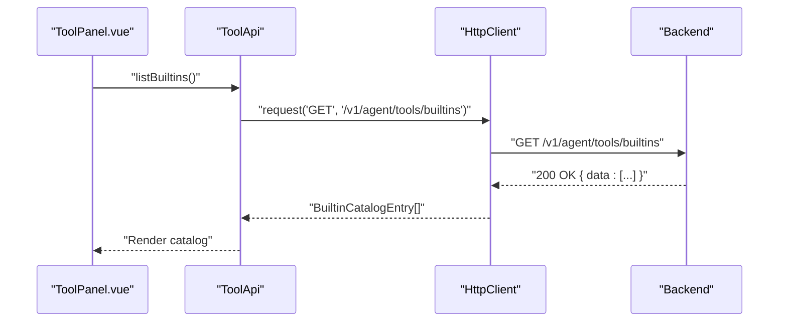
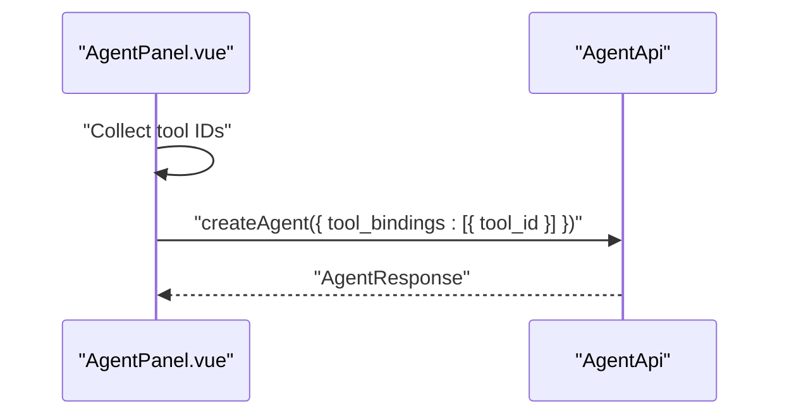
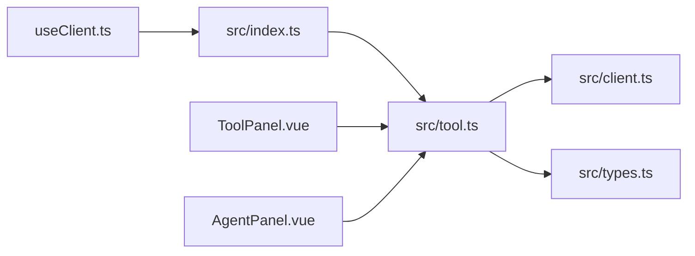

# Tools Management

<cite>
**Referenced Files in This Document**
- [src/tool.ts](file://src/tool.ts)
- [src/types.ts](file://src/types.ts)
- [src/index.ts](file://src/index.ts)
- [src/client.ts](file://src/client.ts)
- [demo/src/components/ToolPanel.vue](file://demo/src/components/ToolPanel.vue)
- [demo/src/components/AgentPanel.vue](file://demo/src/components/AgentPanel.vue)
- [demo/src/composables/useClient.ts](file://demo/src/composables/useClient.ts)
- [README.md](file://README.md)
</cite>

## Table of Contents
1. [Introduction](#introduction)
2. [Project Structure](#project-structure)
3. [Core Components](#core-components)
4. [Architecture Overview](#architecture-overview)
5. [Detailed Component Analysis](#detailed-component-analysis)
6. [Dependency Analysis](#dependency-analysis)
7. [Performance Considerations](#performance-considerations)
8. [Troubleshooting Guide](#troubleshooting-guide)
9. [Conclusion](#conclusion)
10. [Appendices](#appendices)

## Introduction
This document explains the Tools Management system for AI agents, focusing on external capability registration and configuration. It covers tool creation, listing, retrieval, updates, and deletion; tool definition schemas; parameter validation; execution contexts; and practical examples for building custom tools, using built-in tool catalogs, and managing tool lifecycles. It also addresses security, performance, and troubleshooting, along with advanced patterns such as tool versioning, conditional availability, and custom tool development workflows.

## Project Structure
The Tools Management feature spans three primary areas:
- API surface and HTTP transport: ToolApi and HttpClient
- Type definitions: ToolCreate, ToolUpdate, ToolResponse, ToolConfig variants, and BuiltinCatalogEntry
- Demo UI: ToolPanel for tool CRUD and built-in catalog browsing; AgentPanel for binding tools to agents

**Diagram sources**
- [src/tool.ts:1-36](file://src/tool.ts#L1-L36)
- [src/client.ts:93-213](file://src/client.ts#L93-L213)
- [src/types.ts:1008-1079](file://src/types.ts#L1008-L1079)
- [src/index.ts:10-192](file://src/index.ts#L10-L192)
- [demo/src/components/ToolPanel.vue:1-404](file://demo/src/components/ToolPanel.vue#L1-L404)
- [demo/src/components/AgentPanel.vue:1-200](file://demo/src/components/AgentPanel.vue#L1-L200)
- [demo/src/composables/useClient.ts:1-36](file://demo/src/composables/useClient.ts#L1-L36)

**Section sources**
- [src/tool.ts:1-36](file://src/tool.ts#L1-L36)
- [src/types.ts:1008-1079](file://src/types.ts#L1008-L1079)
- [src/index.ts:10-192](file://src/index.ts#L10-L192)
- [demo/src/components/ToolPanel.vue:1-404](file://demo/src/components/ToolPanel.vue#L1-L404)
- [demo/src/components/AgentPanel.vue:1-200](file://demo/src/components/AgentPanel.vue#L1-L200)
- [demo/src/composables/useClient.ts:1-36](file://demo/src/composables/useClient.ts#L1-L36)

## Core Components
- ToolApi: Provides CRUD and catalog operations for tools.
- HttpClient: Handles authentication, token refresh, and HTTP request/response handling.
- Types: Define tool schemas (ToolType, ToolConfig, ToolCreate, ToolUpdate, ToolResponse, BuiltinCatalogEntry).

Key capabilities:
- List tools
- Create tools (HTTP, built-in, MCP)
- List built-in toolkits
- Get/update/delete a specific tool
- Bind tools to agents and rooms

**Section sources**
- [src/tool.ts:4-36](file://src/tool.ts#L4-L36)
- [src/client.ts:93-213](file://src/client.ts#L93-L213)
- [src/types.ts:1008-1079](file://src/types.ts#L1008-L1079)

## Architecture Overview
The Tools Management flow integrates UI, SDK, and backend endpoints. The ToolApi encapsulates HTTP calls to the backend, while HttpClient manages authentication and retries. The demo UI demonstrates tool creation and catalog consumption.

**Diagram sources**
- [src/tool.ts:11-16](file://src/tool.ts#L11-L16)
- [src/client.ts:133-173](file://src/client.ts#L133-L173)

**Section sources**
- [src/tool.ts:4-36](file://src/tool.ts#L4-L36)
- [src/client.ts:93-213](file://src/client.ts#L93-L213)

## Detailed Component Analysis

### ToolApi: Operations and Endpoints
- list(): GET /v1/agent/tools
- create(data: ToolCreate): POST /v1/agent/tools
- listBuiltins(): GET /v1/agent/tools/builtins
- get(toolId: string): GET /v1/agent/tools/:id
- update(toolId: string, data: ToolUpdate): PUT /v1/agent/tools/:id
- delete(toolId: string): DELETE /v1/agent/tools/:id

Validation and behavior:
- Tool creation requires name and a valid tool_type with a matching config variant.
- Tool update supports partial fields.
- Built-in catalog lists toolkits, descriptions, auth requirements, and option schemas.

**Diagram sources**
- [src/tool.ts:4-36](file://src/tool.ts#L4-L36)
- [src/client.ts:93-213](file://src/client.ts#L93-L213)

**Section sources**
- [src/tool.ts:7-35](file://src/tool.ts#L7-L35)

### Tool Definition Schemas
Tool types and configuration:
- ToolType: "http" | "builtin" | "mcp"
- HttpToolConfig: url, method, headers, body_schema, timeout
- BuiltinToolConfig: toolkit, params, include_tools, exclude_tools
- McpToolConfig: transport ("sse" | "stdio"), server_url/command/args/env/timeout
- ToolConfig: union of the above
- ToolCreate: name, description?, tool_type, config, auth_ref?, policy?, is_public?
- ToolUpdate: same fields as ToolCreate with optional status
- ToolResponse: id, tenant_id, name, description, tool_type, config, auth_ref, policy, is_public, status, created_at, updated_at
- BuiltinCatalogEntry: toolkit, description, auth_required, auth_fields, options_schema

Parameter validation highlights:
- HTTP tool requires a valid URL and optional headers/body_schema/timeout.
- Built-in tool requires toolkit and optionally include/exclude lists.
- MCP tool requires transport and either server_url (SSE) or command/args (stdio), with optional env and timeout.

**Section sources**
- [src/types.ts:1008-1079](file://src/types.ts#L1008-L1079)

### Execution Contexts and Binding
- Tool binding to agents: AgentCreate/Update includes tool_bindings as an array of ToolBinding objects (e.g., { tool_id }).
- Tool binding to rooms: RoomCreate/Update includes tool_ids for orchestration.

Practical usage:
- AgentPanel loads tools and allows selecting tool IDs to bind to agents.
- ToolPanel demonstrates creating tools with different types and viewing built-in toolkits.

**Section sources**
- [src/types.ts:500-503](file://src/types.ts#L500-L503)
- [src/types.ts:732-733](file://src/types.ts#L732-L733)
- [demo/src/components/AgentPanel.vue:136-168](file://demo/src/components/AgentPanel.vue#L136-L168)
- [demo/src/components/ToolPanel.vue:76-136](file://demo/src/components/ToolPanel.vue#L76-L136)

### Practical Examples

#### Example 1: Create an HTTP Tool
- UI flow: ToolPanel collects name, type "http", URL, method, optional headers, and timeout.
- SDK call: ToolApi.create with ToolCreate payload.
- Backend stores the tool and returns ToolResponse.

**Diagram sources**
- [demo/src/components/ToolPanel.vue:76-136](file://demo/src/components/ToolPanel.vue#L76-L136)
- [src/tool.ts:11-16](file://src/tool.ts#L11-L16)

**Section sources**
- [demo/src/components/ToolPanel.vue:76-136](file://demo/src/components/ToolPanel.vue#L76-L136)
- [src/tool.ts:11-16](file://src/tool.ts#L11-L16)

#### Example 2: Use Built-in Toolkit Catalog
- UI flow: ToolPanel loads built-in toolkits and lets you select one to populate the form.
- SDK call: ToolApi.listBuiltins returns BuiltinCatalogEntry[].

**Diagram sources**
- [src/tool.ts:18-20](file://src/tool.ts#L18-L20)
- [src/client.ts:133-173](file://src/client.ts#L133-L173)

**Section sources**
- [src/tool.ts:18-20](file://src/tool.ts#L18-L20)
- [demo/src/components/ToolPanel.vue:38-52](file://demo/src/components/ToolPanel.vue#L38-L52)

#### Example 3: Bind Tools to an Agent
- UI flow: AgentPanel loads tools and allows selecting multiple tool IDs; on submit, converts to ToolBinding[].
- SDK call: AgentApi.createAgent with tool_bindings.

**Diagram sources**
- [demo/src/components/AgentPanel.vue:136-168](file://demo/src/components/AgentPanel.vue#L136-L168)

**Section sources**
- [demo/src/components/AgentPanel.vue:136-168](file://demo/src/components/AgentPanel.vue#L136-L168)

### Tool Lifecycle Management
- Creation: ToolApi.create
- Listing: ToolApi.list
- Retrieval: ToolApi.get
- Updates: ToolApi.update
- Deletion: ToolApi.delete
- Built-in catalog: ToolApi.listBuiltins

Operational notes:
- Use listBuiltins to discover available toolkits and their schemas before creating tools.
- Use get to inspect a tool’s current config and status.
- Use update to adjust name, description, type, config, auth_ref, policy, is_public, or status.
- Use delete to remove a tool when it is no longer needed.

**Section sources**
- [src/tool.ts:7-35](file://src/tool.ts#L7-L35)

### Tool Interfaces, Parameter Passing, and Result Handling
- ToolCreate/ToolUpdate define the request shapes; ToolResponse defines the server response shape.
- ToolConfig variants map to the three tool types, enabling flexible parameter passing:
  - HTTP: url/method/headers/body_schema/timeout
  - Built-in: toolkit/params/include_tools/exclude_tools
  - MCP: transport/server_url/command/args/env/timeout
- Result handling: ToolApi methods resolve to ToolResponse or BuiltinCatalogEntry[]; errors are surfaced via typed exceptions handled by HttpClient.

**Section sources**
- [src/types.ts:1037-1079](file://src/types.ts#L1037-L1079)
- [src/tool.ts:11-35](file://src/tool.ts#L11-L35)
- [src/client.ts:187-212](file://src/client.ts#L187-L212)

### Advanced Patterns
- Tool versioning: Maintain separate tool records for different versions; use name/description and status to track lifecycle.
- Conditional tool availability: Use policy and auth_ref to gate access; leverage include_tools/exclude_tools for selective exposure.
- Custom tool development workflows: Start from built-in catalog entries (listBuiltins), then refine configs and iterate with get/update; bind to agents/rooms for testing.

**Section sources**
- [src/types.ts:1047-1056](file://src/types.ts#L1047-L1056)
- [src/types.ts:1019-1033](file://src/types.ts#L1019-L1033)
- [src/tool.ts:18-20](file://src/tool.ts#L18-L20)

## Dependency Analysis
- ToolApi depends on HttpClient for HTTP operations and on exported types for request/response shapes.
- The SDK factory attaches ToolApi to the client instance alongside other APIs.
- Demo components depend on ToolApi and AgentApi for tool management and agent binding.

**Diagram sources**
- [src/index.ts:10-192](file://src/index.ts#L10-L192)
- [src/tool.ts:1-36](file://src/tool.ts#L1-L36)
- [src/client.ts:93-213](file://src/client.ts#L93-L213)
- [src/types.ts:1008-1079](file://src/types.ts#L1008-L1079)
- [demo/src/components/ToolPanel.vue:1-404](file://demo/src/components/ToolPanel.vue#L1-L404)
- [demo/src/components/AgentPanel.vue:1-200](file://demo/src/components/AgentPanel.vue#L1-L200)
- [demo/src/composables/useClient.ts:1-36](file://demo/src/composables/useClient.ts#L1-L36)

**Section sources**
- [src/index.ts:10-192](file://src/index.ts#L10-L192)
- [src/tool.ts:1-36](file://src/tool.ts#L1-L36)

## Performance Considerations
- Use listBuiltins to cache or pre-warm toolkit metadata to reduce repeated network calls.
- Batch tool operations when possible (e.g., bulk list before binding).
- Configure timeouts in HTTP/MCP tool configs to avoid long hangs.
- Monitor rate limits and handle 429 responses gracefully.

[No sources needed since this section provides general guidance]

## Troubleshooting Guide
Common issues and resolutions:
- Authentication failures (401): HttpClient retries once after refreshing tokens; ensure proper auth mode is configured.
- Rate limiting (429): Respect Retry-After header and back off.
- Validation errors: Ensure ToolCreate/ToolUpdate fields match the selected tool_type and config variant.

**Section sources**
- [src/client.ts:153-173](file://src/client.ts#L153-L173)
- [src/client.ts:194-197](file://src/client.ts#L194-L197)

## Conclusion
The Tools Management system provides a robust, type-safe way to register and configure external capabilities for AI agents. With ToolApi, typed schemas, and demo-driven workflows, developers can build custom tools, leverage built-in toolkits, and integrate tools into agents and rooms. Following the recommended patterns ensures secure, performant, and maintainable tool integrations.

[No sources needed since this section summarizes without analyzing specific files]

## Appendices

### API Reference Summary
- ToolApi.list(): returns ToolResponse[]
- ToolApi.create(data): returns ToolResponse
- ToolApi.listBuiltins(): returns BuiltinCatalogEntry[]
- ToolApi.get(toolId): returns ToolResponse
- ToolApi.update(toolId, data): returns ToolResponse
- ToolApi.delete(toolId): returns void

**Section sources**
- [src/tool.ts:7-35](file://src/tool.ts#L7-L35)

### Security Considerations
- Use appropriate auth modes (publishableKey, accessToken, apiKey, appId/appSecret) as per deployment context.
- For HTTP tools, avoid embedding secrets in headers; prefer backend-managed credentials.
- For MCP tools, restrict transports and endpoints; use timeouts and environment controls.

**Section sources**
- [README.md:117-204](file://README.md#L117-L204)
- [src/types.ts:1011-1033](file://src/types.ts#L1011-L1033)