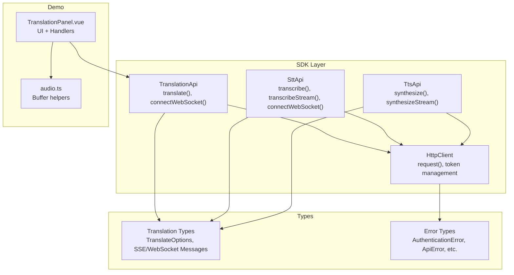
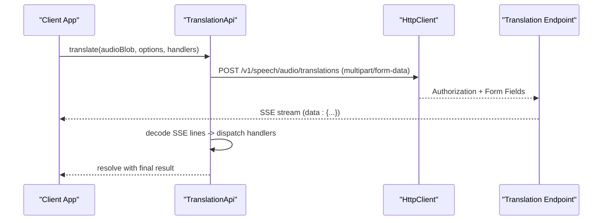
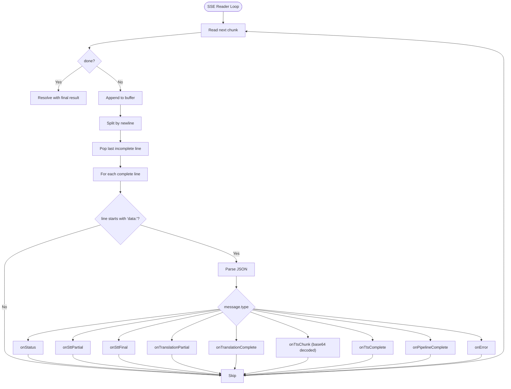
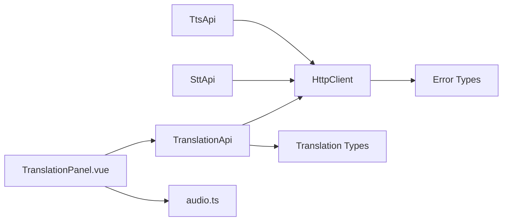

# REST Translation API

<cite>
**Referenced Files in This Document**
- [translation.ts](file://src/translation.ts)
- [client.ts](file://src/client.ts)
- [types.ts](file://src/types.ts)
- [errors.ts](file://src/errors.ts)
- [stt.ts](file://src/stt.ts)
- [tts.ts](file://src/tts.ts)
- [TranslationPanel.vue](file://demo/src/components/TranslationPanel.vue)
- [audio.ts](file://demo/src/utils/audio.ts)
- [README.md](file://README.md)
- [package.json](file://package.json)
</cite>

## Table of Contents
1. [Introduction](#introduction)
2. [Project Structure](#project-structure)
3. [Core Components](#core-components)
4. [Architecture Overview](#architecture-overview)
5. [Detailed Component Analysis](#detailed-component-analysis)
6. [Dependency Analysis](#dependency-analysis)
7. [Performance Considerations](#performance-considerations)
8. [Troubleshooting Guide](#troubleshooting-guide)
9. [Conclusion](#conclusion)
10. [Appendices](#appendices)

## Introduction
This document provides comprehensive API documentation for the REST-based translation service exposed by the SDK. It focuses on the POST /v1/speech/audio/translations endpoint and the associated Server-Sent Events (SSE) streaming pipeline that powers real-time progress updates across STT, translation, and TTS stages. It also covers the WebSocket-based real-time translation workflow, parameter specifications, supported audio formats, language pairs, and performance characteristics for batch translation workflows.

## Project Structure
The SDK exposes a cohesive set of APIs for audio translation, including:
- HTTP-based translation via SSE
- WebSocket-based real-time translation
- Supporting STT and TTS utilities
- Strongly typed message contracts for SSE and WebSocket
- Demo application showcasing usage patterns

**Diagram sources**
- [translation.ts:111-277](file://src/translation.ts#L111-L277)
- [client.ts:93-213](file://src/client.ts#L93-L213)
- [types.ts:266-448](file://src/types.ts#L266-L448)
- [errors.ts:1-43](file://src/errors.ts#L1-L43)
- [TranslationPanel.vue:1-469](file://demo/src/components/TranslationPanel.vue#L1-L469)
- [audio.ts:1-68](file://demo/src/utils/audio.ts#L1-L68)

**Section sources**
- [README.md:341-411](file://README.md#L341-L411)
- [package.json:1-26](file://package.json#L1-L26)

## Core Components
- TranslationApi: Implements the HTTP SSE translation pipeline and WebSocket connection for real-time translation.
- HttpClient: Handles authentication, token refresh, and HTTP/SSE/WebSocket requests.
- Typed message contracts: Define SSE and WebSocket message schemas for STT, translation, and TTS stages.
- Demo UI: Provides practical examples of form data construction, SSE event handling, and audio playback.

Key responsibilities:
- Build multipart/form-data payloads for audio and options.
- Parse SSE events and route them to user-provided handlers.
- Establish WebSocket connections with token exchange and query parameters.
- Decode base64-encoded TTS audio chunks to ArrayBuffer for playback.

**Section sources**
- [translation.ts:111-277](file://src/translation.ts#L111-L277)
- [client.ts:93-213](file://src/client.ts#L93-L213)
- [types.ts:266-448](file://src/types.ts#L266-L448)
- [TranslationPanel.vue:30-120](file://demo/src/components/TranslationPanel.vue#L30-L120)

## Architecture Overview
The translation pipeline operates in three stages: STT → Translation → TTS. The SSE endpoint streams progress updates, while the WebSocket endpoint enables real-time microphone-driven translation.

**Diagram sources**
- [translation.ts:132-228](file://src/translation.ts#L132-L228)
- [client.ts:133-173](file://src/client.ts#L133-L173)

## Detailed Component Analysis

### HTTP Endpoint: POST /v1/speech/audio/translations
Purpose: Submit an audio file and configuration options to initiate the STT → Translation → TTS pipeline. The server responds with an SSE stream containing progress updates and returns the final result upon completion.

Parameters (multipart/form-data):
- audio (required): Audio file to be translated.
- target_lang (required): Target language code for translation.
- source_lang (optional): Source language code; auto-detected if omitted.
- voice (optional): Voice profile name for TTS synthesis.
- translation_mode (optional): Engine choice ("llm" or "mt"), defaults to "llm".
- response_format (optional): Audio format for TTS output ("mp3", "wav", "opus", "pcm").
- tts_enabled (optional): Boolean flag to include synthesized audio; defaults to true.

Behavior:
- Builds a FormData payload and sends a POST request.
- Reads the SSE stream line-by-line, decodes JSON events, and invokes handlers for each message type.
- Resolves with a TranslationResult containing source_text, text, source_lang, and target_lang.

SSE Message Types:
- status: Pipeline stage status updates.
- stt_partial: Real-time STT partial results.
- stt_final: Final STT result for the entire audio.
- translation_partial: Incremental translation tokens.
- translation_complete: Full translated text for a segment.
- tts_chunk: Base64-encoded audio chunk; SDK decodes to ArrayBuffer.
- tts_complete: Completion summary for TTS.
- pipeline_complete: Final result with source_text and translated_text.
- error: Error with stage and message.

Handler callbacks:
- onStatus, onSttPartial, onSttFinal, onTranslationPartial, onTranslationComplete, onTtsChunk, onTtsComplete, onPipelineComplete, onError.

Example usage (from demo):
- Construct options with target_lang, optional source_lang, voice, translation_mode, response_format, and tts_enabled.
- Register handlers to render subtitles, accumulate translations, and merge TTS audio chunks.
- Merge TTS chunks into a playable audio buffer and create an object URL for playback.

**Section sources**
- [translation.ts:132-228](file://src/translation.ts#L132-L228)
- [types.ts:266-346](file://src/types.ts#L266-L346)
- [TranslationPanel.vue:30-120](file://demo/src/components/TranslationPanel.vue#L30-L120)
- [audio.ts:16-19](file://demo/src/utils/audio.ts#L16-L19)

### SSE Streaming Mechanism
Implementation highlights:
- Uses ReadableStream reader to process incoming SSE data.
- Accumulates partial lines until a newline delimiter is encountered.
- Skips non-data lines and ignores malformed JSON.
- Dispatches events to user-provided handlers based on message type.
- Decodes base64-encoded audio for tts_chunk messages.

**Diagram sources**
- [translation.ts:156-228](file://src/translation.ts#L156-L228)

**Section sources**
- [translation.ts:156-228](file://src/translation.ts#L156-L228)

### WebSocket Endpoint: /v1/speech/audio/translations/ws
Purpose: Real-time translation over WebSocket with microphone input. The server sends typed messages for each stage, and clients send PCM audio frames.

Connection parameters:
- token: Session token for WebSocket authentication.
- target_lang: Target language code.
- source_lang: Source language code (optional).
- voice: Voice profile name (optional).
- translation_mode: Engine choice ("llm" or "mt").
- tts_enabled: Boolean to include synthesized audio.
- response_format: Audio format for TTS output (when tts_enabled is true).

Message types:
- ready: Session established; client should start sending audio.
- stt_partial: Real-time STT partial result.
- stt_segment: Finalized segment with timestamps.
- translation_complete: Translated text for a segment with source/target languages.
- tts_chunk: Base64-encoded audio chunk; SDK decodes to ArrayBuffer.
- segment_complete: Segment-level completion with source and translated text.
- pipeline_complete: Full pipeline completion with total duration.
- error: Error with optional stage and segment index.

PCM Audio Frames:
- Clients send raw PCM frames (ArrayBuffer or Int16Array).
- Frames must match the server’s expectations (typically 16 kHz, 16-bit, mono).
- Send {"type":"stop"} to signal end of audio; server processes remaining frames and closes.

Demo usage:
- Start WebSocket with options and handlers.
- On ready, start microphone capture and forward PCM frames.
- On segment_complete, play the merged audio for that segment.
- On pipeline_complete, play the full translated audio.

**Section sources**
- [translation.ts:258-277](file://src/translation.ts#L258-L277)
- [types.ts:348-427](file://src/types.ts#L348-L427)
- [TranslationPanel.vue:156-270](file://demo/src/components/TranslationPanel.vue#L156-L270)

### Parameter Specifications
- audio: Blob/File (required)
- target_lang: string (required)
- source_lang: string (optional)
- voice: string (optional)
- translation_mode: "llm" | "mt" (optional)
- response_format: "mp3" | "wav" | "opus" | "pcm" (optional)
- tts_enabled: boolean (optional)

Notes:
- response_format is only effective when tts_enabled is true.
- translation_mode defaults to "llm"; "mt" selects machine translation.
- voice selection depends on available speakers; consult TTS APIs for speaker lists.

**Section sources**
- [translation.ts:132-144](file://src/translation.ts#L132-L144)
- [types.ts:429-448](file://src/types.ts#L429-L448)

### Supported Audio Formats and Language Pairs
- Audio formats for SSE TTS output: "mp3", "wav", "opus", "pcm".
- Language pairs and availability depend on the underlying STT and translation engines. The SDK does not enumerate supported pairs; consult the platform documentation or model listings for current coverage.

**Section sources**
- [types.ts:429-448](file://src/types.ts#L429-L448)
- [README.md:341-411](file://README.md#L341-L411)

### Batch Processing Workflows
- SSE File Translation: Suitable for offline processing with real-time progress updates. The server streams events for each stage; the client aggregates results and plays synthesized audio.
- WebSocket Real-time Translation: Designed for live microphone input with sub-second latency. Segments are streamed as they complete, enabling immediate playback and subtitle updates.

Performance characteristics (derived from implementation):
- SSE streaming uses a streaming TextDecoder and incremental buffer processing to minimize latency.
- WebSocket uses binary frames for PCM audio and base64-encoded audio chunks for TTS; SDK decodes audio automatically.
- Token management supports proactive refresh and automatic retry on 401 responses.

**Section sources**
- [translation.ts:156-228](file://src/translation.ts#L156-L228)
- [translation.ts:258-277](file://src/translation.ts#L258-L277)
- [client.ts:22-91](file://src/client.ts#L22-L91)
- [client.ts:133-173](file://src/client.ts#L133-L173)

## Dependency Analysis
The translation module depends on:
- HttpClient for authentication and request handling.
- Typed message contracts for SSE and WebSocket.
- Demo utilities for audio concatenation and playback.

**Diagram sources**
- [translation.ts:111-277](file://src/translation.ts#L111-L277)
- [client.ts:93-213](file://src/client.ts#L93-L213)
- [types.ts:266-448](file://src/types.ts#L266-L448)
- [errors.ts:1-43](file://src/errors.ts#L1-L43)
- [TranslationPanel.vue:1-469](file://demo/src/components/TranslationPanel.vue#L1-L469)
- [audio.ts:1-68](file://demo/src/utils/audio.ts#L1-L68)

**Section sources**
- [translation.ts:111-277](file://src/translation.ts#L111-L277)
- [client.ts:93-213](file://src/client.ts#L93-L213)
- [types.ts:266-448](file://src/types.ts#L266-L448)
- [errors.ts:1-43](file://src/errors.ts#L1-L43)
- [TranslationPanel.vue:1-469](file://demo/src/components/TranslationPanel.vue#L1-L469)
- [audio.ts:1-68](file://demo/src/utils/audio.ts#L1-L68)

## Performance Considerations
- SSE streaming minimizes latency by processing data incrementally and invoking handlers as events arrive.
- WebSocket real-time translation reduces end-to-end latency by sending PCM frames directly and streaming TTS audio chunks.
- Token refresh is proactive and guarded by a mutex to prevent redundant refresh calls.
- Automatic retry on 401 ensures uninterrupted operation when tokens are refreshed.

[No sources needed since this section provides general guidance]

## Troubleshooting Guide
Common error scenarios and handling strategies:
- Authentication failures: The SDK throws AuthenticationError when credentials are invalid or missing. Ensure the correct authentication mode is configured and tokens are valid.
- Insufficient balance: InsufficientBalanceError indicates account credit exhaustion; top up the account.
- Rate limiting: RateLimitedError includes a retry-after value; back off and retry according to the header.
- API errors: ApiError wraps HTTP errors with status code and internal code; inspect message and status for diagnostics.
- SSE/WebSocket errors: The SDK routes error messages to onError handlers; log stage and message to identify failing pipeline stage.

**Section sources**
- [client.ts:187-212](file://src/client.ts#L187-L212)
- [errors.ts:1-43](file://src/errors.ts#L1-L43)
- [translation.ts:181-215](file://src/translation.ts#L181-L215)

## Conclusion
The REST translation service provides a robust, real-time translation pipeline via SSE and WebSocket. The SDK offers strong typing, automatic token management, and convenient handlers for each pipeline stage. Developers can integrate file-based translation with live progress updates or real-time translation from microphone input, choosing appropriate audio formats and language configurations.

[No sources needed since this section summarizes without analyzing specific files]

## Appendices

### API Reference: POST /v1/speech/audio/translations
- Method: POST
- Path: /v1/speech/audio/translations
- Content-Type: multipart/form-data
- Required fields:
  - audio: Audio file
  - target_lang: Target language code
- Optional fields:
  - source_lang: Source language code
  - voice: Voice profile name
  - translation_mode: "llm" | "mt"
  - response_format: "mp3" | "wav" | "opus" | "pcm"
  - tts_enabled: boolean
- Response: SSE stream with events for status, STT partial/final, translation partial/complete, TTS chunks, pipeline completion, and error.

**Section sources**
- [translation.ts:132-144](file://src/translation.ts#L132-L144)
- [types.ts:266-346](file://src/types.ts#L266-L346)

### Example: File Upload and SSE Handling
- Construct FormData with audio and options.
- Register handlers for onStatus, onSttPartial, onSttFinal, onTranslationPartial, onTranslationComplete, onTtsChunk, onTtsComplete, onPipelineComplete, onError.
- Merge TTS audio chunks into a single buffer and create an object URL for playback.

**Section sources**
- [TranslationPanel.vue:30-120](file://demo/src/components/TranslationPanel.vue#L30-L120)
- [audio.ts:44-51](file://demo/src/utils/audio.ts#L44-L51)

### Example: WebSocket Real-time Translation
- Connect WebSocket with token and options.
- On ready, start microphone and send PCM frames.
- On segment_complete, play the segment’s audio.
- On pipeline_complete, play the full translated audio.

**Section sources**
- [translation.ts:258-277](file://src/translation.ts#L258-L277)
- [TranslationPanel.vue:156-270](file://demo/src/components/TranslationPanel.vue#L156-L270)