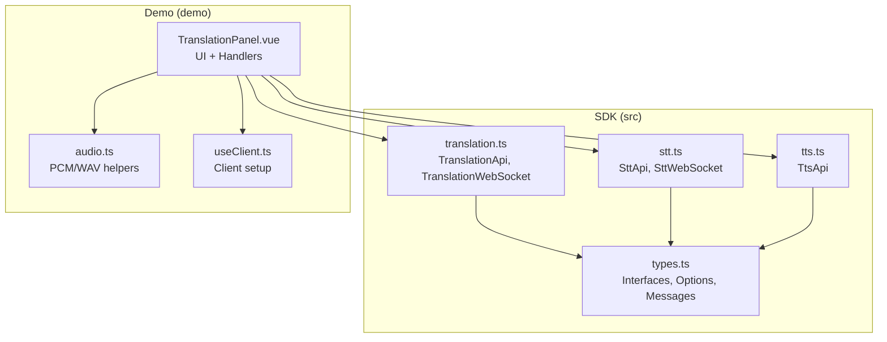
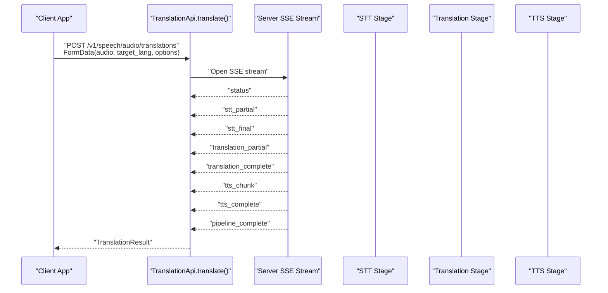
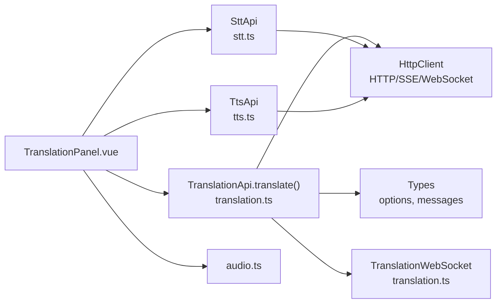

# Translation API

<cite>
**Referenced Files in This Document**
- [translation.ts](file://src/translation.ts)
- [types.ts](file://src/types.ts)
- [stt.ts](file://src/stt.ts)
- [tts.ts](file://src/tts.ts)
- [TranslationPanel.vue](file://demo/src/components/TranslationPanel.vue)
- [audio.ts](file://demo/src/utils/audio.ts)
- [useClient.ts](file://demo/src/composables/useClient.ts)
- [README.md](file://README.md)
- [package.json](file://package.json)
</cite>

## Table of Contents
1. [Introduction](#introduction)
2. [Project Structure](#project-structure)
3. [Core Components](#core-components)
4. [Architecture Overview](#architecture-overview)
5. [Detailed Component Analysis](#detailed-component-analysis)
6. [Dependency Analysis](#dependency-analysis)
7. [Performance Considerations](#performance-considerations)
8. [Troubleshooting Guide](#troubleshooting-guide)
9. [Conclusion](#conclusion)
10. [Appendices](#appendices)

## Introduction
This document provides comprehensive API documentation for the Translation service, covering the complete STT → Translation → TTS pipeline. It documents HTTP endpoints for translation requests, WebSocket endpoints for real-time translation streaming, and audio processing workflows. For REST APIs, it covers translation parameters, language pairs, confidence scoring, and batch processing options. For WebSocket APIs, it documents real-time translation protocols, audio chunk streaming, partial translation results, and error handling. Practical examples demonstrate end-to-end translation workflows, real-time translation setup, and multi-language audio processing. Configuration options, supported languages, translation accuracy metrics, and return value structures are included. Performance optimization, latency considerations, and troubleshooting translation quality issues are addressed.

## Project Structure
The Translation API is part of the AudarAI JavaScript/TypeScript SDK. The core implementation resides in the src/ directory, with a demo application under demo/ showcasing real-time translation workflows and audio processing.

**Diagram sources**
- [translation.ts:1-277](file://src/translation.ts#L1-L277)
- [types.ts:1-1265](file://src/types.ts#L1-L1265)
- [stt.ts:1-217](file://src/stt.ts#L1-L217)
- [tts.ts:1-231](file://src/tts.ts#L1-L231)
- [TranslationPanel.vue:1-469](file://demo/src/components/TranslationPanel.vue#L1-L469)
- [audio.ts:1-69](file://demo/src/utils/audio.ts#L1-L69)
- [useClient.ts:1-36](file://demo/src/composables/useClient.ts#L1-L36)

**Section sources**
- [translation.ts:1-277](file://src/translation.ts#L1-L277)
- [types.ts:1-1265](file://src/types.ts#L1-L1265)
- [stt.ts:1-217](file://src/stt.ts#L1-L217)
- [tts.ts:1-231](file://src/tts.ts#L1-L231)
- [TranslationPanel.vue:1-469](file://demo/src/components/TranslationPanel.vue#L1-L469)
- [audio.ts:1-69](file://demo/src/utils/audio.ts#L1-L69)
- [useClient.ts:1-36](file://demo/src/composables/useClient.ts#L1-L36)
- [README.md:1-845](file://README.md#L1-L845)
- [package.json:1-26](file://package.json#L1-L26)

## Core Components
- TranslationApi: Provides HTTP endpoints for translation via SSE and WebSocket connections for real-time translation.
- TranslationWebSocket: Wraps WebSocket communication for real-time STT → Translation → TTS streaming, decoding audio chunks and routing typed messages.
- Types: Defines translation options, message interfaces, and handler callbacks for SSE and WebSocket pipelines.
- STT and TTS APIs: Underpin the STT and TTS stages of the translation pipeline, used independently or integrated via TranslationApi.
- Demo UI: Demonstrates translation workflows, real-time streaming, and audio playback.

Key responsibilities:
- TranslationApi.translate: Sends audio to the server, parses SSE events, and returns a consolidated result.
- TranslationApi.connectWebSocket: Establishes a WebSocket session for real-time translation with typed message handling.
- TranslationWebSocket: Manages PCM audio frames, stop signaling, and audio chunk decoding.
- Types: Define supported parameters, message formats, and handler signatures.

**Section sources**
- [translation.ts:111-277](file://src/translation.ts#L111-L277)
- [types.ts:266-448](file://src/types.ts#L266-L448)
- [stt.ts:83-217](file://src/stt.ts#L83-L217)
- [tts.ts:11-231](file://src/tts.ts#L11-L231)

## Architecture Overview
The Translation service integrates three stages:
- Speech-to-Text (STT): Converts audio to text.
- Translation: Translates source text to target language using either LLM or MT engines.
- Text-to-Speech (TTS): Synthesizes translated text into audio.

**Diagram sources**
- [translation.ts:132-228](file://src/translation.ts#L132-L228)
- [types.ts:268-325](file://src/types.ts#L268-L325)

## Detailed Component Analysis

### Translation REST API (SSE)
- Endpoint: POST /v1/speech/audio/translations
- Request body: multipart/form-data
  - audio: Blob/File (PCM, WAV, MP3, etc.)
  - target_lang: string (required)
  - source_lang: string (optional)
  - voice: string (optional)
  - translation_mode: "llm" | "mt" (optional)
  - response_format: "mp3" | "wav" | "opus" | "pcm" (optional)
  - tts_enabled: boolean (optional)
- Response: Server-sent events (SSE) with typed messages
  - status: Pipeline stage status
  - stt_partial: Real-time STT partial text
  - stt_final: Final STT result
  - translation_partial: Incremental translation tokens
  - translation_complete: Complete translation for a segment
  - tts_chunk: Base64-encoded audio chunks
  - tts_complete: TTS completion summary
  - pipeline_complete: Final consolidated result
  - error: Error with stage and message

Return value:
- TranslationResult: { source_text, text, source_lang?, target_lang }

Handler callbacks:
- onStatus, onSttPartial, onSttFinal, onTranslationPartial, onTranslationComplete, onTtsChunk, onTtsComplete, onPipelineComplete, onError

**Section sources**
- [translation.ts:132-228](file://src/translation.ts#L132-L228)
- [types.ts:268-346](file://src/types.ts#L268-L346)
- [types.ts:429-438](file://src/types.ts#L429-L438)

### Translation WebSocket API
- Endpoint: /v1/speech/audio/translations/ws
- Query parameters:
  - token: session token
  - target_lang: string (required)
  - source_lang: string (optional)
  - voice: string (optional)
  - translation_mode: "llm" | "mt" (optional)
  - tts_enabled: boolean (optional)
  - response_format: string (optional)
- Message types:
  - ready: Session established
  - stt_partial: Real-time STT partial text
  - stt_segment: Finalized STT segment
  - translation_complete: Complete translation for a segment
  - tts_chunk: Base64-encoded audio chunk (decoded to ArrayBuffer)
  - segment_complete: Segment audio synthesis complete
  - pipeline_complete: Entire pipeline complete
  - error: Error with optional stage and segment info
- Audio frames:
  - Send PCM audio frames (ArrayBuffer or Int16Array)
  - Stop signaling: {"type":"stop"}

Client wrapper:
- TranslationWebSocket: sendAudio(), stop(), close(), readyState getter

**Section sources**
- [translation.ts:258-275](file://src/translation.ts#L258-L275)
- [translation.ts:39-109](file://src/translation.ts#L39-L109)
- [types.ts:349-427](file://src/types.ts#L349-L427)

### STT and TTS Integration
- STT:
  - File transcription: POST /v1/speech/audio/transcriptions
  - Streaming transcription: POST /v1/speech/audio/transcriptions/stream
  - WebSocket: /v1/speech/audio/transcriptions/ws
- TTS:
  - Synthesize: POST /v1/speech/audio/speech
  - Streaming synthesis: POST /v1/speech/audio/speech/stream
  - Voice management: list/list/detailed, add/update/delete/rename/replace

These APIs underpin the translation pipeline stages and can be used independently.

**Section sources**
- [stt.ts:83-217](file://src/stt.ts#L83-L217)
- [tts.ts:11-231](file://src/tts.ts#L11-L231)

### Demo Usage and Workflows
- File translation:
  - Select audio file, configure source/target languages, voice, translation mode, response format, and TTS toggle.
  - Invoke translation.translate() with handlers to receive live updates and final result.
  - Merge TTS chunks and play synthesized audio.
- Real-time translation:
  - Start WebSocket session with source/target languages, translation mode, and TTS options.
  - On ready, start microphone and stream PCM frames.
  - Receive live STT, translation, and TTS chunks; merge per-segment audio and play upon segment completion.
  - Stop streaming with stop() and wait for pipeline_complete.

**Section sources**
- [TranslationPanel.vue:30-120](file://demo/src/components/TranslationPanel.vue#L30-L120)
- [TranslationPanel.vue:156-270](file://demo/src/components/TranslationPanel.vue#L156-L270)
- [audio.ts:16-69](file://demo/src/utils/audio.ts#L16-L69)

## Dependency Analysis
The Translation API depends on:
- HttpClient for HTTP requests and WebSocket token acquisition
- Typed message interfaces and options from types.ts
- STT and TTS APIs for underlying stages
- Demo UI for practical usage examples

**Diagram sources**
- [translation.ts:111-277](file://src/translation.ts#L111-L277)
- [stt.ts:83-217](file://src/stt.ts#L83-L217)
- [tts.ts:11-231](file://src/tts.ts#L11-L231)
- [TranslationPanel.vue:1-469](file://demo/src/components/TranslationPanel.vue#L1-L469)
- [audio.ts:1-69](file://demo/src/utils/audio.ts#L1-L69)

**Section sources**
- [translation.ts:1-277](file://src/translation.ts#L1-L277)
- [stt.ts:1-217](file://src/stt.ts#L1-L217)
- [tts.ts:1-231](file://src/tts.ts#L1-L231)
- [types.ts:1-1265](file://src/types.ts#L1-L1265)

## Performance Considerations
- Latency:
  - WebSocket real-time translation minimizes latency by streaming STT partial results, translation tokens, and TTS chunks concurrently.
  - Use appropriate translation_mode ("llm" vs "mt") to balance quality and speed.
- Audio chunking:
  - Send PCM frames at a consistent rate (e.g., 16 kHz, 16-bit, mono) to avoid buffering delays.
  - Merge TTS chunks per segment to reduce overhead and improve playback smoothness.
- Network efficiency:
  - Use response_format "pcm" for minimal post-processing or "mp3" for smaller bandwidth.
  - Disable TTS when only text is needed to reduce network and CPU load.
- Buffering and decoding:
  - Base64-decoded audio chunks are provided as ArrayBuffer in handlers; avoid repeated conversions.
- Throttling:
  - STT partial results arrive at approximately 120 ms intervals; adjust UI updates accordingly.

[No sources needed since this section provides general guidance]

## Troubleshooting Guide
Common issues and resolutions:
- Authentication failures:
  - Ensure correct authentication mode (publishableKey, accessToken, apiKey, or appId/appSecret) is configured.
  - For WebSocket, the SDK exchanges tokens automatically; verify token refresh logic if using dynamic access tokens.
- WebSocket errors:
  - Listen for error messages with stage and segment indices to pinpoint failing stage.
  - On pipeline errors, the pipeline continues; handle gracefully and allow users to retry.
- Audio quality:
  - Verify source language detection by checking source_lang in translation_complete.
  - Adjust voice selection and response_format to match device capabilities.
- Network interruptions:
  - Re-establish WebSocket sessions and resume streaming after reconnect.
  - For SSE, re-open the stream and handle partial progress.
- Language support:
  - Confirm supported language codes and translation_mode availability via server responses and documentation.

**Section sources**
- [translation.ts:181-215](file://src/translation.ts#L181-L215)
- [types.ts:321-404](file://src/types.ts#L321-L404)
- [README.md:117-204](file://README.md#L117-L204)

## Conclusion
The Translation API provides a robust, end-to-end solution for audio translation with both file-based and real-time streaming capabilities. By leveraging SSE for file translation and WebSocket for real-time scenarios, developers can build responsive, high-quality multilingual audio applications. Proper configuration of language pairs, translation engines, and audio formats ensures optimal performance and user experience.

[No sources needed since this section summarizes without analyzing specific files]

## Appendices

### API Definitions

- REST Endpoint: POST /v1/speech/audio/translations
  - Body: multipart/form-data
    - audio: Blob/File
    - target_lang: string (required)
    - source_lang: string (optional)
    - voice: string (optional)
    - translation_mode: "llm" | "mt" (optional)
    - response_format: "mp3" | "wav" | "opus" | "pcm" (optional)
    - tts_enabled: boolean (optional)
  - SSE Events:
    - status, stt_partial, stt_final, translation_partial, translation_complete, tts_chunk, tts_complete, pipeline_complete, error

- WebSocket Endpoint: /v1/speech/audio/translations/ws
  - Query: token, target_lang, source_lang, voice, translation_mode, tts_enabled, response_format
  - Messages:
    - ready, stt_partial, stt_segment, translation_complete, tts_chunk, segment_complete, pipeline_complete, error
  - Audio frames: PCM (ArrayBuffer or Int16Array)

- Return Value: TranslationResult
  - source_text: string
  - text: string
  - source_lang?: string
  - target_lang: string

**Section sources**
- [translation.ts:132-275](file://src/translation.ts#L132-L275)
- [types.ts:20-27](file://src/types.ts#L20-L27)
- [types.ts:268-427](file://src/types.ts#L268-L427)

### Practical Examples

- File translation with SSE:
  - Configure options (target_lang, source_lang, translation_mode, tts_enabled, response_format, voice).
  - Subscribe to onSttPartial/onTranslationPartial/onTtsChunk handlers.
  - Merge TTS chunks and play synthesized audio upon tts_complete/pipeline_complete.

- Real-time translation with WebSocket:
  - Establish session with connectWebSocket().
  - On onReady, start microphone and send PCM frames via sendAudio().
  - Handle onSttPartial/onSttSegment/onTranslationComplete/onTtsChunk.
  - Merge per-segment audio and play upon segment_complete; final audio upon pipeline_complete.

**Section sources**
- [translation.ts:132-228](file://src/translation.ts#L132-L228)
- [translation.ts:258-275](file://src/translation.ts#L258-L275)
- [TranslationPanel.vue:30-120](file://demo/src/components/TranslationPanel.vue#L30-L120)
- [TranslationPanel.vue:156-270](file://demo/src/components/TranslationPanel.vue#L156-L270)

### Configuration Options
- TranslateOptions:
  - target_lang: string (required)
  - source_lang: string (optional)
  - voice: string (optional)
  - translation_mode: "llm" | "mt" (optional)
  - response_format: "mp3" | "wav" | "opus" | "pcm" (optional)
  - tts_enabled: boolean (optional)

- ConnectTranslationWebSocketOptions:
  - Same as TranslateOptions except response_format is string

- SynthesizeOptions (TTS):
  - voice: string (optional)
  - model: string (default "tts-1")
  - response_format: "mp3" | "opus" | "aac" | "flac" | "wav" | "pcm"
  - speed: number (range 0.25–4.0)
  - provider: string (e.g., "flash" | "turbo" | "pro")

**Section sources**
- [types.ts:429-448](file://src/types.ts#L429-L448)
- [types.ts:128-151](file://src/types.ts#L128-L151)

### Supported Languages and Engines
- Language codes: Provided by server-side language detection and STT models; configure source_lang for explicit detection or leave blank for auto-detection.
- Translation engines:
  - translation_mode: "llm" (default) | "mt" (machine translation)
- TTS providers: "flash" | "turbo" | "pro" (provider-specific)

**Section sources**
- [types.ts:433-437](file://src/types.ts#L433-L437)
- [README.md:341-408](file://README.md#L341-L408)

### Audio Processing Notes
- PCM format:
  - 16 kHz, 16-bit, mono recommended for WebSocket streaming.
  - PCM chunks can be wrapped in WAV for playback when needed.
- Base64 audio:
  - SSE tts_chunk audio is base64-encoded; SDK decodes to ArrayBuffer in onTtsChunk.
- Chunk merging:
  - Demo demonstrates concatenating TTS chunks per segment and final pipeline completion.

**Section sources**
- [translation.ts:66-71](file://src/translation.ts#L66-L71)
- [audio.ts:44-69](file://demo/src/utils/audio.ts#L44-L69)
- [TranslationPanel.vue:149-237](file://demo/src/components/TranslationPanel.vue#L149-L237)