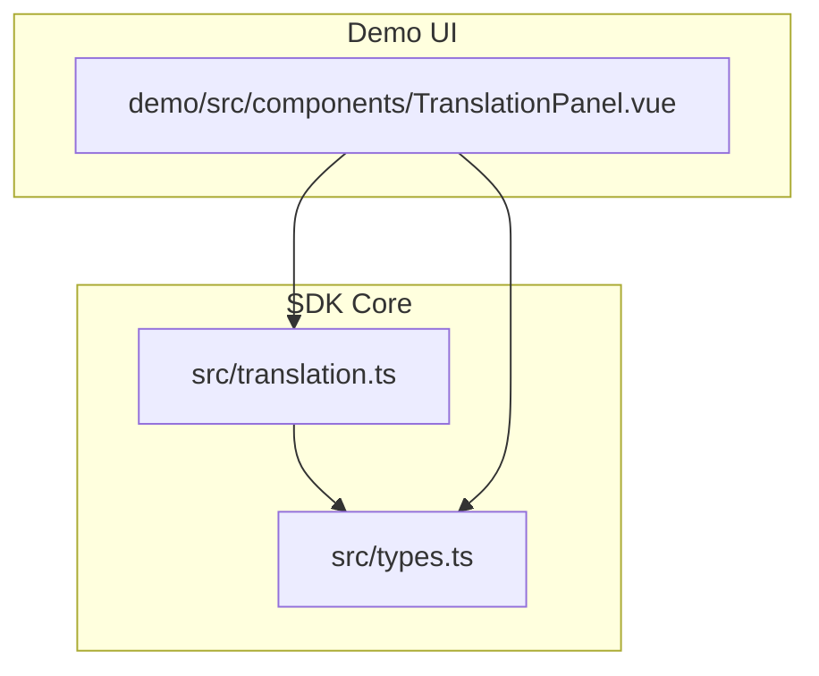
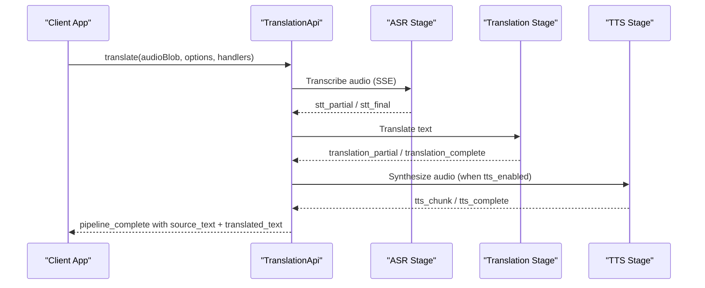
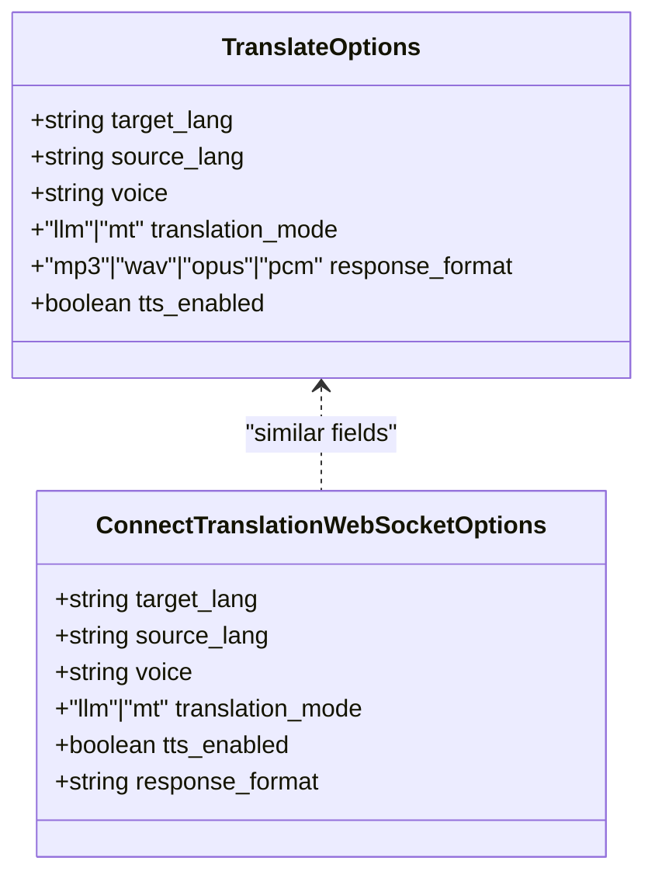
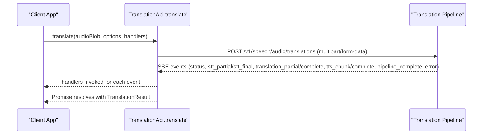
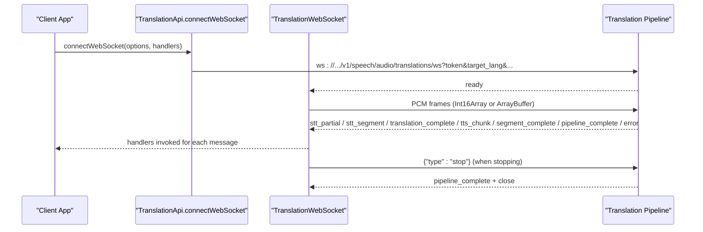
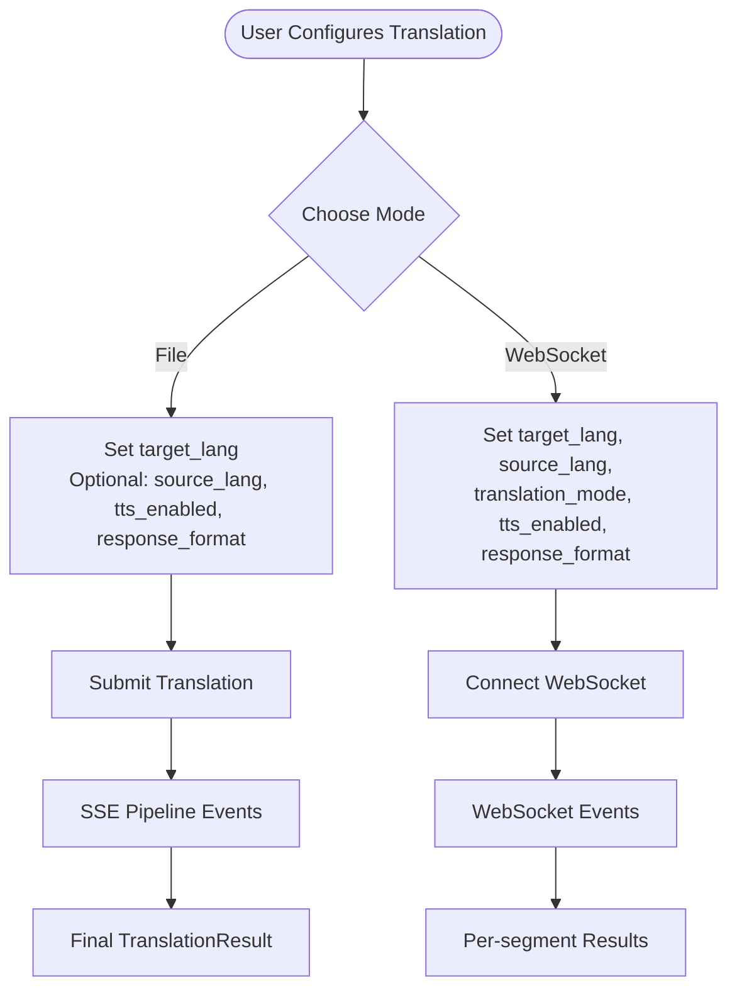
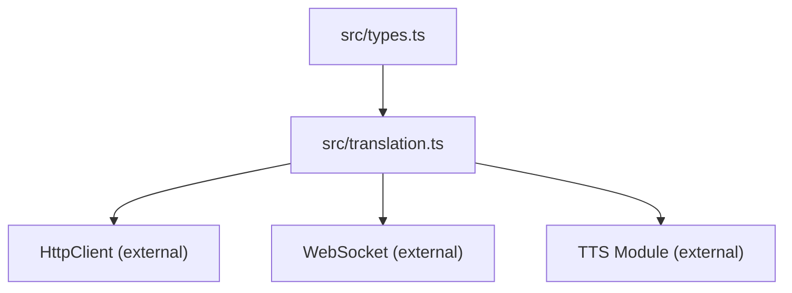

# Translation Configuration & Options

<cite>
**Referenced Files in This Document**
- [translation.ts](file://src/translation.ts)
- [types.ts](file://src/types.ts)
- [TranslationPanel.vue](file://demo/src/components/TranslationPanel.vue)
- [README.md](file://README.md)
- [package.json](file://package.json)
</cite>

## Table of Contents
1. [Introduction](#introduction)
2. [Project Structure](#project-structure)
3. [Core Components](#core-components)
4. [Architecture Overview](#architecture-overview)
5. [Detailed Component Analysis](#detailed-component-analysis)
6. [Dependency Analysis](#dependency-analysis)
7. [Performance Considerations](#performance-considerations)
8. [Troubleshooting Guide](#troubleshooting-guide)
9. [Conclusion](#conclusion)
10. [Appendices](#appendices)

## Introduction
This document provides comprehensive configuration documentation for the translation service options and customization parameters exposed by the SDK. It focuses on the TranslateOptions interface and related WebSocket options, detailing required and optional parameters, voice selection for TTS output, translation modes, response format preferences, and the TTS enablement flag. It also covers language pair support, voice quality options, regional variants, configuration examples for real-time interpretation, automated transcription, multilingual content creation, and accessibility applications, along with performance tuning, latency considerations, and quality-speed trade-offs.

## Project Structure
The translation functionality is implemented in the SDK’s translation module and is complemented by a demo UI that exercises the translation pipeline. The key files are:
- Implementation of translation APIs and WebSocket wrapper
- Type definitions for translation options and message types
- Demo UI showcasing translation use cases and configuration

**Diagram sources**
- [translation.ts:1-277](file://src/translation.ts#L1-L277)
- [types.ts:429-448](file://src/types.ts#L429-L448)
- [TranslationPanel.vue:1-469](file://demo/src/components/TranslationPanel.vue#L1-L469)

**Section sources**
- [translation.ts:1-277](file://src/translation.ts#L1-L277)
- [types.ts:429-448](file://src/types.ts#L429-L448)
- [TranslationPanel.vue:1-469](file://demo/src/components/TranslationPanel.vue#L1-L469)

## Core Components
This section outlines the primary configuration surfaces for translation:
- TranslateOptions: used for file-based translation via SSE pipeline
- ConnectTranslationWebSocketOptions: used for real-time translation via WebSocket
- TranslationResult: final result shape returned by the translation API
- SSE and WebSocket message types for real-time feedback

Key configuration parameters:
- target_lang (required): Target language code for translation output
- source_lang (optional): Source language code; auto-detected if omitted
- voice (optional): Voice profile name for TTS output
- translation_mode (optional): Engine choice between “llm” (default) and “mt”
- response_format (optional): Audio format for TTS output when tts_enabled is true
- tts_enabled (optional): Boolean flag controlling whether TTS audio is synthesized

Behavioral notes:
- When tts_enabled is true, response_format determines the audio encoding
- When tts_enabled is false, only text results are returned
- translation_mode selects between LLM-driven and machine translation engines

**Section sources**
- [translation.ts:132-144](file://src/translation.ts#L132-L144)
- [translation.ts:258-274](file://src/translation.ts#L258-L274)
- [types.ts:429-448](file://src/types.ts#L429-L448)

## Architecture Overview
The translation pipeline integrates STT, translation, and TTS stages. The SDK exposes two primary entry points:
- File translation via SSE: translates an audio file and streams intermediate results
- Real-time translation via WebSocket: streams live results and supports continuous audio input

**Diagram sources**
- [translation.ts:132-228](file://src/translation.ts#L132-L228)
- [types.ts:268-325](file://src/types.ts#L268-L325)

**Section sources**
- [translation.ts:111-277](file://src/translation.ts#L111-L277)
- [types.ts:266-427](file://src/types.ts#L266-L427)

## Detailed Component Analysis

### TranslateOptions and WebSocket Options
TranslateOptions and ConnectTranslationWebSocketOptions define the configuration surface for translation. Both include:
- target_lang (required)
- source_lang (optional)
- voice (optional)
- translation_mode (optional, default “llm”)
- response_format (optional for SSE; required when tts_enabled is true)
- tts_enabled (optional, default behavior depends on server)

Implementation details:
- SSE translation appends options as form fields to the request
- WebSocket connection passes options as URL query parameters

**Diagram sources**
- [types.ts:429-448](file://src/types.ts#L429-L448)

**Section sources**
- [types.ts:429-448](file://src/types.ts#L429-L448)
- [translation.ts:132-144](file://src/translation.ts#L132-L144)
- [translation.ts:258-274](file://src/translation.ts#L258-L274)

### SSE Translation Flow
The SSE translation method streams intermediate results and returns a final TranslationResult. Handlers receive:
- Status updates
- STT partial and final results
- Translation partial and complete results
- TTS chunks and completion
- Pipeline completion with source and translated text
- Error messages

**Diagram sources**
- [translation.ts:132-228](file://src/translation.ts#L132-L228)
- [types.ts:268-325](file://src/types.ts#L268-L325)

**Section sources**
- [translation.ts:111-228](file://src/translation.ts#L111-L228)
- [types.ts:266-346](file://src/types.ts#L266-L346)

### WebSocket Translation Flow
The WebSocket method establishes a real-time session and streams results per segment. The client sends PCM audio frames and receives:
- Ready signal
- STT partial and segment results
- Translation complete per segment
- TTS chunks per segment
- Segment and pipeline completion
- Errors and closure

**Diagram sources**
- [translation.ts:258-275](file://src/translation.ts#L258-L275)
- [types.ts:350-427](file://src/types.ts#L350-L427)

**Section sources**
- [translation.ts:39-109](file://src/translation.ts#L39-L109)
- [translation.ts:258-275](file://src/translation.ts#L258-L275)
- [types.ts:348-427](file://src/types.ts#L348-L427)

### Demo UI Configuration Examples
The demo UI demonstrates practical configuration patterns for translation:
- File translation with optional source language, TTS enablement, and response format
- Real-time translation with optional source/target languages, translation mode, TTS enablement, and response format
- Live subtitle overlays and audio playback

**Diagram sources**
- [TranslationPanel.vue:30-120](file://demo/src/components/TranslationPanel.vue#L30-L120)
- [TranslationPanel.vue:156-270](file://demo/src/components/TranslationPanel.vue#L156-L270)

**Section sources**
- [TranslationPanel.vue:1-469](file://demo/src/components/TranslationPanel.vue#L1-L469)

## Dependency Analysis
Translation configuration depends on:
- Type definitions for options and message types
- HTTP client for SSE requests
- WebSocket client for real-time sessions
- TTS module for voice synthesis (when tts_enabled is true)

**Diagram sources**
- [translation.ts:1-18](file://src/translation.ts#L1-L18)
- [types.ts:429-448](file://src/types.ts#L429-L448)

**Section sources**
- [translation.ts:1-277](file://src/translation.ts#L1-L277)
- [types.ts:429-448](file://src/types.ts#L429-L448)

## Performance Considerations
Quality vs. speed trade-offs:
- translation_mode “mt” typically offers lower latency and higher throughput compared to “llm”
- response_format affects bandwidth and decoding overhead; compressed formats reduce payload size
- tts_enabled true increases latency due to synthesis; disabling it yields faster text-only results
- WebSocket mode enables real-time streaming with minimal buffering when properly tuned

Latency considerations:
- WebSocket mode reduces end-to-end latency by streaming partial results
- SSE mode batches events; latency depends on server-side batching and network conditions

Voice quality and regional variants:
- Voice selection influences naturalness and clarity; availability depends on TTS provider/model
- Regional variants and accents are determined by the selected voice profile metadata

[No sources needed since this section provides general guidance]

## Troubleshooting Guide
Common configuration issues and resolutions:
- Invalid parameter combinations
  - Ensure target_lang is provided; source_lang is optional
  - When tts_enabled is true, response_format must be set appropriately
  - translation_mode must be one of the supported values
- Language pair support
  - Verify that the combination of source_lang and target_lang is supported by the server
- Voice selection
  - Confirm that the selected voice is compatible with the chosen TTS model/provider
- Error handling
  - Listen for error events in both SSE and WebSocket handlers
  - Use onError callbacks to capture stage-specific errors and messages

Validation and defaults:
- The SDK does not enforce strict validation; invalid combinations may fail at the server level
- Default values are applied server-side; client-side defaults are not enforced

**Section sources**
- [translation.ts:132-144](file://src/translation.ts#L132-L144)
- [translation.ts:258-274](file://src/translation.ts#L258-L274)
- [types.ts:429-448](file://src/types.ts#L429-L448)

## Conclusion
The translation configuration surface in the SDK provides flexible control over language pairs, translation engines, TTS output, and real-time streaming. By selecting appropriate translation_mode, response_format, and voice profiles, developers can tailor the system for real-time interpretation, automated transcription, multilingual content creation, and accessibility applications. Proper configuration of tts_enabled and response_format balances latency and quality, while WebSocket mode enables low-latency, continuous translation workflows.

[No sources needed since this section summarizes without analyzing specific files]

## Appendices

### Configuration Reference

- TranslateOptions
  - target_lang: Required. Target language code for translation output.
  - source_lang: Optional. Source language code; auto-detected if omitted.
  - voice: Optional. Voice profile name for TTS output.
  - translation_mode: Optional. Engine choice: “llm” (default) or “mt”.
  - response_format: Optional. Audio format for TTS output when tts_enabled is true.
  - tts_enabled: Optional. Boolean flag controlling TTS audio synthesis.

- ConnectTranslationWebSocketOptions
  - target_lang: Required. Target language code.
  - source_lang: Optional. Source language code.
  - voice: Optional. Voice profile name.
  - translation_mode: Optional. Engine choice: “llm” (default) or “mt”.
  - tts_enabled: Optional. Boolean flag controlling TTS audio synthesis.
  - response_format: Optional. Audio format for TTS output when tts_enabled is true.

- SSE vs WebSocket
  - SSE: Suitable for file-based translation with event streaming.
  - WebSocket: Ideal for real-time interpretation with continuous audio input.

- Demo UI Examples
  - File translation: Configure target_lang, optional source_lang, tts_enabled, and response_format.
  - WebSocket translation: Configure target_lang, source_lang, translation_mode, tts_enabled, and response_format.

**Section sources**
- [types.ts:429-448](file://src/types.ts#L429-L448)
- [translation.ts:132-144](file://src/translation.ts#L132-L144)
- [translation.ts:258-274](file://src/translation.ts#L258-L274)
- [TranslationPanel.vue:30-120](file://demo/src/components/TranslationPanel.vue#L30-L120)
- [TranslationPanel.vue:156-270](file://demo/src/components/TranslationPanel.vue#L156-L270)