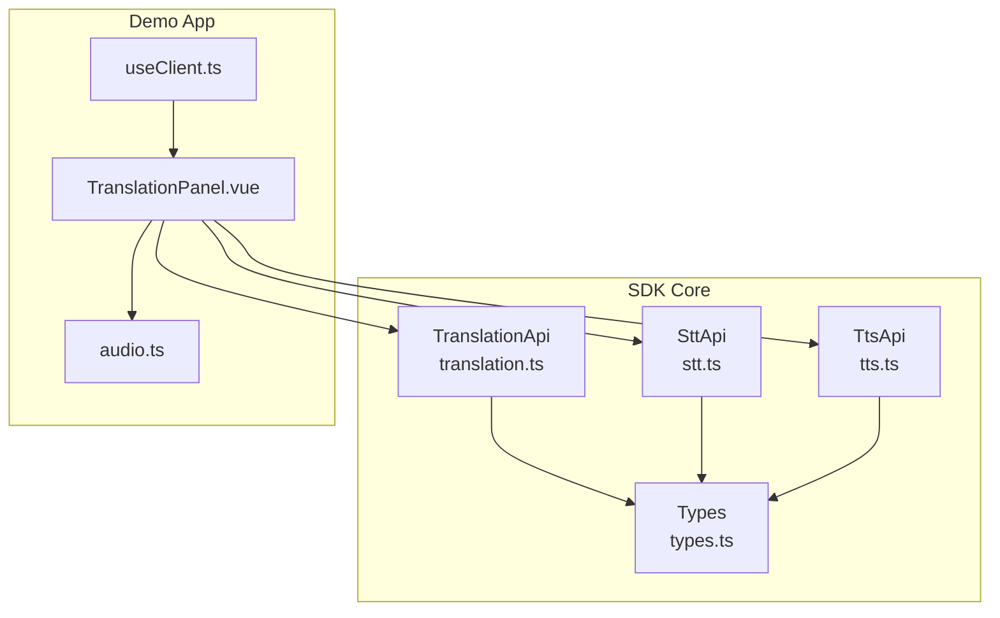
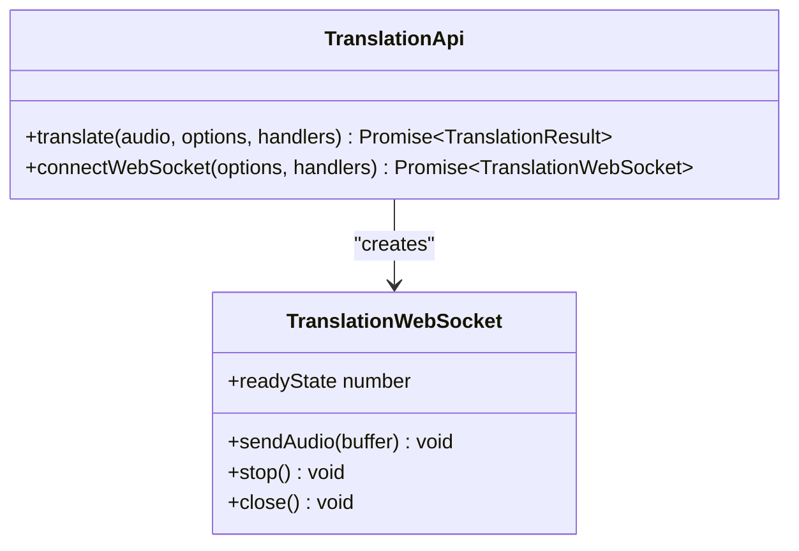
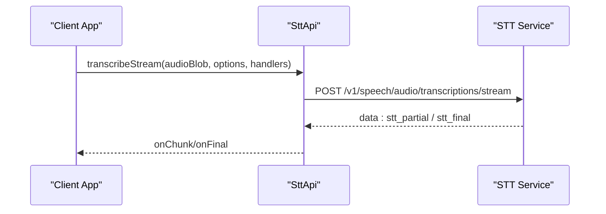
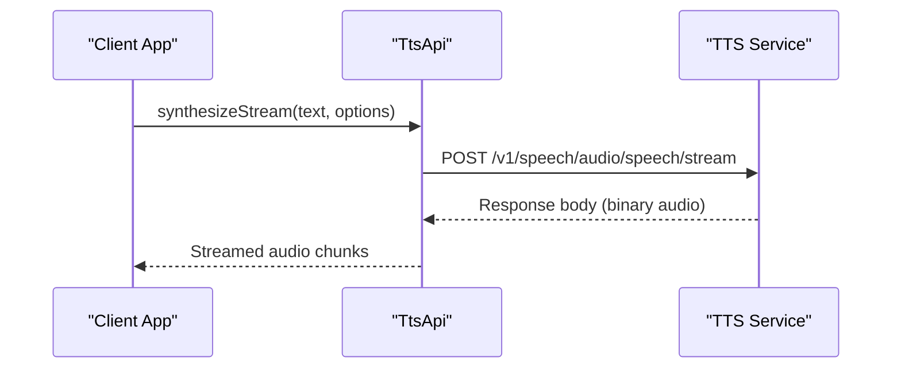
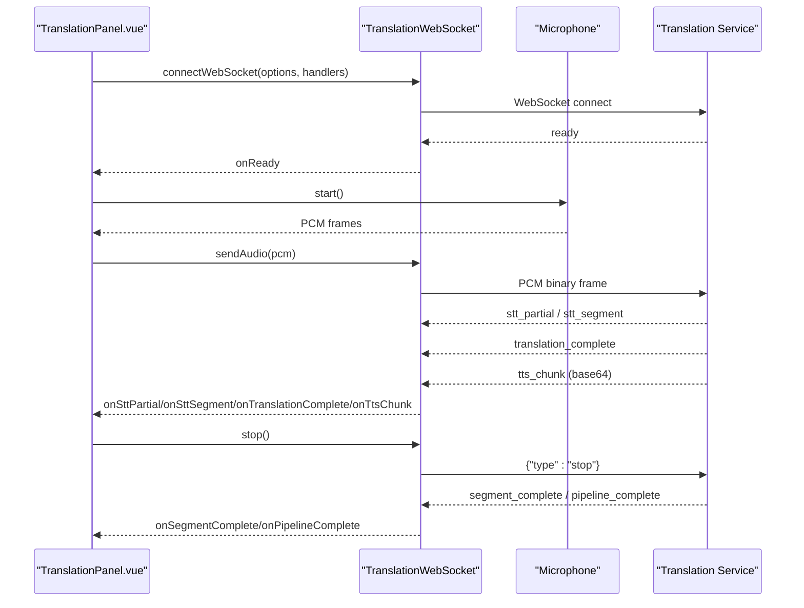
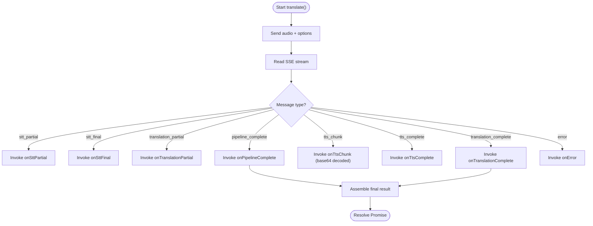
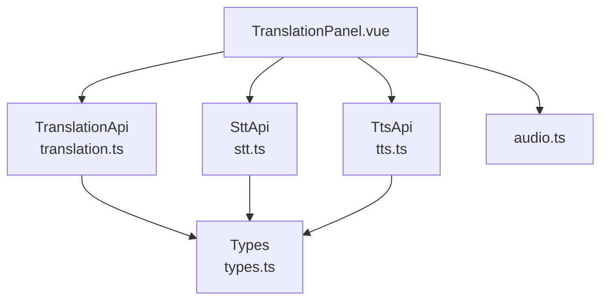

# Translation Pipeline Overview

<cite>
**Referenced Files in This Document**
- [translation.ts](file://src/translation.ts)
- [stt.ts](file://src/stt.ts)
- [tts.ts](file://src/tts.ts)
- [types.ts](file://src/types.ts)
- [TranslationPanel.vue](file://demo/src/components/TranslationPanel.vue)
- [audio.ts](file://demo/src/utils/audio.ts)
- [useClient.ts](file://demo/src/composables/useClient.ts)
- [README.md](file://README.md)
</cite>

## Table of Contents
1. [Introduction](#introduction)
2. [Project Structure](#project-structure)
3. [Core Components](#core-components)
4. [Architecture Overview](#architecture-overview)
5. [Detailed Component Analysis](#detailed-component-analysis)
6. [Dependency Analysis](#dependency-analysis)
7. [Performance Considerations](#performance-considerations)
8. [Troubleshooting Guide](#troubleshooting-guide)
9. [Conclusion](#conclusion)
10. [Appendices](#appendices)

## Introduction
This document presents a comprehensive overview of the Translation service architecture, focusing on the end-to-end STT → Translation → TTS pipeline. It explains the three-stage translation process, data flow between components, and system integration patterns. The unified API design abstracts complex audio processing into simple method calls, enabling both real-time streaming and batch processing. The document also highlights the WebSocket-based streaming architecture and its advantages over traditional REST APIs, along with conceptual examples demonstrating end-to-end translation scenarios.

## Project Structure
The translation pipeline spans several modules:
- Translation API and WebSocket wrapper for the STT → Translation → TTS pipeline
- STT module for speech-to-text with SSE and WebSocket streaming
- TTS module for text-to-speech synthesis with streaming and file operations
- Shared types defining message schemas and configuration options
- Demo application showcasing both batch and real-time translation workflows



**Diagram sources**
- [translation.ts:111-277](file://src/translation.ts#L111-L277)
- [stt.ts:83-217](file://src/stt.ts#L83-L217)
- [tts.ts:11-231](file://src/tts.ts#L11-L231)
- [types.ts:266-448](file://src/types.ts#L266-L448)
- [TranslationPanel.vue:1-469](file://demo/src/components/TranslationPanel.vue#L1-L469)
- [audio.ts:1-69](file://demo/src/utils/audio.ts#L1-L69)
- [useClient.ts:1-36](file://demo/src/composables/useClient.ts#L1-L36)

**Section sources**
- [README.md:1-845](file://README.md#L1-L845)
- [translation.ts:1-277](file://src/translation.ts#L1-L277)
- [stt.ts:1-217](file://src/stt.ts#L1-L217)
- [tts.ts:1-231](file://src/tts.ts#L1-L231)
- [types.ts:1-800](file://src/types.ts#L1-L800)
- [TranslationPanel.vue:1-469](file://demo/src/components/TranslationPanel.vue#L1-L469)
- [audio.ts:1-69](file://demo/src/utils/audio.ts#L1-L69)
- [useClient.ts:1-36](file://demo/src/composables/useClient.ts#L1-L36)

## Core Components
- TranslationApi: Provides batch translation via SSE and real-time translation via WebSocket. Handles pipeline events and returns final results.
- TranslationWebSocket: Wraps the WebSocket connection, decoding messages and invoking typed handlers for each pipeline stage.
- SttApi: Offers file transcription, SSE streaming, and real-time WebSocket transcription with segment boundaries.
- TtsApi: Synthesizes speech from text, supports streaming and voice management operations.
- Types: Defines message schemas for SSE and WebSocket pipelines, configuration options, and result structures.

Key responsibilities:
- Unified API design: Batch and streaming methods abstract audio processing complexity.
- Typed handlers: Developers receive structured messages for each stage, enabling real-time UI updates.
- WebSocket streaming: Enables continuous audio input with low-latency feedback and completion signaling.

**Section sources**
- [translation.ts:111-277](file://src/translation.ts#L111-L277)
- [stt.ts:83-217](file://src/stt.ts#L83-L217)
- [tts.ts:11-231](file://src/tts.ts#L11-L231)
- [types.ts:266-448](file://src/types.ts#L266-L448)

## Architecture Overview
The translation pipeline integrates STT, Translation, and TTS services:
- Batch mode (SSE): The TranslationApi streams events for STT partials, translation partials, TTS chunks, and pipeline completion.
- Real-time mode (WebSocket): The TranslationWebSocket manages PCM audio frames, emits live STT segments, translation results, and TTS audio chunks, concluding with segment and pipeline completion signals.

```mermaid
sequenceDiagram
participant Client as "Client App"
participant TR as "TranslationApi"
participant STT as "STT Service"
participant LLM as "Translation Engine"
participant TTS as "TTS Service"
Client->>TR : translate(audioBlob, options, handlers)
TR->>STT : Transcribe audio (SSE)
STT-->>TR : stt_partial / stt_final
TR->>LLM : Translate text (streaming)
LLM-->>TR : translation_partial / translation_complete
TR->>TTS : Synthesize audio (streaming)
TTS-->>TR : tts_chunk (base64) -> decode to ArrayBuffer
TR-->>Client : onSttPartial/onTranslationPartial/onTtsChunk/onPipelineComplete/onError
Note over Client,TR : Handlers invoked in real-time; final result assembled when pipeline completes
```

**Diagram sources**
- [translation.ts:132-228](file://src/translation.ts#L132-L228)
- [types.ts:268-346](file://src/types.ts#L268-L346)

**Section sources**
- [translation.ts:111-277](file://src/translation.ts#L111-L277)
- [types.ts:266-448](file://src/types.ts#L266-L448)

## Detailed Component Analysis

### Translation API and WebSocket
The TranslationApi exposes two primary workflows:
- translate(): Sends audio via multipart/form-data and parses SSE events to deliver real-time updates and a final result.
- connectWebSocket(): Establishes a WebSocket connection for continuous audio input and receives typed messages for each pipeline stage.

The TranslationWebSocket wraps the underlying WebSocket, decoding incoming messages and routing them to appropriate handlers. It supports sending PCM audio frames and signaling completion with a stop command.



**Diagram sources**
- [translation.ts:111-277](file://src/translation.ts#L111-L277)

**Section sources**
- [translation.ts:111-277](file://src/translation.ts#L111-L277)
- [types.ts:348-427](file://src/types.ts#L348-L427)

### STT Pipeline Integration
The STT module provides:
- transcribe(): Batch transcription for uploaded audio.
- transcribeStream(): SSE streaming for incremental partial results and final transcription.
- connectWebSocket(): Real-time WebSocket transcription with segment boundaries and timestamps.

These capabilities feed into the translation pipeline, emitting partial and final STT results that drive translation and TTS stages.



**Diagram sources**
- [stt.ts:116-183](file://src/stt.ts#L116-L183)
- [types.ts:168-188](file://src/types.ts#L168-L188)

**Section sources**
- [stt.ts:83-217](file://src/stt.ts#L83-L217)
- [types.ts:168-264](file://src/types.ts#L168-L264)

### TTS Pipeline Integration
The TTS module provides:
- synthesize(): Returns synthesized audio as an ArrayBuffer.
- synthesizeStream(): Streams audio for long-form content or low-latency playback.
- Voice management: Listing models, speakers, and managing custom voices.

In the translation pipeline, TTS consumes translated text and emits audio chunks that are decoded and played back in real-time.



**Diagram sources**
- [tts.ts:44-66](file://src/tts.ts#L44-L66)
- [types.ts:128-151](file://src/types.ts#L128-L151)

**Section sources**
- [tts.ts:11-231](file://src/tts.ts#L11-L231)
- [types.ts:128-151](file://src/types.ts#L128-L151)

### Real-time Translation Workflow (WebSocket)
The demo demonstrates a real-time translation scenario using a microphone:
- connectWebSocket() establishes a session and waits for a ready signal.
- Upon readiness, the demo starts capturing microphone PCM frames and sends them via sendAudio().
- The pipeline emits stt_partial, stt_segment, translation_complete, tts_chunk, segment_complete, and pipeline_complete.
- The demo accumulates TTS chunks per segment and plays them back as audio URLs.



**Diagram sources**
- [TranslationPanel.vue:156-270](file://demo/src/components/TranslationPanel.vue#L156-L270)
- [translation.ts:258-275](file://src/translation.ts#L258-L275)
- [types.ts:348-427](file://src/types.ts#L348-L427)

**Section sources**
- [TranslationPanel.vue:122-270](file://demo/src/components/TranslationPanel.vue#L122-L270)
- [translation.ts:258-275](file://src/translation.ts#L258-L275)
- [types.ts:348-427](file://src/types.ts#L348-L427)

### Batch Translation Workflow (SSE)
The demo’s file translation path illustrates the SSE pipeline:
- translate() sends the audio file and options to the server.
- Handlers receive stt_partial, stt_final, translation_partial, translation_complete, tts_chunk, tts_complete, pipeline_complete, and error messages.
- The final result is assembled from pipeline_complete and translation_complete messages.



**Diagram sources**
- [translation.ts:132-228](file://src/translation.ts#L132-L228)
- [types.ts:268-346](file://src/types.ts#L268-L346)

**Section sources**
- [translation.ts:132-228](file://src/translation.ts#L132-L228)
- [TranslationPanel.vue:30-120](file://demo/src/components/TranslationPanel.vue#L30-L120)
- [types.ts:268-346](file://src/types.ts#L268-L346)

## Dependency Analysis
The translation pipeline depends on STT and TTS services, with the TranslationApi orchestrating message handling and result assembly. The demo components depend on the TranslationApi and use helper utilities for audio manipulation.



**Diagram sources**
- [translation.ts:111-277](file://src/translation.ts#L111-L277)
- [stt.ts:83-217](file://src/stt.ts#L83-L217)
- [tts.ts:11-231](file://src/tts.ts#L11-L231)
- [types.ts:266-448](file://src/types.ts#L266-L448)
- [TranslationPanel.vue:1-469](file://demo/src/components/TranslationPanel.vue#L1-L469)
- [audio.ts:1-69](file://demo/src/utils/audio.ts#L1-L69)

**Section sources**
- [translation.ts:111-277](file://src/translation.ts#L111-L277)
- [stt.ts:83-217](file://src/stt.ts#L83-L217)
- [tts.ts:11-231](file://src/tts.ts#L11-L231)
- [types.ts:266-448](file://src/types.ts#L266-L448)
- [TranslationPanel.vue:1-469](file://demo/src/components/TranslationPanel.vue#L1-L469)
- [audio.ts:1-69](file://demo/src/utils/audio.ts#L1-L69)

## Performance Considerations
- Streaming audio: WebSocket enables continuous PCM frames with minimal latency, suitable for real-time translation.
- Chunked audio: TTS emits audio chunks that can be played back immediately, reducing perceived latency.
- Buffer management: Accumulate TTS chunks per segment and merge at pipeline completion for optimal playback.
- Format handling: Convert PCM to WAV for playback when needed; otherwise, stream formats like MP3 directly.
- Network efficiency: Use SSE for batch processing to minimize overhead compared to polling.

[No sources needed since this section provides general guidance]

## Troubleshooting Guide
Common issues and resolutions:
- Authentication failures: Ensure the correct authentication mode is configured and tokens are refreshed as needed.
- WebSocket errors: Listen for error messages and handle reconnection logic; verify token exchange for WebSocket connections.
- Audio format mismatches: Confirm response_format and sample_rate match the expected audio container and sample rate.
- Pipeline interruptions: Handle error messages per stage and segment; the pipeline continues processing subsequent segments.

**Section sources**
- [types.ts:321-404](file://src/types.ts#L321-L404)
- [translation.ts:18-36](file://src/translation.ts#L18-L36)
- [TranslationPanel.vue:240-244](file://demo/src/components/TranslationPanel.vue#L240-L244)

## Conclusion
The Translation service architecture delivers a unified, developer-friendly API for end-to-end audio translation. Through SSE and WebSocket integrations, it supports both batch and real-time workflows, enabling live subtitles, incremental translations, and streamed audio synthesis. The demo showcases practical usage patterns, including segment-based processing, audio chunk accumulation, and completion signaling. The WebSocket-based streaming architecture offers significant advantages over traditional REST APIs by enabling continuous, low-latency audio processing with structured event-driven callbacks.

[No sources needed since this section summarizes without analyzing specific files]

## Appendices

### Unified API Design Highlights
- Batch translation: translate() returns a final result after streaming events for each pipeline stage.
- Real-time translation: connectWebSocket() manages PCM frames and emits typed messages for live UI updates.
- Typed handlers: Developers receive structured messages with metadata for language, timing, and audio characteristics.
- Configurable options: source_lang, target_lang, translation_mode, voice, response_format, and tts_enabled control pipeline behavior.

**Section sources**
- [translation.ts:111-277](file://src/translation.ts#L111-L277)
- [types.ts:429-448](file://src/types.ts#L429-L448)

### Conceptual Examples
- File translation: Upload an audio file, observe live STT and translation updates, and receive synthesized audio.
- Real-time translation: Start a WebSocket session, send microphone PCM frames, and receive live translation with audio playback per segment.

**Section sources**
- [README.md:341-408](file://README.md#L341-L408)
- [TranslationPanel.vue:30-120](file://demo/src/components/TranslationPanel.vue#L30-L120)
- [TranslationPanel.vue:156-270](file://demo/src/components/TranslationPanel.vue#L156-L270)