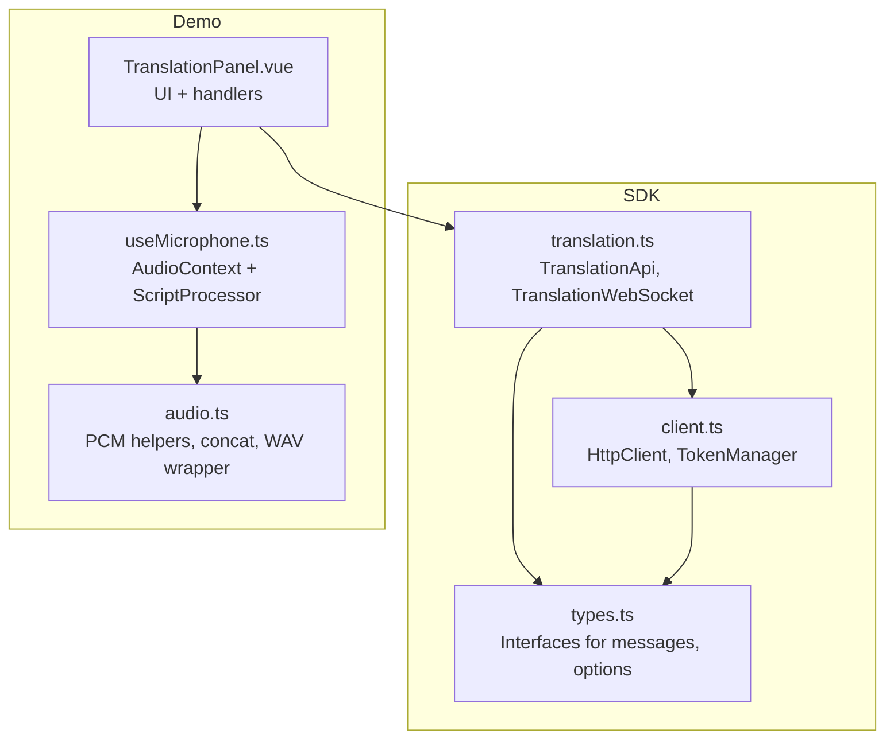
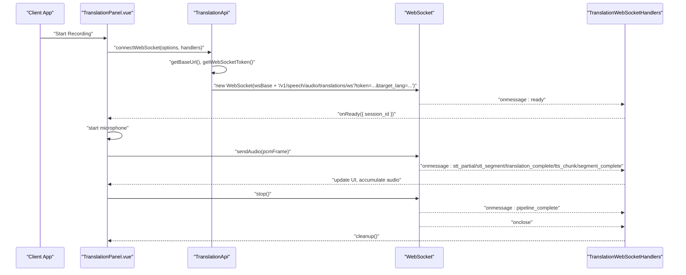
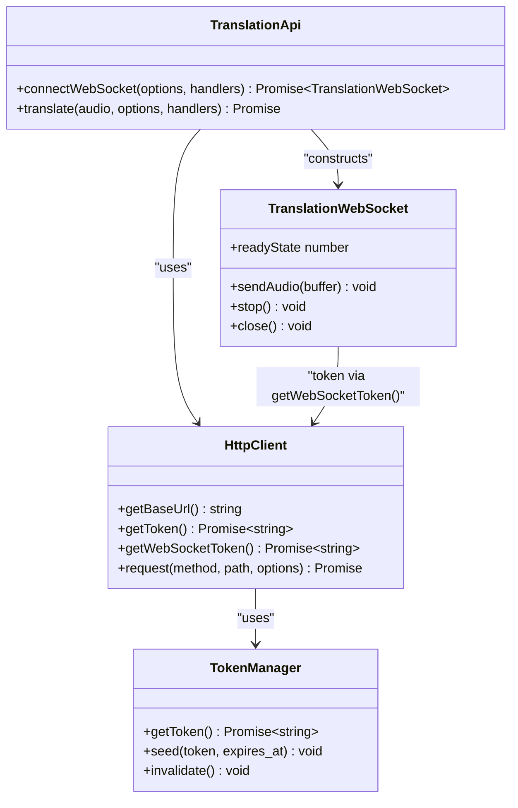

# WebSocket Translation API

<cite>
**Referenced Files in This Document**
- [translation.ts](file://src/translation.ts)
- [client.ts](file://src/client.ts)
- [types.ts](file://src/types.ts)
- [TranslationPanel.vue](file://demo/src/components/TranslationPanel.vue)
- [useMicrophone.ts](file://demo/src/composables/useMicrophone.ts)
- [audio.ts](file://demo/src/utils/audio.ts)
- [README.md](file://README.md)
</cite>

## Table of Contents
1. [Introduction](#introduction)
2. [Project Structure](#project-structure)
3. [Core Components](#core-components)
4. [Architecture Overview](#architecture-overview)
5. [Detailed Component Analysis](#detailed-component-analysis)
6. [Dependency Analysis](#dependency-analysis)
7. [Performance Considerations](#performance-considerations)
8. [Troubleshooting Guide](#troubleshooting-guide)
9. [Conclusion](#conclusion)
10. [Appendices](#appendices)

## Introduction
This document provides comprehensive WebSocket API documentation for real-time translation streaming. It covers connection establishment, authentication token handling, query parameter configuration, WebSocket message types, and the TranslationWebSocket class methods. It also includes practical examples, audio format requirements, timing considerations, and best practices for building robust real-time translation applications.

## Project Structure
The WebSocket translation feature is implemented in the SDK’s translation module and integrates with the HTTP client and authentication systems. The demo application demonstrates real-time audio streaming from a microphone into the translation pipeline.

**Diagram sources**
- [translation.ts:111-277](file://src/translation.ts#L111-L277)
- [client.ts:93-213](file://src/client.ts#L93-L213)
- [types.ts:348-448](file://src/types.ts#L348-L448)
- [TranslationPanel.vue:122-270](file://demo/src/components/TranslationPanel.vue#L122-L270)
- [useMicrophone.ts:8-45](file://demo/src/composables/useMicrophone.ts#L8-L45)
- [audio.ts:28-69](file://demo/src/utils/audio.ts#L28-L69)

**Section sources**
- [translation.ts:111-277](file://src/translation.ts#L111-L277)
- [client.ts:93-213](file://src/client.ts#L93-L213)
- [types.ts:348-448](file://src/types.ts#L348-L448)
- [TranslationPanel.vue:122-270](file://demo/src/components/TranslationPanel.vue#L122-L270)
- [useMicrophone.ts:8-45](file://demo/src/composables/useMicrophone.ts#L8-L45)
- [audio.ts:28-69](file://demo/src/utils/audio.ts#L28-L69)

## Core Components
- TranslationApi: Provides connectWebSocket() to establish a WebSocket connection and translate() for SSE-based translation.
- TranslationWebSocket: Wraps a WebSocket with typed message dispatching and convenience methods for sending PCM frames and signaling stop.
- HttpClient and TokenManager: Handle authentication, token provisioning, and WebSocket token exchange.
- Types: Define message schemas, handler interfaces, and option interfaces for translation WebSocket.

Key responsibilities:
- Build WebSocket URL with token and query parameters.
- Dispatch incoming messages to handlers.
- Send PCM audio frames and stop signals.
- Manage connection lifecycle and readiness.

**Section sources**
- [translation.ts:38-109](file://src/translation.ts#L38-L109)
- [translation.ts:111-277](file://src/translation.ts#L111-L277)
- [client.ts:93-131](file://src/client.ts#L93-L131)
- [types.ts:348-448](file://src/types.ts#L348-L448)

## Architecture Overview
The WebSocket translation pipeline connects the client to the server via a WebSocket URL constructed from the base URL, a token, and query parameters. The server streams translation results in real time, and the client sends PCM audio frames and a stop signal to finalize the session.

**Diagram sources**
- [translation.ts:258-277](file://src/translation.ts#L258-L277)
- [translation.ts:38-109](file://src/translation.ts#L38-L109)
- [TranslationPanel.vue:156-270](file://demo/src/components/TranslationPanel.vue#L156-L270)

## Detailed Component Analysis

### WebSocket Connection Establishment
- URL construction:
  - Base URL is derived from the client configuration.
  - Replace http/https with ws/wss to construct the WebSocket endpoint.
  - Append query parameters including token, target_lang, optional source_lang, voice, translation_mode, tts_enabled, and response_format.
- Authentication:
  - WebSocket tokens are session tokens (stk_ prefix) obtained via getWebSocketToken().
  - The SDK automatically exchanges access tokens for session tokens when needed.
- Handler wiring:
  - The SDK wraps the WebSocket and routes incoming messages to typed handlers.

Practical example (from demo):
- Start recording triggers connectWebSocket() with options like target_lang, source_lang, translation_mode, tts_enabled, and response_format.
- On receiving ready, the demo starts the microphone and begins streaming PCM frames.

**Section sources**
- [translation.ts:258-277](file://src/translation.ts#L258-L277)
- [client.ts:126-131](file://src/client.ts#L126-L131)
- [TranslationPanel.vue:156-270](file://demo/src/components/TranslationPanel.vue#L156-L270)

### WebSocket Message Types and Payloads
The server emits the following message types over the WebSocket. The SDK dispatches them to handlers and decodes audio payloads where applicable.

- ready
  - Purpose: Session established.
  - Payload: { type: "ready"; session_id: string }
  - Handler: onReady

- stt_partial
  - Purpose: Real-time ASR partial result.
  - Payload: { type: "stt_partial"; text: string; language: string; segment: number }
  - Handler: onSttPartial

- stt_segment
  - Purpose: Finalized segment boundary.
  - Payload: { type: "stt_segment"; text: string; language: string; segment_index: number }
  - Handler: onSttSegment

- translation_complete
  - Purpose: Translation result for one segment.
  - Payload: { type: "translation_complete"; text: string; source_lang: string; target_lang: string; segment_index: number }
  - Handler: onTranslationComplete

- tts_chunk
  - Purpose: TTS audio chunk.
  - Payload: { type: "tts_chunk"; audio: string; format: "pcm"|"wav"|"mp3"; chunk_index: number; sample_rate: number; segment_index: number }
  - Handler: onTtsChunk receives ArrayBuffer (SDK decodes base64 internally)
  - Note: The demo accumulates chunks per segment_index and plays upon segment completion.

- segment_complete
  - Purpose: Segment fully processed.
  - Payload: { type: "segment_complete"; segment_index: number; source_text: string; translated_text: string }
  - Handler: onSegmentComplete

- pipeline_complete
  - Purpose: All segments processed.
  - Payload: { type: "pipeline_complete"; duration: number }
  - Handler: onPipelineComplete

- error
  - Purpose: Pipeline error with optional stage and segment_index.
  - Payload: { type: "error"; message: string; stage?: string; segment_index?: number }
  - Handler: onError

**Section sources**
- [translation.ts:38-109](file://src/translation.ts#L38-L109)
- [types.ts:348-414](file://src/types.ts#L348-L414)
- [TranslationPanel.vue:176-250](file://demo/src/components/TranslationPanel.vue#L176-L250)

### TranslationWebSocket Class Methods
- Constructor
  - Wraps a WebSocket and sets up onmessage routing to handlers.
  - Supports onClose handler for connection closure.
- sendAudio(buffer)
  - Sends PCM frames as ArrayBuffer or Int16Array when the socket is OPEN.
  - The demo uses a microphone ScriptProcessor to produce 16-bit PCM frames at 16 kHz.
- stop()
  - Sends a JSON control message {"type":"stop"} to signal end of audio.
  - The server flushes buffered audio and closes the connection after processing.
- close()
  - Explicitly closes the underlying WebSocket.
- readyState
  - Exposes the underlying WebSocket readyState.

Timing and streaming patterns:
- The demo sends PCM frames continuously while the microphone is active.
- After stop() is called, the demo waits for pipeline_complete and onClose to finalize UI cleanup.

**Section sources**
- [translation.ts:38-109](file://src/translation.ts#L38-L109)
- [TranslationPanel.vue:258-270](file://demo/src/components/TranslationPanel.vue#L258-L270)
- [useMicrophone.ts:8-45](file://demo/src/composables/useMicrophone.ts#L8-L45)

### Audio Format Requirements and Timing
- Audio format:
  - PCM frames: 16-bit signed integers, mono, little-endian.
  - Sample rate: 16 kHz (as configured in the demo microphone).
- Frame size and timing:
  - The demo uses a ScriptProcessor with a fixed buffer size; adjust frame sizes to balance latency and CPU usage.
  - The server may emit segment boundaries and timestamps; use segment_index to group audio chunks.
- Playback:
  - The SDK delivers audio as base64-encoded strings; the demo decodes to ArrayBuffer and optionally wraps PCM in WAV for playback.

Best practices:
- Always check readyState before sending audio.
- Group tts_chunk by segment_index to render per-segment audio and merge at the end.
- Use stop() to gracefully flush remaining audio; do not assume immediate closure.
- Handle error messages and recover by reconnecting or notifying the user.

**Section sources**
- [translation.ts:66-72](file://src/translation.ts#L66-L72)
- [TranslationPanel.vue:205-237](file://demo/src/components/TranslationPanel.vue#L205-L237)
- [audio.ts:28-69](file://demo/src/utils/audio.ts#L28-L69)
- [useMicrophone.ts:8-45](file://demo/src/composables/useMicrophone.ts#L8-L45)

### Practical Examples

#### Real-time Translation Setup
- Initialize client with an authentication mode (publishableKey, accessToken, apiKey, or appId).
- Call connectWebSocket() with options:
  - target_lang: required
  - source_lang: optional
  - translation_mode: "llm" or "mt"
  - tts_enabled: boolean
  - response_format: "pcm", "wav", or "mp3"
- Register handlers for onReady, onSttPartial, onSttSegment, onTranslationComplete, onTtsChunk, onSegmentComplete, onPipelineComplete, onError, onClose.

**Section sources**
- [translation.ts:258-277](file://src/translation.ts#L258-L277)
- [TranslationPanel.vue:156-270](file://demo/src/components/TranslationPanel.vue#L156-L270)

#### Audio Streaming Patterns
- Start microphone capture and convert Float32 frames to 16-bit PCM.
- Send frames via sendAudio() while recording.
- Stop streaming with stop() to flush and finalize.

**Section sources**
- [useMicrophone.ts:8-45](file://demo/src/composables/useMicrophone.ts#L8-L45)
- [TranslationPanel.vue:154-155](file://demo/src/components/TranslationPanel.vue#L154-L155)

#### Partial Results and UI Updates
- Update live subtitles with stt_partial.
- Push finalized segments to a list on stt_segment.
- Accumulate translations and TTS chunks per segment_index.

**Section sources**
- [TranslationPanel.vue:184-244](file://demo/src/components/TranslationPanel.vue#L184-L244)

#### Connection Error Recovery
- Listen for error messages and onClose.
- Optionally reconnect with a backoff strategy; reinitialize handlers and resume streaming after onReady.

**Section sources**
- [translation.ts:79-82](file://src/translation.ts#L79-L82)
- [TranslationPanel.vue:246-250](file://demo/src/components/TranslationPanel.vue#L246-L250)

## Dependency Analysis
The WebSocket translation feature depends on:
- HttpClient for base URL and token retrieval.
- TokenManager for session token provisioning and refresh.
- TranslationApi for constructing the WebSocket URL and wrapping the connection.
- TranslationWebSocket for message dispatching and audio control.
- Demo utilities for microphone capture and PCM conversion.

**Diagram sources**
- [client.ts:93-131](file://src/client.ts#L93-L131)
- [translation.ts:111-277](file://src/translation.ts#L111-L277)

**Section sources**
- [client.ts:93-131](file://src/client.ts#L93-L131)
- [translation.ts:111-277](file://src/translation.ts#L111-L277)

## Performance Considerations
- Latency:
  - Use 16 kHz mono PCM frames for optimal performance.
  - Keep frame sizes small to reduce latency; balance with CPU usage.
- Bandwidth:
  - TTS audio is streamed as base64; decode once and cache buffers per segment.
- Reliability:
  - Monitor readyState before sending audio.
  - Implement stop() to flush buffered audio and avoid gaps.
- UI responsiveness:
  - Debounce subtitle updates and render per segment for smooth playback.

[No sources needed since this section provides general guidance]

## Troubleshooting Guide
Common issues and resolutions:
- Authentication failures:
  - Ensure the correct authentication mode is configured.
  - For access tokens, provide a refresh callback if tokens expire frequently.
- WebSocket token exchange:
  - The SDK automatically exchanges tokens for WebSocket connections; verify token providers are configured.
- Connection closures:
  - Handle onClose and re-establish the session if needed.
- Audio glitches:
  - Verify PCM frame format (16-bit, mono, 16 kHz).
  - Ensure continuous frame delivery until stop() is called.

**Section sources**
- [client.ts:126-131](file://src/client.ts#L126-L131)
- [translation.ts:79-82](file://src/translation.ts#L79-L82)
- [TranslationPanel.vue:246-250](file://demo/src/components/TranslationPanel.vue#L246-L250)

## Conclusion
The WebSocket translation API enables real-time STT → Translation → TTS streaming with precise control over audio frames and pipeline events. By following the documented connection flow, message handling, and best practices, developers can build responsive, resilient translation experiences.

[No sources needed since this section summarizes without analyzing specific files]

## Appendices

### WebSocket URL Construction Details
- Base URL: http/https from client configuration.
- WebSocket URL: ws/wss endpoint with query parameters:
  - token: session token for WebSocket authentication.
  - target_lang: required.
  - source_lang: optional.
  - voice: optional.
  - translation_mode: "llm" or "mt".
  - tts_enabled: boolean.
  - response_format: "pcm", "wav", or "mp3".

**Section sources**
- [translation.ts:258-277](file://src/translation.ts#L258-L277)
- [client.ts:126-131](file://src/client.ts#L126-L131)

### Message Type Reference
- ready: Session established.
- stt_partial: Live ASR partial text.
- stt_segment: Finalized segment boundary.
- translation_complete: Segment translation result.
- tts_chunk: Base64-encoded audio chunk; SDK decodes to ArrayBuffer.
- segment_complete: Segment audio ready.
- pipeline_complete: All segments processed.
- error: Error with optional stage and segment_index.

**Section sources**
- [types.ts:348-414](file://src/types.ts#L348-L414)
- [translation.ts:38-109](file://src/translation.ts#L38-L109)

### Demo Usage Notes
- The demo demonstrates:
  - Connecting to the WebSocket and handling ready.
  - Streaming PCM frames from the microphone.
  - Rendering live subtitles and translations.
  - Playing per-segment and full audio after completion.

**Section sources**
- [TranslationPanel.vue:156-270](file://demo/src/components/TranslationPanel.vue#L156-L270)
- [useMicrophone.ts:8-45](file://demo/src/composables/useMicrophone.ts#L8-L45)
- [audio.ts:28-69](file://demo/src/utils/audio.ts#L28-L69)